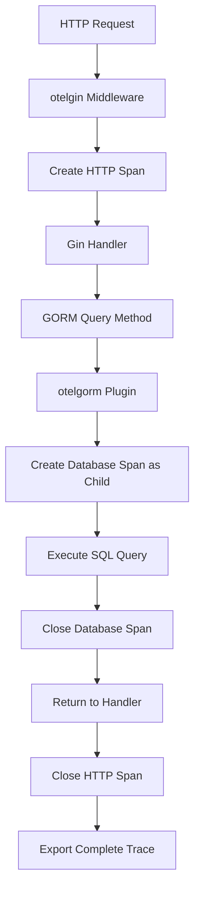

# How to Trace Gin HTTP Requests and GORM Database Queries with OpenTelemetry

Author: [nawazdhandala](https://www.github.com/nawazdhandala)

Tags: OpenTelemetry, Go, Gin, GORM, Database, HTTP Tracing

Description: Implement end-to-end tracing in Go applications by combining Gin HTTP instrumentation with GORM database query tracing using OpenTelemetry.

Building observable applications requires visibility into both HTTP request handling and database operations. When you combine Gin for HTTP routing with GORM for database access, you need to ensure traces flow seamlessly from incoming requests through to database queries. This creates a complete picture of where time is spent and where failures occur in your application stack.

## Why Trace Both HTTP and Database Layers

Modern web applications typically spend the majority of their time in two places: waiting for HTTP responses and executing database queries. Without proper instrumentation, you might see that a request took 500ms to complete, but have no idea whether the time was spent in the database, waiting for external APIs, or in business logic.

By instrumenting both layers, you can see:

- Which database queries are slow
- How many queries each endpoint executes
- Whether you have N+1 query problems
- The exact sequence of operations in a request
- Where errors originate in the stack

## Setting Up Dependencies

You need packages for both HTTP and database instrumentation, plus the OpenTelemetry SDK.

```bash
# Core Gin and GORM packages
go get -u github.com/gin-gonic/gin
go get -u gorm.io/gorm
go get -u gorm.io/driver/mysql  # or postgres, sqlite, etc.

# OpenTelemetry core packages
go get -u go.opentelemetry.io/otel
go get -u go.opentelemetry.io/otel/sdk
go get -u go.opentelemetry.io/otel/exporters/otlp/otlptrace/otlptracegrpc

# Instrumentation libraries
go get -u go.opentelemetry.io/contrib/instrumentation/github.com/gin-gonic/gin/otelgin
go get -u go.opentelemetry.io/contrib/instrumentation/gorm.io/gorm/otelgorm
```

## Initializing OpenTelemetry

Before instrumenting either layer, you need to set up the OpenTelemetry tracer provider.

```go
package main

import (
    "context"
    "log"
    "time"

    "go.opentelemetry.io/otel"
    "go.opentelemetry.io/otel/exporters/otlp/otlptrace/otlptracegrpc"
    "go.opentelemetry.io/otel/sdk/resource"
    sdktrace "go.opentelemetry.io/otel/sdk/trace"
    semconv "go.opentelemetry.io/otel/semconv/v1.17.0"
)

// setupTracer initializes OpenTelemetry with OTLP exporter
// This configuration works with Jaeger, OneUptime, or any OTLP-compatible backend
func setupTracer() (*sdktrace.TracerProvider, error) {
    ctx := context.Background()

    // Configure OTLP exporter to send traces via gRPC
    exporter, err := otlptracegrpc.New(
        ctx,
        otlptracegrpc.WithInsecure(), // Use TLS in production
        otlptracegrpc.WithEndpoint("localhost:4317"),
    )
    if err != nil {
        return nil, err
    }

    // Define service resource attributes
    res := resource.NewWithAttributes(
        semconv.SchemaURL,
        semconv.ServiceNameKey.String("user-api"),
        semconv.ServiceVersionKey.String("1.0.0"),
        semconv.DeploymentEnvironmentKey.String("production"),
    )

    // Create tracer provider with batch processor
    tp := sdktrace.NewTracerProvider(
        sdktrace.WithBatcher(exporter,
            sdktrace.WithBatchTimeout(5*time.Second),
            sdktrace.WithMaxExportBatchSize(512),
        ),
        sdktrace.WithResource(res),
        sdktrace.WithSampler(sdktrace.AlwaysSample()),
    )

    // Register as global tracer provider
    otel.SetTracerProvider(tp)

    return tp, nil
}
```

## Instrumenting GORM Database Connection

GORM provides a plugin system that makes instrumentation straightforward. The otelgorm plugin automatically creates spans for all database operations.

```go
import (
    "gorm.io/driver/mysql"
    "gorm.io/gorm"
    "go.opentelemetry.io/contrib/instrumentation/gorm.io/gorm/otelgorm"
)

// initDB creates a GORM database connection with OpenTelemetry instrumentation
func initDB() (*gorm.DB, error) {
    // Configure database connection
    dsn := "user:password@tcp(localhost:3306)/dbname?charset=utf8mb4&parseTime=True"

    db, err := gorm.Open(mysql.Open(dsn), &gorm.Config{
        // Disable default transactions for better performance
        SkipDefaultTransaction: true,
        // Prepare statements for better performance
        PrepareStmt: true,
    })
    if err != nil {
        return nil, err
    }

    // Add OpenTelemetry plugin to GORM
    // This instruments all queries, including those made by associations
    if err := db.Use(otelgorm.NewPlugin()); err != nil {
        return nil, err
    }

    return db, nil
}
```

## Setting Up Gin Router with Instrumentation

With the database instrumented, add HTTP tracing to your Gin router.

```go
import (
    "github.com/gin-gonic/gin"
    "go.opentelemetry.io/contrib/instrumentation/github.com/gin-gonic/gin/otelgin"
)

// setupRouter creates a Gin router with OpenTelemetry middleware
func setupRouter(db *gorm.DB) *gin.Engine {
    router := gin.Default()

    // Add OpenTelemetry middleware to trace all HTTP requests
    router.Use(otelgin.Middleware("user-api"))

    // Create service layer with database connection
    userService := &UserService{db: db}

    // Register routes
    router.GET("/users", userService.ListUsers)
    router.GET("/users/:id", userService.GetUser)
    router.POST("/users", userService.CreateUser)
    router.PUT("/users/:id", userService.UpdateUser)
    router.DELETE("/users/:id", userService.DeleteUser)

    return router
}
```

## Understanding the Trace Flow

When a request comes in, both middleware layers work together to create a complete trace:



## Implementing Database Operations with Tracing

The key to making this work is extracting the context from Gin and passing it to GORM operations using `WithContext()`.

```go
import (
    "context"
    "net/http"

    "github.com/gin-gonic/gin"
    "gorm.io/gorm"
)

type User struct {
    ID        uint      `json:"id" gorm:"primaryKey"`
    Name      string    `json:"name"`
    Email     string    `json:"email" gorm:"uniqueIndex"`
    Age       int       `json:"age"`
    CreatedAt time.Time `json:"created_at"`
}

type UserService struct {
    db *gorm.DB
}

// ListUsers retrieves all users with tracing
func (s *UserService) ListUsers(c *gin.Context) {
    // Extract context from Gin - contains HTTP span
    ctx := c.Request.Context()

    var users []User

    // Use WithContext to propagate trace to database layer
    // This creates a child span for the query
    result := s.db.WithContext(ctx).Find(&users)

    if result.Error != nil {
        c.JSON(http.StatusInternalServerError, gin.H{
            "error": "Failed to fetch users",
        })
        return
    }

    c.JSON(http.StatusOK, gin.H{
        "users": users,
        "count": len(users),
    })
}

// GetUser retrieves a single user by ID
func (s *UserService) GetUser(c *gin.Context) {
    ctx := c.Request.Context()
    userID := c.Param("id")

    var user User

    // GORM's First method with context creates a traced query
    result := s.db.WithContext(ctx).First(&user, userID)

    if result.Error != nil {
        if result.Error == gorm.ErrRecordNotFound {
            c.JSON(http.StatusNotFound, gin.H{
                "error": "User not found",
            })
            return
        }
        c.JSON(http.StatusInternalServerError, gin.H{
            "error": "Database error",
        })
        return
    }

    c.JSON(http.StatusOK, user)
}

// CreateUser creates a new user record
func (s *UserService) CreateUser(c *gin.Context) {
    ctx := c.Request.Context()

    var user User
    if err := c.ShouldBindJSON(&user); err != nil {
        c.JSON(http.StatusBadRequest, gin.H{
            "error": err.Error(),
        })
        return
    }

    // Create operation is also traced when using WithContext
    result := s.db.WithContext(ctx).Create(&user)

    if result.Error != nil {
        c.JSON(http.StatusInternalServerError, gin.H{
            "error": "Failed to create user",
        })
        return
    }

    c.JSON(http.StatusCreated, user)
}

// UpdateUser updates an existing user
func (s *UserService) UpdateUser(c *gin.Context) {
    ctx := c.Request.Context()
    userID := c.Param("id")

    var updates User
    if err := c.ShouldBindJSON(&updates); err != nil {
        c.JSON(http.StatusBadRequest, gin.H{
            "error": err.Error(),
        })
        return
    }

    // Update with conditions creates a traced query
    result := s.db.WithContext(ctx).Model(&User{}).
        Where("id = ?", userID).
        Updates(updates)

    if result.Error != nil {
        c.JSON(http.StatusInternalServerError, gin.H{
            "error": "Failed to update user",
        })
        return
    }

    if result.RowsAffected == 0 {
        c.JSON(http.StatusNotFound, gin.H{
            "error": "User not found",
        })
        return
    }

    c.JSON(http.StatusOK, gin.H{
        "message": "User updated successfully",
    })
}

// DeleteUser removes a user by ID
func (s *UserService) DeleteUser(c *gin.Context) {
    ctx := c.Request.Context()
    userID := c.Param("id")

    // Delete operation is traced
    result := s.db.WithContext(ctx).Delete(&User{}, userID)

    if result.Error != nil {
        c.JSON(http.StatusInternalServerError, gin.H{
            "error": "Failed to delete user",
        })
        return
    }

    if result.RowsAffected == 0 {
        c.JSON(http.StatusNotFound, gin.H{
            "error": "User not found",
        })
        return
    }

    c.JSON(http.StatusOK, gin.H{
        "message": "User deleted successfully",
    })
}
```

## Tracing Complex Queries with Associations

GORM's association features like Preload and Joins are automatically traced when you use the plugin.

```go
type Post struct {
    ID        uint      `json:"id" gorm:"primaryKey"`
    UserID    uint      `json:"user_id"`
    Title     string    `json:"title"`
    Content   string    `json:"content"`
    CreatedAt time.Time `json:"created_at"`
}

type Comment struct {
    ID        uint      `json:"id" gorm:"primaryKey"`
    PostID    uint      `json:"post_id"`
    UserID    uint      `json:"user_id"`
    Content   string    `json:"content"`
    CreatedAt time.Time `json:"created_at"`
}

// Add associations to User model
type UserWithPosts struct {
    User
    Posts []Post `json:"posts" gorm:"foreignKey:UserID"`
}

// GetUserWithPosts retrieves a user and their posts in a single trace
func (s *UserService) GetUserWithPosts(c *gin.Context) {
    ctx := c.Request.Context()
    userID := c.Param("id")

    var user UserWithPosts

    // Preload creates separate spans for the main query and the association query
    result := s.db.WithContext(ctx).
        Preload("Posts").
        First(&user, userID)

    if result.Error != nil {
        c.JSON(http.StatusInternalServerError, gin.H{
            "error": "Failed to fetch user",
        })
        return
    }

    c.JSON(http.StatusOK, user)
}

// GetUserPostsWithComments demonstrates nested preloading
func (s *UserService) GetUserPostsWithComments(c *gin.Context) {
    ctx := c.Request.Context()
    userID := c.Param("id")

    type UserWithPostsAndComments struct {
        User
        Posts []struct {
            Post
            Comments []Comment `json:"comments" gorm:"foreignKey:PostID"`
        } `json:"posts" gorm:"foreignKey:UserID"`
    }

    var user UserWithPostsAndComments

    // Each Preload creates a separate child span
    // This helps identify N+1 query problems
    result := s.db.WithContext(ctx).
        Preload("Posts").
        Preload("Posts.Comments").
        First(&user, userID)

    if result.Error != nil {
        c.JSON(http.StatusInternalServerError, gin.H{
            "error": "Failed to fetch user",
        })
        return
    }

    c.JSON(http.StatusOK, user)
}
```

## Tracing Transactions

Database transactions are critical sections that should be traced to understand their performance impact.

```go
// CreateUserWithProfile creates a user and profile in a transaction
func (s *UserService) CreateUserWithProfile(c *gin.Context) {
    ctx := c.Request.Context()

    var request struct {
        Name     string `json:"name"`
        Email    string `json:"email"`
        Bio      string `json:"bio"`
        Location string `json:"location"`
    }

    if err := c.ShouldBindJSON(&request); err != nil {
        c.JSON(http.StatusBadRequest, gin.H{"error": err.Error()})
        return
    }

    // Begin transaction with context for tracing
    // The entire transaction is traced as a single operation
    err := s.db.WithContext(ctx).Transaction(func(tx *gorm.DB) error {
        // Create user - traced as child span
        user := User{
            Name:  request.Name,
            Email: request.Email,
        }
        if err := tx.Create(&user).Error; err != nil {
            return err
        }

        // Create profile - traced as separate child span
        profile := Profile{
            UserID:   user.ID,
            Bio:      request.Bio,
            Location: request.Location,
        }
        if err := tx.Create(&profile).Error; err != nil {
            return err
        }

        return nil
    })

    if err != nil {
        c.JSON(http.StatusInternalServerError, gin.H{
            "error": "Failed to create user and profile",
        })
        return
    }

    c.JSON(http.StatusCreated, gin.H{
        "message": "User and profile created successfully",
    })
}
```

## Adding Custom Spans for Business Logic

Sometimes you want to add spans around specific business logic that isn't automatically instrumented.

```go
import (
    "go.opentelemetry.io/otel"
    "go.opentelemetry.io/otel/attribute"
    "go.opentelemetry.io/otel/codes"
)

// SearchUsers performs a complex search with custom span
func (s *UserService) SearchUsers(c *gin.Context) {
    ctx := c.Request.Context()

    // Get search parameters
    query := c.Query("q")
    minAge := c.DefaultQuery("min_age", "0")
    maxAge := c.DefaultQuery("max_age", "100")

    // Create custom span for the search operation
    tracer := otel.Tracer("user-service")
    ctx, span := tracer.Start(ctx, "search_users",
        trace.WithAttributes(
            attribute.String("search.query", query),
            attribute.String("search.min_age", minAge),
            attribute.String("search.max_age", maxAge),
        ),
    )
    defer span.End()

    var users []User

    // Build complex query - each part is traced by otelgorm
    result := s.db.WithContext(ctx).
        Where("name LIKE ? OR email LIKE ?", "%"+query+"%", "%"+query+"%").
        Where("age BETWEEN ? AND ?", minAge, maxAge).
        Order("created_at DESC").
        Limit(50).
        Find(&users)

    if result.Error != nil {
        span.RecordError(result.Error)
        span.SetStatus(codes.Error, "Search failed")

        c.JSON(http.StatusInternalServerError, gin.H{
            "error": "Search failed",
        })
        return
    }

    span.SetAttributes(attribute.Int("search.results", len(users)))
    span.SetStatus(codes.Ok, "Search completed")

    c.JSON(http.StatusOK, gin.H{
        "query":   query,
        "results": users,
        "count":   len(users),
    })
}
```

## Handling Database Connection Pooling

GORM's connection pool settings can impact performance. Monitor these through spans.

```go
import (
    "time"
)

func initDBWithPooling() (*gorm.DB, error) {
    dsn := "user:password@tcp(localhost:3306)/dbname?charset=utf8mb4&parseTime=True"

    db, err := gorm.Open(mysql.Open(dsn), &gorm.Config{
        SkipDefaultTransaction: true,
        PrepareStmt:            true,
    })
    if err != nil {
        return nil, err
    }

    // Configure connection pool
    sqlDB, err := db.DB()
    if err != nil {
        return nil, err
    }

    // Set maximum number of open connections
    sqlDB.SetMaxOpenConns(100)

    // Set maximum number of idle connections
    sqlDB.SetMaxIdleConns(10)

    // Set maximum lifetime of a connection
    sqlDB.SetConnMaxLifetime(time.Hour)

    // Add OpenTelemetry instrumentation
    if err := db.Use(otelgorm.NewPlugin()); err != nil {
        return nil, err
    }

    return db, nil
}
```

## Complete Working Application

Here's a full example combining all components:

```go
package main

import (
    "context"
    "log"
    "net/http"
    "os"
    "os/signal"
    "syscall"
    "time"

    "github.com/gin-gonic/gin"
    "go.opentelemetry.io/contrib/instrumentation/github.com/gin-gonic/gin/otelgin"
    "go.opentelemetry.io/contrib/instrumentation/gorm.io/gorm/otelgorm"
    "go.opentelemetry.io/otel"
    "go.opentelemetry.io/otel/exporters/otlp/otlptrace/otlptracegrpc"
    "go.opentelemetry.io/otel/sdk/resource"
    sdktrace "go.opentelemetry.io/otel/sdk/trace"
    semconv "go.opentelemetry.io/otel/semconv/v1.17.0"
    "gorm.io/driver/sqlite"
    "gorm.io/gorm"
)

type User struct {
    ID    uint   `json:"id" gorm:"primaryKey"`
    Name  string `json:"name"`
    Email string `json:"email" gorm:"uniqueIndex"`
}

func main() {
    // Initialize tracer
    tp, err := setupTracer()
    if err != nil {
        log.Fatalf("Failed to initialize tracer: %v", err)
    }

    // Initialize database
    db, err := initDB()
    if err != nil {
        log.Fatalf("Failed to initialize database: %v", err)
    }

    // Auto-migrate models
    db.AutoMigrate(&User{})

    // Set up router
    router := setupRouter(db)

    // Start server
    srv := &http.Server{
        Addr:    ":8080",
        Handler: router,
    }

    go func() {
        log.Println("Server starting on :8080")
        if err := srv.ListenAndServe(); err != nil && err != http.ErrServerClosed {
            log.Fatalf("Server failed: %v", err)
        }
    }()

    // Graceful shutdown
    quit := make(chan os.Signal, 1)
    signal.Notify(quit, syscall.SIGINT, syscall.SIGTERM)
    <-quit

    log.Println("Shutting down server...")

    ctx, cancel := context.WithTimeout(context.Background(), 5*time.Second)
    defer cancel()

    if err := srv.Shutdown(ctx); err != nil {
        log.Printf("Server shutdown error: %v", err)
    }

    if err := tp.Shutdown(ctx); err != nil {
        log.Printf("Tracer shutdown error: %v", err)
    }
}

func setupTracer() (*sdktrace.TracerProvider, error) {
    ctx := context.Background()

    exporter, err := otlptracegrpc.New(ctx,
        otlptracegrpc.WithInsecure(),
        otlptracegrpc.WithEndpoint("localhost:4317"),
    )
    if err != nil {
        return nil, err
    }

    res := resource.NewWithAttributes(
        semconv.SchemaURL,
        semconv.ServiceNameKey.String("user-api"),
    )

    tp := sdktrace.NewTracerProvider(
        sdktrace.WithBatcher(exporter),
        sdktrace.WithResource(res),
    )

    otel.SetTracerProvider(tp)
    return tp, nil
}

func initDB() (*gorm.DB, error) {
    db, err := gorm.Open(sqlite.Open("test.db"), &gorm.Config{})
    if err != nil {
        return nil, err
    }

    if err := db.Use(otelgorm.NewPlugin()); err != nil {
        return nil, err
    }

    return db, nil
}

func setupRouter(db *gorm.DB) *gin.Engine {
    router := gin.Default()
    router.Use(otelgin.Middleware("user-api"))

    router.GET("/users", func(c *gin.Context) {
        ctx := c.Request.Context()
        var users []User
        s.db.WithContext(ctx).Find(&users)
        c.JSON(http.StatusOK, users)
    })

    return router
}
```

By combining otelgin and otelgorm, you gain complete visibility into your application's behavior. Every HTTP request and database query is traced, allowing you to identify performance bottlenecks, optimize slow queries, and debug issues with confidence.
