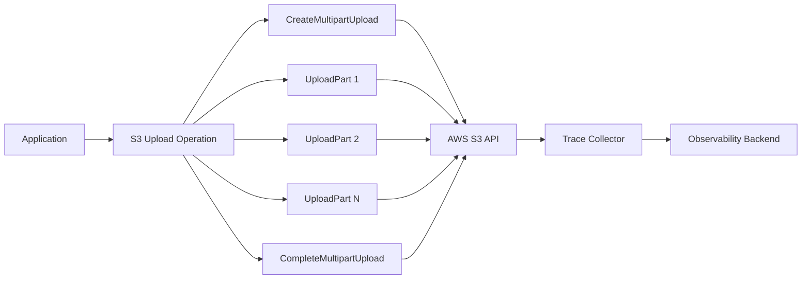

# How to Trace Go S3 and AWS SDK Operations with OpenTelemetry

Author: [nawazdhandala](https://www.github.com/nawazdhandala)

Tags: OpenTelemetry, Go, AWS SDK, S3, Cloud, Tracing

Description: Learn to instrument AWS SDK for Go with OpenTelemetry to trace S3 operations, monitor cloud service performance, and debug distributed cloud applications.

Applications built on AWS make countless API calls to services like S3, DynamoDB, SQS, and Lambda. These cloud service interactions often become performance bottlenecks, introduce latency, or fail silently. Without proper instrumentation, troubleshooting AWS integration issues requires digging through logs and piecing together scattered information.

OpenTelemetry provides automatic instrumentation for the AWS SDK, capturing every API call as a trace span with rich metadata. You get visibility into operation duration, request parameters, response status, and error conditions. This instrumentation helps identify slow S3 uploads, track DynamoDB throttling, monitor SQS message processing, and understand cross-service dependencies.

This guide focuses on instrumenting AWS SDK v2 for Go, with detailed examples for S3 operations. The patterns apply equally to other AWS services.

## Understanding AWS SDK Tracing

The AWS SDK v2 for Go uses a middleware architecture that processes each API request through a pipeline. OpenTelemetry hooks into this pipeline to automatically create spans for every AWS service call.

Each span captures:

**Service Information** identifies the AWS service (S3, DynamoDB, etc.) and operation (PutObject, GetItem, etc.)

**Request Details** include bucket names, object keys, table names, and other service-specific parameters

**Performance Metrics** show request duration, retry attempts, and time spent in various request phases

**Error Context** captures SDK errors, HTTP status codes, and detailed error messages

**Distributed Context** propagates trace context across service boundaries for end-to-end visibility

## Setting Up AWS SDK Instrumentation

Install the required dependencies:

```bash
go get github.com/aws/aws-sdk-go-v2/aws
go get github.com/aws/aws-sdk-go-v2/config
go get github.com/aws/aws-sdk-go-v2/service/s3
go get go.opentelemetry.io/otel
go get go.opentelemetry.io/otel/sdk/trace
go get go.opentelemetry.io/contrib/instrumentation/github.com/aws/aws-sdk-go-v2/otelaws
go get go.opentelemetry.io/otel/exporters/otlp/otlptrace/otlptracegrpc
```

Create a tracing configuration that initializes OpenTelemetry:

```go
package telemetry

import (
    "context"
    "time"

    "go.opentelemetry.io/otel"
    "go.opentelemetry.io/otel/exporters/otlp/otlptrace/otlptracegrpc"
    "go.opentelemetry.io/otel/sdk/resource"
    sdktrace "go.opentelemetry.io/otel/sdk/trace"
    semconv "go.opentelemetry.io/otel/semconv/v1.24.0"
)

// InitTracer configures OpenTelemetry for AWS SDK tracing
func InitTracer(ctx context.Context, serviceName string) (*sdktrace.TracerProvider, error) {
    // Create OTLP exporter
    exporter, err := otlptracegrpc.New(ctx,
        otlptracegrpc.WithEndpoint("localhost:4317"),
        otlptracegrpc.WithInsecure(),
    )
    if err != nil {
        return nil, err
    }

    // Define resource identifying your service
    res, err := resource.New(ctx,
        resource.WithAttributes(
            semconv.ServiceNameKey.String(serviceName),
            semconv.ServiceVersionKey.String("1.0.0"),
        ),
    )
    if err != nil {
        return nil, err
    }

    // Create tracer provider with batch processor
    tp := sdktrace.NewTracerProvider(
        sdktrace.WithBatcher(exporter,
            sdktrace.WithBatchTimeout(5*time.Second),
        ),
        sdktrace.WithResource(res),
        sdktrace.WithSampler(sdktrace.AlwaysSample()),
    )

    otel.SetTracerProvider(tp)
    return tp, nil
}
```

Initialize the AWS SDK with OpenTelemetry instrumentation:

```go
package awsclient

import (
    "context"

    "github.com/aws/aws-sdk-go-v2/aws"
    "github.com/aws/aws-sdk-go-v2/config"
    "github.com/aws/aws-sdk-go-v2/service/s3"
    "go.opentelemetry.io/contrib/instrumentation/github.com/aws/aws-sdk-go-v2/otelaws"
)

// NewS3Client creates an S3 client with OpenTelemetry instrumentation
// All S3 operations will automatically generate trace spans
func NewS3Client(ctx context.Context) (*s3.Client, error) {
    // Load AWS configuration
    cfg, err := config.LoadDefaultConfig(ctx,
        config.WithRegion("us-east-1"),
    )
    if err != nil {
        return nil, err
    }

    // Instrument the AWS config with OpenTelemetry
    // This adds tracing middleware to all AWS SDK calls
    otelaws.AppendMiddlewares(&cfg.APIOptions)

    // Create S3 client using instrumented config
    client := s3.NewFromConfig(cfg)

    return client, nil
}
```

## Tracing S3 Upload Operations

Instrument S3 upload operations with custom span attributes:

```go
package storage

import (
    "context"
    "io"
    "time"

    "github.com/aws/aws-sdk-go-v2/aws"
    "github.com/aws/aws-sdk-go-v2/service/s3"
    "go.opentelemetry.io/otel"
    "go.opentelemetry.io/otel/attribute"
    "go.opentelemetry.io/otel/codes"
    "go.opentelemetry.io/otel/trace"
)

type S3Uploader struct {
    client *s3.Client
    tracer trace.Tracer
}

// NewS3Uploader creates an uploader with tracing capabilities
func NewS3Uploader(client *s3.Client) *S3Uploader {
    return &S3Uploader{
        client: client,
        tracer: otel.Tracer("s3-uploader"),
    }
}

// UploadObject uploads data to S3 with comprehensive tracing
func (u *S3Uploader) UploadObject(ctx context.Context, bucket, key string, data io.Reader, size int64) error {
    // Create a parent span for the entire upload operation
    // The AWS SDK will create child spans for API calls
    ctx, span := u.tracer.Start(ctx, "s3.upload_object",
        trace.WithSpanKind(trace.SpanKindClient),
        trace.WithAttributes(
            attribute.String("s3.bucket", bucket),
            attribute.String("s3.key", key),
            attribute.Int64("s3.object.size_bytes", size),
        ),
    )
    defer span.End()

    startTime := time.Now()

    // The AWS SDK middleware will automatically create a child span
    // for this PutObject operation
    input := &s3.PutObjectInput{
        Bucket: aws.String(bucket),
        Key:    aws.String(key),
        Body:   data,
    }

    result, err := u.client.PutObject(ctx, input)
    if err != nil {
        span.RecordError(err)
        span.SetStatus(codes.Error, "upload failed")
        span.SetAttributes(
            attribute.String("error.type", "upload_error"),
        )
        return err
    }

    // Calculate upload duration and throughput
    duration := time.Since(startTime)
    throughputMBps := float64(size) / duration.Seconds() / (1024 * 1024)

    span.SetAttributes(
        attribute.String("s3.etag", aws.ToString(result.ETag)),
        attribute.Int64("s3.upload.duration_ms", duration.Milliseconds()),
        attribute.Float64("s3.upload.throughput_mbps", throughputMBps),
    )

    span.SetStatus(codes.Ok, "upload completed")
    return nil
}
```

## Tracing S3 Download Operations

Implement traced download operations with progress tracking:

```go
package storage

import (
    "context"
    "io"
    "time"

    "github.com/aws/aws-sdk-go-v2/aws"
    "github.com/aws/aws-sdk-go-v2/service/s3"
    "go.opentelemetry.io/otel/attribute"
    "go.opentelemetry.io/otel/codes"
    "go.opentelemetry.io/otel/trace"
)

// DownloadObject retrieves an object from S3 with tracing
func (u *S3Uploader) DownloadObject(ctx context.Context, bucket, key string) ([]byte, error) {
    ctx, span := u.tracer.Start(ctx, "s3.download_object",
        trace.WithSpanKind(trace.SpanKindClient),
        trace.WithAttributes(
            attribute.String("s3.bucket", bucket),
            attribute.String("s3.key", key),
        ),
    )
    defer span.End()

    startTime := time.Now()

    // Get object from S3 - SDK creates automatic span
    result, err := u.client.GetObject(ctx, &s3.GetObjectInput{
        Bucket: aws.String(bucket),
        Key:    aws.String(key),
    })
    if err != nil {
        span.RecordError(err)
        span.SetStatus(codes.Error, "download failed")
        return nil, err
    }
    defer result.Body.Close()

    // Add object metadata to span
    span.SetAttributes(
        attribute.String("s3.content_type", aws.ToString(result.ContentType)),
        attribute.Int64("s3.content_length", aws.ToInt64(result.ContentLength)),
        attribute.String("s3.etag", aws.ToString(result.ETag)),
    )

    // Read object data with size tracking
    data, err := io.ReadAll(result.Body)
    if err != nil {
        span.RecordError(err)
        span.SetStatus(codes.Error, "read failed")
        return nil, err
    }

    duration := time.Since(startTime)
    throughputMBps := float64(len(data)) / duration.Seconds() / (1024 * 1024)

    span.SetAttributes(
        attribute.Int("s3.bytes_read", len(data)),
        attribute.Int64("s3.download.duration_ms", duration.Milliseconds()),
        attribute.Float64("s3.download.throughput_mbps", throughputMBps),
    )

    span.SetStatus(codes.Ok, "download completed")
    return data, nil
}
```

## Tracing Multipart Uploads

Large file uploads use multipart uploads. Trace each part:

```go
package storage

import (
    "context"
    "fmt"
    "io"

    "github.com/aws/aws-sdk-go-v2/aws"
    "github.com/aws/aws-sdk-go-v2/service/s3"
    "github.com/aws/aws-sdk-go-v2/service/s3/types"
    "go.opentelemetry.io/otel/attribute"
    "go.opentelemetry.io/otel/codes"
    "go.opentelemetry.io/otel/trace"
)

const (
    // Upload parts in 10MB chunks
    partSize = 10 * 1024 * 1024
)

// MultipartUpload handles large file uploads with per-part tracing
func (u *S3Uploader) MultipartUpload(ctx context.Context, bucket, key string, data io.Reader, totalSize int64) error {
    ctx, span := u.tracer.Start(ctx, "s3.multipart_upload",
        trace.WithAttributes(
            attribute.String("s3.bucket", bucket),
            attribute.String("s3.key", key),
            attribute.Int64("s3.object.size_bytes", totalSize),
        ),
    )
    defer span.End()

    // Calculate number of parts needed
    numParts := (totalSize + partSize - 1) / partSize
    span.SetAttributes(
        attribute.Int64("s3.multipart.total_parts", numParts),
        attribute.Int64("s3.multipart.part_size_bytes", partSize),
    )

    // Initiate multipart upload
    createResp, err := u.client.CreateMultipartUpload(ctx, &s3.CreateMultipartUploadInput{
        Bucket: aws.String(bucket),
        Key:    aws.String(key),
    })
    if err != nil {
        span.RecordError(err)
        span.SetStatus(codes.Error, "failed to initiate multipart upload")
        return err
    }

    uploadID := aws.ToString(createResp.UploadId)
    span.SetAttributes(attribute.String("s3.upload_id", uploadID))

    // Upload each part with individual tracing
    var completedParts []types.CompletedPart
    for partNum := int32(1); partNum <= int32(numParts); partNum++ {
        part, err := u.uploadPart(ctx, bucket, key, uploadID, data, partNum)
        if err != nil {
            // Abort multipart upload on error
            u.abortMultipartUpload(ctx, bucket, key, uploadID)
            span.RecordError(err)
            span.SetStatus(codes.Error, fmt.Sprintf("failed to upload part %d", partNum))
            return err
        }
        completedParts = append(completedParts, part)
    }

    // Complete multipart upload
    _, err = u.client.CompleteMultipartUpload(ctx, &s3.CompleteMultipartUploadInput{
        Bucket:   aws.String(bucket),
        Key:      aws.String(key),
        UploadId: aws.String(uploadID),
        MultipartUpload: &types.CompletedMultipartUpload{
            Parts: completedParts,
        },
    })
    if err != nil {
        span.RecordError(err)
        span.SetStatus(codes.Error, "failed to complete multipart upload")
        return err
    }

    span.SetAttributes(
        attribute.Int("s3.multipart.completed_parts", len(completedParts)),
    )
    span.SetStatus(codes.Ok, "multipart upload completed")
    return nil
}

// uploadPart uploads a single part with tracing
func (u *S3Uploader) uploadPart(ctx context.Context, bucket, key, uploadID string, data io.Reader, partNum int32) (types.CompletedPart, error) {
    ctx, span := u.tracer.Start(ctx, "s3.upload_part",
        trace.WithAttributes(
            attribute.Int("s3.part_number", int(partNum)),
            attribute.String("s3.upload_id", uploadID),
        ),
    )
    defer span.End()

    // Read part data
    buffer := make([]byte, partSize)
    n, err := io.ReadFull(data, buffer)
    if err != nil && err != io.EOF && err != io.ErrUnexpectedEOF {
        span.RecordError(err)
        span.SetStatus(codes.Error, "failed to read part data")
        return types.CompletedPart{}, err
    }
    buffer = buffer[:n]

    span.SetAttributes(attribute.Int("s3.part.size_bytes", n))

    // Upload part
    result, err := u.client.UploadPart(ctx, &s3.UploadPartInput{
        Bucket:     aws.String(bucket),
        Key:        aws.String(key),
        UploadId:   aws.String(uploadID),
        PartNumber: aws.Int32(partNum),
        Body:       bytes.NewReader(buffer),
    })
    if err != nil {
        span.RecordError(err)
        span.SetStatus(codes.Error, "upload part failed")
        return types.CompletedPart{}, err
    }

    span.SetAttributes(attribute.String("s3.part.etag", aws.ToString(result.ETag)))
    span.SetStatus(codes.Ok, "part uploaded")

    return types.CompletedPart{
        ETag:       result.ETag,
        PartNumber: aws.Int32(partNum),
    }, nil
}

// abortMultipartUpload cleans up failed multipart uploads
func (u *S3Uploader) abortMultipartUpload(ctx context.Context, bucket, key, uploadID string) {
    ctx, span := u.tracer.Start(ctx, "s3.abort_multipart_upload")
    defer span.End()

    _, err := u.client.AbortMultipartUpload(ctx, &s3.AbortMultipartUploadInput{
        Bucket:   aws.String(bucket),
        Key:      aws.String(key),
        UploadId: aws.String(uploadID),
    })
    if err != nil {
        span.RecordError(err)
        span.SetStatus(codes.Error, "abort failed")
    }
}
```

## Tracing Batch Operations

When processing multiple S3 objects, trace the batch operation and individual items:

```go
package storage

import (
    "context"
    "sync"

    "go.opentelemetry.io/otel/attribute"
    "go.opentelemetry.io/otel/codes"
    "go.opentelemetry.io/otel/trace"
)

// BatchDelete deletes multiple objects with tracing
func (u *S3Uploader) BatchDelete(ctx context.Context, bucket string, keys []string) error {
    ctx, span := u.tracer.Start(ctx, "s3.batch_delete",
        trace.WithAttributes(
            attribute.String("s3.bucket", bucket),
            attribute.Int("s3.batch.total_objects", len(keys)),
        ),
    )
    defer span.End()

    // Process deletions concurrently with per-item tracing
    var wg sync.WaitGroup
    errChan := make(chan error, len(keys))
    successCount := 0
    var mu sync.Mutex

    for _, key := range keys {
        wg.Add(1)
        go func(k string) {
            defer wg.Done()

            if err := u.deleteObject(ctx, bucket, k); err != nil {
                errChan <- err
            } else {
                mu.Lock()
                successCount++
                mu.Unlock()
            }
        }(key)
    }

    wg.Wait()
    close(errChan)

    // Collect errors
    var errors []error
    for err := range errChan {
        errors = append(errors, err)
    }

    span.SetAttributes(
        attribute.Int("s3.batch.success_count", successCount),
        attribute.Int("s3.batch.error_count", len(errors)),
    )

    if len(errors) > 0 {
        span.SetStatus(codes.Error, fmt.Sprintf("%d deletions failed", len(errors)))
        return fmt.Errorf("batch delete completed with %d errors", len(errors))
    }

    span.SetStatus(codes.Ok, "batch delete completed")
    return nil
}

// deleteObject deletes a single object with tracing
func (u *S3Uploader) deleteObject(ctx context.Context, bucket, key string) error {
    ctx, span := u.tracer.Start(ctx, "s3.delete_object",
        trace.WithAttributes(
            attribute.String("s3.bucket", bucket),
            attribute.String("s3.key", key),
        ),
    )
    defer span.End()

    _, err := u.client.DeleteObject(ctx, &s3.DeleteObjectInput{
        Bucket: aws.String(bucket),
        Key:    aws.String(key),
    })

    if err != nil {
        span.RecordError(err)
        span.SetStatus(codes.Error, "delete failed")
        return err
    }

    span.SetStatus(codes.Ok, "object deleted")
    return nil
}
```

## Tracing Other AWS Services

The same instrumentation pattern works for all AWS services:

```go
package awsclient

import (
    "context"

    "github.com/aws/aws-sdk-go-v2/config"
    "github.com/aws/aws-sdk-go-v2/service/dynamodb"
    "github.com/aws/aws-sdk-go-v2/service/sqs"
    "go.opentelemetry.io/contrib/instrumentation/github.com/aws/aws-sdk-go-v2/otelaws"
)

// NewDynamoDBClient creates a traced DynamoDB client
func NewDynamoDBClient(ctx context.Context) (*dynamodb.Client, error) {
    cfg, err := config.LoadDefaultConfig(ctx)
    if err != nil {
        return nil, err
    }

    // Add OpenTelemetry instrumentation
    otelaws.AppendMiddlewares(&cfg.APIOptions)

    return dynamodb.NewFromConfig(cfg), nil
}

// NewSQSClient creates a traced SQS client
func NewSQSClient(ctx context.Context) (*sqs.Client, error) {
    cfg, err := config.LoadDefaultConfig(ctx)
    if err != nil {
        return nil, err
    }

    // Add OpenTelemetry instrumentation
    otelaws.AppendMiddlewares(&cfg.APIOptions)

    return sqs.NewFromConfig(cfg), nil
}
```

## Trace Visualization

Here's how AWS service traces flow through your system:



## Handling AWS SDK Retries

The AWS SDK automatically retries failed requests. Capture retry behavior:

```go
package awsclient

import (
    "context"

    "github.com/aws/aws-sdk-go-v2/aws"
    "github.com/aws/aws-sdk-go-v2/config"
    "github.com/aws/aws-sdk-go-v2/service/s3"
    "go.opentelemetry.io/contrib/instrumentation/github.com/aws/aws-sdk-go-v2/otelaws"
)

// NewS3ClientWithRetries creates an S3 client with custom retry configuration
func NewS3ClientWithRetries(ctx context.Context) (*s3.Client, error) {
    cfg, err := config.LoadDefaultConfig(ctx,
        config.WithRegion("us-east-1"),
        // Configure retry behavior
        config.WithRetryMaxAttempts(5),
    )
    if err != nil {
        return nil, err
    }

    // Instrument with OpenTelemetry
    // Retry attempts will appear as events in the span
    otelaws.AppendMiddlewares(&cfg.APIOptions)

    return s3.NewFromConfig(cfg), nil
}
```

## Best Practices

**Sampling Strategy**: For high-volume applications, implement sampling to reduce trace data volume. Sample based on operation type, error status, or latency thresholds.

**Sensitive Data**: Never include sensitive data like access keys or user credentials in span attributes. The AWS SDK instrumentation automatically excludes sensitive headers.

**Context Propagation**: Always pass context through your application to maintain trace continuity. Each AWS SDK call should use the traced context.

**Resource Attributes**: Tag traces with environment information (production, staging, region) to filter and aggregate traces effectively.

**Error Handling**: Capture detailed error context including operation parameters to help debug failures. Include retry counts and backoff durations.

**Performance Impact**: OpenTelemetry instrumentation adds minimal overhead to AWS SDK calls. Batch exporters reduce network impact by sending traces in groups.

**Cost Monitoring**: Add custom attributes for tracking AWS costs. Include bucket names, object sizes, and operation counts to correlate traces with billing data.

OpenTelemetry transforms AWS SDK observability from scattered logs into coherent, queryable traces. Automatic instrumentation captures every AWS service interaction, while custom spans add application-specific context. This visibility helps you optimize cloud costs, improve performance, and quickly resolve issues in distributed systems.
