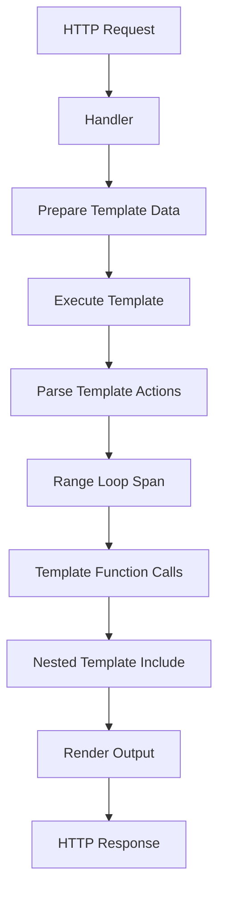

# How to Trace Go Template Rendering with OpenTelemetry Spans

Author: [nawazdhandala](https://www.github.com/nawazdhandala)

Tags: OpenTelemetry, Go, Templates, Rendering, Spans, html/template

Description: Instrument Go template rendering with OpenTelemetry to trace execution time, identify slow templates, and monitor template function performance for server-side rendering optimization.

Server-side template rendering often becomes a performance bottleneck in Go web applications, yet it typically operates as a black box. You know the overall response time, but you can't see which specific templates are slow, which template functions consume the most CPU, or how template rendering scales under load.

OpenTelemetry instrumentation brings observability to template rendering by creating spans for template execution, tracking data preparation, and measuring individual template function calls. This visibility helps you optimize rendering performance and understand how templates behave in production.

## Template Rendering and Performance Characteristics

Go's `html/template` and `text/template` packages provide a powerful templating engine, but complex templates with many function calls, range loops over large datasets, and nested template includes can become surprisingly expensive to render.



Each stage of template rendering has different performance characteristics. Data preparation might involve database queries, template execution traverses the template AST, and function calls can trigger expensive operations like formatting or encoding.

## Setting Up Template Instrumentation

Start by wrapping the template execution process with OpenTelemetry spans.

```go
package main

import (
    "bytes"
    "context"
    "fmt"
    "html/template"
    "log"
    "net/http"
    "time"

    "go.opentelemetry.io/otel"
    "go.opentelemetry.io/otel/attribute"
    "go.opentelemetry.io/otel/exporters/otlp/otlptrace/otlptracegrpc"
    "go.opentelemetry.io/otel/propagation"
    "go.opentelemetry.io/otel/sdk/resource"
    "go.opentelemetry.io/otel/sdk/trace"
    semconv "go.opentelemetry.io/otel/semconv/v1.21.0"
    oteltrace "go.opentelemetry.io/otel/trace"
)

func initTracer() (*trace.TracerProvider, error) {
    ctx := context.Background()

    exporter, err := otlptracegrpc.New(ctx,
        otlptracegrpc.WithEndpoint("localhost:4317"),
        otlptracegrpc.WithInsecure(),
    )
    if err != nil {
        return nil, fmt.Errorf("creating OTLP exporter: %w", err)
    }

    res, err := resource.New(ctx,
        resource.WithAttributes(
            semconv.ServiceName("template-service"),
            semconv.ServiceVersion("1.0.0"),
            attribute.String("template.engine", "html/template"),
        ),
    )
    if err != nil {
        return nil, fmt.Errorf("creating resource: %w", err)
    }

    tp := trace.NewTracerProvider(
        trace.WithBatcher(exporter),
        trace.WithResource(res),
        trace.WithSampler(trace.AlwaysSample()),
    )

    otel.SetTracerProvider(tp)
    otel.SetTextMapPropagator(propagation.TraceContext{})

    return tp, nil
}
```

The tracer configuration includes attributes that identify your templating engine, making it easier to filter template-related traces in your observability backend.

## Creating an Instrumented Template Executor

Build a wrapper around `html/template.Template` that automatically traces execution.

```go
// TemplateExecutor wraps template execution with OpenTelemetry tracing
type TemplateExecutor struct {
    template *template.Template
    tracer   oteltrace.Tracer
    name     string
}

// NewTemplateExecutor creates an instrumented template executor
func NewTemplateExecutor(name string, tmpl *template.Template) *TemplateExecutor {
    return &TemplateExecutor{
        template: tmpl,
        tracer:   otel.Tracer("template-executor"),
        name:     name,
    }
}

// Execute renders the template with tracing
func (te *TemplateExecutor) Execute(ctx context.Context, wr *bytes.Buffer, data interface{}) error {
    ctx, span := te.tracer.Start(ctx, fmt.Sprintf("template.execute.%s", te.name),
        oteltrace.WithSpanKind(oteltrace.SpanKindInternal),
    )
    defer span.End()

    span.SetAttributes(
        attribute.String("template.name", te.name),
        attribute.String("template.type", "html"),
    )

    // Measure data preparation if applicable
    dataSize := estimateDataSize(data)
    span.SetAttributes(
        attribute.Int("template.data.size_bytes", dataSize),
    )

    start := time.Now()
    err := te.template.Execute(wr, data)
    duration := time.Since(start)

    span.SetAttributes(
        attribute.Int64("template.execution.duration_ms", duration.Milliseconds()),
        attribute.Int("template.output.size_bytes", wr.Len()),
    )

    if err != nil {
        span.SetAttributes(
            attribute.String("error.message", err.Error()),
            attribute.Bool("template.error", true),
        )
        return fmt.Errorf("executing template %s: %w", te.name, err)
    }

    return nil
}

// ExecuteTemplate renders a named template with tracing
func (te *TemplateExecutor) ExecuteTemplate(ctx context.Context, wr *bytes.Buffer, name string, data interface{}) error {
    ctx, span := te.tracer.Start(ctx, fmt.Sprintf("template.execute.%s", name),
        oteltrace.WithSpanKind(oteltrace.SpanKindInternal),
    )
    defer span.End()

    span.SetAttributes(
        attribute.String("template.name", name),
        attribute.String("template.parent", te.name),
    )

    start := time.Now()
    err := te.template.ExecuteTemplate(wr, name, data)
    duration := time.Since(start)

    span.SetAttributes(
        attribute.Int64("template.execution.duration_ms", duration.Milliseconds()),
        attribute.Int("template.output.size_bytes", wr.Len()),
    )

    if err != nil {
        span.SetAttributes(
            attribute.String("error.message", err.Error()),
        )
        return err
    }

    return nil
}

// estimateDataSize provides a rough estimate of data structure size
func estimateDataSize(data interface{}) int {
    // This is a simplified estimation
    // In production, you might use reflection or serialization for accuracy
    switch v := data.(type) {
    case string:
        return len(v)
    case []byte:
        return len(v)
    case map[string]interface{}:
        return len(v) * 100 // rough estimate
    default:
        return 0
    }
}
```

The executor wrapper creates spans for each template execution, capturing timing information and data characteristics that help identify performance patterns.

## Instrumenting Template Functions

Template functions often perform expensive operations. Instrument them to see their individual contributions to rendering time.

```go
// TracedFuncMap creates a function map with traced functions
type TracedFuncMap struct {
    tracer oteltrace.Tracer
    funcs  template.FuncMap
}

// NewTracedFuncMap wraps template functions with tracing
func NewTracedFuncMap() *TracedFuncMap {
    tfm := &TracedFuncMap{
        tracer: otel.Tracer("template-functions"),
        funcs:  make(template.FuncMap),
    }

    // Add traced versions of common template functions
    tfm.funcs["formatDate"] = tfm.traceFunc("formatDate", formatDate)
    tfm.funcs["formatCurrency"] = tfm.traceFunc("formatCurrency", formatCurrency)
    tfm.funcs["truncate"] = tfm.traceFunc("truncate", truncate)
    tfm.funcs["markdownToHTML"] = tfm.traceFunc("markdownToHTML", markdownToHTML)
    tfm.funcs["fetchUserData"] = tfm.traceFuncCtx("fetchUserData", fetchUserData)
    tfm.funcs["calculateTotal"] = tfm.traceFunc("calculateTotal", calculateTotal)

    return tfm
}

// FuncMap returns the traced function map
func (tfm *TracedFuncMap) FuncMap() template.FuncMap {
    return tfm.funcs
}

// traceFunc wraps a simple function with tracing
func (tfm *TracedFuncMap) traceFunc(name string, fn interface{}) interface{} {
    return func(args ...interface{}) interface{} {
        ctx := context.Background()
        ctx, span := tfm.tracer.Start(ctx, fmt.Sprintf("template.func.%s", name))
        defer span.End()

        span.SetAttributes(
            attribute.String("template.function.name", name),
            attribute.Int("template.function.args.count", len(args)),
        )

        start := time.Now()

        // Call the original function using reflection or type assertion
        result := callFunction(fn, args...)

        duration := time.Since(start)
        span.SetAttributes(
            attribute.Int64("template.function.duration_ms", duration.Milliseconds()),
        )

        return result
    }
}

// traceFuncCtx wraps a context-aware function with tracing
func (tfm *TracedFuncMap) traceFuncCtx(name string, fn func(context.Context, ...interface{}) interface{}) interface{} {
    return func(args ...interface{}) interface{} {
        ctx := context.Background()
        ctx, span := tfm.tracer.Start(ctx, fmt.Sprintf("template.func.%s", name))
        defer span.End()

        span.SetAttributes(
            attribute.String("template.function.name", name),
        )

        start := time.Now()
        result := fn(ctx, args...)
        duration := time.Since(start)

        span.SetAttributes(
            attribute.Int64("template.function.duration_ms", duration.Milliseconds()),
        )

        return result
    }
}

// Example template functions
func formatDate(date time.Time) string {
    return date.Format("January 2, 2006")
}

func formatCurrency(amount float64) string {
    return fmt.Sprintf("$%.2f", amount)
}

func truncate(s string, length int) string {
    if len(s) <= length {
        return s
    }
    return s[:length] + "..."
}

func markdownToHTML(markdown string) template.HTML {
    // Simulate markdown processing
    time.Sleep(5 * time.Millisecond) // Represents processing time
    return template.HTML("<p>" + markdown + "</p>")
}

func fetchUserData(ctx context.Context, args ...interface{}) interface{} {
    if len(args) == 0 {
        return nil
    }

    userID := args[0].(string)

    // Simulate database fetch
    time.Sleep(10 * time.Millisecond)

    return map[string]interface{}{
        "id":   userID,
        "name": "User " + userID,
    }
}

func calculateTotal(items []interface{}) float64 {
    total := 0.0
    for _, item := range items {
        if m, ok := item.(map[string]interface{}); ok {
            if price, ok := m["price"].(float64); ok {
                total += price
            }
        }
    }
    return total
}

func callFunction(fn interface{}, args ...interface{}) interface{} {
    // Simplified function call - in production use reflection
    switch f := fn.(type) {
    case func(time.Time) string:
        return f(args[0].(time.Time))
    case func(float64) string:
        return f(args[0].(float64))
    case func(string, int) string:
        return f(args[0].(string), args[1].(int))
    case func(string) template.HTML:
        return f(args[0].(string))
    case func([]interface{}) float64:
        return f(args[0].([]interface{}))
    default:
        return nil
    }
}
```

Traced template functions reveal which functions are called most frequently and which ones consume the most time, helping you prioritize optimization efforts.

## Building a Complete Template System

Create a template manager that handles parsing, caching, and instrumented execution.

```go
// TemplateManager manages template parsing and execution with tracing
type TemplateManager struct {
    templates map[string]*TemplateExecutor
    funcMap   template.FuncMap
    tracer    oteltrace.Tracer
}

// NewTemplateManager creates a new template manager
func NewTemplateManager() *TemplateManager {
    tracedFuncs := NewTracedFuncMap()

    return &TemplateManager{
        templates: make(map[string]*TemplateExecutor),
        funcMap:   tracedFuncs.FuncMap(),
        tracer:    otel.Tracer("template-manager"),
    }
}

// ParseTemplate parses and caches a template with tracing
func (tm *TemplateManager) ParseTemplate(ctx context.Context, name string, content string) error {
    ctx, span := tm.tracer.Start(ctx, "template.parse")
    defer span.End()

    span.SetAttributes(
        attribute.String("template.name", name),
        attribute.Int("template.content.size_bytes", len(content)),
    )

    start := time.Now()

    tmpl, err := template.New(name).Funcs(tm.funcMap).Parse(content)
    if err != nil {
        span.SetAttributes(
            attribute.String("error.message", err.Error()),
        )
        return fmt.Errorf("parsing template %s: %w", name, err)
    }

    duration := time.Since(start)
    span.SetAttributes(
        attribute.Int64("template.parse.duration_ms", duration.Milliseconds()),
    )

    tm.templates[name] = NewTemplateExecutor(name, tmpl)

    return nil
}

// ParseFiles parses template files with tracing
func (tm *TemplateManager) ParseFiles(ctx context.Context, name string, files ...string) error {
    ctx, span := tm.tracer.Start(ctx, "template.parse.files")
    defer span.End()

    span.SetAttributes(
        attribute.String("template.name", name),
        attribute.Int("template.files.count", len(files)),
        attribute.StringSlice("template.files", files),
    )

    start := time.Now()

    tmpl, err := template.New(name).Funcs(tm.funcMap).ParseFiles(files...)
    if err != nil {
        span.SetAttributes(
            attribute.String("error.message", err.Error()),
        )
        return fmt.Errorf("parsing template files: %w", err)
    }

    duration := time.Since(start)
    span.SetAttributes(
        attribute.Int64("template.parse.duration_ms", duration.Milliseconds()),
    )

    tm.templates[name] = NewTemplateExecutor(name, tmpl)

    return nil
}

// Render executes a template and returns the output
func (tm *TemplateManager) Render(ctx context.Context, name string, data interface{}) (string, error) {
    ctx, span := tm.tracer.Start(ctx, "template.render")
    defer span.End()

    span.SetAttributes(
        attribute.String("template.name", name),
    )

    executor, ok := tm.templates[name]
    if !ok {
        err := fmt.Errorf("template not found: %s", name)
        span.SetAttributes(
            attribute.String("error.message", err.Error()),
        )
        return "", err
    }

    var buf bytes.Buffer
    if err := executor.Execute(ctx, &buf, data); err != nil {
        return "", err
    }

    output := buf.String()
    span.SetAttributes(
        attribute.Int("template.output.size_bytes", len(output)),
    )

    return output, nil
}

// RenderToWriter executes a template and writes output to http.ResponseWriter
func (tm *TemplateManager) RenderToWriter(ctx context.Context, w http.ResponseWriter, name string, data interface{}) error {
    output, err := tm.Render(ctx, name, data)
    if err != nil {
        return err
    }

    w.Header().Set("Content-Type", "text/html; charset=utf-8")
    _, err = w.Write([]byte(output))
    return err
}
```

The template manager provides a centralized place for template operations, making it easy to add instrumentation consistently across all template rendering.

## Example Application with Instrumented Templates

Build a complete web application that demonstrates template instrumentation in action.

```go
func main() {
    tp, err := initTracer()
    if err != nil {
        log.Fatalf("Failed to initialize tracer: %v", err)
    }
    defer func() {
        if err := tp.Shutdown(context.Background()); err != nil {
            log.Printf("Error shutting down tracer: %v", err)
        }
    }()

    // Create template manager
    tm := NewTemplateManager()

    // Parse templates
    ctx := context.Background()

    if err := tm.ParseTemplate(ctx, "home", homeTemplate); err != nil {
        log.Fatalf("Failed to parse home template: %v", err)
    }

    if err := tm.ParseTemplate(ctx, "product-list", productListTemplate); err != nil {
        log.Fatalf("Failed to parse product list template: %v", err)
    }

    if err := tm.ParseTemplate(ctx, "user-profile", userProfileTemplate); err != nil {
        log.Fatalf("Failed to parse user profile template: %v", err)
    }

    // Set up HTTP handlers
    http.HandleFunc("/", makeHandler(tm, "home", homeHandler))
    http.HandleFunc("/products", makeHandler(tm, "product-list", productsHandler))
    http.HandleFunc("/profile", makeHandler(tm, "user-profile", profileHandler))

    log.Println("Server listening on :8080")
    log.Fatal(http.ListenAndServe(":8080", nil))
}

// makeHandler creates an HTTP handler with tracing
func makeHandler(tm *TemplateManager, templateName string, dataFn func(context.Context) interface{}) http.HandlerFunc {
    tracer := otel.Tracer("http-handlers")

    return func(w http.ResponseWriter, r *http.Request) {
        ctx, span := tracer.Start(r.Context(), r.URL.Path)
        defer span.End()

        span.SetAttributes(
            attribute.String("http.method", r.Method),
            attribute.String("http.path", r.URL.Path),
        )

        // Prepare template data
        dataCtx, dataSpan := tracer.Start(ctx, "prepare.data")
        data := dataFn(dataCtx)
        dataSpan.End()

        // Render template
        if err := tm.RenderToWriter(ctx, w, templateName, data); err != nil {
            span.SetAttributes(
                attribute.String("error.message", err.Error()),
            )
            http.Error(w, "Internal Server Error", http.StatusInternalServerError)
            return
        }
    }
}

func homeHandler(ctx context.Context) interface{} {
    return map[string]interface{}{
        "title":   "Welcome",
        "message": "Welcome to our store!",
        "date":    time.Now(),
    }
}

func productsHandler(ctx context.Context) interface{} {
    // Simulate database query
    time.Sleep(20 * time.Millisecond)

    return map[string]interface{}{
        "title": "Products",
        "products": []map[string]interface{}{
            {"id": "1", "name": "Widget", "price": 29.99},
            {"id": "2", "name": "Gadget", "price": 49.99},
            {"id": "3", "name": "Doohickey", "price": 19.99},
        },
    }
}

func profileHandler(ctx context.Context) interface{} {
    // Simulate user data fetch
    time.Sleep(15 * time.Millisecond)

    return map[string]interface{}{
        "title": "Profile",
        "user": map[string]interface{}{
            "name":  "John Doe",
            "email": "john@example.com",
            "joined": time.Now().Add(-365 * 24 * time.Hour),
        },
    }
}

// Template definitions
const homeTemplate = `
<!DOCTYPE html>
<html>
<head><title>{{.title}}</title></head>
<body>
    <h1>{{.message}}</h1>
    <p>Today is {{formatDate .date}}</p>
</body>
</html>
`

const productListTemplate = `
<!DOCTYPE html>
<html>
<head><title>{{.title}}</title></head>
<body>
    <h1>{{.title}}</h1>
    <ul>
    {{range .products}}
        <li>{{.name}} - {{formatCurrency .price}}</li>
    {{end}}
    </ul>
    <p>Total: {{formatCurrency (calculateTotal .products)}}</p>
</body>
</html>
`

const userProfileTemplate = `
<!DOCTYPE html>
<html>
<head><title>{{.title}}</title></head>
<body>
    <h1>User Profile</h1>
    <p>Name: {{.user.name}}</p>
    <p>Email: {{.user.email}}</p>
    <p>Member since: {{formatDate .user.joined}}</p>
</body>
</html>
`
```

This application creates complete traces showing HTTP request handling, data preparation, template execution, and individual template function calls.

## Analyzing Template Performance

The traces reveal several important patterns:

**Slow Templates**: The overall template execution span duration shows which templates take longest to render. If a template consistently takes 200ms when others take 20ms, you know where to focus optimization efforts.

**Function Call Overhead**: Template function spans show if functions like `markdownToHTML` or `fetchUserData` are causing bottlenecks. Moving expensive operations out of templates and into data preparation can dramatically improve rendering speed.

**Range Loop Performance**: Templates with `{{range}}` loops create many child spans. If you're looping over 1000 items and calling template functions for each, the traces make it obvious that you need to either reduce the data size or optimize the per-item processing.

**Data Preparation vs Rendering**: Separate spans for data preparation and template execution show whether your bottleneck is database queries or actual template processing.

Template instrumentation transforms rendering from an opaque operation into a fully observable process, giving you the data needed to make informed optimization decisions and maintain fast page load times as your application evolves.