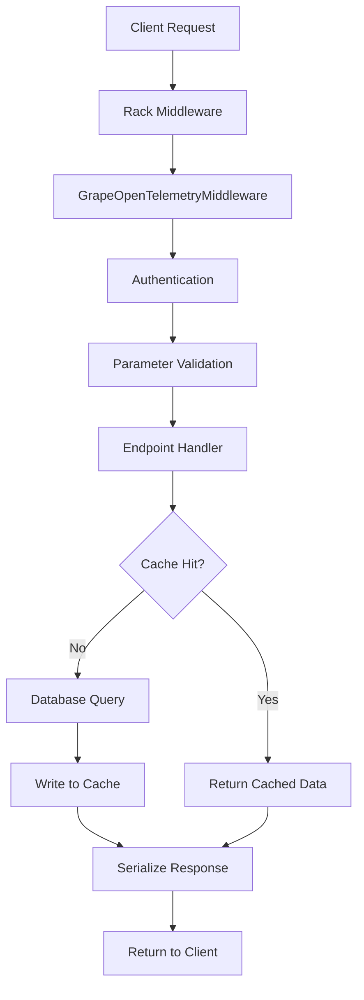

# How to Trace Grape API Framework with OpenTelemetry in Ruby

Author: [nawazdhandala](https://www.github.com/nawazdhandala)

Tags: OpenTelemetry, Ruby, Grape, API, REST, Tracing

Description: Complete guide to instrumenting Grape REST APIs with OpenTelemetry for distributed tracing, performance monitoring, and debugging in Ruby applications.

Grape is a popular REST-like API framework for Ruby, designed for creating clean and maintainable API services. While Grape provides excellent tools for building APIs, production debugging requires visibility into request processing, endpoint performance, and integration with downstream services. OpenTelemetry brings enterprise-grade observability to Grape applications through distributed tracing.

## Why Grape API Tracing Matters

API services are the glue connecting modern applications. When an API endpoint slows down or returns errors, the impact cascades through the entire system. Common challenges include:

- Slow endpoints without understanding which operation is the bottleneck
- Integration failures with external services
- Parameter validation errors that are hard to reproduce
- Authentication and authorization failures
- Database query performance issues
- Cache misses affecting response times

OpenTelemetry provides end-to-end visibility, showing exactly what happens during each API request from authentication through response serialization.

## Setting Up OpenTelemetry for Grape

Create a Grape API project and add OpenTelemetry gems:

```ruby
# Gemfile
gem 'grape'
gem 'rack'
gem 'opentelemetry-sdk'
gem 'opentelemetry-exporter-otlp'
gem 'opentelemetry-instrumentation-rack'
gem 'opentelemetry-instrumentation-grape'
gem 'opentelemetry-instrumentation-redis'
gem 'opentelemetry-instrumentation-pg'
```

Install dependencies:

```bash
bundle install
```

Configure OpenTelemetry in your application:

```ruby
# config/opentelemetry.rb
require 'opentelemetry/sdk'
require 'opentelemetry/exporter/otlp'
require 'opentelemetry/instrumentation/all'

OpenTelemetry::SDK.configure do |c|
  c.service_name = 'grape-api-service'
  c.service_version = '1.0.0'

  c.use_all({
    'OpenTelemetry::Instrumentation::Rack' => {},
    'OpenTelemetry::Instrumentation::Grape' => {
      # Enable detailed tracing
      enable_route_namespace: true
    },
    'OpenTelemetry::Instrumentation::Redis' => {},
    'OpenTelemetry::Instrumentation::PG' => {}
  })
end
```

Note: At the time of writing, there is no official OpenTelemetry instrumentation for Grape, but Rack instrumentation covers HTTP requests. We will implement custom Grape-specific instrumentation.

## Implementing Custom Grape Instrumentation

Create middleware to instrument Grape endpoints:

```ruby
# lib/grape_opentelemetry_middleware.rb
class GrapeOpenTelemetryMiddleware < Grape::Middleware::Base
  def initialize(app, options = {})
    super
    @tracer = OpenTelemetry.tracer_provider.tracer('grape-api')
  end

  def before
    route = env['api.endpoint'].route

    @span = @tracer.start_span(
      "#{route.request_method} #{route.pattern.path}",
      kind: :server,
      attributes: {
        'http.method' => route.request_method,
        'http.route' => route.pattern.path,
        'http.target' => env['PATH_INFO'],
        'grape.version' => route.version,
        'grape.namespace' => route.namespace
      }
    )

    # Set the span as current
    OpenTelemetry::Trace.with_span(@span) do
      # Continue processing
    end
  end

  def call(env)
    before

    begin
      @app_response = @app.call(env)
      after
      @app_response
    rescue StandardError => e
      record_exception(e)
      raise
    ensure
      finish_span
    end
  end

  def after
    if @span && @app_response
      status = @app_response[0]
      @span.set_attribute('http.status_code', status)

      if status >= 400 && status < 600
        @span.status = OpenTelemetry::Trace::Status.error("HTTP #{status}")
      end
    end
  end

  def record_exception(exception)
    if @span
      @span.record_exception(exception)
      @span.status = OpenTelemetry::Trace::Status.error(exception.message)
    end
  end

  def finish_span
    @span&.finish
  end
end
```

## Building an Instrumented Grape API

Create a complete Grape API with instrumentation:

```ruby
# api/base.rb
module API
  class Base < Grape::API
    use GrapeOpenTelemetryMiddleware

    format :json
    prefix :api

    helpers do
      def tracer
        @tracer ||= OpenTelemetry.tracer_provider.tracer('grape-api')
      end

      def current_user
        @current_user ||= authenticate_user!
      end

      def authenticate_user!
        tracer.in_span('authenticate_user') do |span|
          token = headers['Authorization']&.sub('Bearer ', '')

          span.set_attribute('auth.token_present', token.present?)

          unless token
            span.add_event('missing_auth_token')
            error!('Unauthorized', 401)
          end

          user = User.find_by_token(token)

          unless user
            span.add_event('invalid_auth_token')
            span.status = OpenTelemetry::Trace::Status.error('Invalid token')
            error!('Unauthorized', 401)
          end

          span.set_attribute('user.id', user.id)
          span.set_attribute('user.email', user.email)
          span.add_event('user_authenticated')

          user
        end
      end

      def track_request_params
        tracer.in_span('validate_params') do |span|
          span.set_attribute('params.count', params.keys.length)

          params.each do |key, value|
            next if key.to_s.include?('password') || key.to_s.include?('token')
            span.set_attribute("param.#{key}", value.to_s)
          end
        end
      end
    end

    before do
      track_request_params
    end

    rescue_from :all do |e|
      tracer.in_span('error_handler') do |span|
        span.record_exception(e)
        span.set_attribute('error.handled', true)

        error!({
          error: e.class.name,
          message: e.message
        }, 500)
      end
    end

    mount API::V1::Users
    mount API::V1::Products
  end
end
```

## Instrumenting API Endpoints

Create endpoints with detailed tracing:

```ruby
# api/v1/products.rb
module API
  module V1
    class Products < Grape::API
      version 'v1', using: :path

      resource :products do
        desc 'List all products'
        params do
          optional :category, type: String, desc: 'Filter by category'
          optional :page, type: Integer, default: 1, desc: 'Page number'
          optional :per_page, type: Integer, default: 20, desc: 'Items per page'
        end
        get do
          tracer.in_span('list_products',
                        attributes: {
                          'products.category' => params[:category],
                          'products.page' => params[:page]
                        }) do |span|

            # Build query
            products = tracer.in_span('build_query') do
              query = Product.all
              query = query.where(category: params[:category]) if params[:category]
              query
            end

            # Execute query with pagination
            result = tracer.in_span('execute_query') do |query_span|
              paginated = products.page(params[:page]).per(params[:per_page])

              query_span.set_attribute('query.total_count', paginated.total_count)
              query_span.set_attribute('query.page_count', paginated.total_pages)
              query_span.set_attribute('query.current_page', params[:page])

              paginated
            end

            # Serialize response
            serialized = tracer.in_span('serialize_response') do |serialize_span|
              data = result.map { |p| ProductSerializer.new(p).as_json }

              serialize_span.set_attribute('response.items_count', data.length)
              serialize_span.set_attribute('response.size_bytes', data.to_json.bytesize)

              data
            end

            span.set_attribute('products.returned', serialized.length)

            {
              products: serialized,
              meta: {
                current_page: params[:page],
                total_pages: result.total_pages,
                total_count: result.total_count
              }
            }
          end
        end

        desc 'Get a product by ID'
        params do
          requires :id, type: Integer, desc: 'Product ID'
        end
        route_param :id do
          get do
            tracer.in_span('get_product',
                          attributes: { 'product.id' => params[:id] }) do |span|

              # Try cache first
              cache_key = "product:#{params[:id]}"

              product = tracer.in_span('fetch_from_cache') do |cache_span|
                cached = Rails.cache.read(cache_key)

                cache_span.set_attribute('cache.hit', cached.present?)
                cache_span.set_attribute('cache.key', cache_key)

                cached
              end

              unless product
                # Cache miss - fetch from database
                product = tracer.in_span('fetch_from_database') do
                  Product.find(params[:id])
                end

                # Write to cache
                tracer.in_span('write_to_cache') do
                  Rails.cache.write(cache_key, product, expires_in: 1.hour)
                end
              end

              span.set_attribute('product.name', product.name)
              span.set_attribute('product.price', product.price)

              ProductSerializer.new(product).as_json
            end
          end
        end

        desc 'Create a new product'
        params do
          requires :name, type: String, desc: 'Product name'
          requires :price, type: Float, desc: 'Product price'
          optional :category, type: String, desc: 'Product category'
          optional :description, type: String, desc: 'Product description'
        end
        post do
          tracer.in_span('create_product') do |span|
            authenticated_user = current_user

            span.set_attribute('user.id', authenticated_user.id)

            # Validate permissions
            tracer.in_span('check_permissions') do |perm_span|
              unless authenticated_user.can_create_products?
                perm_span.add_event('permission_denied')
                error!('Forbidden', 403)
              end

              perm_span.add_event('permission_granted')
            end

            # Create product
            product = tracer.in_span('save_product') do |save_span|
              p = Product.new(
                name: params[:name],
                price: params[:price],
                category: params[:category],
                description: params[:description],
                created_by: authenticated_user
              )

              if p.save
                save_span.set_attribute('product.id', p.id)
                save_span.add_event('product_created')
              else
                save_span.add_event('validation_failed', attributes: {
                  'errors' => p.errors.full_messages.join(', ')
                })
                error!(p.errors.full_messages, 422)
              end

              p
            end

            # Trigger background job
            tracer.in_span('enqueue_notification_job') do
              ProductCreatedNotificationJob.perform_later(product.id)
            end

            span.set_attribute('product.id', product.id)

            status 201
            ProductSerializer.new(product).as_json
          end
        end
      end
    end
  end
end
```

## Tracing External API Calls

Instrument calls to external services from your Grape API:

```ruby
# app/services/payment_processor.rb
class PaymentProcessor
  def initialize
    @tracer = OpenTelemetry.tracer_provider.tracer('payment-processor')
    @client = Faraday.new(url: 'https://api.payment-provider.com')
  end

  def process_payment(order, payment_method)
    @tracer.in_span('process_payment',
                    attributes: {
                      'order.id' => order.id,
                      'order.amount' => order.total_amount,
                      'payment.method' => payment_method
                    }) do |span|

      # Create payment request
      payload = @tracer.in_span('build_payment_payload') do
        {
          amount: order.total_amount,
          currency: order.currency,
          payment_method: payment_method,
          order_id: order.id,
          customer_id: order.customer_id
        }
      end

      # Call external API
      response = @tracer.in_span('call_payment_api') do |api_span|
        res = @client.post('/v1/charges') do |req|
          req.headers['Authorization'] = "Bearer #{ENV['PAYMENT_API_KEY']}"
          req.headers['Content-Type'] = 'application/json'
          req.body = payload.to_json
        end

        api_span.set_attribute('http.status_code', res.status)
        api_span.set_attribute('http.response_time_ms', res.env.duration * 1000)

        res
      end

      # Parse response
      result = @tracer.in_span('parse_payment_response') do |parse_span|
        data = JSON.parse(response.body)

        parse_span.set_attribute('payment.transaction_id', data['id'])
        parse_span.set_attribute('payment.status', data['status'])

        data
      end

      # Handle result
      if result['status'] == 'succeeded'
        span.set_attribute('payment.success', true)
        span.add_event('payment_succeeded', attributes: {
          'transaction_id' => result['id']
        })
      else
        span.set_attribute('payment.success', false)
        span.add_event('payment_failed', attributes: {
          'failure_code' => result['failure_code'],
          'failure_message' => result['failure_message']
        })
        span.status = OpenTelemetry::Trace::Status.error('Payment failed')
      end

      result
    end
  end
end

# Use in Grape endpoint
module API
  module V1
    class Orders < Grape::API
      resource :orders do
        desc 'Process payment for an order'
        params do
          requires :order_id, type: Integer
          requires :payment_method, type: String
        end
        post ':order_id/pay' do
          tracer.in_span('process_order_payment') do |span|
            order = Order.find(params[:order_id])

            span.set_attribute('order.id', order.id)
            span.set_attribute('order.amount', order.total_amount)

            processor = PaymentProcessor.new
            result = processor.process_payment(order, params[:payment_method])

            if result['status'] == 'succeeded'
              order.mark_as_paid!(result['id'])
              status 200
              { message: 'Payment successful', transaction_id: result['id'] }
            else
              span.status = OpenTelemetry::Trace::Status.error('Payment failed')
              error!(result['failure_message'], 402)
            end
          end
        end
      end
    end
  end
end
```

## Visualizing API Request Flow

Here is how a typical API request flows through Grape with tracing:



## Monitoring API Performance Metrics

Create comprehensive metrics for API endpoints:

```ruby
# lib/grape_metrics_middleware.rb
class GrapeMetricsMiddleware < Grape::Middleware::Base
  def initialize(app, options = {})
    super
    @meter = OpenTelemetry.meter_provider.meter('grape-api-metrics')

    @request_counter = @meter.create_counter(
      'api.requests',
      unit: '1',
      description: 'API requests count'
    )

    @request_duration = @meter.create_histogram(
      'api.request.duration',
      unit: 'ms',
      description: 'API request duration'
    )

    @response_size = @meter.create_histogram(
      'api.response.size',
      unit: 'bytes',
      description: 'API response size'
    )
  end

  def call(env)
    start_time = Time.now
    route = env['api.endpoint'].route

    result = @app.call(env)

    duration_ms = ((Time.now - start_time) * 1000).round(2)
    status = result[0]

    # Record metrics
    attributes = {
      'http.method' => route.request_method,
      'http.route' => route.pattern.path,
      'http.status_code' => status,
      'api.version' => route.version
    }

    @request_counter.add(1, attributes: attributes)
    @request_duration.record(duration_ms, attributes: attributes)

    if result[2]
      body_size = result[2].respond_to?(:bytesize) ? result[2].bytesize : 0
      @response_size.record(body_size, attributes: attributes)
    end

    result
  end
end
```

## Best Practices for Grape API Observability

Always include request IDs for correlation:

```ruby
# api/base.rb
module API
  class Base < Grape::API
    before do
      request_id = headers['X-Request-ID'] || SecureRandom.uuid

      tracer.in_span('set_request_context') do |span|
        span.set_attribute('request.id', request_id)

        # Attach to current span context
        Thread.current[:request_id] = request_id
      end

      header 'X-Request-ID', request_id
    end
  end
end
```

With comprehensive OpenTelemetry instrumentation, your Grape API transforms from a black box into a fully observable service. You can trace every request from authentication through database queries and external API calls, identify performance bottlenecks, debug integration failures, and understand exactly how your API behaves in production. This visibility is essential for building reliable, performant API services.
