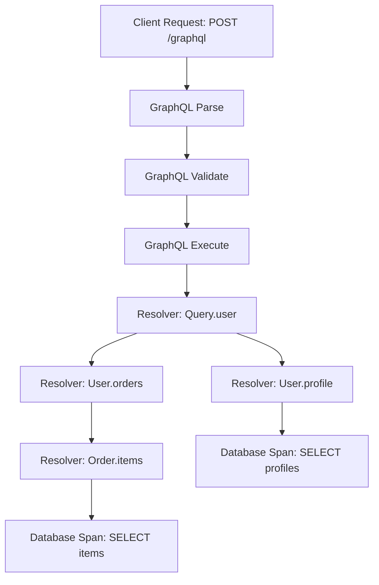

# How to Trace GraphQL Queries and Mutations with OpenTelemetry

Author: [nawazdhandala](https://www.github.com/nawazdhandala)

Tags: OpenTelemetry, GraphQL, Tracing, Observability, Node.js

Description: Learn how to trace GraphQL queries and mutations with OpenTelemetry to get full visibility into resolver performance, query complexity, and error rates.

---

GraphQL gives frontend teams incredible flexibility. They can ask for exactly the data they need, nest related resources, and batch requests. But from an observability standpoint, that flexibility creates real challenges. Every request hits the same `/graphql` endpoint, so traditional HTTP monitoring tells you almost nothing. You can't distinguish a lightweight `user { name }` query from a deeply nested `orders { items { product { reviews } } }` monster just by looking at the route.

OpenTelemetry fixes this by letting you create spans for each resolver, track query complexity, and correlate GraphQL operations with downstream database calls and service requests. In this post, we'll walk through instrumenting a Node.js GraphQL server with OpenTelemetry so you can actually see what's happening inside your graph.

## Why GraphQL Needs Special Tracing

With REST APIs, the URL and HTTP method tell you a lot. `GET /users/42` is clearly different from `POST /orders`. But GraphQL routes everything through a single endpoint. Without proper instrumentation, your traces just show a stream of `POST /graphql` spans with no meaningful differentiation.

Here's what you actually want to know:

- Which operation was executed (query name, mutation name)?
- How long did each resolver take?
- Which resolvers are N+1 bottlenecks?
- Did any resolver throw an error?
- How deep is the query nesting?

OpenTelemetry's GraphQL instrumentation library creates spans for each of these concerns, giving you a resolver-level breakdown of every operation.



## Setting Up OpenTelemetry for GraphQL

First, install the required packages. The `@opentelemetry/instrumentation-graphql` package is the official instrumentation library that hooks into the GraphQL execution engine.

```bash
# Install OpenTelemetry core packages and GraphQL instrumentation
npm install @opentelemetry/sdk-node \
  @opentelemetry/api \
  @opentelemetry/instrumentation-graphql \
  @opentelemetry/exporter-trace-otlp-http \
  @opentelemetry/sdk-trace-node \
  @opentelemetry/resources \
  @opentelemetry/semantic-conventions
```

Now create a tracing setup file. This needs to be loaded before any other application code so the instrumentation can patch the GraphQL library at import time.

```javascript
// tracing.js - Load this BEFORE your app code
const { NodeSDK } = require('@opentelemetry/sdk-node');
const { OTLPTraceExporter } = require('@opentelemetry/exporter-trace-otlp-http');
const { GraphQLInstrumentation } = require('@opentelemetry/instrumentation-graphql');
const { Resource } = require('@opentelemetry/resources');
const { ATTR_SERVICE_NAME } = require('@opentelemetry/semantic-conventions');

// Create the SDK with GraphQL instrumentation enabled
const sdk = new NodeSDK({
  resource: new Resource({
    [ATTR_SERVICE_NAME]: 'graphql-api', // Name your service for trace identification
  }),
  traceExporter: new OTLPTraceExporter({
    url: 'http://localhost:4318/v1/traces', // OTLP HTTP endpoint
  }),
  instrumentations: [
    new GraphQLInstrumentation({
      depth: 4, // Maximum query depth to trace resolvers
      allowValues: true, // Include argument values in spans (careful with PII)
      mergeItems: false, // Keep individual list item resolvers separate
    }),
  ],
});

sdk.start();

// Gracefully shut down on exit to flush pending spans
process.on('SIGTERM', () => {
  sdk.shutdown().then(() => process.exit(0));
});
```

Run your application with the tracing file preloaded:

```bash
# Preload tracing setup so instrumentation patches happen before app imports
node --require ./tracing.js app.js
```

## Understanding the Spans You Get

The GraphQL instrumentation creates several types of spans automatically:

- **graphql.parse** - Time spent parsing the query string into an AST
- **graphql.validate** - Time spent validating the query against your schema
- **graphql.execute** - The overall execution time
- **graphql.resolve** - Individual resolver execution (one per field)

Each resolve span includes attributes like `graphql.field.name`, `graphql.field.type`, and the parent type. This is where the real value comes in. You can spot slow resolvers, identify N+1 patterns (dozens of identical resolve spans under a list field), and find which parts of your schema are most expensive.

## Adding Custom Span Attributes

The automatic instrumentation is a great start, but you'll often want to add business context. For example, tagging spans with the operation name, the authenticated user, or query complexity scores.

Here's how to add custom attributes inside a resolver:

```javascript
const { trace } = require('@opentelemetry/api');

const resolvers = {
  Query: {
    user: async (parent, { id }, context) => {
      // Get the current active span from OpenTelemetry context
      const span = trace.getActiveSpan();

      if (span) {
        // Add the operation name and user ID for filtering in your trace UI
        span.setAttribute('graphql.operation.name', context.operationName || 'anonymous');
        span.setAttribute('app.user.id', id);
        span.setAttribute('app.query.source', context.clientName || 'unknown');
      }

      // Your actual resolver logic
      const user = await context.dataSources.users.findById(id);
      return user;
    },
  },
};
```

## Tracing Mutations with Error Handling

Mutations deserve extra attention because they change state. You want to know not just if they failed, but what the input was and where in the process things went wrong.

This example wraps a mutation resolver with proper span status and error recording:

```javascript
const { trace, SpanStatusCode } = require('@opentelemetry/api');

const resolvers = {
  Mutation: {
    createOrder: async (parent, { input }, context) => {
      const span = trace.getActiveSpan();

      if (span) {
        // Tag this span as a mutation for easy filtering
        span.setAttribute('graphql.operation.type', 'mutation');
        span.setAttribute('app.order.item_count', input.items.length);
      }

      try {
        // Validate inventory before placing the order
        await context.dataSources.inventory.checkAvailability(input.items);

        // Create the order in the database
        const order = await context.dataSources.orders.create(input);

        if (span) {
          span.setAttribute('app.order.id', order.id);
          span.setStatus({ code: SpanStatusCode.OK });
        }

        return order;
      } catch (error) {
        if (span) {
          // Record the error so it shows up in your trace UI
          span.recordException(error);
          span.setStatus({
            code: SpanStatusCode.ERROR,
            message: error.message,
          });
        }
        throw error;
      }
    },
  },
};
```

## Tracking DataLoader and N+1 Queries

GraphQL's nested nature makes N+1 queries a constant threat. If you're using DataLoader (and you should be), you can trace batch loads to see how effectively your batching is working.

This custom-instrumented DataLoader tracks batch sizes and cache hit rates:

```javascript
const DataLoader = require('dataloader');
const { trace, context } = require('@opentelemetry/api');

// Create a tracer for manual span creation
const tracer = trace.getTracer('graphql-dataloader');

function createTracedLoader(batchFn, name) {
  return new DataLoader(async (keys) => {
    // Create a child span for each batch load operation
    return tracer.startActiveSpan(`dataloader.batch.${name}`, async (span) => {
      span.setAttribute('dataloader.name', name);
      span.setAttribute('dataloader.batch_size', keys.length);
      span.setAttribute('dataloader.keys', JSON.stringify(keys));

      try {
        const results = await batchFn(keys);
        span.setStatus({ code: 0 }); // OK
        return results;
      } catch (error) {
        span.recordException(error);
        span.setStatus({ code: 2, message: error.message }); // ERROR
        throw error;
      } finally {
        span.end();
      }
    });
  });
}

// Usage: wrap your batch function with tracing
const userLoader = createTracedLoader(
  async (ids) => {
    // Batch load users from the database
    const users = await db.query('SELECT * FROM users WHERE id = ANY($1)', [ids]);
    return ids.map((id) => users.find((u) => u.id === id));
  },
  'users' // Name for the span
);
```

## Propagating Context Through Subscriptions

If your GraphQL server supports subscriptions, trace context should flow from the subscription setup through to each event delivery. This is trickier since subscriptions are long-lived.

```javascript
const { trace, context, propagation } = require('@opentelemetry/api');

const tracer = trace.getTracer('graphql-subscriptions');

const resolvers = {
  Subscription: {
    orderUpdated: {
      subscribe: (parent, { orderId }, ctx) => {
        // Start a span for the subscription setup
        const span = tracer.startSpan('subscription.setup.orderUpdated');
        span.setAttribute('app.order.id', orderId);

        // Extract the current context so we can propagate it to events
        const carrier = {};
        propagation.inject(context.active(), carrier);

        // Store the carrier in the subscription context for later use
        ctx.traceCarrier = carrier;
        span.end();

        return ctx.pubsub.asyncIterator(`ORDER_UPDATED_${orderId}`);
      },
      resolve: (payload, args, ctx) => {
        // Each event delivery gets its own span linked to the original subscription
        return tracer.startActiveSpan('subscription.event.orderUpdated', (span) => {
          span.setAttribute('app.order.status', payload.status);
          span.end();
          return payload;
        });
      },
    },
  },
};
```

## Configuring the Collector for GraphQL Traces

Your OpenTelemetry Collector should be set up to receive these traces and forward them to your backend. Here's a minimal collector configuration:

```yaml
# otel-collector-config.yaml
receivers:
  otlp:
    protocols:
      http:
        endpoint: "0.0.0.0:4318"  # Match the exporter URL in tracing.js

processors:
  batch:
    timeout: 5s          # Batch spans for 5 seconds before sending
    send_batch_size: 256 # Or send when 256 spans accumulate

  # Filter out overly verbose parse/validate spans if needed
  filter:
    traces:
      span:
        - 'attributes["graphql.operation.type"] == "parse"'

exporters:
  otlp:
    endpoint: "https://your-oneuptime-instance.com:4318"

service:
  pipelines:
    traces:
      receivers: [otlp]
      processors: [batch]
      exporters: [otlp]
```

## What to Look For in Your Traces

Once everything is wired up, here are the patterns to watch for:

1. **Slow resolvers** - Sort spans by duration to find the bottlenecks. Often it's a single resolver making unbatched database calls.
2. **N+1 patterns** - Look for a parent span with dozens of identical child resolver spans. That's your cue to add a DataLoader.
3. **Deep nesting** - Queries that go 5+ levels deep can cause combinatorial explosion in resolver calls.
4. **Error clustering** - Check if errors concentrate in specific resolvers or correlate with certain query patterns.
5. **Parse/validate overhead** - If parsing takes significant time, your queries might be too large or your schema too complex.

## Wrapping Up

GraphQL's flexibility is its greatest strength and its biggest observability challenge. By layering OpenTelemetry instrumentation on top of your GraphQL server, you get resolver-level visibility that makes performance tuning and debugging practical. Start with the automatic instrumentation, add custom attributes for your business context, and use the DataLoader tracing to hunt down N+1 queries. Your on-call engineers will thank you.
