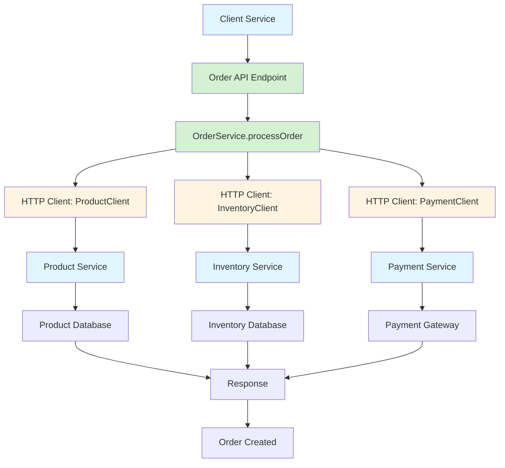

# How to Trace HTTP Client Calls in Micronaut with OpenTelemetry

Author: [nawazdhandala](https://www.github.com/nawazdhandala)

Tags: OpenTelemetry, Micronaut, HTTP Client, Tracing, Java

Description: Master distributed tracing for HTTP client calls in Micronaut applications using OpenTelemetry to track requests across microservices and external APIs.

Distributed systems rely heavily on HTTP communication between services. Understanding the performance and behavior of these client calls becomes critical as your architecture grows. OpenTelemetry provides automatic instrumentation for Micronaut's HTTP client, capturing request details, response times, and error conditions while propagating trace context across service boundaries.

This guide covers everything from basic automatic instrumentation to advanced patterns for tracing complex HTTP client scenarios in Micronaut applications.

## Why Trace HTTP Client Calls

HTTP client tracing answers critical questions about your distributed system:

- How long do requests to external services take?
- Which downstream service is causing slow response times?
- Are certain endpoints experiencing high error rates?
- How does trace context flow through your service mesh?

Micronaut's HTTP client, when instrumented with OpenTelemetry, automatically handles trace context propagation through standard W3C Trace Context headers. This means your downstream services receive the trace context and can continue the distributed trace.

## Project Setup

Add the necessary dependencies for HTTP client tracing.

```gradle
// build.gradle
dependencies {
    // Micronaut HTTP client
    implementation("io.micronaut:micronaut-http-client")

    // OpenTelemetry integration
    implementation("io.micronaut.tracing:micronaut-tracing-opentelemetry")
    implementation("io.micronaut.tracing:micronaut-tracing-opentelemetry-http")

    // OpenTelemetry SDK and API
    implementation("io.opentelemetry:opentelemetry-api")
    implementation("io.opentelemetry:opentelemetry-sdk")

    // OTLP exporter
    implementation("io.opentelemetry:opentelemetry-exporter-otlp")
}
```

Configure OpenTelemetry and the HTTP client:

```yaml
# application.yml
tracing:
  enabled: true

opentelemetry:
  service-name: micronaut-client-service

  resource-attributes:
    deployment.environment: production
    service.version: 1.0.0

  exporter:
    otlp:
      enabled: true
      endpoint: http://localhost:4317

  # Enable HTTP client instrumentation
  instrument:
    http-client: true

micronaut:
  http:
    client:
      # Global client configuration
      connect-timeout: 5s
      read-timeout: 30s
      # Connection pool settings
      pool:
        enabled: true
        max-connections: 50
```

## Automatic HTTP Client Instrumentation

Micronaut automatically instruments declarative HTTP clients when tracing is enabled.

```java
package com.example.client;

import io.micronaut.http.annotation.*;
import io.micronaut.http.client.annotation.Client;
import io.micronaut.retry.annotation.Retryable;

// Declarative HTTP client with automatic tracing
@Client("${services.product.url}")
public interface ProductClient {

    // GET request - automatically traced
    @Get("/api/products/{id}")
    Product getProduct(@PathVariable Long id);

    // POST request with body
    @Post("/api/products")
    Product createProduct(@Body Product product);

    // PUT request
    @Put("/api/products/{id}")
    Product updateProduct(@PathVariable Long id, @Body Product product);

    // DELETE request
    @Delete("/api/products/{id}")
    void deleteProduct(@PathVariable Long id);

    // Request with query parameters
    @Get("/api/products")
    List<Product> searchProducts(
        @QueryValue String query,
        @QueryValue int page,
        @QueryValue int size
    );

    // Request with custom headers
    @Get("/api/products/{id}/details")
    ProductDetails getProductDetails(
        @PathVariable Long id,
        @Header("X-API-Key") String apiKey
    );
}
```

Each HTTP client call automatically creates a span with these attributes:

- `http.method`: The HTTP method (GET, POST, etc.)
- `http.url`: The full request URL
- `http.status_code`: The response status code
- `http.request.header.*`: Request headers (if configured)
- `http.response.header.*`: Response headers (if configured)
- `net.peer.name`: The target host
- `net.peer.port`: The target port

## Using the HTTP Client with Tracing

Inject and use the client in your services.

```java
package com.example.service;

import io.micronaut.tracing.annotation.NewSpan;
import io.micronaut.tracing.annotation.SpanTag;
import io.opentelemetry.api.trace.Span;
import io.opentelemetry.api.trace.StatusCode;
import jakarta.inject.Inject;
import jakarta.inject.Singleton;

@Singleton
public class OrderService {

    @Inject
    private ProductClient productClient;

    @Inject
    private InventoryClient inventoryClient;

    @Inject
    private PaymentClient paymentClient;

    @NewSpan("process-order")
    public OrderResult processOrder(@SpanTag("order.id") Long orderId) {
        Span span = Span.current();

        try {
            // Fetch product details - creates a child span
            Product product = productClient.getProduct(orderId);
            span.setAttribute("product.id", product.getId());
            span.setAttribute("product.name", product.getName());
            span.addEvent("product_fetched");

            // Check inventory - another child span
            InventoryStatus inventory = inventoryClient.checkInventory(product.getId());
            span.setAttribute("inventory.available", inventory.isAvailable());
            span.addEvent("inventory_checked");

            if (!inventory.isAvailable()) {
                span.setStatus(StatusCode.ERROR, "Product out of stock");
                throw new OutOfStockException(product.getId());
            }

            // Process payment - creates a span to payment service
            PaymentResult payment = paymentClient.processPayment(
                orderId,
                product.getPrice()
            );
            span.setAttribute("payment.transaction_id", payment.getTransactionId());
            span.addEvent("payment_processed");

            return new OrderResult(orderId, product, payment);

        } catch (Exception e) {
            span.recordException(e);
            span.setStatus(StatusCode.ERROR, "Order processing failed");
            throw e;
        }
    }
}
```

## Manual HTTP Client Instrumentation

For programmatic HTTP clients or advanced scenarios, use manual instrumentation.

```java
package com.example.service;

import io.micronaut.http.HttpRequest;
import io.micronaut.http.HttpResponse;
import io.micronaut.http.client.HttpClient;
import io.micronaut.http.client.annotation.Client;
import io.opentelemetry.api.trace.Span;
import io.opentelemetry.api.trace.SpanKind;
import io.opentelemetry.api.trace.StatusCode;
import io.opentelemetry.api.trace.Tracer;
import io.opentelemetry.context.Scope;
import jakarta.inject.Inject;
import jakarta.inject.Singleton;

@Singleton
public class ExternalApiService {

    @Inject
    @Client("${external.api.url}")
    private HttpClient httpClient;

    @Inject
    private Tracer tracer;

    public ApiResponse callExternalApi(String endpoint, Map<String, Object> params) {
        // Create a CLIENT span for the outgoing HTTP request
        Span span = tracer.spanBuilder("http-client-call")
            .setSpanKind(SpanKind.CLIENT)
            .startSpan();

        try (Scope scope = span.makeCurrent()) {
            // Add attributes before making the request
            span.setAttribute("http.method", "POST");
            span.setAttribute("http.url", endpoint);
            span.setAttribute("service.name", "external-api");

            // Build the request
            HttpRequest<Map<String, Object>> request = HttpRequest
                .POST(endpoint, params)
                .header("Content-Type", "application/json")
                .header("X-Request-ID", span.getSpanContext().getSpanId());

            span.addEvent("request_created");

            // Make the HTTP call
            HttpResponse<ApiResponse> response = httpClient
                .toBlocking()
                .exchange(request, ApiResponse.class);

            // Record response details
            span.setAttribute("http.status_code", response.getStatus().getCode());
            span.setAttribute("response.size", response.getContentLength());
            span.addEvent("response_received");

            if (response.getStatus().getCode() >= 400) {
                span.setStatus(StatusCode.ERROR, "HTTP error: " + response.getStatus());
            } else {
                span.setStatus(StatusCode.OK);
            }

            return response.body();

        } catch (Exception e) {
            span.recordException(e);
            span.setStatus(StatusCode.ERROR, "Request failed");
            throw new ApiException("Failed to call external API", e);
        } finally {
            span.end();
        }
    }
}
```

## Tracing Reactive HTTP Clients

Micronaut supports reactive HTTP clients. OpenTelemetry context propagates correctly through reactive chains.

```java
package com.example.service;

import io.micronaut.http.HttpRequest;
import io.micronaut.http.client.annotation.Client;
import io.micronaut.reactor.http.client.ReactorHttpClient;
import io.micronaut.tracing.annotation.NewSpan;
import io.opentelemetry.api.trace.Span;
import io.opentelemetry.api.trace.Tracer;
import jakarta.inject.Inject;
import jakarta.inject.Singleton;
import reactor.core.publisher.Flux;
import reactor.core.publisher.Mono;

@Singleton
public class ReactiveProductService {

    @Inject
    @Client("${services.product.url}")
    private ReactorHttpClient httpClient;

    @Inject
    private Tracer tracer;

    @NewSpan("fetch-product-async")
    public Mono<Product> fetchProductAsync(Long productId) {
        // Current span is automatically propagated through the reactive chain
        Span span = Span.current();
        span.setAttribute("product.id", productId);

        return httpClient
            .retrieve(HttpRequest.GET("/api/products/" + productId), Product.class)
            .doOnNext(product -> {
                // This executes in the same trace context
                span.setAttribute("product.name", product.getName());
                span.setAttribute("product.price", product.getPrice().doubleValue());
                span.addEvent("product_retrieved");
            })
            .doOnError(error -> {
                span.recordException(error);
                span.setAttribute("error.type", error.getClass().getSimpleName());
            });
    }

    @NewSpan("fetch-multiple-products")
    public Flux<Product> fetchMultipleProducts(List<Long> productIds) {
        Span span = Span.current();
        span.setAttribute("product.count", productIds.size());

        // Make parallel requests to fetch multiple products
        return Flux.fromIterable(productIds)
            .flatMap(productId -> {
                // Each product fetch gets its own child span
                Span childSpan = tracer.spanBuilder("fetch-product-" + productId)
                    .startSpan();

                return httpClient
                    .retrieve(HttpRequest.GET("/api/products/" + productId), Product.class)
                    .doOnNext(product -> {
                        childSpan.setAttribute("product.id", product.getId());
                        childSpan.setAttribute("product.name", product.getName());
                    })
                    .doFinally(signalType -> childSpan.end());
            });
    }

    @NewSpan("aggregate-product-data")
    public Mono<ProductAggregate> aggregateProductData(Long productId) {
        Span span = Span.current();
        span.setAttribute("product.id", productId);

        // Combine multiple API calls into a single result
        Mono<Product> productMono = httpClient
            .retrieve(HttpRequest.GET("/api/products/" + productId), Product.class);

        Mono<Reviews> reviewsMono = httpClient
            .retrieve(HttpRequest.GET("/api/reviews/product/" + productId), Reviews.class);

        Mono<Inventory> inventoryMono = httpClient
            .retrieve(HttpRequest.GET("/api/inventory/" + productId), Inventory.class);

        // Zip all responses together
        return Mono.zip(productMono, reviewsMono, inventoryMono)
            .map(tuple -> {
                Product product = tuple.getT1();
                Reviews reviews = tuple.getT2();
                Inventory inventory = tuple.getT3();

                span.setAttribute("reviews.count", reviews.getCount());
                span.setAttribute("inventory.quantity", inventory.getQuantity());
                span.addEvent("data_aggregated");

                return new ProductAggregate(product, reviews, inventory);
            });
    }
}
```

## Handling HTTP Client Errors and Retries

Implement proper error handling and retry logic with tracing.

```java
package com.example.service;

import io.micronaut.http.HttpResponse;
import io.micronaut.http.client.exceptions.HttpClientException;
import io.micronaut.retry.annotation.Retryable;
import io.micronaut.tracing.annotation.NewSpan;
import io.opentelemetry.api.trace.Span;
import io.opentelemetry.api.trace.StatusCode;
import jakarta.inject.Inject;
import jakarta.inject.Singleton;

@Singleton
public class ResilientApiService {

    @Inject
    private ExternalApiClient apiClient;

    // Automatically retry on failures with exponential backoff
    @Retryable(
        attempts = "3",
        delay = "1s",
        multiplier = "2",
        includes = HttpClientException.class
    )
    @NewSpan("call-with-retry")
    public ApiResponse callWithRetry(String endpoint, Object payload) {
        Span span = Span.current();
        span.setAttribute("endpoint", endpoint);

        // Track retry attempt
        String attemptKey = "retry.attempt";
        int attempt = span.getAttribute(attemptKey) != null
            ? (int) span.getAttribute(attemptKey) + 1
            : 1;
        span.setAttribute(attemptKey, attempt);

        try {
            ApiResponse response = apiClient.call(endpoint, payload);

            span.setAttribute("http.status_code", response.getStatusCode());
            span.addEvent("request_successful");
            span.setStatus(StatusCode.OK);

            return response;

        } catch (HttpClientException e) {
            span.recordException(e);
            span.addEvent("request_failed");
            span.setAttribute("error.message", e.getMessage());

            if (attempt >= 3) {
                span.setStatus(StatusCode.ERROR, "Max retries exceeded");
            }

            throw e;
        }
    }

    // Circuit breaker pattern with tracing
    @NewSpan("call-with-circuit-breaker")
    public ApiResponse callWithCircuitBreaker(String endpoint) {
        Span span = Span.current();

        // Check circuit breaker state
        if (circuitBreaker.isOpen()) {
            span.setAttribute("circuit_breaker.state", "OPEN");
            span.addEvent("circuit_breaker_open");
            span.setStatus(StatusCode.ERROR, "Circuit breaker open");
            throw new CircuitBreakerException("Service unavailable");
        }

        span.setAttribute("circuit_breaker.state", "CLOSED");

        try {
            ApiResponse response = apiClient.call(endpoint, null);

            circuitBreaker.recordSuccess();
            span.addEvent("request_successful");
            span.setStatus(StatusCode.OK);

            return response;

        } catch (Exception e) {
            circuitBreaker.recordFailure();
            span.recordException(e);
            span.addEvent("request_failed");
            span.setStatus(StatusCode.ERROR);

            throw e;
        }
    }
}
```

## Tracing HTTP Client Interceptors

Create custom interceptors to add tracing logic to all HTTP client calls.

```java
package com.example.interceptor;

import io.micronaut.http.HttpResponse;
import io.micronaut.http.MutableHttpRequest;
import io.micronaut.http.annotation.Filter;
import io.micronaut.http.filter.ClientFilterChain;
import io.micronaut.http.filter.HttpClientFilter;
import io.opentelemetry.api.trace.Span;
import io.opentelemetry.api.trace.Tracer;
import io.opentelemetry.context.Scope;
import org.reactivestreams.Publisher;
import reactor.core.publisher.Flux;

import jakarta.inject.Inject;

@Filter("/api/**")
public class TracingHttpClientFilter implements HttpClientFilter {

    @Inject
    private Tracer tracer;

    @Override
    public Publisher<? extends HttpResponse<?>> doFilter(
            MutableHttpRequest<?> request,
            ClientFilterChain chain) {

        // Create a span for this HTTP client call
        Span span = tracer.spanBuilder("http.client.filter")
            .startSpan();

        try (Scope scope = span.makeCurrent()) {
            // Add custom attributes
            span.setAttribute("http.method", request.getMethod().name());
            span.setAttribute("http.url", request.getUri().toString());
            span.setAttribute("http.target", request.getPath());

            // Add custom header
            request.header("X-Trace-ID", span.getSpanContext().getTraceId());
            request.header("X-Span-ID", span.getSpanContext().getSpanId());

            long startTime = System.currentTimeMillis();
            span.addEvent("request_started");

            return Flux.from(chain.proceed(request))
                .doOnNext(response -> {
                    // Record response details
                    long duration = System.currentTimeMillis() - startTime;
                    span.setAttribute("http.status_code", response.getStatus().getCode());
                    span.setAttribute("http.duration_ms", duration);
                    span.addEvent("response_received");

                    if (response.getStatus().getCode() >= 400) {
                        span.setAttribute("error", true);
                    }
                })
                .doOnError(error -> {
                    span.recordException(error);
                    span.setAttribute("error", true);
                    span.setAttribute("error.type", error.getClass().getSimpleName());
                })
                .doFinally(signalType -> {
                    span.end();
                });
        }
    }
}
```

## Visualizing HTTP Client Traces

Here's how HTTP client traces flow through a microservices architecture:



## Performance Optimization for HTTP Client Tracing

Configure HTTP client and tracing for optimal performance.

```yaml
# application-prod.yml
micronaut:
  http:
    client:
      # Connection pooling
      pool:
        enabled: true
        max-connections: 100
        max-pending-acquires: 200
        acquire-timeout: 5s

      # Timeouts
      connect-timeout: 5s
      read-timeout: 30s

      # HTTP/2 support
      http-version: HTTP_2_0

opentelemetry:
  # Optimize span processing
  span-processor:
    batch:
      schedule-delay: 5000
      max-queue-size: 4096
      max-export-batch-size: 512

  # Limit span attributes
  span-limits:
    max-attributes: 64
    max-events: 64
    max-attribute-length: 512

  # Selective instrumentation
  instrument:
    http-client: true
    # Disable if not needed
    http-server: true
```

## Testing HTTP Client Tracing

Write tests to verify HTTP client tracing works correctly.

```java
package com.example.client;

import io.micronaut.http.HttpRequest;
import io.micronaut.http.client.HttpClient;
import io.micronaut.http.client.annotation.Client;
import io.micronaut.test.extensions.junit5.annotation.MicronautTest;
import io.opentelemetry.api.trace.Span;
import io.opentelemetry.sdk.testing.junit5.OpenTelemetryExtension;
import io.opentelemetry.sdk.trace.data.SpanData;
import jakarta.inject.Inject;
import org.junit.jupiter.api.Test;
import org.junit.jupiter.api.extension.RegisterExtension;

import java.util.List;

import static org.junit.jupiter.api.Assertions.*;

@MicronautTest
public class ProductClientTest {

    @RegisterExtension
    static final OpenTelemetryExtension otelTesting = OpenTelemetryExtension.create();

    @Inject
    @Client("/")
    HttpClient client;

    @Test
    public void testHttpClientCreatesSpan() {
        // Make HTTP request
        String result = client.toBlocking()
            .retrieve(HttpRequest.GET("/api/products/123"), String.class);

        // Verify span was created
        List<SpanData> spans = otelTesting.getSpans();
        assertFalse(spans.isEmpty());

        SpanData httpSpan = spans.stream()
            .filter(s -> s.getName().contains("GET"))
            .findFirst()
            .orElse(null);

        assertNotNull(httpSpan);
        assertEquals("GET", httpSpan.getAttributes().get("http.method"));
        assertTrue(httpSpan.getAttributes().get("http.url").toString().contains("/api/products/123"));
    }
}
```

Tracing HTTP client calls in Micronaut provides complete visibility into your service-to-service communication. The automatic instrumentation handles most scenarios, while manual instrumentation and custom filters give you control for specialized requirements. Combined with proper error handling and retry logic, you get both observability and resilience in your distributed system.
