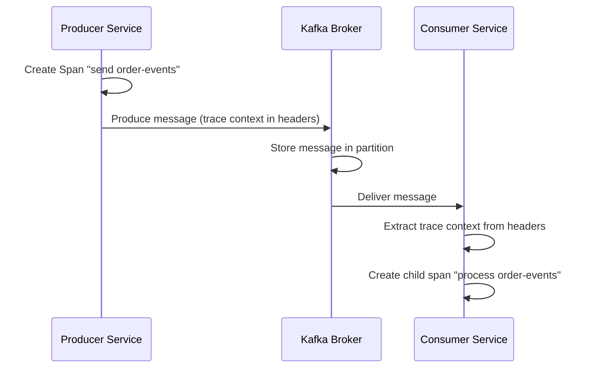

# How to Trace Kafka Producer-Consumer Chains with OpenTelemetry

Author: [nawazdhandala](https://www.github.com/nawazdhandala)

Tags: OpenTelemetry, Kafka, Distributed Tracing, Messaging, Observability, Java, Python

Description: Learn how to instrument Apache Kafka producers and consumers with OpenTelemetry to get full end-to-end trace visibility across asynchronous message flows.

---

Apache Kafka sits at the heart of many distributed systems, handling millions of messages per second across topics and partitions. But once a message leaves a producer and lands in a topic, visibility often disappears. You know the message was sent. You know it was consumed. But connecting those two events into a single trace? That is where most teams struggle.

OpenTelemetry solves this by propagating trace context through Kafka message headers. The producer injects trace information into the message, and the consumer extracts it on the other side. This gives you a continuous trace that spans the entire producer-to-consumer chain, even across multiple services.

## Why Kafka Tracing Is Different

Tracing synchronous HTTP calls is straightforward. A request goes out, a response comes back, and the trace context rides along in HTTP headers. Kafka is fundamentally different because the producer and consumer are decoupled. The producer does not wait for the consumer. They might not even be running at the same time.

This means you need a mechanism to embed trace context into the Kafka message itself. OpenTelemetry handles this through its context propagation API, which injects W3C Trace Context headers into Kafka record headers.



## Setting Up the Producer in Java

The easiest way to instrument Kafka producers in Java is with the OpenTelemetry Java agent. It automatically wraps the KafkaProducer and injects trace context into every message. But if you want more control, manual instrumentation is the way to go.

First, add the required dependencies to your project:

```xml
<!-- OpenTelemetry Kafka instrumentation library -->
<dependency>
    <groupId>io.opentelemetry.instrumentation</groupId>
    <artifactId>opentelemetry-kafka-clients-2.6</artifactId>
    <version>2.12.0-alpha</version>
</dependency>
<!-- Core OpenTelemetry API -->
<dependency>
    <groupId>io.opentelemetry</groupId>
    <artifactId>opentelemetry-api</artifactId>
    <version>1.46.0</version>
</dependency>
```

Now wrap your KafkaProducer with the tracing interceptor:

```java
// Configure producer properties with OpenTelemetry interceptor
Properties props = new Properties();
props.put(ProducerConfig.BOOTSTRAP_SERVERS_CONFIG, "localhost:9092");
props.put(ProducerConfig.KEY_SERIALIZER_CLASS_CONFIG, StringSerializer.class.getName());
props.put(ProducerConfig.VALUE_SERIALIZER_CLASS_CONFIG, StringSerializer.class.getName());

// Add the OpenTelemetry interceptor to automatically inject trace context
props.put(ProducerConfig.INTERCEPTOR_CLASSES_CONFIG,
    "io.opentelemetry.instrumentation.kafkaclients.v2_6.TracingProducerInterceptor");

KafkaProducer<String, String> producer = new KafkaProducer<>(props);

// Every message sent through this producer will carry trace context
ProducerRecord<String, String> record = new ProducerRecord<>(
    "order-events",    // topic
    "order-123",       // key
    "{\"action\": \"created\", \"amount\": 99.95}"  // value
);

// The interceptor creates a PRODUCER span and injects traceparent into headers
producer.send(record, (metadata, exception) -> {
    if (exception != null) {
        // Span will be marked with error status automatically
        System.err.println("Failed to send message: " + exception.getMessage());
    }
});
```

The interceptor approach is clean because you configure it once and every message gets traced. The interceptor creates a span with kind PRODUCER, sets attributes like `messaging.system`, `messaging.destination`, and `messaging.kafka.partition`, and injects the trace context into the Kafka record headers.

## Setting Up the Consumer in Java

The consumer side mirrors the producer. You add an interceptor that extracts the trace context from incoming messages and creates a CONSUMER span linked to the producer span.

```java
// Configure consumer properties with OpenTelemetry interceptor
Properties props = new Properties();
props.put(ConsumerConfig.BOOTSTRAP_SERVERS_CONFIG, "localhost:9092");
props.put(ConsumerConfig.GROUP_ID_CONFIG, "order-processing-group");
props.put(ConsumerConfig.KEY_DESERIALIZER_CLASS_CONFIG, StringDeserializer.class.getName());
props.put(ConsumerConfig.VALUE_DESERIALIZER_CLASS_CONFIG, StringDeserializer.class.getName());

// Add the tracing interceptor for consumers
props.put(ConsumerConfig.INTERCEPTOR_CLASSES_CONFIG,
    "io.opentelemetry.instrumentation.kafkaclients.v2_6.TracingConsumerInterceptor");

KafkaConsumer<String, String> consumer = new KafkaConsumer<>(props);
consumer.subscribe(Collections.singletonList("order-events"));

// Poll loop with tracing
while (true) {
    ConsumerRecords<String, String> records = consumer.poll(Duration.ofMillis(100));
    for (ConsumerRecord<String, String> record : records) {
        // The interceptor extracts trace context and creates a CONSUMER span
        // Your processing code runs within that span's context
        processOrder(record.value());
    }
}
```

When the consumer interceptor processes a message, it reads the `traceparent` header that the producer injected. It then creates a new span whose parent is the producer span. This links the two sides of the Kafka interaction into a single distributed trace.

## Python Producer-Consumer Example

If you are working in Python, the `opentelemetry-instrumentation-confluent-kafka` package provides similar functionality for the confluent-kafka client.

```python
# Install the required packages
# pip install opentelemetry-api opentelemetry-sdk opentelemetry-instrumentation-confluent-kafka confluent-kafka

from opentelemetry import trace
from opentelemetry.sdk.trace import TracerProvider
from opentelemetry.sdk.trace.export import BatchSpanProcessor
from opentelemetry.exporter.otlp.proto.grpc.trace_exporter import OTLPSpanExporter
from opentelemetry.instrumentation.confluent_kafka import ConfluentKafkaInstrumentor

# Set up the tracer provider with OTLP export
provider = TracerProvider()
processor = BatchSpanProcessor(OTLPSpanExporter(endpoint="http://localhost:4317"))
provider.add_span_processor(processor)
trace.set_tracer_provider(provider)

# Instrument the confluent-kafka library globally
ConfluentKafkaInstrumentor().instrument()
```

Once instrumented, both producers and consumers created with the confluent-kafka library will automatically participate in distributed tracing. The instrumentor wraps the produce and consume methods to handle context injection and extraction.

```python
from confluent_kafka import Producer, Consumer

# Producer usage after instrumentation
producer = Producer({"bootstrap.servers": "localhost:9092"})

# This produce call will automatically create a span and inject trace context
producer.produce(
    topic="order-events",
    key="order-456",
    value='{"action": "shipped", "tracking": "TRK-789"}'
)
producer.flush()

# Consumer usage after instrumentation
consumer = Consumer({
    "bootstrap.servers": "localhost:9092",
    "group.id": "shipping-service",
    "auto.offset.reset": "earliest"
})
consumer.subscribe(["order-events"])

# Each consumed message will have its trace context extracted automatically
while True:
    msg = consumer.poll(timeout=1.0)
    if msg is None:
        continue
    if msg.error():
        continue
    # Processing happens within the context of the extracted span
    process_shipping_event(msg.value().decode("utf-8"))
```

## Handling Batch Consumers

A common pattern with Kafka is batch consumption, where a consumer polls multiple messages and processes them together. This creates an interesting tracing challenge because each message may belong to a different trace.

The recommended approach is to create a processing span for each message individually, linking back to its original trace:

```java
// Batch processing with per-message trace context
ConsumerRecords<String, String> records = consumer.poll(Duration.ofMillis(500));

for (ConsumerRecord<String, String> record : records) {
    // Extract the trace context from this specific message's headers
    Context extractedContext = openTelemetry.getPropagators()
        .getTextMapPropagator()
        .extract(Context.current(), record.headers(), headerGetter);

    // Create a span within the extracted context
    Span processSpan = tracer.spanBuilder("process " + record.topic())
        .setParent(extractedContext)
        .setSpanKind(SpanKind.CONSUMER)
        .setAttribute("messaging.kafka.partition", record.partition())
        .setAttribute("messaging.kafka.offset", record.offset())
        .startSpan();

    try (Scope scope = processSpan.makeCurrent()) {
        // Process the individual message
        handleMessage(record);
    } catch (Exception e) {
        processSpan.recordException(e);
        processSpan.setStatus(StatusCode.ERROR, e.getMessage());
    } finally {
        processSpan.end();
    }
}
```

This approach preserves the trace lineage for each message while still allowing batch consumption. Each message gets its own span tied to the correct parent trace.

## Collector Configuration for Kafka Traces

Your OpenTelemetry Collector should be set up to receive and export the Kafka traces. A minimal configuration looks like this:

```yaml
# Collector configuration for receiving Kafka instrumentation traces
receivers:
  otlp:
    protocols:
      grpc:
        # Standard OTLP gRPC receiver endpoint
        endpoint: 0.0.0.0:4317
      http:
        # Standard OTLP HTTP receiver endpoint
        endpoint: 0.0.0.0:4318

processors:
  batch:
    # Batch traces before exporting for efficiency
    timeout: 5s
    send_batch_size: 256

exporters:
  otlp:
    # Send traces to your observability backend
    endpoint: https://oneuptime.example.com:4317
    tls:
      insecure: false

service:
  pipelines:
    traces:
      receivers: [otlp]
      processors: [batch]
      exporters: [otlp]
```

## What You Get in Your Traces

Once everything is wired up, your traces will show the complete message flow. A single trace for an order might show:

1. The API handler that received the HTTP request
2. A PRODUCER span showing the message being sent to the `order-events` topic
3. A CONSUMER span in the order processing service showing the message being received
4. Any downstream processing spans, including database writes or additional Kafka publishes

Each span carries semantic attributes defined by the OpenTelemetry messaging semantic conventions, including `messaging.system` (kafka), `messaging.destination.name` (the topic), `messaging.kafka.consumer.group`, and `messaging.kafka.message.offset`.

## Common Pitfalls

Watch out for a few things when tracing Kafka. First, make sure your producer and consumer are using the same propagation format. W3C Trace Context is the default and works well. Second, be aware that auto-instrumentation agents and manual interceptors can conflict if both are active. Pick one approach and stick with it. Third, high-throughput topics can generate a lot of trace data, so consider using sampling to keep costs manageable.

Kafka tracing with OpenTelemetry turns an opaque message bus into a transparent pipeline. You can follow any message from the moment it is produced to the moment it is consumed and processed, across any number of services. That visibility is what makes debugging distributed systems manageable.
