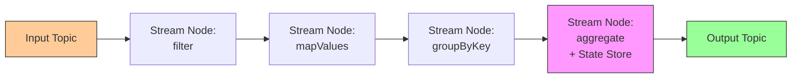
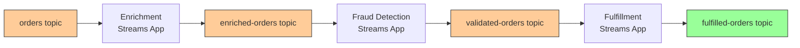

# How to Trace Apache Kafka Streams Applications with OpenTelemetry

Author: [nawazdhandala](https://www.github.com/nawazdhandala)

Tags: OpenTelemetry, Kafka Streams, Distributed Tracing, Java, Stream Processing, Observability, Apache Kafka

Description: Learn how to trace Apache Kafka Streams applications with OpenTelemetry for visibility into stream processing topologies, state stores, and message transformations.

---

Kafka Streams is a client library for building real-time stream processing applications on top of Apache Kafka. Unlike standalone stream processing frameworks like Flink or Spark Streaming, Kafka Streams runs as part of your application, which makes it lightweight but also means you need to handle your own observability. OpenTelemetry provides the instrumentation needed to trace messages as they flow through stream processing topologies, measure processing latency at each stage, and understand the performance characteristics of stateful operations like joins and aggregations.

This guide walks through instrumenting Kafka Streams applications with OpenTelemetry, from basic producer/consumer tracing through topology-level visibility and state store monitoring.

## The Challenge of Tracing Stream Processing

Kafka Streams applications consume from input topics, apply transformations, and produce to output topics. A single input message might trigger multiple downstream messages through branching, joins, or windowed aggregations. Traditional request-response tracing does not map cleanly to this model because there is no single "request" flowing through the system.

The approach that works well with OpenTelemetry is to trace the processing of each record through the topology, creating linked spans that show how input records transform into output records.



## Setting Up OpenTelemetry with Kafka Streams

The OpenTelemetry Java agent provides automatic instrumentation for Kafka clients, which covers the produce and consume operations that Kafka Streams performs internally. Start your Kafka Streams application with the agent attached:

```bash
# Start Kafka Streams application with OpenTelemetry agent
java -javaagent:/opt/opentelemetry-javaagent.jar \
  -Dotel.service.name=order-stream-processor \
  -Dotel.exporter.otlp.endpoint=http://otel-collector:4317 \
  -Dotel.instrumentation.kafka.experimental-span-attributes=true \
  -Dotel.instrumentation.kafka.producer-propagation.enabled=true \
  -Dotel.traces.sampler=parentbased_traceid_ratio \
  -Dotel.traces.sampler.arg=0.1 \
  -jar order-stream-processor.jar
```

The `kafka.experimental-span-attributes` flag enables additional attributes on Kafka spans like partition, offset, and consumer group. The `producer-propagation.enabled` flag ensures trace context is injected into messages produced by the Streams application, maintaining trace continuity through the entire processing pipeline.

A sampling rate of 0.1 (10%) is often appropriate for high-throughput Kafka Streams applications. Without sampling, the volume of traces can overwhelm your backend. Adjust this based on your throughput and storage capacity.

## Building an Instrumented Kafka Streams Topology

Here is a Kafka Streams application that processes order events, enriches them, and produces aggregate results. The code includes manual span creation at key processing stages:

```java
// OrderStreamProcessor.java - Kafka Streams topology with tracing
import org.apache.kafka.streams.*;
import org.apache.kafka.streams.kstream.*;
import org.apache.kafka.common.serialization.Serdes;
import io.opentelemetry.api.GlobalOpenTelemetry;
import io.opentelemetry.api.trace.Tracer;
import io.opentelemetry.api.trace.Span;
import io.opentelemetry.api.trace.SpanKind;
import io.opentelemetry.context.Scope;

import java.util.Properties;
import java.time.Duration;

public class OrderStreamProcessor {

    private static final Tracer tracer =
        GlobalOpenTelemetry.getTracer("order-stream-processor");

    public static void main(String[] args) {
        Properties props = new Properties();
        props.put(StreamsConfig.APPLICATION_ID_CONFIG,
            "order-stream-processor");
        props.put(StreamsConfig.BOOTSTRAP_SERVERS_CONFIG,
            "kafka-broker:9092");
        props.put(StreamsConfig.DEFAULT_KEY_SERDE_CLASS_CONFIG,
            Serdes.String().getClass());
        props.put(StreamsConfig.DEFAULT_VALUE_SERDE_CLASS_CONFIG,
            Serdes.String().getClass());
        // Use exactly-once processing semantics
        props.put(StreamsConfig.PROCESSING_GUARANTEE_CONFIG,
            StreamsConfig.EXACTLY_ONCE_V2);

        StreamsBuilder builder = new StreamsBuilder();
        buildTopology(builder);

        KafkaStreams streams = new KafkaStreams(
            builder.build(), props);

        // Register state listener for operational monitoring
        streams.setStateListener((newState, oldState) -> {
            Span span = tracer.spanBuilder("streams.state_change")
                .setAttribute("streams.old_state", oldState.name())
                .setAttribute("streams.new_state", newState.name())
                .startSpan();
            span.end();
        });

        streams.start();

        // Shutdown hook for clean exit
        Runtime.getRuntime().addShutdownHook(
            new Thread(streams::close));
    }

    private static void buildTopology(StreamsBuilder builder) {
        // Read from the orders input topic
        KStream<String, String> orders = builder.stream("orders");

        // Filter out invalid orders with tracing
        KStream<String, String> validOrders = orders.filter(
            (key, value) -> {
                Span span = tracer.spanBuilder("stream.filter.validate")
                    .setAttribute("order.id", key)
                    .startSpan();
                try (Scope scope = span.makeCurrent()) {
                    boolean isValid = validateOrder(value);
                    span.setAttribute("order.valid", isValid);
                    return isValid;
                } finally {
                    span.end();
                }
            });

        // Enrich orders with customer data from a state store
        KTable<String, String> customers =
            builder.table("customers");

        KStream<String, String> enrichedOrders = validOrders
            .selectKey((key, value) -> extractCustomerId(value))
            .join(customers,
                (orderValue, customerValue) -> {
                    Span span = tracer
                        .spanBuilder("stream.join.customer_enrichment")
                        .startSpan();
                    try (Scope scope = span.makeCurrent()) {
                        String enriched = enrichOrder(
                            orderValue, customerValue);
                        span.setAttribute("enrichment.success", true);
                        return enriched;
                    } finally {
                        span.end();
                    }
                });

        // Branch into high-value and standard orders
        var branches = enrichedOrders.split(Named.as("order-"))
            .branch((key, value) -> extractTotal(value) > 1000,
                Branched.as("high-value"))
            .defaultBranch(Branched.as("standard"));

        // High-value orders go to a priority topic
        branches.get("order-high-value")
            .peek((key, value) -> {
                Span span = tracer
                    .spanBuilder("stream.route.high_value")
                    .setAttribute("order.id", key)
                    .startSpan();
                span.end();
            })
            .to("orders-high-value");

        // Standard orders go to the regular processing topic
        branches.get("order-standard")
            .to("orders-standard");

        // Aggregate order totals per customer in a time window
        enrichedOrders
            .groupBy((key, value) -> extractCustomerId(value))
            .windowedBy(TimeWindows.ofSizeWithNoGrace(
                Duration.ofMinutes(5)))
            .aggregate(
                () -> "0.0",
                (key, value, aggregate) -> {
                    // Track aggregation operations
                    Span span = tracer
                        .spanBuilder("stream.aggregate.order_totals")
                        .setAttribute("customer.id", key)
                        .startSpan();
                    try (Scope scope = span.makeCurrent()) {
                        double total = Double.parseDouble(aggregate)
                            + extractTotal(value);
                        return String.valueOf(total);
                    } finally {
                        span.end();
                    }
                },
                Materialized.as("order-totals-store"))
            .toStream()
            .map((windowedKey, value) -> KeyValue.pair(
                windowedKey.key(), value))
            .to("customer-order-totals");
    }
}
```

The topology reads orders, validates them, enriches them with customer data via a KTable join, branches them by value, and aggregates totals per customer in five-minute windows. Each major processing step has a manual span that captures the business context of the transformation.

Note that the Java agent handles the underlying Kafka consume and produce operations automatically. The manual spans add visibility into the stream processing logic itself, which is where most application-specific issues occur.

## Monitoring State Store Performance

Kafka Streams state stores (backed by RocksDB) are a common source of performance issues. Large state stores can cause slow restarts, and state store operations contribute to processing latency. Use the built-in Kafka Streams metrics alongside custom OpenTelemetry metrics to monitor state store health:

```java
// StateStoreMonitor.java - Export state store metrics via OTel
import io.opentelemetry.api.metrics.Meter;
import io.opentelemetry.api.metrics.ObservableLongGauge;
import io.opentelemetry.api.GlobalOpenTelemetry;
import org.apache.kafka.streams.KafkaStreams;
import org.apache.kafka.common.Metric;
import org.apache.kafka.common.MetricName;

import java.util.Map;

public class StateStoreMonitor {

    private final KafkaStreams streams;
    private final Meter meter;

    public StateStoreMonitor(KafkaStreams streams) {
        this.streams = streams;
        this.meter = GlobalOpenTelemetry.getMeter(
            "kafka-streams-state-stores");
        registerMetrics();
    }

    private void registerMetrics() {
        // Expose state store size as an OTel gauge
        meter.gaugeBuilder("kafka.streams.state_store.size")
            .setDescription("Approximate number of entries in state store")
            .setUnit("entries")
            .ofLongs()
            .buildWithCallback(measurement -> {
                Map<MetricName, ? extends Metric> metrics =
                    streams.metrics();
                metrics.forEach((name, metric) -> {
                    // Filter for state store size metrics
                    if (name.name().equals("num-entries-active-mem-table")
                        && name.group().equals(
                            "stream-state-metrics")) {
                        String storeName = name.tags()
                            .getOrDefault("rocksdb-state-id", "unknown");
                        measurement.record(
                            ((Number) metric.metricValue()).longValue(),
                            io.opentelemetry.api.common.Attributes.of(
                                io.opentelemetry.api.common.AttributeKey
                                    .stringKey("store.name"), storeName
                            ));
                    }
                });
            });

        // Track state store operation latency
        meter.gaugeBuilder("kafka.streams.state_store.latency")
            .setDescription("Average state store operation latency")
            .setUnit("ms")
            .buildWithCallback(measurement -> {
                Map<MetricName, ? extends Metric> metrics =
                    streams.metrics();
                metrics.forEach((name, metric) -> {
                    if (name.name().equals("put-latency-avg")
                        && name.group().equals(
                            "stream-state-metrics")) {
                        String storeName = name.tags()
                            .getOrDefault("rocksdb-state-id", "unknown");
                        measurement.record(
                            ((Number) metric.metricValue()).doubleValue(),
                            io.opentelemetry.api.common.Attributes.of(
                                io.opentelemetry.api.common.AttributeKey
                                    .stringKey("store.name"), storeName
                            ));
                    }
                });
            });
    }
}
```

This code bridges Kafka Streams' built-in metrics into the OpenTelemetry metrics pipeline. By exposing state store size and operation latency as OpenTelemetry metrics, you can alert on state store growth and correlate state store performance with processing latency in the same observability platform.

## Collector Configuration for Kafka Streams Telemetry

The OpenTelemetry Collector configuration should handle both traces and metrics from the Kafka Streams application:

```yaml
# otel-collector-config.yaml
receivers:
  otlp:
    protocols:
      grpc:
        endpoint: 0.0.0.0:4317
      http:
        endpoint: 0.0.0.0:4318

processors:
  batch:
    timeout: 10s
    send_batch_size: 500

  # Filter out low-value internal Kafka spans
  filter/kafka_internal:
    traces:
      span:
        - 'attributes["messaging.kafka.consumer.group"] == "__consumer_offsets"'

  # Add topology metadata
  resource:
    attributes:
      - key: kafka.streams.application
        value: order-stream-processor
        action: upsert

exporters:
  otlp:
    endpoint: https://oneuptime-ingest.example.com:4317
    tls:
      insecure: false

service:
  pipelines:
    traces:
      receivers: [otlp]
      processors: [filter/kafka_internal, resource, batch]
      exporters: [otlp]
    metrics:
      receivers: [otlp]
      processors: [resource, batch]
      exporters: [otlp]
```

The filter processor removes spans from internal Kafka operations like consumer offset commits, which add noise without providing useful debugging information. Adjust the filter patterns based on what your specific application generates.

## Tracing Through Multi-Stage Topologies

In production Kafka Streams deployments, a single business event often flows through multiple stream processing applications. For example, an order might be processed by an enrichment service, then a fraud detection service, then a fulfillment service. Each of these might be a separate Kafka Streams application reading from and writing to different topics.

The OpenTelemetry Java agent maintains trace context across these boundaries automatically. When one Kafka Streams application produces a record to a topic, the agent injects the trace context into the Kafka record headers. When the next application consumes that record, the agent extracts the context and creates a linked span.



Each application adds its processing spans to the trace, creating an end-to-end view of how the order moves through the entire pipeline. The trace ID remains the same across all three applications, so you can search for a single order ID and see its complete processing history.

## Handling High-Throughput Sampling

Kafka Streams applications often process thousands or millions of records per second. Tracing every record would generate an unmanageable volume of spans. The sampling configuration in the Java agent startup command controls this:

```bash
# Parent-based sampling at 10% for new traces
-Dotel.traces.sampler=parentbased_traceid_ratio
-Dotel.traces.sampler.arg=0.1
```

The `parentbased_traceid_ratio` sampler respects the sampling decision from upstream services. If an upstream service decided to trace a particular request, all downstream Kafka Streams processing for that request will also be traced, regardless of the local sampling ratio. The 0.1 ratio only applies to records that start new traces (those without a parent context).

This approach ensures you get complete end-to-end traces for sampled requests while keeping the overall trace volume manageable.

## Conclusion

Tracing Kafka Streams applications with OpenTelemetry provides the visibility needed to understand and troubleshoot real-time stream processing pipelines. The Java agent handles the underlying Kafka produce/consume tracing automatically, while manual spans in your topology code capture the business logic that transforms and routes records. Combined with state store metrics and proper sampling configuration, this instrumentation gives you a practical observability setup that scales with your Kafka Streams workload.
