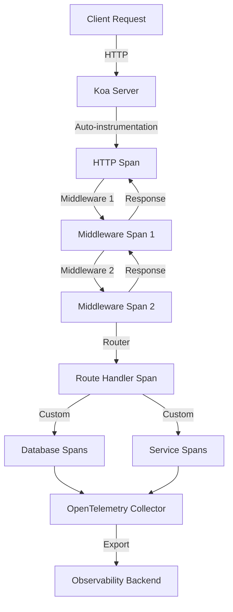

# How to Trace Koa.js Routes with OpenTelemetry Middleware

Author: [nawazdhandala](https://www.github.com/nawazdhandala)

Tags: OpenTelemetry, Koa.js, Node.js, Middleware, Routing, Tracing

Description: Comprehensive guide to implementing distributed tracing in Koa.js applications using OpenTelemetry middleware for monitoring routes, middleware chains, and application performance.

Koa.js offers an elegant, minimalist approach to building web applications with its middleware-centric architecture and powerful context object. As Koa applications grow from simple APIs to complex systems with multiple middleware layers and downstream dependencies, understanding the performance characteristics of your middleware chain becomes critical for maintaining responsiveness and reliability.

OpenTelemetry provides standardized instrumentation that integrates naturally with Koa's middleware pattern, enabling comprehensive tracing of requests through middleware chains, route handlers, and external service calls. This guide demonstrates how to implement distributed tracing in Koa applications, from basic setup through advanced patterns for monitoring complex middleware compositions.

## Understanding Koa's Middleware Model

Koa's middleware follows a cascade pattern where requests flow down through middleware and responses bubble back up. Each middleware can modify the context, perform operations, and control whether subsequent middleware execute. This elegant model can make debugging performance issues challenging without proper observability.

OpenTelemetry tracing provides:

- Visibility into middleware execution order and timing
- Tracking of request flow through the middleware cascade
- Identification of slow middleware affecting overall latency
- Monitoring of route handler performance
- Correlation between client requests and backend operations
- Analysis of error propagation through middleware layers

## Architecture Overview

OpenTelemetry integrates with Koa's middleware pattern to trace the entire request lifecycle:



## Installing Dependencies

Install Koa along with OpenTelemetry packages for Node.js instrumentation.

```bash
npm install koa @koa/router koa-bodyparser koa-logger

npm install @opentelemetry/api \
  @opentelemetry/sdk-node \
  @opentelemetry/auto-instrumentations-node \
  @opentelemetry/instrumentation-http \
  @opentelemetry/instrumentation-koa \
  @opentelemetry/exporter-trace-otlp-http \
  @opentelemetry/resources \
  @opentelemetry/semantic-conventions
```

The `@opentelemetry/instrumentation-koa` package provides automatic instrumentation for Koa's middleware and routing layers.

## Initializing OpenTelemetry

Create an instrumentation module that sets up OpenTelemetry before loading your Koa application. This ensures all HTTP requests and middleware executions are captured.

```javascript
// instrumentation.js
// OpenTelemetry initialization for Koa.js application
// Must be imported before any application code

const { NodeSDK } = require('@opentelemetry/sdk-node');
const { getNodeAutoInstrumentations } = require('@opentelemetry/auto-instrumentations-node');
const { KoaInstrumentation } = require('@opentelemetry/instrumentation-koa');
const { HttpInstrumentation } = require('@opentelemetry/instrumentation-http');
const { OTLPTraceExporter } = require('@opentelemetry/exporter-trace-otlp-http');
const { Resource } = require('@opentelemetry/resources');
const { SemanticResourceAttributes } = require('@opentelemetry/semantic-conventions');

// Configure OTLP exporter for trace export
const traceExporter = new OTLPTraceExporter({
  url: process.env.OTEL_EXPORTER_OTLP_ENDPOINT || 'http://localhost:4318/v1/traces',
  headers: {},
});

// Define resource attributes for service identification
const resource = Resource.default().merge(
  new Resource({
    [SemanticResourceAttributes.SERVICE_NAME]: process.env.SERVICE_NAME || 'koa-api',
    [SemanticResourceAttributes.SERVICE_VERSION]: process.env.SERVICE_VERSION || '1.0.0',
    [SemanticResourceAttributes.DEPLOYMENT_ENVIRONMENT]: process.env.NODE_ENV || 'development',
    'service.framework': 'koa',
  })
);

// Initialize OpenTelemetry SDK with Koa instrumentation
const sdk = new NodeSDK({
  resource,
  traceExporter,
  instrumentations: [
    // HTTP instrumentation for request/response tracking
    new HttpInstrumentation({
      ignoreIncomingRequestHook: (req) => {
        // Exclude health checks and static assets
        return req.url === '/health' || req.url?.startsWith('/static');
      },
      requestHook: (span, request) => {
        // Enrich HTTP spans with additional context
        span.setAttribute('http.user_agent', request.headers['user-agent'] || 'unknown');
        span.setAttribute('http.client_ip', request.headers['x-forwarded-for'] || request.socket?.remoteAddress || 'unknown');
      },
    }),
    // Koa-specific instrumentation for middleware and routing
    new KoaInstrumentation({
      requestHook: (span, info) => {
        // Add Koa-specific attributes to spans
        if (info.context) {
          span.setAttribute('koa.type', info.layerType || 'middleware');
          if (info.context.routerName) {
            span.setAttribute('koa.router_name', info.context.routerName);
          }
        }
      },
    }),
    // Additional auto-instrumentations
    getNodeAutoInstrumentations({
      '@opentelemetry/instrumentation-fs': {
        enabled: false, // Reduce noise
      },
    }),
  ],
});

// Start SDK
sdk.start();
console.log('OpenTelemetry instrumentation initialized for Koa');

// Graceful shutdown handler
process.on('SIGTERM', () => {
  sdk.shutdown()
    .then(() => console.log('OpenTelemetry SDK shutdown complete'))
    .catch((error) => console.error('Error during OpenTelemetry shutdown', error))
    .finally(() => process.exit(0));
});

module.exports = sdk;
```

## Building a Traced Koa Application

Create your Koa application with OpenTelemetry context enrichment middleware that adds custom attributes to traces.

```javascript
// app.js
// Koa application with OpenTelemetry tracing
// Import instrumentation FIRST before any other code

require('./instrumentation');

const Koa = require('koa');
const Router = require('@koa/router');
const bodyParser = require('koa-bodyparser');
const { trace, context } = require('@opentelemetry/api');

const tracer = trace.getTracer('koa-app');

const app = new Koa();
const router = new Router();

// Error handling middleware with tracing
app.use(async (ctx, next) => {
  const span = trace.getActiveSpan();
  try {
    await next();
  } catch (err) {
    // Record exception in active span
    if (span) {
      span.recordException(err);
      span.setStatus({ code: 2, message: err.message });
    }

    ctx.status = err.status || 500;
    ctx.body = {
      error: err.message || 'Internal server error',
    };

    // Emit error event for logging
    ctx.app.emit('error', err, ctx);
  }
});

// Request logging and tracing enrichment middleware
app.use(async (ctx, next) => {
  const span = trace.getActiveSpan();

  if (span) {
    // Enrich span with Koa context information
    span.setAttribute('koa.method', ctx.method);
    span.setAttribute('koa.url', ctx.url);
    span.setAttribute('koa.path', ctx.path);

    // Extract request ID if present
    const requestId = ctx.get('x-request-id') || ctx.get('x-correlation-id');
    if (requestId) {
      span.setAttribute('request.id', requestId);
    }

    // Extract user information if authenticated
    const userId = ctx.get('x-user-id');
    if (userId) {
      span.setAttribute('user.id', userId);
    }
  }

  const start = Date.now();
  await next();
  const duration = Date.now() - start;

  if (span) {
    span.setAttribute('koa.response.status', ctx.status);
    span.setAttribute('koa.response.duration_ms', duration);
    span.setAttribute('koa.response.length', ctx.length || 0);
  }

  console.log(`${ctx.method} ${ctx.url} - ${ctx.status} - ${duration}ms`);
});

// Body parser middleware
app.use(bodyParser());

// Register routes
app.use(router.routes());
app.use(router.allowedMethods());

// Health check endpoint (minimal tracing)
router.get('/health', async (ctx) => {
  ctx.body = { status: 'ok', timestamp: new Date().toISOString() };
});

// Error event handler
app.on('error', (err, ctx) => {
  console.error('Application error:', err);
});

module.exports = app;
```

## Creating Custom Tracing Middleware

Build reusable middleware that creates custom spans for specific concerns like authentication, rate limiting, or caching.

```javascript
// middleware/auth.js
// Authentication middleware with OpenTelemetry tracing

const { trace } = require('@opentelemetry/api');

const tracer = trace.getTracer('koa-middleware');

function authMiddleware() {
  return async (ctx, next) => {
    return await tracer.startActiveSpan('middleware.auth', async (span) => {
      try {
        span.setAttribute('middleware.type', 'authentication');
        span.setAttribute('middleware.name', 'auth');

        // Extract authentication token
        const token = ctx.get('authorization')?.replace('Bearer ', '');

        if (!token) {
          span.setAttribute('auth.result', 'missing_token');
          span.setStatus({ code: 2, message: 'No authentication token' });
          ctx.throw(401, 'Authentication required');
          return;
        }

        span.setAttribute('auth.token_present', true);

        // Verify token with tracing
        const user = await tracer.startActiveSpan('auth.verify_token', async (verifySpan) => {
          verifySpan.setAttribute('auth.token_length', token.length);

          try {
            // Simulate token verification
            await new Promise(resolve => setTimeout(resolve, 20));

            if (token === 'invalid') {
              throw new Error('Invalid token');
            }

            const userData = { id: 'user-123', email: 'user@example.com' };
            verifySpan.setAttribute('user.id', userData.id);
            verifySpan.setStatus({ code: 1 });

            return userData;
          } catch (error) {
            verifySpan.recordException(error);
            verifySpan.setStatus({ code: 2, message: error.message });
            throw error;
          } finally {
            verifySpan.end();
          }
        });

        // Attach user to context
        ctx.state.user = user;
        span.setAttribute('auth.result', 'success');
        span.setAttribute('user.id', user.id);
        span.setStatus({ code: 1 });

        await next();
      } catch (err) {
        span.recordException(err);
        span.setStatus({ code: 2, message: err.message });
        throw err;
      } finally {
        span.end();
      }
    });
  };
}

module.exports = authMiddleware;
```

## Tracing Route Handlers

Implement comprehensive tracing in route handlers to monitor business logic, database operations, and external service calls.

```javascript
// routes/products.js
// Product routes with OpenTelemetry tracing

const Router = require('@koa/router');
const { trace } = require('@opentelemetry/api');

const router = new Router({ prefix: '/api/products' });
const tracer = trace.getTracer('koa-routes');

// GET /api/products - List products with pagination
router.get('/', async (ctx) => {
  return await tracer.startActiveSpan('route.products.list', async (span) => {
    try {
      span.setAttribute('route', '/api/products');
      span.setAttribute('http.method', 'GET');

      // Parse query parameters
      const page = parseInt(ctx.query.page) || 1;
      const limit = parseInt(ctx.query.limit) || 10;
      const category = ctx.query.category;

      span.setAttribute('query.page', page);
      span.setAttribute('query.limit', limit);
      if (category) {
        span.setAttribute('query.category', category);
      }

      // Fetch products with database tracing
      const products = await tracer.startActiveSpan('db.query.products', async (dbSpan) => {
        dbSpan.setAttribute('db.operation', 'SELECT');
        dbSpan.setAttribute('db.table', 'products');
        dbSpan.setAttribute('db.limit', limit);
        dbSpan.setAttribute('db.offset', (page - 1) * limit);

        try {
          // Simulate database query
          await new Promise(resolve => setTimeout(resolve, 60));

          const result = Array.from({ length: limit }, (_, i) => ({
            id: `prod-${page}-${i}`,
            name: `Product ${i}`,
            price: 19.99 + i,
            category: category || 'general',
          }));

          dbSpan.setAttribute('db.result.count', result.length);
          dbSpan.setStatus({ code: 1 });

          return result;
        } catch (error) {
          dbSpan.recordException(error);
          dbSpan.setStatus({ code: 2, message: error.message });
          throw error;
        } finally {
          dbSpan.end();
        }
      });

      // Get total count for pagination
      const total = await tracer.startActiveSpan('db.count.products', async (countSpan) => {
        countSpan.setAttribute('db.operation', 'COUNT');
        countSpan.setAttribute('db.table', 'products');

        try {
          await new Promise(resolve => setTimeout(resolve, 15));
          const count = 250;
          countSpan.setAttribute('db.result', count);
          countSpan.setStatus({ code: 1 });
          return count;
        } catch (error) {
          countSpan.recordException(error);
          countSpan.setStatus({ code: 2, message: error.message });
          throw error;
        } finally {
          countSpan.end();
        }
      });

      span.setAttribute('response.product_count', products.length);
      span.setAttribute('response.total_products', total);
      span.setStatus({ code: 1 });

      ctx.body = {
        products,
        pagination: {
          page,
          limit,
          total,
          pages: Math.ceil(total / limit),
        },
      };
    } catch (error) {
      span.recordException(error);
      span.setStatus({ code: 2, message: error.message });
      ctx.throw(500, 'Failed to fetch products');
    } finally {
      span.end();
    }
  });
});

// GET /api/products/:id - Get product by ID
router.get('/:id', async (ctx) => {
  return await tracer.startActiveSpan('route.products.get', async (span) => {
    try {
      const { id } = ctx.params;

      span.setAttribute('route', '/api/products/:id');
      span.setAttribute('http.method', 'GET');
      span.setAttribute('product.id', id);

      // Fetch product details with tracing
      const product = await tracer.startActiveSpan('db.query.product', async (dbSpan) => {
        dbSpan.setAttribute('db.operation', 'SELECT');
        dbSpan.setAttribute('db.table', 'products');
        dbSpan.setAttribute('product.id', id);

        try {
          await new Promise(resolve => setTimeout(resolve, 40));

          if (id === 'not-found') {
            return null;
          }

          const result = {
            id,
            name: 'Sample Product',
            price: 29.99,
            description: 'High-quality product',
            stock: 100,
          };

          dbSpan.setStatus({ code: 1 });
          return result;
        } catch (error) {
          dbSpan.recordException(error);
          dbSpan.setStatus({ code: 2, message: error.message });
          throw error;
        } finally {
          dbSpan.end();
        }
      });

      if (!product) {
        span.setAttribute('product.found', false);
        span.setStatus({ code: 2, message: 'Product not found' });
        ctx.throw(404, 'Product not found');
        return;
      }

      // Fetch related products in parallel
      const related = await tracer.startActiveSpan('db.query.related_products', async (relatedSpan) => {
        relatedSpan.setAttribute('db.operation', 'SELECT');
        relatedSpan.setAttribute('db.table', 'products');
        relatedSpan.setAttribute('query.limit', 5);

        try {
          await new Promise(resolve => setTimeout(resolve, 35));

          const results = Array.from({ length: 3 }, (_, i) => ({
            id: `related-${i}`,
            name: `Related Product ${i}`,
            price: 24.99,
          }));

          relatedSpan.setAttribute('db.result.count', results.length);
          relatedSpan.setStatus({ code: 1 });

          return results;
        } catch (error) {
          relatedSpan.recordException(error);
          relatedSpan.setStatus({ code: 2, message: error.message });
          return []; // Related products are optional
        } finally {
          relatedSpan.end();
        }
      });

      span.setAttribute('product.found', true);
      span.setAttribute('related.count', related.length);
      span.setStatus({ code: 1 });

      ctx.body = { product, related };
    } catch (error) {
      span.recordException(error);
      span.setStatus({ code: 2, message: error.message });
      throw error;
    } finally {
      span.end();
    }
  });
});

// POST /api/products - Create new product
router.post('/', async (ctx) => {
  return await tracer.startActiveSpan('route.products.create', async (span) => {
    try {
      span.setAttribute('route', '/api/products');
      span.setAttribute('http.method', 'POST');

      const { name, price, description, category } = ctx.request.body;

      span.setAttribute('product.name', name);
      span.setAttribute('product.price', price);
      span.setAttribute('product.category', category || 'uncategorized');

      // Validate input with tracing
      await tracer.startActiveSpan('validation.product', async (validationSpan) => {
        try {
          const errors = [];

          if (!name || name.length < 3) {
            errors.push('Name must be at least 3 characters');
          }
          if (!price || price <= 0) {
            errors.push('Price must be positive');
          }
          if (description && description.length > 500) {
            errors.push('Description must be less than 500 characters');
          }

          if (errors.length > 0) {
            validationSpan.setAttribute('validation.failed', true);
            validationSpan.setAttribute('validation.error_count', errors.length);
            throw new Error(errors.join(', '));
          }

          validationSpan.setStatus({ code: 1 });
        } catch (error) {
          validationSpan.recordException(error);
          validationSpan.setStatus({ code: 2, message: error.message });
          throw error;
        } finally {
          validationSpan.end();
        }
      });

      // Insert product into database
      const productId = await tracer.startActiveSpan('db.insert.product', async (insertSpan) => {
        insertSpan.setAttribute('db.operation', 'INSERT');
        insertSpan.setAttribute('db.table', 'products');

        try {
          await new Promise(resolve => setTimeout(resolve, 70));

          const id = `prod-${Date.now()}`;
          insertSpan.setAttribute('product.id', id);
          insertSpan.setStatus({ code: 1 });

          return id;
        } catch (error) {
          insertSpan.recordException(error);
          insertSpan.setStatus({ code: 2, message: error.message });
          throw error;
        } finally {
          insertSpan.end();
        }
      });

      span.setAttribute('product.id', productId);
      span.setStatus({ code: 1 });

      ctx.status = 201;
      ctx.body = {
        id: productId,
        name,
        price,
        description,
        category: category || 'uncategorized',
      };
    } catch (error) {
      span.recordException(error);
      span.setStatus({ code: 2, message: error.message });
      ctx.throw(400, error.message);
    } finally {
      span.end();
    }
  });
});

module.exports = router;
```

## Starting the Server

Create the server entry point that loads instrumentation and starts the Koa application.

```javascript
// server.js
// Server entry point with OpenTelemetry initialization

const app = require('./app');
const productRoutes = require('./routes/products');
const authMiddleware = require('./middleware/auth');

// Register authenticated routes
app.use(authMiddleware());
app.use(productRoutes.routes());
app.use(productRoutes.allowedMethods());

const PORT = process.env.PORT || 3000;
const HOST = process.env.HOST || '0.0.0.0';

const server = app.listen(PORT, HOST, () => {
  console.log(`Koa server listening on ${HOST}:${PORT}`);
});

// Graceful shutdown
process.on('SIGTERM', () => {
  console.log('SIGTERM received, closing server gracefully');
  server.close(() => {
    console.log('Server closed');
    process.exit(0);
  });
});

module.exports = server;
```

## Environment Configuration

Configure OpenTelemetry behavior through environment variables.

```bash
# .env.production
# OpenTelemetry configuration for Koa production deployment

# OTLP exporter endpoint
OTEL_EXPORTER_OTLP_ENDPOINT=https://otel-collector.example.com:4318/v1/traces

# Service identification
SERVICE_NAME=koa-api
SERVICE_VERSION=1.0.0

# Sampling configuration
OTEL_TRACES_SAMPLER=parentbased_traceidratio
OTEL_TRACES_SAMPLER_ARG=0.1

# Resource attributes
OTEL_RESOURCE_ATTRIBUTES=deployment.environment=production,team=backend

# Application settings
NODE_ENV=production
PORT=3000
HOST=0.0.0.0
```

## Monitoring Key Metrics

Track these critical metrics for Koa applications:

**Middleware Execution Time**: Monitor individual middleware duration to identify slow components in the cascade.

**Route Handler Latency**: Track P50, P95, and P99 latencies per route endpoint for performance baselines.

**Error Rates**: Calculate error rates per route and middleware. Track authentication failures separately.

**Request Throughput**: Monitor requests per second per route to understand traffic patterns and capacity needs.

**Database Query Performance**: Analyze database spans to identify slow queries and optimization opportunities.

## Best Practices

**Early Initialization**: Import instrumentation before loading Koa to ensure complete auto-instrumentation coverage.

**Span Naming Convention**: Use hierarchical naming like `component.operation.action` (e.g., `route.products.create`, `middleware.auth`).

**Context Enrichment**: Add relevant attributes early in the middleware chain so downstream spans inherit context.

**Error Propagation**: Record exceptions at the point of failure and set span status appropriately for accurate error tracking.

**Middleware Ordering**: Place tracing enrichment middleware early in the cascade to capture context for all subsequent operations.

**Async Context**: Koa automatically maintains async context, but verify custom async operations properly propagate trace context.

## Troubleshooting

**Missing Spans**: Ensure instrumentation loads before requiring Koa. Verify OTLP endpoint is accessible.

**Broken Middleware Traces**: Check that middleware properly use `await next()` to maintain async context through the cascade.

**Incomplete Traces**: Use `tracer.startActiveSpan()` instead of `tracer.startSpan()` for automatic context management.

**High Overhead**: Reduce sampling rate, disable filesystem instrumentation, or exclude high-frequency endpoints like health checks.

## Conclusion

OpenTelemetry provides powerful tracing capabilities for Koa.js applications, integrating naturally with the middleware-centric architecture to provide visibility into the entire request cascade. By implementing comprehensive instrumentation across middleware chains, route handlers, and external dependencies, you gain the insights needed to optimize performance and quickly diagnose issues.

Start with automatic HTTP and Koa instrumentation, then add custom spans for business-critical operations. Monitor key metrics like middleware execution time and route handler latency, and use distributed traces to understand complex request flows across your application and downstream services.

With proper instrumentation in place, you'll have the observability needed to maintain and scale your Koa application confidently while preserving its elegant, minimalist design philosophy.
