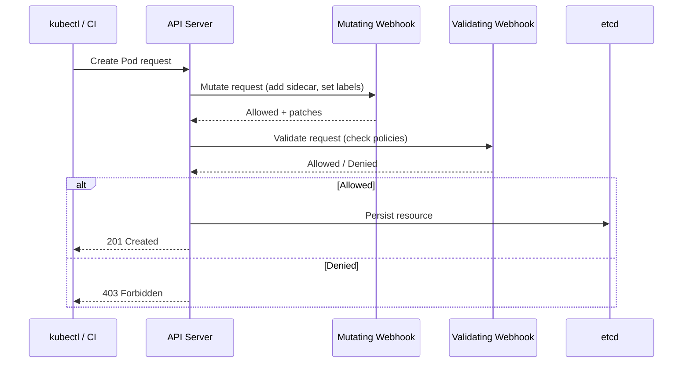
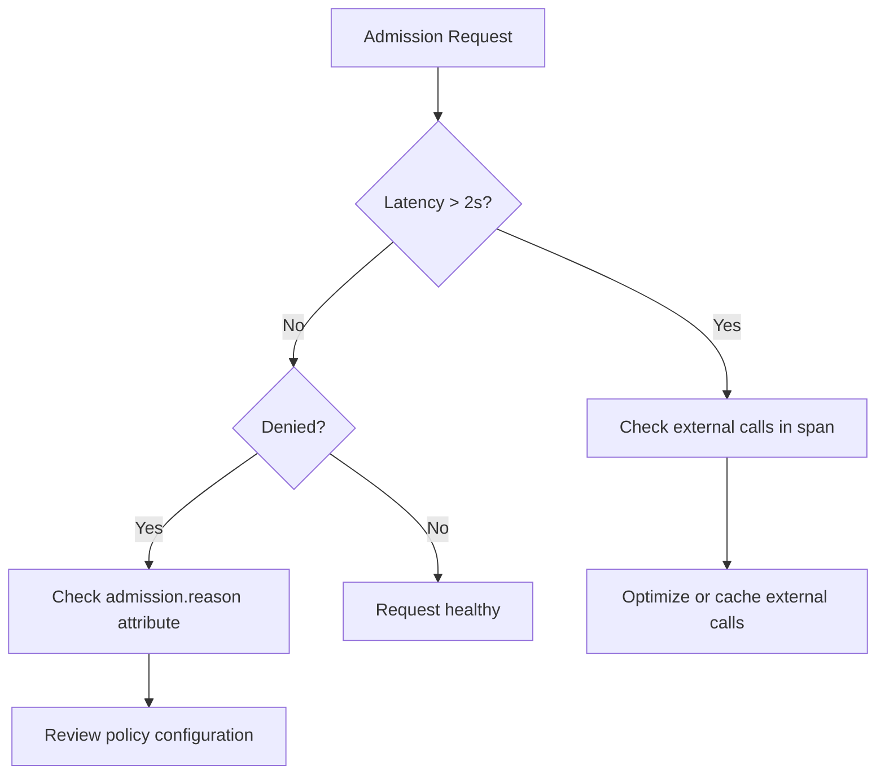

# How to Trace Kubernetes Admission Webhooks with OpenTelemetry

Author: [nawazdhandala](https://www.github.com/nawazdhandala)

Tags: OpenTelemetry, Kubernetes, Admission Webhooks, Tracing, Security, Observability

Description: Learn how to instrument Kubernetes admission webhooks with OpenTelemetry to trace policy decisions, measure latency, and debug rejection issues.

---

Kubernetes admission webhooks are gatekeepers. Every time a resource is created, updated, or deleted, the API server can call your webhook to validate or mutate the request before it is persisted. Tools like OPA Gatekeeper, Kyverno, and custom webhooks use this mechanism to enforce security policies, inject sidecars, set defaults, and more.

But when an admission webhook misbehaves, the consequences are severe. Deployments hang. Pods fail to schedule. And troubleshooting is painful because the webhook execution happens inside the Kubernetes API server request path with limited visibility.

This guide shows how to add OpenTelemetry tracing to admission webhooks so you can see exactly what is happening, how long it takes, and why requests get rejected.

## How Admission Webhooks Work

Before instrumenting, it helps to understand the request flow.



Mutating webhooks run first and can modify the request. Validating webhooks run second and can only accept or reject. Both add latency to every API server call they match.

## Instrumenting a Go Admission Webhook

Most admission webhooks in the Kubernetes ecosystem are written in Go. Here is how to add OpenTelemetry tracing to a webhook server built with the standard `admission` package.

First, set up the OpenTelemetry SDK in your webhook's main function.

```go
// Initialize OpenTelemetry tracing for the webhook server
package main

import (
    "context"
    "log"
    "net/http"

    "go.opentelemetry.io/otel"
    "go.opentelemetry.io/otel/exporters/otlp/otlptrace/otlptracegrpc"
    "go.opentelemetry.io/otel/sdk/resource"
    sdktrace "go.opentelemetry.io/otel/sdk/trace"
    semconv "go.opentelemetry.io/otel/semconv/v1.21.0"
    "go.opentelemetry.io/contrib/instrumentation/net/http/otelhttp"
)

func initTracer() func() {
    ctx := context.Background()

    // Create OTLP exporter pointing to the collector
    exporter, err := otlptracegrpc.New(ctx,
        otlptracegrpc.WithEndpoint("otel-collector.otel-system:4317"),
        otlptracegrpc.WithInsecure(),
    )
    if err != nil {
        log.Fatalf("failed to create exporter: %v", err)
    }

    // Define the service resource
    res, _ := resource.New(ctx,
        resource.WithAttributes(
            semconv.ServiceName("admission-webhook"),
            semconv.ServiceVersion("1.0.0"),
            semconv.DeploymentEnvironment("production"),
        ),
    )

    // Create the trace provider with batched exporting
    tp := sdktrace.NewTracerProvider(
        sdktrace.WithBatcher(exporter),
        sdktrace.WithResource(res),
        sdktrace.WithSampler(sdktrace.AlwaysSample()),
    )
    otel.SetTracerProvider(tp)

    // Return a cleanup function
    return func() {
        _ = tp.Shutdown(ctx)
    }
}

func main() {
    cleanup := initTracer()
    defer cleanup()

    // Wrap the webhook handler with OpenTelemetry HTTP instrumentation
    mux := http.NewServeMux()
    mux.Handle("/validate", otelhttp.NewHandler(
        http.HandlerFunc(handleValidate), "validate-admission"))
    mux.Handle("/mutate", otelhttp.NewHandler(
        http.HandlerFunc(handleMutate), "mutate-admission"))

    log.Println("Starting webhook server on :8443")
    log.Fatal(http.ListenAndServeTLS(":8443", "/certs/tls.crt", "/certs/tls.key", mux))
}
```

Now instrument the actual validation logic with detailed span attributes.

```go
// Webhook handler with OpenTelemetry tracing
package main

import (
    "encoding/json"
    "fmt"
    "io"
    "net/http"

    "go.opentelemetry.io/otel"
    "go.opentelemetry.io/otel/attribute"
    "go.opentelemetry.io/otel/codes"
    "go.opentelemetry.io/otel/trace"
    admissionv1 "k8s.io/api/admission/v1"
    metav1 "k8s.io/apimachinery/pkg/apis/meta/v1"
)

var tracer = otel.Tracer("admission-webhook")

func handleValidate(w http.ResponseWriter, r *http.Request) {
    ctx := r.Context()

    // Start a span for the validation operation
    ctx, span := tracer.Start(ctx, "validate-resource",
        trace.WithSpanKind(trace.SpanKindServer),
    )
    defer span.End()

    // Read and parse the admission review request
    body, err := io.ReadAll(r.Body)
    if err != nil {
        span.RecordError(err)
        span.SetStatus(codes.Error, "failed to read request body")
        http.Error(w, "bad request", http.StatusBadRequest)
        return
    }

    var review admissionv1.AdmissionReview
    if err := json.Unmarshal(body, &review); err != nil {
        span.RecordError(err)
        span.SetStatus(codes.Error, "failed to parse admission review")
        http.Error(w, "bad request", http.StatusBadRequest)
        return
    }

    req := review.Request

    // Add resource details as span attributes for filtering and analysis
    span.SetAttributes(
        attribute.String("k8s.resource.kind", req.Kind.Kind),
        attribute.String("k8s.resource.name", req.Name),
        attribute.String("k8s.resource.namespace", req.Namespace),
        attribute.String("k8s.operation", string(req.Operation)),
        attribute.String("k8s.user", req.UserInfo.Username),
        attribute.String("k8s.uid", string(req.UID)),
    )

    // Run the actual policy validation
    allowed, reason := validatePolicy(ctx, req)

    // Record the decision
    span.SetAttributes(
        attribute.Bool("admission.allowed", allowed),
        attribute.String("admission.reason", reason),
    )

    if !allowed {
        span.SetStatus(codes.Error, fmt.Sprintf("denied: %s", reason))
    } else {
        span.SetStatus(codes.Ok, "allowed")
    }

    // Build the response
    response := &admissionv1.AdmissionReview{
        Response: &admissionv1.AdmissionResponse{
            UID:     req.UID,
            Allowed: allowed,
            Result: &metav1.Status{
                Message: reason,
            },
        },
    }
    response.SetGroupVersionKind(review.GroupVersionKind())

    respBytes, _ := json.Marshal(response)
    w.Header().Set("Content-Type", "application/json")
    w.Write(respBytes)
}

// validatePolicy checks the resource against your policies
func validatePolicy(ctx context.Context, req *admissionv1.AdmissionRequest) (bool, string) {
    _, span := tracer.Start(ctx, "evaluate-policy")
    defer span.End()

    // Example: reject pods without resource limits
    if req.Kind.Kind == "Pod" {
        span.SetAttributes(attribute.String("policy.name", "require-resource-limits"))
        // ... your policy logic here
        // For demonstration, always allow
        return true, "all policies passed"
    }

    return true, "no matching policies"
}
```

## Instrumenting a Python Webhook

If your webhook is written in Python (for example, using Flask), the instrumentation follows the same pattern.

```python
# Python admission webhook with OpenTelemetry tracing
from flask import Flask, request, jsonify
from opentelemetry import trace
from opentelemetry.sdk.trace import TracerProvider
from opentelemetry.sdk.trace.export import BatchSpanExporter
from opentelemetry.exporter.otlp.proto.grpc.trace_exporter import OTLPSpanExporter
from opentelemetry.sdk.resources import Resource
from opentelemetry.trace import StatusCode
from opentelemetry.instrumentation.flask import FlaskInstrumentor
import json

# Configure OpenTelemetry
resource = Resource.create({
    "service.name": "python-admission-webhook",
    "service.version": "1.0.0",
})
provider = TracerProvider(resource=resource)
provider.add_span_processor(BatchSpanExporter(
    OTLPSpanExporter(endpoint="otel-collector.otel-system:4317", insecure=True)
))
trace.set_tracer_provider(provider)
tracer = trace.get_tracer("admission-webhook")

app = Flask(__name__)
# Auto-instrument Flask to create spans for each request
FlaskInstrumentor().instrument_app(app)

@app.route("/validate", methods=["POST"])
def validate():
    review = request.get_json()
    req = review["request"]

    # Create a child span for the policy evaluation
    with tracer.start_as_current_span("evaluate-policy") as span:
        span.set_attribute("k8s.resource.kind", req["kind"]["kind"])
        span.set_attribute("k8s.resource.name", req.get("name", ""))
        span.set_attribute("k8s.resource.namespace", req.get("namespace", ""))
        span.set_attribute("k8s.operation", req["operation"])
        span.set_attribute("k8s.user", req["userInfo"]["username"])

        # Run policy checks
        allowed, reason = check_policies(req)

        span.set_attribute("admission.allowed", allowed)
        span.set_attribute("admission.reason", reason)

        if not allowed:
            span.set_status(StatusCode.ERROR, f"denied: {reason}")

    # Return admission response
    return jsonify({
        "apiVersion": "admission.k8s.io/v1",
        "kind": "AdmissionReview",
        "response": {
            "uid": req["uid"],
            "allowed": allowed,
            "status": {"message": reason},
        }
    })

def check_policies(req):
    """Check resource against admission policies."""
    kind = req["kind"]["kind"]

    if kind == "Pod":
        # Example: check for required labels
        labels = req.get("object", {}).get("metadata", {}).get("labels", {})
        if "team" not in labels:
            return False, "pod must have a 'team' label"

    return True, "all policies passed"
```

## Collecting Webhook Metrics

Beyond tracing individual requests, you want aggregate metrics for your webhooks. Track request counts, latency distributions, and denial rates.

The OpenTelemetry SDK can produce these metrics alongside traces.

```go
// Create metrics for webhook monitoring
package main

import (
    "go.opentelemetry.io/otel/metric"
)

var (
    // Counter for total admission requests by operation and result
    admissionCounter metric.Int64Counter
    // Histogram for admission request latency
    admissionDuration metric.Float64Histogram
)

func initMetrics(meter metric.Meter) {
    var err error

    // Track how many requests are allowed vs denied
    admissionCounter, err = meter.Int64Counter(
        "admission.requests.total",
        metric.WithDescription("Total admission webhook requests"),
        metric.WithUnit("{request}"),
    )
    if err != nil {
        log.Fatalf("failed to create counter: %v", err)
    }

    // Track how long each admission decision takes
    admissionDuration, err = meter.Float64Histogram(
        "admission.request.duration",
        metric.WithDescription("Admission webhook request duration"),
        metric.WithUnit("ms"),
    )
    if err != nil {
        log.Fatalf("failed to create histogram: %v", err)
    }
}
```

## Webhook Configuration with Timeout Awareness

The Kubernetes API server enforces a timeout on webhook calls (default 10 seconds, configurable down to 1 second). If your webhook does not respond in time, it either fails open or fails closed depending on the `failurePolicy`.

Add the webhook timeout to your spans so you can detect when you are getting close to the limit.

```yaml
# ValidatingWebhookConfiguration with timeout settings
apiVersion: admissionregistration.k8s.io/v1
kind: ValidatingWebhookConfiguration
metadata:
  name: policy-webhook
webhooks:
  - name: validate.policy.example.com
    # Give the webhook 5 seconds to respond
    timeoutSeconds: 5
    # Fail open if the webhook is unavailable
    failurePolicy: Ignore
    clientConfig:
      service:
        name: admission-webhook
        namespace: webhook-system
        path: /validate
    rules:
      - operations: ["CREATE", "UPDATE"]
        apiGroups: [""]
        apiVersions: ["v1"]
        resources: ["pods"]
    sideEffects: None
    admissionReviewVersions: ["v1"]
```

## Debugging Common Issues with Traces

Once you have tracing in place, here are the patterns to watch for.

**High latency webhooks**: Filter spans by `admission.request.duration` to find slow policy evaluations. Common causes are external API calls (like checking an image registry) inside the webhook handler.

**Spurious denials**: Search for spans where `admission.allowed = false` and group by `admission.reason` to find the most common denial causes. Sometimes a misconfigured policy blocks legitimate workloads.

**Timeout failures**: Look for spans that get close to the `timeoutSeconds` configured on the webhook. If the API server kills the connection before your span ends, you will see incomplete traces.



## Deploying the Collector Sidecar

For webhooks that handle high traffic, consider running the collector as a sidecar instead of relying on a remote collector. This reduces network hops and keeps latency minimal.

```yaml
# Webhook deployment with OTel collector sidecar
apiVersion: apps/v1
kind: Deployment
metadata:
  name: admission-webhook
  namespace: webhook-system
spec:
  replicas: 2
  template:
    spec:
      containers:
        # The webhook server
        - name: webhook
          image: my-webhook:latest
          ports:
            - containerPort: 8443
          env:
            # Point to the local sidecar collector
            - name: OTEL_EXPORTER_OTLP_ENDPOINT
              value: "http://localhost:4317"
          volumeMounts:
            - name: certs
              mountPath: /certs
              readOnly: true

        # OTel collector sidecar for minimal latency
        - name: otel-sidecar
          image: otel/opentelemetry-collector-contrib:latest
          args: ["--config=/etc/otel/config.yaml"]
          resources:
            requests:
              cpu: 25m
              memory: 64Mi
          volumeMounts:
            - name: otel-config
              mountPath: /etc/otel
      volumes:
        - name: certs
          secret:
            secretName: webhook-tls
        - name: otel-config
          configMap:
            name: otel-sidecar-config
```

## Summary

Admission webhooks are critical infrastructure that most teams treat as black boxes. Adding OpenTelemetry tracing turns them transparent. You get visibility into every policy decision, latency measurements that help prevent timeout issues, and structured attributes that make debugging denials straightforward.

The instrumentation is lightweight. A few span creations and attribute sets add microseconds to your webhook response time. That is a small price for the ability to answer "why did this pod fail to create?" in seconds instead of hours.

Start with your most critical webhooks and expand from there. The traces will pay for themselves the first time a misconfigured policy blocks a production deployment.
