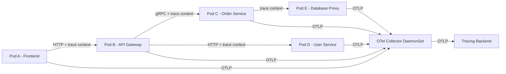

# How to Trace Kubernetes Pod-to-Pod Communication with OpenTelemetry

Author: [nawazdhandala](https://www.github.com/nawazdhandala)

Tags: OpenTelemetry, Kubernetes, Distributed Tracing, Observability, Microservices

Description: Learn how to trace pod-to-pod communication in Kubernetes using OpenTelemetry distributed tracing to debug latency and connectivity issues.

---

When you run microservices on Kubernetes, requests hop between pods constantly. A single user action might touch five or six services before a response comes back. When something goes wrong or slows down, figuring out which hop caused the problem is painful without proper tracing. OpenTelemetry gives you the tools to follow a request across every pod boundary and see exactly where time is being spent.

This guide walks through setting up distributed tracing for pod-to-pod communication in Kubernetes. We will instrument services, propagate trace context across HTTP and gRPC calls, and deploy the OpenTelemetry Collector as the central telemetry pipeline.

## Why Pod-to-Pod Tracing Matters

Kubernetes networking abstracts away a lot of complexity. Services talk to each other through ClusterIP services, DNS resolution, and the pod network. This abstraction is great for deployment, but it makes debugging harder. A 500ms response time could be caused by slow DNS resolution, network latency between nodes, or just a slow database query three services deep.

Distributed tracing solves this by assigning a unique trace ID to each incoming request and propagating it through every downstream call. Each service creates spans representing its work, and these spans are stitched together into a complete trace.

## Architecture Overview

The typical setup uses the OpenTelemetry Collector deployed as a DaemonSet on each node. Each pod sends its telemetry to the local collector instance, which then forwards it to your backend of choice.



## Step 1: Deploy the OpenTelemetry Collector as a DaemonSet

The DaemonSet deployment ensures every node has a collector instance. Pods send telemetry to the local node's collector, keeping network hops minimal.

Here is the collector configuration that receives OTLP data and exports it to a backend. The resource detection processor automatically adds Kubernetes metadata like pod name and namespace.

```yaml
# otel-collector-config.yaml
# Configures the collector to receive traces via OTLP
# and enrich them with Kubernetes resource attributes
apiVersion: v1
kind: ConfigMap
metadata:
  name: otel-collector-config
  namespace: observability
data:
  config.yaml: |
    receivers:
      otlp:
        protocols:
          grpc:
            endpoint: 0.0.0.0:4317
          http:
            endpoint: 0.0.0.0:4318

    processors:
      batch:
        timeout: 5s
        send_batch_size: 1024
      # Adds k8s metadata to every span automatically
      k8sattributes:
        auth_type: "serviceAccount"
        extract:
          metadata:
            - k8s.pod.name
            - k8s.pod.uid
            - k8s.namespace.name
            - k8s.node.name
            - k8s.deployment.name
        pod_association:
          - sources:
              - from: resource_attribute
                name: k8s.pod.ip

    exporters:
      otlp:
        endpoint: "your-tracing-backend:4317"
        tls:
          insecure: false

    service:
      pipelines:
        traces:
          receivers: [otlp]
          processors: [k8sattributes, batch]
          exporters: [otlp]
```

Now deploy the DaemonSet itself. The collector runs on every node and listens on the host network so pods can reach it at the node's IP address.

```yaml
# otel-collector-daemonset.yaml
# Deploys the collector on every node in the cluster
apiVersion: apps/v1
kind: DaemonSet
metadata:
  name: otel-collector
  namespace: observability
spec:
  selector:
    matchLabels:
      app: otel-collector
  template:
    metadata:
      labels:
        app: otel-collector
    spec:
      serviceAccountName: otel-collector
      containers:
        - name: collector
          image: otel/opentelemetry-collector-contrib:0.96.0
          args: ["--config=/etc/otel/config.yaml"]
          ports:
            - containerPort: 4317  # gRPC OTLP receiver
              hostPort: 4317
            - containerPort: 4318  # HTTP OTLP receiver
              hostPort: 4318
          volumeMounts:
            - name: config
              mountPath: /etc/otel
          resources:
            requests:
              cpu: 200m
              memory: 256Mi
            limits:
              cpu: 500m
              memory: 512Mi
      volumes:
        - name: config
          configMap:
            name: otel-collector-config
```

## Step 2: Instrument Your Services

Each service needs the OpenTelemetry SDK configured to create spans and propagate trace context. Here is how you set this up in a Node.js service. The key is initializing the SDK before any other imports so all HTTP libraries get automatically instrumented.

```javascript
// tracing.js - Initialize this file BEFORE importing your app code
// Sets up the OpenTelemetry SDK with auto-instrumentation
const { NodeSDK } = require('@opentelemetry/sdk-node');
const { OTLPTraceExporter } = require('@opentelemetry/exporter-trace-otlp-grpc');
const { getNodeAutoInstrumentations } = require('@opentelemetry/auto-instrumentations-node');
const { Resource } = require('@opentelemetry/resources');
const { ATTR_SERVICE_NAME } = require('@opentelemetry/semantic-conventions');

const sdk = new NodeSDK({
  // Resource identifies this service in traces
  resource: new Resource({
    [ATTR_SERVICE_NAME]: process.env.OTEL_SERVICE_NAME || 'my-service',
  }),
  // Send traces to the collector running on the same node
  traceExporter: new OTLPTraceExporter({
    url: `grpc://${process.env.NODE_IP}:4317`,
  }),
  // Auto-instrumentation patches HTTP, gRPC, Express, etc.
  instrumentations: [getNodeAutoInstrumentations()],
});

sdk.start();
```

For Python services, the setup follows a similar pattern. The key difference is you can use the opentelemetry-instrument command to auto-instrument without code changes.

```python
# For Python services, install the packages:
# pip install opentelemetry-api opentelemetry-sdk opentelemetry-exporter-otlp
# pip install opentelemetry-instrumentation-flask opentelemetry-instrumentation-requests

from opentelemetry import trace
from opentelemetry.sdk.trace import TracerProvider
from opentelemetry.sdk.trace.export import BatchSpanProcessor
from opentelemetry.exporter.otlp.proto.grpc.trace_exporter import OTLPSpanExporter
from opentelemetry.sdk.resources import Resource

import os

# Configure the tracer provider with service identity
resource = Resource.create({"service.name": os.environ.get("OTEL_SERVICE_NAME", "python-service")})
provider = TracerProvider(resource=resource)

# Export spans to the node-local collector
exporter = OTLPSpanExporter(endpoint=f"{os.environ['NODE_IP']}:4317", insecure=True)
provider.add_span_processor(BatchSpanProcessor(exporter))
trace.set_tracer_provider(provider)
```

## Step 3: Propagate Context Through Pod Boundaries

Trace context propagation is what connects spans across different services. When Service A calls Service B, the trace ID and parent span ID must travel with the request. OpenTelemetry handles this by injecting W3C Trace Context headers into outgoing HTTP requests and extracting them from incoming requests.

The auto-instrumentation libraries handle this automatically for HTTP and gRPC. But if you have custom communication patterns like messages through Redis or Kafka, you need to manually inject and extract context.

Here is an example of manual context propagation through a message queue.

```javascript
// producer.js - Inject trace context into message headers
const { context, propagation } = require('@opentelemetry/api');

function publishMessage(queue, payload) {
  const headers = {};
  // Inject current trace context into message headers
  // so the consumer can continue the same trace
  propagation.inject(context.active(), headers);

  queue.publish({
    body: payload,
    headers: headers,  // These carry traceparent and tracestate
  });
}
```

```javascript
// consumer.js - Extract trace context from incoming messages
const { context, propagation, trace } = require('@opentelemetry/api');

function onMessage(message) {
  // Extract trace context from the message headers
  const parentContext = propagation.extract(context.active(), message.headers);
  const tracer = trace.getTracer('message-consumer');

  // Start a new span linked to the producing service's trace
  context.with(parentContext, () => {
    const span = tracer.startSpan('process-message');
    try {
      processMessage(message.body);
    } finally {
      span.end();
    }
  });
}
```

## Step 4: Add Kubernetes-Specific Attributes

Adding Kubernetes metadata to your spans makes filtering and debugging much easier. You can pass pod information as environment variables using the Kubernetes downward API.

This deployment spec injects the node IP and pod metadata as environment variables that the OpenTelemetry SDK can pick up.

```yaml
# deployment.yaml - Pass Kubernetes metadata to the application
apiVersion: apps/v1
kind: Deployment
metadata:
  name: api-service
spec:
  template:
    spec:
      containers:
        - name: api
          image: my-api:latest
          env:
            # Node IP lets the app find the local collector
            - name: NODE_IP
              valueFrom:
                fieldRef:
                  fieldPath: status.hostIP
            # Pod metadata for span attributes
            - name: OTEL_RESOURCE_ATTRIBUTES
              value: "k8s.pod.name=$(POD_NAME),k8s.namespace.name=$(POD_NAMESPACE)"
            - name: POD_NAME
              valueFrom:
                fieldRef:
                  fieldPath: metadata.name
            - name: POD_NAMESPACE
              valueFrom:
                fieldRef:
                  fieldPath: metadata.namespace
            - name: OTEL_SERVICE_NAME
              value: "api-service"
```

## Step 5: Verify the Trace Flow

Once everything is deployed, send a request that crosses multiple services and check your tracing backend. You should see a complete trace with spans from each service, connected by the shared trace ID.

```mermaid
gantt
    title Trace: POST /api/orders
    dateFormat  X
    axisFormat %L ms

    section Frontend Pod
    HTTP POST /api/orders       :0, 450

    section API Gateway Pod
    Validate request            :10, 30
    Route to order service      :30, 40

    section Order Service Pod
    Create order                :50, 150
    Query inventory             :150, 300

    section Database Proxy Pod
    Execute SQL query           :160, 280
```



If spans are showing up but not connected, the most common cause is missing context propagation. Verify that the `traceparent` header is being sent with outgoing requests. You can check this by looking at the incoming request headers in your downstream service logs.

## Troubleshooting Common Issues

**Spans are not appearing at all.** Check that the collector is running on the node and the pod can reach port 4317. Run `kubectl exec` into the pod and try `curl http://$NODE_IP:4318/v1/traces` to verify connectivity.

**Spans appear but are not linked.** This usually means context propagation is broken. Make sure the W3C TraceContext propagator is configured (it is the default) and that HTTP client libraries are instrumented.

**Missing Kubernetes metadata.** Verify the k8sattributes processor is configured in the collector and the collector's service account has RBAC permissions to query the Kubernetes API.

**High latency in traces.** If spans show large gaps between services, the issue might be in DNS resolution. Kubernetes DNS can add a few milliseconds. Consider using headless services for latency-sensitive communication.

## Wrapping Up

Tracing pod-to-pod communication in Kubernetes with OpenTelemetry gives you deep visibility into how requests flow through your cluster. The combination of auto-instrumentation, W3C context propagation, and the Kubernetes attributes processor means you can get a complete picture without writing much custom code. Start with the DaemonSet collector deployment, instrument your services with the auto-instrumentation libraries, and make sure every inter-service call carries trace context headers. From there, you can build dashboards, set up alerts on trace latency, and quickly diagnose issues that would otherwise take hours to track down.
