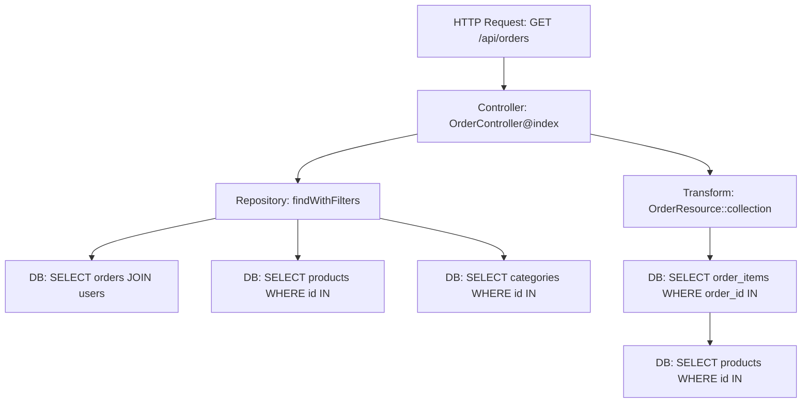

# How to Trace Laravel Eloquent Database Queries with OpenTelemetry

Author: [nawazdhandala](https://www.github.com/nawazdhandala)

Tags: OpenTelemetry, PHP, Laravel, Eloquent, Database, SQL Tracing

Description: Master database query tracing in Laravel with OpenTelemetry to identify slow queries, N+1 problems, and optimize database performance.

Database queries are often the bottleneck in web applications. A single slow query can degrade response times across your entire system. Laravel's Eloquent ORM makes database operations simple, but it can hide performance problems under layers of abstraction.

OpenTelemetry tracing reveals exactly what queries execute, how long they take, and where they originate in your code. This guide shows you how to instrument Laravel Eloquent queries with detailed tracing that exposes performance issues before they reach production.

## The Database Performance Problem

Eloquent makes it easy to write code that performs poorly. Consider this innocent-looking controller method:

```php
public function index()
{
    $posts = Post::all();
    return view('posts.index', compact('posts'));
}
```

In the view, you iterate over posts and display the author:

```blade
@foreach($posts as $post)
    <h2>{{ $post->title }}</h2>
    <p>By {{ $post->author->name }}</p>
@endforeach
```

This triggers the classic N+1 query problem. One query fetches all posts, then N additional queries fetch each author. With 50 posts, you execute 51 database queries instead of 2.

Without tracing, this problem is invisible until production traffic slows to a crawl. With OpenTelemetry, every query creates a span showing exactly what executed and when.

## Setting Up Database Query Tracing

Install the OpenTelemetry SDK and instrumentation packages:

```bash
composer require open-telemetry/sdk
composer require open-telemetry/opentelemetry-auto-laravel
```

Create a database query instrumentation service in `app/Services/DatabaseTracing.php`:

```php
<?php

namespace App\Services;

use Illuminate\Database\Events\QueryExecuted;
use Illuminate\Support\Facades\DB;
use OpenTelemetry\API\Globals;
use OpenTelemetry\API\Trace\SpanKind;
use OpenTelemetry\API\Trace\StatusCode;

class DatabaseTracing
{
    private $tracer;

    public function __construct()
    {
        $this->tracer = Globals::tracerProvider()->getTracer('laravel-database');
    }

    /**
     * Register database query listeners to create spans
     */
    public function register(): void
    {
        DB::listen(function (QueryExecuted $query) {
            $this->traceQuery($query);
        });
    }

    /**
     * Create a span for each database query
     */
    private function traceQuery(QueryExecuted $query): void
    {
        $span = $this->tracer->spanBuilder('database.query')
            ->setSpanKind(SpanKind::KIND_CLIENT)
            ->startSpan();

        $scope = $span->activate();

        try {
            // Add database operation attributes
            $span->setAttribute('db.system', $query->connection->getDriverName());
            $span->setAttribute('db.name', $query->connection->getDatabaseName());
            $span->setAttribute('db.statement', $query->sql);
            $span->setAttribute('db.operation', $this->extractOperation($query->sql));

            // Add query performance metrics
            $span->setAttribute('db.execution_time_ms', $query->time);
            $span->setAttribute('db.connection_name', $query->connectionName);

            // Add bindings (sanitized)
            $span->setAttribute('db.bindings', json_encode($this->sanitizeBindings($query->bindings)));

            // Mark slow queries
            if ($query->time > 100) {
                $span->setAttribute('db.slow_query', true);
                $span->addEvent('slow_query_detected', [
                    'threshold_ms' => 100,
                    'actual_ms' => $query->time,
                ]);
            }

            // Mark very slow queries as errors
            if ($query->time > 1000) {
                $span->setStatus(StatusCode::ERROR, 'Query exceeded 1000ms threshold');
            }

            $span->end();
        } catch (\Throwable $e) {
            $span->recordException($e);
            $span->setStatus(StatusCode::ERROR, $e->getMessage());
            $span->end();
            throw $e;
        } finally {
            $scope->detach();
        }
    }

    /**
     * Extract the SQL operation type (SELECT, INSERT, UPDATE, DELETE)
     */
    private function extractOperation(string $sql): string
    {
        $sql = trim(strtoupper($sql));

        if (str_starts_with($sql, 'SELECT')) return 'SELECT';
        if (str_starts_with($sql, 'INSERT')) return 'INSERT';
        if (str_starts_with($sql, 'UPDATE')) return 'UPDATE';
        if (str_starts_with($sql, 'DELETE')) return 'DELETE';
        if (str_starts_with($sql, 'CREATE')) return 'CREATE';
        if (str_starts_with($sql, 'ALTER')) return 'ALTER';
        if (str_starts_with($sql, 'DROP')) return 'DROP';

        return 'UNKNOWN';
    }

    /**
     * Sanitize query bindings to avoid leaking sensitive data
     */
    private function sanitizeBindings(array $bindings): array
    {
        return array_map(function ($binding) {
            // Redact potential passwords or tokens
            if (is_string($binding) && strlen($binding) > 20) {
                return substr($binding, 0, 10) . '...[redacted]';
            }
            return $binding;
        }, $bindings);
    }
}
```

Register this service in `app/Providers/AppServiceProvider.php`:

```php
<?php

namespace App\Providers;

use Illuminate\Support\ServiceProvider;
use App\Services\DatabaseTracing;

class AppServiceProvider extends ServiceProvider
{
    public function boot()
    {
        if (config('app.env') !== 'testing') {
            $tracing = new DatabaseTracing();
            $tracing->register();
        }
    }
}
```

## Detecting N+1 Query Problems

The N+1 problem is one of the most common performance issues in Eloquent applications. Tracing makes it obvious.

Here's a typical N+1 scenario:

```php
// Controller fetching posts
public function index()
{
    $posts = Post::latest()->limit(20)->get();
    return PostResource::collection($posts);
}

// Resource accessing relationships
class PostResource extends JsonResource
{
    public function toArray($request)
    {
        return [
            'id' => $this->id,
            'title' => $this->title,
            'author' => $this->author->name, // N+1 here
            'category' => $this->category->name, // And here
            'comments_count' => $this->comments->count(), // And here
        ];
    }
}
```

This code generates traces showing:

1. One span for `SELECT * FROM posts LIMIT 20`
2. Twenty spans for `SELECT * FROM users WHERE id = ?`
3. Twenty spans for `SELECT * FROM categories WHERE id = ?`
4. Twenty spans for `SELECT * FROM comments WHERE post_id = ?`

That's 61 queries when you should have 4.

Create a middleware to detect and report N+1 patterns in `app/Http/Middleware/DetectN1Queries.php`:

```php
<?php

namespace App\Http\Middleware;

use Closure;
use Illuminate\Support\Facades\DB;
use OpenTelemetry\API\Globals;

class DetectN1Queries
{
    private $queries = [];

    public function handle($request, Closure $next)
    {
        if (!config('app.debug')) {
            return $next($request);
        }

        // Track queries during request
        DB::listen(function ($query) {
            $this->queries[] = [
                'sql' => $query->sql,
                'bindings' => $query->bindings,
                'time' => $query->time,
            ];
        });

        $response = $next($request);

        // Analyze for N+1 patterns
        $this->detectN1Patterns();

        return $response;
    }

    /**
     * Detect repeated similar queries that indicate N+1 problems
     */
    private function detectN1Patterns(): void
    {
        $patterns = [];

        foreach ($this->queries as $query) {
            // Normalize query by removing specific binding values
            $normalized = preg_replace('/\d+/', '?', $query['sql']);
            $patterns[$normalized] = ($patterns[$normalized] ?? 0) + 1;
        }

        $tracer = Globals::tracerProvider()->getTracer('laravel-database');
        $span = $tracer->spanBuilder('request.n1_analysis')->startSpan();

        foreach ($patterns as $pattern => $count) {
            // Flag queries executed more than 5 times as potential N+1
            if ($count > 5) {
                $span->addEvent('potential_n1_detected', [
                    'query_pattern' => $pattern,
                    'execution_count' => $count,
                    'severity' => $count > 20 ? 'high' : 'medium',
                ]);
            }
        }

        $span->setAttribute('total_queries', count($this->queries));
        $span->setAttribute('unique_patterns', count($patterns));
        $span->end();
    }
}
```

Fix N+1 problems using eager loading:

```php
// Fixed version using eager loading
public function index()
{
    $posts = Post::with(['author', 'category', 'comments'])
        ->latest()
        ->limit(20)
        ->get();

    return PostResource::collection($posts);
}
```

Now your trace shows 4 queries instead of 61, and all execute in parallel where possible.

## Tracing Complex Query Builders

Eloquent query builders can create complex SQL. Tracing helps you understand what actually executes.

```php
// Complex query with multiple joins and conditions
$orders = Order::query()
    ->select('orders.*', 'users.name as customer_name')
    ->join('users', 'orders.user_id', '=', 'users.id')
    ->join('order_items', 'orders.id', '=', 'order_items.order_id')
    ->where('orders.status', 'completed')
    ->where('orders.created_at', '>=', now()->subDays(30))
    ->groupBy('orders.id')
    ->having(DB::raw('SUM(order_items.quantity)'), '>', 10)
    ->with(['items.product', 'user.address'])
    ->paginate(20);
```

This single method call generates multiple queries. Without tracing, you can't see:

- The main query with joins, conditions, and grouping
- Count query for pagination
- Eager loading queries for relationships
- Total execution time across all queries

Add query builder tracing in `app/Services/QueryBuilderTracing.php`:

```php
<?php

namespace App\Services;

use Illuminate\Database\Eloquent\Builder;
use OpenTelemetry\API\Globals;
use OpenTelemetry\API\Trace\SpanKind;

class QueryBuilderTracing
{
    /**
     * Trace a query builder execution
     */
    public static function trace(Builder $query, string $operation): mixed
    {
        $tracer = Globals::tracerProvider()->getTracer('laravel-eloquent');

        $span = $tracer->spanBuilder("eloquent.{$operation}")
            ->setSpanKind(SpanKind::KIND_CLIENT)
            ->startSpan();

        $scope = $span->activate();

        try {
            // Add query context
            $span->setAttribute('eloquent.model', get_class($query->getModel()));
            $span->setAttribute('eloquent.operation', $operation);

            // Capture query details
            $sql = $query->toSql();
            $bindings = $query->getBindings();

            $span->setAttribute('db.statement', $sql);
            $span->setAttribute('db.bindings_count', count($bindings));

            // Execute the query
            $result = match($operation) {
                'get' => $query->get(),
                'first' => $query->first(),
                'count' => $query->count(),
                'paginate' => $query->paginate(),
                default => throw new \InvalidArgumentException("Unknown operation: {$operation}"),
            };

            // Add result metadata
            if (is_countable($result)) {
                $span->setAttribute('result.count', count($result));
            }

            return $result;
        } finally {
            $span->end();
            $scope->detach();
        }
    }
}
```

Use this tracer in repositories or services:

```php
class OrderRepository
{
    public function getRecentHighValueOrders()
    {
        $query = Order::query()
            ->select('orders.*', 'users.name as customer_name')
            ->join('users', 'orders.user_id', '=', 'users.id')
            ->where('orders.created_at', '>=', now()->subDays(30))
            ->where('orders.total', '>', 1000);

        return QueryBuilderTracing::trace($query, 'get');
    }
}
```

## Tracing Raw Queries and Transactions

Sometimes you need raw SQL or database transactions. Trace these too.

```php
class ReportService
{
    /**
     * Generate sales report using raw SQL
     */
    public function generateSalesReport(string $startDate, string $endDate): array
    {
        $tracer = Globals::tracerProvider()->getTracer('laravel-database');

        $span = $tracer->spanBuilder('report.sales_summary')
            ->setSpanKind(SpanKind::KIND_CLIENT)
            ->startSpan();

        $scope = $span->activate();

        try {
            $span->setAttribute('report.start_date', $startDate);
            $span->setAttribute('report.end_date', $endDate);

            // Execute raw query
            $results = DB::select("
                SELECT
                    DATE(created_at) as sale_date,
                    COUNT(*) as order_count,
                    SUM(total) as revenue,
                    AVG(total) as average_order_value
                FROM orders
                WHERE created_at BETWEEN ? AND ?
                    AND status = 'completed'
                GROUP BY DATE(created_at)
                ORDER BY sale_date DESC
            ", [$startDate, $endDate]);

            $span->setAttribute('report.days_count', count($results));
            $span->setAttribute('report.total_revenue', array_sum(array_column($results, 'revenue')));

            return $results;
        } finally {
            $span->end();
            $scope->detach();
        }
    }
}
```

Trace database transactions to ensure they complete successfully:

```php
class OrderService
{
    /**
     * Process order with tracing
     */
    public function processOrder(array $orderData): Order
    {
        $tracer = Globals::tracerProvider()->getTracer('laravel-database');

        $span = $tracer->spanBuilder('transaction.process_order')
            ->setSpanKind(SpanKind::KIND_CLIENT)
            ->startSpan();

        $scope = $span->activate();

        try {
            DB::beginTransaction();

            $span->addEvent('transaction_started');

            // Create order
            $order = Order::create([
                'user_id' => $orderData['user_id'],
                'total' => $orderData['total'],
                'status' => 'pending',
            ]);

            // Create order items
            foreach ($orderData['items'] as $item) {
                $order->items()->create($item);
            }

            // Update inventory
            foreach ($orderData['items'] as $item) {
                DB::table('products')
                    ->where('id', $item['product_id'])
                    ->decrement('stock', $item['quantity']);
            }

            DB::commit();

            $span->addEvent('transaction_committed', [
                'order_id' => $order->id,
                'items_count' => count($orderData['items']),
            ]);

            return $order;
        } catch (\Exception $e) {
            DB::rollBack();

            $span->addEvent('transaction_rolled_back', [
                'error' => $e->getMessage(),
            ]);

            $span->recordException($e);
            $span->setStatus(StatusCode::ERROR, 'Transaction failed');

            throw $e;
        } finally {
            $span->end();
            $scope->detach();
        }
    }
}
```

## Visualizing Query Performance with Spans

Create a trace hierarchy that shows the complete picture:



Each node is a span with timing information. You can see:

- Total request duration
- Time spent in each layer
- Which queries execute and when
- Opportunities for optimization

## Adding Custom Query Attributes

Enrich spans with business context specific to your application:

```php
class EnrichedDatabaseTracing extends DatabaseTracing
{
    protected function traceQuery(QueryExecuted $query): void
    {
        parent::traceQuery($query);

        $span = Globals::tracerProvider()->getTracer('laravel-database')
            ->spanBuilder('database.query.enriched')
            ->startSpan();

        // Add table information
        $tables = $this->extractTables($query->sql);
        $span->setAttribute('db.tables', implode(',', $tables));

        // Add query complexity indicators
        $span->setAttribute('db.has_join', stripos($query->sql, 'JOIN') !== false);
        $span->setAttribute('db.has_subquery', stripos($query->sql, 'SELECT') !== strrpos($query->sql, 'SELECT'));
        $span->setAttribute('db.has_aggregate', $this->hasAggregateFunction($query->sql));

        // Add cache hit potential
        if ($this->isCacheable($query->sql)) {
            $span->setAttribute('db.cacheable', true);
            $span->addEvent('cacheable_query_detected', [
                'suggestion' => 'Consider caching this query result',
            ]);
        }

        $span->end();
    }

    private function extractTables(string $sql): array
    {
        preg_match_all('/(?:FROM|JOIN)\s+`?(\w+)`?/i', $sql, $matches);
        return array_unique($matches[1] ?? []);
    }

    private function hasAggregateFunction(string $sql): bool
    {
        return (bool) preg_match('/\b(COUNT|SUM|AVG|MIN|MAX|GROUP_CONCAT)\s*\(/i', $sql);
    }

    private function isCacheable(string $sql): bool
    {
        // Simple heuristic: SELECT without WHERE is cacheable
        $sql = strtoupper(trim($sql));
        return str_starts_with($sql, 'SELECT') &&
               !str_contains($sql, 'WHERE') &&
               !str_contains($sql, 'RAND()') &&
               !str_contains($sql, 'NOW()');
    }
}
```

## Performance Optimization Based on Traces

Use trace data to identify optimization opportunities:

**Query count per request**: If a request executes more than 20 queries, investigate for N+1 problems or missing eager loading.

**Slow query identification**: Queries taking more than 100ms need optimization through indexes, query rewriting, or caching.

**Transaction duration**: Long-running transactions lock rows and reduce concurrency. Keep transactions short.

**Query repetition**: The same query executing multiple times in one request should be cached.

Implement automatic query caching based on trace analysis:

```php
class CachedQueryRepository
{
    /**
     * Execute query with automatic caching
     */
    public function cachedQuery(Builder $query, string $cacheKey, int $ttl = 3600)
    {
        return Cache::remember($cacheKey, $ttl, function () use ($query) {
            return QueryBuilderTracing::trace($query, 'get');
        });
    }
}
```

## Production Monitoring

In production, use sampling to reduce overhead while maintaining visibility:

```php
// config/opentelemetry.php

return [
    'traces' => [
        'enabled' => env('OTEL_TRACES_ENABLED', true),
        'sampler' => [
            'type' => 'traceidratio',
            'ratio' => env('OTEL_TRACES_SAMPLE_RATIO', 0.1), // 10% sampling
        ],
    ],

    'database' => [
        // Always trace slow queries regardless of sampling
        'always_trace_slow_queries' => true,
        'slow_query_threshold_ms' => 100,
    ],
];
```

Database query tracing with OpenTelemetry transforms invisible performance problems into visible, actionable data. You see exactly which queries execute, identify N+1 problems immediately, and optimize based on real production behavior rather than assumptions.
