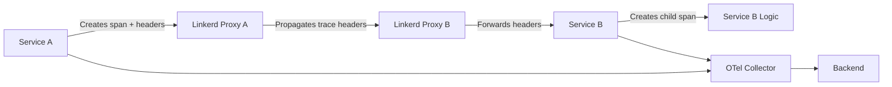
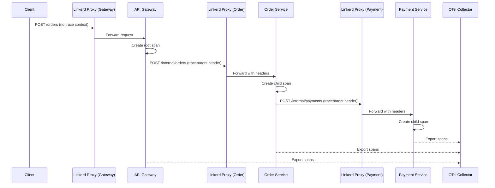

# How to Trace Linkerd Service Mesh with OpenTelemetry

Author: [nawazdhandala](https://www.github.com/nawazdhandala)

Tags: OpenTelemetry, Linkerd, Service Mesh, Kubernetes, Distributed Tracing, Observability

Description: A practical guide to integrating OpenTelemetry distributed tracing with Linkerd service mesh for end-to-end request visibility.

---

Linkerd takes a different approach to service meshes compared to Istio. It's lightweight, focuses on simplicity, and uses its own Rust-based micro-proxy instead of Envoy. But when it comes to observability, Linkerd's built-in metrics are great for golden signals while lacking deeper distributed tracing capabilities. That's where OpenTelemetry comes in.

In this post, we'll cover how to set up OpenTelemetry tracing alongside Linkerd to get full end-to-end request traces across your meshed services. You'll learn how Linkerd handles trace context, how to instrument your services, and how to wire everything together through the OpenTelemetry Collector.

## How Linkerd Handles Tracing

Unlike Envoy-based meshes that can generate spans at the proxy level, Linkerd's proxy doesn't create trace spans on its own. What it does do is propagate trace context headers. When a request enters a Linkerd proxy, the proxy forwards any existing trace headers (like W3C `traceparent` or B3 headers) to the next hop.

This means your application code is responsible for creating spans. Linkerd just makes sure the context flows correctly between services.



This is actually a simpler model than what Envoy-based meshes use. You don't have to worry about reconciling proxy-generated spans with application-generated spans. Every span comes from your code, and Linkerd makes sure the context travels with the request.

## Setting Up OpenTelemetry in Your Services

Since Linkerd relies on application-level instrumentation for tracing, you need to set up OpenTelemetry SDKs in each service. Let's walk through an example with a Node.js service.

First, install the necessary packages and set up the OpenTelemetry SDK with auto-instrumentation for HTTP.

```javascript
// tracing.js
// Initialize OpenTelemetry tracing before any other imports
const { NodeSDK } = require('@opentelemetry/sdk-node');
const { OTLPTraceExporter } = require('@opentelemetry/exporter-trace-otlp-grpc');
const { HttpInstrumentation } = require('@opentelemetry/instrumentation-http');
const { ExpressInstrumentation } = require('@opentelemetry/instrumentation-express');
const { Resource } = require('@opentelemetry/resources');
const { SemanticResourceAttributes } = require('@opentelemetry/semantic-conventions');

// Create the OTLP exporter pointing to the collector
const traceExporter = new OTLPTraceExporter({
  // The collector runs as a DaemonSet, so we use the node-local endpoint
  url: 'grpc://otel-collector.observability:4317',
});

// Configure the SDK with HTTP and Express auto-instrumentation
// This automatically creates spans for incoming and outgoing HTTP requests
const sdk = new NodeSDK({
  resource: new Resource({
    [SemanticResourceAttributes.SERVICE_NAME]: 'order-service',
    [SemanticResourceAttributes.SERVICE_VERSION]: '1.2.0',
    // Tag this service as part of the Linkerd mesh
    'service.mesh': 'linkerd',
  }),
  traceExporter,
  instrumentations: [
    new HttpInstrumentation({
      // Ignore health check endpoints to reduce noise
      ignoreIncomingRequestHook: (req) => req.url === '/health',
    }),
    new ExpressInstrumentation(),
  ],
});

// Start the SDK before your application code runs
sdk.start();
console.log('OpenTelemetry tracing initialized');

// Gracefully shut down on process exit
process.on('SIGTERM', () => {
  sdk.shutdown().then(() => console.log('Tracing shut down'));
});
```

The key thing here is that the HTTP instrumentation automatically handles trace context propagation. When your service makes an outgoing HTTP request, the instrumentation library reads the current span context and injects it into the request headers. When Linkerd's proxy forwards those headers to the next service, the receiving service's instrumentation picks them up and creates a child span.

## Configuring Linkerd for Header Propagation

Linkerd propagates trace headers by default, but you need to make sure your application is setting the right ones. Linkerd supports both B3 and W3C Trace Context headers. For new setups, W3C Trace Context is the recommended choice since it's the standard that OpenTelemetry uses natively.

If you're running Linkerd 2.14 or later, W3C trace context propagation works out of the box. For older versions, check that your Linkerd configuration includes the trace headers in its allowed headers list.

You can verify that headers are being propagated correctly by checking the Linkerd proxy logs.

```bash
# Check Linkerd proxy logs for a specific pod to verify trace header forwarding
# Look for traceparent headers in the proxy output
kubectl logs deployment/order-service -c linkerd-proxy | grep -i "traceparent"
```

## Deploying the OpenTelemetry Collector

You'll need an OpenTelemetry Collector to receive spans from all your services. In a Linkerd mesh, deploying the collector as a Kubernetes Deployment with a ClusterIP service works well.

This collector configuration receives traces from your application services and enriches them with Kubernetes metadata.

```yaml
# otel-collector-config.yaml
# Collector config designed for a Linkerd service mesh environment
receivers:
  otlp:
    protocols:
      grpc:
        # Accept gRPC OTLP from all meshed services
        endpoint: 0.0.0.0:4317
      http:
        endpoint: 0.0.0.0:4318

processors:
  # Add Kubernetes context to every span
  k8s_attributes:
    auth_type: serviceAccount
    extract:
      metadata:
        - k8s.pod.name
        - k8s.namespace.name
        - k8s.deployment.name
      labels:
        # Extract Linkerd-specific labels for easier filtering
        - tag_name: linkerd.proxy.version
          key: linkerd.io/proxy-version
        - tag_name: linkerd.control.plane
          key: linkerd.io/control-plane-ns

  # Batch spans for efficient export
  batch:
    timeout: 10s
    send_batch_size: 512
    send_batch_max_size: 1024

  # Add a resource attribute to identify this mesh
  resource:
    attributes:
      - key: deployment.environment
        value: production
        action: upsert
      - key: mesh.type
        value: linkerd
        action: insert

exporters:
  otlp:
    endpoint: "your-observability-backend:4317"
    tls:
      insecure: false

  # Also log a sample of spans for debugging
  logging:
    loglevel: info
    sampling_initial: 5
    sampling_thereafter: 200

service:
  pipelines:
    traces:
      receivers: [otlp]
      processors: [k8s_attributes, resource, batch]
      exporters: [otlp]
```

## Combining Linkerd Metrics with OpenTelemetry Traces

One of the nice things about Linkerd is that it automatically generates golden signal metrics (request rate, success rate, latency) for every meshed service. These metrics are exposed through Linkerd's Prometheus integration. You can pull them into the same observability pipeline by adding a Prometheus receiver to your collector.

This lets you correlate Linkerd's proxy-level metrics with your application-level traces.

```yaml
# Additional receiver for Linkerd's Prometheus metrics
# Add this to the receivers section of your collector config
receivers:
  prometheus:
    config:
      scrape_configs:
        - job_name: 'linkerd-proxy'
          # Scrape interval matching Linkerd's default metric window
          scrape_interval: 10s
          kubernetes_sd_configs:
            - role: pod
          relabel_configs:
            # Only scrape pods that are part of the Linkerd mesh
            - source_labels: [__meta_kubernetes_pod_container_name]
              action: keep
              regex: linkerd-proxy
            # Use the Linkerd proxy's admin port for metrics
            - source_labels: [__address__]
              action: replace
              target_label: __address__
              regex: (.+):(\d+)
              replacement: $1:4191
            # Set the metrics path to Linkerd's Prometheus endpoint
            - target_label: __metrics_path__
              replacement: /metrics
```

## Adding Custom Spans for Business Logic

Auto-instrumentation handles HTTP boundaries well, but you'll often want to add custom spans for important business operations. Here's how to do that in a Linkerd-meshed service.

This example shows creating manual spans for a payment processing flow where you want granular visibility.

```javascript
// payment-service.js
// Manual span creation for business-critical operations
const { trace, SpanStatusCode } = require('@opentelemetry/api');

// Get the tracer for this service
const tracer = trace.getTracer('payment-service');

async function processPayment(orderId, amount) {
  // Create a span for the entire payment processing flow
  return tracer.startActiveSpan('payment.process', async (span) => {
    // Add business context as span attributes
    span.setAttribute('order.id', orderId);
    span.setAttribute('payment.amount', amount);
    span.setAttribute('payment.currency', 'USD');

    try {
      // Validate the payment - this gets its own child span
      await tracer.startActiveSpan('payment.validate', async (validateSpan) => {
        await validatePaymentDetails(orderId);
        validateSpan.addEvent('validation_passed');
        validateSpan.end();
      });

      // Charge the customer - outgoing HTTP call to payment gateway
      // The HTTP instrumentation will automatically create a span for this
      // and propagate trace context through the Linkerd proxy
      const result = await chargeCustomer(orderId, amount);

      span.setAttribute('payment.transaction_id', result.transactionId);
      span.addEvent('payment_completed');
      span.setStatus({ code: SpanStatusCode.OK });

      return result;
    } catch (error) {
      // Record the error in the span for debugging
      span.recordException(error);
      span.setStatus({
        code: SpanStatusCode.ERROR,
        message: error.message,
      });
      throw error;
    } finally {
      span.end();
    }
  });
}
```

## End-to-End Trace Flow

With everything wired up, here's what the full trace flow looks like across a Linkerd mesh.



Each service creates its own spans and exports them to the collector. The trace context flows through Linkerd's proxies via HTTP headers, tying everything together into a single distributed trace.

## Troubleshooting Common Issues

There are a few things that commonly go wrong when setting up tracing with Linkerd.

**Broken traces**: If your traces show disconnected spans, it usually means one of your services isn't propagating the `traceparent` header. Check that every service in the call chain has the HTTP instrumentation enabled. Linkerd will faithfully forward headers, but it won't create them.

**Missing services**: If a service doesn't show up in your traces at all, verify that the OpenTelemetry SDK is initialized before any HTTP server or client code runs. A common mistake is importing `tracing.js` after the Express app is already created.

**High cardinality**: Linkerd meshes can generate a lot of trace data. Use the collector's `filter` processor or `tail_sampling` processor to keep costs under control. Sampling at the collector level is more reliable than sampling at the SDK level in a mesh environment.

## Wrapping Up

Linkerd's approach to tracing is straightforward: the proxy handles header propagation and your application handles span creation. This clean separation makes it easy to reason about and debug. By pairing Linkerd's automatic metric collection with OpenTelemetry's distributed tracing, you get a complete observability picture without the complexity of proxy-level span generation.

The setup we've covered here gives you end-to-end traces across your Linkerd mesh, enriched with Kubernetes metadata and Linkerd-specific labels. Start with auto-instrumentation to cover the HTTP boundaries, then add custom spans for the business logic that matters most. Your future self, debugging a production incident at 2 AM, will thank you.
