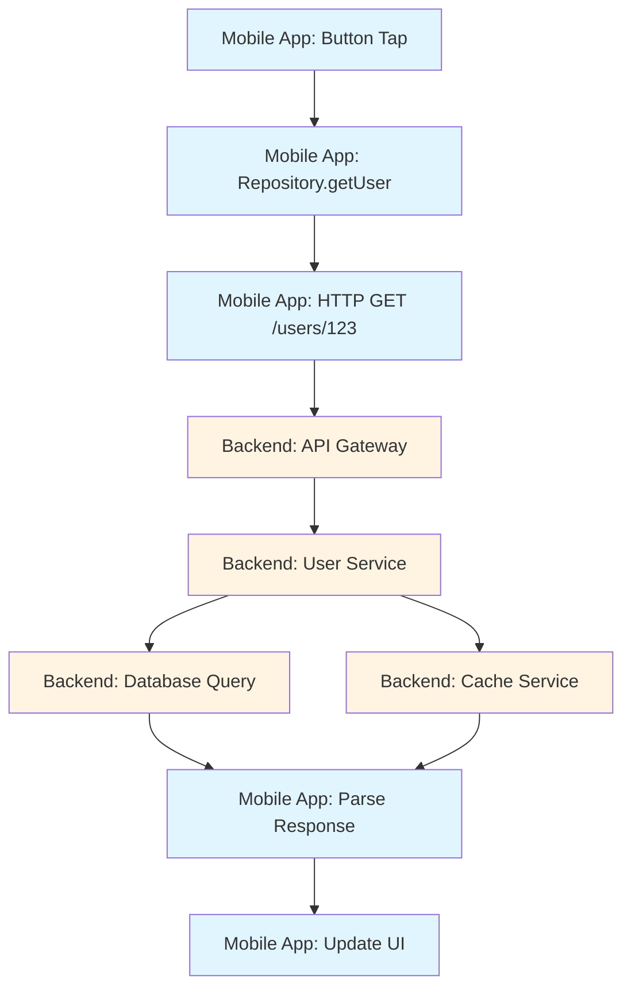

# How to Trace Mobile App API Calls with OpenTelemetry Context Propagation

Author: [nawazdhandala](https://www.github.com/nawazdhandala)

Tags: OpenTelemetry, Mobile, API Calls, Context Propagation, iOS, Android

Description: Master distributed tracing across mobile and backend services using OpenTelemetry context propagation to track complete request flows, correlate errors, and measure end-to-end latency from user action to API response.

Modern mobile applications are distributed systems. User actions trigger API calls that flow through load balancers, API gateways, microservices, and databases. Understanding the complete picture requires tracing requests across these boundaries. OpenTelemetry context propagation enables this by passing trace context from your mobile app to backend services, creating unified traces that span the entire system.

## Why Context Propagation Matters for Mobile Apps

Without context propagation, you get isolated views of your system. The mobile app shows how long an API call took from the client's perspective, but you can't see which backend service was slow or what database query caused the delay. When users report issues, you're forced to correlate logs manually using timestamps, user IDs, and guesswork.

Context propagation solves this by embedding trace identifiers in API request headers. When your backend services are instrumented with OpenTelemetry, they extract these identifiers and create child spans that connect to the mobile-initiated trace. You get a complete view from button tap to database query and back.

This visibility is crucial for understanding real-world performance. Network conditions, geographic distribution, and backend load affect mobile users differently than synthetic monitors. Context propagation shows you what actual users experience.

## Understanding W3C Trace Context

OpenTelemetry uses the W3C Trace Context standard for propagating trace information across service boundaries. This standard defines how trace context is encoded in HTTP headers, ensuring interoperability between different tracing systems.

The primary header is `traceparent`, which contains four fields separated by hyphens:

- Version (00): The trace context format version
- Trace ID: A 32-character hex string uniquely identifying the entire trace
- Parent ID: A 16-character hex string identifying the current span
- Trace flags: A 2-character hex field containing sampling and other flags

A typical traceparent header looks like this:
```
traceparent: 00-4bf92f3577b34da6a3ce929d0e0e4736-00f067aa0ba902b7-01
```

The `tracestate` header carries vendor-specific trace data. Together, these headers ensure trace continuity across service boundaries.

## Implementing Context Propagation in iOS

Start by creating a network client that injects trace context into HTTP requests. This ensures every API call carries the trace information needed for distributed tracing.

```swift
import Foundation
import OpenTelemetryApi
import OpenTelemetrySdk

class TracedNetworkClient {
    private let tracer: Tracer
    private let session: URLSession
    private let propagator: TextMapPropagator

    init(tracer: Tracer) {
        self.tracer = tracer
        self.session = URLSession.shared
        self.propagator = W3CTraceContextPropagator()
    }

    func request(
        url: URL,
        method: String = "GET",
        headers: [String: String] = [:],
        body: Data? = nil
    ) async throws -> (Data, HTTPURLResponse) {

        // Create a span for this HTTP request
        let span = tracer.spanBuilder(spanName: "HTTP \(method) \(url.path)")
            .setSpanKind(spanKind: .client)
            .startSpan()

        // Add HTTP semantic convention attributes
        span.setAttribute(key: "http.method", value: method)
        span.setAttribute(key: "http.url", value: url.absoluteString)
        span.setAttribute(key: "http.scheme", value: url.scheme ?? "https")
        span.setAttribute(key: "http.host", value: url.host ?? "")
        span.setAttribute(key: "http.target", value: url.path)

        // Create URL request
        var urlRequest = URLRequest(url: url)
        urlRequest.httpMethod = method
        urlRequest.httpBody = body

        // Add custom headers
        headers.forEach { key, value in
            urlRequest.setValue(value, forHTTPHeaderField: key)
        }

        // Inject trace context into request headers
        let context = OpenTelemetryContext.current.withSpan(span)
        var carrier: [String: String] = [:]

        propagator.inject(context: context, carrier: &carrier) { carrier, key, value in
            carrier?[key] = value
        }

        // Add propagated headers to the request
        carrier.forEach { key, value in
            urlRequest.setValue(value, forHTTPHeaderField: key)
        }

        do {
            let startTime = Date()
            let (data, response) = try await session.data(for: urlRequest)
            let duration = Date().timeIntervalSince(startTime)

            guard let httpResponse = response as? HTTPURLResponse else {
                throw NetworkError.invalidResponse
            }

            // Record response attributes
            span.setAttribute(key: "http.status_code", value: httpResponse.statusCode)
            span.setAttribute(key: "http.response_content_length", value: data.count)
            span.setAttribute(key: "http.duration_ms", value: duration * 1000)

            // Set span status based on HTTP status code
            if (200..<400).contains(httpResponse.statusCode) {
                span.setStatus(status: .ok)
            } else {
                span.setStatus(status: .error(description: "HTTP \(httpResponse.statusCode)"))
            }

            span.end()
            return (data, httpResponse)

        } catch {
            // Record error information
            span.setAttribute(key: "error", value: true)
            span.setAttribute(key: "error.message", value: error.localizedDescription)
            span.setStatus(status: .error(description: error.localizedDescription))
            span.end()
            throw error
        }
    }
}

enum NetworkError: Error {
    case invalidResponse
    case httpError(Int)
}
```

## Creating a Type-Safe API Client with Context Propagation

Build a higher-level API client that uses the traced network client and provides type-safe methods for your API endpoints.

```swift
import Foundation

struct User: Codable {
    let id: String
    let name: String
    let email: String
}

struct Post: Codable {
    let id: String
    let userId: String
    let title: String
    let content: String
}

class APIClient {
    private let networkClient: TracedNetworkClient
    private let baseURL: URL
    private let decoder: JSONDecoder

    init(baseURL: URL, tracer: Tracer) {
        self.baseURL = baseURL
        self.networkClient = TracedNetworkClient(tracer: tracer)
        self.decoder = JSONDecoder()
        self.decoder.keyDecodingStrategy = .convertFromSnakeCase
    }

    // MARK: - User API

    func fetchUser(userId: String) async throws -> User {
        let url = baseURL.appendingPathComponent("users/\(userId)")

        let (data, response) = try await networkClient.request(
            url: url,
            method: "GET",
            headers: [
                "Accept": "application/json",
                "User-Agent": "MyiOSApp/1.0"
            ]
        )

        guard (200..<300).contains(response.statusCode) else {
            throw NetworkError.httpError(response.statusCode)
        }

        return try decoder.decode(User.self, from: data)
    }

    func updateUser(userId: String, name: String, email: String) async throws -> User {
        let url = baseURL.appendingPathComponent("users/\(userId)")

        let updateData = [
            "name": name,
            "email": email
        ]

        let body = try JSONEncoder().encode(updateData)

        let (data, response) = try await networkClient.request(
            url: url,
            method: "PATCH",
            headers: [
                "Content-Type": "application/json",
                "Accept": "application/json"
            ],
            body: body
        )

        guard (200..<300).contains(response.statusCode) else {
            throw NetworkError.httpError(response.statusCode)
        }

        return try decoder.decode(User.self, from: data)
    }

    // MARK: - Posts API

    func fetchUserPosts(userId: String) async throws -> [Post] {
        let url = baseURL
            .appendingPathComponent("users/\(userId)/posts")

        let (data, response) = try await networkClient.request(
            url: url,
            method: "GET"
        )

        guard (200..<300).contains(response.statusCode) else {
            throw NetworkError.httpError(response.statusCode)
        }

        return try decoder.decode([Post].self, from: data)
    }

    func createPost(userId: String, title: String, content: String) async throws -> Post {
        let url = baseURL.appendingPathComponent("posts")

        let postData = [
            "userId": userId,
            "title": title,
            "content": content
        ]

        let body = try JSONEncoder().encode(postData)

        let (data, response) = try await networkClient.request(
            url: url,
            method: "POST",
            headers: [
                "Content-Type": "application/json",
                "Accept": "application/json"
            ],
            body: body
        )

        guard (200..<300).contains(response.statusCode) else {
            throw NetworkError.httpError(response.statusCode)
        }

        return try decoder.decode(Post.self, from: data)
    }
}
```

## Implementing Context Propagation in Android

Android implementation follows similar patterns but uses Kotlin coroutines and OkHttp for networking.

```kotlin
import io.opentelemetry.api.trace.Span
import io.opentelemetry.api.trace.SpanKind
import io.opentelemetry.api.trace.StatusCode
import io.opentelemetry.api.trace.Tracer
import io.opentelemetry.context.Context
import io.opentelemetry.context.propagation.TextMapSetter
import okhttp3.*
import okhttp3.MediaType.Companion.toMediaType
import okhttp3.RequestBody.Companion.toRequestBody
import java.io.IOException

class TracedNetworkClient(private val tracer: Tracer) {
    private val client = OkHttpClient.Builder()
        .addInterceptor(TracingInterceptor(tracer))
        .build()

    suspend fun request(
        url: String,
        method: String = "GET",
        headers: Map<String, String> = emptyMap(),
        body: String? = null
    ): Response {
        val span = tracer.spanBuilder("HTTP $method ${extractPath(url)}")
            .setSpanKind(SpanKind.CLIENT)
            .startSpan()

        // Add HTTP semantic conventions
        span.setAttribute("http.method", method)
        span.setAttribute("http.url", url)

        val requestBuilder = Request.Builder()
            .url(url)
            .method(
                method,
                body?.toRequestBody("application/json".toMediaType())
            )

        // Add custom headers
        headers.forEach { (key, value) ->
            requestBuilder.addHeader(key, value)
        }

        // Inject trace context
        val context = Context.current().with(span)
        val propagator = io.opentelemetry.api.GlobalOpenTelemetry
            .getPropagators()
            .textMapPropagator

        propagator.inject(context, requestBuilder, RequestHeaderSetter)

        val request = requestBuilder.build()

        return try {
            val startTime = System.currentTimeMillis()
            val response = client.newCall(request).execute()
            val duration = System.currentTimeMillis() - startTime

            span.setAttribute("http.status_code", response.code)
            span.setAttribute("http.duration_ms", duration)

            if (response.isSuccessful) {
                span.setStatus(StatusCode.OK)
            } else {
                span.setStatus(StatusCode.ERROR, "HTTP ${response.code}")
            }

            span.end()
            response
        } catch (e: IOException) {
            span.recordException(e)
            span.setStatus(StatusCode.ERROR, e.message ?: "Request failed")
            span.end()
            throw e
        }
    }

    private fun extractPath(url: String): String {
        return try {
            java.net.URL(url).path
        } catch (e: Exception) {
            url
        }
    }

    // TextMapSetter for injecting headers into OkHttp request
    private object RequestHeaderSetter : TextMapSetter<Request.Builder> {
        override fun set(carrier: Request.Builder?, key: String, value: String) {
            carrier?.addHeader(key, value)
        }
    }
}

// OkHttp interceptor for automatic tracing
class TracingInterceptor(private val tracer: Tracer) : Interceptor {
    override fun intercept(chain: Interceptor.Chain): Response {
        val request = chain.request()

        // Check if span already exists (to avoid double instrumentation)
        val existingSpan = Span.fromContext(Context.current())
        if (existingSpan.spanContext.isValid) {
            return chain.proceed(request)
        }

        val span = tracer.spanBuilder("HTTP ${request.method} ${request.url.encodedPath}")
            .setSpanKind(SpanKind.CLIENT)
            .startSpan()

        span.setAttribute("http.method", request.method)
        span.setAttribute("http.url", request.url.toString())
        span.setAttribute("http.scheme", request.url.scheme)
        span.setAttribute("http.host", request.url.host)
        span.setAttribute("http.target", request.url.encodedPath)

        return try {
            val response = chain.proceed(request)

            span.setAttribute("http.status_code", response.code)
            span.setStatus(
                if (response.isSuccessful) StatusCode.OK
                else StatusCode.ERROR
            )

            span.end()
            response
        } catch (e: Exception) {
            span.recordException(e)
            span.setStatus(StatusCode.ERROR, e.message ?: "Request failed")
            span.end()
            throw e
        }
    }
}
```

## Building a Repository Layer with Context Propagation

Create a repository pattern that orchestrates API calls and local caching while maintaining trace context.

```kotlin
import io.opentelemetry.api.trace.Span
import io.opentelemetry.api.trace.StatusCode
import io.opentelemetry.api.trace.Tracer
import io.opentelemetry.context.Context
import kotlinx.coroutines.Dispatchers
import kotlinx.coroutines.withContext

class UserRepository(
    private val apiClient: ApiClient,
    private val localDatabase: UserDao,
    private val tracer: Tracer
) {
    suspend fun getUser(userId: String): User {
        // Create a parent span for the entire operation
        val span = tracer.spanBuilder("UserRepository.getUser")
            .setSpanKind(io.opentelemetry.api.trace.SpanKind.INTERNAL)
            .setAttribute("user.id", userId)
            .startSpan()

        return withContext(Dispatchers.IO + Context.current().with(span).asContextElement()) {
            try {
                // Try cache first
                val cachedUser = getCachedUser(userId)
                if (cachedUser != null && !cachedUser.isStale()) {
                    span.addEvent("cache_hit")
                    span.setAttribute("cache.hit", true)
                    span.setStatus(StatusCode.OK)
                    return@withContext cachedUser
                }

                span.addEvent("cache_miss")
                span.setAttribute("cache.hit", false)

                // Fetch from API - trace context will be propagated automatically
                val user = apiClient.fetchUser(userId)

                // Cache the result
                cacheUser(user)

                span.setStatus(StatusCode.OK)
                user
            } catch (e: Exception) {
                span.recordException(e)
                span.setStatus(StatusCode.ERROR, "Failed to fetch user")
                throw e
            } finally {
                span.end()
            }
        }
    }

    private suspend fun getCachedUser(userId: String): User? {
        val span = tracer.spanBuilder("UserRepository.getCachedUser")
            .setSpanKind(io.opentelemetry.api.trace.SpanKind.INTERNAL)
            .setAttribute("user.id", userId)
            .startSpan()

        return try {
            val user = localDatabase.getUserById(userId)
            span.setAttribute("cache.found", user != null)
            span.setStatus(StatusCode.OK)
            user
        } catch (e: Exception) {
            span.recordException(e)
            span.setStatus(StatusCode.ERROR, "Cache read failed")
            null
        } finally {
            span.end()
        }
    }

    private suspend fun cacheUser(user: User) {
        val span = tracer.spanBuilder("UserRepository.cacheUser")
            .setSpanKind(io.opentelemetry.api.trace.SpanKind.INTERNAL)
            .setAttribute("user.id", user.id)
            .startSpan()

        try {
            localDatabase.insertUser(user)
            span.setStatus(StatusCode.OK)
        } catch (e: Exception) {
            span.recordException(e)
            span.setStatus(StatusCode.ERROR, "Cache write failed")
            // Don't rethrow - caching failures shouldn't break the operation
        } finally {
            span.end()
        }
    }
}
```

## Handling Context Propagation in Flutter

Flutter applications need special handling for context propagation since they use Dart's http package or dio for networking.

```dart
import 'package:dio/dio.dart';
import 'package:opentelemetry/api.dart' as otel;

class ContextPropagatingInterceptor extends Interceptor {
  final otel.Tracer tracer;
  final otel.TextMapPropagator propagator;

  ContextPropagatingInterceptor(this.tracer)
      : propagator = otel.W3CTraceContextPropagator();

  @override
  void onRequest(RequestOptions options, RequestInterceptorHandler handler) {
    // Create span for the request
    final span = tracer
        .spanBuilder('HTTP ${options.method} ${options.path}')
        .setSpanKind(otel.SpanKind.client)
        .startSpan();

    // Add HTTP attributes
    span.setAttribute('http.method', options.method);
    span.setAttribute('http.url', options.uri.toString());
    span.setAttribute('http.scheme', options.uri.scheme);
    span.setAttribute('http.host', options.uri.host);
    span.setAttribute('http.target', options.uri.path);

    // Store span for later use
    options.extra['otel_span'] = span;

    // Create context with active span
    final context = otel.Context.current.withSpan(span);

    // Inject trace context into headers
    final carrier = <String, String>{};
    propagator.inject(context, carrier, _HeaderSetter());

    // Add propagated headers to request
    options.headers.addAll(carrier);

    handler.next(options);
  }

  @override
  void onResponse(Response response, ResponseInterceptorHandler handler) {
    final span = response.requestOptions.extra['otel_span'] as otel.Span?;

    if (span != null) {
      span.setAttribute('http.status_code', response.statusCode ?? 0);

      if (response.statusCode != null &&
          response.statusCode! >= 200 &&
          response.statusCode! < 400) {
        span.setStatus(otel.StatusCode.ok);
      } else {
        span.setStatus(
          otel.StatusCode.error,
          'HTTP ${response.statusCode}',
        );
      }

      span.end();
    }

    handler.next(response);
  }

  @override
  void onError(DioException err, ErrorInterceptorHandler handler) {
    final span = err.requestOptions.extra['otel_span'] as otel.Span?;

    if (span != null) {
      span.recordException(err, stackTrace: err.stackTrace);
      span.setStatus(otel.StatusCode.error, err.message ?? 'Request failed');

      if (err.response != null) {
        span.setAttribute('http.status_code', err.response!.statusCode ?? 0);
      }

      span.end();
    }

    handler.next(err);
  }
}

class _HeaderSetter extends otel.TextMapSetter<Map<String, String>> {
  @override
  void set(Map<String, String> carrier, String key, String value) {
    carrier[key] = value;
  }
}

// Usage
class ApiService {
  late final Dio dio;

  ApiService(otel.Tracer tracer) {
    dio = Dio(BaseOptions(
      baseUrl: 'https://api.example.com',
      connectTimeout: Duration(seconds: 30),
      receiveTimeout: Duration(seconds: 30),
    ));

    dio.interceptors.add(ContextPropagatingInterceptor(tracer));
  }

  Future<User> fetchUser(String userId) async {
    final response = await dio.get('/users/$userId');
    return User.fromJson(response.data);
  }
}
```

## Visualizing End-to-End Traces

Here's how context propagation creates complete distributed traces:



## Backend Service Configuration for Context Propagation

Your backend services must be configured to extract and continue traces from mobile clients. Here's an example using a Node.js Express backend:

```javascript
// Backend service example (Node.js with Express)
const { NodeTracerProvider } = require('@opentelemetry/sdk-trace-node');
const { W3CTraceContextPropagator } = require('@opentelemetry/core');
const { registerInstrumentations } = require('@opentelemetry/instrumentation');
const { ExpressInstrumentation } = require('@opentelemetry/instrumentation-express');
const { HttpInstrumentation } = require('@opentelemetry/instrumentation-http');

const provider = new NodeTracerProvider();
provider.register({
  propagator: new W3CTraceContextPropagator(),
});

registerInstrumentations({
  instrumentations: [
    new HttpInstrumentation(),
    new ExpressInstrumentation(),
  ],
});

// Express middleware automatically extracts trace context
// from incoming requests and creates child spans
const app = express();

app.get('/users/:userId', async (req, res) => {
  const { userId } = req.params;

  // This span will be a child of the mobile-initiated trace
  const span = tracer.startSpan('getUserFromDatabase');

  try {
    const user = await database.query('SELECT * FROM users WHERE id = ?', [userId]);
    span.setStatus({ code: SpanStatusCode.OK });
    res.json(user);
  } catch (error) {
    span.recordException(error);
    span.setStatus({ code: SpanStatusCode.ERROR });
    res.status(500).json({ error: 'Internal server error' });
  } finally {
    span.end();
  }
});
```

## Best Practices for Context Propagation

When implementing context propagation in mobile applications, follow these practices:

**Always propagate context**. Every outbound HTTP request should include trace context headers. This ensures complete visibility across your distributed system.

**Use standard propagators**. The W3C Trace Context format ensures compatibility with different backend services and observability tools.

**Handle failures gracefully**. If context propagation fails, the request should still succeed. Telemetry failures shouldn't impact application functionality.

**Respect sampling decisions**. If a trace is sampled out at the mobile client, backend services should honor that decision to avoid partial traces.

**Add correlation IDs**. Beyond trace context, include user IDs, session IDs, and other correlation identifiers as span attributes to enable cross-trace analysis.

**Monitor propagation success**. Track metrics on context propagation failures to identify configuration issues or incompatible services.

Context propagation transforms isolated telemetry into comprehensive distributed traces. You gain visibility into how mobile app requests flow through your entire system, enabling rapid troubleshooting and performance optimization across the full stack.
