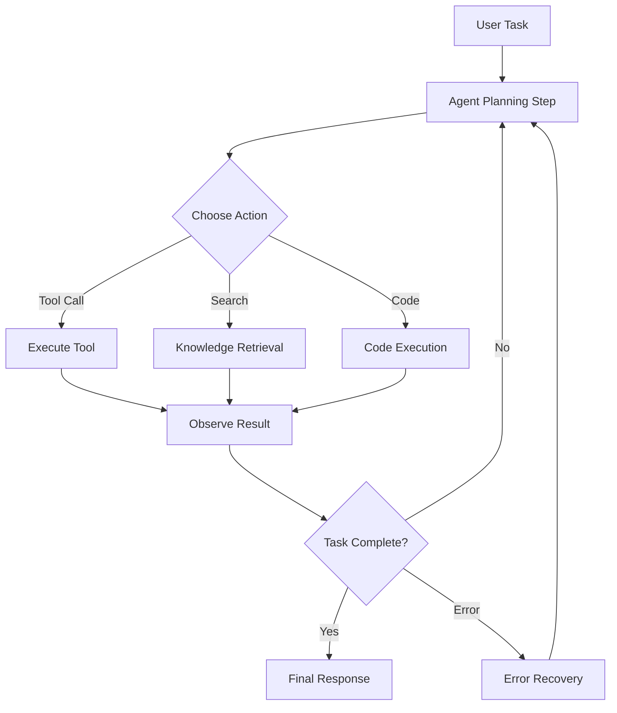
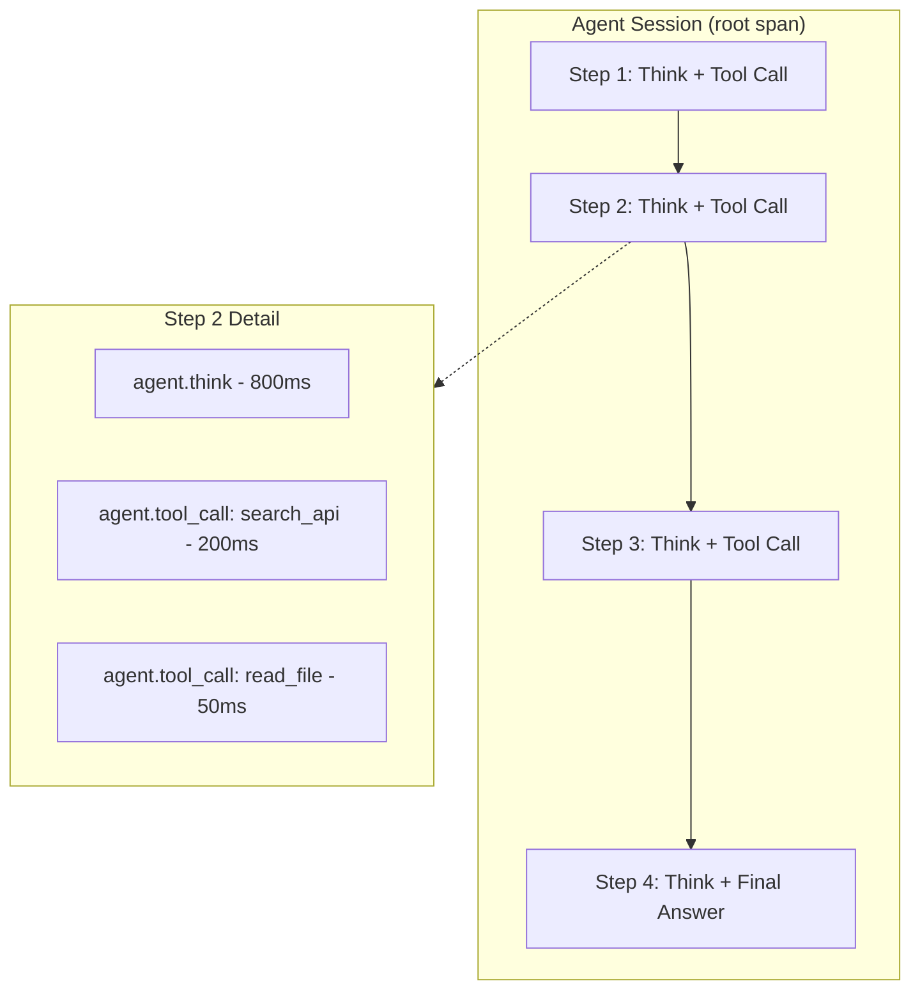

# How to Trace Multi-Step Agent Workflows with OpenTelemetry Sessions and Spans

Author: [nawazdhandala](https://www.github.com/nawazdhandala)

Tags: OpenTelemetry, AI Agents, Tracing, Sessions, Spans, Observability, Autonomous Agents, Workflows, LLM

Description: Learn how to trace multi-step AI agent workflows using OpenTelemetry sessions and spans, with practical patterns for tool use, planning, and error recovery.

---

AI agents don't just answer questions. They plan, execute tools, evaluate results, and iterate until they've completed a task. A single agent workflow might involve ten or twenty LLM calls, multiple API requests, file operations, and decision points. When something goes wrong at step 14, you need a way to trace back through the entire chain of reasoning and execution.

OpenTelemetry's span model is a natural fit for agent workflows. Each step becomes a span. Each decision becomes an event. And the overall session ties everything together into a coherent story you can debug after the fact.

---

## Agent Workflows Are Different

Traditional request-response tracing follows a predictable path: request comes in, hits a few services, returns a response. Agent workflows are fundamentally different because they're dynamic. The agent decides at runtime how many steps to take, which tools to call, and when to stop.

Here's what a typical multi-step agent workflow looks like:



The loop between planning and observation can repeat many times. Your tracing needs to handle this iteration cleanly.

---

## Modeling Agent Sessions with OpenTelemetry

OpenTelemetry doesn't have a built-in "session" concept, but you can model sessions using a combination of trace context, span links, and attributes. The approach I recommend is to use a session ID attribute on every span, plus a hierarchical span structure that mirrors the agent's execution.

```python
# pip install opentelemetry-api opentelemetry-sdk opentelemetry-exporter-otlp

import uuid
import time
from opentelemetry import trace
from opentelemetry.sdk.trace import TracerProvider
from opentelemetry.sdk.trace.export import BatchSpanProcessor
from opentelemetry.exporter.otlp.proto.grpc.trace_exporter import OTLPSpanExporter
from opentelemetry.sdk.resources import Resource

# Configure the tracer for agent workflows
resource = Resource.create({
    "service.name": "ai-agent-service",
    "service.version": "1.0.0"
})

provider = TracerProvider(resource=resource)
provider.add_span_processor(
    BatchSpanProcessor(OTLPSpanExporter(endpoint="https://oneuptime.com/otlp"))
)
trace.set_tracer_provider(provider)

tracer = trace.get_tracer("ai.agent", "1.0.0")
```

---

## The Agent Session Wrapper

Create a session class that holds the trace context and provides methods for creating step spans. Every span within a session shares the same session ID, making it easy to query all activity for a given task.

```python
from opentelemetry import trace
from opentelemetry.trace import StatusCode, SpanKind

class AgentSession:
    """
    Wraps an agent's multi-step workflow in OpenTelemetry traces.
    Each session gets a unique ID, and all spans within the session
    share this ID as an attribute for easy filtering.
    """
    def __init__(self, task_description, user_id=None):
        self.session_id = str(uuid.uuid4())
        self.task_description = task_description
        self.user_id = user_id
        self.step_count = 0
        self.total_llm_tokens = 0
        self.tool_calls = []

    def run(self, agent):
        """Execute the agent workflow within a traced session."""
        # The root span covers the entire session
        with tracer.start_as_current_span("agent.session") as session_span:
            session_span.set_attribute("agent.session_id", self.session_id)
            session_span.set_attribute("agent.task", self.task_description[:500])
            session_span.set_attribute("agent.model", agent.model_name)
            if self.user_id:
                session_span.set_attribute("agent.user_id", self.user_id)

            try:
                result = agent.execute(self)

                # Record final session metrics
                session_span.set_attribute("agent.total_steps", self.step_count)
                session_span.set_attribute("agent.total_llm_tokens", self.total_llm_tokens)
                session_span.set_attribute("agent.tools_used",
                                         str(list(set(self.tool_calls))))
                session_span.set_attribute("agent.status", "completed")

                return result

            except AgentMaxStepsError:
                session_span.set_attribute("agent.status", "max_steps_exceeded")
                session_span.set_status(StatusCode.ERROR, "Agent exceeded max steps")
                raise

            except Exception as e:
                session_span.set_attribute("agent.status", "error")
                session_span.set_status(StatusCode.ERROR, str(e))
                session_span.record_exception(e)
                raise
```

---

## Tracing Individual Steps

Each step in the agent loop gets its own span. This is where you capture the reasoning, action choice, and execution details.

```python
class TracedAgent:
    def __init__(self, llm_client, tools, model_name="gpt-4", max_steps=20):
        self.llm_client = llm_client
        self.tools = tools
        self.model_name = model_name
        self.max_steps = max_steps

    def execute(self, session):
        """Main agent loop with per-step tracing."""
        messages = [{"role": "user", "content": session.task_description}]

        for step_num in range(self.max_steps):
            session.step_count = step_num + 1

            # Each iteration of the agent loop is a separate span
            with tracer.start_as_current_span(f"agent.step") as step_span:
                step_span.set_attribute("agent.session_id", session.session_id)
                step_span.set_attribute("agent.step_number", step_num + 1)
                step_span.set_attribute("agent.messages_count", len(messages))

                # Phase 1: Ask the LLM to decide what to do next
                llm_response = self._think(messages, session, step_span)

                # Phase 2: Check if the agent wants to use a tool
                if llm_response.tool_calls:
                    for tool_call in llm_response.tool_calls:
                        # Phase 3: Execute the tool and observe the result
                        tool_result = self._execute_tool(
                            tool_call, session, step_span
                        )
                        messages.append({
                            "role": "tool",
                            "content": tool_result,
                            "tool_call_id": tool_call.id
                        })
                else:
                    # No tool call means the agent is done
                    step_span.set_attribute("agent.step_type", "final_answer")
                    step_span.add_event("agent_completed", {
                        "total_steps": step_num + 1
                    })
                    return llm_response.content

                messages.append(llm_response.to_message())

        raise AgentMaxStepsError(f"Agent exceeded {self.max_steps} steps")
```

---

## Tracing the Think Phase

The "think" phase is where the LLM processes the conversation history and decides what to do. This is critical to trace because it's usually the most expensive step in terms of both time and tokens.

```python
    def _think(self, messages, session, parent_span):
        """Ask the LLM to reason about the next action."""
        with tracer.start_as_current_span("agent.think") as span:
            span.set_attribute("agent.session_id", session.session_id)
            span.set_attribute("agent.think.input_messages", len(messages))

            # Estimate input token count for cost tracking
            estimated_input_tokens = sum(
                len(m.get("content", "")) // 4 for m in messages
            )
            span.set_attribute("agent.think.estimated_input_tokens",
                             estimated_input_tokens)

            start = time.perf_counter()
            response = self.llm_client.chat(
                messages=messages,
                tools=[t.schema for t in self.tools],
                temperature=0.0
            )
            elapsed_ms = (time.perf_counter() - start) * 1000

            # Record LLM response details
            span.set_attribute("agent.think.duration_ms", elapsed_ms)
            span.set_attribute("agent.think.output_tokens",
                             response.usage.completion_tokens)
            span.set_attribute("agent.think.total_tokens",
                             response.usage.total_tokens)

            # Track whether the LLM chose to use a tool or give a final answer
            if response.tool_calls:
                tool_names = [tc.function.name for tc in response.tool_calls]
                span.set_attribute("agent.think.action", "tool_call")
                span.set_attribute("agent.think.tools_chosen", str(tool_names))
            else:
                span.set_attribute("agent.think.action", "final_answer")

            # Accumulate token usage for the session
            session.total_llm_tokens += response.usage.total_tokens

            return response
```

---

## Tracing Tool Execution

Tool calls are where agents interact with the outside world. Each tool invocation should be traced with its inputs, outputs, and any errors that occur.

```python
    def _execute_tool(self, tool_call, session, parent_span):
        """Execute a tool call and trace the result."""
        tool_name = tool_call.function.name
        tool_args = tool_call.function.arguments

        with tracer.start_as_current_span("agent.tool_call") as span:
            span.set_attribute("agent.session_id", session.session_id)
            span.set_attribute("agent.tool.name", tool_name)
            # Be careful not to log sensitive arguments
            span.set_attribute("agent.tool.args_length", len(str(tool_args)))

            session.tool_calls.append(tool_name)

            # Find and execute the matching tool
            tool = next((t for t in self.tools if t.name == tool_name), None)
            if not tool:
                span.set_status(StatusCode.ERROR, f"Unknown tool: {tool_name}")
                return f"Error: Unknown tool '{tool_name}'"

            try:
                start = time.perf_counter()
                result = tool.execute(**tool_args)
                elapsed_ms = (time.perf_counter() - start) * 1000

                span.set_attribute("agent.tool.duration_ms", elapsed_ms)
                span.set_attribute("agent.tool.result_length", len(str(result)))
                span.set_attribute("agent.tool.status", "success")

                # Add an event with a summary of the tool result
                span.add_event("tool_result", {
                    "tool": tool_name,
                    "result_preview": str(result)[:200]
                })

                return str(result)

            except Exception as e:
                span.set_status(StatusCode.ERROR, str(e))
                span.record_exception(e)
                span.set_attribute("agent.tool.status", "error")

                # Return the error to the agent so it can recover
                return f"Tool error: {str(e)}"
```

---

## Handling Parallel Tool Calls

Some agents can call multiple tools in parallel. OpenTelemetry supports this naturally with sibling spans under the same parent.

```python
import concurrent.futures
from opentelemetry import context as otel_context

def execute_parallel_tools(self, tool_calls, session):
    """Execute multiple tool calls concurrently with proper trace propagation."""
    with tracer.start_as_current_span("agent.parallel_tools") as span:
        span.set_attribute("agent.parallel.tool_count", len(tool_calls))
        span.set_attribute("agent.session_id", session.session_id)

        # Capture the current context to propagate to worker threads
        ctx = otel_context.get_current()
        results = {}

        def run_tool(tool_call):
            # Attach the parent context in each worker thread
            # This ensures spans appear as children of the parallel_tools span
            token = otel_context.attach(ctx)
            try:
                return tool_call.function.name, self._execute_tool(
                    tool_call, session, span
                )
            finally:
                otel_context.detach(token)

        # Run tools concurrently using a thread pool
        with concurrent.futures.ThreadPoolExecutor(max_workers=4) as executor:
            futures = {
                executor.submit(run_tool, tc): tc
                for tc in tool_calls
            }
            for future in concurrent.futures.as_completed(futures):
                name, result = future.result()
                results[name] = result

        span.set_attribute("agent.parallel.completed", len(results))
        return results
```

---

## Session-Level Analysis

The trace structure we've built gives you multiple levels of analysis:



At the session level, you can see how many steps the agent took, total token consumption, and which tools were used. Drill into any step to see the LLM reasoning time versus tool execution time.

---

## Useful Queries for Debugging

With this tracing structure, you can answer critical questions:

**Why did the agent take so many steps?** Filter by `agent.session_id`, sort steps by number, and look at the `agent.think.action` attribute to see the decision chain.

**Which tool calls are failing?** Query for spans where `agent.tool.status == "error"` grouped by `agent.tool.name`. This shows you which tools are unreliable.

**What's the cost of agent sessions?** Aggregate `agent.total_llm_tokens` across sessions. Break it down by `agent.task` category to understand which types of tasks are expensive.

**Where do agents get stuck in loops?** Look for sessions where `agent.total_steps` approaches the max limit. The step-by-step trace will show you the repetitive pattern the agent fell into.

---

## Error Recovery Tracing

Agents should recover from errors, and you want to trace that recovery path.

```python
def _handle_tool_error(self, error, tool_name, session, retry_count=0):
    """Trace the agent's error recovery process."""
    with tracer.start_as_current_span("agent.error_recovery") as span:
        span.set_attribute("agent.session_id", session.session_id)
        span.set_attribute("agent.recovery.failed_tool", tool_name)
        span.set_attribute("agent.recovery.error", str(error))
        span.set_attribute("agent.recovery.retry_count", retry_count)

        if retry_count >= 3:
            # Give up after 3 retries and let the agent re-plan
            span.set_attribute("agent.recovery.action", "re_plan")
            span.add_event("max_retries_exceeded", {
                "tool": tool_name,
                "retries": retry_count
            })
            return None

        # Exponential backoff before retry
        wait_time = 2 ** retry_count
        span.set_attribute("agent.recovery.wait_seconds", wait_time)
        span.set_attribute("agent.recovery.action", "retry")
        time.sleep(wait_time)

        return "retry"
```

---

## Wrapping Up

Tracing multi-step agent workflows requires thinking in terms of sessions, steps, and actions rather than simple request-response pairs. The span hierarchy of session, step, think, and tool call maps naturally onto how agents work. By tagging every span with a session ID and recording the right attributes at each level, you get full visibility into the agent's decision-making process.

The payoff is substantial. When an agent produces a wrong answer, takes too many steps, or burns through tokens, you can trace back through its entire execution history and understand exactly what happened. That's the difference between "the agent is broken" and "the search tool returned empty results at step 7, which caused the agent to hallucinate at step 8."
