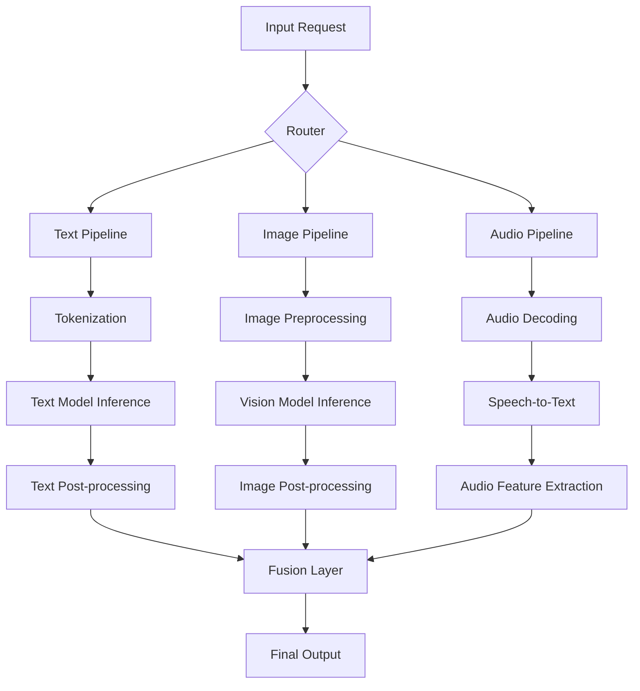

# How to Trace Multimodal AI Pipelines (Text, Image, Audio) with OpenTelemetry

Author: [nawazdhandala](https://www.github.com/nawazdhandala)

Tags: OpenTelemetry, Multimodal AI, Tracing, Machine Learning, Python, Observability, Computer Vision, Audio Processing

Description: A practical guide to tracing multimodal AI pipelines that process text, image, and audio data using OpenTelemetry distributed tracing and custom spans.

---

Multimodal AI pipelines are becoming the norm rather than the exception. Modern applications often combine text understanding, image recognition, and audio processing into a single workflow. Think of a content moderation system that analyzes text, images, and audio from user uploads, or a customer support bot that handles voice input, transcribes it, analyzes sentiment, and generates a visual report.

The challenge with these pipelines is observability. When a request involves three or four different models, each with its own preprocessing and postprocessing steps, figuring out where things went slow or wrong becomes a real headache. OpenTelemetry's distributed tracing is built for exactly this problem. You can create a trace that follows a request across every modality and every processing step, giving you a complete picture of what happened.

## The Multimodal Pipeline Architecture

Before we dive into code, let's look at a typical multimodal pipeline structure:



Each branch of this pipeline runs potentially different models on different hardware. The fusion layer combines results from all modalities into a final output. OpenTelemetry lets us trace the entire flow as a single distributed trace.

## Setting Up the Tracer

First, configure OpenTelemetry with proper resource attributes that identify your multimodal service.

```python
# otel_config.py - OpenTelemetry setup for multimodal pipeline

from opentelemetry import trace
from opentelemetry.sdk.trace import TracerProvider
from opentelemetry.sdk.trace.export import BatchSpanProcessor
from opentelemetry.exporter.otlp.proto.grpc.trace_exporter import OTLPSpanExporter
from opentelemetry.sdk.resources import Resource

def init_tracing():
    # Resource attributes help identify this service in your tracing backend
    resource = Resource.create({
        "service.name": "multimodal-pipeline",
        "service.version": "2.1.0",
        "ml.pipeline.type": "multimodal",
    })

    provider = TracerProvider(resource=resource)
    exporter = OTLPSpanExporter(endpoint="http://localhost:4317", insecure=True)
    provider.add_span_processor(BatchSpanProcessor(exporter))
    trace.set_tracer_provider(provider)

    return trace.get_tracer("multimodal.pipeline")
```

## Instrumenting the Text Pipeline

The text pipeline typically involves tokenization, model inference, and some form of output parsing. Each of these gets its own span.

```python
# text_pipeline.py - Instrumented text processing pipeline

from opentelemetry import trace
from transformers import pipeline as hf_pipeline

tracer = trace.get_tracer("multimodal.text")

class TextPipeline:
    def __init__(self):
        # Load the text classification model once
        self.classifier = hf_pipeline("sentiment-analysis", model="distilbert-base-uncased-finetuned-sst-2-english")

    def process(self, text: str, parent_context=None) -> dict:
        # Create a span for the entire text pipeline, linked to the parent trace
        with tracer.start_as_current_span("text_pipeline.process") as span:
            span.set_attribute("modality", "text")
            span.set_attribute("input.char_count", len(text))

            # Preprocessing: clean and validate the text input
            with tracer.start_as_current_span("text.preprocess") as pre_span:
                cleaned = text.strip().lower()
                pre_span.set_attribute("text.cleaned_length", len(cleaned))

            # Run inference through the Hugging Face pipeline
            with tracer.start_as_current_span("text.inference") as inf_span:
                result = self.classifier(cleaned)
                inf_span.set_attribute("text.prediction_label", result[0]["label"])
                inf_span.set_attribute("text.prediction_score", result[0]["score"])

            return {
                "modality": "text",
                "label": result[0]["label"],
                "score": result[0]["score"],
            }
```

## Instrumenting the Image Pipeline

Image processing usually involves resizing, normalization, model inference, and then interpreting the output. Here's how to trace each step.

```python
# image_pipeline.py - Instrumented image processing pipeline

from opentelemetry import trace
from PIL import Image
from torchvision import transforms, models
import torch

tracer = trace.get_tracer("multimodal.image")

class ImagePipeline:
    def __init__(self):
        # Load a pre-trained ResNet model for image classification
        self.model = models.resnet50(pretrained=True)
        self.model.eval()

        # Standard ImageNet preprocessing transform
        self.preprocess = transforms.Compose([
            transforms.Resize(256),
            transforms.CenterCrop(224),
            transforms.ToTensor(),
            transforms.Normalize(mean=[0.485, 0.456, 0.406], std=[0.229, 0.224, 0.225]),
        ])

    def process(self, image_path: str) -> dict:
        with tracer.start_as_current_span("image_pipeline.process") as span:
            span.set_attribute("modality", "image")
            span.set_attribute("image.path", image_path)

            # Load and validate the image file
            with tracer.start_as_current_span("image.load") as load_span:
                img = Image.open(image_path).convert("RGB")
                load_span.set_attribute("image.original_size", str(img.size))
                load_span.set_attribute("image.mode", img.mode)

            # Apply preprocessing transforms (resize, crop, normalize)
            with tracer.start_as_current_span("image.preprocess") as pre_span:
                tensor = self.preprocess(img).unsqueeze(0)
                pre_span.set_attribute("image.tensor_shape", str(tensor.shape))

            # Run the model forward pass
            with tracer.start_as_current_span("image.inference") as inf_span:
                with torch.no_grad():
                    outputs = self.model(tensor)
                predicted_idx = torch.argmax(outputs, dim=1).item()
                confidence = torch.nn.functional.softmax(outputs, dim=1)[0][predicted_idx].item()
                inf_span.set_attribute("image.predicted_class_idx", predicted_idx)
                inf_span.set_attribute("image.confidence", confidence)

            return {
                "modality": "image",
                "class_idx": predicted_idx,
                "confidence": confidence,
            }
```

## Instrumenting the Audio Pipeline

Audio pipelines typically involve decoding the audio file, extracting features or running speech-to-text, and then analyzing the result.

```python
# audio_pipeline.py - Instrumented audio processing pipeline

from opentelemetry import trace
import whisper
import librosa
import numpy as np

tracer = trace.get_tracer("multimodal.audio")

class AudioPipeline:
    def __init__(self):
        # Load the Whisper model for speech-to-text
        self.whisper_model = whisper.load_model("base")

    def process(self, audio_path: str) -> dict:
        with tracer.start_as_current_span("audio_pipeline.process") as span:
            span.set_attribute("modality", "audio")
            span.set_attribute("audio.path", audio_path)

            # Decode and load the audio file
            with tracer.start_as_current_span("audio.decode") as decode_span:
                audio_data, sample_rate = librosa.load(audio_path, sr=16000)
                duration_seconds = len(audio_data) / sample_rate
                decode_span.set_attribute("audio.sample_rate", sample_rate)
                decode_span.set_attribute("audio.duration_seconds", duration_seconds)
                decode_span.set_attribute("audio.samples_count", len(audio_data))

            # Run speech-to-text transcription with Whisper
            with tracer.start_as_current_span("audio.transcribe") as transcribe_span:
                result = self.whisper_model.transcribe(audio_path)
                transcript = result["text"]
                detected_language = result.get("language", "unknown")
                transcribe_span.set_attribute("audio.transcript_length", len(transcript))
                transcribe_span.set_attribute("audio.detected_language", detected_language)

            # Extract audio features for additional analysis
            with tracer.start_as_current_span("audio.feature_extraction") as feat_span:
                mfccs = librosa.feature.mfcc(y=audio_data, sr=sample_rate, n_mfcc=13)
                energy = np.mean(librosa.feature.rms(y=audio_data))
                feat_span.set_attribute("audio.mfcc_shape", str(mfccs.shape))
                feat_span.set_attribute("audio.mean_energy", float(energy))

            return {
                "modality": "audio",
                "transcript": transcript,
                "language": detected_language,
                "duration_seconds": duration_seconds,
                "mean_energy": float(energy),
            }
```

## The Fusion Layer and Orchestrator

Now here's where it all comes together. The orchestrator receives a request, dispatches to the relevant pipelines (possibly in parallel), and then combines the results in a fusion step.

```python
# orchestrator.py - Multimodal pipeline orchestrator with full tracing

from opentelemetry import trace
from text_pipeline import TextPipeline
from image_pipeline import ImagePipeline
from audio_pipeline import AudioPipeline
import concurrent.futures

tracer = trace.get_tracer("multimodal.orchestrator")

class MultimodalOrchestrator:
    def __init__(self):
        self.text_pipeline = TextPipeline()
        self.image_pipeline = ImagePipeline()
        self.audio_pipeline = AudioPipeline()

    def process_request(self, text: str = None, image_path: str = None, audio_path: str = None) -> dict:
        # Root span for the entire multimodal request
        with tracer.start_as_current_span("multimodal.process_request") as root_span:
            # Record which modalities are present in this request
            modalities = []
            if text:
                modalities.append("text")
            if image_path:
                modalities.append("image")
            if audio_path:
                modalities.append("audio")
            root_span.set_attribute("request.modalities", str(modalities))
            root_span.set_attribute("request.modality_count", len(modalities))

            results = {}

            # Process each modality (sequentially here, but could be parallelized)
            if text:
                results["text"] = self.text_pipeline.process(text)
            if image_path:
                results["image"] = self.image_pipeline.process(image_path)
            if audio_path:
                results["audio"] = self.audio_pipeline.process(audio_path)

            # Fusion step: combine results from all modalities
            with tracer.start_as_current_span("multimodal.fusion") as fusion_span:
                fused = self._fuse_results(results)
                fusion_span.set_attribute("fusion.input_modalities", len(results))
                fusion_span.set_attribute("fusion.output_decision", fused.get("decision", "unknown"))

            return fused

    def _fuse_results(self, results: dict) -> dict:
        # Simple fusion logic - in production this would be more sophisticated
        decision = "allow"
        confidence_scores = []

        for modality, result in results.items():
            if "score" in result:
                confidence_scores.append(result["score"])
            if "confidence" in result:
                confidence_scores.append(result["confidence"])

        avg_confidence = sum(confidence_scores) / len(confidence_scores) if confidence_scores else 0.0

        return {
            "decision": decision,
            "average_confidence": avg_confidence,
            "modality_results": results,
        }
```

## Propagating Context Across Parallel Pipelines

When you run modalities in parallel using thread pools, you need to manually propagate the trace context. Otherwise, the child spans won't be connected to the parent trace.

```python
# parallel_processing.py - Context propagation for parallel pipeline execution

from opentelemetry import trace, context
import concurrent.futures

tracer = trace.get_tracer("multimodal.parallel")

def process_in_parallel(text=None, image_path=None, audio_path=None):
    with tracer.start_as_current_span("multimodal.parallel_process") as root_span:
        # Capture the current context so we can propagate it to worker threads
        ctx = context.get_current()
        results = {}

        def run_with_context(fn, *args):
            # Attach the parent context in the worker thread
            token = context.attach(ctx)
            try:
                return fn(*args)
            finally:
                context.detach(token)

        with concurrent.futures.ThreadPoolExecutor(max_workers=3) as executor:
            futures = {}

            if text:
                # Submit text processing with propagated context
                futures["text"] = executor.submit(
                    run_with_context, text_pipeline.process, text
                )
            if image_path:
                # Submit image processing with propagated context
                futures["image"] = executor.submit(
                    run_with_context, image_pipeline.process, image_path
                )
            if audio_path:
                # Submit audio processing with propagated context
                futures["audio"] = executor.submit(
                    run_with_context, audio_pipeline.process, audio_path
                )

            # Collect results as they complete
            for key, future in futures.items():
                results[key] = future.result()

        return results
```

This pattern of capturing `context.get_current()` and then calling `context.attach()` in the worker thread is essential. Without it, your parallel spans will show up as disconnected root spans in your tracing backend, which defeats the whole purpose.

## Span Timing Comparison

Once you have traces flowing, you'll be able to see a waterfall view like this:

```mermaid
gantt
    title Multimodal Pipeline Trace
    dateFormat X
    axisFormat %s

    section Text
    text.preprocess    :0, 50
    text.inference     :50, 200
    section Image
    image.load         :0, 30
    image.preprocess   :30, 80
    image.inference    :80, 350
    section Audio
    audio.decode       :0, 100
    audio.transcribe   :100, 500
    audio.features     :500, 550
    section Fusion
    multimodal.fusion  :550, 570
```



This kind of visualization immediately tells you that audio transcription is the bottleneck in your pipeline, taking more than twice as long as any other step.

## Best Practices

Here are some things I've learned from instrumenting multimodal pipelines:

1. **Name your spans consistently**. Use a `{modality}.{step}` convention so you can filter and group spans by modality in your tracing backend.

2. **Record input dimensions as attributes**. Token counts, image dimensions, and audio duration are critical for understanding why certain requests are slower than others.

3. **Use span events for checkpoints**. If a single processing step has meaningful sub-stages that don't warrant their own span, add span events instead.

4. **Set span status on errors**. When a model fails or produces garbage output, set the span status to `ERROR` and include the exception details. This makes it easy to find problematic requests later.

5. **Watch out for serialization overhead**. Don't put large arrays or tensors into span attributes. Stick to scalar values, short strings, and small lists.

## Conclusion

Tracing multimodal AI pipelines with OpenTelemetry gives you the visibility you need to operate these complex systems in production. By creating spans for each modality and each processing step, you can quickly identify bottlenecks, track down errors, and understand how different input types affect overall latency.

The key challenge specific to multimodal systems is context propagation across parallel execution paths. Get that right, and everything else follows naturally from standard OpenTelemetry instrumentation patterns.
