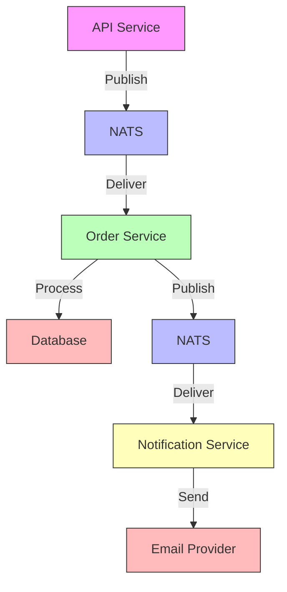

# How to Trace NATS Message Queue Operations in Go with OpenTelemetry

Author: [nawazdhandala](https://www.github.com/nawazdhandala)

Tags: OpenTelemetry, Go, NATS, Message Queue, Distributed Tracing

Description: Master distributed tracing for NATS message queue operations in Go using OpenTelemetry to gain visibility into asynchronous message flows.

Message queues introduce complexity into distributed tracing because request flows become asynchronous. When a service publishes a message to NATS, the consuming service processes it later, potentially after the original request has completed. OpenTelemetry solves this by propagating trace context through message headers, maintaining the trace lineage across asynchronous boundaries.

## Understanding NATS and Tracing Challenges

NATS is a lightweight, high-performance messaging system. Unlike synchronous RPC calls where context flows naturally, message queues require explicit context propagation. You need to:

- Extract trace context from incoming messages
- Inject trace context into outgoing messages
- Link producer and consumer spans appropriately
- Handle batch processing and concurrent consumers

## Setting Up OpenTelemetry with NATS

Start by initializing the OpenTelemetry SDK with appropriate exporters and configuring the NATS connection.

```go
package main

import (
    "context"
    "log"
    "time"

    "github.com/nats-io/nats.go"
    "go.opentelemetry.io/otel"
    "go.opentelemetry.io/otel/exporters/otlp/otlptrace/otlptracegrpc"
    "go.opentelemetry.io/otel/propagation"
    "go.opentelemetry.io/otel/sdk/resource"
    sdktrace "go.opentelemetry.io/otel/sdk/trace"
    semconv "go.opentelemetry.io/otel/semconv/v1.21.0"
)

// Initialize OpenTelemetry with OTLP exporter
func initTracer(serviceName string) (*sdktrace.TracerProvider, error) {
    ctx := context.Background()

    exporter, err := otlptracegrpc.New(ctx,
        otlptracegrpc.WithEndpoint("localhost:4317"),
        otlptracegrpc.WithInsecure(),
    )
    if err != nil {
        return nil, err
    }

    res, err := resource.New(ctx,
        resource.WithAttributes(
            semconv.ServiceNameKey.String(serviceName),
            semconv.ServiceVersionKey.String("1.0.0"),
            semconv.ServiceInstanceIDKey.String("instance-1"),
        ),
    )
    if err != nil {
        return nil, err
    }

    tp := sdktrace.NewTracerProvider(
        sdktrace.WithBatcher(exporter),
        sdktrace.WithResource(res),
        sdktrace.WithSampler(sdktrace.AlwaysSample()),
    )

    otel.SetTracerProvider(tp)

    // Set global propagator for context injection/extraction
    otel.SetTextMapPropagator(
        propagation.NewCompositeTextMapPropagator(
            propagation.TraceContext{},
            propagation.Baggage{},
        ),
    )

    return tp, nil
}

// Create NATS connection
func connectNATS(url string) (*nats.Conn, error) {
    nc, err := nats.Connect(
        url,
        nats.Name("otel-instrumented-service"),
        nats.MaxReconnects(10),
        nats.ReconnectWait(2*time.Second),
    )
    if err != nil {
        return nil, err
    }

    log.Printf("Connected to NATS at %s", url)
    return nc, nil
}
```

## Implementing a Message Carrier for Context Propagation

OpenTelemetry uses carriers to inject and extract trace context. For NATS, we need a custom carrier that works with message headers.

```go
package main

import (
    "github.com/nats-io/nats.go"
)

// NATSMessageCarrier adapts NATS message headers for OpenTelemetry propagation
type NATSMessageCarrier struct {
    msg *nats.Msg
}

// NewNATSMessageCarrier creates a carrier from a NATS message
func NewNATSMessageCarrier(msg *nats.Msg) NATSMessageCarrier {
    if msg.Header == nil {
        msg.Header = nats.Header{}
    }
    return NATSMessageCarrier{msg: msg}
}

// Get retrieves a value from message headers for context extraction
func (c NATSMessageCarrier) Get(key string) string {
    return c.msg.Header.Get(key)
}

// Set adds a value to message headers for context injection
func (c NATSMessageCarrier) Set(key, value string) {
    c.msg.Header.Set(key, value)
}

// Keys returns all header keys (required by TextMapCarrier interface)
func (c NATSMessageCarrier) Keys() []string {
    keys := make([]string, 0, len(c.msg.Header))
    for key := range c.msg.Header {
        keys = append(keys, key)
    }
    return keys
}
```

## Creating an Instrumented NATS Publisher

The publisher creates a span for the publish operation and injects trace context into message headers.

```go
package main

import (
    "context"
    "encoding/json"

    "github.com/nats-io/nats.go"
    "go.opentelemetry.io/otel"
    "go.opentelemetry.io/otel/attribute"
    "go.opentelemetry.io/otel/codes"
    "go.opentelemetry.io/otel/trace"
)

// Publisher wraps NATS connection with OpenTelemetry instrumentation
type Publisher struct {
    nc     *nats.Conn
    tracer trace.Tracer
}

// NewPublisher creates an instrumented NATS publisher
func NewPublisher(nc *nats.Conn, serviceName string) *Publisher {
    return &Publisher{
        nc:     nc,
        tracer: otel.Tracer(serviceName),
    }
}

// OrderEvent represents a sample message payload
type OrderEvent struct {
    OrderID   string  `json:"order_id"`
    UserID    string  `json:"user_id"`
    Amount    float64 `json:"amount"`
    Timestamp int64   `json:"timestamp"`
}

// PublishOrder publishes an order event with distributed tracing
func (p *Publisher) PublishOrder(ctx context.Context, subject string, order OrderEvent) error {
    // Start a span for the publish operation
    ctx, span := p.tracer.Start(ctx, "nats.publish",
        trace.WithSpanKind(trace.SpanKindProducer),
        trace.WithAttributes(
            attribute.String("messaging.system", "nats"),
            attribute.String("messaging.destination", subject),
            attribute.String("messaging.operation", "publish"),
        ),
    )
    defer span.End()

    // Add custom attributes for the order
    span.SetAttributes(
        attribute.String("order.id", order.OrderID),
        attribute.String("user.id", order.UserID),
        attribute.Float64("order.amount", order.Amount),
    )

    // Serialize the message payload
    payload, err := json.Marshal(order)
    if err != nil {
        span.RecordError(err)
        span.SetStatus(codes.Error, "failed to marshal payload")
        return err
    }

    // Create NATS message with headers
    msg := &nats.Msg{
        Subject: subject,
        Data:    payload,
        Header:  nats.Header{},
    }

    // Inject trace context into message headers
    carrier := NewNATSMessageCarrier(msg)
    otel.GetTextMapPropagator().Inject(ctx, carrier)

    // Add custom business headers
    msg.Header.Set("event-type", "order.created")
    msg.Header.Set("version", "v1")

    // Publish the message
    if err := p.nc.PublishMsg(msg); err != nil {
        span.RecordError(err)
        span.SetStatus(codes.Error, "failed to publish message")
        return err
    }

    span.SetStatus(codes.Ok, "message published successfully")
    span.SetAttributes(attribute.Int("message.size", len(payload)))

    return nil
}

// PublishWithReply publishes a message and waits for a reply with tracing
func (p *Publisher) PublishWithReply(ctx context.Context, subject string, order OrderEvent, timeout time.Duration) (*nats.Msg, error) {
    ctx, span := p.tracer.Start(ctx, "nats.request",
        trace.WithSpanKind(trace.SpanKindClient),
        trace.WithAttributes(
            attribute.String("messaging.system", "nats"),
            attribute.String("messaging.destination", subject),
            attribute.String("messaging.operation", "request"),
        ),
    )
    defer span.End()

    payload, err := json.Marshal(order)
    if err != nil {
        span.RecordError(err)
        span.SetStatus(codes.Error, "failed to marshal payload")
        return nil, err
    }

    msg := &nats.Msg{
        Subject: subject,
        Data:    payload,
        Header:  nats.Header{},
    }

    // Inject trace context
    carrier := NewNATSMessageCarrier(msg)
    otel.GetTextMapPropagator().Inject(ctx, carrier)

    // Request with timeout
    reply, err := p.nc.RequestMsg(msg, timeout)
    if err != nil {
        span.RecordError(err)
        span.SetStatus(codes.Error, "request failed")
        return nil, err
    }

    span.SetStatus(codes.Ok, "received reply")
    span.SetAttributes(attribute.Int("reply.size", len(reply.Data)))

    return reply, nil
}
```

## Creating an Instrumented NATS Consumer

The consumer extracts trace context from message headers and creates child spans for processing.

```go
package main

import (
    "context"
    "encoding/json"
    "fmt"
    "log"

    "github.com/nats-io/nats.go"
    "go.opentelemetry.io/otel"
    "go.opentelemetry.io/otel/attribute"
    "go.opentelemetry.io/otel/codes"
    "go.opentelemetry.io/otel/trace"
)

// Consumer wraps NATS subscription with OpenTelemetry instrumentation
type Consumer struct {
    nc     *nats.Conn
    tracer trace.Tracer
}

// NewConsumer creates an instrumented NATS consumer
func NewConsumer(nc *nats.Conn, serviceName string) *Consumer {
    return &Consumer{
        nc:     nc,
        tracer: otel.Tracer(serviceName),
    }
}

// OrderProcessor defines the interface for processing orders
type OrderProcessor interface {
    Process(ctx context.Context, order OrderEvent) error
}

// SubscribeToOrders subscribes to order events with distributed tracing
func (c *Consumer) SubscribeToOrders(subject string, processor OrderProcessor) error {
    // Create subscription with message handler
    _, err := c.nc.Subscribe(subject, func(msg *nats.Msg) {
        c.handleMessage(msg, processor)
    })

    if err != nil {
        return fmt.Errorf("failed to subscribe: %w", err)
    }

    log.Printf("Subscribed to subject: %s", subject)
    return nil
}

// handleMessage processes a single message with tracing
func (c *Consumer) handleMessage(msg *nats.Msg, processor OrderProcessor) {
    // Extract trace context from message headers
    carrier := NewNATSMessageCarrier(msg)
    ctx := otel.GetTextMapPropagator().Extract(context.Background(), carrier)

    // Start consumer span (child of producer span)
    ctx, span := c.tracer.Start(ctx, "nats.process",
        trace.WithSpanKind(trace.SpanKindConsumer),
        trace.WithAttributes(
            attribute.String("messaging.system", "nats"),
            attribute.String("messaging.source", msg.Subject),
            attribute.String("messaging.operation", "process"),
            attribute.Int("message.size", len(msg.Data)),
        ),
    )
    defer span.End()

    // Parse message payload
    var order OrderEvent
    if err := json.Unmarshal(msg.Data, &order); err != nil {
        span.RecordError(err)
        span.SetStatus(codes.Error, "failed to unmarshal message")
        log.Printf("Failed to unmarshal message: %v", err)
        return
    }

    // Add business attributes to span
    span.SetAttributes(
        attribute.String("order.id", order.OrderID),
        attribute.String("user.id", order.UserID),
        attribute.Float64("order.amount", order.Amount),
    )

    // Process the order
    if err := processor.Process(ctx, order); err != nil {
        span.RecordError(err)
        span.SetStatus(codes.Error, "failed to process order")
        log.Printf("Failed to process order: %v", err)
        return
    }

    span.SetStatus(codes.Ok, "order processed successfully")
}
```

## Queue Groups for Load Balancing

NATS queue groups distribute messages across multiple consumers. Each message is processed by only one consumer in the group.

```go
package main

import (
    "context"
    "log"
    "sync"

    "github.com/nats-io/nats.go"
    "go.opentelemetry.io/otel"
    "go.opentelemetry.io/otel/attribute"
    "go.opentelemetry.io/otel/trace"
)

// QueueConsumer handles messages with queue group semantics
type QueueConsumer struct {
    nc         *nats.Conn
    tracer     trace.Tracer
    workerID   string
    wg         sync.WaitGroup
    shutdownCh chan struct{}
}

// NewQueueConsumer creates a consumer for a queue group
func NewQueueConsumer(nc *nats.Conn, serviceName, workerID string) *QueueConsumer {
    return &QueueConsumer{
        nc:         nc,
        tracer:     otel.Tracer(serviceName),
        workerID:   workerID,
        shutdownCh: make(chan struct{}),
    }
}

// SubscribeQueue subscribes to a subject with queue group
func (qc *QueueConsumer) SubscribeQueue(subject, queueGroup string, processor OrderProcessor) error {
    // Queue subscription ensures load balancing across consumers
    _, err := qc.nc.QueueSubscribe(subject, queueGroup, func(msg *nats.Msg) {
        qc.wg.Add(1)
        go qc.processMessage(msg, processor)
    })

    if err != nil {
        return err
    }

    log.Printf("Worker %s joined queue group %s for subject %s", qc.workerID, queueGroup, subject)
    return nil
}

// processMessage handles individual messages with worker identification
func (qc *QueueConsumer) processMessage(msg *nats.Msg, processor OrderProcessor) {
    defer qc.wg.Done()

    carrier := NewNATSMessageCarrier(msg)
    ctx := otel.GetTextMapPropagator().Extract(context.Background(), carrier)

    ctx, span := qc.tracer.Start(ctx, "nats.queue.process",
        trace.WithSpanKind(trace.SpanKindConsumer),
        trace.WithAttributes(
            attribute.String("messaging.system", "nats"),
            attribute.String("messaging.source", msg.Subject),
            attribute.String("worker.id", qc.workerID),
            attribute.String("messaging.consumer.group", "order-processors"),
        ),
    )
    defer span.End()

    var order OrderEvent
    if err := json.Unmarshal(msg.Data, &order); err != nil {
        span.RecordError(err)
        return
    }

    if err := processor.Process(ctx, order); err != nil {
        span.RecordError(err)
        return
    }

    span.SetStatus(codes.Ok, "processed by worker "+qc.workerID)
}

// Shutdown gracefully stops the consumer
func (qc *QueueConsumer) Shutdown(ctx context.Context) error {
    close(qc.shutdownCh)

    // Wait for all messages to finish processing
    done := make(chan struct{})
    go func() {
        qc.wg.Wait()
        close(done)
    }()

    select {
    case <-done:
        return nil
    case <-ctx.Done():
        return ctx.Err()
    }
}
```

## JetStream Support for Persistent Messages

NATS JetStream provides persistence and exactly-once delivery. Tracing works similarly but with additional stream metadata.

```go
package main

import (
    "context"
    "fmt"
    "time"

    "github.com/nats-io/nats.go"
    "go.opentelemetry.io/otel"
    "go.opentelemetry.io/otel/attribute"
    "go.opentelemetry.io/otel/codes"
    "go.opentelemetry.io/otel/trace"
)

// JetStreamPublisher publishes messages to JetStream with tracing
type JetStreamPublisher struct {
    js     nats.JetStreamContext
    tracer trace.Tracer
}

// NewJetStreamPublisher creates a JetStream publisher
func NewJetStreamPublisher(nc *nats.Conn, serviceName string) (*JetStreamPublisher, error) {
    js, err := nc.JetStream()
    if err != nil {
        return nil, err
    }

    return &JetStreamPublisher{
        js:     js,
        tracer: otel.Tracer(serviceName),
    }, nil
}

// PublishOrder publishes an order to JetStream with tracing
func (jsp *JetStreamPublisher) PublishOrder(ctx context.Context, subject string, order OrderEvent) (*nats.PubAck, error) {
    ctx, span := jsp.tracer.Start(ctx, "jetstream.publish",
        trace.WithSpanKind(trace.SpanKindProducer),
        trace.WithAttributes(
            attribute.String("messaging.system", "nats.jetstream"),
            attribute.String("messaging.destination", subject),
        ),
    )
    defer span.End()

    payload, err := json.Marshal(order)
    if err != nil {
        span.RecordError(err)
        return nil, err
    }

    msg := &nats.Msg{
        Subject: subject,
        Data:    payload,
        Header:  nats.Header{},
    }

    carrier := NewNATSMessageCarrier(msg)
    otel.GetTextMapPropagator().Inject(ctx, carrier)

    // Publish with acknowledgment
    ack, err := jsp.js.PublishMsg(msg)
    if err != nil {
        span.RecordError(err)
        span.SetStatus(codes.Error, "jetstream publish failed")
        return nil, err
    }

    // Add JetStream-specific attributes
    span.SetAttributes(
        attribute.String("jetstream.stream", ack.Stream),
        attribute.Int64("jetstream.sequence", int64(ack.Sequence)),
    )
    span.SetStatus(codes.Ok, "message persisted")

    return ack, nil
}

// JetStreamConsumer consumes from JetStream with tracing
type JetStreamConsumer struct {
    js     nats.JetStreamContext
    tracer trace.Tracer
}

// NewJetStreamConsumer creates a JetStream consumer
func NewJetStreamConsumer(nc *nats.Conn, serviceName string) (*JetStreamConsumer, error) {
    js, err := nc.JetStream()
    if err != nil {
        return nil, err
    }

    return &JetStreamConsumer{
        js:     js,
        tracer: otel.Tracer(serviceName),
    }, nil
}

// Subscribe creates a durable consumer with tracing
func (jsc *JetStreamConsumer) Subscribe(subject, durableName string, processor OrderProcessor) error {
    _, err := jsc.js.Subscribe(subject, func(msg *nats.Msg) {
        jsc.handleJetStreamMessage(msg, processor)
    }, nats.Durable(durableName), nats.ManualAck())

    if err != nil {
        return fmt.Errorf("failed to subscribe: %w", err)
    }

    return nil
}

// handleJetStreamMessage processes JetStream messages with tracing
func (jsc *JetStreamConsumer) handleJetStreamMessage(msg *nats.Msg, processor OrderProcessor) {
    carrier := NewNATSMessageCarrier(msg)
    ctx := otel.GetTextMapPropagator().Extract(context.Background(), carrier)

    ctx, span := jsc.tracer.Start(ctx, "jetstream.process",
        trace.WithSpanKind(trace.SpanKindConsumer),
        trace.WithAttributes(
            attribute.String("messaging.system", "nats.jetstream"),
            attribute.String("messaging.source", msg.Subject),
        ),
    )
    defer span.End()

    // Get JetStream metadata
    meta, err := msg.Metadata()
    if err == nil {
        span.SetAttributes(
            attribute.String("jetstream.stream", meta.Stream),
            attribute.Int64("jetstream.sequence", int64(meta.Sequence.Stream)),
            attribute.Int("jetstream.pending", int(meta.NumPending)),
            attribute.Int("jetstream.delivered", int(meta.NumDelivered)),
        )
    }

    var order OrderEvent
    if err := json.Unmarshal(msg.Data, &order); err != nil {
        span.RecordError(err)
        msg.Nak()
        return
    }

    if err := processor.Process(ctx, order); err != nil {
        span.RecordError(err)
        span.SetStatus(codes.Error, "processing failed")
        msg.Nak()
        return
    }

    span.SetStatus(codes.Ok, "message processed")
    msg.Ack()
}
```

## Complete Example: Order Processing Service

Here's a complete example showing producer and consumer services working together.

```go
package main

import (
    "context"
    "log"
    "time"
)

// OrderProcessorImpl implements the OrderProcessor interface
type OrderProcessorImpl struct{}

func (op *OrderProcessorImpl) Process(ctx context.Context, order OrderEvent) error {
    tracer := otel.Tracer("order-processor")
    _, span := tracer.Start(ctx, "process_order")
    defer span.End()

    // Simulate processing time
    time.Sleep(100 * time.Millisecond)

    log.Printf("Processed order %s for user %s: $%.2f", order.OrderID, order.UserID, order.Amount)
    return nil
}

func main() {
    // Initialize tracing
    tp, err := initTracer("order-service")
    if err != nil {
        log.Fatal(err)
    }
    defer tp.Shutdown(context.Background())

    // Connect to NATS
    nc, err := connectNATS("nats://localhost:4222")
    if err != nil {
        log.Fatal(err)
    }
    defer nc.Close()

    // Start consumer in a goroutine
    go func() {
        consumer := NewConsumer(nc, "order-consumer")
        processor := &OrderProcessorImpl{}

        if err := consumer.SubscribeToOrders("orders.created", processor); err != nil {
            log.Fatal(err)
        }

        log.Println("Consumer started")
    }()

    // Publish some orders
    publisher := NewPublisher(nc, "order-publisher")

    for i := 0; i < 5; i++ {
        order := OrderEvent{
            OrderID:   fmt.Sprintf("ORD-%d", i),
            UserID:    fmt.Sprintf("USER-%d", i),
            Amount:    99.99 * float64(i+1),
            Timestamp: time.Now().Unix(),
        }

        ctx := context.Background()
        if err := publisher.PublishOrder(ctx, "orders.created", order); err != nil {
            log.Printf("Failed to publish order: %v", err)
        } else {
            log.Printf("Published order: %s", order.OrderID)
        }

        time.Sleep(time.Second)
    }

    // Keep service running
    select {}
}
```

## Visualizing Traces Across Services

When properly instrumented, your traces show the complete message flow:



Each span captures timing, message metadata, and processing details, allowing you to identify bottlenecks and failures across your asynchronous architecture.

Instrumenting NATS with OpenTelemetry transforms opaque message flows into visible, traceable operations. By propagating context through message headers and creating appropriate spans for producers and consumers, you gain comprehensive observability into your event-driven architecture without sacrificing NATS' performance characteristics.
