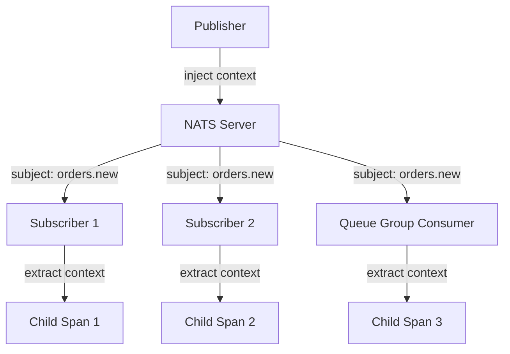

# How to Trace NATS Message Streams with OpenTelemetry

Author: [nawazdhandala](https://www.github.com/nawazdhandala)

Tags: OpenTelemetry, NATS, JetStream, Distributed Tracing, Messaging, Observability, Go

Description: Learn how to instrument NATS Core and JetStream messaging with OpenTelemetry to trace message flows across publishers and subscribers in distributed systems.

---

NATS is built for speed. It delivers messages with minimal latency and almost no configuration overhead, which is why it has become a popular choice for microservice communication. But that simplicity comes with a tracing gap. Out of the box, NATS does not carry trace context between publishers and subscribers. If you want end-to-end visibility across NATS message flows, you need to set that up yourself.

OpenTelemetry provides the framework to bridge this gap. By injecting trace context into NATS message headers when publishing and extracting it when subscribing, you can build traces that span your entire NATS-based architecture. This works for both NATS Core (fire-and-forget) and NATS JetStream (persistent, at-least-once delivery).

## NATS Messaging Patterns and Tracing

NATS supports several messaging patterns, and each one has slightly different tracing considerations:

- **Publish/Subscribe**: One publisher, many subscribers. Each subscriber should create its own child span.
- **Request/Reply**: Synchronous-style messaging. The trace connects the request, the responder, and the reply.
- **Queue Groups**: Load-balanced consumption. Only one subscriber in the group gets the message.
- **JetStream**: Persistent streams with consumer acknowledgment. Messages can be replayed.



## Manual Instrumentation in Go

NATS does not yet have an official OpenTelemetry auto-instrumentation library, so manual instrumentation is the standard approach. The good news is that NATS messages support headers (since NATS 2.2+), which makes context propagation straightforward.

First, set up your OpenTelemetry tracer:

```go
package main

import (
    "context"
    "log"

    "go.opentelemetry.io/otel"
    "go.opentelemetry.io/otel/exporters/otlp/otlptrace/otlptracegrpc"
    "go.opentelemetry.io/otel/sdk/resource"
    sdktrace "go.opentelemetry.io/otel/sdk/trace"
    semconv "go.opentelemetry.io/otel/semconv/v1.24.0"
)

func initTracer() (*sdktrace.TracerProvider, error) {
    // Create an OTLP exporter that sends traces to the collector
    exporter, err := otlptracegrpc.New(
        context.Background(),
        otlptracegrpc.WithEndpoint("localhost:4317"),
        otlptracegrpc.WithInsecure(),
    )
    if err != nil {
        return nil, err
    }

    // Configure the tracer provider with service name
    tp := sdktrace.NewTracerProvider(
        sdktrace.WithBatcher(exporter),
        sdktrace.WithResource(resource.NewWithAttributes(
            semconv.SchemaURL,
            semconv.ServiceNameKey.String("nats-publisher"),
        )),
    )
    otel.SetTracerProvider(tp)
    return tp, nil
}
```

Now create a helper that injects trace context into NATS message headers. NATS headers work like HTTP headers, so the standard OpenTelemetry text map propagator works perfectly:

```go
import (
    "github.com/nats-io/nats.go"
    "go.opentelemetry.io/otel"
    "go.opentelemetry.io/otel/propagation"
)

// natsHeaderCarrier adapts nats.Header to the TextMapCarrier interface
// so OpenTelemetry can inject and extract trace context
type natsHeaderCarrier nats.Header

func (c natsHeaderCarrier) Get(key string) string {
    return nats.Header(c).Get(key)
}

func (c natsHeaderCarrier) Set(key, value string) {
    nats.Header(c).Set(key, value)
}

func (c natsHeaderCarrier) Keys() []string {
    keys := make([]string, 0, len(c))
    for k := range c {
        keys = append(keys, k)
    }
    return keys
}
```

This carrier adapter is the key piece. It lets OpenTelemetry's propagator read and write NATS headers using the same interface it uses for HTTP headers.

## Publishing with Trace Context

With the carrier in place, publishing a traced message looks like this:

```go
import (
    "context"
    "encoding/json"

    "github.com/nats-io/nats.go"
    "go.opentelemetry.io/otel"
    "go.opentelemetry.io/otel/attribute"
    "go.opentelemetry.io/otel/codes"
    "go.opentelemetry.io/otel/trace"
)

func publishOrder(ctx context.Context, nc *nats.Conn, order Order) error {
    tracer := otel.Tracer("nats-publisher")

    // Create a PRODUCER span for the publish operation
    ctx, span := tracer.Start(ctx, "orders.new publish",
        trace.WithSpanKind(trace.SpanKindProducer),
        trace.WithAttributes(
            attribute.String("messaging.system", "nats"),
            attribute.String("messaging.destination.name", "orders.new"),
            attribute.String("messaging.operation", "publish"),
        ),
    )
    defer span.End()

    // Serialize the message payload
    data, err := json.Marshal(order)
    if err != nil {
        span.RecordError(err)
        span.SetStatus(codes.Error, "failed to marshal order")
        return err
    }

    // Create a NATS message with headers
    msg := &nats.Msg{
        Subject: "orders.new",
        Data:    data,
        Header:  nats.Header{},
    }

    // Inject trace context into the NATS message headers
    propagator := otel.GetTextMapPropagator()
    propagator.Inject(ctx, natsHeaderCarrier(msg.Header))

    // Publish the message with trace context embedded
    if err := nc.PublishMsg(msg); err != nil {
        span.RecordError(err)
        span.SetStatus(codes.Error, "publish failed")
        return err
    }

    span.SetAttribute("messaging.message.payload_size_bytes", len(data))
    return nil
}
```

The propagator injects `traceparent` and `tracestate` headers into the NATS message. Any subscriber that knows how to extract these headers can continue the trace.

## Subscribing with Trace Context Extraction

On the subscriber side, extract the trace context from the incoming message and use it as the parent for your processing span:

```go
func subscribeOrders(nc *nats.Conn) {
    tracer := otel.Tracer("nats-subscriber")
    propagator := otel.GetTextMapPropagator()

    // Subscribe to the orders.new subject
    nc.Subscribe("orders.new", func(msg *nats.Msg) {
        // Extract trace context from the incoming message headers
        ctx := propagator.Extract(context.Background(), natsHeaderCarrier(msg.Header))

        // Create a CONSUMER span linked to the producer span
        ctx, span := tracer.Start(ctx, "orders.new process",
            trace.WithSpanKind(trace.SpanKindConsumer),
            trace.WithAttributes(
                attribute.String("messaging.system", "nats"),
                attribute.String("messaging.destination.name", "orders.new"),
                attribute.String("messaging.operation", "process"),
            ),
        )
        defer span.End()

        // Deserialize and process the order
        var order Order
        if err := json.Unmarshal(msg.Data, &order); err != nil {
            span.RecordError(err)
            span.SetStatus(codes.Error, "failed to unmarshal")
            return
        }

        // Processing logic runs within the trace context
        if err := processOrder(ctx, order); err != nil {
            span.RecordError(err)
            span.SetStatus(codes.Error, "processing failed")
        }
    })
}
```

The extracted context becomes the parent of the consumer span. Any further spans created within `processOrder` using the passed context will be children of this consumer span, giving you a complete trace tree from publisher through to final processing.

## JetStream Instrumentation

JetStream adds persistence and delivery guarantees on top of NATS Core. The instrumentation pattern is the same, but you also want to capture JetStream-specific attributes like stream name and consumer name:

```go
func publishToJetStream(ctx context.Context, js nats.JetStreamContext) error {
    tracer := otel.Tracer("nats-jetstream-publisher")

    ctx, span := tracer.Start(ctx, "ORDERS publish",
        trace.WithSpanKind(trace.SpanKindProducer),
        trace.WithAttributes(
            attribute.String("messaging.system", "nats"),
            attribute.String("messaging.destination.name", "ORDERS"),
            attribute.String("messaging.nats.stream", "ORDERS"),
        ),
    )
    defer span.End()

    msg := &nats.Msg{
        Subject: "ORDERS.new",
        Data:    []byte(`{"order_id": "jet-001"}`),
        Header:  nats.Header{},
    }

    // Inject trace context into headers
    otel.GetTextMapPropagator().Inject(ctx, natsHeaderCarrier(msg.Header))

    // Publish to JetStream and capture the ack
    ack, err := js.PublishMsg(msg)
    if err != nil {
        span.RecordError(err)
        span.SetStatus(codes.Error, "jetstream publish failed")
        return err
    }

    // Record JetStream-specific metadata from the publish ack
    span.SetAttribute("messaging.nats.sequence", int64(ack.Sequence))
    span.SetAttribute("messaging.nats.stream", ack.Stream)
    return nil
}
```

For JetStream consumers, you get an additional benefit: since messages are persistent and can be replayed, the trace context survives replays. If a message is redelivered due to a NAK or timeout, the consumer will still extract the original trace context, and you can see the full redelivery chain in your traces.

```go
// JetStream pull consumer with tracing
func consumeJetStream(ctx context.Context, sub *nats.Subscription) {
    tracer := otel.Tracer("nats-jetstream-consumer")
    propagator := otel.GetTextMapPropagator()

    for {
        // Fetch a batch of messages
        msgs, err := sub.Fetch(10, nats.MaxWait(5*time.Second))
        if err != nil {
            continue
        }

        for _, msg := range msgs {
            // Extract trace context from each message
            msgCtx := propagator.Extract(context.Background(), natsHeaderCarrier(msg.Header))

            _, span := tracer.Start(msgCtx, "ORDERS.new process",
                trace.WithSpanKind(trace.SpanKindConsumer),
                trace.WithAttributes(
                    attribute.String("messaging.system", "nats"),
                    attribute.String("messaging.nats.stream", "ORDERS"),
                    attribute.String("messaging.nats.consumer", "order-processor"),
                ),
            )

            // Process the message
            if err := handleOrder(msg.Data); err != nil {
                span.RecordError(err)
                msg.Nak()  // Negative acknowledgment triggers redelivery
            } else {
                msg.Ack()
            }
            span.End()
        }
    }
}
```

## Request/Reply Tracing

NATS request/reply is a synchronous messaging pattern where the publisher sends a request and waits for a response. Trace both sides to see the full round trip:

```go
// Request side: send a request and wait for a reply
func requestPrice(ctx context.Context, nc *nats.Conn, productID string) (float64, error) {
    tracer := otel.Tracer("nats-requester")

    ctx, span := tracer.Start(ctx, "pricing.request",
        trace.WithSpanKind(trace.SpanKindClient),
    )
    defer span.End()

    msg := &nats.Msg{
        Subject: "pricing.lookup",
        Data:    []byte(productID),
        Header:  nats.Header{},
    }

    // Inject context so the responder can continue the trace
    otel.GetTextMapPropagator().Inject(ctx, natsHeaderCarrier(msg.Header))

    // Send request and wait for reply (timeout 2 seconds)
    reply, err := nc.RequestMsg(msg, 2*time.Second)
    if err != nil {
        span.RecordError(err)
        return 0, err
    }

    price, _ := strconv.ParseFloat(string(reply.Data), 64)
    span.SetAttribute("pricing.result", price)
    return price, nil
}
```

## Collector Setup

Route your NATS traces through an OpenTelemetry Collector:

```yaml
receivers:
  otlp:
    protocols:
      grpc:
        endpoint: 0.0.0.0:4317

processors:
  batch:
    timeout: 5s
  resource:
    attributes:
      - key: messaging.system
        value: nats
        action: upsert

exporters:
  otlp:
    endpoint: https://oneuptime.example.com:4317

service:
  pipelines:
    traces:
      receivers: [otlp]
      processors: [batch, resource]
      exporters: [otlp]
```

NATS tracing requires a bit more manual work than some other messaging systems, but the payoff is significant. You go from having no visibility into your NATS message flows to seeing every publish, subscribe, request, and reply as connected spans in a distributed trace. For systems that rely on NATS for real-time communication between services, that visibility is not optional. It is essential.
