# How to Trace Neo4j Graph Database Queries with OpenTelemetry

Author: [nawazdhandala](https://www.github.com/nawazdhandala)

Tags: OpenTelemetry, Neo4j, Graph Database, Cypher, Tracing, Observability, Database Monitoring

Description: Learn how to trace Neo4j Cypher queries with OpenTelemetry to monitor graph traversals, detect slow queries, and gain full visibility into your graph database operations.

---

Neo4j is the most widely adopted graph database, used for everything from social network analysis to fraud detection and recommendation engines. Graph queries can be deceptively expensive. A Cypher query that looks simple might trigger deep graph traversals that touch millions of nodes. Without distributed tracing, you are left guessing which queries are causing latency in your application.

OpenTelemetry provides a standardized way to instrument Neo4j interactions, capturing Cypher queries as spans with detailed attributes about execution time, result size, and the database being queried. This guide covers instrumentation for Java, Python, and Node.js applications using the official Neo4j drivers.

## How Neo4j Tracing Fits into Distributed Traces

When your application serves a request, it might call Neo4j multiple times to load related entities, check permissions, or compute graph-based recommendations. Each Neo4j call becomes a child span under the parent request span, making it easy to see how much time the request spends in the graph database versus other components.

```mermaid
graph TD
    A[HTTP Request Span] --> B[Authentication Span]
    A --> C[Neo4j: MATCH user node]
    A --> D[Neo4j: MATCH recommendations]
    A --> E[Template Rendering Span]
    C --> F[Neo4j Driver Connection]
    D --> G[Neo4j Driver Connection]
    F --> H[Neo4j Server]
    G --> H
```



This visibility is critical for applications that make multiple graph queries per request. You can instantly spot whether slow responses are caused by Neo4j or by other downstream services.

## Java Instrumentation with the Neo4j Driver

The Neo4j Java driver does not include built-in OpenTelemetry support, so you need to wrap driver calls with manual instrumentation. The approach below creates a traced session wrapper that instruments every query execution.

First, add the required dependencies to your project.

```xml
<!-- pom.xml - OpenTelemetry and Neo4j driver dependencies -->
<dependencies>
    <!-- Neo4j Java Driver -->
    <dependency>
        <groupId>org.neo4j.driver</groupId>
        <artifactId>neo4j-java-driver</artifactId>
        <version>5.20.0</version>
    </dependency>

    <!-- OpenTelemetry API and SDK -->
    <dependency>
        <groupId>io.opentelemetry</groupId>
        <artifactId>opentelemetry-api</artifactId>
        <version>1.40.0</version>
    </dependency>
    <dependency>
        <groupId>io.opentelemetry</groupId>
        <artifactId>opentelemetry-sdk</artifactId>
        <version>1.40.0</version>
    </dependency>

    <!-- OTLP exporter sends spans to the collector -->
    <dependency>
        <groupId>io.opentelemetry</groupId>
        <artifactId>opentelemetry-exporter-otlp</artifactId>
        <version>1.40.0</version>
    </dependency>
</dependencies>
```

Now create a wrapper that intercepts Neo4j session operations and produces OpenTelemetry spans.

```java
// TracedNeo4jSession.java - Wraps Neo4j Session with OpenTelemetry tracing
import io.opentelemetry.api.trace.Tracer;
import io.opentelemetry.api.trace.Span;
import io.opentelemetry.api.trace.SpanKind;
import io.opentelemetry.api.trace.StatusCode;
import io.opentelemetry.api.common.AttributeKey;
import org.neo4j.driver.*;

import java.util.List;
import java.util.Map;

public class TracedNeo4jSession {

    private final Session session;
    private final Tracer tracer;
    private final String databaseName;

    public TracedNeo4jSession(Session session, Tracer tracer, String databaseName) {
        this.session = session;
        this.tracer = tracer;
        this.databaseName = databaseName;
    }

    // Execute a read transaction with automatic span creation
    public <T> T readTransaction(String description, String cypher,
                                  Map<String, Object> params,
                                  java.util.function.Function<Result, T> mapper) {
        // Create a span named after the operation type and description
        Span span = tracer.spanBuilder("Neo4j READ: " + description)
            .setSpanKind(SpanKind.CLIENT)
            .setAttribute(AttributeKey.stringKey("db.system"), "neo4j")
            .setAttribute(AttributeKey.stringKey("db.name"), databaseName)
            .setAttribute(AttributeKey.stringKey("db.operation"), "READ")
            .setAttribute(AttributeKey.stringKey("db.statement"), cypher)
            .startSpan();

        try {
            // Execute within a read transaction for optimal routing
            T result = session.executeRead(tx -> {
                Result queryResult = tx.run(cypher, params);
                return mapper.apply(queryResult);
            });

            span.setAttribute(AttributeKey.stringKey("db.neo4j.query_type"), "read");
            return result;
        } catch (Exception e) {
            // Record failure details on the span
            span.setStatus(StatusCode.ERROR, e.getMessage());
            span.recordException(e);
            throw e;
        } finally {
            span.end();
        }
    }

    // Execute a write transaction with tracing
    public <T> T writeTransaction(String description, String cypher,
                                   Map<String, Object> params,
                                   java.util.function.Function<Result, T> mapper) {
        Span span = tracer.spanBuilder("Neo4j WRITE: " + description)
            .setSpanKind(SpanKind.CLIENT)
            .setAttribute(AttributeKey.stringKey("db.system"), "neo4j")
            .setAttribute(AttributeKey.stringKey("db.name"), databaseName)
            .setAttribute(AttributeKey.stringKey("db.operation"), "WRITE")
            .setAttribute(AttributeKey.stringKey("db.statement"), cypher)
            .startSpan();

        try {
            T result = session.executeWrite(tx -> {
                Result queryResult = tx.run(cypher, params);
                return mapper.apply(queryResult);
            });

            span.setAttribute(AttributeKey.stringKey("db.neo4j.query_type"), "write");
            return result;
        } catch (Exception e) {
            span.setStatus(StatusCode.ERROR, e.getMessage());
            span.recordException(e);
            throw e;
        } finally {
            span.end();
        }
    }

    public void close() {
        session.close();
    }
}
```

Here is how you use the traced session in your application code.

```java
// Usage example - Tracing a graph query for user recommendations
TracedNeo4jSession tracedSession = new TracedNeo4jSession(
    driver.session(), tracer, "social-graph"
);

// This Cypher query finds friends-of-friends who share common interests
String cypher = """
    MATCH (user:Person {id: $userId})-[:FRIEND]->(friend)-[:FRIEND]->(suggestion)
    WHERE NOT (user)-[:FRIEND]->(suggestion) AND user <> suggestion
    MATCH (suggestion)-[:INTERESTED_IN]->(topic)<-[:INTERESTED_IN]-(user)
    RETURN suggestion.name AS name, collect(topic.name) AS sharedInterests,
           count(topic) AS score
    ORDER BY score DESC
    LIMIT 10
    """;

// Execute with tracing - the span will capture the full Cypher query,
// execution time, and any errors
List<Recommendation> recommendations = tracedSession.readTransaction(
    "friend-suggestions",
    cypher,
    Map.of("userId", currentUserId),
    result -> result.stream()
        .map(record -> new Recommendation(
            record.get("name").asString(),
            record.get("sharedInterests").asList(Value::asString),
            record.get("score").asInt()
        ))
        .toList()
);
```

## Python Instrumentation

Python applications using the `neo4j` driver can be instrumented with a context manager pattern that feels natural in Python code.

```python
# traced_neo4j.py - OpenTelemetry instrumentation for the Neo4j Python driver
from opentelemetry import trace
from opentelemetry.trace import SpanKind, StatusCode
from neo4j import GraphDatabase
from contextlib import contextmanager

# Get a tracer for Neo4j operations
tracer = trace.get_tracer("neo4j-instrumentation", "1.0.0")

class TracedNeo4jDriver:
    """Wrapper around Neo4j driver that creates spans for every query."""

    def __init__(self, uri, auth, database="neo4j"):
        # Initialize the underlying Neo4j driver
        self.driver = GraphDatabase.driver(uri, auth=auth)
        self.database = database

    @contextmanager
    def traced_session(self):
        """Yield a traced session that instruments all queries."""
        session = self.driver.session(database=self.database)
        try:
            yield TracedSession(session, self.database)
        finally:
            session.close()

    def close(self):
        self.driver.close()


class TracedSession:
    """Session wrapper that creates OpenTelemetry spans for Neo4j queries."""

    def __init__(self, session, database):
        self.session = session
        self.database = database

    def run_query(self, cypher, parameters=None, operation_name="query"):
        """Execute a Cypher query with tracing."""
        # Start a span with database semantic conventions
        with tracer.start_as_current_span(
            name=f"Neo4j {operation_name}",
            kind=SpanKind.CLIENT,
            attributes={
                "db.system": "neo4j",
                "db.name": self.database,
                "db.statement": cypher,
                "db.operation": operation_name.upper(),
            }
        ) as span:
            try:
                result = self.session.run(cypher, parameters or {})
                # Consume the result and count records
                records = list(result)
                span.set_attribute("db.neo4j.records_returned", len(records))

                # Capture query plan summary if available
                summary = result.consume()
                if summary.plan:
                    span.set_attribute("db.neo4j.plan_operator",
                                      summary.plan.operator_type)

                return records
            except Exception as e:
                span.set_status(StatusCode.ERROR, str(e))
                span.record_exception(e)
                raise


# Example usage - finding shortest path between two nodes
driver = TracedNeo4jDriver(
    "bolt://localhost:7687",
    auth=("neo4j", "password"),
    database="social"
)

with driver.traced_session() as session:
    # This query finds the shortest path between two people
    # The span will capture timing and the Cypher statement
    results = session.run_query(
        cypher="""
            MATCH path = shortestPath(
                (a:Person {name: $from})-[:KNOWS*]-(b:Person {name: $to})
            )
            RETURN [node IN nodes(path) | node.name] AS names,
                   length(path) AS hops
        """,
        parameters={"from": "Alice", "to": "Dave"},
        operation_name="shortest-path"
    )
```

## Node.js Instrumentation

For Node.js applications, you can instrument the Neo4j JavaScript driver using a higher-order function pattern.

```javascript
// traced-neo4j.js - OpenTelemetry tracing for Neo4j Node.js driver
const { trace, SpanKind, SpanStatusCode } = require('@opentelemetry/api');
const neo4j = require('neo4j-driver');

// Create a tracer for Neo4j operations
const tracer = trace.getTracer('neo4j-instrumentation', '1.0.0');

/**
 * Execute a traced Cypher query against Neo4j.
 * Creates an OpenTelemetry span with database semantic conventions.
 */
async function tracedQuery(session, cypher, params = {}, operationName = 'query') {
    // Start a span for this database call
    return tracer.startActiveSpan(
        `Neo4j ${operationName}`,
        { kind: SpanKind.CLIENT },
        async (span) => {
            // Set standard database attributes
            span.setAttribute('db.system', 'neo4j');
            span.setAttribute('db.statement', cypher);
            span.setAttribute('db.operation', operationName.toUpperCase());

            try {
                const result = await session.run(cypher, params);

                // Record how many records were returned
                span.setAttribute('db.neo4j.records_returned',
                    result.records.length);

                // Capture query statistics from the summary
                const summary = result.summary;
                if (summary.counters) {
                    const counters = summary.counters.updates();
                    span.setAttribute('db.neo4j.nodes_created',
                        counters.nodesCreated || 0);
                    span.setAttribute('db.neo4j.relationships_created',
                        counters.relationshipsCreated || 0);
                }

                return result;
            } catch (error) {
                // Mark the span as errored and record the exception
                span.setStatus({
                    code: SpanStatusCode.ERROR,
                    message: error.message
                });
                span.recordException(error);
                throw error;
            } finally {
                span.end();
            }
        }
    );
}

// Usage example - find all paths between nodes with a depth limit
async function findConnections(driver, fromId, toId) {
    const session = driver.session({ database: 'social' });
    try {
        // The traced query will produce a span with the Cypher statement,
        // execution duration, and result count
        const result = await tracedQuery(
            session,
            `MATCH path = (a:Person {id: $fromId})-[:KNOWS*1..4]-(b:Person {id: $toId})
             RETURN path
             LIMIT 5`,
            { fromId, toId },
            'find-connections'
        );
        return result.records.map(r => r.get('path'));
    } finally {
        await session.close();
    }
}

module.exports = { tracedQuery, findConnections };
```

## Key Attributes for Neo4j Spans

Graph database spans benefit from additional attributes beyond the standard database conventions. Consider adding these to give your team better debugging context:

| Attribute | Description |
|-----------|-------------|
| `db.system` | Always `neo4j` |
| `db.name` | The Neo4j database name |
| `db.statement` | The Cypher query text |
| `db.operation` | READ, WRITE, or the operation name |
| `db.neo4j.records_returned` | Number of records in the result |
| `db.neo4j.nodes_created` | Nodes created by write operations |
| `db.neo4j.relationships_created` | Relationships created |
| `db.neo4j.plan_operator` | Root operator from the query plan |

## Collector Configuration for Neo4j Traces

Configure your OpenTelemetry Collector to receive these traces and route them appropriately.

```yaml
# otel-collector-config.yaml - Collector setup for Neo4j trace ingestion
receivers:
  otlp:
    protocols:
      grpc:
        endpoint: 0.0.0.0:4317
      http:
        endpoint: 0.0.0.0:4318

processors:
  # Batch spans for efficient export
  batch:
    timeout: 5s
    send_batch_size: 512

  # Add attributes to help filter Neo4j spans in your backend
  attributes:
    actions:
      - key: db.technology
        value: "graph"
        action: upsert

exporters:
  otlp/oneuptime:
    endpoint: "https://otlp.oneuptime.com:4317"
    headers:
      "x-oneuptime-token": "${ONEUPTIME_TOKEN}"

service:
  pipelines:
    traces:
      receivers: [otlp]
      processors: [batch, attributes]
      exporters: [otlp/oneuptime]
```

## Detecting Slow Graph Traversals

Graph queries have a unique performance characteristic: they can start fast and then suddenly become expensive as the graph grows. A query that traverses two hops is usually fine, but the same pattern at four hops can explore exponentially more paths.

Watch for these warning signs in your traces:

- **Variable-length path queries** (`-[:KNOWS*1..6]-`) with high durations. These are the most common source of Neo4j performance problems.
- **Large result sets.** If `db.neo4j.records_returned` is consistently high, the query may be returning more data than the application needs.
- **Write operations that take longer than reads.** Neo4j write transactions acquire locks, and slow writes can indicate lock contention.
- **Queries without a leading label scan.** If the Cypher query does not start with a labeled node lookup, Neo4j performs a full graph scan. You can detect this by examining the query plan operator.

OpenTelemetry tracing turns Neo4j from a black box into a transparent component of your system. When your application slows down, you can immediately see whether the graph database is the bottleneck and which specific queries need optimization.
