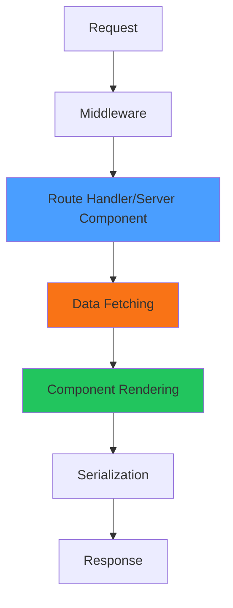

# How to Trace Next.js Server Components and API Routes with OpenTelemetry

Author: [nawazdhandala](https://www.github.com/nawazdhandala)

Tags: OpenTelemetry, Next.js, Server Components, API Routes, React, Tracing

Description: Master OpenTelemetry tracing for Next.js Server Components and API Routes to gain deep visibility into server-side rendering, data fetching, and request handling.

Next.js 13+ introduced Server Components, fundamentally changing how React applications handle server-side rendering. Unlike traditional API routes that run on explicit HTTP endpoints, Server Components execute during the rendering process, making them harder to trace and debug. OpenTelemetry provides the instrumentation needed to understand performance bottlenecks and errors in both contexts.

Server Components blur the line between frontend and backend. They execute server-side but feel like client components when writing code. This mental model shift requires rethinking how you approach observability. Traditional APM tools built for REST APIs struggle with Server Components because there's no discrete HTTP boundary to monitor.

## Understanding the Rendering Pipeline

Next.js processes requests through multiple stages, each contributing to the final response time:



OpenTelemetry spans let you measure each stage independently. Without proper instrumentation, you only see total request time without understanding where delays occur.

## Setting Up OpenTelemetry for Next.js

Start with the instrumentation hook that initializes tracing before your application loads:

```typescript
// instrumentation.ts
import { registerOTel } from '@vercel/otel';

export function register() {
  registerOTel({
    serviceName: 'nextjs-app',
  });
}
```

Enable the hook in your Next.js config:

```javascript
// next.config.js
/** @type {import('next').NextConfig} */
const nextConfig = {
  experimental: {
    instrumentationHook: true,
  },
};

module.exports = nextConfig;
```

This foundation ensures all server-side code runs within an instrumented context.

## Tracing API Routes

API routes represent traditional HTTP endpoints. OpenTelemetry's automatic instrumentation captures the HTTP layer, but you should add custom spans for business logic:

```typescript
// app/api/products/route.ts
import { trace } from '@opentelemetry/api';

export async function GET(request: Request) {
  const tracer = trace.getTracer('products-api');

  return await tracer.startActiveSpan('get-products', async (span) => {
    try {
      // Parse query parameters
      const url = new URL(request.url);
      const category = url.searchParams.get('category');

      span.setAttribute('query.category', category || 'all');

      // Database query with dedicated span
      const products = await tracer.startActiveSpan('db.query.products', async (dbSpan) => {
        dbSpan.setAttribute('db.system', 'postgresql');
        dbSpan.setAttribute('db.operation', 'SELECT');
        dbSpan.setAttribute('db.table', 'products');

        const startTime = Date.now();

        const result = await db.product.findMany({
          where: category ? { category } : undefined,
          take: 50,
        });

        const duration = Date.now() - startTime;
        dbSpan.setAttribute('db.duration_ms', duration);
        dbSpan.setAttribute('db.rows_returned', result.length);

        dbSpan.end();
        return result;
      });

      // Transform data with separate span
      const transformed = await tracer.startActiveSpan('transform.products', async (transformSpan) => {
        const result = products.map(p => ({
          id: p.id,
          name: p.name,
          price: p.price,
          // Expensive transformation
          formattedPrice: new Intl.NumberFormat('en-US', {
            style: 'currency',
            currency: 'USD',
          }).format(p.price),
        }));

        transformSpan.setAttribute('transform.count', result.length);
        transformSpan.end();
        return result;
      });

      span.setAttribute('response.count', transformed.length);
      span.setStatus({ code: 1 }); // OK

      return Response.json(transformed);
    } catch (error) {
      span.recordException(error as Error);
      span.setStatus({ code: 2, message: (error as Error).message }); // ERROR
      return Response.json({ error: 'Failed to fetch products' }, { status: 500 });
    } finally {
      span.end();
    }
  });
}
```

This pattern creates a hierarchy of spans showing exactly where time is spent: database queries, transformations, or serialization.

## Tracing Server Components

Server Components are async functions that render React elements on the server. Unlike API routes, they don't return JSON but JSX that Next.js serializes:

```typescript
// app/products/page.tsx
import { trace } from '@opentelemetry/api';

// This function executes on the server during rendering
async function getProducts() {
  const tracer = trace.getTracer('server-components');

  return await tracer.startActiveSpan('fetch-products-for-page', async (span) => {
    span.setAttribute('component', 'ProductsPage');

    const products = await db.product.findMany({
      include: {
        category: true,
        reviews: {
          take: 5,
          orderBy: { createdAt: 'desc' },
        },
      },
    });

    span.setAttribute('products.count', products.length);
    span.end();

    return products;
  });
}

// Server Component (default in app directory)
export default async function ProductsPage() {
  const products = await getProducts();

  return (
    <div>
      <h1>Products</h1>
      {products.map(product => (
        <div key={product.id}>
          <h2>{product.name}</h2>
          <p>${product.price}</p>
        </div>
      ))}
    </div>
  );
}
```

The tracing happens in the data fetching function, not in the JSX. This separation keeps your rendering logic clean while maintaining observability.

## Tracing Nested Server Components

Server Components can nest, creating complex rendering hierarchies. Trace each level to understand the full rendering tree:

```typescript
// app/products/[id]/page.tsx
import { trace } from '@opentelemetry/api';

async function getProduct(id: string) {
  const tracer = trace.getTracer('server-components');

  return await tracer.startActiveSpan('get-product', async (span) => {
    span.setAttribute('product.id', id);

    const product = await db.product.findUnique({
      where: { id },
    });

    span.end();
    return product;
  });
}

async function getReviews(productId: string) {
  const tracer = trace.getTracer('server-components');

  return await tracer.startActiveSpan('get-reviews', async (span) => {
    span.setAttribute('product.id', productId);

    const reviews = await db.review.findMany({
      where: { productId },
      take: 10,
    });

    span.setAttribute('reviews.count', reviews.length);
    span.end();
    return reviews;
  });
}

export default async function ProductPage({ params }: { params: { id: string } }) {
  // These execute in parallel by default in Next.js
  const [product, reviews] = await Promise.all([
    getProduct(params.id),
    getReviews(params.id),
  ]);

  if (!product) {
    return <div>Product not found</div>;
  }

  return (
    <div>
      <h1>{product.name}</h1>
      <p>${product.price}</p>

      <h2>Reviews</h2>
      {reviews.map(review => (
        <div key={review.id}>
          <p>{review.text}</p>
        </div>
      ))}
    </div>
  );
}
```

The parallel data fetching is visible in your traces, showing both spans starting simultaneously rather than sequentially.

## Tracing Server Actions

Server Actions are server-side functions callable from client components. They're particularly important to trace because they handle mutations:

```typescript
// app/actions/create-product.ts
'use server';

import { trace } from '@opentelemetry/api';
import { revalidatePath } from 'next/cache';

export async function createProduct(formData: FormData) {
  const tracer = trace.getTracer('server-actions');

  return await tracer.startActiveSpan('create-product', async (span) => {
    const name = formData.get('name') as string;
    const price = parseFloat(formData.get('price') as string);

    span.setAttribute('product.name', name);
    span.setAttribute('product.price', price);

    try {
      // Validation span
      await tracer.startActiveSpan('validate-product', async (validateSpan) => {
        if (!name || price <= 0) {
          validateSpan.setAttribute('validation.result', 'failed');
          validateSpan.end();
          throw new Error('Invalid product data');
        }
        validateSpan.setAttribute('validation.result', 'passed');
        validateSpan.end();
      });

      // Database insert span
      const product = await tracer.startActiveSpan('db.insert.product', async (dbSpan) => {
        dbSpan.setAttribute('db.operation', 'INSERT');

        const result = await db.product.create({
          data: { name, price },
        });

        dbSpan.setAttribute('product.id', result.id);
        dbSpan.end();
        return result;
      });

      // Cache revalidation span
      await tracer.startActiveSpan('revalidate-cache', async (cacheSpan) => {
        revalidatePath('/products');
        cacheSpan.setAttribute('revalidated.path', '/products');
        cacheSpan.end();
      });

      span.setStatus({ code: 1 });
      return { success: true, productId: product.id };
    } catch (error) {
      span.recordException(error as Error);
      span.setStatus({ code: 2, message: (error as Error).message });
      return { success: false, error: (error as Error).message };
    } finally {
      span.end();
    }
  });
}
```

Server Actions benefit from detailed tracing because they often involve multiple operations: validation, database writes, cache invalidation, and external API calls.

## Tracing Route Handlers with Different HTTP Methods

Route handlers support multiple HTTP methods in a single file. Trace each method distinctly:

```typescript
// app/api/products/[id]/route.ts
import { trace } from '@opentelemetry/api';

export async function GET(
  request: Request,
  { params }: { params: { id: string } }
) {
  const tracer = trace.getTracer('products-api');

  return await tracer.startActiveSpan('get-product-by-id', async (span) => {
    span.setAttribute('http.method', 'GET');
    span.setAttribute('product.id', params.id);

    const product = await db.product.findUnique({
      where: { id: params.id },
    });

    if (!product) {
      span.setAttribute('response.status', 404);
      span.end();
      return Response.json({ error: 'Not found' }, { status: 404 });
    }

    span.setAttribute('response.status', 200);
    span.end();
    return Response.json(product);
  });
}

export async function PATCH(
  request: Request,
  { params }: { params: { id: string } }
) {
  const tracer = trace.getTracer('products-api');

  return await tracer.startActiveSpan('update-product', async (span) => {
    span.setAttribute('http.method', 'PATCH');
    span.setAttribute('product.id', params.id);

    const body = await request.json();

    const product = await db.product.update({
      where: { id: params.id },
      data: body,
    });

    span.setAttribute('response.status', 200);
    span.end();
    return Response.json(product);
  });
}

export async function DELETE(
  request: Request,
  { params }: { params: { id: string } }
) {
  const tracer = trace.getTracer('products-api');

  return await tracer.startActiveSpan('delete-product', async (span) => {
    span.setAttribute('http.method', 'DELETE');
    span.setAttribute('product.id', params.id);

    await db.product.delete({
      where: { id: params.id },
    });

    span.setAttribute('response.status', 204);
    span.end();
    return new Response(null, { status: 204 });
  });
}
```

Different span names for each method make it easy to filter traces by operation type in your observability backend.

## Automatic Database Instrumentation

Most database clients have OpenTelemetry instrumentation. Prisma, for example, can be automatically instrumented:

```typescript
// instrumentation.ts
import { registerOTel } from '@vercel/otel';

export function register() {
  if (process.env.NEXT_RUNTIME === 'nodejs') {
    const { getNodeAutoInstrumentations } = require('@opentelemetry/auto-instrumentations-node');

    registerOTel({
      serviceName: 'nextjs-app',
      instrumentations: [
        getNodeAutoInstrumentations({
          // Prisma instrumentation (if using Prisma)
          '@prisma/instrumentation': {
            enabled: true,
          },
        }),
      ],
    });
  }
}
```

With this setup, every Prisma query automatically generates spans showing the SQL, execution time, and affected rows.

## Tracing Parallel Data Fetching

Server Components often fetch data in parallel. Trace each stream to identify slow dependencies:

```typescript
// app/dashboard/page.tsx
import { trace } from '@opentelemetry/api';

async function getUser(id: string) {
  const tracer = trace.getTracer('dashboard');
  return await tracer.startActiveSpan('get-user', async (span) => {
    const user = await db.user.findUnique({ where: { id } });
    span.end();
    return user;
  });
}

async function getStats() {
  const tracer = trace.getTracer('dashboard');
  return await tracer.startActiveSpan('get-stats', async (span) => {
    const stats = await db.stat.aggregate({
      _count: { id: true },
      _avg: { value: true },
    });
    span.end();
    return stats;
  });
}

async function getRecentActivity() {
  const tracer = trace.getTracer('dashboard');
  return await tracer.startActiveSpan('get-recent-activity', async (span) => {
    const activity = await db.activity.findMany({
      take: 10,
      orderBy: { createdAt: 'desc' },
    });
    span.end();
    return activity;
  });
}

export default async function DashboardPage() {
  // All three requests run in parallel
  const [user, stats, activity] = await Promise.all([
    getUser('current-user-id'),
    getStats(),
    getRecentActivity(),
  ]);

  return (
    <div>
      <h1>Dashboard for {user?.name}</h1>
      <div>Total: {stats._count.id}</div>
      <div>
        {activity.map(a => (
          <div key={a.id}>{a.description}</div>
        ))}
      </div>
    </div>
  );
}
```

Your trace waterfall shows three parallel spans, making it obvious if one query is slower than others.

## Error Tracking in Server Components

Properly recording errors in spans helps correlate traces with error monitoring tools:

```typescript
// app/products/error.tsx
'use client';

import { useEffect } from 'react';

export default function Error({
  error,
  reset,
}: {
  error: Error & { digest?: string };
  reset: () => void;
}) {
  useEffect(() => {
    // Error boundaries catch render errors, but the initial
    // error was already recorded in the server-side span
    console.error('Error boundary caught:', error);
  }, [error]);

  return (
    <div>
      <h2>Something went wrong!</h2>
      <button onClick={() => reset()}>Try again</button>
    </div>
  );
}
```

The server-side span that threw the error records the exception:

```typescript
// app/products/page.tsx
async function getProducts() {
  const tracer = trace.getTracer('server-components');

  return await tracer.startActiveSpan('get-products', async (span) => {
    try {
      const products = await db.product.findMany();
      span.end();
      return products;
    } catch (error) {
      // Record exception details in the span
      span.recordException(error as Error);
      span.setStatus({
        code: 2,
        message: (error as Error).message,
      });
      span.end();
      throw error; // Re-throw to trigger error boundary
    }
  });
}
```

This pattern ensures errors are visible in both your traces and error tracking systems.

## Measuring Serialization Overhead

Next.js serializes Server Component props to send them to the client. Large or complex objects slow this down:

```typescript
// app/dashboard/page.tsx
import { trace } from '@opentelemetry/api';

async function getDashboardData() {
  const tracer = trace.getTracer('dashboard');

  return await tracer.startActiveSpan('get-dashboard-data', async (span) => {
    const data = await db.dashboard.findFirst({
      include: {
        // Deeply nested includes can be expensive
        widgets: {
          include: {
            data: true,
            settings: true,
          },
        },
      },
    });

    // Measure serialization impact
    const serializationSpan = tracer.startSpan('serialize-dashboard-data');
    const serialized = JSON.stringify(data);
    const sizeKb = Buffer.byteLength(serialized, 'utf8') / 1024;

    serializationSpan.setAttribute('serialized.size_kb', sizeKb);
    serializationSpan.end();

    span.setAttribute('data.size_kb', sizeKb);
    span.end();

    return data;
  });
}
```

If serialization size is large, consider fetching less data or splitting into multiple Server Components.

## Tracing Dynamic Route Segments

Dynamic routes with parameters need special attention in tracing:

```typescript
// app/categories/[category]/products/[id]/page.tsx
import { trace } from '@opentelemetry/api';

async function getProduct(category: string, id: string) {
  const tracer = trace.getTracer('products');

  return await tracer.startActiveSpan('get-product-in-category', async (span) => {
    span.setAttribute('category', category);
    span.setAttribute('product.id', id);

    const product = await db.product.findFirst({
      where: {
        id,
        category: {
          slug: category,
        },
      },
    });

    span.setAttribute('product.found', !!product);
    span.end();

    return product;
  });
}

export default async function ProductDetailPage({
  params,
}: {
  params: { category: string; id: string };
}) {
  const product = await getProduct(params.category, params.id);

  if (!product) {
    return <div>Product not found</div>;
  }

  return <div>{product.name}</div>;
}
```

Recording route parameters as span attributes helps you analyze performance by category, product type, or other dimensions.

## Best Practices for Production

**Consistent naming conventions:**
Use a structured naming scheme for spans: `{resource}.{operation}` like `products.get` or `user.update`. This makes filtering and aggregation easier.

**Attribute standardization:**
Define standard attributes across your application:
```typescript
const SPAN_ATTRIBUTES = {
  RESOURCE_ID: 'resource.id',
  RESOURCE_TYPE: 'resource.type',
  OPERATION: 'operation.name',
  USER_ID: 'user.id',
  TENANT_ID: 'tenant.id',
};
```

**Avoid over-instrumentation:**
Don't create spans for trivial operations like string formatting or simple calculations. Focus on I/O, network calls, and business logic.

**Sampling strategy:**
In high-traffic applications, sample traces to reduce overhead:
```bash
OTEL_TRACES_SAMPLER=parentbased_traceidratio
OTEL_TRACES_SAMPLER_ARG=0.1  # Sample 10% of traces
```

## Conclusion

Tracing Next.js Server Components and API Routes with OpenTelemetry provides unprecedented visibility into your application's server-side behavior. Server Components require explicit span creation around data fetching operations, while API routes benefit from both automatic HTTP instrumentation and custom business logic spans.

The key is creating a span hierarchy that mirrors your application's call graph. Each async operation, database query, and transformation should have its own span with relevant attributes. This granular approach lets you pinpoint bottlenecks, understand error patterns, and optimize the user experience based on real production data.
