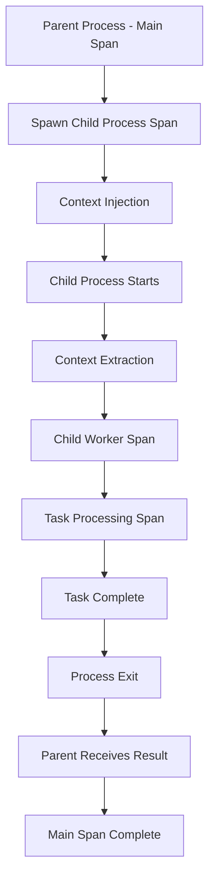

# How to Trace Node.js Child Processes with OpenTelemetry Context Propagation

Author: [nawazdhandala](https://www.github.com/nawazdhandala)

Tags: OpenTelemetry, Node.js, Child Processes, Context Propagation, Tracing

Description: Master the techniques for propagating OpenTelemetry trace context across Node.js child processes to maintain distributed tracing visibility in multi-process architectures.

Node.js applications frequently spawn child processes to handle CPU-intensive tasks, run external commands, or isolate operations. However, each child process runs in a separate memory space, breaking the trace context that OpenTelemetry relies on for distributed tracing. Without proper context propagation, traces become fragmented, making it impossible to understand the complete flow of operations across process boundaries.

## Understanding the Challenge of Multi-Process Tracing

OpenTelemetry uses context propagation to maintain trace continuity across asynchronous operations and service boundaries. In a single process, this happens automatically through async hooks. When you spawn a child process, you create an entirely separate V8 instance with its own memory space. The parent process's trace context does not automatically transfer to the child.

Traditional process communication through stdin, stdout, and stderr does not carry trace metadata. You must explicitly serialize trace context in the parent process, transmit it through inter-process communication channels, and deserialize it in the child process to continue the trace.

## Setting Up OpenTelemetry in Parent and Child Processes

Both parent and child processes need OpenTelemetry initialization:

```typescript
// shared/tracing.ts - Shared tracing configuration
import { NodeSDK } from '@opentelemetry/sdk-node';
import { OTLPTraceExporter } from '@opentelemetry/exporter-trace-otlp-http';
import { Resource } from '@opentelemetry/resources';
import { SemanticResourceAttributes } from '@opentelemetry/semantic-conventions';
import { getNodeAutoInstrumentations } from '@opentelemetry/auto-instrumentations-node';

export function initializeTracing(serviceName: string) {
  const sdk = new NodeSDK({
    resource: new Resource({
      [SemanticResourceAttributes.SERVICE_NAME]: serviceName,
      [SemanticResourceAttributes.SERVICE_VERSION]: '1.0.0',
    }),
    traceExporter: new OTLPTraceExporter({
      url: process.env.OTEL_EXPORTER_OTLP_ENDPOINT ||
           'http://localhost:4318/v1/traces',
    }),
    instrumentations: [getNodeAutoInstrumentations()],
  });

  sdk.start();

  process.on('SIGTERM', () => {
    sdk.shutdown()
      .then(() => console.log('Tracing terminated'))
      .catch((error) => console.error('Error terminating tracing', error))
      .finally(() => process.exit(0));
  });

  return sdk;
}
```

## Serializing and Deserializing Trace Context

Create utilities for encoding trace context for transmission:

```typescript
// shared/contextPropagation.ts - Context serialization utilities
import {
  trace,
  context,
  SpanContext,
  TraceFlags,
  propagation,
  Context,
} from '@opentelemetry/api';
import { W3CTraceContextPropagator } from '@opentelemetry/core';

const propagator = new W3CTraceContextPropagator();

export interface SerializedContext {
  traceId: string;
  spanId: string;
  traceFlags: number;
  traceState?: string;
}

export function serializeCurrentContext(): SerializedContext | null {
  const currentSpan = trace.getSpan(context.active());

  if (!currentSpan) {
    return null;
  }

  const spanContext = currentSpan.spanContext();

  return {
    traceId: spanContext.traceId,
    spanId: spanContext.spanId,
    traceFlags: spanContext.traceFlags,
    traceState: spanContext.traceState?.serialize(),
  };
}

export function serializeContextFromSpan(span: any): SerializedContext {
  const spanContext = span.spanContext();

  return {
    traceId: spanContext.traceId,
    spanId: spanContext.spanId,
    traceFlags: spanContext.traceFlags,
    traceState: spanContext.traceState?.serialize(),
  };
}

export function deserializeContext(serialized: SerializedContext): Context {
  const carrier: Record<string, string> = {};

  // Create W3C Trace Context header format
  carrier['traceparent'] =
    `00-${serialized.traceId}-${serialized.spanId}-${serialized.traceFlags.toString(16).padStart(2, '0')}`;

  if (serialized.traceState) {
    carrier['tracestate'] = serialized.traceState;
  }

  // Extract context from carrier
  return propagation.extract(context.active(), carrier);
}

export function injectContextIntoEnvironment(
  env: NodeJS.ProcessEnv,
  ctx?: Context
): NodeJS.ProcessEnv {
  const activeContext = ctx || context.active();
  const carrier: Record<string, string> = {};

  propagation.inject(activeContext, carrier);

  // Inject trace context as environment variables
  return {
    ...env,
    OTEL_TRACE_PARENT: carrier['traceparent'] || '',
    OTEL_TRACE_STATE: carrier['tracestate'] || '',
  };
}

export function extractContextFromEnvironment(): Context | null {
  if (!process.env.OTEL_TRACE_PARENT) {
    return null;
  }

  const carrier: Record<string, string> = {
    traceparent: process.env.OTEL_TRACE_PARENT,
  };

  if (process.env.OTEL_TRACE_STATE) {
    carrier.tracestate = process.env.OTEL_TRACE_STATE;
  }

  return propagation.extract(context.active(), carrier);
}
```

## Spawning Child Processes with Context Propagation

Create a wrapper that automatically propagates trace context when spawning processes:

```typescript
// parent/tracedSpawn.ts - Spawn child processes with tracing
import { spawn, SpawnOptions } from 'child_process';
import { trace, context as otelContext, SpanStatusCode } from '@opentelemetry/api';
import { injectContextIntoEnvironment } from '../shared/contextPropagation';

const tracer = trace.getTracer('child-process-spawn', '1.0.0');

export interface TracedSpawnOptions extends SpawnOptions {
  traceName?: string;
  traceAttributes?: Record<string, string | number | boolean>;
}

export function tracedSpawn(
  command: string,
  args: string[] = [],
  options: TracedSpawnOptions = {}
): Promise<{ stdout: string; stderr: string; exitCode: number }> {
  const {
    traceName = 'child_process.spawn',
    traceAttributes = {},
    ...spawnOptions
  } = options;

  return new Promise((resolve, reject) => {
    const span = tracer.startSpan(traceName, {
      attributes: {
        'process.command': command,
        'process.args': args.join(' '),
        'process.type': 'spawn',
        ...traceAttributes,
      },
    });

    const spanContext = otelContext.with(
      trace.setSpan(otelContext.active(), span),
      () => otelContext.active()
    );

    // Inject trace context into environment variables
    const enrichedEnv = injectContextIntoEnvironment(
      spawnOptions.env || process.env,
      spanContext
    );

    const startTime = Date.now();
    const child = spawn(command, args, {
      ...spawnOptions,
      env: enrichedEnv,
    });

    let stdout = '';
    let stderr = '';

    span.addEvent('process.started', {
      'process.pid': child.pid,
    });

    child.stdout?.on('data', (data) => {
      stdout += data.toString();
      span.addEvent('process.stdout', {
        'data.length': data.length,
      });
    });

    child.stderr?.on('data', (data) => {
      stderr += data.toString();
      span.addEvent('process.stderr', {
        'data.length': data.length,
      });
    });

    child.on('error', (error) => {
      span.recordException(error);
      span.setStatus({
        code: SpanStatusCode.ERROR,
        message: error.message,
      });
      span.end();
      reject(error);
    });

    child.on('close', (exitCode) => {
      const duration = Date.now() - startTime;

      span.setAttributes({
        'process.exit_code': exitCode || 0,
        'process.duration_ms': duration,
        'process.stdout.length': stdout.length,
        'process.stderr.length': stderr.length,
      });

      if (exitCode === 0) {
        span.setStatus({ code: SpanStatusCode.OK });
      } else {
        span.setStatus({
          code: SpanStatusCode.ERROR,
          message: `Process exited with code ${exitCode}`,
        });
      }

      span.end();

      resolve({
        stdout,
        stderr,
        exitCode: exitCode || 0,
      });
    });
  });
}
```

## Implementing the Child Process with Context Extraction

Create a child process that extracts and continues the trace:

```typescript
// child/worker.ts - Child process with trace continuation
import { initializeTracing } from '../shared/tracing';
import {
  extractContextFromEnvironment,
  serializeCurrentContext,
} from '../shared/contextPropagation';
import { trace, context as otelContext } from '@opentelemetry/api';

// Initialize tracing in the child process
initializeTracing('worker-child-process');

const tracer = trace.getTracer('worker', '1.0.0');

async function main() {
  // Extract trace context from environment variables
  const parentContext = extractContextFromEnvironment();

  if (!parentContext) {
    console.error('No trace context found in environment');
    process.exit(1);
  }

  // Create a span that continues from the parent's trace
  const span = tracer.startSpan(
    'worker.process',
    {
      attributes: {
        'worker.pid': process.pid,
        'worker.args': process.argv.slice(2).join(' '),
      },
    },
    parentContext
  );

  try {
    await otelContext.with(
      trace.setSpan(otelContext.active(), span),
      async () => {
        // Perform actual work
        const task = process.argv[2];

        span.addEvent('worker.task.started', {
          'task.type': task,
        });

        const result = await performTask(task);

        span.addEvent('worker.task.completed', {
          'task.result.size': JSON.stringify(result).length,
        });

        // Output result to stdout for parent to consume
        console.log(JSON.stringify(result));
      }
    );

    span.setStatus({ code: 1 }); // OK
    span.end();
    process.exit(0);
  } catch (error) {
    span.recordException(error as Error);
    span.setStatus({ code: 2, message: (error as Error).message });
    span.end();

    console.error('Worker error:', error);
    process.exit(1);
  }
}

async function performTask(taskType: string): Promise<any> {
  const taskSpan = tracer.startSpan(`worker.task.${taskType}`);

  try {
    // Simulate CPU-intensive work
    const startTime = Date.now();

    switch (taskType) {
      case 'compute':
        return await heavyComputation();
      case 'process':
        return await dataProcessing();
      default:
        throw new Error(`Unknown task type: ${taskType}`);
    }
  } finally {
    taskSpan.end();
  }
}

async function heavyComputation(): Promise<number> {
  // Simulate heavy computation
  let result = 0;
  for (let i = 0; i < 1000000; i++) {
    result += Math.sqrt(i);
  }
  return result;
}

async function dataProcessing(): Promise<any> {
  // Simulate data processing
  return { processed: true, timestamp: Date.now() };
}

main();
```

## Using Fork for Bi-Directional Communication

Implement context propagation with the fork method for more complex scenarios:

```typescript
// parent/tracedFork.ts - Fork child processes with tracing
import { fork, ForkOptions } from 'child_process';
import { trace, context as otelContext, SpanStatusCode } from '@opentelemetry/api';
import { injectContextIntoEnvironment } from '../shared/contextPropagation';

const tracer = trace.getTracer('child-process-fork', '1.0.0');

export interface TracedForkOptions extends ForkOptions {
  traceName?: string;
  traceAttributes?: Record<string, string | number | boolean>;
}

export function tracedFork(
  modulePath: string,
  args: string[] = [],
  options: TracedForkOptions = {}
) {
  const {
    traceName = 'child_process.fork',
    traceAttributes = {},
    ...forkOptions
  } = options;

  const span = tracer.startSpan(traceName, {
    attributes: {
      'process.module': modulePath,
      'process.args': args.join(' '),
      'process.type': 'fork',
      ...traceAttributes,
    },
  });

  const spanContext = otelContext.with(
    trace.setSpan(otelContext.active(), span),
    () => otelContext.active()
  );

  // Inject trace context into environment
  const enrichedEnv = injectContextIntoEnvironment(
    forkOptions.env || process.env,
    spanContext
  );

  const child = fork(modulePath, args, {
    ...forkOptions,
    env: enrichedEnv,
  });

  span.addEvent('process.forked', {
    'process.pid': child.pid,
  });

  // Wrap message sending to propagate context
  const originalSend = child.send.bind(child);
  child.send = function(message: any, ...args: any[]) {
    const messageSpan = tracer.startSpan(
      'ipc.message.send',
      {
        attributes: {
          'ipc.direction': 'parent_to_child',
          'ipc.message.type': typeof message,
        },
      },
      spanContext
    );

    // Inject trace context into message
    const enrichedMessage = {
      ...message,
      __traceContext: injectContextIntoEnvironment({}, spanContext),
    };

    messageSpan.end();
    return originalSend(enrichedMessage, ...args);
  };

  // Track message reception
  child.on('message', (message: any) => {
    const messageSpan = tracer.startSpan(
      'ipc.message.receive',
      {
        attributes: {
          'ipc.direction': 'child_to_parent',
          'ipc.message.type': typeof message,
        },
      },
      spanContext
    );

    messageSpan.addEvent('message.received', {
      'message.keys': Object.keys(message).filter(k => k !== '__traceContext').join(','),
    });

    messageSpan.end();
  });

  child.on('error', (error) => {
    span.recordException(error);
    span.setStatus({ code: SpanStatusCode.ERROR, message: error.message });
  });

  child.on('exit', (code, signal) => {
    span.setAttributes({
      'process.exit_code': code || 0,
      'process.exit_signal': signal || 'none',
    });

    if (code === 0) {
      span.setStatus({ code: SpanStatusCode.OK });
    } else {
      span.setStatus({
        code: SpanStatusCode.ERROR,
        message: `Process exited with code ${code}`,
      });
    }

    span.end();
  });

  return child;
}
```

## Implementing IPC with Trace Context

Create a child process that uses IPC with trace propagation:

```typescript
// child/ipcWorker.ts - IPC worker with context propagation
import { initializeTracing } from '../shared/tracing';
import { extractContextFromEnvironment } from '../shared/contextPropagation';
import { trace, context as otelContext, propagation } from '@opentelemetry/api';

initializeTracing('ipc-worker');

const tracer = trace.getTracer('ipc-worker', '1.0.0');

// Extract initial context from environment
const baseContext = extractContextFromEnvironment();

process.on('message', async (message: any) => {
  // Extract trace context from message
  let messageContext = baseContext;

  if (message.__traceContext) {
    const carrier: Record<string, string> = {
      traceparent: message.__traceContext.OTEL_TRACE_PARENT || '',
    };

    if (message.__traceContext.OTEL_TRACE_STATE) {
      carrier.tracestate = message.__traceContext.OTEL_TRACE_STATE;
    }

    messageContext = propagation.extract(otelContext.active(), carrier);
  }

  const span = tracer.startSpan(
    'ipc.message.handle',
    {
      attributes: {
        'message.type': message.type,
        'worker.pid': process.pid,
      },
    },
    messageContext
  );

  try {
    await otelContext.with(
      trace.setSpan(otelContext.active(), span),
      async () => {
        const result = await handleMessage(message);

        span.addEvent('message.processed', {
          'result.type': typeof result,
        });

        // Send response back to parent
        process.send?.({
          type: 'response',
          requestId: message.requestId,
          result,
        });
      }
    );

    span.setStatus({ code: 1 });
    span.end();
  } catch (error) {
    span.recordException(error as Error);
    span.setStatus({ code: 2, message: (error as Error).message });
    span.end();

    process.send?.({
      type: 'error',
      requestId: message.requestId,
      error: (error as Error).message,
    });
  }
});

async function handleMessage(message: any): Promise<any> {
  const span = tracer.startSpan(`worker.${message.type}`);

  try {
    switch (message.type) {
      case 'compute':
        return await performComputation(message.data);
      case 'process':
        return await processData(message.data);
      default:
        throw new Error(`Unknown message type: ${message.type}`);
    }
  } finally {
    span.end();
  }
}

async function performComputation(data: any): Promise<any> {
  // Computation logic
  return { computed: true, result: Math.random() };
}

async function processData(data: any): Promise<any> {
  // Processing logic
  return { processed: true, data };
}

console.log('IPC worker ready');
```

## Creating a Process Pool with Tracing

Build a managed pool of child processes with comprehensive tracing:

```typescript
// parent/processPool.ts - Traced process pool implementation
import { ChildProcess } from 'child_process';
import { trace, context as otelContext } from '@opentelemetry/api';
import { tracedFork } from './tracedFork';

const tracer = trace.getTracer('process-pool', '1.0.0');

export class TracedProcessPool {
  private workers: ChildProcess[] = [];
  private availableWorkers: ChildProcess[] = [];
  private taskQueue: Array<{
    task: any;
    resolve: (value: any) => void;
    reject: (error: any) => void;
  }> = [];

  constructor(
    private workerPath: string,
    private poolSize: number
  ) {}

  async initialize(): Promise<void> {
    const span = tracer.startSpan('pool.initialize', {
      attributes: {
        'pool.size': this.poolSize,
        'pool.worker.path': this.workerPath,
      },
    });

    for (let i = 0; i < this.poolSize; i++) {
      const worker = tracedFork(this.workerPath, [], {
        traceName: `pool.worker.${i}.create`,
        traceAttributes: {
          'worker.index': i,
        },
      });

      this.workers.push(worker);
      this.availableWorkers.push(worker);

      span.addEvent('worker.created', {
        'worker.index': i,
        'worker.pid': worker.pid,
      });
    }

    span.end();
  }

  async execute<T>(task: any): Promise<T> {
    const span = tracer.startSpan('pool.execute', {
      attributes: {
        'task.type': task.type,
        'pool.available.workers': this.availableWorkers.length,
        'pool.queue.size': this.taskQueue.length,
      },
    });

    return new Promise((resolve, reject) => {
      otelContext.with(
        trace.setSpan(otelContext.active(), span),
        () => {
          if (this.availableWorkers.length > 0) {
            const worker = this.availableWorkers.pop()!;
            this.executeOnWorker(worker, task, span)
              .then(resolve)
              .catch(reject);
          } else {
            span.addEvent('task.queued');
            this.taskQueue.push({ task, resolve, reject });
          }
        }
      );
    });
  }

  private async executeOnWorker(
    worker: ChildProcess,
    task: any,
    parentSpan: any
  ): Promise<any> {
    return new Promise((resolve, reject) => {
      const requestId = Math.random().toString(36);
      const timeout = setTimeout(() => {
        parentSpan.addEvent('task.timeout');
        reject(new Error('Task timeout'));
      }, 30000);

      const messageHandler = (message: any) => {
        if (message.requestId === requestId) {
          clearTimeout(timeout);
          worker.off('message', messageHandler);

          this.availableWorkers.push(worker);

          if (this.taskQueue.length > 0) {
            const queued = this.taskQueue.shift()!;
            this.executeOnWorker(worker, queued.task, parentSpan)
              .then(queued.resolve)
              .catch(queued.reject);
          }

          if (message.type === 'error') {
            parentSpan.addEvent('task.error', {
              'error.message': message.error,
            });
            parentSpan.setStatus({ code: 2 });
            parentSpan.end();
            reject(new Error(message.error));
          } else {
            parentSpan.addEvent('task.completed');
            parentSpan.setStatus({ code: 1 });
            parentSpan.end();
            resolve(message.result);
          }
        }
      };

      worker.on('message', messageHandler);
      worker.send({ ...task, requestId });
    });
  }

  async shutdown(): Promise<void> {
    const span = tracer.startSpan('pool.shutdown');

    for (const worker of this.workers) {
      worker.kill();
    }

    span.addEvent('all.workers.terminated', {
      'workers.count': this.workers.length,
    });
    span.end();
  }
}
```

## Visualizing Multi-Process Traces

The context propagation creates hierarchical traces across process boundaries:



## Best Practices for Child Process Tracing

Always initialize OpenTelemetry in both parent and child processes. Each process needs its own SDK instance to export traces correctly. Use the same trace exporter endpoint so all traces go to the same backend.

Propagate context through environment variables for spawned processes and through message payloads for forked processes using IPC. Environment variables work well for one-way communication while IPC allows bidirectional context flow.

Handle errors gracefully in both parent and child processes. Record exceptions in spans and ensure child processes always exit with appropriate status codes. Clean up resources properly to avoid orphaned processes.

Monitor process pool health by tracking metrics like available workers, queue size, and task latency. These metrics help identify when you need to scale the pool or investigate performance issues.

Use sampling in production to reduce overhead. Tracing every child process execution can generate significant data volume. Sample based on operation type, error rate, or random percentage.

Context propagation across process boundaries transforms fragmented logs into cohesive distributed traces. You gain complete visibility into multi-process architectures, enabling effective debugging and performance optimization in complex Node.js applications.
