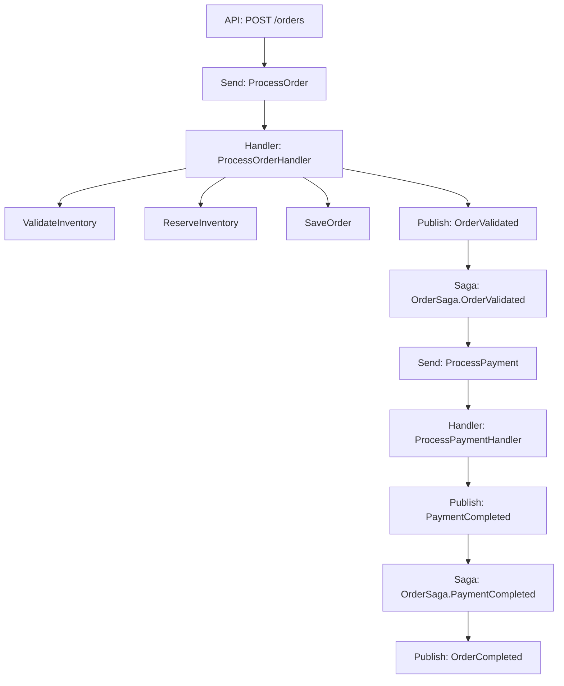

# How to Trace NServiceBus Messages with OpenTelemetry in .NET

Author: [nawazdhandala](https://www.github.com/nawazdhandala)

Tags: OpenTelemetry, NServiceBus, .NET, Messaging, Distributed Tracing

Description: Implement comprehensive OpenTelemetry tracing for NServiceBus message handlers, sagas, and distributed workflows in your .NET applications.

NServiceBus is a mature messaging framework that handles the complexity of building distributed systems. When messages flow through your endpoints, handlers, and sagas, you need visibility into latency, failures, and message routing. OpenTelemetry provides the distributed tracing infrastructure to monitor these flows across service boundaries.

## NServiceBus and OpenTelemetry Integration

NServiceBus added native OpenTelemetry support in version 8.0. The framework creates activities (spans) for:

- Message sending and publishing
- Handler execution
- Saga invocation
- Pipeline behaviors
- Retries and recoverability
- Message forwarding and auditing

This built-in instrumentation works out of the box, but enhancing it with custom telemetry gives you deeper insights into your business logic.

## Setting Up NServiceBus with OpenTelemetry

Install the necessary packages:

```bash
dotnet add package NServiceBus
dotnet add package NServiceBus.RabbitMQ
dotnet add package OpenTelemetry.Extensions.Hosting
dotnet add package OpenTelemetry.Instrumentation.AspNetCore
dotnet add package OpenTelemetry.Exporter.OpenTelemetryProtocol
```

Configure your NServiceBus endpoint with OpenTelemetry:

```csharp
using NServiceBus;
using OpenTelemetry.Resources;
using OpenTelemetry.Trace;

var builder = WebApplication.CreateBuilder(args);

// Configure OpenTelemetry
builder.Services.AddOpenTelemetry()
    .ConfigureResource(resource => resource
        .AddService("order-service", serviceVersion: "1.0.0")
        .AddAttributes(new Dictionary<string, object>
        {
            ["deployment.environment"] = builder.Environment.EnvironmentName,
            ["host.name"] = Environment.MachineName
        }))
    .WithTracing(tracing => tracing
        .AddAspNetCoreInstrumentation()
        .AddHttpClientInstrumentation()
        .AddSource("NServiceBus.Core") // NServiceBus activity source
        .AddOtlpExporter(options =>
        {
            options.Endpoint = new Uri("http://localhost:4317");
        }));

// Configure NServiceBus endpoint
var endpointConfiguration = new EndpointConfiguration("OrderService");

// Use RabbitMQ transport
var transport = endpointConfiguration.UseTransport<RabbitMQTransport>();
transport.ConnectionString("host=localhost;username=guest;password=guest");
transport.UseConventionalRoutingTopology(QueueType.Quorum);

// Enable OpenTelemetry instrumentation
endpointConfiguration.EnableOpenTelemetry();

// Configure persistence for sagas
var persistence = endpointConfiguration.UsePersistence<InMemoryPersistence>();

// Configure error handling
endpointConfiguration.SendFailedMessagesTo("error");
endpointConfiguration.AuditProcessedMessagesTo("audit");

// Start the endpoint
builder.Host.UseNServiceBus(context => endpointConfiguration);

var app = builder.Build();
app.Run();
```

## Sending Messages with Telemetry

NServiceBus automatically creates spans when sending or publishing messages. Add custom telemetry to track business context:

```csharp
using System.Diagnostics;
using NServiceBus;

public class OrdersController : ControllerBase
{
    private static readonly ActivitySource ActivitySource =
        new ActivitySource("OrderService");

    private readonly IMessageSession _messageSession;
    private readonly ILogger<OrdersController> _logger;

    public OrdersController(
        IMessageSession messageSession,
        ILogger<OrdersController> logger)
    {
        _messageSession = messageSession;
        _logger = logger;
    }

    [HttpPost("orders")]
    public async Task<IActionResult> CreateOrder([FromBody] CreateOrderRequest request)
    {
        using var activity = ActivitySource.StartActivity(
            "CreateOrder",
            ActivityKind.Producer);

        var orderId = Guid.NewGuid();

        activity?.SetTag("order.id", orderId);
        activity?.SetTag("order.customer_id", request.CustomerId);
        activity?.SetTag("order.total_amount", request.TotalAmount);
        activity?.SetTag("order.item_count", request.Items.Count);

        try
        {
            // Validate order details
            using (var validateActivity = ActivitySource.StartActivity("ValidateOrder"))
            {
                if (request.Items.Count == 0)
                {
                    validateActivity?.SetStatus(ActivityStatusCode.Error, "Empty order");
                    return BadRequest("Order must contain items");
                }

                if (request.TotalAmount <= 0)
                {
                    validateActivity?.SetStatus(ActivityStatusCode.Error, "Invalid amount");
                    return BadRequest("Order total must be positive");
                }

                validateActivity?.SetTag("validation.passed", true);
            }

            // Send command to process order
            // NServiceBus creates a span automatically
            var command = new ProcessOrder
            {
                OrderId = orderId,
                CustomerId = request.CustomerId,
                Items = request.Items.Select(i => new OrderItem
                {
                    Sku = i.Sku,
                    Quantity = i.Quantity,
                    UnitPrice = i.UnitPrice
                }).ToArray(),
                TotalAmount = request.TotalAmount,
                CreatedAt = DateTime.UtcNow
            };

            await _messageSession.Send(command);

            activity?.SetTag("message.sent", true);
            activity?.SetTag("message.type", nameof(ProcessOrder));
            activity?.AddEvent(new ActivityEvent("OrderCommandSent"));

            _logger.LogInformation(
                "Order {OrderId} command sent for customer {CustomerId}",
                orderId,
                request.CustomerId);

            return Ok(new { orderId });
        }
        catch (Exception ex)
        {
            activity?.SetStatus(ActivityStatusCode.Error, ex.Message);
            activity?.RecordException(ex);
            _logger.LogError(ex, "Failed to create order");
            throw;
        }
    }

    [HttpPost("orders/{orderId}/cancel")]
    public async Task<IActionResult> CancelOrder(Guid orderId)
    {
        using var activity = ActivitySource.StartActivity(
            "CancelOrder",
            ActivityKind.Producer);

        activity?.SetTag("order.id", orderId);

        try
        {
            // Publish event about cancellation request
            await _messageSession.Publish(new OrderCancellationRequested
            {
                OrderId = orderId,
                RequestedAt = DateTime.UtcNow
            });

            activity?.SetTag("message.published", true);
            activity?.SetTag("message.type", nameof(OrderCancellationRequested));

            return Accepted();
        }
        catch (Exception ex)
        {
            activity?.SetStatus(ActivityStatusCode.Error, ex.Message);
            activity?.RecordException(ex);
            throw;
        }
    }
}

public record CreateOrderRequest(
    string CustomerId,
    List<CreateOrderItem> Items,
    decimal TotalAmount
);

public record CreateOrderItem(string Sku, int Quantity, decimal UnitPrice);

public class ProcessOrder : ICommand
{
    public Guid OrderId { get; set; }
    public string CustomerId { get; set; } = string.Empty;
    public OrderItem[] Items { get; set; } = Array.Empty<OrderItem>();
    public decimal TotalAmount { get; set; }
    public DateTime CreatedAt { get; set; }
}

public class OrderItem
{
    public string Sku { get; set; } = string.Empty;
    public int Quantity { get; set; }
    public decimal UnitPrice { get; set; }
}

public class OrderCancellationRequested : IEvent
{
    public Guid OrderId { get; set; }
    public DateTime RequestedAt { get; set; }
}
```

## Message Handlers with Detailed Instrumentation

Handlers receive automatic instrumentation, but adding custom spans helps track internal operations:

```csharp
using System.Diagnostics;
using NServiceBus;

public class ProcessOrderHandler : IHandleMessages<ProcessOrder>
{
    private static readonly ActivitySource ActivitySource =
        new ActivitySource("OrderService");

    private readonly IInventoryService _inventoryService;
    private readonly IOrderRepository _orderRepository;
    private readonly ILogger<ProcessOrderHandler> _logger;

    public ProcessOrderHandler(
        IInventoryService inventoryService,
        IOrderRepository orderRepository,
        ILogger<ProcessOrderHandler> logger)
    {
        _inventoryService = inventoryService;
        _orderRepository = orderRepository;
        _logger = logger;
    }

    public async Task Handle(ProcessOrder message, IMessageHandlerContext context)
    {
        // NServiceBus creates parent span for handler execution
        // Add custom spans for internal operations
        using var activity = ActivitySource.StartActivity(
            "ProcessOrderHandler",
            ActivityKind.Internal);

        activity?.SetTag("order.id", message.OrderId);
        activity?.SetTag("order.customer_id", message.CustomerId);
        activity?.SetTag("order.item_count", message.Items.Length);
        activity?.SetTag("messaging.message_id", context.MessageId);

        try
        {
            _logger.LogInformation(
                "Processing order {OrderId} for customer {CustomerId}",
                message.OrderId,
                message.CustomerId);

            // Validate inventory availability
            using (var inventoryActivity = ActivitySource.StartActivity("ValidateInventory"))
            {
                var unavailableItems = new List<string>();

                foreach (var item in message.Items)
                {
                    var available = await _inventoryService.IsAvailableAsync(
                        item.Sku,
                        item.Quantity);

                    if (!available)
                    {
                        unavailableItems.Add(item.Sku);
                    }
                }

                inventoryActivity?.SetTag("inventory.items_checked", message.Items.Length);
                inventoryActivity?.SetTag("inventory.all_available", unavailableItems.Count == 0);

                if (unavailableItems.Any())
                {
                    inventoryActivity?.SetTag(
                        "inventory.unavailable_items",
                        string.Join(", ", unavailableItems));

                    // Publish event about inventory shortage
                    await context.Publish(new OrderInventoryShortage
                    {
                        OrderId = message.OrderId,
                        UnavailableItems = unavailableItems.ToArray()
                    });

                    activity?.AddEvent(new ActivityEvent("InventoryShortage"));
                    activity?.SetTag("order.status", "inventory_shortage");

                    return;
                }
            }

            // Reserve inventory
            using (var reserveActivity = ActivitySource.StartActivity("ReserveInventory"))
            {
                var reservationIds = new List<string>();

                foreach (var item in message.Items)
                {
                    var reservationId = await _inventoryService.ReserveAsync(
                        item.Sku,
                        item.Quantity);

                    reservationIds.Add(reservationId);
                }

                reserveActivity?.SetTag("inventory.reservations_created", reservationIds.Count);
            }

            // Save order to database
            using (var saveActivity = ActivitySource.StartActivity("SaveOrder"))
            {
                await _orderRepository.SaveAsync(new Order
                {
                    OrderId = message.OrderId,
                    CustomerId = message.CustomerId,
                    Items = message.Items,
                    TotalAmount = message.TotalAmount,
                    Status = OrderStatus.Validated,
                    CreatedAt = message.CreatedAt,
                    UpdatedAt = DateTime.UtcNow
                });

                saveActivity?.SetTag("database.operation", "insert");
            }

            // Publish order validated event
            using (var publishActivity = ActivitySource.StartActivity("PublishOrderValidated"))
            {
                await context.Publish(new OrderValidated
                {
                    OrderId = message.OrderId,
                    CustomerId = message.CustomerId,
                    TotalAmount = message.TotalAmount,
                    ValidatedAt = DateTime.UtcNow
                });

                publishActivity?.SetTag("event.type", nameof(OrderValidated));
            }

            activity?.SetTag("order.status", "validated");
            activity?.SetTag("processing.success", true);
            activity?.AddEvent(new ActivityEvent("OrderValidatedSuccessfully"));

            _logger.LogInformation("Order {OrderId} validated successfully", message.OrderId);
        }
        catch (Exception ex)
        {
            activity?.SetStatus(ActivityStatusCode.Error, ex.Message);
            activity?.RecordException(ex);
            _logger.LogError(ex, "Failed to process order {OrderId}", message.OrderId);
            throw;
        }
    }
}

public class OrderValidated : IEvent
{
    public Guid OrderId { get; set; }
    public string CustomerId { get; set; } = string.Empty;
    public decimal TotalAmount { get; set; }
    public DateTime ValidatedAt { get; set; }
}

public class OrderInventoryShortage : IEvent
{
    public Guid OrderId { get; set; }
    public string[] UnavailableItems { get; set; } = Array.Empty<string>();
}

public enum OrderStatus
{
    Pending,
    Validated,
    PaymentProcessing,
    Completed,
    Cancelled,
    Failed
}

public class Order
{
    public Guid OrderId { get; set; }
    public string CustomerId { get; set; } = string.Empty;
    public OrderItem[] Items { get; set; } = Array.Empty<OrderItem>();
    public decimal TotalAmount { get; set; }
    public OrderStatus Status { get; set; }
    public DateTime CreatedAt { get; set; }
    public DateTime UpdatedAt { get; set; }
}

public interface IInventoryService
{
    Task<bool> IsAvailableAsync(string sku, int quantity);
    Task<string> ReserveAsync(string sku, int quantity);
}

public interface IOrderRepository
{
    Task SaveAsync(Order order);
    Task<Order?> GetByIdAsync(Guid orderId);
}
```

## Instrumenting Sagas with OpenTelemetry

Sagas coordinate long-running business processes. Tracking saga state transitions provides visibility into workflow execution:

```csharp
using System.Diagnostics;
using NServiceBus;

public class OrderSaga : Saga<OrderSagaData>,
    IAmStartedByMessages<OrderValidated>,
    IHandleMessages<PaymentCompleted>,
    IHandleMessages<PaymentFailed>,
    IHandleTimeouts<OrderTimeout>
{
    private static readonly ActivitySource ActivitySource =
        new ActivitySource("OrderService");

    private readonly ILogger<OrderSaga> _logger;

    public OrderSaga(ILogger<OrderSaga> logger)
    {
        _logger = logger;
    }

    protected override void ConfigureHowToFindSaga(SagaPropertyMapper<OrderSagaData> mapper)
    {
        mapper.MapSaga(saga => saga.OrderId)
            .ToMessage<OrderValidated>(msg => msg.OrderId)
            .ToMessage<PaymentCompleted>(msg => msg.OrderId)
            .ToMessage<PaymentFailed>(msg => msg.OrderId);
    }

    public async Task Handle(OrderValidated message, IMessageHandlerContext context)
    {
        // NServiceBus creates span for saga invocation
        using var activity = ActivitySource.StartActivity(
            "OrderSaga.OrderValidated",
            ActivityKind.Internal);

        activity?.SetTag("saga.id", Data.Id);
        activity?.SetTag("saga.correlation_id", Data.OrderId);
        activity?.SetTag("saga.state", "Started");
        activity?.SetTag("order.id", message.OrderId);

        _logger.LogInformation(
            "Starting order saga for order {OrderId}",
            message.OrderId);

        Data.OrderId = message.OrderId;
        Data.CustomerId = message.CustomerId;
        Data.TotalAmount = message.TotalAmount;
        Data.Status = "PaymentProcessing";
        Data.StartedAt = DateTime.UtcNow;

        // Request timeout if payment takes too long
        await RequestTimeout<OrderTimeout>(context, TimeSpan.FromMinutes(5));

        // Send payment processing command
        using (var sendActivity = ActivitySource.StartActivity("SendProcessPayment"))
        {
            await context.Send(new ProcessPayment
            {
                OrderId = message.OrderId,
                CustomerId = message.CustomerId,
                Amount = message.TotalAmount
            });

            sendActivity?.SetTag("command.type", nameof(ProcessPayment));
        }

        activity?.AddEvent(new ActivityEvent("PaymentProcessingInitiated"));
    }

    public async Task Handle(PaymentCompleted message, IMessageHandlerContext context)
    {
        using var activity = ActivitySource.StartActivity(
            "OrderSaga.PaymentCompleted",
            ActivityKind.Internal);

        activity?.SetTag("saga.id", Data.Id);
        activity?.SetTag("saga.correlation_id", Data.OrderId);
        activity?.SetTag("saga.state_transition", "PaymentProcessing->Completed");
        activity?.SetTag("payment.transaction_id", message.TransactionId);

        _logger.LogInformation(
            "Payment completed for order {OrderId} with transaction {TransactionId}",
            message.OrderId,
            message.TransactionId);

        Data.Status = "Completed";
        Data.CompletedAt = DateTime.UtcNow;
        Data.PaymentTransactionId = message.TransactionId;

        // Publish order completed event
        using (var publishActivity = ActivitySource.StartActivity("PublishOrderCompleted"))
        {
            await context.Publish(new OrderCompleted
            {
                OrderId = message.OrderId,
                CustomerId = Data.CustomerId,
                TransactionId = message.TransactionId,
                CompletedAt = DateTime.UtcNow
            });

            publishActivity?.SetTag("event.type", nameof(OrderCompleted));
        }

        activity?.AddEvent(new ActivityEvent("SagaCompleted"));
        activity?.SetTag("saga.completed", true);

        // Mark saga as complete
        MarkAsComplete();
    }

    public async Task Handle(PaymentFailed message, IMessageHandlerContext context)
    {
        using var activity = ActivitySource.StartActivity(
            "OrderSaga.PaymentFailed",
            ActivityKind.Internal);

        activity?.SetTag("saga.id", Data.Id);
        activity?.SetTag("saga.correlation_id", Data.OrderId);
        activity?.SetTag("saga.state_transition", "PaymentProcessing->Failed");
        activity?.SetTag("payment.failure_reason", message.Reason);

        activity?.SetStatus(ActivityStatusCode.Error, "Payment failed");

        _logger.LogWarning(
            "Payment failed for order {OrderId}: {Reason}",
            message.OrderId,
            message.Reason);

        Data.Status = "Failed";
        Data.FailureReason = message.Reason;

        // Publish order failed event
        await context.Publish(new OrderFailed
        {
            OrderId = message.OrderId,
            Reason = message.Reason,
            FailedAt = DateTime.UtcNow
        });

        activity?.AddEvent(new ActivityEvent("SagaFailed"));

        MarkAsComplete();
    }

    public async Task Timeout(OrderTimeout state, IMessageHandlerContext context)
    {
        using var activity = ActivitySource.StartActivity(
            "OrderSaga.Timeout",
            ActivityKind.Internal);

        activity?.SetTag("saga.id", Data.Id);
        activity?.SetTag("saga.correlation_id", Data.OrderId);
        activity?.SetTag("timeout.reason", "payment_timeout");

        activity?.SetStatus(ActivityStatusCode.Error, "Order timeout");

        _logger.LogWarning("Order {OrderId} timed out", Data.OrderId);

        Data.Status = "TimedOut";

        // Publish timeout event
        await context.Publish(new OrderTimedOut
        {
            OrderId = Data.OrderId,
            TimedOutAt = DateTime.UtcNow
        });

        activity?.AddEvent(new ActivityEvent("SagaTimedOut"));

        MarkAsComplete();
    }
}

public class OrderSagaData : ContainSagaData
{
    public Guid OrderId { get; set; }
    public string CustomerId { get; set; } = string.Empty;
    public decimal TotalAmount { get; set; }
    public string Status { get; set; } = string.Empty;
    public DateTime StartedAt { get; set; }
    public DateTime? CompletedAt { get; set; }
    public string? PaymentTransactionId { get; set; }
    public string? FailureReason { get; set; }
}

public class ProcessPayment : ICommand
{
    public Guid OrderId { get; set; }
    public string CustomerId { get; set; } = string.Empty;
    public decimal Amount { get; set; }
}

public class PaymentCompleted : IEvent
{
    public Guid OrderId { get; set; }
    public string TransactionId { get; set; } = string.Empty;
}

public class PaymentFailed : IEvent
{
    public Guid OrderId { get; set; }
    public string Reason { get; set; } = string.Empty;
}

public class OrderCompleted : IEvent
{
    public Guid OrderId { get; set; }
    public string CustomerId { get; set; } = string.Empty;
    public string TransactionId { get; set; } = string.Empty;
    public DateTime CompletedAt { get; set; }
}

public class OrderFailed : IEvent
{
    public Guid OrderId { get; set; }
    public string Reason { get; set; } = string.Empty;
    public DateTime FailedAt { get; set; }
}

public class OrderTimedOut : IEvent
{
    public Guid OrderId { get; set; }
    public DateTime TimedOutAt { get; set; }
}

public class OrderTimeout
{
}
```

## Pipeline Behavior for Custom Telemetry

Create a custom pipeline behavior to add telemetry to all messages:

```csharp
using System.Diagnostics;
using NServiceBus.Pipeline;

public class TelemetryBehavior : Behavior<IIncomingLogicalMessageContext>
{
    private static readonly ActivitySource ActivitySource =
        new ActivitySource("OrderService");

    public override async Task Invoke(
        IIncomingLogicalMessageContext context,
        Func<Task> next)
    {
        using var activity = ActivitySource.StartActivity(
            "MessagePipeline",
            ActivityKind.Internal);

        var messageType = context.Message.MessageType;

        activity?.SetTag("messaging.message_type", messageType.Name);
        activity?.SetTag("messaging.message_id", context.MessageId);
        activity?.SetTag("messaging.conversation_id", context.Headers.TryGetValue(
            NServiceBus.Headers.ConversationId, out var conversationId)
            ? conversationId
            : "unknown");

        // Check if message is being retried
        if (context.Headers.TryGetValue(
            NServiceBus.Headers.Retries, out var retriesHeader))
        {
            activity?.SetTag("messaging.retry_count", retriesHeader);
            activity?.AddEvent(new ActivityEvent("MessageRetry"));
        }

        var startTime = DateTime.UtcNow;

        try
        {
            await next();

            var duration = DateTime.UtcNow - startTime;
            activity?.SetTag("messaging.processing_duration_ms", duration.TotalMilliseconds);
            activity?.SetTag("messaging.processing_success", true);
        }
        catch (Exception ex)
        {
            activity?.SetStatus(ActivityStatusCode.Error, ex.Message);
            activity?.RecordException(ex);
            activity?.SetTag("messaging.processing_success", false);
            throw;
        }
    }
}
```

Register the behavior in your endpoint configuration:

```csharp
endpointConfiguration.Pipeline.Register(
    typeof(TelemetryBehavior),
    "Adds custom telemetry to message processing");
```

## Visualizing Message Flow

OpenTelemetry traces show the complete message flow through your system:



Each step appears as a span with timing, tags, and error information.

## Monitoring Recoverability

NServiceBus's recoverability features are visible in traces. Configure immediate and delayed retries:

```csharp
var recoverability = endpointConfiguration.Recoverability();

recoverability.Immediate(immediate =>
{
    immediate.NumberOfRetries(3);
});

recoverability.Delayed(delayed =>
{
    delayed.NumberOfRetries(5);
    delayed.TimeIncrease(TimeSpan.FromSeconds(10));
});

recoverability.OnMessageSentToErrorQueue(failedMessage =>
{
    var activity = Activity.Current;
    activity?.AddEvent(new ActivityEvent("MessageMovedToErrorQueue",
        tags: new ActivityTagsCollection
        {
            ["error.queue"] = "error",
            ["exception.type"] = failedMessage.Exception.GetType().Name,
            ["exception.message"] = failedMessage.Exception.Message
        }));

    return Task.CompletedTask;
});
```

## Performance Tuning

Reduce overhead with sampling and batching:

```csharp
.WithTracing(tracing => tracing
    .SetSampler(new ParentBasedSampler(
        new TraceIdRatioBasedSampler(0.1))) // Sample 10%
    .AddSource("NServiceBus.Core")
    .AddOtlpExporter(options =>
    {
        options.Endpoint = new Uri("http://localhost:4317");
        options.ExportProcessorType = ExportProcessorType.Batch;
        options.BatchExportProcessorOptions = new BatchExportProcessorOptions<Activity>
        {
            MaxQueueSize = 2048,
            ScheduledDelayMilliseconds = 5000,
            MaxExportBatchSize = 512
        };
    }));
```

Your NServiceBus endpoints now have comprehensive OpenTelemetry instrumentation. Every message, handler execution, and saga transition appears in distributed traces, giving you complete visibility into your messaging infrastructure and making it straightforward to diagnose issues and optimize performance.
