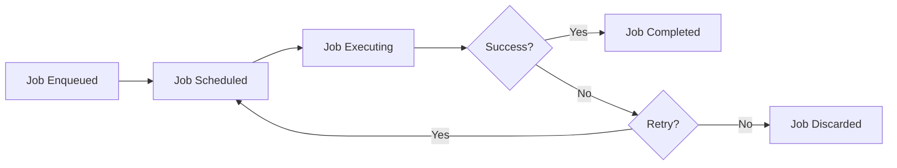
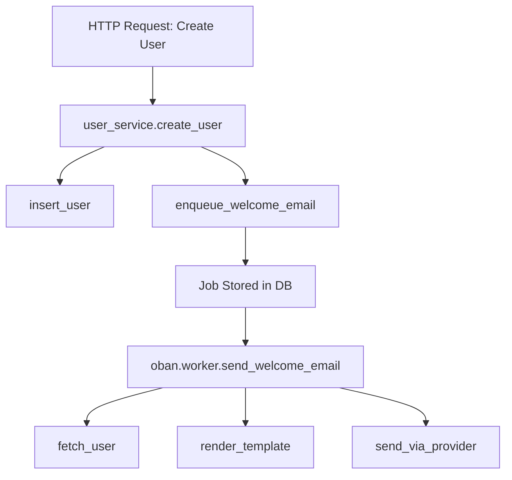

# How to Trace Oban Job Processing with OpenTelemetry in Elixir

Author: [nawazdhandala](https://www.github.com/nawazdhandala)

Tags: OpenTelemetry, Elixir, Oban, Job Processing, Background Jobs

Description: Implement comprehensive OpenTelemetry tracing for Oban background jobs to monitor job execution, retries, and performance in Elixir applications.

Oban has become the de facto standard for background job processing in Elixir applications. It leverages PostgreSQL for reliable job scheduling, execution, and monitoring. While Oban provides excellent built-in observability through its dashboard and telemetry events, integrating OpenTelemetry adds distributed tracing capabilities that connect background jobs to the requests that enqueued them.

## Why Trace Background Jobs

Background jobs often represent critical business operations: sending emails, processing payments, generating reports, or syncing data to external systems. When these jobs fail or run slowly, understanding the root cause requires more than just error logs. Distributed tracing connects jobs to their originating requests, showing the complete context of what triggered the work and how long each step took.

Without tracing, debugging job failures means piecing together disconnected logs. Did the job fail because of bad input data? A downstream service timeout? Database contention? Traces answer these questions by showing the entire execution path, including all external calls and their performance characteristics.

## Oban's Architecture and Tracing Points

Oban's job lifecycle provides natural boundaries for instrumentation:



Each stage can be traced: enqueuing captures the context of what triggered the job, execution traces the actual work performed, and retries show how jobs recover from transient failures.

## Setting Up Oban with OpenTelemetry

Add required dependencies to your project:

```elixir
defp deps do
  [
    {:oban, "~> 2.15"},
    {:opentelemetry, "~> 1.3"},
    {:opentelemetry_api, "~> 1.2"},
    {:opentelemetry_exporter, "~> 1.6"}
  ]
end
```

Configure Oban and OpenTelemetry in your application:

```elixir
# config/config.exs
import Config

config :my_app, Oban,
  repo: MyApp.Repo,
  plugins: [
    Oban.Plugins.Pruner,
    {Oban.Plugins.Cron, crontab: [
      {"0 2 * * *", MyApp.Workers.DailyReportWorker}
    ]}
  ],
  queues: [default: 10, mailers: 20, events: 50]

config :opentelemetry, :resource,
  service: [
    name: "my-app-workers",
    version: "1.0.0"
  ]

config :opentelemetry_exporter,
  otlp_protocol: :http_protobuf,
  otlp_endpoint: "http://localhost:4318"
```

## Instrumenting Job Enqueuing

Capture trace context when enqueuing jobs:

```elixir
defmodule MyApp.UserService do
  require OpenTelemetry.Tracer, as: Tracer
  alias MyApp.Workers.SendWelcomeEmailWorker

  def create_user(attrs) do
    Tracer.with_span "user_service.create_user" do
      Tracer.set_attributes([
        {"operation", "create_user"},
        {"user_email", attrs[:email]}
      ])

      case insert_user(attrs) do
        {:ok, user} ->
          # Enqueue welcome email job with trace context
          enqueue_welcome_email(user)

          Tracer.set_status(:ok)
          {:ok, user}

        {:error, changeset} ->
          Tracer.set_status(:error, "User creation failed")
          {:error, changeset}
      end
    end
  end

  defp enqueue_welcome_email(user) do
    Tracer.with_span "user_service.enqueue_welcome_email" do
      Tracer.set_attributes([
        {"user_id", user.id},
        {"job_worker", "SendWelcomeEmailWorker"},
        {"queue", "mailers"}
      ])

      # Capture current trace context
      trace_context = serialize_trace_context()

      job_args = %{
        "user_id" => user.id,
        "email" => user.email,
        "trace_context" => trace_context
      }

      case SendWelcomeEmailWorker.new(job_args)
           |> Oban.insert() do
        {:ok, job} ->
          Tracer.add_event("job_enqueued", %{
            job_id: job.id,
            scheduled_at: job.scheduled_at
          })
          Tracer.set_status(:ok)
          {:ok, job}

        {:error, changeset} ->
          Tracer.set_status(:error, "Failed to enqueue job")
          {:error, changeset}
      end
    end
  end

  defp serialize_trace_context do
    headers = []
    injected = :otel_propagator_text_map.inject(headers)
    Map.new(injected)
  end

  defp insert_user(attrs) do
    # User creation logic
    {:ok, %{id: 1, email: attrs[:email]}}
  end
end
```

## Creating a Base Worker with Tracing

Build a reusable base module for traced workers:

```elixir
defmodule MyApp.TracedWorker do
  @moduledoc """
  Base module for Oban workers with automatic OpenTelemetry tracing.
  """

  defmacro __using__(_opts) do
    quote do
      use Oban.Worker
      require OpenTelemetry.Tracer, as: Tracer
      alias OpenTelemetry.Ctx

      @impl Oban.Worker
      def perform(%Oban.Job{} = job) do
        # Extract and attach trace context from job args
        parent_ctx = extract_trace_context(job.args)
        Ctx.attach(parent_ctx)

        # Create a span for this job execution
        Tracer.with_span worker_span_name() do
          set_job_attributes(job)

          try do
            result = execute(job)

            Tracer.set_status(:ok)
            result

          rescue
            error ->
              handle_job_error(job, error, __STACKTRACE__)
              reraise error, __STACKTRACE__
          end
        end
      end

      # Must be implemented by workers
      def execute(job)

      defp worker_span_name do
        module_name = __MODULE__ |> to_string() |> String.split(".") |> List.last()
        "oban.worker.#{Macro.underscore(module_name)}"
      end

      defp set_job_attributes(job) do
        Tracer.set_attributes([
          {"oban.job_id", job.id},
          {"oban.queue", job.queue},
          {"oban.worker", job.worker},
          {"oban.attempt", job.attempt},
          {"oban.max_attempts", job.max_attempts},
          {"oban.priority", job.priority},
          {"oban.inserted_at", DateTime.to_iso8601(job.inserted_at)},
          {"oban.scheduled_at", DateTime.to_iso8601(job.scheduled_at)}
        ])

        # Add custom tags if present
        if job.tags && length(job.tags) > 0 do
          Tracer.set_attribute("oban.tags", Enum.join(job.tags, ","))
        end
      end

      defp extract_trace_context(args) do
        case args["trace_context"] do
          nil ->
            # No parent context available
            Ctx.new()

          context_map when is_map(context_map) ->
            # Restore context from job args
            headers = Map.to_list(context_map)
            :otel_propagator_text_map.extract(headers)

          _ ->
            Ctx.new()
        end
      end

      defp handle_job_error(job, error, stacktrace) do
        Tracer.set_status(:error, Exception.message(error))
        Tracer.record_exception(error, stacktrace)

        Tracer.set_attributes([
          {"oban.error", true},
          {"oban.error_type", error.__struct__},
          {"oban.will_retry", job.attempt < job.max_attempts}
        ])

        if job.attempt >= job.max_attempts do
          Tracer.add_event("job_discarded", %{
            reason: "max_attempts_reached",
            attempts: job.attempt
          })
        else
          Tracer.add_event("job_retry_scheduled", %{
            next_attempt: job.attempt + 1
          })
        end
      end

      defoverridable execute: 1
    end
  end
end
```

## Implementing Traced Workers

Use the base worker to create traced job implementations:

```elixir
defmodule MyApp.Workers.SendWelcomeEmailWorker do
  use MyApp.TracedWorker

  @impl true
  def execute(job) do
    %{"user_id" => user_id, "email" => email} = job.args

    Tracer.set_attributes([
      {"user_id", user_id},
      {"email", email}
    ])

    # Fetch user data
    user = fetch_user_data(user_id)

    # Render email template
    email_content = render_welcome_email(user)

    # Send via email service
    send_email(email, email_content)

    :ok
  end

  defp fetch_user_data(user_id) do
    Tracer.with_span "send_welcome_email.fetch_user" do
      Tracer.set_attributes([{"user_id", user_id}])

      case MyApp.Repo.get(MyApp.User, user_id) do
        nil ->
          Tracer.set_status(:error, "User not found")
          raise "User #{user_id} not found"

        user ->
          Tracer.set_status(:ok)
          user
      end
    end
  end

  defp render_welcome_email(user) do
    Tracer.with_span "send_welcome_email.render_template" do
      Tracer.set_attributes([
        {"template", "welcome_email"},
        {"user_name", user.name}
      ])

      # Template rendering logic
      %{
        subject: "Welcome to MyApp!",
        body: "Hello #{user.name}, welcome to our platform!"
      }
    end
  end

  defp send_email(to_address, content) do
    Tracer.with_span "send_welcome_email.send_via_provider" do
      Tracer.set_attributes([
        {"email_to", to_address},
        {"email_subject", content.subject},
        {"provider", "sendgrid"}
      ])

      # Call email service API
      case EmailProvider.send(to_address, content) do
        {:ok, message_id} ->
          Tracer.add_event("email_sent", %{message_id: message_id})
          Tracer.set_status(:ok)
          :ok

        {:error, reason} ->
          Tracer.set_status(:error, inspect(reason))
          raise "Email sending failed: #{inspect(reason)}"
      end
    end
  end
end
```

## Tracing Long-Running Jobs

For jobs that perform multiple operations, create child spans to show detailed breakdowns:

```elixir
defmodule MyApp.Workers.GenerateReportWorker do
  use MyApp.TracedWorker

  @impl true
  def execute(job) do
    %{"report_type" => report_type, "date_range" => date_range} = job.args

    Tracer.set_attributes([
      {"report_type", report_type},
      {"date_range", inspect(date_range)}
    ])

    # Each major operation gets its own span
    data = collect_report_data(report_type, date_range)
    analyzed = analyze_data(data)
    formatted = format_report(analyzed)
    url = upload_report(formatted)
    notify_completion(job.args["user_id"], url)

    :ok
  end

  defp collect_report_data(report_type, date_range) do
    Tracer.with_span "generate_report.collect_data" do
      Tracer.set_attributes([
        {"report_type", report_type},
        {"start_date", date_range["start"]},
        {"end_date", date_range["end"]}
      ])

      # Collect data from various sources
      users_data = fetch_users_data(date_range)
      events_data = fetch_events_data(date_range)
      metrics_data = fetch_metrics_data(date_range)

      Tracer.set_attributes([
        {"users_count", length(users_data)},
        {"events_count", length(events_data)},
        {"metrics_count", length(metrics_data)}
      ])

      %{users: users_data, events: events_data, metrics: metrics_data}
    end
  end

  defp analyze_data(data) do
    Tracer.with_span "generate_report.analyze" do
      Tracer.add_event("analysis_started")

      # Perform analysis
      analyzed = %{
        summary: calculate_summary(data),
        trends: calculate_trends(data),
        insights: generate_insights(data)
      }

      Tracer.add_event("analysis_completed")
      analyzed
    end
  end

  defp format_report(analyzed) do
    Tracer.with_span "generate_report.format" do
      # Format as PDF or HTML
      formatted = build_report_document(analyzed)

      Tracer.set_attributes([
        {"format", "pdf"},
        {"size_bytes", byte_size(formatted)}
      ])

      formatted
    end
  end

  defp upload_report(report) do
    Tracer.with_span "generate_report.upload" do
      # Upload to S3 or similar
      url = "https://storage.example.com/reports/#{UUID.uuid4()}.pdf"

      Tracer.set_attributes([
        {"storage_provider", "s3"},
        {"report_url", url}
      ])

      url
    end
  end

  defp notify_completion(user_id, report_url) do
    Tracer.with_span "generate_report.notify" do
      Tracer.set_attributes([
        {"user_id", user_id},
        {"notification_type", "email"}
      ])

      # Send notification
      :ok
    end
  end

  # Stub implementations
  defp fetch_users_data(_date_range), do: []
  defp fetch_events_data(_date_range), do: []
  defp fetch_metrics_data(_date_range), do: []
  defp calculate_summary(_data), do: %{}
  defp calculate_trends(_data), do: %{}
  defp generate_insights(_data), do: %{}
  defp build_report_document(_analyzed), do: "PDF_CONTENT"
end
```

## Handling Job Dependencies

When jobs enqueue other jobs, propagate trace context to maintain the chain:

```elixir
defmodule MyApp.Workers.BatchProcessingWorker do
  use MyApp.TracedWorker
  alias MyApp.Workers.ProcessItemWorker

  @impl true
  def execute(job) do
    %{"batch_id" => batch_id, "item_ids" => item_ids} = job.args

    Tracer.set_attributes([
      {"batch_id", batch_id},
      {"items_count", length(item_ids)}
    ])

    # Capture current trace context for child jobs
    trace_context = serialize_trace_context()

    # Enqueue individual item processing jobs
    child_jobs = Enum.map(item_ids, fn item_id ->
      ProcessItemWorker.new(%{
        "batch_id" => batch_id,
        "item_id" => item_id,
        "trace_context" => trace_context
      })
    end)

    case Oban.insert_all(child_jobs) do
      {:ok, jobs} ->
        Tracer.add_event("child_jobs_enqueued", %{
          count: length(jobs)
        })
        Tracer.set_status(:ok)
        :ok

      {:error, reason} ->
        Tracer.set_status(:error, inspect(reason))
        {:error, reason}
    end
  end

  defp serialize_trace_context do
    headers = []
    injected = :otel_propagator_text_map.inject(headers)
    Map.new(injected)
  end
end
```

## Monitoring Oban with Telemetry

Attach telemetry handlers to track Oban events alongside OpenTelemetry:

```elixir
defmodule MyApp.ObanTelemetry do
  require Logger

  def attach_handlers do
    events = [
      [:oban, :job, :start],
      [:oban, :job, :stop],
      [:oban, :job, :exception],
      [:oban, :circuit, :trip],
      [:oban, :circuit, :open]
    ]

    :telemetry.attach_many(
      "oban-opentelemetry-handler",
      events,
      &handle_event/4,
      nil
    )
  end

  def handle_event(
        [:oban, :job, :start],
        _measurements,
        %{job: job},
        _config
      ) do
    Logger.debug("Oban job started: #{job.worker} (#{job.id})")
  end

  def handle_event(
        [:oban, :job, :stop],
        %{duration: duration, queue_time: queue_time},
        %{job: job},
        _config
      ) do
    duration_ms = System.convert_time_unit(duration, :native, :millisecond)
    queue_time_ms = System.convert_time_unit(queue_time, :native, :millisecond)

    Logger.info(
      "Oban job completed: #{job.worker} (#{job.id}) in #{duration_ms}ms " <>
      "(queued for #{queue_time_ms}ms)"
    )

    # Emit custom metrics
    :telemetry.execute(
      [:my_app, :oban, :job_completed],
      %{duration: duration_ms, queue_time: queue_time_ms},
      %{worker: job.worker, queue: job.queue}
    )
  end

  def handle_event(
        [:oban, :job, :exception],
        %{duration: duration},
        %{job: job, kind: kind, reason: reason, stacktrace: stacktrace},
        _config
      ) do
    Logger.error(
      "Oban job failed: #{job.worker} (#{job.id}) - #{kind}: #{inspect(reason)}"
    )

    # Emit error metric
    :telemetry.execute(
      [:my_app, :oban, :job_failed],
      %{count: 1},
      %{worker: job.worker, queue: job.queue, kind: kind}
    )
  end

  def handle_event(
        [:oban, :circuit, :trip],
        _measurements,
        %{name: name, error: error},
        _config
      ) do
    Logger.warning("Oban circuit breaker tripped: #{name} - #{inspect(error)}")
  end

  def handle_event(
        [:oban, :circuit, :open],
        _measurements,
        %{name: name},
        _config
      ) do
    Logger.error("Oban circuit breaker opened: #{name}")
  end
end
```

Initialize telemetry in your application:

```elixir
defmodule MyApp.Application do
  use Application

  def start(_type, _args) do
    # Set up telemetry before starting supervision tree
    MyApp.ObanTelemetry.attach_handlers()

    children = [
      MyApp.Repo,
      {Oban, Application.fetch_env!(:my_app, Oban)}
    ]

    opts = [strategy: :one_for_one, name: MyApp.Supervisor]
    Supervisor.start_link(children, opts)
  end
end
```

## Visualizing Job Traces

A complete trace for a background job shows the full journey:



This trace connects the original HTTP request through the job execution, making it easy to debug issues that span both synchronous and asynchronous processing.

## Testing Workers with Traces

Write tests that verify tracing behavior:

```elixir
defmodule MyApp.Workers.SendWelcomeEmailWorkerTest do
  use MyApp.DataCase
  use Oban.Testing, repo: MyApp.Repo
  require OpenTelemetry.Tracer, as: Tracer

  alias MyApp.Workers.SendWelcomeEmailWorker

  test "traces job execution" do
    # Start a test trace
    Tracer.with_span "test.welcome_email_job" do
      # Create job with trace context
      trace_context = serialize_trace_context()

      job_args = %{
        "user_id" => 123,
        "email" => "test@example.com",
        "trace_context" => trace_context
      }

      # Execute job synchronously
      assert :ok = perform_job(SendWelcomeEmailWorker, job_args)

      # Verify spans were created
      # In real tests, you'd query your observability backend
    end
  end

  defp serialize_trace_context do
    headers = []
    injected = :otel_propagator_text_map.inject(headers)
    Map.new(injected)
  end
end
```

## Performance Considerations

For high-volume job processing, consider sampling:

```elixir
defmodule MyApp.SampledTracedWorker do
  defmacro __using__(opts) do
    sample_rate = Keyword.get(opts, :sample_rate, 1.0)

    quote do
      use Oban.Worker
      require OpenTelemetry.Tracer, as: Tracer

      @sample_rate unquote(sample_rate)

      @impl Oban.Worker
      def perform(%Oban.Job{} = job) do
        if should_trace?(job) do
          # Full tracing
          trace_job_execution(job)
        else
          # Execute without tracing overhead
          execute(job)
        end
      end

      defp should_trace?(job) do
        # Always trace jobs that are retrying (they're interesting)
        if job.attempt > 1 do
          true
        else
          # Sample based on configured rate
          :rand.uniform() < @sample_rate
        end
      end

      defp trace_job_execution(job) do
        parent_ctx = extract_trace_context(job.args)
        OpenTelemetry.Ctx.attach(parent_ctx)

        Tracer.with_span "oban.worker.#{worker_name()}" do
          set_job_attributes(job)
          execute(job)
        end
      end

      def execute(job)

      defp worker_name, do: __MODULE__ |> to_string() |> String.split(".") |> List.last()
      defp set_job_attributes(_job), do: :ok
      defp extract_trace_context(_args), do: OpenTelemetry.Ctx.new()

      defoverridable execute: 1
    end
  end
end
```

Tracing Oban jobs with OpenTelemetry provides end-to-end visibility into your background processing infrastructure. You can track job latency from enqueue to completion, debug failures with full context, and understand how jobs interact with external services. This observability is essential for maintaining reliable background job processing in production Elixir applications.
