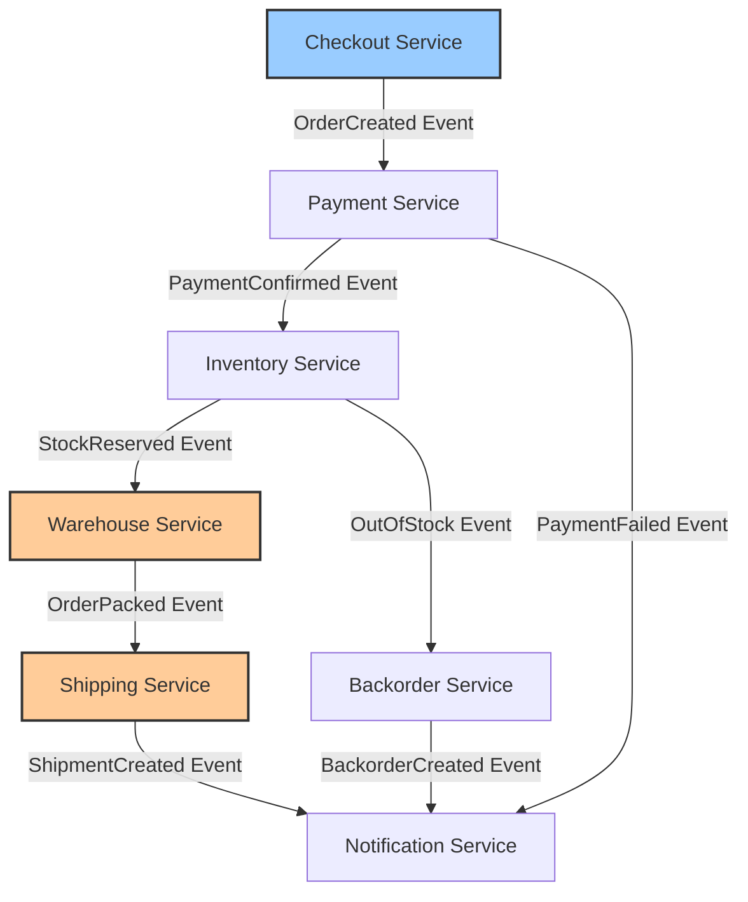

# How to Trace Order Fulfillment Across Microservices with OpenTelemetry

Author: [nawazdhandala](https://www.github.com/nawazdhandala)

Tags: OpenTelemetry, Distributed Tracing, Microservices, Order Fulfillment, E-Commerce, Observability

Description: Learn how to implement distributed tracing across an order fulfillment pipeline using OpenTelemetry to track orders from checkout to delivery.

---

An order placed on an e-commerce platform touches a surprising number of services before it reaches the customer's doorstep. The checkout service validates the cart. The payment service charges the card. The inventory service reserves stock. The warehouse service picks and packs the items. The shipping service generates a label and hands off to a carrier. And the notification service sends emails at every step.

When something goes wrong and an order is stuck, the first question is always the same: where did it get stuck? Without distributed tracing, answering that question means manually correlating logs across six or more services, matching timestamps, and hoping the order ID was logged consistently everywhere.

OpenTelemetry solves this by propagating a trace context through every service in the fulfillment pipeline. A single trace ID follows the order from checkout to delivery confirmation, and each service contributes spans that show exactly what happened and how long it took.

## The Order Fulfillment Architecture

A typical order fulfillment pipeline looks something like this:



Each arrow represents an asynchronous message (typically through a message broker like Kafka or RabbitMQ). The challenge with tracing across message brokers is that standard HTTP header propagation does not work. You need to explicitly inject and extract trace context from message headers.

## Starting the Trace at Checkout

The checkout service creates the root span for the entire order journey. This span becomes the parent for everything that follows:

```python
# checkout_service.py
# Create the root trace for an order fulfillment journey

from opentelemetry import trace, context
from opentelemetry.trace.propagation import TraceContextTextMapPropagator

tracer = trace.get_tracer("checkout-service", "3.0.0")
propagator = TraceContextTextMapPropagator()

def place_order(cart, customer_id):
    """Place an order and start the distributed trace."""

    with tracer.start_as_current_span("place_order") as span:
        # Set attributes that will help identify this order in traces
        order_id = generate_order_id()
        span.set_attribute("order.id", order_id)
        span.set_attribute("order.customer_id", customer_id)
        span.set_attribute("order.item_count", len(cart.items))
        span.set_attribute("order.total_cents", cart.total_cents)
        span.set_attribute("order.currency", cart.currency)

        # Validate the cart contents
        with tracer.start_as_current_span("validate_cart") as validate_span:
            validation = validate_cart_items(cart)
            validate_span.set_attribute("validation.passed", validation.is_valid)
            if not validation.is_valid:
                validate_span.set_attribute("validation.error", validation.error)
                span.set_status(trace.StatusCode.ERROR, "Cart validation failed")
                return OrderResult(status="failed", reason=validation.error)

        # Create the order record
        order = create_order_record(order_id, cart, customer_id)

        # Inject trace context into the message headers
        # so downstream services can continue the same trace
        message_headers = {}
        propagator.inject(message_headers)

        # Publish the OrderCreated event with trace context
        publish_event("order.created", {
            "order_id": order_id,
            "cart": cart.to_dict(),
            "customer_id": customer_id,
        }, headers=message_headers)

        span.add_event("order_created_event_published")
        return OrderResult(status="pending", order_id=order_id)
```

The critical line is `propagator.inject(message_headers)`. This takes the current span's trace context (the trace ID, span ID, and trace flags) and serializes it into a dictionary that gets attached to the message. Without this step, the downstream services would start entirely new traces, and you would lose the end-to-end visibility.

## Continuing the Trace in Downstream Services

Each downstream service extracts the trace context from the incoming message and creates a child span that links back to the parent:

```python
# payment_service.py
# Continue the order trace when processing payment

from opentelemetry import trace, context
from opentelemetry.trace.propagation import TraceContextTextMapPropagator

tracer = trace.get_tracer("payment-service", "2.0.0")
propagator = TraceContextTextMapPropagator()

def handle_order_created(message):
    """Process an OrderCreated event and continue the distributed trace."""

    # Extract the trace context from message headers
    # This links our span back to the checkout service's trace
    parent_context = propagator.extract(carrier=message.headers)

    # Start a new span within the extracted context
    with tracer.start_as_current_span(
        "process_payment",
        context=parent_context,
    ) as span:
        order_id = message.body["order_id"]
        span.set_attribute("order.id", order_id)
        span.set_attribute("service.operation", "charge")

        # Call the payment gateway
        with tracer.start_as_current_span("charge_gateway") as gateway_span:
            result = payment_gateway.charge(
                amount=message.body["cart"]["total_cents"],
                currency=message.body["cart"]["currency"],
                customer_id=message.body["customer_id"],
            )
            gateway_span.set_attribute("payment.gateway", "stripe")
            gateway_span.set_attribute("payment.status", result.status)
            gateway_span.set_attribute("payment.transaction_id", result.transaction_id)

        if result.status == "success":
            # Inject context for the next service in the chain
            next_headers = {}
            propagator.inject(next_headers)

            publish_event("payment.confirmed", {
                "order_id": order_id,
                "transaction_id": result.transaction_id,
            }, headers=next_headers)

            span.add_event("payment_confirmed_event_published")
        else:
            publish_event("payment.failed", {
                "order_id": order_id,
                "reason": result.decline_code,
            }, headers=next_headers)

            span.set_status(trace.StatusCode.ERROR, "Payment declined")
```

The extract-process-inject pattern repeats at every service boundary. Each service extracts the context from the incoming message, does its work under that context, and injects the context into any outgoing messages.

## Tracing Through the Warehouse

The warehouse service is where physical operations meet digital tracing. Picking and packing an order takes minutes or hours, not milliseconds. This requires a different approach to span creation:

```python
# warehouse_service.py
# Trace warehouse operations with long-running spans

from opentelemetry import trace
from opentelemetry.trace.propagation import TraceContextTextMapPropagator
from opentelemetry.trace import Link

tracer = trace.get_tracer("warehouse-service", "1.5.0")
propagator = TraceContextTextMapPropagator()

def handle_stock_reserved(message):
    """Begin warehouse fulfillment for a reserved order."""

    parent_context = propagator.extract(carrier=message.headers)

    with tracer.start_as_current_span(
        "warehouse_fulfillment",
        context=parent_context,
    ) as span:
        order_id = message.body["order_id"]
        span.set_attribute("order.id", order_id)
        span.set_attribute("warehouse.location", "warehouse-east-1")

        # Record the pick list generation
        with tracer.start_as_current_span("generate_pick_list") as pick_span:
            pick_list = generate_pick_list(order_id)
            pick_span.set_attribute("pick_list.item_count", len(pick_list.items))
            pick_span.set_attribute("pick_list.zone_count", len(pick_list.zones))

        # Assign to a warehouse worker
        # The actual picking happens asynchronously when the worker scans items
        assign_to_worker(order_id, pick_list)
        span.add_event("pick_list_assigned", {
            "worker_id": pick_list.assigned_worker,
        })


def handle_item_scanned(scan_event):
    """Record each item scan as a span event on the fulfillment trace.

    Rather than creating a new span for each scan (which would be
    too granular), we record scan events on the existing fulfillment
    span using span links.
    """
    # Retrieve the stored trace context for this order
    stored_context = get_stored_trace_context(scan_event.order_id)
    parent_context = propagator.extract(carrier=stored_context)

    with tracer.start_as_current_span(
        "item_scanned",
        context=parent_context,
    ) as span:
        span.set_attribute("order.id", scan_event.order_id)
        span.set_attribute("item.sku", scan_event.sku)
        span.set_attribute("item.quantity", scan_event.quantity)
        span.set_attribute("scan.worker_id", scan_event.worker_id)
        span.set_attribute("scan.zone", scan_event.zone)


def handle_order_packed(pack_event):
    """Record packing completion and forward to shipping."""

    stored_context = get_stored_trace_context(pack_event.order_id)
    parent_context = propagator.extract(carrier=stored_context)

    with tracer.start_as_current_span(
        "order_packed",
        context=parent_context,
    ) as span:
        span.set_attribute("order.id", pack_event.order_id)
        span.set_attribute("package.weight_grams", pack_event.weight_grams)
        span.set_attribute("package.dimensions", pack_event.dimensions)
        span.set_attribute("package.box_type", pack_event.box_type)

        # Forward to shipping with trace context
        next_headers = {}
        propagator.inject(next_headers)

        publish_event("order.packed", {
            "order_id": pack_event.order_id,
            "weight_grams": pack_event.weight_grams,
            "dimensions": pack_event.dimensions,
        }, headers=next_headers)
```

The warehouse service introduces a pattern you will see in any long-running process: storing the trace context and retrieving it later. When a warehouse worker scans an item 20 minutes after the order was assigned, the system needs to look up the original trace context so the scan event appears in the same trace.

A simple way to handle this is to store the serialized trace context alongside the order record in your database:

```python
# trace_context_store.py
# Persist and retrieve trace context for long-running operations

from opentelemetry.trace.propagation import TraceContextTextMapPropagator

propagator = TraceContextTextMapPropagator()

def store_trace_context(order_id: str):
    """Save the current trace context for later retrieval."""
    headers = {}
    propagator.inject(headers)

    # Store in your order database alongside the order record
    db.execute(
        "UPDATE orders SET trace_context = %s WHERE order_id = %s",
        (json.dumps(headers), order_id)
    )

def get_stored_trace_context(order_id: str) -> dict:
    """Retrieve a previously stored trace context."""
    row = db.execute(
        "SELECT trace_context FROM orders WHERE order_id = %s",
        (order_id,)
    ).fetchone()

    return json.loads(row["trace_context"]) if row else {}
```

## Configuring the Collector for Order Tracing

The collector needs to handle telemetry from all the services in the fulfillment pipeline. Use a tail-based sampling strategy to keep complete traces for orders that experienced errors or high latency:

```yaml
# otel-collector-orders.yaml
# Collector configuration optimized for order fulfillment tracing

receivers:
  otlp:
    protocols:
      grpc:
        endpoint: 0.0.0.0:4317
      http:
        endpoint: 0.0.0.0:4318

processors:
  # Group spans by trace ID so we can make sampling decisions
  # based on the complete trace
  groupbytrace:
    wait_duration: 30s
    num_traces: 100000

  # Tail-based sampling: keep traces that show problems
  tail_sampling:
    decision_wait: 30s
    policies:
      # Always keep traces with errors
      - name: error-traces
        type: status_code
        status_code:
          status_codes:
            - ERROR

      # Always keep slow traces (over 5 seconds end-to-end)
      - name: slow-traces
        type: latency
        latency:
          threshold_ms: 5000

      # Sample 10% of successful traces for baseline comparison
      - name: baseline-sample
        type: probabilistic
        probabilistic:
          sampling_percentage: 10

  # Add a resource attribute identifying the fulfillment pipeline
  resource:
    attributes:
      - key: pipeline.name
        value: "order-fulfillment"
        action: upsert

  batch:
    timeout: 5s
    send_batch_size: 512

exporters:
  otlp:
    endpoint: trace-backend.internal:4317
    tls:
      insecure: false
      ca_file: /etc/otel/tls/ca.crt

service:
  pipelines:
    traces:
      receivers: [otlp]
      processors: [groupbytrace, tail_sampling, resource, batch]
      exporters: [otlp]
```

The `groupbytrace` processor is important here. Order fulfillment traces can span minutes or hours, and spans from different services arrive at the collector in unpredictable order. The group-by-trace processor collects all spans belonging to the same trace before making a sampling decision.

The 30-second `decision_wait` means the collector waits 30 seconds after seeing the first span of a trace before deciding whether to keep or drop it. For very long-running fulfillment processes, you may need to increase this or use a two-phase approach where the warehouse stores its spans locally and forwards them in a batch when the order is packed.

## Building an Order Status Dashboard

With traces flowing through the pipeline, you can build a dashboard that shows order fulfillment health at a glance:

```python
# order_metrics.py
# Metrics for order fulfillment dashboarding

from opentelemetry import metrics

meter = metrics.get_meter("order-fulfillment", "1.0.0")

# Track time spent in each fulfillment stage
stage_duration = meter.create_histogram(
    name="order.stage.duration",
    description="Time spent in each stage of order fulfillment",
    unit="s",
)

# Count orders by current stage for a pipeline view
orders_in_stage = meter.create_up_down_counter(
    name="order.stage.active",
    description="Number of orders currently in each fulfillment stage",
)

# Track fulfillment completion rate
fulfillment_outcomes = meter.create_counter(
    name="order.fulfillment.outcomes",
    description="Order fulfillment outcomes by result type",
)

def record_stage_transition(order_id: str, from_stage: str, to_stage: str, duration_seconds: float):
    """Record an order moving from one fulfillment stage to another."""
    stage_duration.record(duration_seconds, {
        "stage": from_stage,
        "next_stage": to_stage,
    })

    orders_in_stage.add(-1, {"stage": from_stage})
    orders_in_stage.add(1, {"stage": to_stage})
```

These metrics feed a dashboard showing how many orders are in each stage, how long they spend there on average, and where bottlenecks form. When the warehouse stage suddenly shows a spike in duration, you know to investigate warehouse operations before customers start complaining about delayed shipments.

## Handling Trace Context Across Retries

Order fulfillment involves retries. Payment gateways time out. Inventory checks fail and get retried. Shipping label generation hits rate limits. Each retry should create a new span under the same trace, not start a new trace:

```python
# retry_handler.py
# Retry with trace context preservation

from opentelemetry import trace
import time

tracer = trace.get_tracer("retry-handler", "1.0.0")

def retry_with_tracing(operation_name, func, max_retries=3, backoff_base=1.0):
    """Execute a function with retries, recording each attempt as a span."""

    for attempt in range(1, max_retries + 1):
        with tracer.start_as_current_span(f"{operation_name}_attempt") as span:
            span.set_attribute("retry.attempt", attempt)
            span.set_attribute("retry.max_attempts", max_retries)

            try:
                result = func()
                span.set_attribute("retry.succeeded", True)
                return result

            except RetryableError as e:
                span.set_attribute("retry.succeeded", False)
                span.set_attribute("error.type", type(e).__name__)

                if attempt == max_retries:
                    span.set_status(trace.StatusCode.ERROR, "All retries exhausted")
                    raise

                # Exponential backoff
                delay = backoff_base * (2 ** (attempt - 1))
                span.set_attribute("retry.backoff_seconds", delay)
                span.add_event("waiting_before_retry", {"delay_seconds": delay})
                time.sleep(delay)
```

Each retry attempt appears as a separate span in the trace, making it immediately visible how many times an operation was retried and how long each attempt took.

## Conclusion

Distributed tracing across an order fulfillment pipeline turns an opaque, multi-service process into a transparent journey you can follow from checkout to delivery. The key patterns are consistent context propagation through message brokers using inject and extract, trace context storage for long-running warehouse operations, tail-based sampling to keep interesting traces while controlling costs, and stage-level metrics for operational dashboards.

When a customer asks "where is my order?" and the support team opens a trace, they should see every step the order took, how long each step took, and exactly where things went wrong if the order is delayed. That level of visibility is what OpenTelemetry's distributed tracing makes possible across even the most complex microservice architectures.
