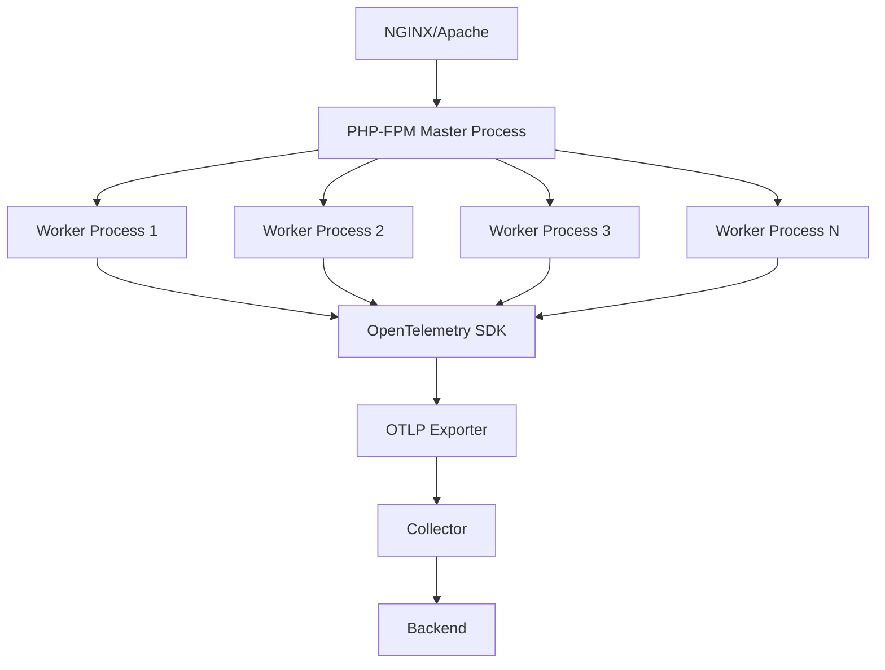

# How to Trace PHP-FPM Processes with OpenTelemetry

Author: [nawazdhandala](https://www.github.com/nawazdhandala)

Tags: OpenTelemetry, PHP, PHP-FPM, Process Monitoring, Tracing

Description: Learn how to instrument PHP-FPM processes with OpenTelemetry to monitor worker pool performance, trace request lifecycle, and identify process bottlenecks.

PHP-FPM (FastCGI Process Manager) is the de facto standard for running PHP applications in production. Understanding how requests flow through the FPM process pool and identifying performance bottlenecks at the process level is critical for maintaining healthy applications. OpenTelemetry provides the visibility needed to track worker utilization, queue times, and request lifecycles across your entire PHP-FPM infrastructure.

## Understanding PHP-FPM Architecture

PHP-FPM uses a master process that manages a pool of worker processes. Each worker handles one request at a time. When all workers are busy, new requests queue until a worker becomes available. This architecture means performance problems often manifest as worker starvation or slow request processing.



## Instrumenting at the Process Level

To trace PHP-FPM effectively, you need to capture data at multiple levels: process startup, request handling, and resource utilization. This requires hooking into both the FPM lifecycle and individual request execution.

Create a file called `otel-fpm-bootstrap.php` that will be loaded before every request:

```php
<?php
/**
 * OpenTelemetry PHP-FPM Bootstrap
 * This file should be loaded via php-fpm.conf auto_prepend_file directive
 */

require_once '/path/to/vendor/autoload.php';

use OpenTelemetry\API\Globals;
use OpenTelemetry\API\Trace\SpanKind;
use OpenTelemetry\API\Trace\StatusCode;
use OpenTelemetry\SDK\Trace\TracerProvider;
use OpenTelemetry\SDK\Trace\SpanProcessor\BatchSpanProcessor;
use OpenTelemetry\Contrib\Otlp\SpanExporter;
use OpenTelemetry\SDK\Resource\ResourceInfo;
use OpenTelemetry\SDK\Resource\ResourceInfoFactory;
use OpenTelemetry\SDK\Common\Attribute\Attributes;
use OpenTelemetry\SemConv\ResourceAttributes;

class PHPFPMTracer {
    private static $instance = null;
    private $tracer;
    private $requestSpan;
    private $processId;
    private $startTime;

    private function __construct() {
        $this->processId = getmypid();
        $this->startTime = microtime(true);
        $this->initializeTracer();
        $this->startRequestTrace();
    }

    public static function getInstance() {
        if (self::$instance === null) {
            self::$instance = new self();
        }
        return self::$instance;
    }

    private function initializeTracer() {
        // Gather PHP-FPM specific resource attributes
        $poolName = getenv('PHP_FPM_POOL') ?: 'default';
        $hostname = gethostname();

        $resource = ResourceInfoFactory::defaultResource()->merge(
            ResourceInfo::create(Attributes::create([
                ResourceAttributes::SERVICE_NAME => 'php-fpm',
                ResourceAttributes::SERVICE_VERSION => PHP_VERSION,
                ResourceAttributes::PROCESS_PID => $this->processId,
                ResourceAttributes::HOST_NAME => $hostname,
                'php.fpm.pool' => $poolName,
                'php.sapi' => php_sapi_name(),
            ]))
        );

        $exporter = new SpanExporter(
            \OpenTelemetry\Contrib\Otlp\HttpTransportFactory::create(
                getenv('OTEL_EXPORTER_OTLP_ENDPOINT') ?: 'http://localhost:4318/v1/traces',
                'application/json'
            )
        );

        // Use batch processor for better performance in high-throughput scenarios
        $tracerProvider = TracerProvider::builder()
            ->addSpanProcessor(new BatchSpanProcessor($exporter))
            ->setResource($resource)
            ->build();

        Globals::registerInitializer(fn() => $tracerProvider);
        $this->tracer = $tracerProvider->getTracer('php-fpm-instrumentation');
    }

    private function startRequestTrace() {
        $requestMethod = $_SERVER['REQUEST_METHOD'] ?? 'CLI';
        $requestUri = $_SERVER['REQUEST_URI'] ?? 'unknown';

        $this->requestSpan = $this->tracer
            ->spanBuilder("$requestMethod $requestUri")
            ->setSpanKind(SpanKind::KIND_SERVER)
            ->setAttribute('http.method', $requestMethod)
            ->setAttribute('http.url', $requestUri)
            ->setAttribute('http.scheme', $_SERVER['REQUEST_SCHEME'] ?? 'http')
            ->setAttribute('http.host', $_SERVER['HTTP_HOST'] ?? 'unknown')
            ->setAttribute('http.target', $requestUri)
            ->setAttribute('net.peer.ip', $_SERVER['REMOTE_ADDR'] ?? 'unknown')
            ->setAttribute('php.fpm.process.id', $this->processId)
            ->setAttribute('php.fpm.process.start_time', $this->startTime)
            ->startSpan();

        $this->requestSpan->activate();

        // Register shutdown function to end the span
        register_shutdown_function([$this, 'endRequestTrace']);
    }

    public function endRequestTrace() {
        if ($this->requestSpan) {
            $endTime = microtime(true);
            $duration = $endTime - $this->startTime;

            // Capture final request metrics
            $this->requestSpan
                ->setAttribute('http.status_code', http_response_code())
                ->setAttribute('php.memory.peak', memory_get_peak_usage(true))
                ->setAttribute('php.memory.current', memory_get_usage(true))
                ->setAttribute('php.duration', $duration)
                ->setAttribute('php.opcache.enabled', function_exists('opcache_get_status'))
                ->setStatus(StatusCode::STATUS_OK)
                ->end();
        }
    }

    public function traceFunction(string $functionName, callable $function, array $attributes = []) {
        $span = $this->tracer
            ->spanBuilder($functionName)
            ->setSpanKind(SpanKind::KIND_INTERNAL);

        foreach ($attributes as $key => $value) {
            $span->setAttribute($key, $value);
        }

        $span = $span->startSpan();
        $scope = $span->activate();

        try {
            $result = $function();
            $span->setStatus(StatusCode::STATUS_OK);
            return $result;
        } catch (\Throwable $e) {
            $span
                ->recordException($e)
                ->setStatus(StatusCode::STATUS_ERROR, $e->getMessage());
            throw $e;
        } finally {
            $span->end();
            $scope->detach();
        }
    }
}

// Initialize the tracer for this request
PHPFPMTracer::getInstance();
```

## Configuring PHP-FPM to Load the Bootstrap File

Modify your PHP-FPM pool configuration (typically in `/etc/php/8.x/fpm/pool.d/www.conf`):

```ini
[www]
; Existing configuration...

; Auto-prepend the OpenTelemetry bootstrap file to every request
php_admin_value[auto_prepend_file] = /var/www/otel-fpm-bootstrap.php

; Set environment variables for OpenTelemetry
env[OTEL_EXPORTER_OTLP_ENDPOINT] = http://localhost:4318/v1/traces
env[PHP_FPM_POOL] = www
env[OTEL_SERVICE_NAME] = php-fpm-www

; Increase process priority for monitoring (optional)
process_priority = -10
```

Restart PHP-FPM to apply changes:

```bash
sudo systemctl restart php8.2-fpm
```

## Monitoring Worker Pool Utilization

To understand worker pool health, collect metrics about process state. Create a monitoring script that runs periodically:

```php
<?php
/**
 * PHP-FPM Process Pool Monitor
 * Run this via cron every minute to export worker pool metrics
 */

require_once '/path/to/vendor/autoload.php';

use OpenTelemetry\API\Globals;
use OpenTelemetry\SDK\Metrics\MeterProvider;
use OpenTelemetry\SDK\Metrics\MetricExporter\ConsoleMetricExporter;
use OpenTelemetry\SDK\Resource\ResourceInfoFactory;

class FPMPoolMonitor {
    private $meter;

    public function __construct() {
        $resource = ResourceInfoFactory::defaultResource();
        $meterProvider = new MeterProvider($resource);
        $this->meter = $meterProvider->getMeter('php-fpm-pool-monitor');
    }

    public function collectMetrics() {
        $poolStatus = $this->getFPMStatus();

        if (!$poolStatus) {
            return;
        }

        // Create observable gauges for pool metrics
        $activeProcesses = $this->meter->createObservableGauge(
            'php.fpm.processes.active',
            'Number of active PHP-FPM processes',
            'processes'
        );

        $idleProcesses = $this->meter->createObservableGauge(
            'php.fpm.processes.idle',
            'Number of idle PHP-FPM processes',
            'processes'
        );

        $queuedRequests = $this->meter->createObservableGauge(
            'php.fpm.requests.queued',
            'Number of queued requests',
            'requests'
        );

        $maxActiveProcesses = $this->meter->createObservableGauge(
            'php.fpm.processes.max_active',
            'Maximum active processes reached',
            'processes'
        );

        // Register callbacks to provide metric values
        $activeProcesses->observe(function() use ($poolStatus) {
            return $poolStatus['active-processes'];
        });

        $idleProcesses->observe(function() use ($poolStatus) {
            return $poolStatus['idle-processes'];
        });

        $queuedRequests->observe(function() use ($poolStatus) {
            return $poolStatus['listen-queue'];
        });

        $maxActiveProcesses->observe(function() use ($poolStatus) {
            return $poolStatus['max-active-processes'];
        });
    }

    private function getFPMStatus() {
        // Parse PHP-FPM status page (requires pm.status_path configured)
        $statusUrl = 'http://localhost/fpm-status?json';

        $ch = curl_init($statusUrl);
        curl_setopt($ch, CURLOPT_RETURNTRANSFER, true);
        curl_setopt($ch, CURLOPT_TIMEOUT, 2);

        $response = curl_exec($ch);
        $httpCode = curl_getinfo($ch, CURLINFO_HTTP_CODE);
        curl_close($ch);

        if ($httpCode !== 200) {
            error_log("Failed to fetch PHP-FPM status: HTTP $httpCode");
            return null;
        }

        return json_decode($response, true);
    }
}

$monitor = new FPMPoolMonitor();
$monitor->collectMetrics();
```

Enable the PHP-FPM status page by adding to your pool configuration:

```ini
pm.status_path = /fpm-status
```

And configure NGINX to expose it:

```nginx
location /fpm-status {
    access_log off;
    allow 127.0.0.1;
    deny all;
    include fastcgi_params;
    fastcgi_pass unix:/var/run/php/php8.2-fpm.sock;
    fastcgi_param SCRIPT_FILENAME $document_root$fastcgi_script_name;
}
```

## Tracing Slow Requests

Identify slow requests by adding custom instrumentation for critical sections:

```php
<?php
// In your application code
$tracer = PHPFPMTracer::getInstance();

// Trace database operations
$tracer->traceFunction('database.query', function() use ($pdo, $sql) {
    return $pdo->query($sql);
}, [
    'db.system' => 'mysql',
    'db.statement' => $sql,
]);

// Trace external API calls
$tracer->traceFunction('external.api.call', function() use ($url) {
    return file_get_contents($url);
}, [
    'http.url' => $url,
    'http.method' => 'GET',
]);

// Trace cache operations
$tracer->traceFunction('cache.get', function() use ($redis, $key) {
    return $redis->get($key);
}, [
    'cache.system' => 'redis',
    'cache.key' => $key,
]);
```

## Analyzing Process Lifecycle

Track how long individual PHP-FPM processes have been running and how many requests they've handled. This helps identify memory leaks or process degradation:

```php
<?php
// Add to otel-fpm-bootstrap.php

// Track requests handled by this process
if (!isset($_ENV['PROCESS_REQUEST_COUNT'])) {
    $_ENV['PROCESS_REQUEST_COUNT'] = 0;
}
$_ENV['PROCESS_REQUEST_COUNT']++;

// Calculate process uptime
$processStartTime = getenv('PROCESS_START_TIME');
if (!$processStartTime) {
    $processStartTime = time();
    putenv("PROCESS_START_TIME=$processStartTime");
}
$processUptime = time() - $processStartTime;

// Add to request span
$requestSpan
    ->setAttribute('php.fpm.process.uptime', $processUptime)
    ->setAttribute('php.fpm.process.request_count', $_ENV['PROCESS_REQUEST_COUNT']);
```

## Performance Considerations

PHP-FPM instrumentation adds overhead to every request. Minimize impact by:

1. Using batch span processors instead of simple processors
2. Sampling traces rather than capturing every request
3. Avoiding synchronous exports in the request path
4. Pre-loading instrumentation code in PHP-FPM workers

Configure sampling in your PHP-FPM pool:

```ini
env[OTEL_TRACES_SAMPLER] = parentbased_traceidratio
env[OTEL_TRACES_SAMPLER_ARG] = 0.05
```

## Conclusion

Tracing PHP-FPM processes with OpenTelemetry provides unprecedented visibility into your application's request handling. You can identify worker pool saturation, track individual process health, and pinpoint performance bottlenecks at the process level. This detailed instrumentation enables proactive scaling decisions and rapid troubleshooting when issues arise in production environments.
