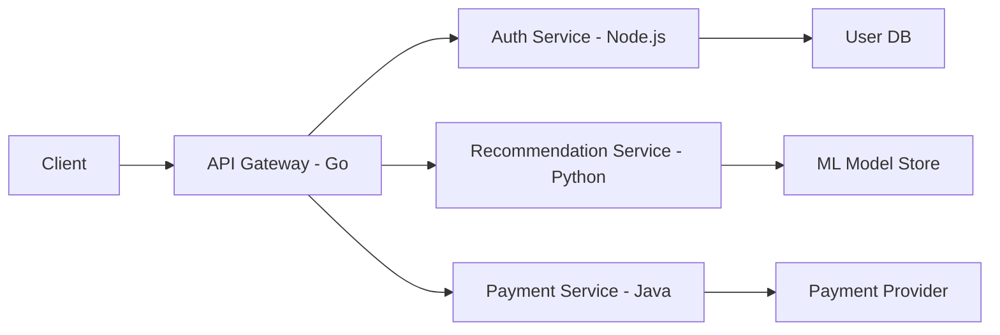
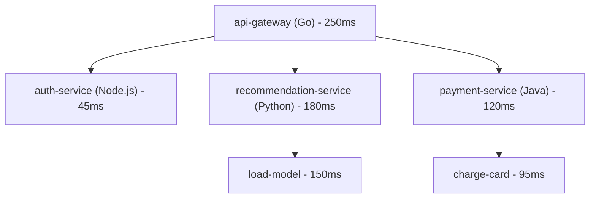

# How to Trace a Polyglot Microservices Architecture (Java, Python, Go, Node.js)

Author: [nawazdhandala](https://www.github.com/nawazdhandala)

Tags: OpenTelemetry, Distributed Tracing, Microservices, Java, Python, Go, Node.js, Polyglot

Description: Learn how to implement end-to-end distributed tracing across a polyglot microservices architecture using OpenTelemetry with Java, Python, Go, and Node.js services.

---

Most real-world microservices architectures are not built with a single programming language. Teams pick the language that fits their problem best. Your API gateway might be written in Go, the authentication service in Node.js, the recommendation engine in Python, and the payment processor in Java. This is the reality of polyglot systems, and it creates a unique challenge for observability: how do you trace a request as it flows through services written in four different languages?

OpenTelemetry was designed from the ground up to solve this problem. It provides language-specific SDKs that all speak the same wire protocol (OTLP) and follow the same semantic conventions. This means a trace that starts in your Go gateway can seamlessly continue through your Python ML service, your Java payment processor, and your Node.js notification service. The trace context propagates across every boundary, and the resulting trace looks like one unified story.

This post walks through setting up distributed tracing across all four languages with working code examples and practical configuration.

## Architecture Overview

Before we dive into code, here is the architecture we will instrument:



Each service communicates over HTTP. The trace context flows through HTTP headers using the W3C Trace Context format, which is the default propagation format in OpenTelemetry.

## Setting Up the Go API Gateway

Go has a mature OpenTelemetry SDK. For the API gateway, we need the core SDK, the OTLP exporter, and HTTP instrumentation.

First, install the required packages:

```bash
# Install the OpenTelemetry Go SDK and instrumentation libraries
go get go.opentelemetry.io/otel
go get go.opentelemetry.io/otel/sdk/trace
go get go.opentelemetry.io/otel/exporters/otlp/otlptrace/otlptracehttp
go get go.opentelemetry.io/contrib/instrumentation/net/http/otelhttp
```

Now configure the tracer provider. This is the central piece that manages span creation and export:

```go
package main

import (
    "context"
    "log"
    "net/http"
    "time"

    "go.opentelemetry.io/otel"
    "go.opentelemetry.io/otel/exporters/otlp/otlptrace/otlptracehttp"
    "go.opentelemetry.io/otel/propagation"
    "go.opentelemetry.io/otel/sdk/resource"
    sdktrace "go.opentelemetry.io/otel/sdk/trace"
    semconv "go.opentelemetry.io/otel/semconv/v1.21.0"
    "go.opentelemetry.io/contrib/instrumentation/net/http/otelhttp"
)

// initTracer sets up the OTLP exporter and registers a global tracer provider.
// The resource identifies this service in the trace backend.
func initTracer() func() {
    ctx := context.Background()

    exporter, err := otlptracehttp.New(ctx,
        otlptracehttp.WithEndpoint("otel-collector:4318"),
        otlptracehttp.WithInsecure(),
    )
    if err != nil {
        log.Fatalf("failed to create exporter: %v", err)
    }

    // Define the service resource with name, version, and environment
    res, _ := resource.New(ctx,
        resource.WithAttributes(
            semconv.ServiceName("api-gateway"),
            semconv.ServiceVersion("1.0.0"),
            semconv.DeploymentEnvironment("production"),
        ),
    )

    tp := sdktrace.NewTracerProvider(
        sdktrace.WithBatcher(exporter),
        sdktrace.WithResource(res),
    )

    // Set both the global tracer provider and propagator
    otel.SetTracerProvider(tp)
    otel.SetTextMapPropagator(propagation.TraceContext{})

    return func() {
        tp.Shutdown(context.Background())
    }
}

func main() {
    shutdown := initTracer()
    defer shutdown()

    // Wrap the HTTP handler with OpenTelemetry instrumentation.
    // This automatically creates spans for incoming requests and
    // propagates context to outgoing requests.
    handler := http.HandlerFunc(gatewayHandler)
    wrappedHandler := otelhttp.NewHandler(handler, "api-gateway")

    log.Println("API Gateway listening on :8080")
    http.ListenAndServe(":8080", wrappedHandler)
}
```

The key detail here is `otel.SetTextMapPropagator(propagation.TraceContext{})`. This tells the SDK to use W3C Trace Context headers for propagation. When this Go service makes an outgoing HTTP call to a downstream service, it will automatically inject the `traceparent` header.

When making outgoing requests to downstream services, wrap the HTTP client:

```go
// makeDownstreamCall sends a request to a downstream service while
// propagating the trace context from the incoming request.
func makeDownstreamCall(ctx context.Context, url string) (*http.Response, error) {
    // Create an HTTP client wrapped with OTel instrumentation
    client := http.Client{
        Transport: otelhttp.NewTransport(http.DefaultTransport),
    }

    req, err := http.NewRequestWithContext(ctx, "GET", url, nil)
    if err != nil {
        return nil, err
    }

    // The instrumented transport automatically injects traceparent headers
    return client.Do(req)
}
```

## Setting Up the Node.js Auth Service

Node.js uses the `@opentelemetry/sdk-node` package which provides a convenient all-in-one setup:

```bash
# Install the OpenTelemetry Node.js SDK and auto-instrumentation
npm install @opentelemetry/sdk-node \
  @opentelemetry/auto-instrumentations-node \
  @opentelemetry/exporter-trace-otlp-http \
  @opentelemetry/resources \
  @opentelemetry/semantic-conventions
```

Create a tracing setup file that runs before your application code:

```javascript
// tracing.js
// This file must be required before any other module to ensure
// all HTTP and Express calls are automatically instrumented.
const { NodeSDK } = require('@opentelemetry/sdk-node');
const { getNodeAutoInstrumentations } = require('@opentelemetry/auto-instrumentations-node');
const { OTLPTraceExporter } = require('@opentelemetry/exporter-trace-otlp-http');
const { Resource } = require('@opentelemetry/resources');
const { ATTR_SERVICE_NAME, ATTR_SERVICE_VERSION } = require('@opentelemetry/semantic-conventions');

// Configure the OTLP exporter to send traces to the collector
const traceExporter = new OTLPTraceExporter({
  url: 'http://otel-collector:4318/v1/traces',
});

const sdk = new NodeSDK({
  resource: new Resource({
    [ATTR_SERVICE_NAME]: 'auth-service',
    [ATTR_SERVICE_VERSION]: '1.0.0',
  }),
  traceExporter,
  // Auto-instrumentation picks up Express, HTTP, and other popular libraries
  instrumentations: [getNodeAutoInstrumentations()],
});

sdk.start();

// Ensure clean shutdown so buffered spans get flushed
process.on('SIGTERM', () => {
  sdk.shutdown().then(() => process.exit(0));
});
```

The beauty of the Node.js auto-instrumentation is that it patches popular libraries like Express, HTTP, gRPC, and database drivers automatically. You do not need to manually create spans for standard operations. The incoming `traceparent` header is automatically extracted, and outgoing HTTP requests automatically include it.

Start your application with the tracing file loaded first:

```bash
# Load tracing.js before the main application so instrumentation
# hooks are registered before any library is imported
node --require ./tracing.js app.js
```

## Setting Up the Python Recommendation Service

Python uses a similar auto-instrumentation approach:

```bash
# Install the OpenTelemetry Python SDK and auto-instrumentation
pip install opentelemetry-sdk \
  opentelemetry-exporter-otlp-proto-http \
  opentelemetry-instrumentation-flask \
  opentelemetry-instrumentation-requests
```

Configure the tracer in your application:

```python
# tracing.py
# Centralized tracing setup for the Python recommendation service.
# Import and call init_tracing() at the top of your main module.
from opentelemetry import trace
from opentelemetry.sdk.trace import TracerProvider
from opentelemetry.sdk.trace.export import BatchSpanProcessor
from opentelemetry.exporter.otlp.proto.http.trace_exporter import OTLPSpanExporter
from opentelemetry.sdk.resources import Resource, SERVICE_NAME, SERVICE_VERSION
from opentelemetry.instrumentation.flask import FlaskInstrumentor
from opentelemetry.instrumentation.requests import RequestsInstrumentor

def init_tracing(app):
    # Define the resource that identifies this service
    resource = Resource.create({
        SERVICE_NAME: "recommendation-service",
        SERVICE_VERSION: "1.0.0",
    })

    # Set up the tracer provider with a batch processor for efficiency
    provider = TracerProvider(resource=resource)
    exporter = OTLPSpanExporter(endpoint="http://otel-collector:4318/v1/traces")
    provider.add_span_processor(BatchSpanProcessor(exporter))
    trace.set_tracer_provider(provider)

    # Instrument Flask to automatically create spans for each request
    FlaskInstrumentor().instrument_app(app)
    # Instrument the requests library so outgoing calls carry trace context
    RequestsInstrumentor().instrument()
```

The Flask instrumentation automatically extracts the `traceparent` header from incoming requests, and the Requests instrumentation injects it into outgoing calls. This means the trace context flows through the Python service without any manual propagation code.

## Setting Up the Java Payment Service

Java has the most mature OpenTelemetry ecosystem, with a powerful Java agent that instruments dozens of libraries automatically:

```bash
# Download the OpenTelemetry Java agent JAR.
# This agent auto-instruments most popular Java frameworks.
curl -L -o opentelemetry-javaagent.jar \
  https://github.com/open-telemetry/opentelemetry-java-instrumentation/releases/latest/download/opentelemetry-javaagent.jar
```

Configure the agent using environment variables:

```bash
# Run the Java application with the OpenTelemetry agent attached.
# The agent automatically instruments Spring Boot, JDBC, HTTP clients, etc.
java -javaagent:opentelemetry-javaagent.jar \
  -Dotel.service.name=payment-service \
  -Dotel.exporter.otlp.endpoint=http://otel-collector:4318 \
  -Dotel.exporter.otlp.protocol=http/protobuf \
  -jar payment-service.jar
```

The Java agent approach is incredibly powerful because it requires zero code changes. It automatically instruments Spring Boot, Servlet, JDBC, Hibernate, OkHttp, Apache HttpClient, gRPC, and many more libraries. Trace context propagation works out of the box.

If you need to add custom spans for business logic:

```java
import io.opentelemetry.api.GlobalOpenTelemetry;
import io.opentelemetry.api.trace.Span;
import io.opentelemetry.api.trace.Tracer;
import io.opentelemetry.context.Scope;

public class PaymentProcessor {

    // Get a tracer instance scoped to this class
    private static final Tracer tracer =
        GlobalOpenTelemetry.getTracer("payment-service", "1.0.0");

    public PaymentResult processPayment(PaymentRequest request) {
        // Create a custom span for the payment processing logic
        Span span = tracer.spanBuilder("process-payment")
            .setAttribute("payment.amount", request.getAmount())
            .setAttribute("payment.currency", request.getCurrency())
            .startSpan();

        try (Scope scope = span.makeCurrent()) {
            // Business logic here
            PaymentResult result = chargeCard(request);
            span.setAttribute("payment.status", result.getStatus());
            return result;
        } catch (Exception e) {
            span.recordException(e);
            span.setStatus(io.opentelemetry.api.trace.StatusCode.ERROR);
            throw e;
        } finally {
            span.end();
        }
    }
}
```

## Collector Configuration

All four services send their traces to a shared OpenTelemetry Collector. The collector receives traces from every language using the same OTLP protocol and forwards them to your tracing backend:

```yaml
# otel-collector-config.yaml
# Central collector configuration that receives from all language services
receivers:
  otlp:
    protocols:
      http:
        endpoint: 0.0.0.0:4318
      grpc:
        endpoint: 0.0.0.0:4317

processors:
  batch:
    # Batch spans for efficient export
    timeout: 5s
    send_batch_size: 512

  resource:
    attributes:
      - key: environment
        value: production
        action: upsert

exporters:
  otlphttp:
    endpoint: https://oneuptime.com/otlp

service:
  pipelines:
    traces:
      receivers: [otlp]
      processors: [batch, resource]
      exporters: [otlphttp]
```

## Verifying Cross-Language Trace Propagation

Once all four services are instrumented, you can verify that traces flow correctly by sending a request to the API gateway and checking that the trace includes spans from all services:



The trace ID is the same across all spans. Each service picks up the trace context from the incoming request headers and creates child spans that belong to the same trace.

## Common Pitfalls

There are a few issues that commonly trip up teams working with polyglot tracing:

**Context propagation breaks at async boundaries.** If you are using message queues or async event systems between services, HTTP header propagation does not help. You need to manually inject trace context into the message payload and extract it on the consumer side.

**Clock skew between services.** If your services run on different machines with different clocks, span timestamps can look wrong. Use NTP synchronization across all hosts to keep clocks aligned.

**Different SDK versions.** Each language SDK has its own release cycle. Make sure all SDKs are using the same version of the OTLP protocol and semantic conventions. The SDKs are generally backward compatible, but mixing very old and very new versions can cause subtle issues.

**Missing resource attributes.** If you forget to set `service.name` in one of your services, the spans from that service will be hard to identify in your trace viewer. Always configure the service resource with at least the service name and version.

## Conclusion

OpenTelemetry makes polyglot tracing practical because every language SDK implements the same specification. The wire format is identical, the propagation headers are the same, and the semantic conventions provide a shared vocabulary. You do not need to pick one language for your entire stack just to get good observability. Instrument each service in its native language, point them all at a shared collector, and you get unified traces that tell the full story of every request flowing through your system.
