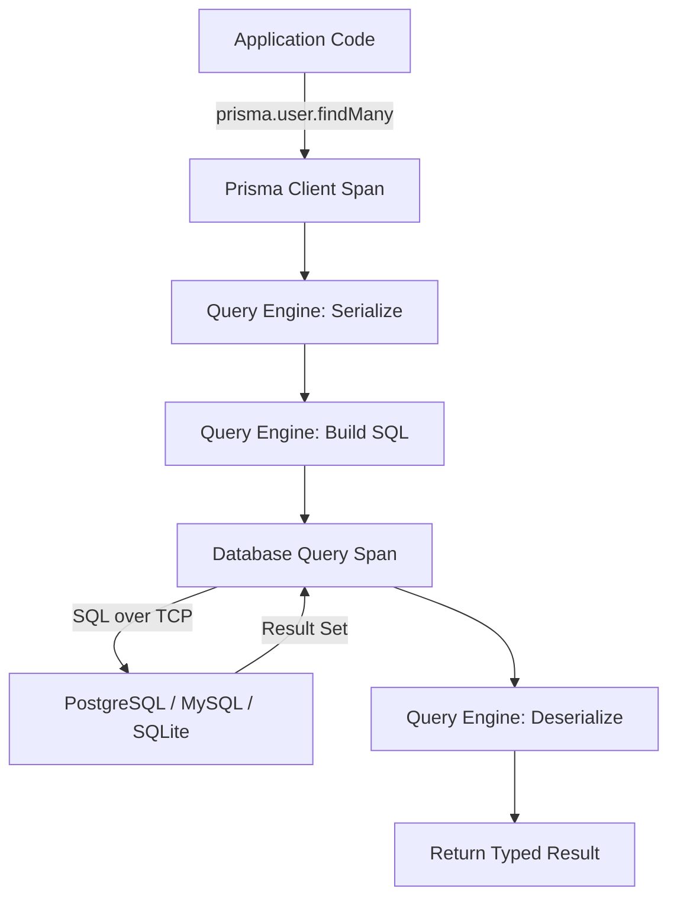
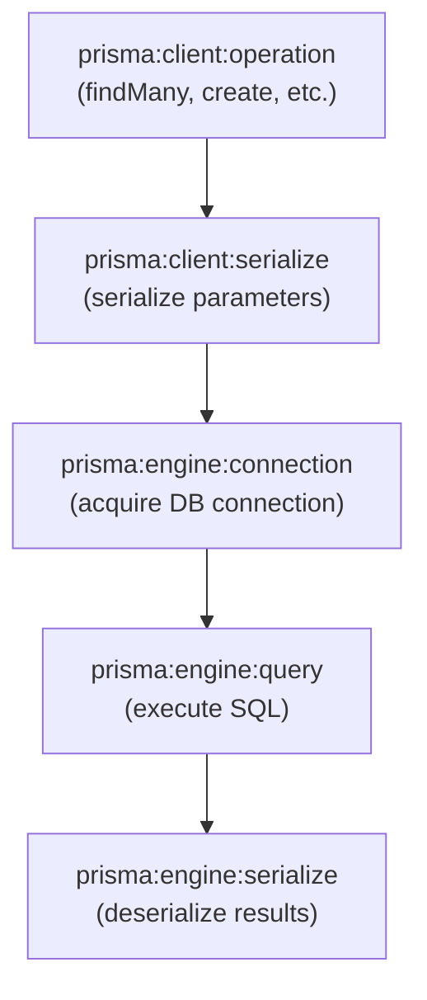

# How to Trace Prisma Client Database Calls with OpenTelemetry

Author: [nawazdhandala](https://www.github.com/nawazdhandala)

Tags: OpenTelemetry, Prisma, ORM, Node.js, TypeScript, Database, Tracing, Observability

Description: Instrument Prisma Client with OpenTelemetry to trace every database query, measure ORM overhead, and debug slow database operations in Node.js and TypeScript applications.

---

Prisma is one of the most popular ORMs in the Node.js and TypeScript ecosystem. It generates a type-safe client from your database schema and handles query building, connection pooling, and migrations. But like any ORM, Prisma adds a layer of abstraction between your application code and the database. When something is slow, you need to know whether the bottleneck is in Prisma's query engine, the network, or the database itself.

OpenTelemetry tracing cuts through that abstraction layer. Prisma has built-in support for OpenTelemetry starting from version 4.2, which means you can get detailed spans for every database operation without writing custom wrapper code. This guide walks through enabling and configuring Prisma's OpenTelemetry integration.

## How Prisma Tracing Works

Prisma's architecture includes a query engine (written in Rust) that sits between your TypeScript code and the database. When you enable tracing, Prisma creates spans at multiple levels: the client operation, the query engine processing, the serialization step, and the actual database query execution.



This multi-level tracing lets you see exactly where time is spent. If serialization takes 50ms and the actual database query takes 2ms, you know the problem is not in the database.

## Prerequisites

You need Prisma version 4.2 or later and a Node.js application with the OpenTelemetry SDK configured. Let's start with the required packages.

```bash
# Install Prisma's OpenTelemetry integration and the OTel SDK
npm install @prisma/instrumentation \
    @opentelemetry/sdk-node \
    @opentelemetry/sdk-trace-node \
    @opentelemetry/exporter-trace-otlp-grpc \
    @opentelemetry/resources \
    @opentelemetry/semantic-conventions \
    @opentelemetry/instrumentation
```

## Enabling Tracing in Your Prisma Schema

First, enable the `tracing` preview feature in your Prisma schema. This tells the Prisma query engine to produce OpenTelemetry spans.

```prisma
// schema.prisma - Enable the tracing preview feature
generator client {
  provider        = "prisma-client-js"
  // Enable OpenTelemetry tracing support in the generated client
  previewFeatures = ["tracing"]
}

datasource db {
  provider = "postgresql"
  url      = env("DATABASE_URL")
}

// Example models for the code samples below
model User {
  id        Int      @id @default(autoincrement())
  email     String   @unique
  name      String?
  posts     Post[]
  createdAt DateTime @default(now())
}

model Post {
  id        Int      @id @default(autoincrement())
  title     String
  content   String?
  published Boolean  @default(false)
  author    User     @relation(fields: [authorId], references: [id])
  authorId  Int
  createdAt DateTime @default(now())
}
```

After modifying the schema, regenerate the Prisma client.

```bash
# Regenerate the client with tracing support enabled
npx prisma generate
```

## Configuring OpenTelemetry with Prisma Instrumentation

The OpenTelemetry setup must happen before any other imports in your application. This is critical because the instrumentation needs to be registered before Prisma Client is instantiated.

```typescript
// tracing.ts - OpenTelemetry setup file, must be imported first
import { NodeSDK } from '@opentelemetry/sdk-node';
import { OTLPTraceExporter } from '@opentelemetry/exporter-trace-otlp-grpc';
import { Resource } from '@opentelemetry/resources';
import { ATTR_SERVICE_NAME, ATTR_SERVICE_VERSION } from '@opentelemetry/semantic-conventions';
import { PrismaInstrumentation } from '@prisma/instrumentation';
import { BatchSpanProcessor } from '@opentelemetry/sdk-trace-node';

// Configure the OTLP exporter to send traces to your collector
const traceExporter = new OTLPTraceExporter({
    // The collector endpoint - adjust for your environment
    url: 'http://localhost:4317',
});

// Initialize the OpenTelemetry Node SDK with Prisma instrumentation
const sdk = new NodeSDK({
    // Resource attributes identify your service in the backend
    resource: new Resource({
        [ATTR_SERVICE_NAME]: 'my-api-service',
        [ATTR_SERVICE_VERSION]: '1.0.0',
    }),

    // Use batch processing to reduce export overhead
    spanProcessors: [new BatchSpanProcessor(traceExporter)],

    // Register the Prisma instrumentation
    // This hooks into Prisma Client to produce spans automatically
    instrumentations: [new PrismaInstrumentation()],
});

// Start the SDK - this must complete before importing Prisma
sdk.start();

// Gracefully shut down on process exit to flush pending spans
process.on('SIGTERM', () => {
    sdk.shutdown()
        .then(() => console.log('OpenTelemetry shut down'))
        .catch((err) => console.error('Error shutting down OTel', err))
        .finally(() => process.exit(0));
});

export { sdk };
```

Now set up your application entry point to import tracing before anything else.

```typescript
// index.ts - Application entry point
// IMPORTANT: Import tracing setup first, before any other modules
import './tracing';

import express from 'express';
import { PrismaClient } from '@prisma/client';

// Prisma Client is created after tracing is initialized,
// so all queries will be automatically instrumented
const prisma = new PrismaClient();
const app = express();

app.use(express.json());

// Every Prisma call in these route handlers will produce
// OpenTelemetry spans automatically
app.get('/users', async (req, res) => {
    const users = await prisma.user.findMany({
        include: { posts: true },
        take: 20,
    });
    res.json(users);
});

app.get('/users/:id', async (req, res) => {
    const user = await prisma.user.findUnique({
        where: { id: parseInt(req.params.id) },
        include: {
            posts: {
                where: { published: true },
                orderBy: { createdAt: 'desc' },
            },
        },
    });

    if (!user) {
        return res.status(404).json({ error: 'User not found' });
    }
    res.json(user);
});

app.post('/posts', async (req, res) => {
    // This create operation will produce spans for:
    // 1. prisma:client:operation - the high-level Prisma call
    // 2. prisma:engine:query - the SQL query execution
    // 3. prisma:engine:serialize - result serialization
    const post = await prisma.post.create({
        data: {
            title: req.body.title,
            content: req.body.content,
            author: { connect: { id: req.body.authorId } },
        },
        include: { author: true },
    });
    res.status(201).json(post);
});

app.listen(3000, () => {
    console.log('Server running on port 3000');
});
```

## Understanding Prisma Span Types

Prisma produces several types of spans. Understanding what each one represents helps you diagnose issues faster.



Here is what each span type tells you:

- **prisma:client:operation** - The top-level span representing your Prisma call. The span name includes the model and operation (e.g., `prisma:client:operation findMany User`).
- **prisma:client:serialize** - Time spent serializing your query parameters into the format the query engine expects. Usually fast, but can be slow with large input data.
- **prisma:engine:connection** - Time spent acquiring a database connection from the pool. If this span is long, your connection pool is exhausted.
- **prisma:engine:query** - The actual SQL execution. This span includes the generated SQL as an attribute. This is the span you want to examine when debugging slow queries.
- **prisma:engine:serialize** - Time spent deserializing database results back into JavaScript objects. Large result sets make this span longer.

## Adding Custom Context to Prisma Spans

Sometimes the automatic spans are not enough. You might want to group related Prisma calls under a parent span, or add business-context attributes.

```typescript
// Adding custom parent spans to group related database operations
import { trace, SpanKind } from '@opentelemetry/api';

const tracer = trace.getTracer('my-api-service');

// Wrap a business operation that involves multiple Prisma calls
async function getUserDashboard(userId: number) {
    // Create a parent span for the entire dashboard loading operation
    return tracer.startActiveSpan('load-user-dashboard', async (span) => {
        try {
            // Each of these Prisma calls creates child spans automatically
            // They will all appear nested under 'load-user-dashboard'

            // Fetch the user profile
            const user = await prisma.user.findUnique({
                where: { id: userId },
            });

            if (!user) {
                span.setAttribute('dashboard.found', false);
                return null;
            }

            // Fetch recent posts with comment counts
            const recentPosts = await prisma.post.findMany({
                where: { authorId: userId, published: true },
                orderBy: { createdAt: 'desc' },
                take: 10,
            });

            // Fetch aggregate statistics
            const stats = await prisma.post.aggregate({
                where: { authorId: userId },
                _count: { id: true },
                _avg: { id: true },
            });

            // Add business context to the parent span
            span.setAttribute('dashboard.found', true);
            span.setAttribute('dashboard.post_count', recentPosts.length);
            span.setAttribute('dashboard.user_email', user.email);

            return { user, recentPosts, stats };
        } catch (error) {
            span.recordException(error as Error);
            throw error;
        } finally {
            span.end();
        }
    });
}
```

## Middleware for Query-Level Logging

Prisma's middleware feature can complement OpenTelemetry tracing by adding custom attributes or logging to spans.

```typescript
// Add Prisma middleware to enrich spans with query metadata
prisma.$use(async (params, next) => {
    // Record the start time to measure total ORM overhead
    const startTime = Date.now();

    // Get the current active span from OpenTelemetry context
    const currentSpan = trace.getActiveSpan();

    if (currentSpan) {
        // Add the Prisma model and action as span attributes
        currentSpan.setAttribute('prisma.model', params.model || 'unknown');
        currentSpan.setAttribute('prisma.action', params.action);

        // Flag potentially expensive operations
        if (params.action === 'findMany' && !params.args?.take) {
            currentSpan.setAttribute('prisma.warning', 'unbounded-query');
        }
    }

    // Execute the actual Prisma operation
    const result = await next(params);

    // Record the total middleware execution time
    const duration = Date.now() - startTime;
    if (currentSpan) {
        currentSpan.setAttribute('prisma.total_duration_ms', duration);
    }

    return result;
});
```

## Collector Configuration

Set up your collector to receive Prisma traces and export them to your backend.

```yaml
# otel-collector-config.yaml - Collector config for Prisma trace ingestion
receivers:
  # Accept traces from the Node.js application via gRPC
  otlp:
    protocols:
      grpc:
        endpoint: 0.0.0.0:4317
      http:
        endpoint: 0.0.0.0:4318

processors:
  # Batch spans for efficient export
  batch:
    timeout: 5s
    send_batch_size: 256

  # Filter out very fast database operations to reduce volume
  # Keep only spans longer than 5ms or error spans
  filter/slow:
    spans:
      min_duration: 5ms

exporters:
  otlp/oneuptime:
    endpoint: "https://otlp.oneuptime.com:4317"
    headers:
      "x-oneuptime-token": "${ONEUPTIME_TOKEN}"

service:
  pipelines:
    traces:
      receivers: [otlp]
      processors: [batch]
      exporters: [otlp/oneuptime]
```

## Identifying Common Prisma Performance Issues

With tracing enabled, you can diagnose several common Prisma performance problems:

**N+1 Queries**: The classic ORM problem. If a single request produces dozens of `prisma:engine:query` spans that each fetch one record, you have an N+1 issue. Fix it by using `include` or `select` to eager-load related data.

**Missing Indexes**: Look for `prisma:engine:query` spans with long durations. The SQL in the span attributes will show which query is slow. Run `EXPLAIN` against that SQL to check for missing indexes.

**Connection Pool Exhaustion**: Long `prisma:engine:connection` spans mean the pool is full. Increase `connection_limit` in your database URL or reduce the number of concurrent operations.

**Over-fetching**: If `prisma:engine:serialize` takes a long time, you might be loading more data than needed. Use `select` to pick only the fields your application actually uses.

```typescript
// Bad - fetches all columns including large text fields
const users = await prisma.user.findMany();

// Better - only select the fields you actually need
const users = await prisma.user.findMany({
    select: {
        id: true,
        name: true,
        email: true,
        // Don't load posts or other relations unless needed
    },
});
```

## Production Sampling

In high-traffic applications, tracing every single Prisma query generates too much data. Use a sampler to capture a representative subset.

```typescript
// Configure sampling for production - trace 10% of requests
import { TraceIdRatioBasedSampler } from '@opentelemetry/sdk-trace-node';

const sdk = new NodeSDK({
    resource: new Resource({
        [ATTR_SERVICE_NAME]: 'my-api-service',
    }),
    // Sample 10% of traces in production
    sampler: new TraceIdRatioBasedSampler(0.1),
    spanProcessors: [new BatchSpanProcessor(traceExporter)],
    instrumentations: [new PrismaInstrumentation()],
});
```

The trace-ID-based sampler ensures that when a request is sampled, all of its Prisma spans are included. You never get partial traces where some database calls are missing.

Prisma's built-in OpenTelemetry support makes database observability accessible with minimal effort. Once enabled, every `findMany`, `create`, `update`, and `delete` becomes visible in your tracing backend, giving you the insight needed to keep your application fast and reliable.
