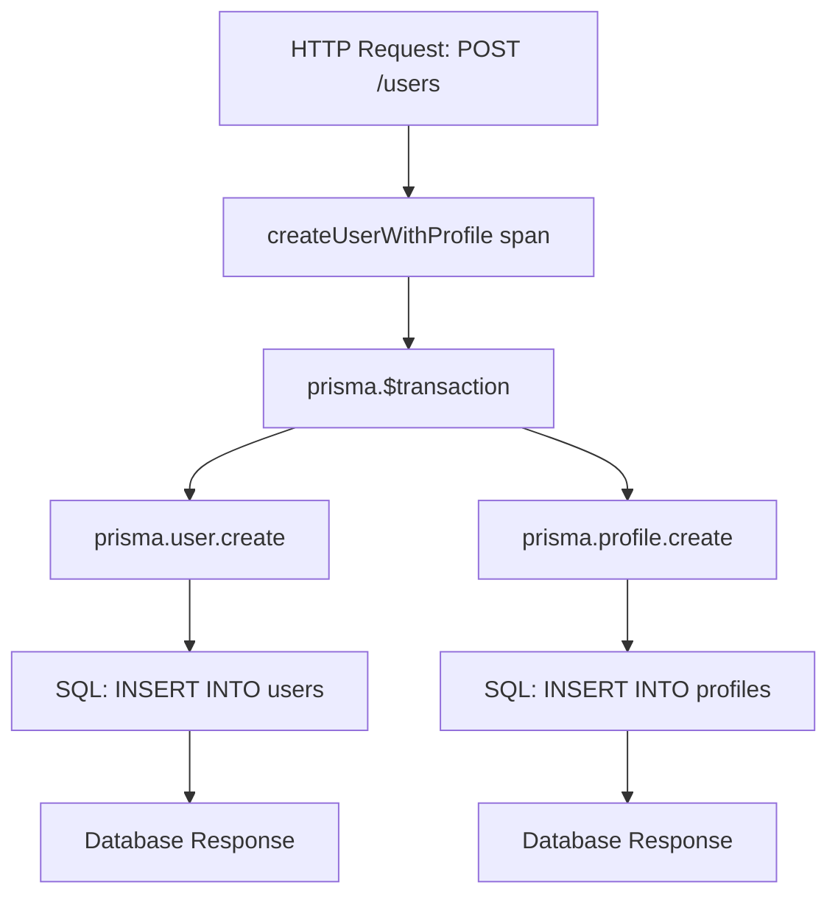

# How to Trace Prisma Database Queries with OpenTelemetry in Node.js

Author: [nawazdhandala](https://www.github.com/nawazdhandala)

Tags: OpenTelemetry, Prisma, Node.js, Database, Tracing, SQL

Description: Learn how to instrument Prisma ORM with OpenTelemetry to trace database queries, monitor performance, and debug slow queries in your Node.js applications.

Prisma has become one of the most popular ORMs in the Node.js ecosystem, offering type-safe database access and an intuitive API. However, as your application scales, understanding database query performance becomes critical. OpenTelemetry provides the observability infrastructure needed to trace every database operation, measure query execution times, and identify bottlenecks.

## Why Trace Prisma Queries

Database operations often represent the most significant performance bottleneck in modern applications. Without proper instrumentation, identifying slow queries, connection pool issues, or inefficient data access patterns becomes nearly impossible. OpenTelemetry's distributed tracing gives you visibility into:

- Query execution times and patterns
- Database connection management
- N+1 query problems
- Transaction boundaries and their performance impact
- Correlation between application logic and database operations

## Understanding Prisma's Middleware System

Prisma provides a middleware system that intercepts all database operations before they execute. This middleware layer is the perfect integration point for OpenTelemetry instrumentation. Every query, whether it's a simple findMany or a complex transaction, passes through this middleware pipeline.

The middleware receives context about the operation including the model being queried, the action type (findMany, create, update, etc.), and the arguments. This rich context translates perfectly into OpenTelemetry span attributes, providing detailed insights into your database operations.

## Setting Up OpenTelemetry with Prisma

First, install the required dependencies for OpenTelemetry instrumentation:

```bash
npm install @opentelemetry/sdk-node \
            @opentelemetry/api \
            @opentelemetry/instrumentation \
            @opentelemetry/resources \
            @opentelemetry/semantic-conventions \
            @opentelemetry/exporter-trace-otlp-http
```

Create your OpenTelemetry initialization file that configures the SDK before any application code runs:

```javascript
// tracing.js
const { NodeSDK } = require('@opentelemetry/sdk-node');
const { getNodeAutoInstrumentations } = require('@opentelemetry/auto-instrumentations-node');
const { Resource } = require('@opentelemetry/resources');
const { SemanticResourceAttributes } = require('@opentelemetry/semantic-conventions');
const { OTLPTraceExporter } = require('@opentelemetry/exporter-trace-otlp-http');

// Configure the OTLP exporter to send traces to your backend
const traceExporter = new OTLPTraceExporter({
  url: process.env.OTEL_EXPORTER_OTLP_ENDPOINT || 'http://localhost:4318/v1/traces',
  headers: {},
});

// Initialize the OpenTelemetry SDK with automatic instrumentation
const sdk = new NodeSDK({
  resource: new Resource({
    [SemanticResourceAttributes.SERVICE_NAME]: 'prisma-app',
    [SemanticResourceAttributes.SERVICE_VERSION]: '1.0.0',
  }),
  traceExporter,
  instrumentations: [getNodeAutoInstrumentations()],
});

sdk.start();

// Graceful shutdown
process.on('SIGTERM', () => {
  sdk.shutdown()
    .then(() => console.log('Tracing terminated'))
    .catch((error) => console.log('Error terminating tracing', error))
    .finally(() => process.exit(0));
});
```

## Implementing Prisma Middleware for Tracing

Create a dedicated module for Prisma instrumentation that adds OpenTelemetry spans to all database operations:

```javascript
// prisma-instrumentation.js
const { trace, context, SpanStatusCode } = require('@opentelemetry/api');

const tracer = trace.getTracer('prisma-instrumentation', '1.0.0');

/**
 * Creates OpenTelemetry spans for all Prisma operations
 * This middleware captures timing, query details, and errors
 */
function createPrismaMiddleware() {
  return async (params, next) => {
    const { model, action, args } = params;

    // Create a descriptive span name following semantic conventions
    const spanName = model ? `prisma.${model}.${action}` : `prisma.${action}`;

    // Start a new span for this database operation
    return tracer.startActiveSpan(spanName, async (span) => {
      try {
        // Add semantic attributes for database operations
        span.setAttribute('db.system', 'postgresql'); // or your database type
        span.setAttribute('db.operation', action);

        if (model) {
          span.setAttribute('db.prisma.model', model);
        }

        // Add query arguments for debugging (be careful with sensitive data)
        if (args) {
          // Only include safe metadata, avoid logging sensitive field values
          if (args.where) {
            span.setAttribute('db.prisma.where', JSON.stringify(args.where));
          }
          if (args.select) {
            span.setAttribute('db.prisma.select', JSON.stringify(args.select));
          }
          if (args.include) {
            span.setAttribute('db.prisma.include', JSON.stringify(args.include));
          }
        }

        // Execute the actual Prisma operation
        const result = await next(params);

        // Mark the span as successful
        span.setStatus({ code: SpanStatusCode.OK });

        return result;
      } catch (error) {
        // Record the error in the span
        span.recordException(error);
        span.setStatus({
          code: SpanStatusCode.ERROR,
          message: error.message,
        });

        // Re-throw to maintain normal error handling
        throw error;
      } finally {
        // Always end the span
        span.end();
      }
    });
  };
}

module.exports = { createPrismaMiddleware };
```

## Integrating the Middleware with Prisma Client

Now register the middleware with your Prisma client instance:

```javascript
// db.js
const { PrismaClient } = require('@prisma/client');
const { createPrismaMiddleware } = require('./prisma-instrumentation');

// Create Prisma client instance
const prisma = new PrismaClient({
  log: ['query', 'error', 'warn'],
});

// Register the OpenTelemetry middleware
prisma.$use(createPrismaMiddleware());

module.exports = prisma;
```

## Tracing Complex Operations

For complex operations involving multiple queries or business logic, create custom spans that provide context:

```javascript
// user-service.js
const { trace } = require('@opentelemetry/api');
const prisma = require('./db');

const tracer = trace.getTracer('user-service', '1.0.0');

async function createUserWithProfile(userData, profileData) {
  // Create a parent span for the entire operation
  return tracer.startActiveSpan('createUserWithProfile', async (span) => {
    try {
      span.setAttribute('user.email', userData.email);

      // This transaction will create child spans via Prisma middleware
      const user = await prisma.$transaction(async (tx) => {
        // These operations are automatically traced
        const newUser = await tx.user.create({
          data: userData,
        });

        const profile = await tx.profile.create({
          data: {
            ...profileData,
            userId: newUser.id,
          },
        });

        return { ...newUser, profile };
      });

      span.setAttribute('user.id', user.id);
      span.setStatus({ code: SpanStatusCode.OK });

      return user;
    } catch (error) {
      span.recordException(error);
      span.setStatus({ code: SpanStatusCode.ERROR, message: error.message });
      throw error;
    } finally {
      span.end();
    }
  });
}
```

## Monitoring Connection Pool Performance

Prisma's connection pool management is critical for application performance. Add custom metrics to monitor pool utilization:

```javascript
// pool-monitoring.js
const { metrics } = require('@opentelemetry/api');
const prisma = require('./db');

const meter = metrics.getMeter('prisma-pool-monitor', '1.0.0');

// Create metrics for connection pool monitoring
const activeConnectionsGauge = meter.createObservableGauge('db.prisma.pool.active', {
  description: 'Number of active database connections',
});

const idleConnectionsGauge = meter.createObservableGauge('db.prisma.pool.idle', {
  description: 'Number of idle database connections',
});

// Register callbacks to collect pool metrics
async function setupPoolMonitoring() {
  activeConnectionsGauge.addCallback(async (observableResult) => {
    const metrics = await prisma.$metrics.json();
    const activeConnections = metrics.counters.find(
      c => c.key === 'prisma_client_queries_active'
    );
    if (activeConnections) {
      observableResult.observe(activeConnections.value);
    }
  });
}

module.exports = { setupPoolMonitoring };
```

## Visualizing the Trace Hierarchy

The trace hierarchy shows how your application components interact:



## Handling Sensitive Data

When tracing database operations, avoid logging sensitive information in span attributes:

```javascript
// safe-instrumentation.js
const SENSITIVE_FIELDS = ['password', 'ssn', 'creditCard', 'apiKey'];

function sanitizeArgs(args) {
  if (!args) return args;

  const sanitized = { ...args };

  // Remove sensitive fields from where clauses
  if (sanitized.where) {
    SENSITIVE_FIELDS.forEach(field => {
      if (sanitized.where[field]) {
        sanitized.where[field] = '[REDACTED]';
      }
    });
  }

  // Remove sensitive fields from data
  if (sanitized.data) {
    SENSITIVE_FIELDS.forEach(field => {
      if (sanitized.data[field]) {
        sanitized.data[field] = '[REDACTED]';
      }
    });
  }

  return sanitized;
}
```

## Performance Considerations

Instrumentation adds minimal overhead, but there are best practices to follow:

1. **Sampling**: In high-throughput applications, use trace sampling to reduce data volume
2. **Attribute Limits**: Avoid adding large objects as span attributes
3. **Batch Operations**: Prisma batch operations create a single span, making them more efficient
4. **Connection Pooling**: Monitor pool size to prevent connection exhaustion

## Debugging Common Issues

**Problem**: Spans not appearing in traces

Check that your tracing initialization runs before importing Prisma:

```javascript
// app.js
// MUST be the first import
require('./tracing');

// Now import other modules
const express = require('express');
const prisma = require('./db');
```

**Problem**: Missing parent-child span relationships

Ensure you're using async/await properly and not breaking the context chain:

```javascript
// Correct: Maintains context
async function goodExample() {
  return await tracer.startActiveSpan('operation', async (span) => {
    const result = await prisma.user.findMany();
    span.end();
    return result;
  });
}

// Incorrect: Breaks context with callbacks
function badExample() {
  tracer.startActiveSpan('operation', (span) => {
    prisma.user.findMany().then(result => {
      span.end();
      return result; // Context lost here
    });
  });
}
```

## Production Deployment

When deploying to production, configure your exporter endpoint through environment variables:

```bash
# .env
OTEL_EXPORTER_OTLP_ENDPOINT=https://your-otel-collector:4318/v1/traces
OTEL_SERVICE_NAME=production-api
OTEL_TRACES_SAMPLER=parentbased_traceidratio
OTEL_TRACES_SAMPLER_ARG=0.1
```

Start your application with tracing enabled:

```javascript
// server.js
require('./tracing');
const app = require('./app');

const PORT = process.env.PORT || 3000;

app.listen(PORT, () => {
  console.log(`Server running on port ${PORT}`);
  console.log('OpenTelemetry tracing enabled');
});
```

## Conclusion

Instrumenting Prisma with OpenTelemetry provides deep visibility into your database operations. The middleware-based approach captures every query without modifying your application logic. With proper instrumentation, you can identify performance bottlenecks, debug production issues, and optimize database access patterns. The combination of distributed tracing and Prisma's type-safe API gives you the observability needed for modern application development.

Start with basic instrumentation and gradually add custom spans for business operations. Monitor the overhead in development, adjust sampling rates for production, and use the traces to continuously improve your application's database performance.
