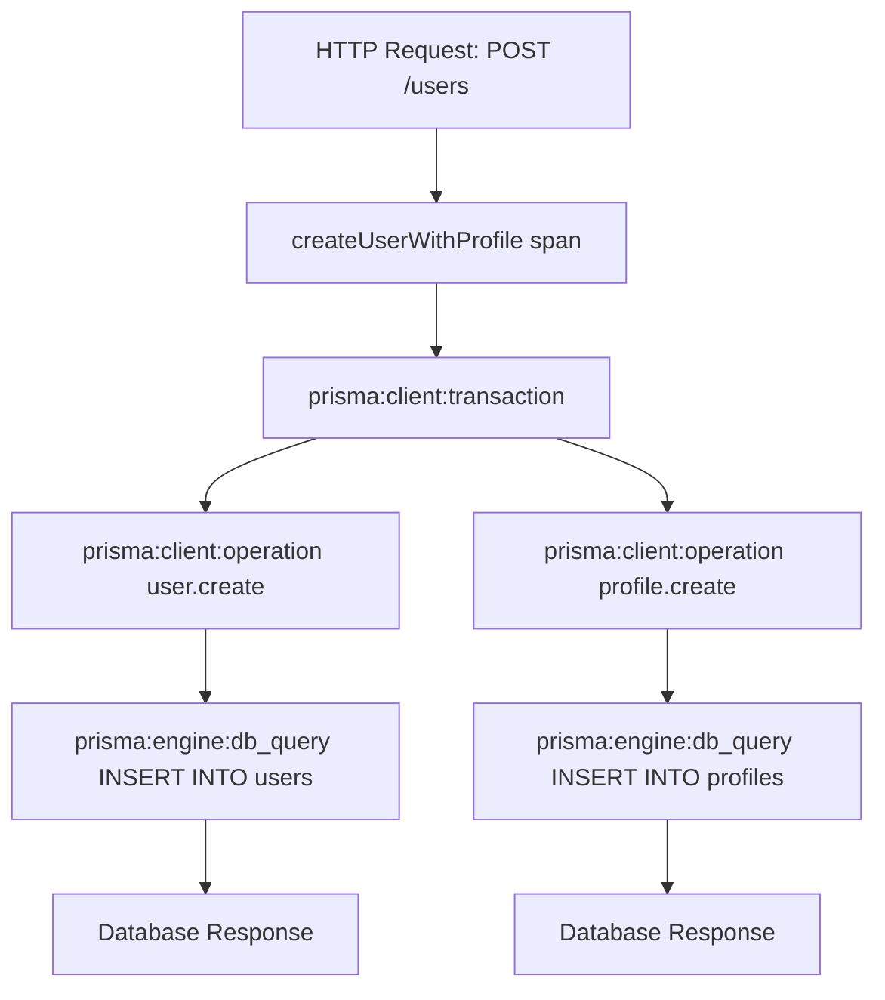

# How to Trace Prisma Database Queries with OpenTelemetry in Node.js

Author: [nawazdhandala](https://www.github.com/nawazdhandala)

Tags: OpenTelemetry, Prisma, Node.js, Database, Tracing, SQL

Description: Learn how to instrument Prisma ORM with OpenTelemetry to trace database queries, monitor performance, and debug slow queries in your Node.js applications.

Prisma has become one of the most popular ORMs in the Node.js ecosystem, offering type-safe database access and an intuitive API. However, as your application scales, understanding database query performance becomes critical. OpenTelemetry provides the observability infrastructure needed to trace every database operation, measure query execution times, and identify bottlenecks.

## Why Trace Prisma Queries

Database operations often represent the most significant performance bottleneck in modern applications. Without proper instrumentation, identifying slow queries, connection pool issues, or inefficient data access patterns becomes nearly impossible. OpenTelemetry's distributed tracing gives you visibility into:

- Query execution times and patterns
- Database connection management
- N+1 query problems
- Transaction boundaries and their performance impact
- Correlation between application logic and database operations

## Understanding Prisma's OpenTelemetry Instrumentation

Prisma provides an official OpenTelemetry instrumentation package that emits spans for Prisma Client operations and the underlying query engine work. This instrumentation is the supported integration point for current Prisma versions. Older Prisma Client middleware based on `prisma.$use()` is no longer the recommended path in Prisma ORM v6, and the client middleware API was removed in Prisma ORM v7.

The instrumentation records operation-level spans such as `prisma:client:operation` and lower-level spans such as `prisma:engine:db_query`. These spans include context about the Prisma operation and query execution path, providing detailed insights into your database operations without wrapping every query manually.

## Setting Up OpenTelemetry with Prisma

First, install the required dependencies for OpenTelemetry instrumentation:

```bash
npm install @opentelemetry/sdk-node \
            @opentelemetry/api \
            @opentelemetry/auto-instrumentations-node \
            @opentelemetry/resources \
            @opentelemetry/semantic-conventions \
            @opentelemetry/exporter-trace-otlp-http \
            @prisma/instrumentation
```

Create your OpenTelemetry initialization file that configures the SDK before any application code runs:

```javascript
// tracing.js
const { NodeSDK } = require('@opentelemetry/sdk-node');
const { getNodeAutoInstrumentations } = require('@opentelemetry/auto-instrumentations-node');
const { resourceFromAttributes } = require('@opentelemetry/resources');
const { ATTR_SERVICE_NAME, ATTR_SERVICE_VERSION } = require('@opentelemetry/semantic-conventions');
const { OTLPTraceExporter } = require('@opentelemetry/exporter-trace-otlp-http');
const { PrismaInstrumentation } = require('@prisma/instrumentation');

// Configure the OTLP exporter to send traces to your backend
const traceExporter = new OTLPTraceExporter({
  url: process.env.OTEL_EXPORTER_OTLP_TRACES_ENDPOINT || 'http://localhost:4318/v1/traces',
  headers: {},
});

// Initialize the OpenTelemetry SDK with automatic instrumentation
const sdk = new NodeSDK({
  resource: resourceFromAttributes({
    [ATTR_SERVICE_NAME]: process.env.OTEL_SERVICE_NAME || 'prisma-app',
    [ATTR_SERVICE_VERSION]: '1.0.0',
  }),
  traceExporter,
  instrumentations: [
    getNodeAutoInstrumentations(),
    new PrismaInstrumentation(),
  ],
});

sdk.start();

// Graceful shutdown
process.on('SIGTERM', () => {
  sdk.shutdown()
    .then(() => console.log('Tracing terminated'))
    .catch((error) => console.log('Error terminating tracing', error))
    .finally(() => process.exit(0));
});
```

## Implementing Prisma Operation Spans

Prisma's instrumentation creates spans for Prisma Client operations and query engine work automatically. If you want a custom span around a service-level operation, create it in your application code and let Prisma's spans attach as children:

```javascript
// user-service-tracing.js
const { trace, SpanStatusCode } = require('@opentelemetry/api');

const tracer = trace.getTracer('user-service', '1.0.0');

/**
 * Creates OpenTelemetry spans around application-level operations.
 * Prisma Client spans are emitted by @prisma/instrumentation.
 */
async function tracePrismaOperation(name, operation) {
  return tracer.startActiveSpan(name, async (span) => {
    try {
      const result = await operation();
      span.setStatus({ code: SpanStatusCode.OK });
      return result;
    } catch (error) {
      span.recordException(error);
      span.setStatus({
        code: SpanStatusCode.ERROR,
        message: error.message,
      });
      throw error;
    } finally {
      span.end();
    }
  });
}

module.exports = { tracePrismaOperation };
```

## Integrating the Instrumentation with Prisma Client

Register `PrismaInstrumentation` in your OpenTelemetry initialization before importing Prisma Client. Your Prisma client instance does not need middleware for tracing:

```javascript
// db.js
const { PrismaClient } = require('@prisma/client');

// Create Prisma client instance
const prisma = new PrismaClient({
  log: ['query', 'error', 'warn'],
});

module.exports = prisma;
```

## Tracing Complex Operations

For complex operations involving multiple queries or business logic, create custom spans that provide context:

```javascript
// user-service.js
const { trace, SpanStatusCode } = require('@opentelemetry/api');
const prisma = require('./db');

const tracer = trace.getTracer('user-service', '1.0.0');

async function createUserWithProfile(userData, profileData) {
  // Create a parent span for the entire operation
  return tracer.startActiveSpan('createUserWithProfile', async (span) => {
    try {
      span.setAttribute('app.operation', 'create_user_with_profile');

      // This transaction will create child spans via @prisma/instrumentation
      const user = await prisma.$transaction(async (tx) => {
        // These operations are automatically traced by Prisma instrumentation
        const newUser = await tx.user.create({
          data: userData,
        });

        const profile = await tx.profile.create({
          data: {
            ...profileData,
            userId: newUser.id,
          },
        });

        return { ...newUser, profile };
      });

      span.setAttribute('user.id', user.id);
      span.setStatus({ code: SpanStatusCode.OK });

      return user;
    } catch (error) {
      span.recordException(error);
      span.setStatus({ code: SpanStatusCode.ERROR, message: error.message });
      throw error;
    } finally {
      span.end();
    }
  });
}
```

## Monitoring Connection Pool Performance

Prisma's connection pool management is critical for application performance. Add custom metrics to monitor pool utilization:

```javascript
// pool-monitoring.js
const { metrics } = require('@opentelemetry/api');

const meter = metrics.getMeter('prisma-pool-monitor', '1.0.0');

// Create metrics for connection pool signals collected from your database or pooler
const activeConnectionsGauge = meter.createObservableGauge('db.client.connections.usage', {
  description: 'Number of active database connections',
});

const idleConnectionsGauge = meter.createObservableGauge('db.client.connections.idle', {
  description: 'Number of idle database connections',
});

// Register callbacks to collect pool metrics
function setupPoolMonitoring(poolStatsProvider) {
  activeConnectionsGauge.addCallback((observableResult) => {
    const stats = poolStatsProvider();
    observableResult.observe(stats.active);
  });

  idleConnectionsGauge.addCallback((observableResult) => {
    const stats = poolStatsProvider();
    observableResult.observe(stats.idle);
  });
}

module.exports = { setupPoolMonitoring };
```

## Visualizing the Trace Hierarchy

The trace hierarchy shows how your application components interact:


```mermaid
graph TD
    A[HTTP Request: POST /users] --> B[createUserWithProfile span]
    B --> C[prisma:client:transaction]
    C --> D[prisma:client:operation user.create]
    C --> E[prisma:client:operation profile.create]
    D --> F[prisma:engine:db_query INSERT INTO users]
    E --> G[prisma:engine:db_query INSERT INTO profiles]
    F --> H[Database Response]
    G --> I[Database Response]
```

## Handling Sensitive Data

When tracing database operations, avoid logging sensitive information in span attributes:

```javascript
// safe-instrumentation.js
const SENSITIVE_FIELDS = ['password', 'ssn', 'creditCard', 'apiKey'];

function sanitizeArgs(args) {
  if (!args) return args;

  const sanitized = { ...args };

  // Remove sensitive fields from where clauses
  if (sanitized.where) {
    SENSITIVE_FIELDS.forEach(field => {
      if (sanitized.where[field]) {
        sanitized.where[field] = '[REDACTED]';
      }
    });
  }

  // Remove sensitive fields from data
  if (sanitized.data) {
    SENSITIVE_FIELDS.forEach(field => {
      if (sanitized.data[field]) {
        sanitized.data[field] = '[REDACTED]';
      }
    });
  }

  return sanitized;
}
```

## Performance Considerations

Instrumentation adds minimal overhead, but there are best practices to follow:

1. **Sampling**: In high-throughput applications, use trace sampling to reduce data volume
2. **Attribute Limits**: Avoid adding large objects as span attributes
3. **Batch Exporting**: Use the OpenTelemetry batch span processor in production to reduce exporter overhead
4. **Connection Pooling**: Monitor pool size to prevent connection exhaustion

## Debugging Common Issues

**Problem**: Spans not appearing in traces

Check that your tracing initialization runs before importing Prisma:

```javascript
// app.js
// MUST be the first import
require('./tracing');

// Now import other modules
const express = require('express');
const prisma = require('./db');
```

**Problem**: Missing parent-child span relationships

Ensure you're using async/await properly and not breaking the context chain:

```javascript
// Correct: Maintains context
async function goodExample() {
  return await tracer.startActiveSpan('operation', async (span) => {
    try {
      const result = await prisma.user.findMany();
      return result;
    } finally {
      span.end();
    }
  });
}

// Incorrect: Breaks context with callbacks
function badExample() {
  tracer.startActiveSpan('operation', (span) => {
    prisma.user.findMany().then(result => {
      span.end();
      return result; // Context lost here
    });
  });
}
```

## Production Deployment

When deploying to production, configure your exporter endpoint through environment variables:

```bash
# .env

OTEL_EXPORTER_OTLP_TRACES_ENDPOINT=https://your-otel-collector:4318/v1/traces
OTEL_SERVICE_NAME=production-api
OTEL_TRACES_SAMPLER=parentbased_traceidratio
OTEL_TRACES_SAMPLER_ARG=0.1
```

Start your application with tracing enabled:

```javascript
// server.js
require('./tracing');
const app = require('./app');

const PORT = process.env.PORT || 3000;

app.listen(PORT, () => {
  console.log(`Server running on port ${PORT}`);
  console.log('OpenTelemetry tracing enabled');
});
```

## Conclusion

Instrumenting Prisma with OpenTelemetry provides deep visibility into your database operations. The official Prisma instrumentation captures Prisma Client and query engine spans without modifying your application logic. With proper instrumentation, you can identify performance bottlenecks, debug production issues, and optimize database access patterns. The combination of distributed tracing and Prisma's type-safe API gives you the observability needed for modern application development.

Start with basic instrumentation and gradually add custom spans for business operations. Monitor the overhead in development, adjust sampling rates for production, and use the traces to continuously improve your application's database performance.
