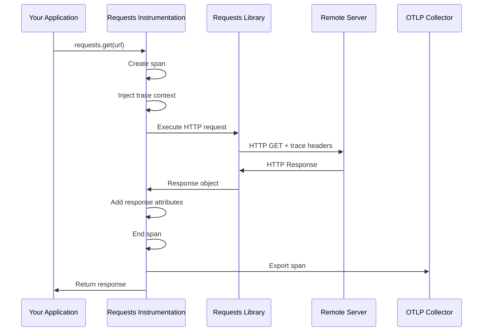

# How to Trace Python Requests Library Calls with OpenTelemetry

Author: [nawazdhandala](https://www.github.com/nawazdhandala)

Tags: OpenTelemetry, Python, Requests, HTTP Client, Tracing, Auto-Instrumentation

Description: Complete guide to automatically trace Python requests library HTTP calls with OpenTelemetry for distributed tracing and API monitoring.

The Python `requests` library is the most popular HTTP client for Python, known for its simplicity and elegant API. Nearly every Python application that interacts with REST APIs, webhooks, or external services uses requests. When these applications are part of a distributed system, tracking HTTP calls becomes critical for understanding dependencies, debugging failures, and optimizing performance.

OpenTelemetry provides seamless automatic instrumentation for the requests library, capturing every HTTP call as a span with rich metadata about the request and response. This instrumentation works out of the box with minimal configuration.

## How Requests Instrumentation Works

The OpenTelemetry requests instrumentation wraps the library's HTTP methods to create spans automatically. Each span captures request details, response information, and timing data.



## Installation

Install the required OpenTelemetry packages along with the requests instrumentation.

```bash
pip install opentelemetry-api \
            opentelemetry-sdk \
            opentelemetry-instrumentation-requests \
            opentelemetry-exporter-otlp \
            requests
```

## Basic Automatic Instrumentation

The simplest way to instrument requests is to enable automatic instrumentation before making any HTTP calls.

```python
import requests
from opentelemetry import trace
from opentelemetry.sdk.trace import TracerProvider
from opentelemetry.sdk.trace.export import BatchSpanProcessor, ConsoleSpanExporter
from opentelemetry.sdk.resources import Resource
from opentelemetry.instrumentation.requests import RequestsInstrumentor

# Configure OpenTelemetry with service identification
resource = Resource.create({
    "service.name": "api-client",
    "service.version": "1.0.0",
    "deployment.environment": "production"
})

# Set up tracer provider with console exporter for demonstration
provider = TracerProvider(resource=resource)
processor = BatchSpanProcessor(ConsoleSpanExporter())
provider.add_span_processor(processor)
trace.set_tracer_provider(provider)

# Enable automatic instrumentation for requests library
# This must be called before any requests are made
RequestsInstrumentor().instrument()

# Now all requests calls are automatically traced
response = requests.get('https://api.github.com/users/octocat')
print(f"Status: {response.status_code}")
print(f"User: {response.json()['name']}")

# POST request - also automatically traced
data = {"title": "Test Issue", "body": "Issue description"}
response = requests.post(
    'https://api.github.com/repos/owner/repo/issues',
    json=data,
    headers={"Authorization": "token YOUR_TOKEN"}
)

# All HTTP methods are instrumented
requests.put('https://api.example.com/resource/123', json={"status": "updated"})
requests.delete('https://api.example.com/resource/456')
requests.patch('https://api.example.com/resource/789', json={"field": "value"})
```

## Complete Application Example with OTLP Export

Here's a real-world example that exports traces to an OTLP collector.

```python
import requests
from opentelemetry import trace
from opentelemetry.sdk.trace import TracerProvider
from opentelemetry.sdk.trace.export import BatchSpanProcessor
from opentelemetry.exporter.otlp.proto.grpc.trace_exporter import OTLPSpanExporter
from opentelemetry.sdk.resources import Resource
from opentelemetry.instrumentation.requests import RequestsInstrumentor

# Configure resource with comprehensive metadata
resource = Resource.create({
    "service.name": "weather-service-client",
    "service.version": "2.1.0",
    "deployment.environment": "staging",
    "service.instance.id": "client-001",
    "team.name": "platform"
})

# Initialize tracer provider with OTLP exporter
provider = TracerProvider(resource=resource)
otlp_exporter = OTLPSpanExporter(
    endpoint="http://localhost:4317",
    insecure=True
)
processor = BatchSpanProcessor(otlp_exporter)
provider.add_span_processor(processor)
trace.set_tracer_provider(provider)

# Instrument requests library
RequestsInstrumentor().instrument()

# Get tracer for creating custom spans
tracer = trace.get_tracer(__name__)

def fetch_weather_data(city):
    """
    Fetch weather data for a city with custom span tracking.
    Demonstrates combining automatic and manual instrumentation.
    """
    with tracer.start_as_current_span("fetch-weather") as span:
        # Add custom attributes for business context
        span.set_attribute("weather.city", city)
        span.set_attribute("operation.type", "data_fetch")

        try:
            # This request is automatically traced by RequestsInstrumentor
            # The span created by instrumentation becomes a child of our custom span
            url = f"https://api.weatherapi.com/v1/current.json"
            params = {
                "key": "your_api_key",
                "q": city,
                "aqi": "no"
            }

            response = requests.get(url, params=params, timeout=5)
            response.raise_for_status()

            # Add response attributes to our custom span
            data = response.json()
            span.set_attribute("weather.temperature_c", data["current"]["temp_c"])
            span.set_attribute("weather.condition", data["current"]["condition"]["text"])
            span.set_attribute("response.success", True)

            return data

        except requests.exceptions.Timeout as e:
            # Record timeout errors
            span.record_exception(e)
            span.set_attribute("error.type", "timeout")
            span.set_status(trace.Status(trace.StatusCode.ERROR, "Request timeout"))
            raise

        except requests.exceptions.HTTPError as e:
            # Record HTTP errors
            span.record_exception(e)
            span.set_attribute("error.type", "http_error")
            span.set_attribute("error.status_code", response.status_code)
            span.set_status(trace.Status(trace.StatusCode.ERROR, str(e)))
            raise

        except Exception as e:
            # Record unexpected errors
            span.record_exception(e)
            span.set_attribute("error.type", "unknown")
            span.set_status(trace.Status(trace.StatusCode.ERROR, str(e)))
            raise

def compare_multiple_apis(city):
    """
    Fetch data from multiple weather APIs to demonstrate parallel tracing.
    Shows how automatic instrumentation handles concurrent requests.
    """
    with tracer.start_as_current_span("compare-weather-apis") as span:
        span.set_attribute("comparison.city", city)
        span.set_attribute("comparison.api_count", 2)

        results = {}

        # First API call
        with tracer.start_as_current_span("api-1-call") as api1_span:
            api1_span.set_attribute("api.provider", "weatherapi")
            try:
                response = requests.get(
                    f"https://api.weatherapi.com/v1/current.json",
                    params={"key": "key1", "q": city},
                    timeout=5
                )
                results["api1"] = response.json()
                api1_span.set_attribute("api.success", True)
            except Exception as e:
                api1_span.record_exception(e)
                api1_span.set_attribute("api.success", False)

        # Second API call
        with tracer.start_as_current_span("api-2-call") as api2_span:
            api2_span.set_attribute("api.provider", "openweathermap")
            try:
                response = requests.get(
                    f"https://api.openweathermap.org/data/2.5/weather",
                    params={"q": city, "appid": "key2"},
                    timeout=5
                )
                results["api2"] = response.json()
                api2_span.set_attribute("api.success", True)
            except Exception as e:
                api2_span.record_exception(e)
                api2_span.set_attribute("api.success", False)

        span.set_attribute("comparison.successful_apis", len(results))
        return results

if __name__ == "__main__":
    # Execute traced operations
    weather_data = fetch_weather_data("London")
    print(f"Temperature in London: {weather_data['current']['temp_c']}°C")

    # Compare multiple APIs
    comparison = compare_multiple_apis("Paris")
    print(f"Fetched data from {len(comparison)} APIs")
```

## Custom Request and Response Hooks

Add custom attributes or modify spans based on request/response data using hooks.

```python
from opentelemetry.instrumentation.requests import RequestsInstrumentor

def request_hook(span, request):
    """
    Called before request is sent.
    Add custom attributes based on request details.
    """
    # Add request method and URL
    span.set_attribute("http.method", request.method)
    span.set_attribute("http.url", request.url)

    # Extract and tag API endpoints
    if "/api/v1/" in request.url:
        span.set_attribute("api.version", "v1")
    elif "/api/v2/" in request.url:
        span.set_attribute("api.version", "v2")

    # Tag requests by domain
    from urllib.parse import urlparse
    parsed = urlparse(request.url)
    span.set_attribute("http.host", parsed.hostname)
    span.set_attribute("http.scheme", parsed.scheme)

    # Add custom headers as attributes (be careful with sensitive data)
    if "X-Request-ID" in request.headers:
        span.set_attribute("request.id", request.headers["X-Request-ID"])

    # Tag authentication type
    if "Authorization" in request.headers:
        auth_header = request.headers["Authorization"]
        if auth_header.startswith("Bearer"):
            span.set_attribute("auth.type", "bearer_token")
        elif auth_header.startswith("Basic"):
            span.set_attribute("auth.type", "basic_auth")

def response_hook(span, request, response):
    """
    Called after response is received.
    Add attributes based on response data.
    """
    # Add response status and headers
    span.set_attribute("http.status_code", response.status_code)
    span.set_attribute("http.status_text", response.reason)

    # Track response size
    if "Content-Length" in response.headers:
        span.set_attribute("http.response_content_length",
                          int(response.headers["Content-Length"]))

    # Add content type
    span.set_attribute("http.response_content_type",
                      response.headers.get("Content-Type", "unknown"))

    # Track response time from headers if available
    if "X-Response-Time" in response.headers:
        span.set_attribute("http.server_response_time_ms",
                          response.headers["X-Response-Time"])

    # Tag successful vs failed requests
    if 200 <= response.status_code < 300:
        span.set_attribute("request.success", True)
    elif response.status_code >= 400:
        span.set_attribute("request.success", False)
        span.set_attribute("error.category", "client_error" if response.status_code < 500 else "server_error")

    # For JSON responses, add payload size
    content_type = response.headers.get("Content-Type", "")
    if "application/json" in content_type:
        try:
            json_data = response.json()
            span.set_attribute("response.json_keys", len(json_data) if isinstance(json_data, dict) else 0)
        except:
            pass

# Instrument with custom hooks
RequestsInstrumentor().instrument(
    request_hook=request_hook,
    response_hook=response_hook
)
```

## Filtering and Excluding URLs

Exclude certain URLs from tracing to reduce noise from health checks or other high-frequency endpoints.

```python
from opentelemetry.instrumentation.requests import RequestsInstrumentor
from urllib.parse import urlparse

def excluded_urls_filter(url):
    """
    Return True if URL should be excluded from tracing.
    Used to filter out health checks, metrics endpoints, etc.
    """
    parsed = urlparse(url)

    # Exclude health check endpoints
    if parsed.path in ["/health", "/healthz", "/ping", "/ready"]:
        return True

    # Exclude metrics endpoints
    if parsed.path.startswith("/metrics"):
        return True

    # Exclude static assets
    if any(parsed.path.endswith(ext) for ext in [".js", ".css", ".png", ".jpg"]):
        return True

    # Exclude specific domains
    excluded_domains = ["localhost", "127.0.0.1", "internal-metrics.example.com"]
    if parsed.hostname in excluded_domains:
        return True

    return False

# Instrument with URL filtering
RequestsInstrumentor().instrument(
    excluded_urls=excluded_urls_filter
)
```

## Session Support

The instrumentation works seamlessly with requests.Session objects for connection pooling and persistent settings.

```python
import requests
from opentelemetry import trace
from opentelemetry.instrumentation.requests import RequestsInstrumentor

# Enable instrumentation
RequestsInstrumentor().instrument()

tracer = trace.get_tracer(__name__)

class APIClient:
    """
    Example API client using requests.Session with automatic tracing.
    Sessions provide connection pooling and persistent configuration.
    """

    def __init__(self, base_url, api_key):
        self.base_url = base_url
        self.session = requests.Session()

        # Configure session with default headers
        self.session.headers.update({
            "Authorization": f"Bearer {api_key}",
            "Content-Type": "application/json",
            "User-Agent": "APIClient/1.0"
        })

        # All session requests are automatically traced
        self.session.timeout = 10

    def get_user(self, user_id):
        """Fetch user by ID - automatically traced"""
        with tracer.start_as_current_span("get-user") as span:
            span.set_attribute("user.id", user_id)

            # Session request is automatically traced
            response = self.session.get(f"{self.base_url}/users/{user_id}")
            response.raise_for_status()

            user_data = response.json()
            span.set_attribute("user.email", user_data.get("email"))

            return user_data

    def create_user(self, user_data):
        """Create new user - automatically traced"""
        with tracer.start_as_current_span("create-user") as span:
            span.set_attribute("operation", "user_creation")

            # POST request through session - automatically traced
            response = self.session.post(
                f"{self.base_url}/users",
                json=user_data
            )
            response.raise_for_status()

            created_user = response.json()
            span.set_attribute("user.id", created_user.get("id"))

            return created_user

    def batch_operations(self, user_ids):
        """Execute multiple operations using session connection pool"""
        with tracer.start_as_current_span("batch-operations") as span:
            span.set_attribute("batch.size", len(user_ids))

            results = []
            for user_id in user_ids:
                # Each request creates its own child span automatically
                response = self.session.get(f"{self.base_url}/users/{user_id}")
                if response.status_code == 200:
                    results.append(response.json())

            span.set_attribute("batch.successful", len(results))
            return results

    def close(self):
        """Clean up session resources"""
        self.session.close()

# Usage example
client = APIClient("https://api.example.com", "your_api_key")
user = client.get_user(123)
print(f"Fetched user: {user['name']}")

# Batch operations are all traced individually
users = client.batch_operations([1, 2, 3, 4, 5])
print(f"Fetched {len(users)} users")

client.close()
```

## Error Handling and Retries

Combine instrumentation with retry logic for resilient applications.

```python
import requests
from requests.adapters import HTTPAdapter
from requests.packages.urllib3.util.retry import Retry
from opentelemetry import trace
from opentelemetry.instrumentation.requests import RequestsInstrumentor

RequestsInstrumentor().instrument()
tracer = trace.get_tracer(__name__)

def create_session_with_retries():
    """
    Create a requests session with automatic retry logic.
    All retries are automatically traced as separate spans.
    """
    session = requests.Session()

    # Configure retry strategy
    retry_strategy = Retry(
        total=3,  # Maximum number of retries
        backoff_factor=1,  # Wait 1, 2, 4 seconds between retries
        status_forcelist=[429, 500, 502, 503, 504],  # Retry on these status codes
        allowed_methods=["HEAD", "GET", "OPTIONS", "POST"]  # Methods to retry
    )

    # Mount adapter with retry strategy
    adapter = HTTPAdapter(max_retries=retry_strategy)
    session.mount("http://", adapter)
    session.mount("https://", adapter)

    return session

def resilient_api_call(url, max_attempts=3):
    """
    Make API call with custom retry logic and comprehensive tracing.
    Each attempt is traced separately.
    """
    with tracer.start_as_current_span("resilient-api-call") as span:
        span.set_attribute("url", url)
        span.set_attribute("max_attempts", max_attempts)

        session = create_session_with_retries()

        for attempt in range(1, max_attempts + 1):
            with tracer.start_as_current_span(f"attempt-{attempt}") as attempt_span:
                attempt_span.set_attribute("attempt.number", attempt)

                try:
                    response = session.get(url, timeout=5)
                    response.raise_for_status()

                    attempt_span.set_attribute("attempt.success", True)
                    span.set_attribute("successful_attempt", attempt)

                    return response.json()

                except requests.exceptions.RequestException as e:
                    attempt_span.record_exception(e)
                    attempt_span.set_attribute("attempt.success", False)
                    attempt_span.set_attribute("error.type", type(e).__name__)

                    if attempt == max_attempts:
                        span.set_status(
                            trace.Status(trace.StatusCode.ERROR,
                                       f"Failed after {max_attempts} attempts")
                        )
                        raise

        session.close()
```

## Context Propagation

OpenTelemetry automatically propagates trace context through HTTP headers following W3C Trace Context specification.

```python
import requests
from opentelemetry import trace
from opentelemetry.propagate import inject

tracer = trace.get_tracer(__name__)

def make_traced_request_with_context():
    """
    Demonstrate manual and automatic context propagation.
    Instrumentation handles this automatically, but you can also do it manually.
    """
    with tracer.start_as_current_span("parent-operation") as span:
        span.set_attribute("operation", "distributed_call")

        # Automatic propagation - instrumentation adds trace headers
        response = requests.get("https://api.example.com/data")

        # Manual propagation (if needed for custom scenarios)
        headers = {}
        inject(headers)  # Injects traceparent and tracestate headers

        response = requests.get(
            "https://api.example.com/data",
            headers=headers
        )

        return response.json()
```

## Best Practices

When using OpenTelemetry with the requests library, follow these practices:

1. **Instrument early** - Call `RequestsInstrumentor().instrument()` at application startup before making any requests
2. **Use sessions** for multiple requests to the same host to benefit from connection pooling
3. **Add custom spans** around business logic that uses requests to provide context
4. **Filter high-frequency endpoints** like health checks to reduce trace volume
5. **Handle exceptions properly** and record them in parent spans for context
6. **Use hooks sparingly** - Only add request/response hooks when you need custom attributes
7. **Avoid logging sensitive data** - Be careful not to log authorization tokens or personal information in span attributes
8. **Set appropriate timeouts** to prevent spans from remaining open indefinitely
9. **Monitor retry behavior** by tracking attempt counts in custom attributes

The requests library instrumentation provides comprehensive visibility into your HTTP client operations with zero code changes beyond the initial setup. Combined with custom spans and attributes, you can build a complete observability solution for your Python applications.
