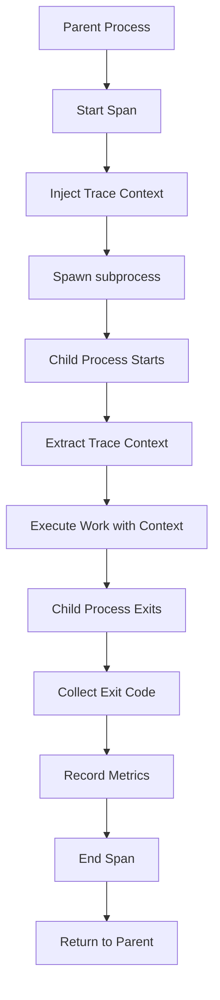

# How to Trace Python subprocess Calls with OpenTelemetry

Author: [nawazdhandala](https://www.github.com/nawazdhandala)

Tags: OpenTelemetry, Python, subprocess, Child Process, Tracing, Context Propagation

Description: Learn how to implement distributed tracing for Python subprocess calls using OpenTelemetry, including context propagation, exit code tracking, and comprehensive monitoring of child processes.

Python's subprocess module is essential for spawning child processes to run external commands, scripts, and system utilities. When these subprocess calls become part of your distributed system, understanding their execution time, success rates, and error patterns becomes critical. OpenTelemetry doesn't provide automatic subprocess instrumentation, but with custom spans and context propagation, you can achieve complete visibility into child process execution.

## Why Trace subprocess Calls

Applications use subprocess for various operations:

- Running external tools and command-line utilities
- Executing shell scripts for system operations
- Spawning data processing pipelines
- Calling external language runtimes (Node.js, Ruby, etc.)
- Running build tools and compilation processes

Without tracing, subprocess failures are difficult to debug. You lose visibility into execution time, error output, and how child processes fit into your distributed traces. Proper instrumentation makes subprocess calls observable and debuggable.

## Installation and Dependencies

```bash
# Install OpenTelemetry packages
pip install opentelemetry-api opentelemetry-sdk
pip install opentelemetry-exporter-otlp

# No special subprocess instrumentation needed - use built-in subprocess module
```

We'll use Python's standard subprocess module with custom OpenTelemetry spans to create comprehensive tracing.

## Basic subprocess Tracing

Here's how to trace a simple subprocess call:

```python
import subprocess
from opentelemetry import trace
from opentelemetry.sdk.trace import TracerProvider
from opentelemetry.sdk.trace.export import BatchSpanProcessor
from opentelemetry.exporter.otlp.proto.grpc.trace_exporter import OTLPSpanExporter
from opentelemetry.sdk.resources import Resource, SERVICE_NAME

# Configure OpenTelemetry
resource = Resource(attributes={
    SERVICE_NAME: "subprocess-orchestrator"
})

provider = TracerProvider(resource=resource)
otlp_exporter = OTLPSpanExporter(
    endpoint="http://localhost:4317",
    insecure=True
)
processor = BatchSpanProcessor(otlp_exporter)
provider.add_span_processor(processor)
trace.set_tracer_provider(provider)

tracer = trace.get_tracer(__name__)

def run_command_traced(command, shell=False):
    """Execute command with OpenTelemetry tracing"""

    with tracer.start_as_current_span("subprocess.run") as span:
        # Add command details to span
        if isinstance(command, list):
            cmd_str = " ".join(command)
            span.set_attribute("subprocess.command", cmd_str)
            span.set_attribute("subprocess.args", command)
        else:
            span.set_attribute("subprocess.command", command)

        span.set_attribute("subprocess.shell", shell)

        try:
            # Execute the command
            result = subprocess.run(
                command,
                shell=shell,
                capture_output=True,
                text=True,
                timeout=30
            )

            # Record execution results
            span.set_attribute("subprocess.returncode", result.returncode)
            span.set_attribute("subprocess.stdout_length", len(result.stdout))
            span.set_attribute("subprocess.stderr_length", len(result.stderr))

            if result.returncode != 0:
                span.set_attribute("subprocess.failed", True)
                span.set_attribute("subprocess.stderr", result.stderr[:500])  # Truncate
                span.set_status(trace.Status(trace.StatusCode.ERROR, "Command failed"))
            else:
                span.set_attribute("subprocess.failed", False)
                span.set_status(trace.Status(trace.StatusCode.OK))

            return result

        except subprocess.TimeoutExpired as e:
            span.record_exception(e)
            span.set_attribute("subprocess.timeout", True)
            span.set_status(trace.Status(trace.StatusCode.ERROR, "Command timeout"))
            raise

        except Exception as e:
            span.record_exception(e)
            span.set_status(trace.Status(trace.StatusCode.ERROR, str(e)))
            raise

# Example usage
result = run_command_traced(["ls", "-la", "/tmp"])
print(f"Exit code: {result.returncode}")
print(f"Output: {result.stdout}")
```

This creates a span for each subprocess call with command details, exit codes, and output sizes.

## Tracing Shell Commands

Shell commands often involve pipes and redirects. Trace them properly:

```python
def run_shell_pipeline(command):
    """Execute shell pipeline with comprehensive tracing"""

    with tracer.start_as_current_span("subprocess.shell_pipeline") as span:
        span.set_attribute("subprocess.command", command)
        span.set_attribute("subprocess.shell", True)
        span.set_attribute("subprocess.type", "pipeline")

        try:
            # Execute shell command with pipeline
            result = subprocess.run(
                command,
                shell=True,
                capture_output=True,
                text=True,
                timeout=60
            )

            span.set_attribute("subprocess.returncode", result.returncode)

            # Parse pipeline components for better observability
            if "|" in command:
                components = [c.strip() for c in command.split("|")]
                span.set_attribute("subprocess.pipeline_stages", len(components))
                for i, component in enumerate(components):
                    span.set_attribute(f"subprocess.stage_{i}", component)

            if result.returncode == 0:
                span.set_attribute("subprocess.output_lines", result.stdout.count("\n"))
                span.set_status(trace.Status(trace.StatusCode.OK))
            else:
                span.set_attribute("subprocess.error", result.stderr[:500])
                span.set_status(trace.Status(trace.StatusCode.ERROR))

            return result

        except Exception as e:
            span.record_exception(e)
            span.set_status(trace.Status(trace.StatusCode.ERROR, str(e)))
            raise

# Example: trace a complex shell pipeline
result = run_shell_pipeline(
    "cat /var/log/app.log | grep ERROR | wc -l"
)
print(f"Error count: {result.stdout.strip()}")
```

## Context Propagation to Child Processes

The real power comes from propagating trace context to child processes:

```python
import os
import json
from opentelemetry.propagate import inject, extract
from opentelemetry.trace.propagation.tracecontext import TraceContextTextMapPropagator

def run_with_context_propagation(command, shell=False):
    """Execute subprocess with trace context propagation"""

    with tracer.start_as_current_span("subprocess.run_with_context") as span:
        span.set_attribute("subprocess.command", str(command))

        # Prepare environment with trace context
        env = os.environ.copy()

        # Inject trace context into environment variables
        carrier = {}
        inject(carrier)

        # Convert carrier to environment variables
        if "traceparent" in carrier:
            env["TRACEPARENT"] = carrier["traceparent"]
        if "tracestate" in carrier:
            env["TRACESTATE"] = carrier["tracestate"]

        # Also pass as JSON for scripts that can parse it
        env["OTEL_TRACE_CONTEXT"] = json.dumps(carrier)

        span.set_attribute("subprocess.context_propagated", True)

        try:
            result = subprocess.run(
                command,
                shell=shell,
                capture_output=True,
                text=True,
                env=env,
                timeout=30
            )

            span.set_attribute("subprocess.returncode", result.returncode)

            if result.returncode == 0:
                span.set_status(trace.Status(trace.StatusCode.OK))
            else:
                span.set_status(trace.Status(trace.StatusCode.ERROR))
                span.set_attribute("subprocess.stderr", result.stderr[:500])

            return result

        except Exception as e:
            span.record_exception(e)
            span.set_status(trace.Status(trace.StatusCode.ERROR, str(e)))
            raise

# Example Python child script that extracts trace context
child_script = """
import os
import json
from opentelemetry import trace

# Extract trace context from environment
carrier = json.loads(os.environ.get('OTEL_TRACE_CONTEXT', '{}'))
ctx = extract(carrier)

# Continue the trace in the child process
tracer = trace.get_tracer(__name__)
with tracer.start_as_current_span('child_process_work', context=ctx) as span:
    span.set_attribute('process.type', 'child')
    # Do work here
    print('Child process executing with trace context')
"""

# Save and execute child script with context
with open('/tmp/child_script.py', 'w') as f:
    f.write(child_script)

result = run_with_context_propagation(['python', '/tmp/child_script.py'])
```

## Tracing Long-Running Processes

For processes that run for extended periods, monitor their execution:

```python
import time
import threading

def run_long_process_with_monitoring(command, check_interval=5):
    """Run long process with periodic status checks"""

    with tracer.start_as_current_span("subprocess.long_running") as span:
        span.set_attribute("subprocess.command", str(command))
        span.set_attribute("subprocess.monitoring.enabled", True)
        span.set_attribute("subprocess.monitoring.interval_seconds", check_interval)

        start_time = time.time()

        try:
            # Start process without waiting
            process = subprocess.Popen(
                command,
                stdout=subprocess.PIPE,
                stderr=subprocess.PIPE,
                text=True
            )

            span.set_attribute("subprocess.pid", process.pid)

            # Monitor process in separate thread
            def monitor_process():
                while process.poll() is None:
                    elapsed = time.time() - start_time
                    span.add_event(
                        "subprocess.status_check",
                        {
                            "elapsed_seconds": elapsed,
                            "process.running": True
                        }
                    )
                    time.sleep(check_interval)

            monitor_thread = threading.Thread(target=monitor_process, daemon=True)
            monitor_thread.start()

            # Wait for process to complete
            stdout, stderr = process.communicate(timeout=300)

            elapsed = time.time() - start_time

            span.set_attribute("subprocess.returncode", process.returncode)
            span.set_attribute("subprocess.elapsed_seconds", elapsed)
            span.set_attribute("subprocess.stdout_length", len(stdout))
            span.set_attribute("subprocess.stderr_length", len(stderr))

            if process.returncode == 0:
                span.set_status(trace.Status(trace.StatusCode.OK))
            else:
                span.set_attribute("subprocess.stderr", stderr[:500])
                span.set_status(trace.Status(trace.StatusCode.ERROR))

            return {
                "returncode": process.returncode,
                "stdout": stdout,
                "stderr": stderr,
                "elapsed": elapsed
            }

        except subprocess.TimeoutExpired:
            process.kill()
            span.set_attribute("subprocess.killed", True)
            span.set_attribute("subprocess.reason", "timeout")
            span.set_status(trace.Status(trace.StatusCode.ERROR, "Process timeout"))
            raise

        except Exception as e:
            process.kill()
            span.record_exception(e)
            span.set_status(trace.Status(trace.StatusCode.ERROR, str(e)))
            raise

# Example: run a long process
result = run_long_process_with_monitoring(
    ["python", "-c", "import time; time.sleep(20); print('done')"],
    check_interval=3
)
```

## Tracing Process Pools

When running multiple subprocesses concurrently, trace the entire pool:

```python
from concurrent.futures import ThreadPoolExecutor, as_completed

def run_parallel_commands(commands, max_workers=4):
    """Execute multiple commands in parallel with tracing"""

    with tracer.start_as_current_span("subprocess.parallel_execution") as span:
        span.set_attribute("subprocess.command_count", len(commands))
        span.set_attribute("subprocess.max_workers", max_workers)

        results = []
        futures = []

        with ThreadPoolExecutor(max_workers=max_workers) as executor:
            # Submit all commands
            for i, cmd in enumerate(commands):
                with tracer.start_as_current_span(f"subprocess.submit_{i}") as submit_span:
                    submit_span.set_attribute("subprocess.command", str(cmd))
                    submit_span.set_attribute("subprocess.index", i)

                    future = executor.submit(run_command_traced, cmd)
                    futures.append((i, future))

            # Collect results
            completed = 0
            failed = 0

            for i, future in futures:
                try:
                    with tracer.start_as_current_span(f"subprocess.collect_{i}") as collect_span:
                        result = future.result(timeout=60)
                        collect_span.set_attribute("subprocess.returncode", result.returncode)

                        if result.returncode == 0:
                            completed += 1
                        else:
                            failed += 1

                        results.append(result)

                except Exception as e:
                    with tracer.start_as_current_span(f"subprocess.error_{i}") as error_span:
                        error_span.record_exception(e)
                        failed += 1

            span.set_attribute("subprocess.completed", completed)
            span.set_attribute("subprocess.failed", failed)

            if failed == 0:
                span.set_status(trace.Status(trace.StatusCode.OK))
            else:
                span.set_status(trace.Status(trace.StatusCode.ERROR, f"{failed} commands failed"))

        return results

# Example: run multiple commands in parallel
commands = [
    ["echo", "Command 1"],
    ["sleep", "2"],
    ["echo", "Command 2"],
    ["ls", "-la"],
]

results = run_parallel_commands(commands, max_workers=2)
```

## Tracing Interactive Processes

For processes that require input/output interaction:

```python
def run_interactive_process(command, input_data=None):
    """Run interactive process with tracing"""

    with tracer.start_as_current_span("subprocess.interactive") as span:
        span.set_attribute("subprocess.command", str(command))
        span.set_attribute("subprocess.has_input", input_data is not None)

        if input_data:
            span.set_attribute("subprocess.input_length", len(input_data))

        try:
            process = subprocess.Popen(
                command,
                stdin=subprocess.PIPE,
                stdout=subprocess.PIPE,
                stderr=subprocess.PIPE,
                text=True
            )

            span.set_attribute("subprocess.pid", process.pid)

            # Send input and get output
            with tracer.start_as_current_span("subprocess.communicate") as comm_span:
                stdout, stderr = process.communicate(input=input_data, timeout=30)

                comm_span.set_attribute("subprocess.stdout_length", len(stdout))
                comm_span.set_attribute("subprocess.stderr_length", len(stderr))

            span.set_attribute("subprocess.returncode", process.returncode)

            if process.returncode == 0:
                span.set_status(trace.Status(trace.StatusCode.OK))
            else:
                span.set_attribute("subprocess.stderr", stderr[:500])
                span.set_status(trace.Status(trace.StatusCode.ERROR))

            return {
                "returncode": process.returncode,
                "stdout": stdout,
                "stderr": stderr
            }

        except Exception as e:
            span.record_exception(e)
            span.set_status(trace.Status(trace.StatusCode.ERROR, str(e)))
            raise

# Example: run interactive command
result = run_interactive_process(
    ["python", "-c", "name = input('Name: '); print(f'Hello {name}')"],
    input_data="World\n"
)
print(result["stdout"])
```

## subprocess Execution Flow

Here's how traces flow through subprocess operations:



## Tracing System Administration Commands

For system administration tasks, add detailed tracing:

```python
def run_system_command(command, description=None):
    """Run system administration command with detailed tracing"""

    with tracer.start_as_current_span("subprocess.system_admin") as span:
        span.set_attribute("subprocess.command", str(command))
        span.set_attribute("subprocess.type", "system_admin")

        if description:
            span.set_attribute("subprocess.description", description)

        # Add system context
        span.set_attribute("system.hostname", os.uname().nodename)
        span.set_attribute("system.user", os.getenv("USER", "unknown"))

        try:
            result = subprocess.run(
                command,
                capture_output=True,
                text=True,
                timeout=60
            )

            span.set_attribute("subprocess.returncode", result.returncode)

            # Parse common command outputs
            if command[0] == "df":
                # Disk space command
                span.set_attribute("command.type", "disk_space")
                lines = result.stdout.strip().split("\n")
                span.set_attribute("disk.filesystems_count", len(lines) - 1)

            elif command[0] == "free":
                # Memory command
                span.set_attribute("command.type", "memory_check")

            elif command[0] == "ps":
                # Process list
                span.set_attribute("command.type", "process_list")
                lines = result.stdout.strip().split("\n")
                span.set_attribute("processes.count", len(lines) - 1)

            if result.returncode == 0:
                span.set_status(trace.Status(trace.StatusCode.OK))
            else:
                span.set_status(trace.Status(trace.StatusCode.ERROR))

            return result

        except Exception as e:
            span.record_exception(e)
            span.set_status(trace.Status(trace.StatusCode.ERROR, str(e)))
            raise

# Examples of system commands
disk_usage = run_system_command(["df", "-h"], "Check disk usage")
processes = run_system_command(["ps", "aux"], "List running processes")
```

## Error Handling and Retry Logic

Implement retry logic with proper tracing:

```python
def run_with_retry(command, max_retries=3, backoff=1.0):
    """Execute command with retry logic and tracing"""

    with tracer.start_as_current_span("subprocess.with_retry") as span:
        span.set_attribute("subprocess.command", str(command))
        span.set_attribute("subprocess.max_retries", max_retries)

        for attempt in range(max_retries):
            with tracer.start_as_current_span(f"subprocess.attempt_{attempt}") as attempt_span:
                attempt_span.set_attribute("subprocess.attempt", attempt)

                try:
                    result = subprocess.run(
                        command,
                        capture_output=True,
                        text=True,
                        timeout=30
                    )

                    attempt_span.set_attribute("subprocess.returncode", result.returncode)

                    if result.returncode == 0:
                        attempt_span.set_status(trace.Status(trace.StatusCode.OK))
                        span.set_attribute("subprocess.succeeded_on_attempt", attempt)
                        return result

                    # Command failed, will retry
                    attempt_span.set_attribute("subprocess.will_retry", attempt < max_retries - 1)
                    attempt_span.set_status(trace.Status(trace.StatusCode.ERROR))

                    if attempt < max_retries - 1:
                        wait_time = backoff * (2 ** attempt)
                        attempt_span.set_attribute("subprocess.backoff_seconds", wait_time)
                        time.sleep(wait_time)

                except Exception as e:
                    attempt_span.record_exception(e)
                    attempt_span.set_status(trace.Status(trace.StatusCode.ERROR))

                    if attempt == max_retries - 1:
                        span.set_status(trace.Status(trace.StatusCode.ERROR, "Max retries exceeded"))
                        raise

                    wait_time = backoff * (2 ** attempt)
                    time.sleep(wait_time)

        # All retries failed
        span.set_attribute("subprocess.all_retries_failed", True)
        span.set_status(trace.Status(trace.StatusCode.ERROR, "Command failed after all retries"))
        return result

# Example with retry
result = run_with_retry(["curl", "--fail", "http://api.example.com/health"], max_retries=3)
```

## Tracing Build and Compilation Processes

For build tools and compilation, add specialized tracing:

```python
def run_build_command(build_type, command, artifacts=None):
    """Execute build command with build-specific tracing"""

    with tracer.start_as_current_span(f"subprocess.build.{build_type}") as span:
        span.set_attribute("build.type", build_type)
        span.set_attribute("build.command", str(command))

        if artifacts:
            span.set_attribute("build.expected_artifacts", artifacts)

        start_time = time.time()

        try:
            result = subprocess.run(
                command,
                capture_output=True,
                text=True,
                timeout=600  # 10 minutes for builds
            )

            build_time = time.time() - start_time

            span.set_attribute("build.duration_seconds", build_time)
            span.set_attribute("build.returncode", result.returncode)

            # Check for artifacts
            if artifacts:
                artifacts_found = []
                for artifact in artifacts:
                    if os.path.exists(artifact):
                        artifacts_found.append(artifact)
                        span.set_attribute(f"build.artifact.{artifact}.exists", True)
                        span.set_attribute(f"build.artifact.{artifact}.size",
                                         os.path.getsize(artifact))
                    else:
                        span.set_attribute(f"build.artifact.{artifact}.exists", False)

                span.set_attribute("build.artifacts_found", len(artifacts_found))

            # Parse build output for warnings/errors
            if "warning" in result.stdout.lower():
                warning_count = result.stdout.lower().count("warning")
                span.set_attribute("build.warnings", warning_count)

            if "error" in result.stdout.lower():
                error_count = result.stdout.lower().count("error")
                span.set_attribute("build.errors", error_count)

            if result.returncode == 0:
                span.set_attribute("build.status", "success")
                span.set_status(trace.Status(trace.StatusCode.OK))
            else:
                span.set_attribute("build.status", "failed")
                span.set_status(trace.Status(trace.StatusCode.ERROR))

            return result

        except Exception as e:
            span.record_exception(e)
            span.set_attribute("build.status", "error")
            span.set_status(trace.Status(trace.StatusCode.ERROR, str(e)))
            raise

# Example: trace a compilation
result = run_build_command(
    "go",
    ["go", "build", "-o", "myapp", "main.go"],
    artifacts=["myapp"]
)
```

## Production Best Practices

Configure subprocess tracing for production environments:

```python
import os

def create_traced_subprocess_runner():
    """Factory for production subprocess runner"""

    resource = Resource(attributes={
        SERVICE_NAME: os.getenv("SERVICE_NAME", "subprocess-runner"),
        "deployment.environment": os.getenv("ENVIRONMENT", "production"),
        "host.name": os.getenv("HOSTNAME", "unknown"),
    })

    provider = TracerProvider(resource=resource)

    otlp_endpoint = os.getenv("OTEL_EXPORTER_OTLP_ENDPOINT", "http://localhost:4317")
    otlp_exporter = OTLPSpanExporter(endpoint=otlp_endpoint, insecure=False)

    processor = BatchSpanProcessor(otlp_exporter)
    provider.add_span_processor(processor)
    trace.set_tracer_provider(provider)

    tracer = trace.get_tracer(__name__)

    def run_subprocess(command, **kwargs):
        """Production-ready subprocess execution with tracing"""

        with tracer.start_as_current_span("subprocess.exec") as span:
            span.set_attribute("subprocess.command", str(command))

            # Add security context
            span.set_attribute("security.user", os.getenv("USER"))
            span.set_attribute("security.cwd", os.getcwd())

            # Sanitize command for logging (remove sensitive data)
            if isinstance(command, list):
                sanitized = [arg if "password" not in arg.lower() else "***" for arg in command]
                span.set_attribute("subprocess.sanitized_command", str(sanitized))

            try:
                result = subprocess.run(command, **kwargs)
                span.set_attribute("subprocess.returncode", result.returncode)

                if result.returncode == 0:
                    span.set_status(trace.Status(trace.StatusCode.OK))
                else:
                    span.set_status(trace.Status(trace.StatusCode.ERROR))

                return result

            except Exception as e:
                span.record_exception(e)
                span.set_status(trace.Status(trace.StatusCode.ERROR, str(e)))
                raise

    return run_subprocess
```

Tracing subprocess calls with OpenTelemetry gives you complete visibility into child process execution. By creating custom spans with command details, exit codes, and execution times, you can debug subprocess issues quickly. Context propagation connects parent and child processes in distributed traces, while monitoring long-running processes and parallel execution provides insights into complex workflows. This level of observability is essential for production systems that rely on external commands and child processes.
