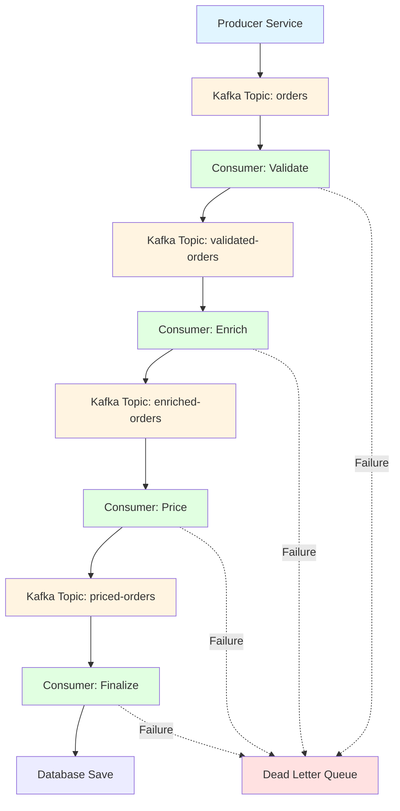

# How to Trace Quarkus Reactive Messaging with OpenTelemetry

Author: [nawazdhandala](https://www.github.com/nawazdhandala)

Tags: OpenTelemetry, Quarkus, Reactive Messaging, SmallRye, Java, Kafka

Description: Learn how to implement distributed tracing for Quarkus Reactive Messaging applications using OpenTelemetry to track messages across Kafka and other messaging systems.

Reactive messaging has become fundamental to building scalable, event-driven microservices. Quarkus uses SmallRye Reactive Messaging to provide a declarative way to build message-driven applications. However, tracking messages as they flow through your system presents unique challenges compared to traditional request-response patterns. OpenTelemetry solves this by propagating trace context through message headers, enabling end-to-end visibility across your messaging infrastructure.

This guide demonstrates how to instrument Quarkus Reactive Messaging applications with OpenTelemetry, covering everything from basic message tracing to complex event processing scenarios.

## Understanding Reactive Messaging Tracing Challenges

Unlike HTTP requests where request and response happen in a single flow, messaging systems involve producers and consumers that operate independently. A message might be produced in one service, consumed by another, and trigger additional messages. Tracing these asynchronous flows requires propagating context through message headers and correctly linking spans across service boundaries.

Quarkus Reactive Messaging with OpenTelemetry handles this complexity by automatically injecting trace context into outgoing messages and extracting it from incoming messages. This creates a distributed trace that spans the entire message flow.

## Project Setup with Dependencies

Start by adding the necessary dependencies for Quarkus, Reactive Messaging, Kafka, and OpenTelemetry.

```xml
<!-- Add to pom.xml -->
<dependencies>
    <!-- Core Quarkus OpenTelemetry extension -->
    <dependency>
        <groupId>io.quarkus</groupId>
        <artifactId>quarkus-opentelemetry</artifactId>
    </dependency>

    <!-- SmallRye Reactive Messaging -->
    <dependency>
        <groupId>io.quarkus</groupId>
        <artifactId>quarkus-smallrye-reactive-messaging</artifactId>
    </dependency>

    <!-- Kafka connector for Reactive Messaging -->
    <dependency>
        <groupId>io.quarkus</groupId>
        <artifactId>quarkus-smallrye-reactive-messaging-kafka</artifactId>
    </dependency>

    <!-- Optional: AMQP connector -->
    <dependency>
        <groupId>io.quarkus</groupId>
        <artifactId>quarkus-smallrye-reactive-messaging-amqp</artifactId>
    </dependency>
</dependencies>
```

Configure OpenTelemetry and your messaging connectors in `application.properties`.

```properties
# OpenTelemetry configuration
quarkus.otel.enabled=true
quarkus.otel.exporter.otlp.endpoint=http://localhost:4317
quarkus.otel.service.name=reactive-messaging-service

# Enable tracing for messaging
quarkus.otel.instrument.messaging=true

# Kafka broker configuration
kafka.bootstrap.servers=localhost:9092

# Incoming channel configuration
mp.messaging.incoming.orders.connector=smallrye-kafka
mp.messaging.incoming.orders.topic=orders-topic
mp.messaging.incoming.orders.group.id=order-processor
mp.messaging.incoming.orders.key.deserializer=org.apache.kafka.common.serialization.StringDeserializer
mp.messaging.incoming.orders.value.deserializer=io.quarkus.kafka.client.serialization.JsonbDeserializer

# Outgoing channel configuration
mp.messaging.outgoing.notifications.connector=smallrye-kafka
mp.messaging.outgoing.notifications.topic=notifications-topic
mp.messaging.outgoing.notifications.key.serializer=org.apache.kafka.common.serialization.StringSerializer
mp.messaging.outgoing.notifications.value.serializer=io.quarkus.kafka.client.serialization.JsonbSerializer
```

## Tracing Message Producers

Create a message producer that automatically includes trace context in outgoing messages.

```java
package com.example.messaging;

import io.opentelemetry.api.trace.Span;
import io.opentelemetry.api.trace.Tracer;
import io.smallrye.reactive.messaging.kafka.api.OutgoingKafkaRecordMetadata;
import jakarta.enterprise.context.ApplicationScoped;
import jakarta.inject.Inject;
import org.eclipse.microprofile.reactive.messaging.Channel;
import org.eclipse.microprofile.reactive.messaging.Emitter;
import org.eclipse.microprofile.reactive.messaging.Message;

@ApplicationScoped
public class OrderProducer {

    @Inject
    Tracer tracer;

    @Inject
    @Channel("notifications")
    Emitter<OrderEvent> notificationEmitter;

    public void publishOrderCreated(Order order) {
        // Create a custom span for the publishing operation
        Span span = tracer.spanBuilder("publish-order-created")
            .startSpan();

        try (var scope = span.makeCurrent()) {
            // Add custom attributes to track business metrics
            span.setAttribute("order.id", order.getId());
            span.setAttribute("order.amount", order.getAmount());
            span.setAttribute("order.customer_id", order.getCustomerId());

            OrderEvent event = new OrderEvent(
                order.getId(),
                "ORDER_CREATED",
                order.getTimestamp()
            );

            // Create Kafka metadata for the message
            OutgoingKafkaRecordMetadata<String> metadata =
                OutgoingKafkaRecordMetadata.<String>builder()
                    .withKey(order.getId().toString())
                    .withTopic("notifications-topic")
                    .build();

            // Send message with metadata
            // OpenTelemetry automatically injects trace context into headers
            Message<OrderEvent> message = Message.of(event)
                .addMetadata(metadata);

            notificationEmitter.send(message);

            span.addEvent("order_event_published");

        } finally {
            span.end();
        }
    }
}
```

## Tracing Message Consumers

Create a consumer that extracts trace context from incoming messages and continues the distributed trace.

```java
package com.example.messaging;

import io.opentelemetry.api.trace.Span;
import io.opentelemetry.api.trace.SpanKind;
import io.opentelemetry.api.trace.Tracer;
import io.opentelemetry.context.Scope;
import io.smallrye.reactive.messaging.kafka.api.IncomingKafkaRecordMetadata;
import jakarta.enterprise.context.ApplicationScoped;
import jakarta.inject.Inject;
import org.eclipse.microprofile.reactive.messaging.Incoming;
import org.eclipse.microprofile.reactive.messaging.Message;

import java.util.concurrent.CompletionStage;

@ApplicationScoped
public class OrderConsumer {

    @Inject
    Tracer tracer;

    @Inject
    OrderService orderService;

    @Inject
    NotificationService notificationService;

    // Consumer method that processes incoming orders
    // OpenTelemetry automatically extracts trace context from headers
    @Incoming("orders")
    public CompletionStage<Void> processOrder(Message<OrderEvent> message) {
        OrderEvent event = message.getPayload();

        // Get the current span (automatically created from message context)
        Span span = Span.current();
        span.setAttribute("order.id", event.getOrderId());
        span.setAttribute("order.event_type", event.getEventType());

        // Extract Kafka metadata if needed
        message.getMetadata(IncomingKafkaRecordMetadata.class)
            .ifPresent(metadata -> {
                span.setAttribute("kafka.topic", metadata.getTopic());
                span.setAttribute("kafka.partition", metadata.getPartition());
                span.setAttribute("kafka.offset", metadata.getOffset());
            });

        // Create a child span for business logic
        Span processingSpan = tracer.spanBuilder("process-order-event")
            .setSpanKind(SpanKind.INTERNAL)
            .startSpan();

        try (Scope scope = processingSpan.makeCurrent()) {
            // Process the order
            Order order = orderService.findById(event.getOrderId());
            processingSpan.setAttribute("order.status", order.getStatus());
            processingSpan.setAttribute("order.total", order.getTotal());

            // Update order status
            orderService.updateStatus(order.getId(), "PROCESSING");
            processingSpan.addEvent("order_status_updated");

            // Send notification (this might trigger another message)
            notificationService.sendOrderConfirmation(order);
            processingSpan.addEvent("notification_sent");

            return message.ack();

        } catch (Exception e) {
            processingSpan.recordException(e);
            span.recordException(e);
            return message.nack(e);
        } finally {
            processingSpan.end();
        }
    }
}
```

## Building Message Processing Pipelines

Create complex message processing pipelines where messages flow through multiple stages, each tracked as a separate span.

```java
package com.example.messaging;

import io.opentelemetry.api.trace.Span;
import io.opentelemetry.api.trace.Tracer;
import io.smallrye.mutiny.Uni;
import jakarta.enterprise.context.ApplicationScoped;
import jakarta.inject.Inject;
import org.eclipse.microprofile.reactive.messaging.Incoming;
import org.eclipse.microprofile.reactive.messaging.Outgoing;
import org.eclipse.microprofile.reactive.messaging.Message;

@ApplicationScoped
public class OrderPipeline {

    @Inject
    Tracer tracer;

    @Inject
    ValidationService validationService;

    @Inject
    EnrichmentService enrichmentService;

    @Inject
    PricingService pricingService;

    // Stage 1: Validate incoming orders
    @Incoming("raw-orders")
    @Outgoing("validated-orders")
    public Message<OrderEvent> validateOrder(Message<OrderEvent> message) {
        Span span = tracer.spanBuilder("validate-order").startSpan();

        try (var scope = span.makeCurrent()) {
            OrderEvent event = message.getPayload();
            span.setAttribute("order.id", event.getOrderId());

            // Perform validation
            ValidationResult result = validationService.validate(event);
            span.setAttribute("validation.passed", result.isValid());

            if (!result.isValid()) {
                span.addEvent("validation_failed");
                span.setAttribute("validation.errors", result.getErrors().toString());
                return message.nack(new ValidationException(result.getErrors()));
            }

            span.addEvent("validation_passed");
            return message;

        } finally {
            span.end();
        }
    }

    // Stage 2: Enrich order data
    @Incoming("validated-orders")
    @Outgoing("enriched-orders")
    public Uni<Message<EnrichedOrder>> enrichOrder(Message<OrderEvent> message) {
        Span span = tracer.spanBuilder("enrich-order").startSpan();

        try (var scope = span.makeCurrent()) {
            OrderEvent event = message.getPayload();
            span.setAttribute("order.id", event.getOrderId());

            // Asynchronously enrich the order with customer data
            return enrichmentService.enrichWithCustomerData(event)
                .invoke(enriched -> {
                    span.setAttribute("customer.tier", enriched.getCustomerTier());
                    span.setAttribute("customer.lifetime_value", enriched.getLifetimeValue());
                    span.addEvent("order_enriched");
                })
                .map(enriched -> Message.of(enriched))
                .eventually(() -> span.end());
        }
    }

    // Stage 3: Calculate pricing
    @Incoming("enriched-orders")
    @Outgoing("priced-orders")
    public Message<PricedOrder> calculatePricing(Message<EnrichedOrder> message) {
        Span span = tracer.spanBuilder("calculate-pricing").startSpan();

        try (var scope = span.makeCurrent()) {
            EnrichedOrder enriched = message.getPayload();
            span.setAttribute("order.id", enriched.getOrderId());

            // Apply pricing rules based on customer tier
            PricedOrder priced = pricingService.applyPricing(enriched);

            span.setAttribute("pricing.subtotal", priced.getSubtotal());
            span.setAttribute("pricing.discount", priced.getDiscount());
            span.setAttribute("pricing.total", priced.getTotal());
            span.addEvent("pricing_calculated");

            return Message.of(priced);

        } finally {
            span.end();
        }
    }

    // Stage 4: Final processing
    @Incoming("priced-orders")
    public CompletionStage<Void> finalizeOrder(Message<PricedOrder> message) {
        Span span = tracer.spanBuilder("finalize-order").startSpan();

        try (var scope = span.makeCurrent()) {
            PricedOrder priced = message.getPayload();
            span.setAttribute("order.id", priced.getOrderId());
            span.setAttribute("order.final_total", priced.getTotal());

            // Save to database and acknowledge
            orderService.save(priced);
            span.addEvent("order_finalized");

            return message.ack();

        } finally {
            span.end();
        }
    }
}
```

## Handling Dead Letter Queues

Implement proper error handling and dead letter queue patterns with tracing.

```java
package com.example.messaging;

import io.opentelemetry.api.trace.Span;
import io.opentelemetry.api.trace.StatusCode;
import io.opentelemetry.api.trace.Tracer;
import io.smallrye.reactive.messaging.kafka.api.OutgoingKafkaRecordMetadata;
import jakarta.enterprise.context.ApplicationScoped;
import jakarta.inject.Inject;
import org.eclipse.microprofile.reactive.messaging.Channel;
import org.eclipse.microprofile.reactive.messaging.Emitter;
import org.eclipse.microprofile.reactive.messaging.Incoming;
import org.eclipse.microprofile.reactive.messaging.Message;

import java.util.concurrent.CompletionStage;

@ApplicationScoped
public class ResilientOrderProcessor {

    @Inject
    Tracer tracer;

    @Inject
    @Channel("dead-letter-queue")
    Emitter<FailedMessage> dlqEmitter;

    private static final int MAX_RETRIES = 3;

    @Incoming("orders-with-retry")
    public CompletionStage<Void> processWithRetry(Message<OrderEvent> message) {
        Span span = Span.current();
        OrderEvent event = message.getPayload();

        span.setAttribute("order.id", event.getOrderId());

        // Get retry count from message metadata
        int retryCount = getRetryCount(message);
        span.setAttribute("retry.count", retryCount);

        try {
            // Attempt to process the order
            processOrder(event);
            span.addEvent("processing_successful");
            return message.ack();

        } catch (TransientException e) {
            // Transient error - retry if under max retries
            span.addEvent("transient_error_occurred");
            span.recordException(e);

            if (retryCount < MAX_RETRIES) {
                span.setAttribute("retry.action", "requeue");
                return message.nack(e); // Will be retried
            } else {
                // Max retries exceeded - send to DLQ
                span.setAttribute("retry.action", "send_to_dlq");
                span.setStatus(StatusCode.ERROR, "Max retries exceeded");
                sendToDeadLetterQueue(event, e, retryCount);
                return message.ack(); // Acknowledge to prevent reprocessing
            }

        } catch (PermanentException e) {
            // Permanent error - send directly to DLQ
            span.addEvent("permanent_error_occurred");
            span.recordException(e);
            span.setStatus(StatusCode.ERROR, "Permanent processing failure");
            sendToDeadLetterQueue(event, e, retryCount);
            return message.ack();
        }
    }

    private void sendToDeadLetterQueue(OrderEvent event, Exception error, int retryCount) {
        Span span = tracer.spanBuilder("send-to-dlq").startSpan();

        try (var scope = span.makeCurrent()) {
            span.setAttribute("original.order_id", event.getOrderId());
            span.setAttribute("error.type", error.getClass().getSimpleName());
            span.setAttribute("retry.final_count", retryCount);

            FailedMessage failedMsg = new FailedMessage(
                event,
                error.getMessage(),
                retryCount,
                System.currentTimeMillis()
            );

            OutgoingKafkaRecordMetadata<String> metadata =
                OutgoingKafkaRecordMetadata.<String>builder()
                    .withKey(event.getOrderId().toString())
                    .build();

            Message<FailedMessage> dlqMessage = Message.of(failedMsg)
                .addMetadata(metadata);

            dlqEmitter.send(dlqMessage);
            span.addEvent("message_sent_to_dlq");

        } finally {
            span.end();
        }
    }

    private int getRetryCount(Message<?> message) {
        // Extract retry count from message metadata or headers
        return message.getMetadata(IncomingKafkaRecordMetadata.class)
            .flatMap(metadata -> {
                var headers = metadata.getHeaders();
                var retryHeader = headers.lastHeader("retry-count");
                if (retryHeader != null) {
                    return Optional.of(Integer.parseInt(new String(retryHeader.value())));
                }
                return Optional.empty();
            })
            .orElse(0);
    }
}
```

## Visualizing Message Flow Traces

Here's how traces flow through a reactive messaging pipeline:



## Advanced Tracing Patterns for Batch Processing

Handle batch message processing with proper trace context propagation.

```java
package com.example.messaging;

import io.opentelemetry.api.trace.Span;
import io.opentelemetry.api.trace.Tracer;
import io.smallrye.mutiny.Multi;
import jakarta.enterprise.context.ApplicationScoped;
import jakarta.inject.Inject;
import org.eclipse.microprofile.reactive.messaging.Incoming;
import org.eclipse.microprofile.reactive.messaging.Message;

import java.time.Duration;
import java.util.List;

@ApplicationScoped
public class BatchOrderProcessor {

    @Inject
    Tracer tracer;

    @Inject
    BatchProcessingService batchService;

    @Incoming("orders-batch")
    public void processBatch(Multi<Message<OrderEvent>> messages) {
        // Create a parent span for the entire batch
        Span batchSpan = tracer.spanBuilder("process-order-batch").startSpan();

        try (var scope = batchSpan.makeCurrent()) {
            // Collect messages into batches of 100 or every 5 seconds
            messages
                .group().intoLists().of(100, Duration.ofSeconds(5))
                .subscribe().with(batch -> {
                    batchSpan.setAttribute("batch.size", batch.size());
                    batchSpan.addEvent("batch_collected");

                    // Create a span for processing this specific batch
                    Span processingSpan = tracer.spanBuilder("process-batch-items")
                        .startSpan();

                    try (var innerScope = processingSpan.makeCurrent()) {
                        List<OrderEvent> events = batch.stream()
                            .map(Message::getPayload)
                            .toList();

                        // Process the batch
                        batchService.processBatch(events);
                        processingSpan.setAttribute("batch.processed", events.size());
                        processingSpan.addEvent("batch_processed");

                        // Acknowledge all messages in the batch
                        batch.forEach(msg -> msg.ack());

                    } catch (Exception e) {
                        processingSpan.recordException(e);
                        batch.forEach(msg -> msg.nack(e));
                    } finally {
                        processingSpan.end();
                    }
                });

        } finally {
            batchSpan.end();
        }
    }
}
```

## Testing Reactive Messaging Traces

Write tests to verify that trace context propagates correctly through your messaging flows.

```java
package com.example.messaging;

import io.opentelemetry.api.trace.SpanKind;
import io.opentelemetry.sdk.testing.junit5.OpenTelemetryExtension;
import io.opentelemetry.sdk.trace.data.SpanData;
import io.quarkus.test.junit.QuarkusTest;
import io.smallrye.reactive.messaging.memory.InMemoryConnector;
import io.smallrye.reactive.messaging.memory.InMemorySource;
import jakarta.inject.Inject;
import org.junit.jupiter.api.Test;
import org.junit.jupiter.api.extension.RegisterExtension;

import java.util.List;

import static org.junit.jupiter.api.Assertions.*;

@QuarkusTest
public class OrderPipelineTest {

    @RegisterExtension
    static final OpenTelemetryExtension otelTesting = OpenTelemetryExtension.create();

    @Inject
    InMemoryConnector connector;

    @Test
    public void testOrderPipelineCreatesSpans() {
        // Get the in-memory source for testing
        InMemorySource<OrderEvent> source = connector.source("raw-orders");

        // Send a test message
        OrderEvent testEvent = new OrderEvent(123L, "ORDER_CREATED", System.currentTimeMillis());
        source.send(testEvent);

        // Wait for processing
        await().atMost(Duration.ofSeconds(5))
            .until(() -> otelTesting.getSpans().size() >= 4);

        // Verify spans were created for each stage
        List<SpanData> spans = otelTesting.getSpans();

        SpanData validateSpan = findSpanByName(spans, "validate-order");
        assertNotNull(validateSpan);
        assertEquals(SpanKind.INTERNAL, validateSpan.getKind());

        SpanData enrichSpan = findSpanByName(spans, "enrich-order");
        assertNotNull(enrichSpan);

        SpanData pricingSpan = findSpanByName(spans, "calculate-pricing");
        assertNotNull(pricingSpan);

        SpanData finalizeSpan = findSpanByName(spans, "finalize-order");
        assertNotNull(finalizeSpan);

        // Verify spans form a proper trace
        String traceId = validateSpan.getTraceId();
        assertTrue(spans.stream().allMatch(s -> s.getTraceId().equals(traceId)));
    }

    private SpanData findSpanByName(List<SpanData> spans, String name) {
        return spans.stream()
            .filter(s -> s.getName().equals(name))
            .findFirst()
            .orElse(null);
    }
}
```

Tracing reactive messaging in Quarkus provides complete visibility into your event-driven architecture. The automatic context propagation combined with custom spans gives you the tools to debug complex message flows, identify performance bottlenecks, and understand how events cascade through your system. Start with the automatic instrumentation and layer in custom spans where you need deeper insights into your business logic.
