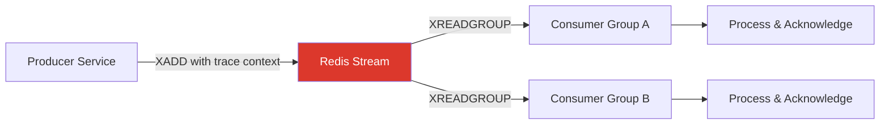

# How to Trace Redis Streams with OpenTelemetry

Author: [nawazdhandala](https://www.github.com/nawazdhandala)

Tags: OpenTelemetry, Redis, Streams, Tracing, Distributed Systems, Messaging

Description: Learn how to trace Redis Streams producers and consumers with OpenTelemetry for full visibility into your event-driven pipelines.

---

Redis Streams is a powerful append-only log data structure that many teams use for event sourcing, message brokering, and real-time data pipelines. But once you start running consumer groups across multiple services, understanding what happens to each message from production to consumption gets tricky fast. OpenTelemetry gives you the tools to trace every message through its full lifecycle, connecting producers to consumers with distributed context propagation.

This guide walks you through instrumenting Redis Streams with OpenTelemetry so you can see exactly how data flows through your streaming pipelines.

## Why Tracing Redis Streams Matters

Redis Streams sits at the boundary between services. A producer writes a message, and one or more consumer groups pick it up asynchronously. Without tracing, you lose visibility at that boundary. You might know that a producer sent a message and that a consumer processed something, but you have no way to connect the two into a single coherent trace.

Tracing Redis Streams gives you:

- End-to-end latency measurements from production to consumption
- Visibility into consumer group lag and processing delays
- Error correlation between producers and the consumers that handle their messages
- Clear understanding of fan-out patterns when multiple consumer groups read from the same stream



## Setting Up the OpenTelemetry SDK

Before instrumenting Redis Streams specifically, you need the base OpenTelemetry SDK configured in your application. Here is a Python setup that works well for stream processing workloads.

```python
# Initialize OpenTelemetry with OTLP export for stream tracing
from opentelemetry import trace, context
from opentelemetry.sdk.trace import TracerProvider
from opentelemetry.sdk.trace.export import BatchSpanProcessor
from opentelemetry.exporter.otlp.proto.grpc.trace_exporter import OTLPSpanExporter
from opentelemetry.sdk.resources import Resource

# Define service identity for trace correlation
resource = Resource.create({
    "service.name": "redis-stream-processor",
    "service.version": "1.0.0",
})

# Configure the tracer provider with batch processing
provider = TracerProvider(resource=resource)
processor = BatchSpanProcessor(
    OTLPSpanExporter(endpoint="http://localhost:4317")
)
provider.add_span_processor(processor)
trace.set_tracer_provider(provider)

tracer = trace.get_tracer("redis.streams")
```

This sets up a tracer provider that exports spans over OTLP to your collector. The `BatchSpanProcessor` buffers spans and sends them in batches, which is important for high-throughput stream processing where you do not want tracing overhead to slow down message handling.

## Instrumenting the Producer

The producer side is where trace context originates. When you add a message to a Redis Stream using XADD, you need to inject the current trace context into the message payload so consumers can pick it up and continue the trace.

```python
import redis
import json
from opentelemetry.context.propagation import get_global_textmap_propagator

r = redis.Redis(host="localhost", port=6379, decode_responses=True)

def produce_message(stream_name, payload):
    # Start a new span for the produce operation
    with tracer.start_as_current_span(
        f"{stream_name} send",
        kind=trace.SpanKind.PRODUCER,
        attributes={
            "messaging.system": "redis",
            "messaging.destination.name": stream_name,
            "messaging.operation": "publish",
            "messaging.redis.stream": stream_name,
        }
    ) as span:
        # Inject trace context into a carrier dict
        carrier = {}
        get_global_textmap_propagator().inject(carrier)

        # Add trace context as message fields alongside the payload
        message_fields = {
            "data": json.dumps(payload),
            "traceparent": carrier.get("traceparent", ""),
            "tracestate": carrier.get("tracestate", ""),
        }

        # XADD the message with embedded trace context
        message_id = r.xadd(stream_name, message_fields)
        span.set_attribute("messaging.message.id", message_id)

        return message_id
```

The key idea here is that we serialize the W3C Trace Context headers (traceparent and tracestate) directly into the Redis Stream message fields. This is how the consumer will know which trace to continue. The span kind is set to PRODUCER, which tells your tracing backend that this is the origination point of an async message.

## Instrumenting the Consumer

On the consumer side, you extract the trace context from the message and create a new span that links back to the producer span. This is what creates the connected trace across the async boundary.

```python
from opentelemetry.propagate import extract

def process_messages(stream_name, group_name, consumer_name):
    # Ensure consumer group exists
    try:
        r.xgroup_create(stream_name, group_name, id="0", mkstream=True)
    except redis.exceptions.ResponseError:
        pass  # Group already exists

    while True:
        # Read from the consumer group
        messages = r.xreadgroup(
            group_name, consumer_name,
            {stream_name: ">"},
            count=10,
            block=5000
        )

        for stream, message_list in messages:
            for message_id, fields in message_list:
                # Extract trace context from the message fields
                carrier = {
                    "traceparent": fields.get("traceparent", ""),
                    "tracestate": fields.get("tracestate", ""),
                }
                extracted_context = extract(carrier)

                # Create a consumer span linked to the producer trace
                with tracer.start_as_current_span(
                    f"{stream_name} process",
                    context=extracted_context,
                    kind=trace.SpanKind.CONSUMER,
                    attributes={
                        "messaging.system": "redis",
                        "messaging.source.name": stream_name,
                        "messaging.operation": "process",
                        "messaging.message.id": message_id,
                        "messaging.consumer.group": group_name,
                        "messaging.consumer.id": consumer_name,
                    }
                ) as span:
                    try:
                        # Parse and process the actual payload
                        payload = json.loads(fields.get("data", "{}"))
                        handle_payload(payload)

                        # Acknowledge the message after successful processing
                        r.xack(stream_name, group_name, message_id)
                        span.set_attribute("messaging.redis.acknowledged", True)
                    except Exception as e:
                        span.set_status(trace.StatusCode.ERROR, str(e))
                        span.record_exception(e)
```

The `extract` function reads the W3C headers from the carrier and rebuilds the context. By passing `context=extracted_context` to `start_as_current_span`, the consumer span becomes a child of the producer span. This means when you look at a trace in your backend, you will see the full journey of a message from the producer through the consumer.

## Tracking Consumer Group Lag

Beyond individual message traces, you want to monitor the overall health of your consumer groups. Consumer lag tells you how far behind a consumer group is from the latest messages in the stream. You can collect this as a metric alongside your traces.

```python
from opentelemetry import metrics

meter = metrics.get_meter("redis.streams.metrics")

# Create a gauge for tracking consumer lag
lag_gauge = meter.create_observable_gauge(
    name="redis.stream.consumer_group.lag",
    description="Number of pending messages in consumer group",
    unit="messages",
    callbacks=[lambda options: observe_lag(options)],
)

def observe_lag(options):
    # Get stream info for all monitored streams
    streams_to_monitor = ["orders", "events", "notifications"]

    for stream_name in streams_to_monitor:
        try:
            # XINFO GROUPS returns consumer group details
            groups = r.xinfo_groups(stream_name)
            for group in groups:
                yield metrics.Observation(
                    value=group["pending"],
                    attributes={
                        "messaging.redis.stream": stream_name,
                        "messaging.consumer.group": group["name"],
                    }
                )
        except redis.exceptions.ResponseError:
            pass
```

This observable gauge periodically reports how many messages are pending (delivered but not yet acknowledged) per consumer group. When you correlate this metric with your trace data, you can quickly identify whether processing slowdowns are caused by individual slow messages or systemic consumer lag.

## Handling Pending Message Recovery

When consumers crash, messages stay in the pending list. Recovering these messages is a critical operation that also deserves tracing, because you want to know how long a message sat unprocessed and what happened when it was retried.

```python
def recover_pending_messages(stream_name, group_name, consumer_name, min_idle_ms=60000):
    # Claim messages that have been idle for too long
    with tracer.start_as_current_span(
        f"{stream_name} recover",
        kind=trace.SpanKind.CONSUMER,
        attributes={
            "messaging.system": "redis",
            "messaging.operation": "recover",
            "messaging.redis.min_idle_ms": min_idle_ms,
        }
    ) as recovery_span:
        # XAUTOCLAIM moves idle messages to this consumer
        result = r.xautoclaim(
            stream_name, group_name, consumer_name,
            min_idle_time=min_idle_ms, start_id="0-0", count=100
        )

        claimed_messages = result[1]
        recovery_span.set_attribute(
            "messaging.redis.recovered_count", len(claimed_messages)
        )

        for message_id, fields in claimed_messages:
            # Each recovered message gets its own processing span
            with tracer.start_as_current_span(
                f"{stream_name} reprocess",
                attributes={
                    "messaging.message.id": message_id,
                    "messaging.redis.redelivery": True,
                }
            ) as msg_span:
                try:
                    payload = json.loads(fields.get("data", "{}"))
                    handle_payload(payload)
                    r.xack(stream_name, group_name, message_id)
                except Exception as e:
                    msg_span.set_status(trace.StatusCode.ERROR, str(e))
                    msg_span.record_exception(e)
```

The recovery span wraps the entire claiming operation, while each individual message gets its own child span. The `messaging.redis.redelivery` attribute lets you filter for recovered messages in your trace backend and analyze whether reprocessed messages have different error profiles than first-delivery messages.

## Collector Configuration for Redis Stream Telemetry

Your OpenTelemetry Collector should be set up to receive and process the trace and metric data from your stream processors.

```yaml
# Collector config for Redis Streams telemetry
receivers:
  otlp:
    protocols:
      grpc:
        endpoint: 0.0.0.0:4317
      http:
        endpoint: 0.0.0.0:4318

processors:
  batch:
    timeout: 5s
    send_batch_size: 512
  # Add messaging-specific attributes for easier filtering
  attributes:
    actions:
      - key: messaging.system
        value: redis
        action: upsert

exporters:
  otlp:
    endpoint: https://your-oneuptime-instance.com:4317
    tls:
      insecure: false

service:
  pipelines:
    traces:
      receivers: [otlp]
      processors: [batch, attributes]
      exporters: [otlp]
    metrics:
      receivers: [otlp]
      processors: [batch]
      exporters: [otlp]
```

The batch processor is tuned with a 5-second timeout and a batch size of 512, which works well for stream processing workloads that generate many small spans. The attributes processor ensures all telemetry is tagged with the messaging system for consistent filtering.

## Wrapping Up

Tracing Redis Streams with OpenTelemetry gives you the ability to follow messages across service boundaries, measure real processing latency (not just queue time), and correlate errors back to the messages that caused them. The combination of distributed trace context propagation through message fields and consumer group lag metrics provides a complete observability picture for your streaming pipelines.

Start with producer and consumer span instrumentation, then add the lag metrics once you have the basic traces flowing. The pending message recovery tracing is especially valuable in production, where consumer crashes are inevitable and understanding retry behavior can save you hours of debugging.
