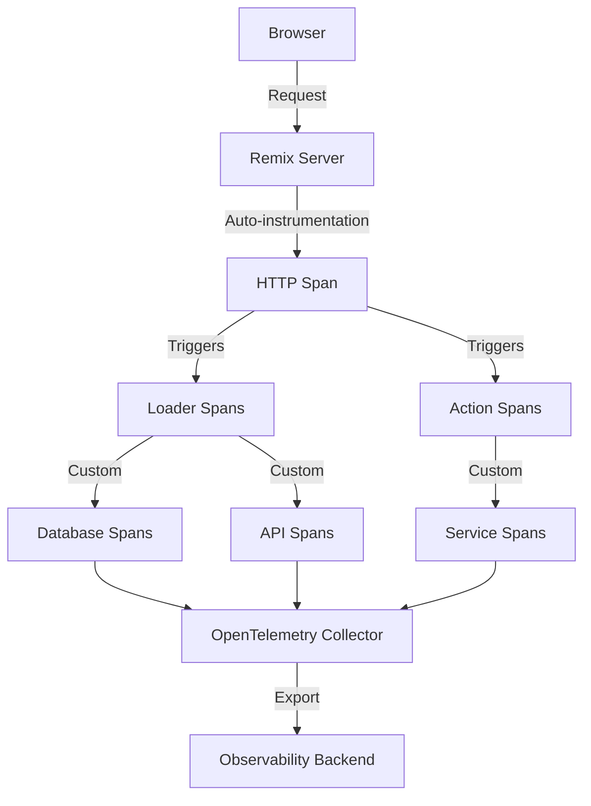

# How to Trace Remix Applications with OpenTelemetry

Author: [nawazdhandala](https://www.github.com/nawazdhandala)

Tags: OpenTelemetry, Remix, React, Node.js, Full-Stack, Tracing

Description: Complete guide to implementing distributed tracing in Remix applications using OpenTelemetry for monitoring full-stack performance and user experiences.

Remix has become a popular choice for building full-stack web applications with React, offering server-side rendering, optimistic UI updates, and nested routing out of the box. As your Remix application grows and handles more traffic, understanding performance bottlenecks across both server and client becomes critical. OpenTelemetry provides the instrumentation needed to trace requests from the browser through your loaders, actions, and backend services.

This guide walks through implementing comprehensive tracing for Remix applications, covering both server-side instrumentation and client-side monitoring to give you complete visibility into your full-stack application.

## Why Trace Remix Applications

Remix's architecture blurs the line between frontend and backend code. A single user interaction might trigger multiple loaders running in parallel on the server, each potentially calling different APIs or databases. Without proper tracing, debugging slow page loads or failed mutations becomes guesswork.

OpenTelemetry tracing helps you:

- Identify slow loaders delaying page rendering
- Track cascading data fetches across nested routes
- Monitor action execution times and error rates
- Correlate frontend user actions with backend processing
- Analyze performance across your entire stack

## Architecture Overview

Here's how OpenTelemetry integrates with a Remix application:



## Installing Dependencies

Start by installing the necessary OpenTelemetry packages for Node.js and Remix-specific instrumentation.

```bash
npm install @opentelemetry/api \
  @opentelemetry/sdk-node \
  @opentelemetry/auto-instrumentations-node \
  @opentelemetry/instrumentation-http \
  @opentelemetry/instrumentation-express \
  @opentelemetry/exporter-trace-otlp-http \
  @opentelemetry/resources \
  @opentelemetry/semantic-conventions
```

These packages provide automatic instrumentation for HTTP servers, Express middleware (which Remix uses internally), and exporters for sending traces to your observability backend.

## Setting Up OpenTelemetry Instrumentation

Create a dedicated instrumentation file that initializes OpenTelemetry before your Remix server starts. This ensures all HTTP requests and framework operations are captured.

```javascript
// instrumentation.js
// Initialize OpenTelemetry tracing for the Remix application
// This must be imported before any other application code

const { NodeSDK } = require('@opentelemetry/sdk-node');
const { getNodeAutoInstrumentations } = require('@opentelemetry/auto-instrumentations-node');
const { OTLPTraceExporter } = require('@opentelemetry/exporter-trace-otlp-http');
const { Resource } = require('@opentelemetry/resources');
const { SemanticResourceAttributes } = require('@opentelemetry/semantic-conventions');

// Configure the OTLP exporter to send traces to your collector
const traceExporter = new OTLPTraceExporter({
  url: process.env.OTEL_EXPORTER_OTLP_ENDPOINT || 'http://localhost:4318/v1/traces',
  headers: {},
});

// Create a resource that identifies this service
const resource = Resource.default().merge(
  new Resource({
    [SemanticResourceAttributes.SERVICE_NAME]: 'remix-app',
    [SemanticResourceAttributes.SERVICE_VERSION]: '1.0.0',
    [SemanticResourceAttributes.DEPLOYMENT_ENVIRONMENT]: process.env.NODE_ENV || 'development',
  })
);

// Initialize the SDK with automatic instrumentations
const sdk = new NodeSDK({
  resource,
  traceExporter,
  instrumentations: [
    getNodeAutoInstrumentations({
      // Customize auto-instrumentation behavior
      '@opentelemetry/instrumentation-http': {
        ignoreIncomingPaths: ['/health', '/metrics'],
      },
      '@opentelemetry/instrumentation-express': {
        enabled: true,
      },
      '@opentelemetry/instrumentation-fs': {
        enabled: false, // Disable filesystem tracing to reduce noise
      },
    }),
  ],
});

// Start the SDK and handle shutdown gracefully
sdk.start();

process.on('SIGTERM', () => {
  sdk.shutdown()
    .then(() => console.log('Tracing terminated'))
    .catch((error) => console.error('Error terminating tracing', error))
    .finally(() => process.exit(0));
});

module.exports = sdk;
```

## Modifying Your Server Entry Point

Update your Remix server entry point to load the instrumentation before any other code. This is crucial for auto-instrumentation to work properly.

```javascript
// server.js
// Import instrumentation FIRST, before any other imports
require('./instrumentation');

const path = require('path');
const express = require('express');
const compression = require('compression');
const morgan = require('morgan');
const { createRequestHandler } = require('@remix-run/express');

const BUILD_DIR = path.join(process.cwd(), 'build');

const app = express();

app.use(compression());
app.use('/build', express.static('public/build', { immutable: true, maxAge: '1y' }));
app.use(express.static('public', { maxAge: '1h' }));
app.use(morgan('tiny'));

// Remix request handler with OpenTelemetry context propagation
app.all(
  '*',
  createRequestHandler({
    build: require(BUILD_DIR),
    mode: process.env.NODE_ENV,
  })
);

const port = process.env.PORT || 3000;

app.listen(port, () => {
  console.log(`Express server listening on port ${port}`);
});
```

## Creating Custom Spans in Loaders

Automatic instrumentation captures HTTP requests, but you'll want custom spans to trace specific operations within your loaders and actions.

```typescript
// app/routes/users.$userId.tsx
// Loader with custom OpenTelemetry spans for database and API calls

import { json, LoaderFunctionArgs } from '@remix-run/node';
import { useLoaderData } from '@remix-run/react';
import { trace, context } from '@opentelemetry/api';

const tracer = trace.getTracer('remix-app-loaders');

interface User {
  id: string;
  name: string;
  email: string;
}

interface UserActivity {
  lastLogin: string;
  activityCount: number;
}

export async function loader({ params }: LoaderFunctionArgs) {
  const userId = params.userId;

  // Create a parent span for the entire loader operation
  return await tracer.startActiveSpan('loader.user.details', async (span) => {
    try {
      span.setAttribute('user.id', userId || 'unknown');
      span.setAttribute('route', '/users/:userId');

      // Fetch user data with a custom span
      const user = await tracer.startActiveSpan('db.fetch.user', async (dbSpan) => {
        dbSpan.setAttribute('db.operation', 'SELECT');
        dbSpan.setAttribute('db.table', 'users');

        try {
          const userData = await fetchUserFromDatabase(userId);
          dbSpan.setStatus({ code: 1 }); // OK status
          return userData;
        } catch (error) {
          dbSpan.recordException(error as Error);
          dbSpan.setStatus({ code: 2, message: (error as Error).message }); // ERROR status
          throw error;
        } finally {
          dbSpan.end();
        }
      });

      // Fetch user activity in parallel with another custom span
      const activity = await tracer.startActiveSpan('api.fetch.activity', async (apiSpan) => {
        apiSpan.setAttribute('api.endpoint', '/activity');
        apiSpan.setAttribute('user.id', userId || 'unknown');

        try {
          const activityData = await fetchUserActivity(userId);
          apiSpan.setStatus({ code: 1 });
          return activityData;
        } catch (error) {
          apiSpan.recordException(error as Error);
          apiSpan.setStatus({ code: 2, message: (error as Error).message });
          throw error;
        } finally {
          apiSpan.end();
        }
      });

      span.setStatus({ code: 1 });
      return json({ user, activity });
    } catch (error) {
      span.recordException(error as Error);
      span.setStatus({ code: 2, message: (error as Error).message });
      throw error;
    } finally {
      span.end();
    }
  });
}

// Simulated database fetch
async function fetchUserFromDatabase(userId: string | undefined): Promise<User> {
  // Simulate database query delay
  await new Promise(resolve => setTimeout(resolve, 50));
  return {
    id: userId || '1',
    name: 'John Doe',
    email: 'john@example.com',
  };
}

// Simulated API call
async function fetchUserActivity(userId: string | undefined): Promise<UserActivity> {
  await new Promise(resolve => setTimeout(resolve, 100));
  return {
    lastLogin: new Date().toISOString(),
    activityCount: 42,
  };
}

export default function UserDetails() {
  const { user, activity } = useLoaderData<typeof loader>();

  return (
    <div>
      <h1>{user.name}</h1>
      <p>Email: {user.email}</p>
      <p>Last Login: {activity.lastLogin}</p>
      <p>Activities: {activity.activityCount}</p>
    </div>
  );
}
```

## Tracing Actions and Mutations

Actions in Remix handle form submissions and mutations. Tracing these operations helps you monitor performance and error rates for critical user interactions.

```typescript
// app/routes/users.$userId.edit.tsx
// Action with OpenTelemetry tracing for update operations

import { json, redirect, ActionFunctionArgs } from '@remix-run/node';
import { Form, useActionData } from '@remix-run/react';
import { trace } from '@opentelemetry/api';

const tracer = trace.getTracer('remix-app-actions');

export async function action({ params, request }: ActionFunctionArgs) {
  const userId = params.userId;

  return await tracer.startActiveSpan('action.user.update', async (span) => {
    try {
      span.setAttribute('user.id', userId || 'unknown');
      span.setAttribute('http.method', request.method);

      const formData = await request.formData();
      const name = formData.get('name') as string;
      const email = formData.get('email') as string;

      span.setAttribute('form.fields', JSON.stringify({ name, email }));

      // Validate input with a custom span
      await tracer.startActiveSpan('validation.user.input', async (validationSpan) => {
        try {
          if (!name || name.length < 2) {
            throw new Error('Name must be at least 2 characters');
          }
          if (!email || !email.includes('@')) {
            throw new Error('Invalid email address');
          }
          validationSpan.setStatus({ code: 1 });
        } catch (error) {
          validationSpan.recordException(error as Error);
          validationSpan.setStatus({ code: 2, message: (error as Error).message });
          throw error;
        } finally {
          validationSpan.end();
        }
      });

      // Update database with tracing
      await tracer.startActiveSpan('db.update.user', async (dbSpan) => {
        dbSpan.setAttribute('db.operation', 'UPDATE');
        dbSpan.setAttribute('db.table', 'users');
        dbSpan.setAttribute('user.id', userId || 'unknown');

        try {
          await updateUserInDatabase(userId, { name, email });
          dbSpan.setStatus({ code: 1 });
        } catch (error) {
          dbSpan.recordException(error as Error);
          dbSpan.setStatus({ code: 2, message: (error as Error).message });
          throw error;
        } finally {
          dbSpan.end();
        }
      });

      span.setStatus({ code: 1 });
      return redirect(`/users/${userId}`);
    } catch (error) {
      span.recordException(error as Error);
      span.setStatus({ code: 2, message: (error as Error).message });
      return json({ error: (error as Error).message }, { status: 400 });
    } finally {
      span.end();
    }
  });
}

async function updateUserInDatabase(
  userId: string | undefined,
  data: { name: string; email: string }
): Promise<void> {
  await new Promise(resolve => setTimeout(resolve, 75));
}

export default function EditUser() {
  const actionData = useActionData<typeof action>();

  return (
    <Form method="post">
      <div>
        <label>
          Name: <input type="text" name="name" required />
        </label>
      </div>
      <div>
        <label>
          Email: <input type="email" name="email" required />
        </label>
      </div>
      {actionData?.error && <p style={{ color: 'red' }}>{actionData.error}</p>}
      <button type="submit">Update User</button>
    </Form>
  );
}
```

## Tracing Nested Routes

Remix's nested routing means multiple loaders can execute for a single page load. Proper tracing helps you understand which nested loader is causing performance issues.

```typescript
// app/routes/dashboard.tsx
// Parent route with loader tracing

import { json, LoaderFunctionArgs } from '@remix-run/node';
import { Outlet, useLoaderData } from '@remix-run/react';
import { trace } from '@opentelemetry/api';

const tracer = trace.getTracer('remix-app-loaders');

export async function loader({ request }: LoaderFunctionArgs) {
  return await tracer.startActiveSpan('loader.dashboard.layout', async (span) => {
    try {
      span.setAttribute('route', '/dashboard');
      span.setAttribute('route.type', 'layout');

      // Fetch navigation data
      const navigation = await tracer.startActiveSpan('db.fetch.navigation', async (navSpan) => {
        try {
          const data = await fetchNavigationItems();
          navSpan.setStatus({ code: 1 });
          return data;
        } finally {
          navSpan.end();
        }
      });

      span.setStatus({ code: 1 });
      return json({ navigation });
    } catch (error) {
      span.recordException(error as Error);
      span.setStatus({ code: 2, message: (error as Error).message });
      throw error;
    } finally {
      span.end();
    }
  });
}

async function fetchNavigationItems() {
  await new Promise(resolve => setTimeout(resolve, 20));
  return [
    { label: 'Overview', path: '/dashboard' },
    { label: 'Users', path: '/dashboard/users' },
    { label: 'Settings', path: '/dashboard/settings' },
  ];
}

export default function DashboardLayout() {
  const { navigation } = useLoaderData<typeof loader>();

  return (
    <div>
      <nav>
        {navigation.map(item => (
          <a key={item.path} href={item.path}>
            {item.label}
          </a>
        ))}
      </nav>
      <main>
        <Outlet />
      </main>
    </div>
  );
}
```

## Environment Configuration

Set up environment variables to configure OpenTelemetry behavior across different environments.

```bash
# .env.production
# OpenTelemetry configuration for production environment

# OTLP endpoint for trace export
OTEL_EXPORTER_OTLP_ENDPOINT=https://otel-collector.yourcompany.com:4318/v1/traces

# Service identification
OTEL_SERVICE_NAME=remix-app
OTEL_SERVICE_VERSION=1.0.0

# Sampling configuration (1.0 = 100% of traces)
OTEL_TRACES_SAMPLER=parentbased_traceidratio
OTEL_TRACES_SAMPLER_ARG=0.1

# Resource attributes
OTEL_RESOURCE_ATTRIBUTES=deployment.environment=production,team=frontend

NODE_ENV=production
```

## Monitoring Key Metrics

With tracing in place, focus on these key metrics for Remix applications:

**Loader Performance**: Track P50, P95, and P99 latencies for each loader. Slow loaders directly impact time to interactive.

**Action Duration**: Monitor how long mutations take to complete. Set alerts for actions exceeding acceptable thresholds.

**Error Rates**: Calculate error rates per route and action. A spike in errors for specific loaders indicates issues with dependencies.

**Parallel Loader Execution**: Analyze spans to ensure parallel loaders in nested routes are actually executing in parallel, not sequentially.

**Cache Hit Rates**: If using Remix's caching features, track cache hits versus misses to optimize data fetching.

## Best Practices

**Initialize Early**: Import your instrumentation file before any other application code to ensure complete coverage.

**Span Naming Convention**: Use consistent naming like `operation.domain.action` (e.g., `loader.user.list`, `action.post.create`).

**Attribute Enrichment**: Add relevant attributes to spans like user IDs, route names, and operation types for easier filtering and analysis.

**Error Handling**: Always record exceptions in spans using `span.recordException()` and set appropriate error status codes.

**Sampling Strategy**: In production, use sampling to reduce costs while maintaining visibility. Start with 10% sampling and adjust based on traffic.

**Context Propagation**: When making external API calls, ensure trace context is propagated using HTTP headers.

## Troubleshooting Common Issues

**Missing Spans**: If spans aren't appearing, verify instrumentation is imported before Express and Remix. Check that the OTLP endpoint is reachable.

**Incomplete Traces**: Ensure async operations properly propagate context. Use `tracer.startActiveSpan()` instead of `tracer.startSpan()` for automatic context management.

**High Overhead**: If tracing causes performance issues, reduce sampling rate, disable filesystem instrumentation, or exclude high-frequency endpoints.

**Broken Context in Workers**: If using worker threads or child processes, explicitly propagate trace context using `context.with()` and serialization.

## Conclusion

OpenTelemetry provides powerful instrumentation for Remix applications, giving you visibility into both server-side loaders and actions, as well as their downstream dependencies. By implementing comprehensive tracing, you can identify performance bottlenecks, track error rates, and understand the true impact of your code changes on user experience.

Start with automatic instrumentation to capture HTTP requests, then add custom spans for critical operations like database queries and external API calls. Focus on actionable metrics like loader latency and error rates, and use distributed traces to debug complex issues spanning multiple services.

With proper instrumentation in place, you'll have the observability needed to scale your Remix application confidently while maintaining excellent performance for your users.
