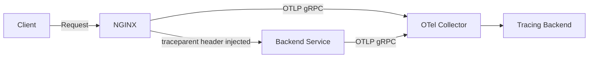
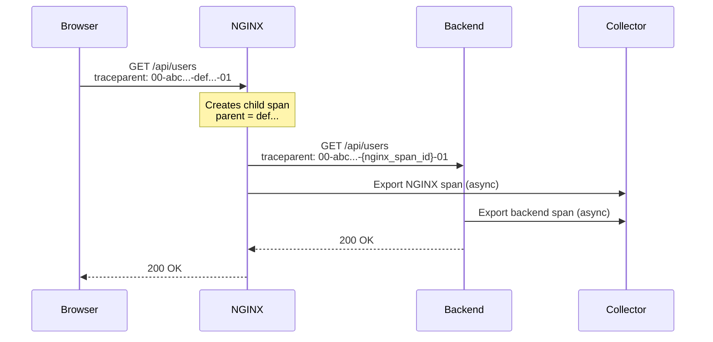

# How to Trace Requests Through NGINX Reverse Proxy with OpenTelemetry

Author: [nawazdhandala](https://www.github.com/nawazdhandala)

Tags: OpenTelemetry, NGINX, Reverse Proxy, Distributed Tracing, Observability, Infrastructure

Description: Step-by-step guide to tracing HTTP requests through NGINX reverse proxy using the OpenTelemetry module for complete end-to-end distributed tracing visibility.

---

NGINX sits in front of a huge number of production systems, handling reverse proxying, load balancing, TLS termination, and static file serving. It's often the first thing a request touches and the last thing a response passes through. But when you're looking at distributed traces, there's usually a gap right where NGINX sits. Your traces start at the application layer, and you have no idea how much latency NGINX added or which upstream it selected.

The OpenTelemetry NGINX module changes that. It instruments NGINX to generate spans for every proxied request and propagate trace context to your backend services. Setting it up takes a bit of work since NGINX doesn't have a plugin ecosystem as flexible as some other tools, but the result is worth it. You get complete traces from the proxy layer all the way through your service mesh.

## How the NGINX OpenTelemetry Module Works

The `otel_ngx_module` is a dynamic module for NGINX that hooks into the request processing lifecycle. It creates a span when a request arrives, attaches relevant HTTP attributes, and injects trace context headers into the proxied request. When the response comes back, it records the status code and finalizes the span.



The module exports spans using OTLP over gRPC directly to an OpenTelemetry Collector. It supports W3C Trace Context propagation, which means it plays nicely with any OpenTelemetry-instrumented backend service.

## Installing the Module

There are a few ways to get the OpenTelemetry module into your NGINX setup. The easiest approach for production is to use the official NGINX Docker image and add the module at build time.

Here's a Dockerfile that builds NGINX with the OpenTelemetry module compiled in.

```dockerfile
# Start from the official NGINX base image
FROM nginx:1.25

# Install dependencies needed to build the OpenTelemetry module
RUN apt-get update && apt-get install -y \
    cmake \
    build-essential \
    libssl-dev \
    zlib1g-dev \
    libpcre3-dev \
    pkg-config \
    libc-ares-dev \
    libre2-dev \
    libcurl4-openssl-dev \
    git

# Clone and build the OpenTelemetry NGINX module
RUN git clone https://github.com/open-telemetry/opentelemetry-cpp-contrib.git /opt/otel-cpp-contrib \
    && cd /opt/otel-cpp-contrib/instrumentation/nginx \
    && mkdir build && cd build \
    && cmake -DNGINX_BIN=/usr/sbin/nginx .. \
    && make -j$(nproc)

# Copy the compiled module to the NGINX modules directory
RUN cp /opt/otel-cpp-contrib/instrumentation/nginx/build/otel_ngx_module.so /usr/lib/nginx/modules/

# Clean up build dependencies to keep the image small
RUN apt-get remove -y cmake build-essential git && apt-get autoremove -y
```

Alternatively, if you're using a package manager, some distributions provide pre-built packages for the module. Check the opentelemetry-cpp-contrib repository for the latest installation options.

## Configuring NGINX for OpenTelemetry

Once the module is installed, you need to load it and configure it in your `nginx.conf`. The configuration has two parts: the module-level settings that define where to send traces, and the per-location settings that control which requests get instrumented.

First, create the OpenTelemetry configuration file that the module reads at startup.

```yaml
# otel-nginx.toml - OpenTelemetry module configuration
# This file is referenced by the otel_config directive in nginx.conf

exporter = "otlp"

processor = "batch"

[exporters.otlp]
# gRPC endpoint of the OpenTelemetry Collector
host = "otel-collector"
port = 4317
# Use insecure connection for local/internal collector
use_ssl = false

[processors.batch]
# Maximum number of spans to batch before exporting
max_queue_size = 2048
# Export interval in milliseconds
schedule_delay_millis = 5000
# Maximum batch size per export
max_export_batch_size = 512

[service]
# Service name that appears in traces
name = "nginx-proxy"

[sampler]
# Always sample (ratio of 1.0)
name = "AlwaysOn"
```

Now configure NGINX itself to load the module and reference this configuration.

```nginx
# nginx.conf - NGINX configuration with OpenTelemetry tracing

# Load the OpenTelemetry dynamic module
load_module modules/otel_ngx_module.so;

events {
    worker_connections 1024;
}

http {
    # Point to the OpenTelemetry configuration file
    otel_exporter {
        endpoint otel-collector:4317;
    }

    # Set the service name for all spans from this NGINX instance
    otel_service_name "nginx-proxy";

    # Enable trace context propagation using W3C format
    otel_trace_context propagate;

    # Capture common HTTP attributes on spans
    otel_capture_headers on;

    # Upstream backend servers
    upstream user_service {
        server user-service-1:8080;
        server user-service-2:8080;
    }

    upstream order_service {
        server order-service-1:8080;
        server order-service-2:8080;
    }

    server {
        listen 80;
        server_name api.example.com;

        # Enable tracing for all locations in this server block
        otel_trace on;

        location /api/users {
            # Custom span name for this location
            otel_span_name "nginx-proxy-users";

            # Add custom span attributes
            otel_span_attr "route.group" "user-service";
            otel_span_attr "proxy.upstream" "$upstream_addr";

            proxy_pass http://user_service;

            # Standard proxy headers
            proxy_set_header Host $host;
            proxy_set_header X-Real-IP $remote_addr;
            proxy_set_header X-Forwarded-For $proxy_add_x_forwarded_for;
        }

        location /api/orders {
            otel_span_name "nginx-proxy-orders";
            otel_span_attr "route.group" "order-service";
            otel_span_attr "proxy.upstream" "$upstream_addr";

            proxy_pass http://order_service;

            proxy_set_header Host $host;
            proxy_set_header X-Real-IP $remote_addr;
            proxy_set_header X-Forwarded-For $proxy_add_x_forwarded_for;
        }

        # Health check endpoint - no tracing needed here
        location /health {
            otel_trace off;
            return 200 "OK";
        }

        # Static assets - trace with sampling to reduce volume
        location /static/ {
            otel_trace on;
            root /var/www;
        }
    }
}
```

## Understanding the Trace Flow

When a request comes in, NGINX generates a span and injects the `traceparent` header before forwarding the request upstream. If the incoming request already has a `traceparent` header (for example, from a browser instrumented with OpenTelemetry), NGINX respects it and creates a child span under the existing trace.



The spans from NGINX include these attributes by default:

- `http.method` - the request method (GET, POST, etc.)
- `http.target` - the request URI path
- `http.status_code` - the response status code
- `http.scheme` - whether the connection was HTTP or HTTPS
- `net.host.name` - the server name from the Host header
- `net.host.port` - the port NGINX is listening on

## Docker Compose Setup

Here's a complete Docker Compose file that runs NGINX with OpenTelemetry alongside a collector. This is useful for local development and testing your tracing setup before deploying to production.

```yaml
# docker-compose.yml - NGINX with OpenTelemetry tracing
version: "3.8"

services:
  nginx:
    build:
      context: .
      dockerfile: Dockerfile.nginx
    ports:
      - "80:80"
    volumes:
      # Mount the NGINX config and OTel config
      - ./nginx.conf:/etc/nginx/nginx.conf:ro
      - ./otel-nginx.toml:/etc/nginx/otel-nginx.toml:ro
    depends_on:
      - otel-collector
      - user-service

  otel-collector:
    image: otel/opentelemetry-collector-contrib:0.96.0
    ports:
      - "4317:4317"   # OTLP gRPC receiver
      - "4318:4318"   # OTLP HTTP receiver
      - "8889:8889"   # Prometheus metrics
    volumes:
      - ./otel-collector-config.yaml:/etc/otelcol-contrib/config.yaml:ro

  user-service:
    image: your-user-service:latest
    environment:
      # Configure the backend service to export traces to the same collector
      OTEL_EXPORTER_OTLP_ENDPOINT: http://otel-collector:4317
      OTEL_SERVICE_NAME: user-service
```

## Collector Configuration

The collector needs to receive spans from both NGINX and your backend services. Here's a configuration that handles both.

```yaml
# otel-collector-config.yaml
receivers:
  otlp:
    protocols:
      grpc:
        endpoint: 0.0.0.0:4317
      http:
        endpoint: 0.0.0.0:4318

processors:
  batch:
    timeout: 5s
    send_batch_size: 1024

  # Filter out health check spans to reduce noise
  filter:
    traces:
      span:
        - 'attributes["http.target"] == "/health"'
        - 'attributes["http.target"] == "/ready"'

exporters:
  otlp:
    endpoint: https://your-tracing-backend:4317

  # Also log spans for debugging during setup
  debug:
    verbosity: basic

service:
  pipelines:
    traces:
      receivers: [otlp]
      processors: [filter, batch]
      exporters: [otlp, debug]
```

## Handling TLS Termination

When NGINX handles TLS termination, the spans it generates will show `https` as the scheme. But the connection between NGINX and your backend is typically plain HTTP. This is normal and expected. The span attributes will correctly reflect what NGINX sees: an HTTPS connection from the client and an HTTP connection to the upstream.

If you need to trace the TLS handshake itself, that's not something the OpenTelemetry module captures. TLS negotiation happens before the HTTP module runs. For TLS-level metrics, you'll want to look at NGINX's built-in ssl module metrics or use a separate exporter.

## Performance Considerations

Adding tracing to NGINX does have a performance cost, but it's usually small. The module performs span creation and header injection synchronously in the request path, which typically adds less than a millisecond of latency. Span export happens asynchronously via the batch processor, so it doesn't block request handling.

If you're running a high-traffic NGINX instance and concerned about overhead, consider using sampling. You can set the sampler to `TraceIdRatioBased` in the OpenTelemetry configuration to only trace a percentage of requests. A 10% sampling rate still gives you excellent visibility while reducing the data volume by 90%.

For very high-throughput scenarios, make sure the batch processor's `max_queue_size` is large enough to handle burst traffic. If the queue fills up, spans will be dropped. Monitor the collector's metrics to watch for dropped spans.

## Wrapping Up

Tracing requests through NGINX with OpenTelemetry fills an important gap in your observability stack. Without it, your distributed traces have a blind spot right at the entry point of your infrastructure. With the OpenTelemetry module configured, you can see exactly how long NGINX takes to process each request, which upstream it selected, and how the trace context flows through to your backend services. The setup requires a custom NGINX build, but once it's running, the traces flow automatically with no changes needed in your application code.
