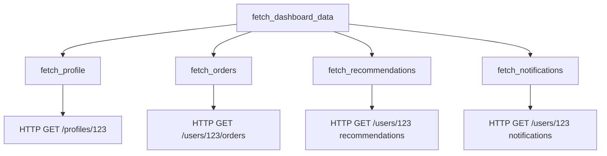

# How to Trace Ruby HTTP Clients (Faraday, HTTParty) with OpenTelemetry

Author: [nawazdhandala](https://www.github.com/nawazdhandala)

Tags: OpenTelemetry, Ruby, Faraday, HTTParty, HTTP Client, Tracing

Description: Comprehensive guide to instrumenting Faraday and HTTParty HTTP clients with OpenTelemetry for distributed tracing across microservices.

Modern Ruby applications rarely operate in isolation. They call payment gateways, third-party APIs, internal microservices, and external data sources. When requests slow down or fail, pinpointing the culprit becomes challenging without proper instrumentation. OpenTelemetry provides standardized tracing for HTTP clients, giving you visibility into every external call your application makes.

## Why HTTP Client Tracing Matters

HTTP clients are integration points where your application depends on external services. These calls can fail or degrade for numerous reasons:

- Network latency or timeouts
- Rate limiting from external APIs
- Service degradation or outages
- Configuration errors (wrong endpoints, missing credentials)
- SSL/TLS certificate issues

Without tracing, you only see symptoms (slow responses, errors) without understanding which external service caused the problem. OpenTelemetry captures every HTTP request with timing, headers, status codes, and error details.

## Setting Up OpenTelemetry for HTTP Clients

Add the required gems to your Gemfile:

```ruby
# Gemfile
gem 'opentelemetry-sdk'
gem 'opentelemetry-exporter-otlp'
gem 'opentelemetry-instrumentation-faraday'
gem 'opentelemetry-instrumentation-net-http'
```

Note that HTTParty uses Net::HTTP under the hood, so the net-http instrumentation covers it automatically.

Install dependencies:

```bash
bundle install
```

Configure OpenTelemetry in an initializer:

```ruby
# config/initializers/opentelemetry.rb
require 'opentelemetry/sdk'
require 'opentelemetry/exporter/otlp'
require 'opentelemetry/instrumentation/all'

OpenTelemetry::SDK.configure do |c|
  c.service_name = 'ruby-http-client-app'
  c.service_version = '1.0.0'

  c.use_all({
    'OpenTelemetry::Instrumentation::Faraday' => {},
    'OpenTelemetry::Instrumentation::NetHTTP' => {},
  })
end
```

This automatically instruments all HTTP calls made through Faraday and Net::HTTP (which HTTParty uses).

## Tracing Faraday HTTP Requests

Faraday is a popular HTTP client with middleware support. The OpenTelemetry instrumentation integrates as middleware:

```ruby
# app/services/payment_service.rb
require 'faraday'

class PaymentService
  def initialize
    @client = Faraday.new(url: 'https://api.payment-provider.com') do |f|
      f.request :json
      f.response :json
      f.adapter Faraday.default_adapter
    end
  end

  def charge(amount, currency, customer_id)
    response = @client.post('/v1/charges') do |req|
      req.headers['Authorization'] = "Bearer #{ENV['PAYMENT_API_KEY']}"
      req.body = {
        amount: amount,
        currency: currency,
        customer_id: customer_id
      }
    end

    response.body
  end
end
```

When `charge` is called, OpenTelemetry automatically creates a span with attributes:

- `http.method`: POST
- `http.url`: https://api.payment-provider.com/v1/charges
- `http.status_code`: 200, 400, 500, etc.
- `http.request.body.size`: Size of request payload
- `http.response.body.size`: Size of response payload
- `net.peer.name`: api.payment-provider.com
- `net.peer.port`: 443

## Adding Custom Context to HTTP Traces

Enhance traces with business context specific to your application:

```ruby
# app/services/user_service.rb
require 'faraday'

class UserService
  def initialize
    @tracer = OpenTelemetry.tracer_provider.tracer('user-service')
    @client = Faraday.new(url: 'https://api.users.internal')
  end

  def fetch_user(user_id)
    @tracer.in_span('fetch_user_from_api',
                    attributes: {
                      'user.id' => user_id,
                      'service.name' => 'user-api'
                    }) do |span|

      response = @client.get("/users/#{user_id}") do |req|
        req.headers['X-Request-ID'] = OpenTelemetry::Trace.current_span.context.trace_id.unpack1('H*')
      end

      span.set_attribute('http.response_content_length', response.body.to_json.bytesize)
      span.set_attribute('user.found', response.status == 200)

      if response.status == 404
        span.add_event('user_not_found')
        return nil
      elsif response.status >= 500
        span.status = OpenTelemetry::Trace::Status.error('User API error')
        raise UserAPIError, "API returned #{response.status}"
      end

      user_data = response.body
      span.set_attribute('user.email', user_data['email'])
      span.set_attribute('user.account_type', user_data['account_type'])

      user_data
    end
  end
end
```

## Tracing HTTParty Requests

HTTParty provides a simpler interface for HTTP requests. Since it uses Net::HTTP internally, the instrumentation works automatically:

```ruby
# app/services/weather_service.rb
require 'httparty'

class WeatherService
  include HTTParty
  base_uri 'https://api.weather.com'

  def current_weather(city)
    tracer = OpenTelemetry.tracer_provider.tracer('weather-service')

    tracer.in_span('fetch_weather',
                   attributes: { 'weather.city' => city }) do |span|

      options = {
        query: { city: city, appid: ENV['WEATHER_API_KEY'] },
        headers: { 'Accept' => 'application/json' },
        timeout: 5
      }

      begin
        response = self.class.get('/data/2.5/weather', options)

        span.set_attribute('http.response_time_ms', response.time * 1000)
        span.set_attribute('weather.temp', response['main']['temp'])
        span.set_attribute('weather.condition', response['weather'][0]['main'])

        response

      rescue HTTParty::Error => e
        span.record_exception(e)
        span.status = OpenTelemetry::Trace::Status.error('Weather API request failed')
        raise
      rescue Net::ReadTimeout => e
        span.record_exception(e)
        span.add_event('request_timeout', attributes: { 'timeout_seconds' => 5 })
        span.status = OpenTelemetry::Trace::Status.error('Request timeout')
        raise
      end
    end
  end
end
```

## Handling Retries and Timeouts

HTTP clients often implement retry logic. Track retry attempts in traces:

```ruby
# app/services/resilient_api_client.rb
require 'faraday'
require 'faraday/retry'

class ResilientAPIClient
  MAX_RETRIES = 3

  def initialize
    @tracer = OpenTelemetry.tracer_provider.tracer('resilient-client')

    @client = Faraday.new(url: 'https://api.external.com') do |f|
      f.request :retry,
        max: MAX_RETRIES,
        interval: 0.5,
        backoff_factor: 2,
        retry_statuses: [500, 502, 503, 504]

      f.adapter Faraday.default_adapter
    end
  end

  def fetch_data(resource_id)
    @tracer.in_span('fetch_external_data',
                    attributes: {
                      'resource.id' => resource_id,
                      'client.max_retries' => MAX_RETRIES
                    }) do |span|

      attempt = 0

      begin
        attempt += 1
        span.add_event('request_attempt',
                       attributes: { 'attempt.number' => attempt })

        response = @client.get("/resources/#{resource_id}") do |req|
          req.options.timeout = 10
          req.options.open_timeout = 5
        end

        span.set_attribute('request.attempts', attempt)
        span.set_attribute('request.succeeded', true)

        response.body

      rescue Faraday::TimeoutError => e
        span.record_exception(e)
        span.set_attribute('error.timeout', true)
        span.set_attribute('request.attempts', attempt)
        span.status = OpenTelemetry::Trace::Status.error('Request timeout')
        raise

      rescue Faraday::ServerError => e
        span.record_exception(e)
        span.set_attribute('request.attempts', attempt)

        if attempt >= MAX_RETRIES
          span.status = OpenTelemetry::Trace::Status.error('Max retries exceeded')
          raise
        end

        retry
      end
    end
  end
end
```

## Tracing Parallel HTTP Requests

When making multiple HTTP calls in parallel, each gets its own span under a parent:

```ruby
# app/services/aggregator_service.rb
require 'faraday'
require 'concurrent'

class AggregatorService
  def initialize
    @tracer = OpenTelemetry.tracer_provider.tracer('aggregator')
    @client = Faraday.new
  end

  def fetch_user_dashboard(user_id)
    @tracer.in_span('fetch_dashboard_data',
                    attributes: { 'user.id' => user_id }) do |span|

      # Make parallel requests
      futures = {
        profile: Concurrent::Future.execute { fetch_profile(user_id) },
        orders: Concurrent::Future.execute { fetch_orders(user_id) },
        recommendations: Concurrent::Future.execute { fetch_recommendations(user_id) },
        notifications: Concurrent::Future.execute { fetch_notifications(user_id) }
      }

      # Wait for all requests to complete
      results = futures.transform_values(&:value)

      # Track which requests succeeded
      span.set_attribute('profile.loaded', results[:profile].present?)
      span.set_attribute('orders.loaded', results[:orders].present?)
      span.set_attribute('recommendations.loaded', results[:recommendations].present?)
      span.set_attribute('notifications.loaded', results[:notifications].present?)

      results
    end
  end

  private

  def fetch_profile(user_id)
    @tracer.in_span('fetch_profile') do
      response = @client.get("https://api.users.internal/profiles/#{user_id}")
      response.body
    end
  rescue StandardError => e
    @tracer.in_span('fetch_profile') do |span|
      span.record_exception(e)
    end
    nil
  end

  def fetch_orders(user_id)
    @tracer.in_span('fetch_orders') do
      response = @client.get("https://api.orders.internal/users/#{user_id}/orders")
      response.body
    end
  rescue StandardError => e
    @tracer.in_span('fetch_orders') do |span|
      span.record_exception(e)
    end
    nil
  end

  def fetch_recommendations(user_id)
    @tracer.in_span('fetch_recommendations') do
      response = @client.get("https://api.recommendations.internal/users/#{user_id}")
      response.body
    end
  rescue StandardError => e
    @tracer.in_span('fetch_recommendations') do |span|
      span.record_exception(e)
    end
    nil
  end

  def fetch_notifications(user_id)
    @tracer.in_span('fetch_notifications') do
      response = @client.get("https://api.notifications.internal/users/#{user_id}")
      response.body
    end
  rescue StandardError => e
    @tracer.in_span('fetch_notifications') do |span|
      span.record_exception(e)
    end
    nil
  end
end
```

This creates a trace showing all requests in parallel with individual timing:



## Filtering Sensitive Data

Prevent sensitive information from appearing in traces:

```ruby
# config/initializers/opentelemetry.rb
OpenTelemetry::SDK.configure do |c|
  c.service_name = 'ruby-http-client'

  # Add span processor to filter sensitive data
  c.add_span_processor(SensitiveDataFilter.new)

  c.use_all({
    'OpenTelemetry::Instrumentation::Faraday' => {},
    'OpenTelemetry::Instrumentation::NetHTTP' => {}
  })
end

# lib/sensitive_data_filter.rb
class SensitiveDataFilter < OpenTelemetry::SDK::Trace::SpanProcessor
  SENSITIVE_HEADERS = %w[authorization api-key x-api-key cookie].freeze

  def on_start(span, parent_context)
    # Filter is applied when span ends
  end

  def on_finish(span)
    # Remove sensitive headers from attributes
    attributes = span.attributes.dup

    attributes.each do |key, value|
      if key.to_s.downcase.include?('authorization') ||
         key.to_s.downcase.include?('api') && key.to_s.downcase.include?('key')
        attributes[key] = '[REDACTED]'
      end

      # Redact sensitive query parameters
      if key == 'http.url' && value.include?('token=')
        attributes[key] = value.gsub(/token=([^&]+)/, 'token=[REDACTED]')
      end
    end

    span.instance_variable_set(:@attributes, attributes)
  end

  def shutdown(timeout: nil)
    # Cleanup if needed
  end

  def force_flush(timeout: nil)
    # Flush if needed
  end
end
```

## Monitoring HTTP Client Performance

Track aggregate metrics across all HTTP calls:

```ruby
# app/services/monitored_http_client.rb
require 'faraday'

class MonitoredHTTPClient
  def initialize(base_url)
    @tracer = OpenTelemetry.tracer_provider.tracer('monitored-client')
    @meter = OpenTelemetry.meter_provider.meter('http-metrics')

    @request_counter = @meter.create_counter(
      'http.client.requests',
      unit: '1',
      description: 'Total HTTP requests'
    )

    @duration_histogram = @meter.create_histogram(
      'http.client.duration',
      unit: 'ms',
      description: 'HTTP request duration'
    )

    @client = Faraday.new(url: base_url)
  end

  def get(path, params: {})
    @tracer.in_span('http_get',
                    attributes: { 'http.path' => path }) do |span|

      start_time = Time.now

      begin
        response = @client.get(path, params)
        duration_ms = ((Time.now - start_time) * 1000).round(2)

        # Record metrics
        @request_counter.add(1, attributes: {
          'http.method' => 'GET',
          'http.status_code' => response.status,
          'http.host' => @client.url_prefix.host
        })

        @duration_histogram.record(duration_ms, attributes: {
          'http.method' => 'GET',
          'http.status_code' => response.status
        })

        span.set_attribute('http.duration_ms', duration_ms)

        response

      rescue StandardError => e
        @request_counter.add(1, attributes: {
          'http.method' => 'GET',
          'http.status_code' => 'error',
          'error.type' => e.class.name
        })

        span.record_exception(e)
        raise
      end
    end
  end
end
```

## Best Practices for HTTP Client Tracing

Always set appropriate timeouts to prevent hanging traces:

```ruby
# app/services/timeout_aware_client.rb
class TimeoutAwareClient
  def initialize
    @client = Faraday.new do |f|
      f.options.timeout = 30      # 30 seconds read timeout
      f.options.open_timeout = 10  # 10 seconds connection timeout
      f.adapter Faraday.default_adapter
    end
  end

  def call_external_api
    tracer = OpenTelemetry.tracer_provider.tracer('timeout-aware')

    tracer.in_span('external_api_call') do |span|
      span.set_attribute('client.timeout', 30)
      span.set_attribute('client.open_timeout', 10)

      @client.get('https://api.external.com/data')
    end
  end
end
```

With proper OpenTelemetry instrumentation, every HTTP call made by your Ruby application becomes traceable and debuggable. You can identify slow external services, track down integration failures, and understand exactly how your application interacts with the outside world. This visibility is critical for maintaining reliable distributed systems.
