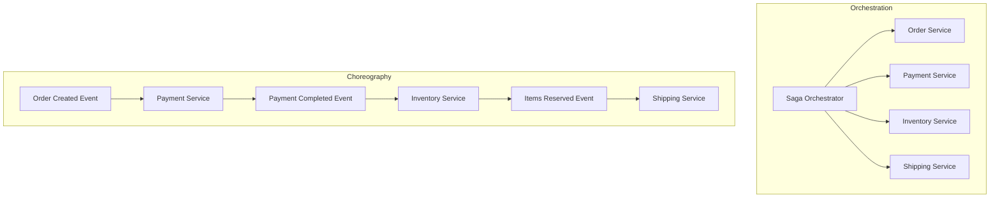

# How to Trace Saga Pattern Distributed Transactions with OpenTelemetry

Author: [nawazdhandala](https://www.github.com/nawazdhandala)

Tags: OpenTelemetry, Saga Pattern, Distributed Transactions, Microservices, Tracing, Observability, Event-Driven

Description: Learn how to instrument saga pattern distributed transactions with OpenTelemetry to trace multi-step workflows, compensating actions, and failure scenarios across microservices.

---

The saga pattern is one of the most common approaches for handling distributed transactions across microservices. Instead of a single ACID transaction spanning multiple databases, you break the work into a sequence of local transactions. Each step either succeeds and moves to the next, or fails and triggers compensating actions to undo previous steps. It works well, but debugging a failed saga without proper observability is brutal.

OpenTelemetry gives you the tools to trace every step of a saga, including the happy path, the failure path, and the compensation path. When something goes wrong at step 4 of a 6-step saga, you want to know exactly what happened, which compensations ran, and where things stand.

## Saga Pattern Basics

There are two main flavors of the saga pattern: orchestration and choreography.

In orchestration, a central saga coordinator tells each service what to do and when. It maintains the state of the saga and decides what happens next based on each step's result.

In choreography, there's no central coordinator. Each service listens for events, does its work, and publishes its own events. The saga emerges from the chain of events.

Both approaches need tracing, but the instrumentation strategy differs slightly. Let's cover both.



## Modeling a Saga as an OpenTelemetry Trace

A saga maps naturally to a distributed trace. The entire saga becomes a trace, and each step becomes a span. For a saga that creates an order, processes payment, reserves inventory, and schedules shipping, you'd end up with a trace that has spans for each of those steps.

The tricky part is that sagas can be long-running. A typical HTTP request trace lasts milliseconds or seconds. A saga might take minutes if it involves async steps or human approvals. OpenTelemetry handles this fine since there's no practical limit on trace duration, but you should be aware that long-lived spans consume memory in the SDK until they're ended and exported.

## Instrumenting an Orchestrated Saga

Let's build an orchestrated saga for order processing. The orchestrator coordinates the steps and we'll create spans for each one.

```python
# saga_orchestrator.py - Orchestrated saga with OpenTelemetry tracing
from opentelemetry import trace, context
from opentelemetry.trace import StatusCode, SpanKind
from opentelemetry.sdk.trace import TracerProvider
from opentelemetry.sdk.trace.export import BatchSpanProcessor
from opentelemetry.exporter.otlp.proto.grpc.trace_exporter import OTLPSpanExporter
from opentelemetry.sdk.resources import Resource

# Set up the tracer
resource = Resource.create({"service.name": "saga-orchestrator"})
provider = TracerProvider(resource=resource)
provider.add_span_processor(BatchSpanProcessor(OTLPSpanExporter(
    endpoint="otel-collector:4317", insecure=True
)))
trace.set_tracer_provider(provider)
tracer = trace.get_tracer("saga.orchestrator")


class OrderSaga:
    """Orchestrates the order creation saga across multiple services."""

    def __init__(self, order_data):
        self.order_data = order_data
        self.completed_steps = []

    def execute(self):
        # Create a root span for the entire saga
        # This span will be the parent of all step spans
        with tracer.start_as_current_span(
            "saga.order.create",
            kind=SpanKind.INTERNAL,
            attributes={
                "saga.type": "order_creation",
                "saga.order_id": self.order_data["order_id"],
                "saga.total_steps": 4,
            }
        ) as saga_span:
            try:
                # Step 1: Create the order record
                self._execute_step("create_order", self._create_order)
                # Step 2: Process payment
                self._execute_step("process_payment", self._process_payment)
                # Step 3: Reserve inventory
                self._execute_step("reserve_inventory", self._reserve_inventory)
                # Step 4: Schedule shipping
                self._execute_step("schedule_shipping", self._schedule_shipping)

                saga_span.set_attribute("saga.outcome", "completed")
                saga_span.set_status(StatusCode.OK)

            except SagaStepError as e:
                # The saga failed - record the failure and run compensations
                saga_span.set_attribute("saga.outcome", "compensated")
                saga_span.set_attribute("saga.failed_step", e.step_name)
                saga_span.set_status(StatusCode.ERROR, f"Failed at: {e.step_name}")
                saga_span.record_exception(e)
                self._compensate()

    def _execute_step(self, step_name, step_fn):
        """Execute a single saga step with its own span."""
        with tracer.start_as_current_span(
            f"saga.step.{step_name}",
            kind=SpanKind.INTERNAL,
            attributes={
                "saga.step.name": step_name,
                "saga.step.number": len(self.completed_steps) + 1,
                "saga.order_id": self.order_data["order_id"],
            }
        ) as step_span:
            try:
                result = step_fn()
                step_span.set_attribute("saga.step.status", "success")
                step_span.set_status(StatusCode.OK)
                # Track completed steps for potential compensation
                self.completed_steps.append(step_name)
                return result
            except Exception as e:
                step_span.set_attribute("saga.step.status", "failed")
                step_span.set_status(StatusCode.ERROR, str(e))
                step_span.record_exception(e)
                raise SagaStepError(step_name, e)

    def _compensate(self):
        """Run compensating actions for all completed steps in reverse order."""
        with tracer.start_as_current_span(
            "saga.compensation",
            kind=SpanKind.INTERNAL,
            attributes={
                "saga.compensation.steps_to_undo": len(self.completed_steps),
            }
        ) as comp_span:
            # Compensate in reverse order
            compensation_map = {
                "create_order": self._cancel_order,
                "process_payment": self._refund_payment,
                "reserve_inventory": self._release_inventory,
                "schedule_shipping": self._cancel_shipping,
            }
            for step_name in reversed(self.completed_steps):
                with tracer.start_as_current_span(
                    f"saga.compensate.{step_name}",
                    attributes={"saga.compensation.for_step": step_name}
                ) as undo_span:
                    try:
                        compensation_map[step_name]()
                        undo_span.set_attribute("saga.compensation.status", "success")
                    except Exception as e:
                        # Compensation failure is serious - flag it
                        undo_span.set_attribute("saga.compensation.status", "failed")
                        undo_span.set_status(StatusCode.ERROR, str(e))
                        undo_span.record_exception(e)
                        comp_span.set_attribute("saga.compensation.has_failures", True)

    # Service call methods (simplified for illustration)
    def _create_order(self):
        # Call order service to create the order record
        pass

    def _process_payment(self):
        # Call payment service to charge the customer
        pass

    def _reserve_inventory(self):
        # Call inventory service to reserve items
        pass

    def _schedule_shipping(self):
        # Call shipping service to create a shipment
        pass

    def _cancel_order(self):
        # Compensation: cancel the order record
        pass

    def _refund_payment(self):
        # Compensation: issue a refund
        pass

    def _release_inventory(self):
        # Compensation: release the reserved items
        pass

    def _cancel_shipping(self):
        # Compensation: cancel the shipment
        pass


class SagaStepError(Exception):
    def __init__(self, step_name, original_error):
        self.step_name = step_name
        self.original_error = original_error
        super().__init__(f"Saga step '{step_name}' failed: {original_error}")
```

## Instrumenting a Choreographed Saga

Choreographed sagas are harder to trace because there's no central coordinator holding the trace context. Each service reacts to events independently. The key is to propagate the trace context through your message headers.

Here's how to do it with a message broker like Kafka or RabbitMQ.

```python
# choreography_tracing.py - Propagating trace context through message events
from opentelemetry import trace, context
from opentelemetry.trace import SpanKind
from opentelemetry.propagate import inject, extract
import json

tracer = trace.get_tracer("saga.choreography")


def publish_saga_event(event_type, payload, broker_client):
    """Publish an event with trace context embedded in the message headers."""
    # Create a span for the publish action
    with tracer.start_as_current_span(
        f"saga.publish.{event_type}",
        kind=SpanKind.PRODUCER,
        attributes={
            "messaging.system": "kafka",
            "messaging.operation": "publish",
            "saga.event.type": event_type,
            "saga.order_id": payload.get("order_id", "unknown"),
        }
    ) as span:
        # Inject the current trace context into message headers
        # This is what connects spans across service boundaries
        headers = {}
        inject(headers)

        message = {
            "event_type": event_type,
            "payload": payload,
        }
        # Send the message with trace context in headers
        broker_client.publish(
            topic=f"saga.events.{event_type}",
            value=json.dumps(message),
            headers=headers,  # Contains traceparent and tracestate
        )


def handle_saga_event(message, headers, handler_fn):
    """Process a saga event, extracting trace context from message headers."""
    # Extract the trace context from the incoming message headers
    # This reconnects us to the original saga trace
    parent_context = extract(headers)

    event_type = message.get("event_type", "unknown")

    with tracer.start_as_current_span(
        f"saga.handle.{event_type}",
        context=parent_context,
        kind=SpanKind.CONSUMER,
        attributes={
            "messaging.system": "kafka",
            "messaging.operation": "process",
            "saga.event.type": event_type,
            "saga.order_id": message.get("payload", {}).get("order_id", "unknown"),
        }
    ) as span:
        try:
            result = handler_fn(message["payload"])
            span.set_attribute("saga.step.status", "success")
            return result
        except Exception as e:
            span.set_status(trace.StatusCode.ERROR, str(e))
            span.record_exception(e)
            # Publish a compensation event
            publish_saga_event(
                f"{event_type}.failed",
                {**message["payload"], "error": str(e)},
                broker_client=None,  # Pass your broker client here
            )
            raise
```

## Visualizing Saga Traces

When everything is instrumented correctly, a successful saga trace looks like a clean waterfall of spans. Each step executes in sequence, and you can see the total time from start to finish.

```mermaid
gantt
    title Successful Order Saga Trace
    dateFormat X
    axisFormat %s

    section Saga
    saga.order.create         :0, 500

    section Steps
    saga.step.create_order    :0, 80
    saga.step.process_payment :80, 200
    saga.step.reserve_inventory :200, 320
    saga.step.schedule_shipping :320, 450
```



A failed saga with compensation looks different. You'll see the steps that succeeded, the step that failed, and then the compensation spans running in reverse.

```mermaid
gantt
    title Failed Saga with Compensation
    dateFormat X
    axisFormat %s

    section Saga
    saga.order.create          :0, 600

    section Steps
    saga.step.create_order     :0, 80
    saga.step.process_payment  :80, 200
    saga.step.reserve_inventory :crit, 200, 280

    section Compensation
    saga.compensation          :300, 600
    saga.compensate.process_payment :300, 420
    saga.compensate.create_order :420, 520
```



## Semantic Conventions for Saga Spans

OpenTelemetry doesn't have official semantic conventions for sagas yet, but you can establish your own. Consistency matters more than the specific attribute names. Here's a convention that works well.

```python
# saga_conventions.py - Consistent attribute naming for saga tracing
SAGA_ATTRIBUTES = {
    # Set on the root saga span
    "saga.type": "string",          # e.g., "order_creation", "refund"
    "saga.id": "string",            # Unique identifier for this saga instance
    "saga.outcome": "string",       # "completed", "compensated", "failed"
    "saga.total_steps": "int",      # Total number of steps in the saga

    # Set on each step span
    "saga.step.name": "string",     # e.g., "create_order", "process_payment"
    "saga.step.number": "int",      # Position in the saga sequence
    "saga.step.status": "string",   # "success", "failed", "skipped"

    # Set on compensation spans
    "saga.compensation.for_step": "string",   # Which step is being compensated
    "saga.compensation.status": "string",     # "success", "failed"
}
```

## Alerting on Saga Failures

Once you have saga traces flowing into your observability backend, you can build useful alerts. Some things worth monitoring:

- **Saga completion rate**: Track how many sagas complete successfully versus how many need compensation. A sudden drop in the success rate usually signals a downstream service issue.
- **Compensation failures**: If a compensation step fails, you have data inconsistency. This deserves a high-priority alert.
- **Saga duration**: If sagas are taking longer than expected, a service in the chain might be degraded.

You can query these using span attributes. For example, to find all sagas that required compensation in the last hour, query for spans where `saga.outcome = "compensated"`.

## Handling Timeouts and Retries

Sagas often have timeout logic. If a step doesn't complete within a certain window, the saga might retry or move to compensation. Make sure your tracing captures these scenarios.

```python
# Tracing a saga step with retry logic
def execute_step_with_retry(step_name, step_fn, max_retries=3):
    """Execute a saga step with retry logic, tracing each attempt."""
    with tracer.start_as_current_span(
        f"saga.step.{step_name}",
        attributes={"saga.step.name": step_name, "saga.step.max_retries": max_retries}
    ) as step_span:
        last_error = None
        for attempt in range(1, max_retries + 1):
            # Create a child span for each retry attempt
            with tracer.start_as_current_span(
                f"saga.step.{step_name}.attempt",
                attributes={
                    "saga.step.attempt": attempt,
                    "saga.step.is_retry": attempt > 1,
                }
            ) as attempt_span:
                try:
                    result = step_fn()
                    attempt_span.set_attribute("saga.step.status", "success")
                    step_span.set_attribute("saga.step.total_attempts", attempt)
                    return result
                except Exception as e:
                    last_error = e
                    attempt_span.set_attribute("saga.step.status", "failed")
                    attempt_span.record_exception(e)

        # All retries exhausted
        step_span.set_attribute("saga.step.status", "failed")
        step_span.set_attribute("saga.step.total_attempts", max_retries)
        raise SagaStepError(step_name, last_error)
```

## Wrapping Up

Tracing saga transactions with OpenTelemetry turns an opaque, multi-service workflow into something you can actually debug. The root span captures the saga's overall outcome, step spans show exactly where things went wrong, and compensation spans tell you what cleanup happened. Whether you're using orchestration or choreography, the principles are the same: propagate context across service boundaries, use consistent attribute naming, and make sure both success and failure paths are instrumented. When a saga fails at 3 AM, you'll be glad you invested the time.
