# How to Trace Scheduled Tasks and Cron Jobs in Spring Boot with OpenTelemetry

Author: [nawazdhandala](https://www.github.com/nawazdhandala)

Tags: OpenTelemetry, Spring Boot, Scheduled Tasks, Cron Jobs, Java, Background

Description: Implement OpenTelemetry tracing for Spring Boot scheduled tasks and cron jobs, capturing execution timing, failure tracking, and distributed context for background processes.

Scheduled tasks and cron jobs run in the background, often triggered at specific intervals or times. Unlike HTTP requests that have natural trace boundaries, scheduled tasks execute independently without incoming context. When these tasks fail or perform poorly, the lack of observability makes diagnosis difficult.

OpenTelemetry can instrument scheduled tasks to create traces for each execution, track timing patterns, and alert when jobs fail or exceed expected durations. This guide demonstrates comprehensive instrumentation for Spring Boot's scheduling capabilities.

## The Challenge with Background Tasks

Scheduled tasks present unique observability challenges. They don't originate from user requests, so there's no parent trace to inherit from. They might run for hours, making span duration tracking complex. They often perform critical business functions, yet failures go unnoticed until someone checks logs manually.

Proper instrumentation creates a root span for each task execution, records execution metadata, tracks performance over time, and alerts on failures or anomalies.

## Project Dependencies

Add Spring Boot scheduling and OpenTelemetry dependencies:

```xml
<!-- Spring Boot Starter -->
<dependency>
    <groupId>org.springframework.boot</groupId>
    <artifactId>spring-boot-starter</artifactId>
    <version>3.2.1</version>
</dependency>

<!-- OpenTelemetry Spring Boot Starter -->
<dependency>
    <groupId>io.opentelemetry.instrumentation</groupId>
    <artifactId>opentelemetry-spring-boot-starter</artifactId>
    <version>2.0.0</version>
</dependency>

<!-- OpenTelemetry API -->
<dependency>
    <groupId>io.opentelemetry</groupId>
    <artifactId>opentelemetry-api</artifactId>
    <version>1.34.1</version>
</dependency>

<!-- Spring Context for scheduling -->
<dependency>
    <groupId>org.springframework</groupId>
    <artifactId>spring-context</artifactId>
</dependency>
```

Enable scheduling in your application with @EnableScheduling annotation.

## Basic Configuration

Configure the Spring Boot application for scheduling and OpenTelemetry:

```java
import org.springframework.boot.SpringApplication;
import org.springframework.boot.autoconfigure.SpringBootApplication;
import org.springframework.scheduling.annotation.EnableScheduling;

@SpringBootApplication
@EnableScheduling
public class ScheduledTasksApplication {

    public static void main(String[] args) {
        SpringApplication.run(ScheduledTasksApplication.class, args);
    }
}
```

Configure OpenTelemetry in application.properties:

```properties
# OpenTelemetry configuration
otel.service.name=scheduled-tasks-service
otel.traces.exporter=otlp
otel.exporter.otlp.endpoint=http://localhost:4317
otel.metrics.exporter=otlp

# Scheduling pool configuration
spring.task.scheduling.pool.size=10
spring.task.scheduling.thread-name-prefix=scheduled-task-
```

## Creating a Custom Scheduling Aspect

Build an aspect that automatically traces all scheduled methods:

```java
import io.opentelemetry.api.trace.Span;
import io.opentelemetry.api.trace.SpanKind;
import io.opentelemetry.api.trace.StatusCode;
import io.opentelemetry.api.trace.Tracer;
import io.opentelemetry.context.Context;
import io.opentelemetry.context.Scope;
import org.aspectj.lang.ProceedingJoinPoint;
import org.aspectj.lang.annotation.Around;
import org.aspectj.lang.annotation.Aspect;
import org.aspectj.lang.reflect.MethodSignature;
import org.springframework.scheduling.annotation.Scheduled;
import org.springframework.stereotype.Component;

import java.lang.reflect.Method;
import java.time.Instant;

@Aspect
@Component
public class ScheduledTaskTracingAspect {

    private final Tracer tracer;

    public ScheduledTaskTracingAspect(Tracer tracer) {
        this.tracer = tracer;
    }

    @Around("@annotation(org.springframework.scheduling.annotation.Scheduled)")
    public Object traceScheduledTask(ProceedingJoinPoint joinPoint) throws Throwable {
        MethodSignature signature = (MethodSignature) joinPoint.getSignature();
        Method method = signature.getMethod();
        Scheduled scheduled = method.getAnnotation(Scheduled.class);

        String taskName = joinPoint.getTarget().getClass().getSimpleName()
            + "." + method.getName();

        // Create a new root span for this scheduled execution
        Span span = tracer.spanBuilder("scheduled-task: " + taskName)
            .setSpanKind(SpanKind.INTERNAL)
            .setNoParent() // Scheduled tasks are root spans
            .startSpan();

        try (Scope scope = span.makeCurrent()) {
            // Add task metadata
            span.setAttribute("task.name", taskName);
            span.setAttribute("task.class", joinPoint.getTarget().getClass().getName());
            span.setAttribute("task.method", method.getName());
            span.setAttribute("task.start_time", Instant.now().toString());

            // Add scheduling configuration
            if (!scheduled.cron().isEmpty()) {
                span.setAttribute("task.cron", scheduled.cron());
            }
            if (scheduled.fixedDelay() > 0) {
                span.setAttribute("task.fixed_delay_ms", scheduled.fixedDelay());
            }
            if (scheduled.fixedRate() > 0) {
                span.setAttribute("task.fixed_rate_ms", scheduled.fixedRate());
            }

            span.addEvent("Task execution started");

            long startTime = System.currentTimeMillis();
            Object result = joinPoint.proceed();
            long duration = System.currentTimeMillis() - startTime;

            span.setAttribute("task.duration_ms", duration);
            span.setAttribute("task.status", "completed");
            span.addEvent("Task execution completed");
            span.setStatus(StatusCode.OK);

            return result;

        } catch (Throwable error) {
            span.setAttribute("task.status", "failed");
            span.setAttribute("error.type", error.getClass().getName());
            span.setAttribute("error.message", error.getMessage());
            span.setStatus(StatusCode.ERROR, "Task execution failed");
            span.recordException(error);
            span.addEvent("Task execution failed");

            throw error;
        } finally {
            span.end();
        }
    }
}
```

This aspect automatically instruments every @Scheduled method, creating comprehensive traces.

## Creating Scheduled Tasks

Implement various scheduled task patterns:

```java
import io.opentelemetry.api.trace.Span;
import io.opentelemetry.api.trace.Tracer;
import org.slf4j.Logger;
import org.slf4j.LoggerFactory;
import org.springframework.scheduling.annotation.Scheduled;
import org.springframework.stereotype.Component;

import java.time.LocalDateTime;

@Component
public class DataProcessingTasks {

    private static final Logger logger = LoggerFactory.getLogger(DataProcessingTasks.class);
    private final Tracer tracer;
    private final DataService dataService;

    public DataProcessingTasks(Tracer tracer, DataService dataService) {
        this.tracer = tracer;
        this.dataService = dataService;
    }

    // Fixed rate - executes every 5 seconds
    @Scheduled(fixedRate = 5000)
    public void processRecentData() {
        logger.info("Starting recent data processing");

        Span span = Span.current();
        span.setAttribute("processing.type", "recent");

        int recordsProcessed = dataService.processRecentRecords();
        span.setAttribute("records.processed", recordsProcessed);

        logger.info("Processed {} recent records", recordsProcessed);
    }

    // Fixed delay - waits 10 seconds after previous execution completes
    @Scheduled(fixedDelay = 10000)
    public void generateReports() {
        logger.info("Starting report generation");

        Span span = Span.current();
        span.setAttribute("report.type", "summary");

        try {
            Thread.sleep(2000); // Simulate report generation
            int reportsGenerated = 5;
            span.setAttribute("reports.generated", reportsGenerated);

            logger.info("Generated {} reports", reportsGenerated);
        } catch (InterruptedException e) {
            Thread.currentThread().interrupt();
            throw new RuntimeException("Report generation interrupted", e);
        }
    }

    // Cron expression - runs every day at 2 AM
    @Scheduled(cron = "0 0 2 * * ?")
    public void dailyDataCleanup() {
        logger.info("Starting daily data cleanup");

        Span span = Span.current();
        span.setAttribute("cleanup.type", "daily");
        span.setAttribute("cleanup.scheduled_time", "02:00");

        int recordsDeleted = dataService.cleanupOldRecords();
        span.setAttribute("records.deleted", recordsDeleted);

        logger.info("Deleted {} old records", recordsDeleted);
    }

    // Cron expression - runs every Monday at 9 AM
    @Scheduled(cron = "0 0 9 ? * MON")
    public void weeklyAnalysis() {
        logger.info("Starting weekly analysis");

        Span span = Span.current();
        span.setAttribute("analysis.type", "weekly");
        span.setAttribute("analysis.day", "Monday");

        dataService.performWeeklyAnalysis();
        span.addEvent("Weekly analysis completed");

        logger.info("Weekly analysis completed");
    }

    // Initial delay with fixed rate
    @Scheduled(initialDelay = 30000, fixedRate = 60000)
    public void healthCheck() {
        logger.info("Performing health check");

        Span span = Span.current();
        span.setAttribute("check.type", "health");

        boolean isHealthy = dataService.checkSystemHealth();
        span.setAttribute("system.healthy", isHealthy);

        if (!isHealthy) {
            span.addEvent("System health check failed");
            logger.warn("System health check failed");
        }
    }
}
```

Each scheduled method automatically gets traced by the aspect.

## Manual Instrumentation for Complex Tasks

For tasks that perform multiple operations, add manual span creation:

```java
import io.opentelemetry.api.trace.Span;
import io.opentelemetry.api.trace.StatusCode;
import io.opentelemetry.api.trace.Tracer;
import io.opentelemetry.context.Scope;
import org.springframework.scheduling.annotation.Scheduled;
import org.springframework.stereotype.Component;

import java.util.List;

@Component
public class ComplexDataPipeline {

    private final Tracer tracer;
    private final DataExtractor dataExtractor;
    private final DataTransformer dataTransformer;
    private final DataLoader dataLoader;

    public ComplexDataPipeline(Tracer tracer, DataExtractor dataExtractor,
                               DataTransformer dataTransformer, DataLoader dataLoader) {
        this.tracer = tracer;
        this.dataExtractor = dataExtractor;
        this.dataTransformer = dataTransformer;
        this.dataLoader = dataLoader;
    }

    @Scheduled(cron = "0 0 * * * ?") // Every hour
    public void runETLPipeline() {
        // The aspect creates the root span, we add child spans for each phase

        List<RawData> rawData = extractData();
        List<TransformedData> transformedData = transformData(rawData);
        loadData(transformedData);
    }

    private List<RawData> extractData() {
        Span span = tracer.spanBuilder("etl.extract")
            .startSpan();

        try (Scope scope = span.makeCurrent()) {
            span.setAttribute("phase", "extract");
            span.addEvent("Starting data extraction");

            List<RawData> data = dataExtractor.extractFromSources();
            span.setAttribute("records.extracted", data.size());

            span.addEvent("Data extraction completed");
            span.setStatus(StatusCode.OK);
            return data;
        } catch (Exception e) {
            span.setStatus(StatusCode.ERROR, "Extraction failed");
            span.recordException(e);
            throw e;
        } finally {
            span.end();
        }
    }

    private List<TransformedData> transformData(List<RawData> rawData) {
        Span span = tracer.spanBuilder("etl.transform")
            .startSpan();

        try (Scope scope = span.makeCurrent()) {
            span.setAttribute("phase", "transform");
            span.setAttribute("input.records", rawData.size());
            span.addEvent("Starting data transformation");

            List<TransformedData> transformed = dataTransformer.transform(rawData);
            span.setAttribute("output.records", transformed.size());

            int skippedRecords = rawData.size() - transformed.size();
            if (skippedRecords > 0) {
                span.setAttribute("records.skipped", skippedRecords);
                span.addEvent("Some records were skipped during transformation");
            }

            span.addEvent("Data transformation completed");
            span.setStatus(StatusCode.OK);
            return transformed;
        } catch (Exception e) {
            span.setStatus(StatusCode.ERROR, "Transformation failed");
            span.recordException(e);
            throw e;
        } finally {
            span.end();
        }
    }

    private void loadData(List<TransformedData> data) {
        Span span = tracer.spanBuilder("etl.load")
            .startSpan();

        try (Scope scope = span.makeCurrent()) {
            span.setAttribute("phase", "load");
            span.setAttribute("records.to_load", data.size());
            span.addEvent("Starting data load");

            int loaded = dataLoader.loadToDatabase(data);
            span.setAttribute("records.loaded", loaded);

            if (loaded < data.size()) {
                span.addEvent("Warning: Not all records were loaded");
                span.setAttribute("records.failed", data.size() - loaded);
            }

            span.addEvent("Data load completed");
            span.setStatus(StatusCode.OK);
        } catch (Exception e) {
            span.setStatus(StatusCode.ERROR, "Load failed");
            span.recordException(e);
            throw e;
        } finally {
            span.end();
        }
    }
}
```

This creates a hierarchical trace showing each phase of the ETL process.

## Tracking Long-Running Tasks

For tasks that run for extended periods, add periodic checkpoints:

```java
import io.opentelemetry.api.trace.Span;
import org.springframework.scheduling.annotation.Scheduled;
import org.springframework.stereotype.Component;

@Component
public class LongRunningTasks {

    private final Tracer tracer;
    private final BatchProcessor batchProcessor;

    public LongRunningTasks(Tracer tracer, BatchProcessor batchProcessor) {
        this.tracer = tracer;
        this.batchProcessor = batchProcessor;
    }

    @Scheduled(cron = "0 0 0 * * ?") // Midnight every day
    public void processDailyBatch() {
        Span rootSpan = Span.current();
        rootSpan.setAttribute("batch.type", "daily");

        int totalRecords = 1_000_000;
        int batchSize = 10_000;
        int processedCount = 0;

        for (int offset = 0; offset < totalRecords; offset += batchSize) {
            processBatch(offset, batchSize);
            processedCount += batchSize;

            // Add checkpoint event every 100k records
            if (processedCount % 100_000 == 0) {
                rootSpan.addEvent("Checkpoint: " + processedCount + " records processed");
                rootSpan.setAttribute("progress.percentage",
                    (processedCount * 100.0) / totalRecords);
            }
        }

        rootSpan.setAttribute("total.processed", processedCount);
    }

    private void processBatch(int offset, int batchSize) {
        Span span = tracer.spanBuilder("process.batch")
            .startSpan();

        try (Scope scope = span.makeCurrent()) {
            span.setAttribute("batch.offset", offset);
            span.setAttribute("batch.size", batchSize);

            batchProcessor.process(offset, batchSize);

            span.setStatus(StatusCode.OK);
        } catch (Exception e) {
            span.setStatus(StatusCode.ERROR);
            span.recordException(e);
            throw e;
        } finally {
            span.end();
        }
    }
}
```

Checkpoints help track progress of long-running tasks.

## Implementing Retry Logic with Tracing

Add retry capabilities with full trace visibility:

```java
import io.opentelemetry.api.trace.Span;
import org.springframework.retry.annotation.Backoff;
import org.springframework.retry.annotation.Retryable;
import org.springframework.scheduling.annotation.Scheduled;
import org.springframework.stereotype.Component;

@Component
public class ResilientScheduledTasks {

    private final Tracer tracer;
    private final ExternalApiClient apiClient;

    public ResilientScheduledTasks(Tracer tracer, ExternalApiClient apiClient) {
        this.tracer = tracer;
        this.apiClient = apiClient;
    }

    @Scheduled(fixedDelay = 60000)
    public void syncWithExternalSystem() {
        Span span = Span.current();
        span.setAttribute("sync.target", "external_system");

        try {
            performSyncWithRetry();
            span.setAttribute("sync.status", "success");
        } catch (Exception e) {
            span.setAttribute("sync.status", "failed_after_retries");
            span.recordException(e);
        }
    }

    @Retryable(
        maxAttempts = 3,
        backoff = @Backoff(delay = 2000, multiplier = 2),
        retryFor = {Exception.class}
    )
    private void performSyncWithRetry() {
        Span span = tracer.spanBuilder("sync.attempt")
            .startSpan();

        try (Scope scope = span.makeCurrent()) {
            span.addEvent("Attempting sync");

            apiClient.syncData();

            span.addEvent("Sync successful");
            span.setStatus(StatusCode.OK);
        } catch (Exception e) {
            span.addEvent("Sync attempt failed");
            span.setStatus(StatusCode.ERROR);
            span.recordException(e);
            throw e;
        } finally {
            span.end();
        }
    }
}
```

Each retry attempt creates a separate span, showing the full retry history.

## Monitoring with Metrics

Combine traces with metrics for comprehensive observability:

```java
import io.opentelemetry.api.metrics.LongCounter;
import io.opentelemetry.api.metrics.LongHistogram;
import io.opentelemetry.api.metrics.Meter;
import org.springframework.scheduling.annotation.Scheduled;
import org.springframework.stereotype.Component;

@Component
public class MetricsAwareScheduledTask {

    private final Tracer tracer;
    private final Meter meter;
    private final LongCounter executionCounter;
    private final LongCounter failureCounter;
    private final LongHistogram durationHistogram;

    public MetricsAwareScheduledTask(Tracer tracer,
                                     io.opentelemetry.api.OpenTelemetry openTelemetry) {
        this.tracer = tracer;
        this.meter = openTelemetry.getMeter("scheduled-tasks");

        this.executionCounter = meter.counterBuilder("task.executions")
            .setDescription("Total number of task executions")
            .build();

        this.failureCounter = meter.counterBuilder("task.failures")
            .setDescription("Total number of task failures")
            .build();

        this.durationHistogram = meter.histogramBuilder("task.duration")
            .setDescription("Task execution duration in milliseconds")
            .ofLongs()
            .build();
    }

    @Scheduled(fixedRate = 30000)
    public void monitoredTask() {
        Span span = Span.current();
        long startTime = System.currentTimeMillis();

        try {
            // Perform task work
            performWork();

            // Record success
            executionCounter.add(1,
                io.opentelemetry.api.common.Attributes.builder()
                    .put("status", "success")
                    .put("task.name", "monitoredTask")
                    .build());

            span.setAttribute("task.result", "success");

        } catch (Exception e) {
            // Record failure
            failureCounter.add(1,
                io.opentelemetry.api.common.Attributes.builder()
                    .put("task.name", "monitoredTask")
                    .put("error.type", e.getClass().getSimpleName())
                    .build());

            span.setAttribute("task.result", "failure");
            span.recordException(e);
            throw e;

        } finally {
            long duration = System.currentTimeMillis() - startTime;

            // Record duration
            durationHistogram.record(duration,
                io.opentelemetry.api.common.Attributes.builder()
                    .put("task.name", "monitoredTask")
                    .build());

            span.setAttribute("task.duration_ms", duration);
        }
    }

    private void performWork() {
        // Actual work implementation
    }
}
```

Metrics provide aggregated views while traces show individual execution details.

## Trace Visualization

Here's how scheduled task traces appear:

```mermaid
gantt
    title Scheduled Task Executions Over Time
    dateFormat HH:mm:ss
    section Data Processing
    processRecentData-1 :done, 10:00:00, 2s
    processRecentData-2 :done, 10:00:05, 2s
    processRecentData-3 :done, 10:00:10, 2s
    section Reports
    generateReports-1 :active, 10:00:00, 5s
    generateReports-2 :active, 10:00:15, 5s
    section ETL Pipeline
    runETLPipeline :crit, 10:00:00, 30s
    extract :done, 10:00:00, 10s
    transform :done, 10:00:10, 12s
    load :done, 10:00:22, 8s
```



Each execution creates an independent trace showing timing and relationships.

## Conditional Task Execution

Implement conditional execution with trace visibility:

```java
import io.opentelemetry.api.trace.Span;
import org.springframework.scheduling.annotation.Scheduled;
import org.springframework.stereotype.Component;

@Component
public class ConditionalScheduledTask {

    private final Tracer tracer;
    private final ConfigurationService configService;

    public ConditionalScheduledTask(Tracer tracer, ConfigurationService configService) {
        this.tracer = tracer;
        this.configService = configService;
    }

    @Scheduled(fixedRate = 10000)
    public void conditionalTask() {
        Span span = Span.current();

        // Check if task should run
        boolean shouldRun = configService.isTaskEnabled("conditionalTask");
        span.setAttribute("task.enabled", shouldRun);

        if (!shouldRun) {
            span.setAttribute("task.execution", "skipped");
            span.addEvent("Task execution skipped - disabled in configuration");
            return;
        }

        // Check execution window
        boolean inWindow = configService.isInExecutionWindow();
        span.setAttribute("task.in_window", inWindow);

        if (!inWindow) {
            span.setAttribute("task.execution", "skipped");
            span.addEvent("Task execution skipped - outside execution window");
            return;
        }

        span.setAttribute("task.execution", "running");
        span.addEvent("Task execution started");

        // Perform actual work
        performTaskWork();

        span.addEvent("Task execution completed");
    }

    private void performTaskWork() {
        // Work implementation
    }
}
```

Traces show why tasks were skipped or executed.

## Testing Scheduled Tasks

Write tests that verify tracing behavior:

```java
import io.opentelemetry.sdk.testing.junit5.OpenTelemetryExtension;
import org.junit.jupiter.api.Test;
import org.junit.jupiter.api.extension.RegisterExtension;
import org.springframework.beans.factory.annotation.Autowired;
import org.springframework.boot.test.context.SpringBootTest;

import static org.junit.jupiter.api.Assertions.*;

@SpringBootTest
class ScheduledTaskTracingTest {

    @RegisterExtension
    static final OpenTelemetryExtension otelTesting = OpenTelemetryExtension.create();

    @Autowired
    private DataProcessingTasks dataProcessingTasks;

    @Test
    void shouldTraceScheduledTaskExecution() {
        // Manually trigger the scheduled method
        dataProcessingTasks.processRecentData();

        var spans = otelTesting.getSpans();

        // Verify root span was created
        var rootSpan = spans.stream()
            .filter(span -> span.getName().contains("processRecentData"))
            .findFirst()
            .orElseThrow();

        assertNotNull(rootSpan);
        assertEquals("INTERNAL", rootSpan.getKind().name());
        assertTrue(rootSpan.getAttributes().toString().contains("task.name"));
    }

    @Test
    void shouldRecordTaskFailure() {
        try {
            // Trigger task that will fail
            dataProcessingTasks.failingTask();
            fail("Expected exception");
        } catch (Exception e) {
            // Expected
        }

        var spans = otelTesting.getSpans();
        var failedSpan = spans.get(0);

        assertEquals("ERROR", failedSpan.getStatus().getStatusCode().name());
        assertFalse(failedSpan.getEvents().isEmpty());
    }
}
```

## Best Practices

**Span Naming**: Use consistent naming patterns like "scheduled-task: ClassName.methodName" for easy filtering.

**Execution Context**: Add relevant business context as span attributes, such as the date range being processed or configuration values.

**Failure Alerting**: Configure alerts on task failure spans to get notified immediately when scheduled jobs fail.

**Duration Baselines**: Track typical execution duration and alert when tasks take significantly longer than expected.

**Sampling**: For high-frequency tasks, consider sampling to reduce data volume while maintaining visibility.

## Conclusion

OpenTelemetry transforms invisible background processes into observable operations. By instrumenting Spring Boot scheduled tasks with automatic aspect-based tracing and strategic manual instrumentation, you gain complete visibility into task execution. Each run creates a trace showing timing, success or failure, and detailed operational context. Combined with metrics for aggregated views and alerting on failures, scheduled tasks become as observable as HTTP requests. This comprehensive observability ensures background processes remain reliable, performant, and debuggable throughout their lifecycle.
