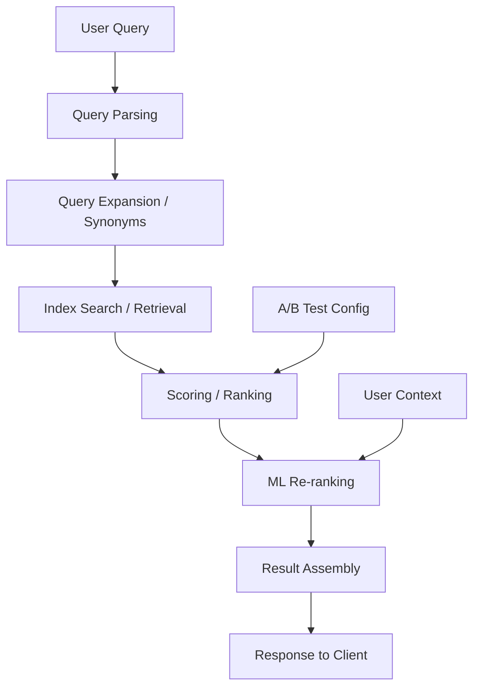

# How to Trace Search and Recommendation Engines with OpenTelemetry

Author: [nawazdhandala](https://www.github.com/nawazdhandala)

Tags: OpenTelemetry, Search, Recommendation Engine, Tracing, Observability, Elasticsearch, Machine Learning, Personalization

Description: Learn how to instrument search and recommendation engines with OpenTelemetry to trace query parsing, ranking, ML model inference, and result assembly for better relevance debugging.

---

Search and recommendation systems are notoriously difficult to debug. A user types a query, and behind the scenes your system parses it, expands synonyms, runs it against an index, scores and ranks results, maybe calls a machine learning model for personalization, and assembles the final response. When the results are bad or slow, figuring out which stage caused the problem is like finding a needle in a haystack (pun intended).

OpenTelemetry tracing makes each of those stages visible. Instead of staring at aggregate latency numbers and guessing, you can follow a single query through every step and see exactly where time is spent and where relevance might be degrading.

---

## Anatomy of a Search Request

Most search systems follow a pipeline pattern, even if the specifics vary between Elasticsearch, Solr, or custom engines:



Recommendation engines follow a similar pattern but replace the text query with a user profile and context signals. The retrieval stage pulls candidates, and the ranking stage scores them based on user affinity.

---

## Configuring the OpenTelemetry SDK

Here is a standard Python setup for a search service. If you are using Go or Java, the concepts are identical but the APIs differ slightly.

```python
# pip install opentelemetry-api opentelemetry-sdk opentelemetry-exporter-otlp

from opentelemetry import trace, metrics
from opentelemetry.sdk.trace import TracerProvider
from opentelemetry.sdk.trace.export import BatchSpanProcessor
from opentelemetry.sdk.metrics import MeterProvider
from opentelemetry.sdk.metrics.export import PeriodicExportingMetricReader
from opentelemetry.exporter.otlp.proto.grpc.trace_exporter import OTLPSpanExporter
from opentelemetry.exporter.otlp.proto.grpc.metric_exporter import OTLPMetricExporter
from opentelemetry.sdk.resources import Resource

# Resource identifies this service in all telemetry data
resource = Resource.create({
    "service.name": "search-service",
    "service.version": "3.1.0",
    "deployment.environment": "production",
})

# Set up tracing
trace_provider = TracerProvider(resource=resource)
trace_provider.add_span_processor(
    BatchSpanProcessor(OTLPSpanExporter(endpoint="otel-collector:4317"))
)
trace.set_tracer_provider(trace_provider)

# Set up metrics
metric_reader = PeriodicExportingMetricReader(
    OTLPMetricExporter(endpoint="otel-collector:4317"),
    export_interval_millis=15000,
)
meter_provider = MeterProvider(resource=resource, metric_readers=[metric_reader])
metrics.set_meter_provider(meter_provider)

tracer = trace.get_tracer("search.engine")
meter = metrics.get_meter("search.engine")
```

Nothing unusual here. The important part comes in how you structure your spans to reflect the search pipeline stages.

---

## Tracing the Query Pipeline

Each stage of the search pipeline should be a separate span. This gives you a clear waterfall view when debugging slow queries.

```python
# Metrics for search performance
search_latency = meter.create_histogram(
    name="search.query.latency",
    description="Total search query latency",
    unit="ms",
)

result_count = meter.create_histogram(
    name="search.query.result_count",
    description="Number of results returned per query",
    unit="results",
)

zero_result_queries = meter.create_counter(
    name="search.query.zero_results_total",
    description="Queries that returned no results",
)

def handle_search(query_text, user_context):
    """Main search handler that traces through each pipeline stage."""
    with tracer.start_as_current_span(
        "search.query",
        attributes={
            "search.query.raw": query_text,
            "search.user_id": user_context.user_id,
            "search.locale": user_context.locale,
            "search.source": user_context.source,  # web, mobile, api
        },
    ) as root_span:

        # Stage 1: Parse and understand the query
        parsed = parse_query(query_text)

        # Stage 2: Expand the query with synonyms and corrections
        expanded = expand_query(parsed)

        # Stage 3: Retrieve candidates from the index
        candidates = retrieve_candidates(expanded)

        # Stage 4: Score and rank results
        ranked = rank_results(candidates, user_context)

        # Stage 5: Apply ML re-ranking if enabled
        reranked = ml_rerank(ranked, user_context)

        # Stage 6: Assemble the final response
        response = assemble_response(reranked)

        # Record top-level metrics
        root_span.set_attribute("search.total_results", len(response.results))
        result_count.record(len(response.results))

        if len(response.results) == 0:
            zero_result_queries.add(
                1, {"search.locale": user_context.locale}
            )

        return response
```

This top-level handler creates the parent span. Each pipeline function creates its own child span with stage-specific attributes.

---

## Instrumenting Individual Stages

Here is what the individual stage functions look like with tracing:

```python
def parse_query(query_text):
    """Parse raw query text into structured query representation."""
    with tracer.start_as_current_span(
        "search.parse",
        attributes={"search.query.raw_length": len(query_text)},
    ) as span:
        # Tokenize the query
        tokens = tokenizer.tokenize(query_text)
        span.set_attribute("search.query.token_count", len(tokens))

        # Detect query intent (product search, navigation, informational)
        intent = intent_classifier.classify(tokens)
        span.set_attribute("search.query.intent", intent.label)
        span.set_attribute("search.query.intent_confidence", intent.confidence)

        # Detect any filters embedded in the query
        # For example: "red shoes under $50" has color and price filters
        filters = filter_extractor.extract(tokens)
        span.set_attribute("search.query.filter_count", len(filters))

        return ParsedQuery(tokens=tokens, intent=intent, filters=filters)


def expand_query(parsed):
    """Expand query with synonyms, spell corrections, and related terms."""
    with tracer.start_as_current_span("search.expand") as span:
        original_tokens = len(parsed.tokens)

        # Apply spell correction
        corrected = spell_checker.correct(parsed.tokens)
        if corrected != parsed.tokens:
            span.add_event("spell_correction_applied", {
                "original": " ".join(parsed.tokens),
                "corrected": " ".join(corrected),
            })

        # Expand with synonyms from the synonym dictionary
        expanded_tokens = synonym_expander.expand(corrected)
        span.set_attribute("search.expand.original_terms", original_tokens)
        span.set_attribute("search.expand.expanded_terms", len(expanded_tokens))

        return ExpandedQuery(tokens=expanded_tokens, original=parsed)


def retrieve_candidates(expanded):
    """Retrieve matching documents from the search index."""
    with tracer.start_as_current_span("search.retrieve") as span:
        # Build the index query from expanded tokens
        index_query = query_builder.build(expanded)

        # Execute against the search index (Elasticsearch, Solr, etc.)
        raw_results = search_index.execute(index_query)

        span.set_attribute("search.retrieve.candidate_count", len(raw_results))
        span.set_attribute("search.retrieve.index_shards_hit", raw_results.shards_hit)
        span.set_attribute("search.retrieve.index_query_ms", raw_results.took_ms)

        return raw_results.documents
```

Notice that the retrieval span records how many index shards were hit and the raw index query time. This is valuable because sometimes a search is slow not because of your code, but because the index itself is struggling.

---

## Tracing ML Re-ranking

The ML re-ranking step is often the most opaque part of the pipeline. Model inference can be unpredictable in latency, and it is hard to know if the model is actually improving results without tracking it.

```python
# Metrics for model performance tracking
model_inference_latency = meter.create_histogram(
    name="search.ml.inference_latency",
    description="ML model inference latency",
    unit="ms",
)

model_reorder_distance = meter.create_histogram(
    name="search.ml.reorder_distance",
    description="Average position change after ML re-ranking",
    unit="positions",
)

def ml_rerank(candidates, user_context):
    """Apply ML model to re-rank search results for personalization."""
    with tracer.start_as_current_span(
        "search.ml_rerank",
        attributes={
            "search.ml.model_name": "personalization-v3",
            "search.ml.model_version": "3.2.1",
            "search.ml.candidate_count": len(candidates),
            "search.ml.ab_test_group": user_context.ab_group,
        },
    ) as span:
        # Build feature vectors for each candidate
        with tracer.start_as_current_span("search.ml_rerank.featurize") as feat_span:
            features = feature_builder.build(candidates, user_context)
            feat_span.set_attribute("search.ml.feature_count", features.shape[1])

        # Run model inference
        with tracer.start_as_current_span("search.ml_rerank.inference") as inf_span:
            scores = model.predict(features)
            inf_span.set_attribute("search.ml.batch_size", len(scores))

        # Sort by model scores
        reranked = sorted(
            zip(candidates, scores), key=lambda x: x[1], reverse=True
        )

        # Calculate how much the model changed the ordering
        # This helps you understand if the model is actually doing anything
        position_changes = []
        for new_pos, (candidate, score) in enumerate(reranked):
            old_pos = candidates.index(candidate)
            position_changes.append(abs(new_pos - old_pos))

        avg_reorder = sum(position_changes) / max(len(position_changes), 1)
        span.set_attribute("search.ml.avg_position_change", round(avg_reorder, 2))
        model_reorder_distance.record(avg_reorder)

        return [candidate for candidate, score in reranked]
```

The `avg_position_change` attribute is particularly useful. If the ML model is barely changing the order (average position change near zero), you might be paying inference latency for no benefit. If it is dramatically reshuffling results, you want to verify that relevance is actually improving.

---

## Tracing Recommendation Engines

Recommendation engines follow a similar pattern but with different inputs. Instead of a text query, you start with user signals:

```python
def get_recommendations(user_id, context):
    """Generate personalized recommendations for a user."""
    with tracer.start_as_current_span(
        "recommend.generate",
        attributes={
            "recommend.user_id": user_id,
            "recommend.context_type": context.page_type,
            "recommend.algorithm": context.algorithm_name,
        },
    ) as span:
        # Fetch user profile and recent activity
        with tracer.start_as_current_span("recommend.fetch_profile") as profile_span:
            profile = user_profile_store.get(user_id)
            profile_span.set_attribute(
                "recommend.profile.interaction_count",
                profile.total_interactions,
            )
            profile_span.set_attribute(
                "recommend.profile.days_active", profile.days_since_first_activity
            )

        # Generate candidate items from multiple sources
        with tracer.start_as_current_span("recommend.candidate_generation") as cg_span:
            # Collaborative filtering candidates
            cf_candidates = collaborative_filter.generate(profile, limit=200)
            # Content-based candidates
            cb_candidates = content_based.generate(profile, limit=200)
            # Trending items as fallback
            trending = trending_store.get_trending(context.category, limit=50)

            all_candidates = merge_candidates(cf_candidates, cb_candidates, trending)
            cg_span.set_attribute("recommend.candidates.cf_count", len(cf_candidates))
            cg_span.set_attribute("recommend.candidates.cb_count", len(cb_candidates))
            cg_span.set_attribute("recommend.candidates.total", len(all_candidates))

        # Score and rank
        with tracer.start_as_current_span("recommend.ranking") as rank_span:
            scored = ranking_model.score(all_candidates, profile, context)
            rank_span.set_attribute("recommend.final_count", len(scored))

        span.set_attribute("recommend.result_count", len(scored))
        return scored
```

Splitting candidate generation into separate sources (collaborative filtering, content-based, trending) in the trace data lets you see which source is slow or producing too few candidates. If your collaborative filtering source returns zero candidates for a new user, you can spot that in the trace and verify that the trending fallback is picking up the slack.

---

## Tracking Relevance Over Time

Latency is only half the story. You also want to track whether your search results are actually good. Use metrics to capture click-through and engagement signals:

```python
# Relevance feedback metrics
click_through = meter.create_counter(
    name="search.relevance.clicks_total",
    description="Clicks on search results by position",
)

def record_search_click(query_id, result_position, result_id):
    """Record when a user clicks a search result."""
    with tracer.start_as_current_span(
        "search.click",
        attributes={
            "search.query_id": query_id,
            "search.click.position": result_position,
            "search.click.result_id": result_id,
        },
    ):
        click_through.add(1, {
            "search.click.position_bucket": bucket_position(result_position),
        })
```

When most clicks land on position 1 or 2, your ranking is working well. When clicks spread across lower positions, your ranking might need tuning. Combined with your per-query traces, you can find specific query patterns where relevance is poor and investigate whether the issue is in parsing, retrieval, or ranking.

---

## Wrapping Up

Search and recommendation engines benefit enormously from distributed tracing because they are inherently multi-stage pipelines. Each stage transforms the data in ways that affect the final output, and problems compound as they flow downstream. By creating a span for each stage and recording attributes like candidate counts, model versions, and position changes, you build a debugging tool that lets you answer questions like "why was this query slow?" and "why did this user see bad results?" with actual data instead of speculation.
