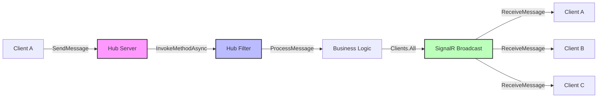

# How to Trace SignalR Hubs with OpenTelemetry in ASP.NET Core

Author: [nawazdhandala](https://www.github.com/nawazdhandala)

Tags: OpenTelemetry, SignalR, ASP.NET Core, .NET, Real-Time, Tracing

Description: Implement distributed tracing for SignalR hubs using OpenTelemetry to monitor real-time communication, track message flows, and diagnose performance issues.

Real-time communication has become essential for modern web applications, and SignalR provides a robust framework for building these experiences in ASP.NET Core. However, the asynchronous, bidirectional nature of SignalR makes it challenging to monitor and debug. OpenTelemetry brings much-needed visibility into SignalR operations, allowing you to trace message flows, monitor connection lifecycles, and identify performance bottlenecks.

## The Challenge of Monitoring Real-Time Communication

SignalR operates differently from traditional HTTP request-response patterns. Connections persist over time, messages flow in both directions, and multiple concurrent operations can affect the same connection. This complexity creates several monitoring challenges:

- Messages can be broadcast to multiple clients simultaneously
- Hub method invocations happen outside the typical middleware pipeline
- Connections can fail or reconnect without obvious indicators
- Client-side operations need correlation with server-side traces
- Group messaging patterns obscure individual client interactions

Traditional logging falls short because it doesn't capture the relationships between connection events, method calls, and message deliveries.

## Setting Up OpenTelemetry for SignalR

Start by installing the necessary packages for your ASP.NET Core application:

```bash
dotnet add package OpenTelemetry.Extensions.Hosting
dotnet add package OpenTelemetry.Instrumentation.AspNetCore
dotnet add package OpenTelemetry.Exporter.OpenTelemetryProtocol
dotnet add package Microsoft.AspNetCore.SignalR.Client
```

Configure OpenTelemetry in your Program.cs with SignalR-specific instrumentation:

```csharp
using OpenTelemetry.Resources;
using OpenTelemetry.Trace;
using OpenTelemetry.Metrics;

var builder = WebApplication.CreateBuilder(args);

// Add SignalR
builder.Services.AddSignalR(options =>
{
    options.EnableDetailedErrors = true;
    options.MaximumReceiveMessageSize = 102400;
});

// Configure OpenTelemetry
builder.Services.AddOpenTelemetry()
    .ConfigureResource(resource => resource
        .AddService("SignalRService", serviceVersion: "1.0.0")
        .AddAttributes(new Dictionary<string, object>
        {
            ["deployment.environment"] = builder.Environment.EnvironmentName
        }))
    .WithTracing(tracing => tracing
        .AddSource("SignalR.*")
        .AddAspNetCoreInstrumentation(options =>
        {
            // Capture SignalR negotiate requests
            options.Filter = httpContext =>
            {
                return true;
            };
            options.RecordException = true;
        })
        .AddHttpClientInstrumentation()
        .AddOtlpExporter(options =>
        {
            options.Endpoint = new Uri("http://localhost:4317");
        }))
    .WithMetrics(metrics => metrics
        .AddMeter("SignalR.*")
        .AddAspNetCoreInstrumentation()
        .AddOtlpExporter(options =>
        {
            options.Endpoint = new Uri("http://localhost:4317");
        }));

var app = builder.Build();

app.MapHub<ChatHub>("/chathub");
app.Run();
```

## Creating an Instrumented SignalR Hub

Here's a comprehensive ChatHub implementation with full OpenTelemetry instrumentation:

```csharp
using System.Diagnostics;
using System.Diagnostics.Metrics;
using Microsoft.AspNetCore.SignalR;

public class ChatHub : Hub
{
    private static readonly ActivitySource ActivitySource =
        new ActivitySource("SignalR.ChatHub");

    private static readonly Meter Meter =
        new Meter("SignalR.ChatHub", "1.0.0");

    private static readonly Counter<long> MessageCounter;
    private static readonly Counter<long> ConnectionCounter;
    private static readonly Histogram<double> MessageDurationHistogram;
    private static readonly ObservableGauge<int> ActiveConnectionsGauge;
    private static int _activeConnections = 0;

    static ChatHub()
    {
        MessageCounter = Meter.CreateCounter<long>(
            "signalr.messages.sent",
            unit: "messages",
            description: "Total number of messages sent through the hub");

        ConnectionCounter = Meter.CreateCounter<long>(
            "signalr.connections.total",
            unit: "connections",
            description: "Total number of connection events");

        MessageDurationHistogram = Meter.CreateHistogram<double>(
            "signalr.message.duration",
            unit: "ms",
            description: "Duration of message processing");

        ActiveConnectionsGauge = Meter.CreateObservableGauge(
            "signalr.connections.active",
            () => _activeConnections,
            unit: "connections",
            description: "Number of active connections");
    }

    private readonly ILogger<ChatHub> _logger;

    public ChatHub(ILogger<ChatHub> logger)
    {
        _logger = logger;
    }

    // Connection lifecycle tracking
    public override async Task OnConnectedAsync()
    {
        using var activity = ActivitySource.StartActivity(
            "SignalR.OnConnected",
            ActivityKind.Server);

        activity?.SetTag("connection.id", Context.ConnectionId);
        activity?.SetTag("user.id", Context.UserIdentifier ?? "anonymous");
        activity?.SetTag("connection.transport", Context.Features.Get<string>());

        try
        {
            Interlocked.Increment(ref _activeConnections);
            ConnectionCounter.Add(1,
                new KeyValuePair<string, object?>("event", "connected"));

            _logger.LogInformation(
                "Client connected: {ConnectionId}",
                Context.ConnectionId);

            activity?.AddEvent(new ActivityEvent("ConnectionEstablished"));
            activity?.SetStatus(ActivityStatusCode.Ok);

            await base.OnConnectedAsync();
        }
        catch (Exception ex)
        {
            activity?.SetStatus(ActivityStatusCode.Error, ex.Message);
            activity?.RecordException(ex);
            throw;
        }
    }

    public override async Task OnDisconnectedAsync(Exception? exception)
    {
        using var activity = ActivitySource.StartActivity(
            "SignalR.OnDisconnected",
            ActivityKind.Server);

        activity?.SetTag("connection.id", Context.ConnectionId);
        activity?.SetTag("user.id", Context.UserIdentifier ?? "anonymous");

        if (exception != null)
        {
            activity?.SetTag("disconnection.reason", "error");
            activity?.SetTag("error.type", exception.GetType().Name);
            activity?.RecordException(exception);
        }
        else
        {
            activity?.SetTag("disconnection.reason", "normal");
        }

        Interlocked.Decrement(ref _activeConnections);
        ConnectionCounter.Add(1,
            new KeyValuePair<string, object?>("event", "disconnected"));

        _logger.LogInformation(
            "Client disconnected: {ConnectionId}",
            Context.ConnectionId);

        await base.OnDisconnectedAsync(exception);
    }

    // Hub method with instrumentation
    public async Task SendMessage(string user, string message)
    {
        using var activity = ActivitySource.StartActivity(
            "SignalR.SendMessage",
            ActivityKind.Server);

        var stopwatch = Stopwatch.StartNew();

        activity?.SetTag("connection.id", Context.ConnectionId);
        activity?.SetTag("user.id", Context.UserIdentifier ?? "anonymous");
        activity?.SetTag("message.user", user);
        activity?.SetTag("message.length", message.Length);
        activity?.SetTag("hub.method", "SendMessage");

        try
        {
            // Validate message
            if (string.IsNullOrWhiteSpace(message))
            {
                throw new HubException("Message cannot be empty");
            }

            activity?.AddEvent(new ActivityEvent("MessageValidated"));

            // Process message (e.g., profanity filter, formatting)
            var processedMessage = await ProcessMessageAsync(message);

            activity?.AddEvent(new ActivityEvent("MessageProcessed"));

            // Broadcast to all clients
            await Clients.All.SendAsync("ReceiveMessage", user, processedMessage);

            stopwatch.Stop();
            MessageDurationHistogram.Record(stopwatch.ElapsedMilliseconds,
                new KeyValuePair<string, object?>("method", "SendMessage"));

            MessageCounter.Add(1,
                new KeyValuePair<string, object?>("type", "broadcast"));

            activity?.SetTag("processing.duration_ms", stopwatch.ElapsedMilliseconds);
            activity?.AddEvent(new ActivityEvent("MessageBroadcast"));
            activity?.SetStatus(ActivityStatusCode.Ok);

            _logger.LogInformation(
                "Message sent by {User} from {ConnectionId}",
                user,
                Context.ConnectionId);
        }
        catch (Exception ex)
        {
            stopwatch.Stop();
            activity?.SetStatus(ActivityStatusCode.Error, ex.Message);
            activity?.RecordException(ex);

            _logger.LogError(ex,
                "Error sending message from {ConnectionId}",
                Context.ConnectionId);

            throw;
        }
    }

    // Direct message with tracing
    public async Task SendPrivateMessage(string targetConnectionId, string message)
    {
        using var activity = ActivitySource.StartActivity(
            "SignalR.SendPrivateMessage",
            ActivityKind.Server);

        activity?.SetTag("connection.id.sender", Context.ConnectionId);
        activity?.SetTag("connection.id.receiver", targetConnectionId);
        activity?.SetTag("message.length", message.Length);
        activity?.SetTag("hub.method", "SendPrivateMessage");

        // Add baggage for cross-service correlation
        activity?.SetBaggage("sender.connection.id", Context.ConnectionId);

        try
        {
            var processedMessage = await ProcessMessageAsync(message);

            await Clients.Client(targetConnectionId).SendAsync(
                "ReceivePrivateMessage",
                Context.ConnectionId,
                processedMessage);

            MessageCounter.Add(1,
                new KeyValuePair<string, object?>("type", "private"));

            activity?.SetStatus(ActivityStatusCode.Ok);
        }
        catch (Exception ex)
        {
            activity?.SetStatus(ActivityStatusCode.Error, ex.Message);
            activity?.RecordException(ex);
            throw;
        }
    }

    // Group messaging with tracing
    public async Task JoinGroup(string groupName)
    {
        using var activity = ActivitySource.StartActivity(
            "SignalR.JoinGroup",
            ActivityKind.Server);

        activity?.SetTag("connection.id", Context.ConnectionId);
        activity?.SetTag("group.name", groupName);

        try
        {
            await Groups.AddToGroupAsync(Context.ConnectionId, groupName);

            activity?.AddEvent(new ActivityEvent("AddedToGroup"));

            // Notify group members
            await Clients.Group(groupName).SendAsync(
                "UserJoinedGroup",
                Context.ConnectionId,
                groupName);

            activity?.SetStatus(ActivityStatusCode.Ok);

            _logger.LogInformation(
                "Connection {ConnectionId} joined group {GroupName}",
                Context.ConnectionId,
                groupName);
        }
        catch (Exception ex)
        {
            activity?.SetStatus(ActivityStatusCode.Error, ex.Message);
            activity?.RecordException(ex);
            throw;
        }
    }

    public async Task SendToGroup(string groupName, string message)
    {
        using var activity = ActivitySource.StartActivity(
            "SignalR.SendToGroup",
            ActivityKind.Server);

        activity?.SetTag("connection.id", Context.ConnectionId);
        activity?.SetTag("group.name", groupName);
        activity?.SetTag("message.length", message.Length);

        try
        {
            var processedMessage = await ProcessMessageAsync(message);

            await Clients.Group(groupName).SendAsync(
                "ReceiveGroupMessage",
                Context.ConnectionId,
                groupName,
                processedMessage);

            MessageCounter.Add(1,
                new KeyValuePair<string, object?>("type", "group"),
                new KeyValuePair<string, object?>("group", groupName));

            activity?.SetStatus(ActivityStatusCode.Ok);
        }
        catch (Exception ex)
        {
            activity?.SetStatus(ActivityStatusCode.Error, ex.Message);
            activity?.RecordException(ex);
            throw;
        }
    }

    private async Task<string> ProcessMessageAsync(string message)
    {
        using var activity = ActivitySource.StartActivity(
            "SignalR.ProcessMessage",
            ActivityKind.Internal);

        activity?.SetTag("message.original_length", message.Length);

        // Simulate message processing (profanity filter, formatting, etc.)
        await Task.Delay(10);

        var processed = message.Trim();
        activity?.SetTag("message.processed_length", processed.Length);

        return processed;
    }
}
```

## Implementing a SignalR Hub Filter for Automatic Instrumentation

Create a hub filter to automatically instrument all hub method invocations:

```csharp
using System.Diagnostics;
using Microsoft.AspNetCore.SignalR;

public class OpenTelemetryHubFilter : IHubFilter
{
    private static readonly ActivitySource ActivitySource =
        new ActivitySource("SignalR.HubFilter");

    public async ValueTask<object?> InvokeMethodAsync(
        HubInvocationContext invocationContext,
        Func<HubInvocationContext, ValueTask<object?>> next)
    {
        using var activity = ActivitySource.StartActivity(
            $"SignalR.Hub.{invocationContext.HubMethodName}",
            ActivityKind.Server);

        activity?.SetTag("hub.name", invocationContext.Hub.GetType().Name);
        activity?.SetTag("hub.method", invocationContext.HubMethodName);
        activity?.SetTag("connection.id", invocationContext.Context.ConnectionId);
        activity?.SetTag("user.id", invocationContext.Context.UserIdentifier ?? "anonymous");

        // Add method arguments as tags (be careful with sensitive data)
        for (int i = 0; i < invocationContext.HubMethodArguments.Count; i++)
        {
            var arg = invocationContext.HubMethodArguments[i];
            if (arg != null && IsSerializable(arg))
            {
                activity?.SetTag($"hub.method.arg.{i}", arg.ToString());
            }
        }

        try
        {
            var result = await next(invocationContext);
            activity?.SetStatus(ActivityStatusCode.Ok);
            return result;
        }
        catch (Exception ex)
        {
            activity?.SetStatus(ActivityStatusCode.Error, ex.Message);
            activity?.RecordException(ex);
            throw;
        }
    }

    public async Task OnConnectedAsync(
        HubLifetimeContext context,
        Func<HubLifetimeContext, Task> next)
    {
        using var activity = ActivitySource.StartActivity(
            "SignalR.Connection.Established",
            ActivityKind.Server);

        activity?.SetTag("connection.id", context.Context.ConnectionId);
        activity?.SetTag("hub.name", context.Hub.GetType().Name);

        await next(context);
    }

    public async Task OnDisconnectedAsync(
        HubLifetimeContext context,
        Exception? exception,
        Func<HubLifetimeContext, Exception?, Task> next)
    {
        using var activity = ActivitySource.StartActivity(
            "SignalR.Connection.Terminated",
            ActivityKind.Server);

        activity?.SetTag("connection.id", context.Context.ConnectionId);
        activity?.SetTag("hub.name", context.Hub.GetType().Name);

        if (exception != null)
        {
            activity?.RecordException(exception);
        }

        await next(context, exception);
    }

    private bool IsSerializable(object obj)
    {
        return obj is string or int or long or bool or double or decimal;
    }
}

// Register the filter in Program.cs
builder.Services.AddSignalR(options =>
{
    options.AddFilter<OpenTelemetryHubFilter>();
});
```

## Client-Side Instrumentation for End-to-End Tracing

Instrument the SignalR client to enable end-to-end distributed tracing:

```csharp
using Microsoft.AspNetCore.SignalR.Client;
using System.Diagnostics;

public class InstrumentedSignalRClient
{
    private static readonly ActivitySource ActivitySource =
        new ActivitySource("SignalR.Client");

    private readonly HubConnection _connection;

    public InstrumentedSignalRClient(string hubUrl)
    {
        _connection = new HubConnectionBuilder()
            .WithUrl(hubUrl)
            .WithAutomaticReconnect()
            .Build();

        // Register message handlers with instrumentation
        _connection.On<string, string>("ReceiveMessage",
            (user, message) => OnReceiveMessage(user, message));
    }

    public async Task StartAsync()
    {
        using var activity = ActivitySource.StartActivity(
            "SignalR.Client.Start",
            ActivityKind.Client);

        try
        {
            await _connection.StartAsync();
            activity?.SetTag("connection.id", _connection.ConnectionId);
            activity?.SetStatus(ActivityStatusCode.Ok);
        }
        catch (Exception ex)
        {
            activity?.SetStatus(ActivityStatusCode.Error, ex.Message);
            activity?.RecordException(ex);
            throw;
        }
    }

    public async Task SendMessageAsync(string user, string message)
    {
        using var activity = ActivitySource.StartActivity(
            "SignalR.Client.SendMessage",
            ActivityKind.Client);

        activity?.SetTag("connection.id", _connection.ConnectionId);
        activity?.SetTag("hub.method", "SendMessage");
        activity?.SetTag("message.user", user);

        try
        {
            await _connection.InvokeAsync("SendMessage", user, message);
            activity?.SetStatus(ActivityStatusCode.Ok);
        }
        catch (Exception ex)
        {
            activity?.SetStatus(ActivityStatusCode.Error, ex.Message);
            activity?.RecordException(ex);
            throw;
        }
    }

    private void OnReceiveMessage(string user, string message)
    {
        using var activity = ActivitySource.StartActivity(
            "SignalR.Client.ReceiveMessage",
            ActivityKind.Consumer);

        activity?.SetTag("message.user", user);
        activity?.SetTag("message.length", message.Length);

        // Process received message
        Console.WriteLine($"{user}: {message}");
    }
}
```

## Tracing Data Flow in SignalR

Understanding how messages flow through your SignalR infrastructure is crucial:



## Monitoring SignalR Performance Metrics

Create a service to track SignalR-specific metrics:

```csharp
public class SignalRMetricsService : IHostedService
{
    private readonly Meter _meter;
    private Timer? _metricsTimer;

    public SignalRMetricsService()
    {
        _meter = new Meter("SignalR.Performance", "1.0.0");

        _meter.CreateObservableGauge(
            "signalr.transport.websockets",
            () => GetActiveWebSocketCount(),
            unit: "connections");

        _meter.CreateObservableGauge(
            "signalr.transport.longpolling",
            () => GetActiveLongPollingCount(),
            unit: "connections");
    }

    public Task StartAsync(CancellationToken cancellationToken)
    {
        _metricsTimer = new Timer(RecordMetrics, null, TimeSpan.Zero, TimeSpan.FromSeconds(10));
        return Task.CompletedTask;
    }

    private void RecordMetrics(object? state)
    {
        // Record custom metrics periodically
    }

    private int GetActiveWebSocketCount() => 0; // Implementation
    private int GetActiveLongPollingCount() => 0; // Implementation

    public Task StopAsync(CancellationToken cancellationToken)
    {
        _metricsTimer?.Dispose();
        return Task.CompletedTask;
    }
}
```

## Best Practices for SignalR Observability

**Avoid Over-Instrumentation**: Don't create a span for every single message in high-throughput scenarios. Consider sampling or batch reporting.

**Correlate Client and Server Traces**: Use consistent trace IDs across client and server to build complete pictures of message flows.

**Monitor Connection Health**: Track connection duration, reconnection attempts, and transport types to identify connectivity issues.

**Measure Message Latency**: Record timestamps when messages are sent and received to calculate end-to-end latency.

**Group Related Operations**: Use span links to connect broadcast operations with individual client deliveries when needed.

**Handle High Cardinality Carefully**: Avoid using connection IDs in metric labels unless absolutely necessary, as this can create cardinality explosions.

Real-time applications demand real-time observability. With OpenTelemetry instrumentation, your SignalR hubs become transparent, allowing you to understand message flows, track performance, and maintain reliable real-time experiences for your users.
