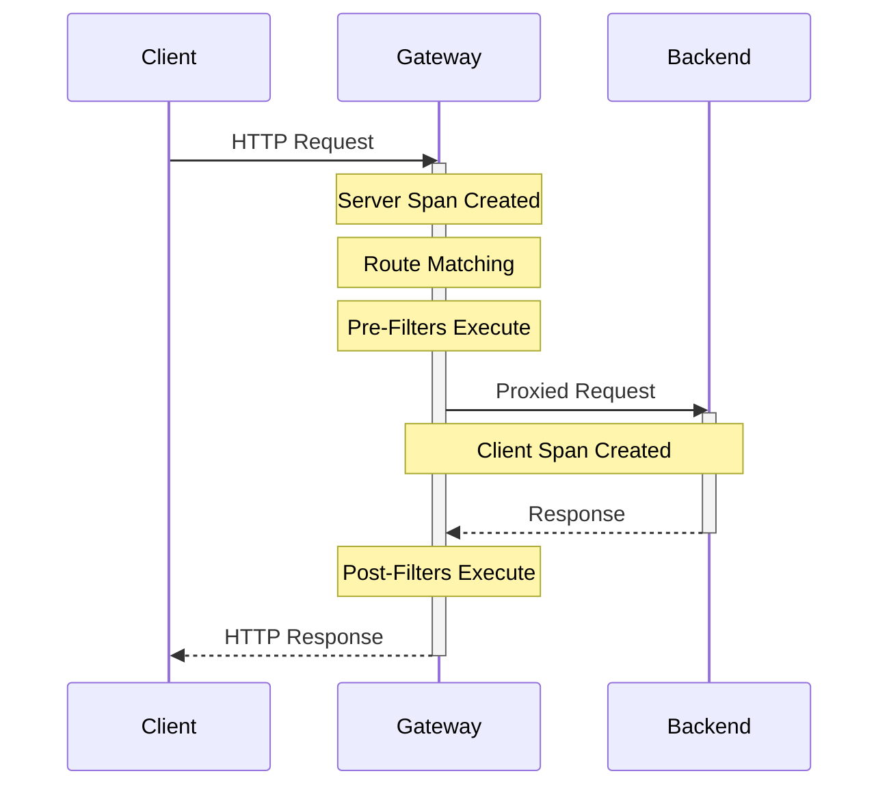
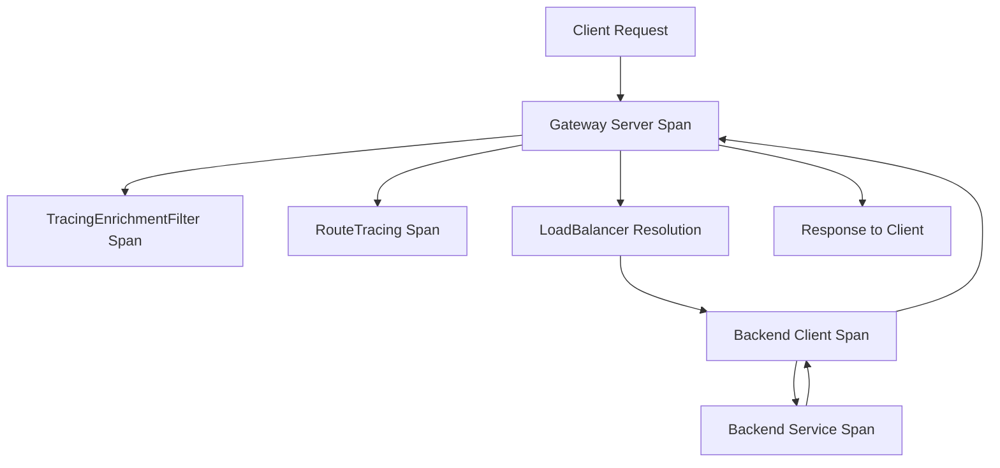

# How to Trace Spring Cloud Gateway Requests with OpenTelemetry

Author: [nawazdhandala](https://www.github.com/nawazdhandala)

Tags: OpenTelemetry, Spring Cloud Gateway, API Gateway, Tracing, Java

Description: Complete guide to instrumenting Spring Cloud Gateway with OpenTelemetry for distributed tracing across microservices, including custom filters and route-specific spans.

Spring Cloud Gateway serves as the entry point for microservices architectures, routing requests to backend services. Proper tracing at the gateway level provides visibility into request flows, latency bottlenecks, and failure points across your distributed system.

## Why Gateway Tracing Matters

API gateways introduce complexity to distributed tracing. A single client request may trigger multiple backend calls, transformations, and routing decisions. Without comprehensive tracing, debugging issues becomes guesswork. Gateway tracing gives you:

- End-to-end visibility from client to backend services
- Performance analysis of routing logic and filters
- Understanding of which routes cause bottlenecks
- Correlation between gateway errors and backend failures

## Setting Up OpenTelemetry with Spring Cloud Gateway

The OpenTelemetry Java agent automatically instruments Spring Cloud Gateway, but understanding the instrumentation and adding custom spans improves observability significantly.

Add the required dependencies to your gateway project:

```xml
<!-- pom.xml -->
<dependencies>
    <!-- Spring Cloud Gateway -->
    <dependency>
        <groupId>org.springframework.cloud</groupId>
        <artifactId>spring-cloud-starter-gateway</artifactId>
    </dependency>

    <!-- OpenTelemetry API for custom instrumentation -->
    <dependency>
        <groupId>io.opentelemetry</groupId>
        <artifactId>opentelemetry-api</artifactId>
        <version>1.35.0</version>
    </dependency>

    <!-- OpenTelemetry instrumentation annotations -->
    <dependency>
        <groupId>io.opentelemetry.instrumentation</groupId>
        <artifactId>opentelemetry-instrumentation-annotations</artifactId>
        <version>2.1.0</version>
    </dependency>
</dependencies>
```

Configure basic gateway routes with tracing in mind:

```yaml
# application.yml
spring:
  cloud:
    gateway:
      routes:
        - id: user-service
          uri: lb://user-service
          predicates:
            - Path=/api/users/**
          filters:
            - StripPrefix=2

        - id: order-service
          uri: lb://order-service
          predicates:
            - Path=/api/orders/**
          filters:
            - StripPrefix=2

        - id: payment-service
          uri: lb://payment-service
          predicates:
            - Path=/api/payments/**
          filters:
            - StripPrefix=2
            - name: RequestRateLimiter
              args:
                redis-rate-limiter.replenishRate: 10
                redis-rate-limiter.burstCapacity: 20

# OpenTelemetry configuration
otel:
  service:
    name: api-gateway
  traces:
    sampler:
      probability: 1.0
  exporter:
    otlp:
      endpoint: http://localhost:4317
```

The automatic instrumentation creates spans for incoming HTTP requests and outgoing calls to backend services. However, gateway-specific logic like custom filters and routing decisions need manual instrumentation.

## Automatic Instrumentation Behavior

The OpenTelemetry Java agent creates spans at several points in the gateway lifecycle:

1. **Server span** - Created when the gateway receives a request
2. **Client span** - Created when the gateway calls a backend service
3. **Route matching** - Internal routing logic is traced
4. **Filter execution** - Built-in filters are automatically instrumented

Understanding this flow helps you identify where custom instrumentation adds value:



## Creating Custom Gateway Filters with Tracing

Custom filters often contain business logic that should be traced separately. Create filters that add span annotations and attributes for better observability.

```java
package com.company.gateway.filters;

import io.opentelemetry.api.trace.Span;
import io.opentelemetry.api.trace.StatusCode;
import io.opentelemetry.api.trace.Tracer;
import io.opentelemetry.context.Context;
import org.springframework.cloud.gateway.filter.GatewayFilterChain;
import org.springframework.cloud.gateway.filter.GlobalFilter;
import org.springframework.core.Ordered;
import org.springframework.stereotype.Component;
import org.springframework.web.server.ServerWebExchange;
import reactor.core.publisher.Mono;

/**
 * Global filter that enriches traces with gateway-specific metadata.
 * Adds custom attributes like route ID, load balancer choice, and timing information.
 */
@Component
public class TracingEnrichmentFilter implements GlobalFilter, Ordered {

    private final Tracer tracer;

    public TracingEnrichmentFilter(Tracer tracer) {
        this.tracer = tracer;
    }

    @Override
    public Mono<Void> filter(ServerWebExchange exchange, GatewayFilterChain chain) {
        // Get current span from context
        Span currentSpan = Span.current();

        // Add gateway-specific attributes
        String routeId = exchange.getAttribute("org.springframework.cloud.gateway.support.ServerWebExchangeUtils.gatewayPredicateRouteAttr");
        if (routeId != null) {
            currentSpan.setAttribute("gateway.route.id", routeId);
        }

        // Add request metadata
        currentSpan.setAttribute("http.method", exchange.getRequest().getMethod().toString());
        currentSpan.setAttribute("http.target", exchange.getRequest().getURI().getPath());
        currentSpan.setAttribute("http.scheme", exchange.getRequest().getURI().getScheme());

        // Extract and add custom headers if present
        String clientId = exchange.getRequest().getHeaders().getFirst("X-Client-Id");
        if (clientId != null) {
            currentSpan.setAttribute("client.id", clientId);
        }

        String requestId = exchange.getRequest().getHeaders().getFirst("X-Request-Id");
        if (requestId != null) {
            currentSpan.setAttribute("request.id", requestId);
        }

        long startTime = System.currentTimeMillis();

        return chain.filter(exchange)
            .doOnSuccess(aVoid -> {
                long duration = System.currentTimeMillis() - startTime;
                currentSpan.setAttribute("gateway.duration.ms", duration);
                currentSpan.addEvent("gateway.request.completed");

                // Add response status
                int statusCode = exchange.getResponse().getStatusCode() != null
                    ? exchange.getResponse().getStatusCode().value()
                    : 0;
                currentSpan.setAttribute("http.status_code", statusCode);

                if (statusCode >= 500) {
                    currentSpan.setStatus(StatusCode.ERROR, "Server error");
                }
            })
            .doOnError(error -> {
                currentSpan.recordException(error);
                currentSpan.setStatus(StatusCode.ERROR, error.getMessage());
                currentSpan.addEvent("gateway.request.failed");
            });
    }

    @Override
    public int getOrder() {
        return Ordered.HIGHEST_PRECEDENCE;
    }
}
```

This filter runs for every request and enriches the trace with gateway-specific context. The reactive nature of Spring Cloud Gateway requires careful handling of span lifecycle using `doOnSuccess` and `doOnError` callbacks.

## Tracing Route-Specific Logic

Different routes often have different performance characteristics and requirements. Create custom spans for route-specific processing.

```java
package com.company.gateway.filters;

import io.opentelemetry.api.trace.Span;
import io.opentelemetry.api.trace.SpanKind;
import io.opentelemetry.api.trace.Tracer;
import io.opentelemetry.context.Context;
import io.opentelemetry.context.Scope;
import org.springframework.cloud.gateway.filter.GatewayFilter;
import org.springframework.cloud.gateway.filter.factory.AbstractGatewayFilterFactory;
import org.springframework.stereotype.Component;
import reactor.core.publisher.Mono;

/**
 * Custom gateway filter factory that creates a child span for route-specific processing.
 * Useful for tracing authentication, rate limiting, or transformation logic.
 */
@Component
public class RouteTracingGatewayFilterFactory
        extends AbstractGatewayFilterFactory<RouteTracingGatewayFilterFactory.Config> {

    private final Tracer tracer;

    public RouteTracingGatewayFilterFactory(Tracer tracer) {
        super(Config.class);
        this.tracer = tracer;
    }

    @Override
    public GatewayFilter apply(Config config) {
        return (exchange, chain) -> {
            // Create a new span for this route's processing
            Span span = tracer.spanBuilder("gateway.route." + config.getRouteName())
                .setSpanKind(SpanKind.INTERNAL)
                .startSpan();

            span.setAttribute("route.name", config.getRouteName());
            span.setAttribute("route.processing", true);

            // Make the span current for downstream processing
            try (Scope scope = span.makeCurrent()) {
                return chain.filter(exchange)
                    .doFinally(signalType -> {
                        span.setAttribute("signal.type", signalType.toString());
                        span.end();
                    });
            }
        };
    }

    public static class Config {
        private String routeName;

        public String getRouteName() {
            return routeName;
        }

        public void setRouteName(String routeName) {
            this.routeName = routeName;
        }
    }
}
```

Apply this filter to specific routes in your configuration:

```yaml
spring:
  cloud:
    gateway:
      routes:
        - id: payment-service
          uri: lb://payment-service
          predicates:
            - Path=/api/payments/**
          filters:
            - StripPrefix=2
            - name: RouteTracing
              args:
                routeName: payment-service
```

Now each request to the payment service creates a dedicated span for gateway-level processing, separate from the HTTP client span.

## Tracing Load Balancer Decisions

When using service discovery with load balancing, trace which backend instance handles each request.

```java
package com.company.gateway.filters;

import io.opentelemetry.api.trace.Span;
import org.springframework.cloud.client.ServiceInstance;
import org.springframework.cloud.client.loadbalancer.LoadBalancerClient;
import org.springframework.cloud.gateway.filter.GatewayFilterChain;
import org.springframework.cloud.gateway.filter.GlobalFilter;
import org.springframework.cloud.gateway.support.ServerWebExchangeUtils;
import org.springframework.core.Ordered;
import org.springframework.stereotype.Component;
import org.springframework.web.server.ServerWebExchange;
import reactor.core.publisher.Mono;

import java.net.URI;

/**
 * Adds load balancer information to traces.
 * Captures which backend instance was selected for the request.
 */
@Component
public class LoadBalancerTracingFilter implements GlobalFilter, Ordered {

    @Override
    public Mono<Void> filter(ServerWebExchange exchange, GatewayFilterChain chain) {
        return chain.filter(exchange).then(Mono.fromRunnable(() -> {
            // Get the URI after load balancer resolution
            URI uri = exchange.getAttribute(ServerWebExchangeUtils.GATEWAY_REQUEST_URL_ATTR);

            if (uri != null) {
                Span span = Span.current();
                span.setAttribute("lb.resolved.host", uri.getHost());
                span.setAttribute("lb.resolved.port", uri.getPort());
                span.setAttribute("lb.resolved.uri", uri.toString());
            }

            // Check if load balancer was used
            Object lbAttr = exchange.getAttribute(ServerWebExchangeUtils.GATEWAY_LOADBALANCER_RESPONSE_ATTR);
            if (lbAttr != null) {
                Span.current().setAttribute("lb.used", true);
            }
        }));
    }

    @Override
    public int getOrder() {
        return Ordered.LOWEST_PRECEDENCE;
    }
}
```

This filter records which backend instance was selected, helping diagnose issues where specific instances behave differently.

## Tracing Circuit Breaker and Retry Logic

Spring Cloud Gateway integrates with Resilience4j for circuit breakers and retries. These resilience patterns should be visible in traces.

```yaml
spring:
  cloud:
    gateway:
      routes:
        - id: flaky-service
          uri: lb://flaky-service
          predicates:
            - Path=/api/flaky/**
          filters:
            - StripPrefix=2
            - name: CircuitBreaker
              args:
                name: flakyServiceCircuitBreaker
                fallbackUri: forward:/fallback/flaky
            - name: Retry
              args:
                retries: 3
                statuses: BAD_GATEWAY,SERVICE_UNAVAILABLE
                methods: GET,POST
                backoff:
                  firstBackoff: 100ms
                  maxBackoff: 500ms
                  factor: 2
```

Create a filter to add retry and circuit breaker telemetry:

```java
package com.company.gateway.filters;

import io.github.resilience4j.circuitbreaker.CircuitBreaker;
import io.github.resilience4j.circuitbreaker.CircuitBreakerRegistry;
import io.opentelemetry.api.trace.Span;
import org.springframework.cloud.gateway.filter.GatewayFilterChain;
import org.springframework.cloud.gateway.filter.GlobalFilter;
import org.springframework.core.Ordered;
import org.springframework.stereotype.Component;
import org.springframework.web.server.ServerWebExchange;
import reactor.core.publisher.Mono;

/**
 * Enriches traces with circuit breaker state information.
 * Helps correlate request failures with circuit breaker trips.
 */
@Component
public class CircuitBreakerTracingFilter implements GlobalFilter, Ordered {

    private final CircuitBreakerRegistry circuitBreakerRegistry;

    public CircuitBreakerTracingFilter(CircuitBreakerRegistry circuitBreakerRegistry) {
        this.circuitBreakerRegistry = circuitBreakerRegistry;
    }

    @Override
    public Mono<Void> filter(ServerWebExchange exchange, GatewayFilterChain chain) {
        // Attempt to find circuit breaker for this route
        String routeId = exchange.getAttribute("org.springframework.cloud.gateway.support.ServerWebExchangeUtils.gatewayPredicateRouteAttr");

        if (routeId != null) {
            try {
                CircuitBreaker circuitBreaker = circuitBreakerRegistry.find(routeId + "CircuitBreaker")
                    .orElse(null);

                if (circuitBreaker != null) {
                    Span span = Span.current();
                    span.setAttribute("circuit_breaker.state", circuitBreaker.getState().toString());
                    span.setAttribute("circuit_breaker.name", circuitBreaker.getName());

                    CircuitBreaker.Metrics metrics = circuitBreaker.getMetrics();
                    span.setAttribute("circuit_breaker.failure_rate", metrics.getFailureRate());
                    span.setAttribute("circuit_breaker.slow_call_rate", metrics.getSlowCallRate());
                }
            } catch (Exception e) {
                // Circuit breaker might not exist for this route
            }
        }

        return chain.filter(exchange);
    }

    @Override
    public int getOrder() {
        return Ordered.HIGHEST_PRECEDENCE + 1;
    }
}
```

Now your traces show circuit breaker state alongside request telemetry, making it easy to see when the circuit opened and affected requests.

## Custom Tracer Configuration

Register a tracer bean for dependency injection into your filters:

```java
package com.company.gateway.config;

import io.opentelemetry.api.GlobalOpenTelemetry;
import io.opentelemetry.api.trace.Tracer;
import org.springframework.context.annotation.Bean;
import org.springframework.context.annotation.Configuration;

/**
 * OpenTelemetry configuration for Spring Cloud Gateway.
 * Provides tracer beans for custom instrumentation.
 */
@Configuration
public class OpenTelemetryConfig {

    @Bean
    public Tracer tracer() {
        return GlobalOpenTelemetry.getTracer("spring-cloud-gateway", "1.0.0");
    }
}
```

## Visualizing Gateway Traces

The complete trace for a gateway request shows the full flow:



When viewed in a tracing UI like Jaeger or Zipkin, you see:
- Request path and method
- Route matching decision
- Filter execution order and duration
- Load balancer instance selection
- Backend service latency
- Total gateway overhead

## Performance Considerations

Gateway tracing adds minimal overhead, but consider these optimizations:

1. **Sampling** - Use probabilistic sampling in production to reduce data volume
2. **Attribute limits** - Avoid adding large attributes like request/response bodies
3. **Filter ordering** - Place tracing filters early in the chain for accurate timing
4. **Async boundaries** - Ensure proper context propagation in reactive chains

Configure appropriate sampling:

```yaml
otel:
  traces:
    sampler:
      # Sample 10% of requests in production
      probability: 0.1
      # Always sample errors
      parent_based: true
```

Spring Cloud Gateway tracing with OpenTelemetry provides comprehensive visibility into your API gateway. By combining automatic instrumentation with strategic custom spans, you gain insights into routing decisions, filter execution, load balancing, and resilience patterns. This observability foundation makes debugging distributed systems significantly easier and helps identify performance bottlenecks before they impact users.
