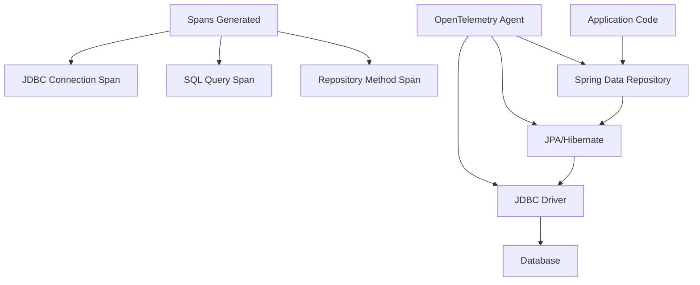

# How to Trace Spring Data JPA and JDBC Queries with OpenTelemetry

Author: [nawazdhandala](https://www.github.com/nawazdhandala)

Tags: OpenTelemetry, Spring Data JPA, JDBC, Database Tracing, SQL, Java

Description: Master database query tracing in Spring Boot with OpenTelemetry to identify slow queries, monitor connection pools, and optimize database performance.

Database operations are often the primary performance bottleneck in applications. OpenTelemetry's automatic instrumentation for JDBC and JPA provides detailed visibility into every query, connection acquisition, and transaction.

## Understanding Database Tracing Layers

Spring applications have multiple database abstraction layers, and OpenTelemetry can trace them all:



## Dependencies Setup

Configure dependencies for JPA and OpenTelemetry instrumentation:

```xml
<dependencies>
    <!-- Spring Data JPA -->
    <dependency>
        <groupId>org.springframework.boot</groupId>
        <artifactId>spring-boot-starter-data-jpa</artifactId>
    </dependency>

    <!-- PostgreSQL JDBC driver (or your database) -->
    <dependency>
        <groupId>org.postgresql</groupId>
        <artifactId>postgresql</artifactId>
        <scope>runtime</scope>
    </dependency>

    <!-- HikariCP connection pool (included in Spring Boot) -->
    <dependency>
        <groupId>com.zaxxer</groupId>
        <artifactId>HikariCP</artifactId>
    </dependency>

    <!-- OpenTelemetry API for custom instrumentation -->
    <dependency>
        <groupId>io.opentelemetry</groupId>
        <artifactId>opentelemetry-api</artifactId>
        <version>1.33.0</version>
    </dependency>

    <!-- OpenTelemetry instrumentation for JDBC -->
    <dependency>
        <groupId>io.opentelemetry.instrumentation</groupId>
        <artifactId>opentelemetry-jdbc</artifactId>
        <version>1.33.0-alpha</version>
    </dependency>
</dependencies>
```

## Database Configuration

Configure your database connection with OpenTelemetry-aware settings in `application.yml`:

```yaml
spring:
  datasource:
    # Wrap JDBC URL with OpenTelemetry interceptor
    url: jdbc:otel:postgresql://localhost:5432/productdb
    username: dbuser
    password: dbpass
    driver-class-name: io.opentelemetry.instrumentation.jdbc.OpenTelemetryDriver

    # HikariCP connection pool settings
    hikari:
      pool-name: ProductPool
      maximum-pool-size: 10
      minimum-idle: 5
      connection-timeout: 30000
      idle-timeout: 600000
      max-lifetime: 1800000

  jpa:
    # Show SQL in logs (for development)
    show-sql: false

    # Hibernate properties
    properties:
      hibernate:
        # Format SQL for readability
        format_sql: true

        # Enable query statistics
        generate_statistics: true

        # Batch operations
        jdbc:
          batch_size: 20
          fetch_size: 50

        # Second-level cache (optional)
        cache:
          use_second_level_cache: true
          region:
            factory_class: org.hibernate.cache.jcache.JCacheRegionFactory

# OpenTelemetry configuration
otel:
  instrumentation:
    jdbc:
      # Include SQL statement in span attributes
      statement: true
      # Include bind parameters (be careful with sensitive data)
      bind-parameters: false
```

## Automatic JDBC Instrumentation

With the OpenTelemetry JDBC driver wrapper, all database calls are automatically traced:

```java
package com.example.entity;

import jakarta.persistence.*;
import java.math.BigDecimal;
import java.time.LocalDateTime;

@Entity
@Table(name = "products", indexes = {
    @Index(name = "idx_category", columnList = "category"),
    @Index(name = "idx_name", columnList = "name")
})
public class Product {

    @Id
    @GeneratedValue(strategy = GenerationType.IDENTITY)
    private Long id;

    @Column(nullable = false, length = 200)
    private String name;

    @Column(length = 1000)
    private String description;

    @Column(nullable = false)
    private String category;

    @Column(nullable = false, precision = 10, scale = 2)
    private BigDecimal price;

    @Column(name = "stock_quantity")
    private Integer stockQuantity;

    @Column(name = "created_at")
    private LocalDateTime createdAt;

    @Column(name = "updated_at")
    private LocalDateTime updatedAt;

    // Getters and setters
}
```

## Spring Data Repository with Automatic Tracing

Spring Data repositories are automatically instrumented:

```java
package com.example.repository;

import com.example.entity.Product;
import org.springframework.data.domain.Page;
import org.springframework.data.domain.Pageable;
import org.springframework.data.jpa.repository.JpaRepository;
import org.springframework.data.jpa.repository.Query;
import org.springframework.data.repository.query.Param;
import org.springframework.stereotype.Repository;

import java.math.BigDecimal;
import java.util.List;
import java.util.Optional;

/**
 * Repository interface with automatic OpenTelemetry tracing.
 * Each method call generates a span with database operation details.
 */
@Repository
public interface ProductRepository extends JpaRepository<Product, Long> {

    /**
     * Derived query method - automatically traced.
     * Span name: ProductRepository.findByCategory
     */
    List<Product> findByCategory(String category);

    /**
     * Complex derived query with multiple conditions.
     * Generates span with SQL details.
     */
    List<Product> findByCategoryAndPriceLessThan(
        String category,
        BigDecimal maxPrice
    );

    /**
     * Custom JPQL query - traced with query details.
     */
    @Query("SELECT p FROM Product p WHERE p.name LIKE %:keyword% " +
           "AND p.stockQuantity > 0")
    List<Product> searchAvailableProducts(@Param("keyword") String keyword);

    /**
     * Native SQL query - traced with actual SQL statement.
     */
    @Query(value = "SELECT * FROM products WHERE category = :category " +
                   "ORDER BY price DESC LIMIT :limit",
           nativeQuery = true)
    List<Product> findTopProductsByCategory(
        @Param("category") String category,
        @Param("limit") int limit
    );

    /**
     * Pagination query - traces include page information.
     */
    Page<Product> findByCategoryOrderByPriceDesc(
        String category,
        Pageable pageable
    );

    /**
     * Optional return type - span shows if result was found.
     */
    Optional<Product> findByName(String name);

    /**
     * Count query - traced separately from SELECT queries.
     */
    long countByCategory(String category);

    /**
     * Delete query - traced with operation type.
     */
    void deleteByCategory(String category);
}
```

## Service Layer with Custom Database Spans

Add custom spans for business logic that includes database operations:

```java
package com.example.service;

import com.example.entity.Product;
import com.example.repository.ProductRepository;
import io.opentelemetry.api.OpenTelemetry;
import io.opentelemetry.api.trace.Span;
import io.opentelemetry.api.trace.Tracer;
import io.opentelemetry.context.Scope;
import org.springframework.data.domain.Page;
import org.springframework.data.domain.PageRequest;
import org.springframework.stereotype.Service;
import org.springframework.transaction.annotation.Transactional;

import java.math.BigDecimal;
import java.util.List;

@Service
public class ProductService {

    private final ProductRepository repository;
    private final Tracer tracer;

    public ProductService(
        ProductRepository repository,
        OpenTelemetry openTelemetry
    ) {
        this.repository = repository;
        this.tracer = openTelemetry.getTracer("com.example.product", "1.0.0");
    }

    /**
     * Business method that creates a custom span.
     * Database calls within this span appear as child spans.
     */
    public List<Product> getAffordableProducts(
        String category,
        BigDecimal maxBudget
    ) {
        Span span = tracer.spanBuilder("ProductService.getAffordableProducts")
            .startSpan();

        try (Scope scope = span.makeCurrent()) {
            span.setAttribute("category", category);
            span.setAttribute("max_budget", maxBudget.doubleValue());

            // This repository call generates a child span
            List<Product> products = repository
                .findByCategoryAndPriceLessThan(category, maxBudget);

            span.setAttribute("results.count", products.size());
            span.addEvent("products_retrieved");

            return products;

        } catch (Exception e) {
            span.recordException(e);
            span.setStatus(io.opentelemetry.api.trace.StatusCode.ERROR);
            throw e;
        } finally {
            span.end();
        }
    }

    /**
     * Transaction boundaries are visible in traces.
     * Shows when transaction starts, commits, or rolls back.
     */
    @Transactional
    public Product createProduct(Product product) {
        Span span = tracer.spanBuilder("ProductService.createProduct")
            .startSpan();

        try (Scope scope = span.makeCurrent()) {
            span.setAttribute("product.name", product.getName());
            span.setAttribute("product.category", product.getCategory());

            // Validation (custom span)
            validateProduct(product);

            // Database insert (auto-instrumented)
            Product saved = repository.save(product);

            span.setAttribute("product.id", saved.getId());
            span.addEvent("product_created");

            return saved;

        } catch (Exception e) {
            span.recordException(e);
            span.setStatus(io.opentelemetry.api.trace.StatusCode.ERROR);
            throw e;
        } finally {
            span.end();
        }
    }

    /**
     * Batch operation with multiple database calls.
     */
    @Transactional
    public void updateInventory(List<Long> productIds, int quantityChange) {
        Span span = tracer.spanBuilder("ProductService.updateInventory")
            .startSpan();

        try (Scope scope = span.makeCurrent()) {
            span.setAttribute("products.count", productIds.size());
            span.setAttribute("quantity.change", quantityChange);

            int updated = 0;
            for (Long productId : productIds) {
                repository.findById(productId).ifPresent(product -> {
                    product.setStockQuantity(
                        product.getStockQuantity() + quantityChange
                    );
                    repository.save(product);
                });
                updated++;
            }

            span.setAttribute("products.updated", updated);
            span.addEvent("inventory_updated");

        } catch (Exception e) {
            span.recordException(e);
            span.setStatus(io.opentelemetry.api.trace.StatusCode.ERROR);
            throw e;
        } finally {
            span.end();
        }
    }

    /**
     * Pagination example showing how page metadata appears in traces.
     */
    public Page<Product> getProductsPaginated(
        String category,
        int page,
        int size
    ) {
        Span span = tracer.spanBuilder("ProductService.getProductsPaginated")
            .startSpan();

        try (Scope scope = span.makeCurrent()) {
            span.setAttribute("category", category);
            span.setAttribute("page.number", page);
            span.setAttribute("page.size", size);

            Page<Product> result = repository.findByCategoryOrderByPriceDesc(
                category,
                PageRequest.of(page, size)
            );

            span.setAttribute("results.total", result.getTotalElements());
            span.setAttribute("results.pages", result.getTotalPages());

            return result;

        } catch (Exception e) {
            span.recordException(e);
            span.setStatus(io.opentelemetry.api.trace.StatusCode.ERROR);
            throw e;
        } finally {
            span.end();
        }
    }

    private void validateProduct(Product product) {
        Span span = tracer.spanBuilder("validate_product")
            .startSpan();

        try (Scope scope = span.makeCurrent()) {
            if (product.getPrice().compareTo(BigDecimal.ZERO) <= 0) {
                throw new IllegalArgumentException("Price must be positive");
            }
            if (product.getStockQuantity() < 0) {
                throw new IllegalArgumentException("Stock cannot be negative");
            }
            span.addEvent("validation_passed");
        } finally {
            span.end();
        }
    }
}
```

## Custom JDBC Operations with Tracing

For raw JDBC operations, OpenTelemetry still captures the details:

```java
package com.example.repository;

import io.opentelemetry.api.trace.Span;
import io.opentelemetry.api.trace.Tracer;
import io.opentelemetry.context.Scope;
import org.springframework.jdbc.core.JdbcTemplate;
import org.springframework.jdbc.core.RowMapper;
import org.springframework.stereotype.Repository;

import javax.sql.DataSource;
import java.sql.Connection;
import java.sql.PreparedStatement;
import java.sql.ResultSet;
import java.util.ArrayList;
import java.util.List;

/**
 * Custom JDBC operations with OpenTelemetry tracing.
 */
@Repository
public class CustomProductRepository {

    private final JdbcTemplate jdbcTemplate;
    private final DataSource dataSource;
    private final Tracer tracer;

    public CustomProductRepository(
        JdbcTemplate jdbcTemplate,
        DataSource dataSource,
        io.opentelemetry.api.OpenTelemetry openTelemetry
    ) {
        this.jdbcTemplate = jdbcTemplate;
        this.dataSource = dataSource;
        this.tracer = openTelemetry.getTracer(
            "com.example.custom-repository",
            "1.0.0"
        );
    }

    /**
     * JdbcTemplate operations are automatically traced.
     */
    public List<String> getCategoriesWithStock() {
        Span span = tracer.spanBuilder("CustomProductRepository.getCategoriesWithStock")
            .startSpan();

        try (Scope scope = span.makeCurrent()) {
            String sql = "SELECT DISTINCT category FROM products " +
                        "WHERE stock_quantity > 0";

            span.setAttribute("db.operation", "query");

            List<String> categories = jdbcTemplate.queryForList(sql, String.class);

            span.setAttribute("results.count", categories.size());

            return categories;

        } catch (Exception e) {
            span.recordException(e);
            span.setStatus(io.opentelemetry.api.trace.StatusCode.ERROR);
            throw e;
        } finally {
            span.end();
        }
    }

    /**
     * Complex query with prepared statement.
     * The JDBC driver wrapper traces the actual query execution.
     */
    public List<ProductSummary> getProductSummaryByCategory(String category) {
        Span span = tracer.spanBuilder("CustomProductRepository.getProductSummary")
            .startSpan();

        try (Scope scope = span.makeCurrent()) {
            span.setAttribute("category", category);

            String sql = "SELECT category, COUNT(*) as count, " +
                        "AVG(price) as avg_price, " +
                        "SUM(stock_quantity) as total_stock " +
                        "FROM products WHERE category = ? " +
                        "GROUP BY category";

            List<ProductSummary> results = jdbcTemplate.query(
                sql,
                new Object[]{category},
                (rs, rowNum) -> new ProductSummary(
                    rs.getString("category"),
                    rs.getInt("count"),
                    rs.getBigDecimal("avg_price"),
                    rs.getInt("total_stock")
                )
            );

            span.addEvent("summary_calculated");

            return results;

        } catch (Exception e) {
            span.recordException(e);
            span.setStatus(io.opentelemetry.api.trace.StatusCode.ERROR);
            throw e;
        } finally {
            span.end();
        }
    }

    /**
     * Batch update with explicit connection handling.
     * Each SQL statement is traced individually.
     */
    public void batchUpdatePrices(List<Long> productIds, double multiplier) {
        Span span = tracer.spanBuilder("CustomProductRepository.batchUpdatePrices")
            .startSpan();

        try (Scope scope = span.makeCurrent()) {
            span.setAttribute("products.count", productIds.size());
            span.setAttribute("price.multiplier", multiplier);

            String sql = "UPDATE products SET price = price * ? WHERE id = ?";

            jdbcTemplate.batchUpdate(sql, productIds, 100,
                (PreparedStatement ps, Long id) -> {
                    ps.setDouble(1, multiplier);
                    ps.setLong(2, id);
                }
            );

            span.addEvent("batch_complete");

        } catch (Exception e) {
            span.recordException(e);
            span.setStatus(io.opentelemetry.api.trace.StatusCode.ERROR);
            throw e;
        } finally {
            span.end();
        }
    }

    /**
     * Raw JDBC with manual connection management.
     * OpenTelemetry traces connection acquisition and query execution.
     */
    public int countProductsInPriceRange(double minPrice, double maxPrice) {
        Span span = tracer.spanBuilder("CustomProductRepository.countInPriceRange")
            .startSpan();

        try (Scope scope = span.makeCurrent();
             Connection conn = dataSource.getConnection();
             PreparedStatement stmt = conn.prepareStatement(
                 "SELECT COUNT(*) FROM products WHERE price BETWEEN ? AND ?"
             )) {

            span.setAttribute("price.min", minPrice);
            span.setAttribute("price.max", maxPrice);

            stmt.setDouble(1, minPrice);
            stmt.setDouble(2, maxPrice);

            try (ResultSet rs = stmt.executeQuery()) {
                if (rs.next()) {
                    int count = rs.getInt(1);
                    span.setAttribute("results.count", count);
                    return count;
                }
                return 0;
            }

        } catch (Exception e) {
            span.recordException(e);
            span.setStatus(io.opentelemetry.api.trace.StatusCode.ERROR);
            throw new RuntimeException("Failed to count products", e);
        } finally {
            span.end();
        }
    }
}
```

## Connection Pool Monitoring

Monitor HikariCP connection pool metrics alongside traces:

```java
package com.example.config;

import com.zaxxer.hikari.HikariDataSource;
import io.micrometer.core.instrument.MeterRegistry;
import org.springframework.context.annotation.Configuration;

import javax.sql.DataSource;

/**
 * Configures connection pool metrics export.
 */
@Configuration
public class ConnectionPoolMetricsConfig {

    public ConnectionPoolMetricsConfig(
        DataSource dataSource,
        MeterRegistry registry
    ) {
        if (dataSource instanceof HikariDataSource hikariDS) {
            // Bind HikariCP metrics to Micrometer registry
            hikariDS.setMetricRegistry(registry);

            // Available metrics:
            // - hikaricp.connections.active
            // - hikaricp.connections.idle
            // - hikaricp.connections.pending
            // - hikaricp.connections.timeout
            // - hikaricp.connections.acquire
            // - hikaricp.connections.usage
        }
    }
}
```

## Query Performance Analysis

Identify slow queries using span attributes:

```yaml
# Enable detailed query statistics in spans
otel:
  instrumentation:
    jdbc:
      # Include SQL statement text
      statement: true

      # Add query execution time threshold (ms)
      slow-query-threshold: 1000

      # Include result set size
      result-set-size: true

      # Tag spans with connection pool name
      connection-pool-name: true
```

Spans will include these attributes:

- `db.system`: Database type (postgresql, mysql, etc.)
- `db.name`: Database name
- `db.statement`: SQL statement text
- `db.operation`: Operation type (SELECT, INSERT, UPDATE, DELETE)
- `db.sql.table`: Table name (when detectable)
- `db.connection_string`: Connection URL (without credentials)

## Troubleshooting Database Performance

Common patterns to look for in traces:

**N+1 Query Problem:** Multiple sequential SELECT spans for related entities. Solution: Use `@EntityGraph` or JOIN FETCH in JPQL.

**Missing Indexes:** High query duration for simple WHERE clauses. Check `db.statement` attribute and add appropriate indexes.

**Connection Pool Exhaustion:** Long `hikaricp.connections.acquire` times. Increase pool size or optimize query performance.

**Transaction Overhead:** Many small transactions instead of batching. Group operations into larger transactions.

**Cartesian Products:** Extremely high `result-set-size` for JOIN queries. Review JOIN conditions and add proper WHERE clauses.

OpenTelemetry's automatic database tracing transforms query performance from a black box into a transparent, measurable system where every millisecond is accounted for.
