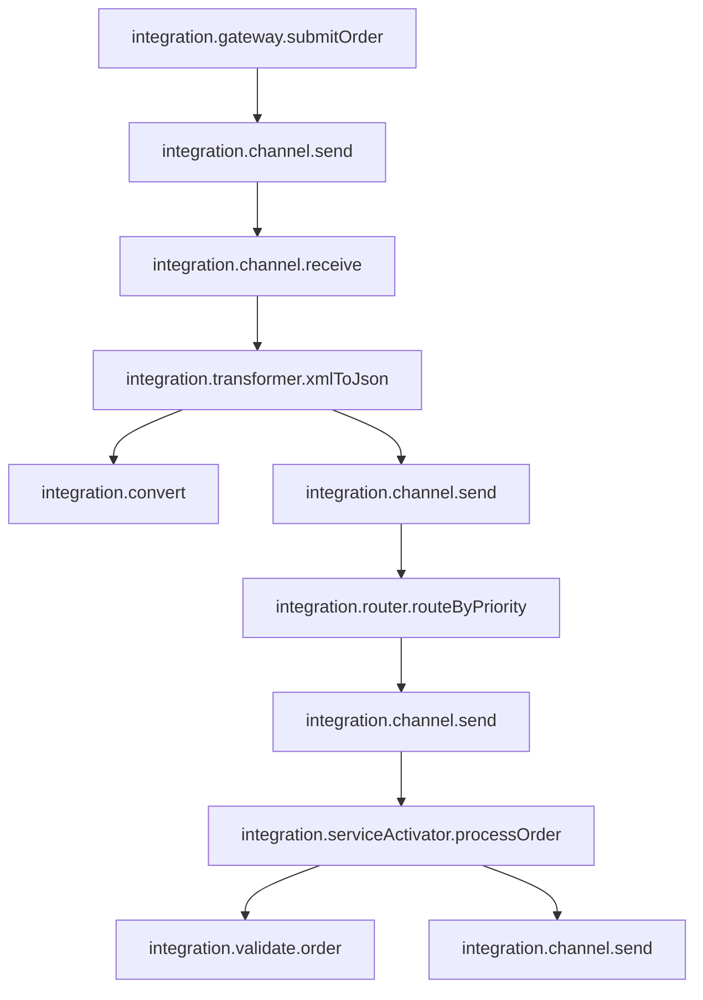

# How to Trace Spring Integration Message Channels with OpenTelemetry

Author: [nawazdhandala](https://www.github.com/nawazdhandala)

Tags: OpenTelemetry, Spring Integration, Message Channels, Java, Enterprise Integration

Description: Comprehensive guide to instrumenting Spring Integration message channels, service activators, gateways, and transformers with OpenTelemetry for distributed tracing across enterprise integration patterns.

Spring Integration implements Enterprise Integration Patterns through message channels, enabling asynchronous, loosely coupled communication between application components. When messages flow through complex integration topologies, understanding message routing, transformation, and processing becomes challenging. OpenTelemetry tracing provides visibility into message flows from source to destination.

## Understanding Spring Integration Architecture

Spring Integration components form processing pipelines:

- **Message Channels** - Transport messages between components
- **Gateways** - Entry points that hide messaging complexity
- **Service Activators** - Process messages by invoking business logic
- **Transformers** - Convert message payloads between formats
- **Routers** - Direct messages to different channels based on content
- **Aggregators** - Combine multiple messages into one
- **Splitters** - Break one message into many

Tracing these components shows how messages move through your integration flows and where processing delays occur.

## Setting Up Dependencies

Add Spring Integration and OpenTelemetry dependencies:

```xml
<!-- pom.xml -->
<dependencies>
    <!-- Spring Integration Core -->
    <dependency>
        <groupId>org.springframework.boot</groupId>
        <artifactId>spring-boot-starter-integration</artifactId>
    </dependency>

    <!-- Spring Integration HTTP for REST endpoints -->
    <dependency>
        <groupId>org.springframework.integration</groupId>
        <artifactId>spring-integration-http</artifactId>
    </dependency>

    <!-- Spring Integration File for file processing -->
    <dependency>
        <groupId>org.springframework.integration</groupId>
        <artifactId>spring-integration-file</artifactId>
    </dependency>

    <!-- OpenTelemetry API -->
    <dependency>
        <groupId>io.opentelemetry</groupId>
        <artifactId>opentelemetry-api</artifactId>
        <version>1.35.0</version>
    </dependency>

    <!-- OpenTelemetry instrumentation annotations -->
    <dependency>
        <groupId>io.opentelemetry.instrumentation</groupId>
        <artifactId>opentelemetry-instrumentation-annotations</artifactId>
        <version>2.1.0</version>
    </dependency>
</dependencies>
```

Configure basic settings:

```yaml
# application.yml
spring:
  integration:
    channel:
      auto-create: true
    endpoint:
      throw-exception-on-late-reply: true

# OpenTelemetry configuration
otel:
  service:
    name: integration-service
  traces:
    exporter: otlp
  exporter:
    otlp:
      endpoint: http://localhost:4317
```

## Tracing Message Channels

Message channels are the backbone of Spring Integration. Create interceptors that add tracing to every message passing through channels.

```java
package com.company.integration.tracing;

import io.opentelemetry.api.trace.Span;
import io.opentelemetry.api.trace.SpanKind;
import io.opentelemetry.api.trace.StatusCode;
import io.opentelemetry.api.trace.Tracer;
import io.opentelemetry.context.Context;
import io.opentelemetry.context.Scope;
import org.springframework.integration.channel.interceptor.ChannelInterceptor;
import org.springframework.messaging.Message;
import org.springframework.messaging.MessageChannel;
import org.springframework.messaging.support.MessageBuilder;
import org.springframework.stereotype.Component;

/**
 * Channel interceptor that adds OpenTelemetry tracing to message flows.
 * Creates spans for messages sent through channels and propagates trace context.
 */
@Component
public class TracingChannelInterceptor implements ChannelInterceptor {

    private static final String TRACE_CONTEXT_HEADER = "otel-trace-context";
    private final Tracer tracer;

    public TracingChannelInterceptor(Tracer tracer) {
        this.tracer = tracer;
    }

    @Override
    public Message<?> preSend(Message<?> message, MessageChannel channel) {
        // Create span for message send operation
        Span span = tracer.spanBuilder("integration.channel.send")
            .setSpanKind(SpanKind.PRODUCER)
            .setAttribute("messaging.system", "spring-integration")
            .setAttribute("messaging.destination", getChannelName(channel))
            .setAttribute("messaging.message.id", message.getHeaders().getId().toString())
            .startSpan();

        // Add message metadata to span
        if (message.getHeaders().getTimestamp() != null) {
            span.setAttribute("messaging.message.timestamp", message.getHeaders().getTimestamp());
        }

        span.setAttribute("messaging.message.payload.type",
            message.getPayload().getClass().getSimpleName());

        // Store span for completion in postSend
        message.getHeaders().put("otel-span", span);

        // Inject trace context into message headers for propagation
        Context currentContext = span.storeInContext(Context.current());
        Message<?> enrichedMessage = MessageBuilder.fromMessage(message)
            .setHeader(TRACE_CONTEXT_HEADER, currentContext)
            .build();

        span.addEvent("message.sent");

        return enrichedMessage;
    }

    @Override
    public void afterSendCompletion(Message<?> message, MessageChannel channel, boolean sent, Exception ex) {
        Span span = (Span) message.getHeaders().get("otel-span");

        if (span == null) {
            return;
        }

        try {
            span.setAttribute("messaging.send.success", sent);

            if (ex != null) {
                span.recordException(ex);
                span.setStatus(StatusCode.ERROR, "Failed to send message");
            } else {
                span.setStatus(StatusCode.OK);
            }
        } finally {
            span.end();
        }
    }

    @Override
    public Message<?> preReceive(MessageChannel channel) {
        // Create span for receive operation
        Span span = tracer.spanBuilder("integration.channel.receive")
            .setSpanKind(SpanKind.CONSUMER)
            .setAttribute("messaging.system", "spring-integration")
            .setAttribute("messaging.destination", getChannelName(channel))
            .startSpan();

        span.addEvent("receive.started");
        span.makeCurrent();

        return null; // Returning null means interceptor doesn't modify the message
    }

    @Override
    public Message<?> postReceive(Message<?> message, MessageChannel channel) {
        Span span = Span.current();

        if (message != null) {
            span.setAttribute("messaging.message.id", message.getHeaders().getId().toString());
            span.setAttribute("messaging.message.payload.type",
                message.getPayload().getClass().getSimpleName());

            // Extract parent trace context if present
            Context parentContext = (Context) message.getHeaders().get(TRACE_CONTEXT_HEADER);
            if (parentContext != null) {
                span.addEvent("trace.context.propagated");
            }

            span.addEvent("message.received");
        } else {
            span.addEvent("no.message.available");
        }

        span.end();
        return message;
    }

    /**
     * Extracts channel name from MessageChannel object.
     */
    private String getChannelName(MessageChannel channel) {
        String className = channel.getClass().getSimpleName();
        return className + "@" + Integer.toHexString(System.identityHashCode(channel));
    }
}
```

Register this interceptor globally for all channels:

```java
package com.company.integration.config;

import com.company.integration.tracing.TracingChannelInterceptor;
import org.springframework.context.annotation.Bean;
import org.springframework.context.annotation.Configuration;
import org.springframework.integration.config.GlobalChannelInterceptor;

@Configuration
public class IntegrationConfig {

    @Bean
    @GlobalChannelInterceptor
    public TracingChannelInterceptor tracingChannelInterceptor(Tracer tracer) {
        return new TracingChannelInterceptor(tracer);
    }
}
```

## Tracing Service Activators

Service activators invoke business logic when messages arrive. Trace these invocations to measure processing time.

```java
package com.company.integration.handlers;

import io.opentelemetry.api.trace.Span;
import io.opentelemetry.api.trace.StatusCode;
import io.opentelemetry.api.trace.Tracer;
import io.opentelemetry.context.Scope;
import io.opentelemetry.instrumentation.annotations.WithSpan;
import org.springframework.integration.annotation.ServiceActivator;
import org.springframework.messaging.Message;
import org.springframework.stereotype.Component;

/**
 * Service activator with OpenTelemetry tracing.
 * Processes order messages with detailed span instrumentation.
 */
@Component
public class TracedOrderProcessor {

    private final OrderService orderService;
    private final Tracer tracer;

    public TracedOrderProcessor(OrderService orderService, Tracer tracer) {
        this.orderService = orderService;
        this.tracer = tracer;
    }

    @ServiceActivator(inputChannel = "orderChannel", outputChannel = "processedOrderChannel")
    @WithSpan("integration.serviceActivator.processOrder")
    public Message<ProcessedOrder> processOrder(Message<Order> message) {
        Span span = Span.current();
        Order order = message.getPayload();

        span.setAttribute("order.id", order.getId());
        span.setAttribute("order.customer.id", order.getCustomerId());
        span.setAttribute("order.items.count", order.getItems().size());
        span.setAttribute("order.total", order.getTotal());

        span.addEvent("order.processing.started");

        try {
            // Validate order with nested span
            validateOrderWithTracing(order);

            // Process order
            ProcessedOrder processed = orderService.process(order);

            span.setAttribute("order.processed.id", processed.getId());
            span.setAttribute("order.processing.time.ms", processed.getProcessingTime());
            span.addEvent("order.processing.completed");
            span.setStatus(StatusCode.OK);

            return MessageBuilder.withPayload(processed)
                .copyHeaders(message.getHeaders())
                .build();

        } catch (Exception e) {
            span.recordException(e);
            span.setAttribute("order.processing.failed", true);
            span.setStatus(StatusCode.ERROR, "Order processing failed");
            throw e;
        }
    }

    /**
     * Validates order with a dedicated span.
     * Separates validation logic in traces for easier debugging.
     */
    private void validateOrderWithTracing(Order order) {
        Span span = tracer.spanBuilder("integration.validate.order")
            .setAttribute("order.id", order.getId())
            .startSpan();

        try (Scope scope = span.makeCurrent()) {
            if (order.getItems().isEmpty()) {
                span.setAttribute("validation.result", "failed");
                span.setAttribute("validation.reason", "empty_order");
                throw new IllegalArgumentException("Order has no items");
            }

            if (order.getTotal() <= 0) {
                span.setAttribute("validation.result", "failed");
                span.setAttribute("validation.reason", "invalid_total");
                throw new IllegalArgumentException("Order total must be positive");
            }

            span.setAttribute("validation.result", "success");
            span.addEvent("order.validated");

        } finally {
            span.end();
        }
    }
}
```

## Tracing Message Transformers

Transformers convert message payloads between formats. Trace transformations to identify conversion bottlenecks.

```java
package com.company.integration.transformers;

import io.opentelemetry.api.trace.Span;
import io.opentelemetry.api.trace.Tracer;
import io.opentelemetry.context.Scope;
import io.opentelemetry.instrumentation.annotations.WithSpan;
import org.springframework.integration.annotation.Transformer;
import org.springframework.messaging.Message;
import org.springframework.messaging.support.MessageBuilder;
import org.springframework.stereotype.Component;

/**
 * Message transformer with OpenTelemetry tracing.
 * Transforms XML orders to JSON with detailed instrumentation.
 */
@Component
public class TracedOrderTransformer {

    private final XmlToJsonConverter converter;
    private final Tracer tracer;

    public TracedOrderTransformer(XmlToJsonConverter converter, Tracer tracer) {
        this.converter = converter;
        this.tracer = tracer;
    }

    @Transformer(inputChannel = "xmlOrderChannel", outputChannel = "jsonOrderChannel")
    @WithSpan("integration.transformer.xmlToJson")
    public Message<String> transformXmlToJson(Message<String> message) {
        Span span = Span.current();
        String xmlPayload = message.getPayload();

        span.setAttribute("transform.input.format", "xml");
        span.setAttribute("transform.output.format", "json");
        span.setAttribute("transform.input.size.bytes", xmlPayload.length());

        span.addEvent("transformation.started");

        try {
            long startTime = System.nanoTime();
            String jsonPayload = convertWithTracing(xmlPayload);
            long duration = System.nanoTime() - startTime;

            span.setAttribute("transform.duration.ns", duration);
            span.setAttribute("transform.output.size.bytes", jsonPayload.length());
            span.addEvent("transformation.completed");

            return MessageBuilder.withPayload(jsonPayload)
                .copyHeaders(message.getHeaders())
                .setHeader("content-type", "application/json")
                .build();

        } catch (Exception e) {
            span.recordException(e);
            span.setAttribute("transformation.failed", true);
            throw e;
        }
    }

    /**
     * Performs XML to JSON conversion with a nested span.
     */
    private String convertWithTracing(String xml) {
        Span span = tracer.spanBuilder("integration.convert")
            .setAttribute("converter.type", "xml-to-json")
            .startSpan();

        try (Scope scope = span.makeCurrent()) {
            String json = converter.convert(xml);
            span.setAttribute("conversion.successful", true);
            return json;
        } catch (Exception e) {
            span.recordException(e);
            span.setAttribute("conversion.successful", false);
            throw e;
        } finally {
            span.end();
        }
    }
}
```

## Tracing Message Routers

Routers direct messages to different channels based on content. Trace routing decisions to understand message flow patterns.

```java
package com.company.integration.routers;

import io.opentelemetry.api.trace.Span;
import io.opentelemetry.instrumentation.annotations.WithSpan;
import org.springframework.integration.annotation.Router;
import org.springframework.messaging.Message;
import org.springframework.stereotype.Component;

/**
 * Message router with OpenTelemetry tracing.
 * Routes orders based on priority with detailed span attributes.
 */
@Component
public class TracedOrderRouter {

    @Router(inputChannel = "incomingOrderChannel")
    @WithSpan("integration.router.routeByPriority")
    public String routeOrder(Message<Order> message) {
        Span span = Span.current();
        Order order = message.getPayload();

        span.setAttribute("order.id", order.getId());
        span.setAttribute("order.priority", order.getPriority());

        String targetChannel;

        switch (order.getPriority()) {
            case HIGH:
                targetChannel = "highPriorityOrderChannel";
                span.setAttribute("routing.decision", "high_priority");
                break;
            case MEDIUM:
                targetChannel = "mediumPriorityOrderChannel";
                span.setAttribute("routing.decision", "medium_priority");
                break;
            case LOW:
                targetChannel = "lowPriorityOrderChannel";
                span.setAttribute("routing.decision", "low_priority");
                break;
            default:
                targetChannel = "defaultOrderChannel";
                span.setAttribute("routing.decision", "default");
        }

        span.setAttribute("routing.target.channel", targetChannel);
        span.addEvent("message.routed");

        return targetChannel;
    }
}
```

## Tracing Message Gateways

Gateways provide programmatic access to messaging systems. Trace gateway operations to measure end-to-end latency.

```java
package com.company.integration.gateways;

import io.opentelemetry.instrumentation.annotations.WithSpan;
import org.springframework.integration.annotation.Gateway;
import org.springframework.integration.annotation.MessagingGateway;

/**
 * Messaging gateway with OpenTelemetry tracing.
 * Provides traced interface for sending orders to integration flows.
 */
@MessagingGateway
public interface TracedOrderGateway {

    @Gateway(requestChannel = "orderChannel", replyChannel = "processedOrderChannel")
    @WithSpan("integration.gateway.submitOrder")
    ProcessedOrder submitOrder(Order order);

    @Gateway(requestChannel = "orderChannel")
    @WithSpan("integration.gateway.submitOrderAsync")
    void submitOrderAsync(Order order);
}
```

## Tracing Aggregators

Aggregators combine multiple messages into one. Trace aggregation to understand batching performance.

```java
package com.company.integration.aggregators;

import io.opentelemetry.api.trace.Span;
import io.opentelemetry.api.trace.Tracer;
import io.opentelemetry.context.Scope;
import org.springframework.integration.annotation.Aggregator;
import org.springframework.integration.annotation.CorrelationStrategy;
import org.springframework.integration.annotation.ReleaseStrategy;
import org.springframework.messaging.Message;
import org.springframework.stereotype.Component;

import java.util.List;

/**
 * Message aggregator with OpenTelemetry tracing.
 * Combines order items into complete orders with span instrumentation.
 */
@Component
public class TracedOrderAggregator {

    private final Tracer tracer;

    public TracedOrderAggregator(Tracer tracer) {
        this.tracer = tracer;
    }

    @Aggregator(inputChannel = "orderItemChannel", outputChannel = "aggregatedOrderChannel")
    public Message<AggregatedOrder> aggregate(List<Message<OrderItem>> messages) {
        Span span = tracer.spanBuilder("integration.aggregator.aggregateOrder")
            .setAttribute("aggregator.message.count", messages.size())
            .startSpan();

        try (Scope scope = span.makeCurrent()) {
            span.addEvent("aggregation.started");

            // Extract correlation ID
            String orderId = (String) messages.get(0).getHeaders().get("orderId");
            span.setAttribute("order.id", orderId);

            // Aggregate items
            AggregatedOrder aggregated = new AggregatedOrder();
            aggregated.setOrderId(orderId);

            for (Message<OrderItem> message : messages) {
                aggregated.addItem(message.getPayload());
            }

            span.setAttribute("order.items.total", aggregated.getItems().size());
            span.setAttribute("order.total.amount", aggregated.getTotalAmount());
            span.addEvent("aggregation.completed");

            return MessageBuilder.withPayload(aggregated)
                .setHeader("orderId", orderId)
                .build();

        } catch (Exception e) {
            span.recordException(e);
            throw e;
        } finally {
            span.end();
        }
    }

    @CorrelationStrategy
    public String correlationKey(Message<OrderItem> message) {
        return (String) message.getHeaders().get("orderId");
    }

    @ReleaseStrategy
    public boolean canRelease(List<Message<OrderItem>> messages) {
        // Release when we have all items for the order
        int expectedCount = (int) messages.get(0).getHeaders().get("totalItems");
        return messages.size() == expectedCount;
    }
}
```

## Complete Integration Flow Example

Wire all traced components together in a complete integration flow:

```java
package com.company.integration.config;

import org.springframework.context.annotation.Bean;
import org.springframework.context.annotation.Configuration;
import org.springframework.integration.channel.DirectChannel;
import org.springframework.integration.channel.QueueChannel;
import org.springframework.integration.dsl.IntegrationFlow;
import org.springframework.messaging.MessageChannel;

/**
 * Complete integration flow with OpenTelemetry tracing.
 * Demonstrates traced message flow through multiple components.
 */
@Configuration
public class OrderProcessingFlowConfig {

    @Bean
    public IntegrationFlow orderProcessingFlow(
            TracedOrderTransformer transformer,
            TracedOrderRouter router,
            TracedOrderProcessor processor) {

        return IntegrationFlow
            .from("xmlOrderChannel")
            .transform(transformer::transformXmlToJson)
            .channel("jsonOrderChannel")
            .route(router::routeOrder)
            .get();
    }

    @Bean
    public MessageChannel xmlOrderChannel() {
        return new DirectChannel();
    }

    @Bean
    public MessageChannel jsonOrderChannel() {
        return new DirectChannel();
    }

    @Bean
    public MessageChannel highPriorityOrderChannel() {
        return new QueueChannel(100);
    }

    @Bean
    public MessageChannel mediumPriorityOrderChannel() {
        return new QueueChannel(200);
    }

    @Bean
    public MessageChannel lowPriorityOrderChannel() {
        return new QueueChannel(500);
    }
}
```

## Integration Flow Trace Visualization

A complete message flow through Spring Integration creates this span hierarchy:



This visualization shows the complete message journey from gateway submission through transformation, routing, and processing.

## Tracer Configuration

Register the OpenTelemetry tracer bean:

```java
package com.company.integration.config;

import io.opentelemetry.api.GlobalOpenTelemetry;
import io.opentelemetry.api.trace.Tracer;
import org.springframework.context.annotation.Bean;
import org.springframework.context.annotation.Configuration;

@Configuration
public class TracingConfig {

    @Bean
    public Tracer tracer() {
        return GlobalOpenTelemetry.getTracer("spring-integration", "1.0.0");
    }
}
```

Comprehensive OpenTelemetry tracing for Spring Integration reveals how messages flow through your enterprise integration patterns. By instrumenting channels, service activators, transformers, routers, and gateways, you gain complete visibility into message processing pipelines. This observability makes debugging integration flows straightforward and helps optimize message processing performance.
