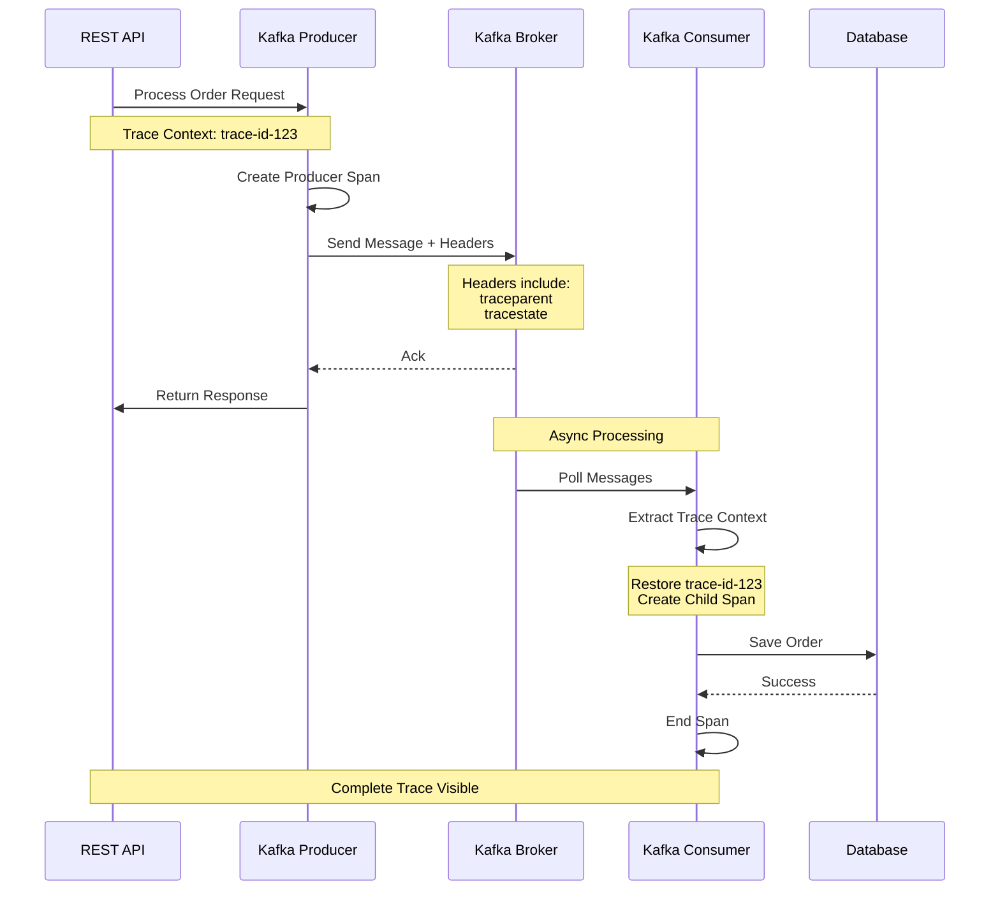

# How to Trace Spring Kafka Producers and Consumers with OpenTelemetry

Author: [nawazdhandala](https://www.github.com/nawazdhandala)

Tags: OpenTelemetry, Spring Kafka, Producers, Consumers, Distributed Tracing, Java

Description: Comprehensive guide to implementing distributed tracing for Spring Kafka applications using OpenTelemetry, including producer and consumer instrumentation, context propagation, and troubleshooting patterns.

Message brokers like Kafka introduce unique challenges for distributed tracing. Unlike synchronous HTTP requests where context flows naturally through request headers, asynchronous messaging requires explicit context propagation through message metadata. When traces break at Kafka boundaries, debugging distributed systems becomes exponentially harder. OpenTelemetry provides robust instrumentation for Spring Kafka that maintains trace continuity across producer-consumer boundaries.

The challenge with Kafka tracing stems from its asynchronous nature. A producer sends a message and continues execution without waiting for processing. The consumer receives that message later, potentially on a different server. Without proper instrumentation, these appear as separate, unrelated traces. Effective tracing must link producer spans to consumer spans, creating a complete picture of message flow through your system.

## Setting Up OpenTelemetry for Spring Kafka

Begin by adding the necessary dependencies to your Spring Boot project. The OpenTelemetry instrumentation includes automatic support for Kafka clients.

```xml
<dependency>
    <groupId>org.springframework.kafka</groupId>
    <artifactId>spring-kafka</artifactId>
    <version>3.1.2</version>
</dependency>
<dependency>
    <groupId>io.opentelemetry.instrumentation</groupId>
    <artifactId>opentelemetry-spring-boot-starter</artifactId>
    <version>2.1.0-alpha</version>
</dependency>
<dependency>
    <groupId>io.opentelemetry.instrumentation</groupId>
    <artifactId>opentelemetry-kafka-clients-2.6</artifactId>
    <version>2.1.0-alpha</version>
</dependency>
```

Configure OpenTelemetry with Kafka-specific settings in your application.yml.

```yaml
spring:
  application:
    name: order-service
  kafka:
    bootstrap-servers: localhost:9092
    producer:
      key-serializer: org.apache.kafka.common.serialization.StringSerializer
      value-serializer: org.springframework.kafka.support.serializer.JsonSerializer
      acks: all
    consumer:
      key-deserializer: org.apache.kafka.common.serialization.StringDeserializer
      value-deserializer: org.springframework.kafka.support.serializer.JsonDeserializer
      group-id: order-consumer-group
      auto-offset-reset: earliest

otel:
  service:
    name: order-service
  traces:
    exporter: otlp
  exporter:
    otlp:
      endpoint: http://localhost:4318
  instrumentation:
    kafka:
      # Enable experimental features for better Kafka tracing
      experimental-span-attributes: true
```

## Instrumenting Kafka Producers

Start by creating a configuration class that sets up the OpenTelemetry-instrumented Kafka producer factory.

```java
package com.oneuptime.config;

import io.opentelemetry.api.OpenTelemetry;
import io.opentelemetry.instrumentation.kafkaclients.v2_6.KafkaTelemetry;
import org.apache.kafka.clients.producer.ProducerConfig;
import org.springframework.beans.factory.annotation.Autowired;
import org.springframework.context.annotation.Bean;
import org.springframework.context.annotation.Configuration;
import org.springframework.kafka.core.DefaultKafkaProducerFactory;
import org.springframework.kafka.core.KafkaTemplate;
import org.springframework.kafka.core.ProducerFactory;

import java.util.HashMap;
import java.util.Map;

@Configuration
public class KafkaProducerConfiguration {

    @Autowired
    private OpenTelemetry openTelemetry;

    /**
     * Create a producer factory with OpenTelemetry instrumentation
     * This intercepts all produce operations to inject trace context
     */
    @Bean
    public ProducerFactory<String, Object> producerFactory() {
        Map<String, Object> configProps = new HashMap<>();
        configProps.put(ProducerConfig.BOOTSTRAP_SERVERS_CONFIG, "localhost:9092");
        configProps.put(ProducerConfig.KEY_SERIALIZER_CLASS_CONFIG,
            "org.apache.kafka.common.serialization.StringSerializer");
        configProps.put(ProducerConfig.VALUE_SERIALIZER_CLASS_CONFIG,
            "org.springframework.kafka.support.serializer.JsonSerializer");

        // Apply OpenTelemetry instrumentation to the producer factory
        DefaultKafkaProducerFactory<String, Object> factory =
            new DefaultKafkaProducerFactory<>(configProps);

        // Wrap producer factory with telemetry
        KafkaTelemetry telemetry = KafkaTelemetry.create(openTelemetry);
        factory.setProducerPostProcessor(telemetry::wrap);

        return factory;
    }

    @Bean
    public KafkaTemplate<String, Object> kafkaTemplate() {
        return new KafkaTemplate<>(producerFactory());
    }
}
```

Create a service that produces messages with automatic trace context propagation.

```java
package com.oneuptime.service;

import io.opentelemetry.api.trace.Span;
import io.opentelemetry.api.trace.Tracer;
import io.opentelemetry.context.Scope;
import org.slf4j.Logger;
import org.slf4j.LoggerFactory;
import org.springframework.kafka.core.KafkaTemplate;
import org.springframework.kafka.support.SendResult;
import org.springframework.stereotype.Service;

import java.util.concurrent.CompletableFuture;

@Service
public class OrderProducerService {

    private static final Logger logger = LoggerFactory.getLogger(OrderProducerService.class);
    private static final String TOPIC = "orders";

    private final KafkaTemplate<String, Object> kafkaTemplate;
    private final Tracer tracer;

    public OrderProducerService(
            KafkaTemplate<String, Object> kafkaTemplate,
            Tracer tracer) {
        this.kafkaTemplate = kafkaTemplate;
        this.tracer = tracer;
    }

    /**
     * Send order message to Kafka with automatic trace propagation
     * The trace context is injected into Kafka headers automatically
     */
    public void sendOrder(OrderEvent order) {
        // Create a span for the business logic
        Span span = tracer.spanBuilder("process.order")
            .setAttribute("order.id", order.getOrderId())
            .setAttribute("order.amount", order.getAmount())
            .startSpan();

        try (Scope scope = span.makeCurrent()) {
            // Send message - trace context automatically propagates in headers
            CompletableFuture<SendResult<String, Object>> future =
                kafkaTemplate.send(TOPIC, order.getOrderId(), order);

            future.whenComplete((result, ex) -> {
                if (ex != null) {
                    span.recordException(ex);
                    logger.error("Failed to send order: {}", order.getOrderId(), ex);
                } else {
                    logger.info("Order sent successfully: {} to partition {}",
                        order.getOrderId(),
                        result.getRecordMetadata().partition());
                    span.addEvent("order.sent");
                }
            });
        } finally {
            span.end();
        }
    }

    /**
     * Send message with custom headers and attributes
     */
    public void sendOrderWithMetadata(OrderEvent order, String customerId) {
        Span span = tracer.spanBuilder("process.order.with.metadata")
            .setAttribute("order.id", order.getOrderId())
            .setAttribute("customer.id", customerId)
            .setAttribute("messaging.system", "kafka")
            .setAttribute("messaging.destination", TOPIC)
            .startSpan();

        try (Scope scope = span.makeCurrent()) {
            kafkaTemplate.send(TOPIC, order.getOrderId(), order)
                .whenComplete((result, ex) -> {
                    if (ex == null) {
                        span.setAttribute("messaging.kafka.partition",
                            result.getRecordMetadata().partition());
                        span.setAttribute("messaging.kafka.offset",
                            result.getRecordMetadata().offset());
                    }
                });
        } finally {
            span.end();
        }
    }
}
```

## Instrumenting Kafka Consumers

Configure the consumer factory with OpenTelemetry instrumentation to extract trace context from message headers.

```java
package com.oneuptime.config;

import io.opentelemetry.api.OpenTelemetry;
import io.opentelemetry.instrumentation.kafkaclients.v2_6.KafkaTelemetry;
import org.apache.kafka.clients.consumer.ConsumerConfig;
import org.springframework.beans.factory.annotation.Autowired;
import org.springframework.context.annotation.Bean;
import org.springframework.context.annotation.Configuration;
import org.springframework.kafka.config.ConcurrentKafkaListenerContainerFactory;
import org.springframework.kafka.core.ConsumerFactory;
import org.springframework.kafka.core.DefaultKafkaConsumerFactory;

import java.util.HashMap;
import java.util.Map;

@Configuration
public class KafkaConsumerConfiguration {

    @Autowired
    private OpenTelemetry openTelemetry;

    /**
     * Configure consumer factory with OpenTelemetry instrumentation
     * This extracts trace context from Kafka message headers
     */
    @Bean
    public ConsumerFactory<String, Object> consumerFactory() {
        Map<String, Object> configProps = new HashMap<>();
        configProps.put(ConsumerConfig.BOOTSTRAP_SERVERS_CONFIG, "localhost:9092");
        configProps.put(ConsumerConfig.GROUP_ID_CONFIG, "order-consumer-group");
        configProps.put(ConsumerConfig.KEY_DESERIALIZER_CLASS_CONFIG,
            "org.apache.kafka.common.serialization.StringDeserializer");
        configProps.put(ConsumerConfig.VALUE_DESERIALIZER_CLASS_CONFIG,
            "org.springframework.kafka.support.serializer.JsonDeserializer");
        configProps.put(ConsumerConfig.AUTO_OFFSET_RESET_CONFIG, "earliest");

        // Apply OpenTelemetry instrumentation
        DefaultKafkaConsumerFactory<String, Object> factory =
            new DefaultKafkaConsumerFactory<>(configProps);

        KafkaTelemetry telemetry = KafkaTelemetry.create(openTelemetry);
        factory.setConsumerPostProcessor(telemetry::wrap);

        return factory;
    }

    @Bean
    public ConcurrentKafkaListenerContainerFactory<String, Object>
            kafkaListenerContainerFactory() {
        ConcurrentKafkaListenerContainerFactory<String, Object> factory =
            new ConcurrentKafkaListenerContainerFactory<>();
        factory.setConsumerFactory(consumerFactory());
        // Process messages concurrently for better throughput
        factory.setConcurrency(3);
        return factory;
    }
}
```

Implement a consumer that automatically continues the trace from the producer.

```java
package com.oneuptime.consumer;

import io.opentelemetry.api.trace.Span;
import io.opentelemetry.api.trace.Tracer;
import io.opentelemetry.context.Scope;
import org.apache.kafka.clients.consumer.ConsumerRecord;
import org.slf4j.Logger;
import org.slf4j.LoggerFactory;
import org.springframework.kafka.annotation.KafkaListener;
import org.springframework.kafka.support.Acknowledgment;
import org.springframework.kafka.support.KafkaHeaders;
import org.springframework.messaging.handler.annotation.Header;
import org.springframework.messaging.handler.annotation.Payload;
import org.springframework.stereotype.Component;

@Component
public class OrderConsumerService {

    private static final Logger logger = LoggerFactory.getLogger(OrderConsumerService.class);

    private final Tracer tracer;
    private final OrderProcessingService processingService;

    public OrderConsumerService(
            Tracer tracer,
            OrderProcessingService processingService) {
        this.tracer = tracer;
        this.processingService = processingService;
    }

    /**
     * Consume order messages with automatic trace context extraction
     * The trace context from the producer is automatically restored
     */
    @KafkaListener(topics = "orders", groupId = "order-consumer-group")
    public void consumeOrder(
            @Payload OrderEvent order,
            @Header(KafkaHeaders.RECEIVED_PARTITION) int partition,
            @Header(KafkaHeaders.OFFSET) long offset) {

        // Create a span for consumer processing
        // This automatically becomes a child of the producer span
        Span span = tracer.spanBuilder("consume.order")
            .setAttribute("order.id", order.getOrderId())
            .setAttribute("messaging.kafka.partition", partition)
            .setAttribute("messaging.kafka.offset", offset)
            .setAttribute("messaging.operation", "receive")
            .startSpan();

        try (Scope scope = span.makeCurrent()) {
            logger.info("Received order: {} from partition: {}, offset: {}",
                order.getOrderId(), partition, offset);

            // Process the order
            processingService.processOrder(order);

            span.addEvent("order.processed");
            span.setAttribute("processing.status", "success");

        } catch (Exception e) {
            span.recordException(e);
            span.setAttribute("processing.status", "failed");
            logger.error("Failed to process order: {}", order.getOrderId(), e);
            throw e; // Trigger retry logic
        } finally {
            span.end();
        }
    }

    /**
     * Consumer with manual acknowledgment for better control
     */
    @KafkaListener(
        topics = "orders.priority",
        groupId = "order-priority-consumer",
        containerFactory = "kafkaListenerContainerFactory"
    )
    public void consumePriorityOrder(
            ConsumerRecord<String, OrderEvent> record,
            Acknowledgment acknowledgment) {

        OrderEvent order = record.value();

        Span span = tracer.spanBuilder("consume.priority.order")
            .setAttribute("order.id", order.getOrderId())
            .setAttribute("order.priority", "high")
            .setAttribute("messaging.kafka.partition", record.partition())
            .setAttribute("messaging.kafka.offset", record.offset())
            .startSpan();

        try (Scope scope = span.makeCurrent()) {
            processingService.processPriorityOrder(order);

            // Manually acknowledge after successful processing
            acknowledgment.acknowledge();
            span.addEvent("order.acknowledged");

        } catch (Exception e) {
            span.recordException(e);
            logger.error("Failed to process priority order: {}", order.getOrderId(), e);
            // Don't acknowledge - message will be redelivered
            throw e;
        } finally {
            span.end();
        }
    }
}
```

## Trace Context Propagation Flow

Understanding how trace context flows through Kafka helps debug issues when traces break.



## Handling Batch Processing

Kafka consumers often process messages in batches for efficiency. Each message in the batch should maintain its own trace context.

```java
package com.oneuptime.consumer;

import io.opentelemetry.api.trace.Span;
import io.opentelemetry.api.trace.Tracer;
import io.opentelemetry.context.Context;
import io.opentelemetry.context.Scope;
import org.apache.kafka.clients.consumer.ConsumerRecord;
import org.slf4j.Logger;
import org.slf4j.LoggerFactory;
import org.springframework.kafka.annotation.KafkaListener;
import org.springframework.stereotype.Component;

import java.util.List;

@Component
public class BatchOrderConsumer {

    private static final Logger logger = LoggerFactory.getLogger(BatchOrderConsumer.class);

    private final Tracer tracer;
    private final OrderProcessingService processingService;

    public BatchOrderConsumer(Tracer tracer, OrderProcessingService processingService) {
        this.tracer = tracer;
        this.processingService = processingService;
    }

    /**
     * Process messages in batches while maintaining individual trace contexts
     * Each message gets its own span linked to the original producer
     */
    @KafkaListener(
        topics = "orders.batch",
        groupId = "batch-consumer-group",
        containerFactory = "batchFactory"
    )
    public void consumeOrderBatch(List<ConsumerRecord<String, OrderEvent>> records) {

        // Create a parent span for the entire batch operation
        Span batchSpan = tracer.spanBuilder("consume.order.batch")
            .setAttribute("batch.size", records.size())
            .startSpan();

        try (Scope batchScope = batchSpan.makeCurrent()) {
            logger.info("Processing batch of {} orders", records.size());

            int successCount = 0;
            int failureCount = 0;

            // Process each record with its own trace context
            for (ConsumerRecord<String, OrderEvent> record : records) {
                OrderEvent order = record.value();

                // Each message maintains its own trace context from the producer
                Span recordSpan = tracer.spanBuilder("consume.order.from.batch")
                    .setAttribute("order.id", order.getOrderId())
                    .setAttribute("messaging.kafka.partition", record.partition())
                    .setAttribute("messaging.kafka.offset", record.offset())
                    .startSpan();

                try (Scope recordScope = recordSpan.makeCurrent()) {
                    processingService.processOrder(order);
                    successCount++;
                    recordSpan.setAttribute("processing.status", "success");

                } catch (Exception e) {
                    failureCount++;
                    recordSpan.recordException(e);
                    recordSpan.setAttribute("processing.status", "failed");
                    logger.error("Failed to process order in batch: {}",
                        order.getOrderId(), e);
                } finally {
                    recordSpan.end();
                }
            }

            batchSpan.setAttribute("batch.success.count", successCount);
            batchSpan.setAttribute("batch.failure.count", failureCount);
            batchSpan.addEvent("batch.processing.complete");

        } finally {
            batchSpan.end();
        }
    }
}
```

## Error Handling and Dead Letter Queues

When consumers fail to process messages, traces should capture the error path including dead letter queue operations.

```java
package com.oneuptime.consumer;

import io.opentelemetry.api.trace.Span;
import io.opentelemetry.api.trace.StatusCode;
import io.opentelemetry.api.trace.Tracer;
import io.opentelemetry.context.Scope;
import org.slf4j.Logger;
import org.slf4j.LoggerFactory;
import org.springframework.kafka.annotation.KafkaListener;
import org.springframework.kafka.core.KafkaTemplate;
import org.springframework.kafka.support.KafkaHeaders;
import org.springframework.messaging.handler.annotation.Header;
import org.springframework.messaging.handler.annotation.Payload;
import org.springframework.stereotype.Component;

@Component
public class ResilientOrderConsumer {

    private static final Logger logger = LoggerFactory.getLogger(ResilientOrderConsumer.class);
    private static final String DLQ_TOPIC = "orders.dlq";
    private static final int MAX_RETRIES = 3;

    private final Tracer tracer;
    private final OrderProcessingService processingService;
    private final KafkaTemplate<String, Object> kafkaTemplate;

    public ResilientOrderConsumer(
            Tracer tracer,
            OrderProcessingService processingService,
            KafkaTemplate<String, Object> kafkaTemplate) {
        this.tracer = tracer;
        this.processingService = processingService;
        this.kafkaTemplate = kafkaTemplate;
    }

    /**
     * Consumer with retry logic and dead letter queue handling
     * Maintains trace context through retry attempts
     */
    @KafkaListener(topics = "orders.resilient", groupId = "resilient-consumer")
    public void consumeOrderWithRetry(
            @Payload OrderEvent order,
            @Header(value = "retry-count", required = false) Integer retryCount) {

        int currentRetry = retryCount != null ? retryCount : 0;

        Span span = tracer.spanBuilder("consume.order.with.retry")
            .setAttribute("order.id", order.getOrderId())
            .setAttribute("retry.count", currentRetry)
            .setAttribute("retry.max", MAX_RETRIES)
            .startSpan();

        try (Scope scope = span.makeCurrent()) {
            processingService.processOrder(order);
            span.setStatus(StatusCode.OK);

        } catch (Exception e) {
            span.recordException(e);
            span.setStatus(StatusCode.ERROR, "Order processing failed");

            if (currentRetry < MAX_RETRIES) {
                // Retry the message
                span.addEvent("order.retry.scheduled");
                logger.warn("Retrying order: {} (attempt {}/{})",
                    order.getOrderId(), currentRetry + 1, MAX_RETRIES);
                throw e; // Let Kafka retry mechanism handle it

            } else {
                // Send to dead letter queue
                sendToDeadLetterQueue(order, e, span);
            }
        } finally {
            span.end();
        }
    }

    /**
     * Send failed message to DLQ while maintaining trace context
     */
    private void sendToDeadLetterQueue(OrderEvent order, Exception error, Span parentSpan) {
        Span dlqSpan = tracer.spanBuilder("send.to.dlq")
            .setAttribute("order.id", order.getOrderId())
            .setAttribute("error.message", error.getMessage())
            .setAttribute("messaging.destination", DLQ_TOPIC)
            .startSpan();

        try (Scope scope = dlqSpan.makeCurrent()) {
            kafkaTemplate.send(DLQ_TOPIC, order.getOrderId(), order)
                .whenComplete((result, ex) -> {
                    if (ex != null) {
                        dlqSpan.recordException(ex);
                        dlqSpan.setStatus(StatusCode.ERROR);
                        logger.error("Failed to send to DLQ: {}", order.getOrderId(), ex);
                    } else {
                        dlqSpan.addEvent("message.sent.to.dlq");
                        logger.info("Order sent to DLQ: {}", order.getOrderId());
                    }
                });
        } finally {
            dlqSpan.end();
        }
    }
}
```

## Custom Trace Attributes for Kafka Operations

Add domain-specific attributes to spans for better observability and filtering.

```java
package com.oneuptime.tracing;

import io.opentelemetry.api.trace.Span;
import org.aspectj.lang.ProceedingJoinPoint;
import org.aspectj.lang.annotation.Around;
import org.aspectj.lang.annotation.Aspect;
import org.springframework.stereotype.Component;

/**
 * Aspect that adds custom attributes to Kafka operation spans
 */
@Aspect
@Component
public class KafkaTracingAspect {

    @Around("@annotation(org.springframework.kafka.annotation.KafkaListener)")
    public Object addKafkaAttributes(ProceedingJoinPoint joinPoint) throws Throwable {
        Span span = Span.current();

        // Add custom business attributes
        Object[] args = joinPoint.getArgs();
        if (args.length > 0 && args[0] instanceof OrderEvent) {
            OrderEvent order = (OrderEvent) args[0];
            span.setAttribute("business.order.type", order.getType());
            span.setAttribute("business.order.customer", order.getCustomerId());
            span.setAttribute("business.order.amount", order.getAmount());
        }

        // Add processing metadata
        span.setAttribute("consumer.method", joinPoint.getSignature().getName());
        span.setAttribute("consumer.class", joinPoint.getTarget().getClass().getSimpleName());

        return joinPoint.proceed();
    }
}
```

Tracing Kafka applications with OpenTelemetry requires understanding both the instrumentation mechanics and the asynchronous nature of message processing. Proper configuration ensures trace context propagates through message headers automatically. Creating meaningful spans at each processing stage provides visibility into message flow. Handling errors correctly maintains trace continuity even through retry logic and dead letter queues. The result is comprehensive distributed traces that span from HTTP request through Kafka to final processing, enabling effective debugging and performance optimization.
