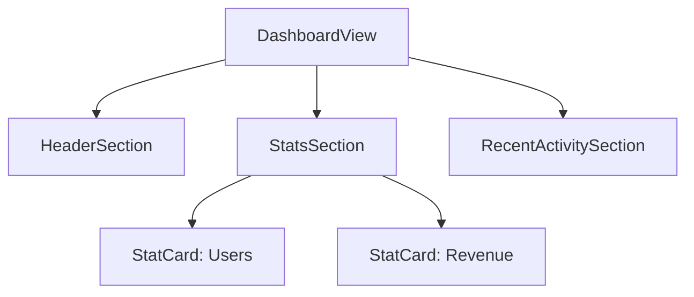
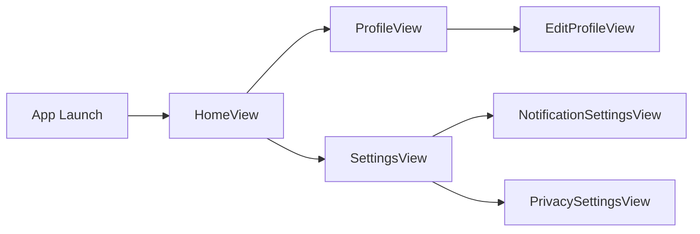

# How to Trace SwiftUI View Lifecycle Events with OpenTelemetry Custom Spans

Author: [nawazdhandala](https://www.github.com/nawazdhandala)

Tags: OpenTelemetry, Swift, SwiftUI, View Lifecycle, Custom Spans, iOS

Description: Instrument SwiftUI view lifecycle events with OpenTelemetry custom spans to understand view rendering performance and user navigation patterns in your iOS app.

SwiftUI revolutionized iOS development with its declarative syntax and automatic UI updates. However, this abstraction makes it harder to understand what happens under the hood. Views appear, disappear, and re-render in response to state changes, but tracking these events requires deliberate instrumentation. OpenTelemetry custom spans provide visibility into SwiftUI's view lifecycle, helping you optimize rendering performance and understand user behavior.

## Understanding SwiftUI View Lifecycle

Unlike UIKit's well-defined lifecycle methods, SwiftUI views have a more fluid existence. Views are value types that get recreated frequently. What persists is the view's identity and state, while the view struct itself is ephemeral.

SwiftUI provides several hooks into the view lifecycle through view modifiers. The `onAppear` and `onDisappear` modifiers fire when a view becomes visible or leaves the screen. The `task` modifier handles async operations tied to view lifetime. Understanding when these events fire helps you create meaningful traces of user interactions.

## Creating a Basic View Tracer

Start with a reusable view modifier that creates spans for view lifecycle events. This modifier wraps any SwiftUI view and automatically instruments its appearance and disappearance.

```swift
import SwiftUI
import OpenTelemetryApi

struct TracedView<Content: View>: View {
    let viewName: String
    let content: Content
    let tracer: Tracer

    @State private var currentSpan: Span?

    init(
        name: String,
        @ViewBuilder content: () -> Content
    ) {
        self.viewName = name
        self.content = content()
        self.tracer = OpenTelemetry.instance.tracerProvider.get(
            instrumentationName: "swiftui-views",
            instrumentationVersion: "1.0.0"
        )
    }

    var body: some View {
        content
            .onAppear {
                handleViewAppear()
            }
            .onDisappear {
                handleViewDisappear()
            }
    }

    private func handleViewAppear() {
        // Create a span when the view appears
        let span = tracer.spanBuilder(spanName: "\(viewName).appear")
            .setSpanKind(spanKind: .client)
            .startSpan()

        span.setAttribute(key: "view.name", value: viewName)
        span.setAttribute(key: "view.event", value: "appear")

        currentSpan = span
    }

    private func handleViewDisappear() {
        // End the span when the view disappears
        currentSpan?.setAttribute(key: "view.event", value: "disappear")
        currentSpan?.end()
        currentSpan = nil
    }
}

// View modifier extension for easier usage
extension View {
    func traced(name: String) -> some View {
        TracedView(name: name) {
            self
        }
    }
}
```

Now you can instrument any view by adding the `traced` modifier:

```swift
struct HomeView: View {
    var body: some View {
        VStack {
            Text("Welcome to Home")
            NavigationLink("Go to Profile", destination: ProfileView())
        }
        .traced(name: "HomeView")
    }
}

struct ProfileView: View {
    var body: some View {
        VStack {
            Text("User Profile")
        }
        .traced(name: "ProfileView")
    }
}
```

## Tracking View Rendering Performance

Views appearing and disappearing is just the start. Understanding how long views take to render helps identify performance bottlenecks. SwiftUI's `onAppear` fires after the view is rendered, so you need a different approach to measure rendering time.

```swift
import SwiftUI
import OpenTelemetryApi

struct RenderTracedView<Content: View>: View {
    let viewName: String
    let content: Content
    let tracer: Tracer

    @State private var renderStartTime: Date?
    @State private var viewSpan: Span?

    init(
        name: String,
        @ViewBuilder content: () -> Content
    ) {
        self.viewName = name
        self.content = content()
        self.tracer = OpenTelemetry.instance.tracerProvider.get(
            instrumentationName: "swiftui-render",
            instrumentationVersion: "1.0.0"
        )

        // Capture the init time as an approximation of render start
        _renderStartTime = State(initialValue: Date())
    }

    var body: some View {
        content
            .onAppear {
                handleRenderComplete()
            }
            .onDisappear {
                handleViewDisappear()
            }
    }

    private func handleRenderComplete() {
        guard let startTime = renderStartTime else { return }

        let renderDuration = Date().timeIntervalSince(startTime)

        // Create a span representing the render operation
        let span = tracer.spanBuilder(spanName: "\(viewName).render")
            .setStartTime(time: startTime)
            .startSpan()

        span.setAttribute(key: "view.name", value: viewName)
        span.setAttribute(key: "render.duration_ms", value: renderDuration * 1000)

        span.end(time: Date())

        // Create a new span for view lifetime
        let lifetimeSpan = tracer.spanBuilder(spanName: "\(viewName).lifetime")
            .startSpan()

        lifetimeSpan.setAttribute(key: "view.name", value: viewName)
        viewSpan = lifetimeSpan
    }

    private func handleViewDisappear() {
        viewSpan?.end()
        viewSpan = nil
    }
}

extension View {
    func renderTraced(name: String) -> some View {
        RenderTracedView(name: name) {
            self
        }
    }
}
```

This creates two spans: one measuring render time and another tracking how long the view stays visible. Use this to identify views that take too long to appear or views that users abandon quickly.

## Instrumenting Navigation Events

Understanding how users navigate through your app reveals usage patterns and potential UX issues. Track navigation events by creating spans that connect the source and destination views.

```swift
import SwiftUI
import OpenTelemetryApi

class NavigationTracker: ObservableObject {
    private let tracer: Tracer
    private var navigationSpans: [String: Span] = [:]

    init() {
        self.tracer = OpenTelemetry.instance.tracerProvider.get(
            instrumentationName: "navigation",
            instrumentationVersion: "1.0.0"
        )
    }

    func trackNavigation(from source: String, to destination: String) -> String {
        let navigationId = UUID().uuidString

        let span = tracer.spanBuilder(spanName: "navigation")
            .setSpanKind(spanKind: .client)
            .startSpan()

        span.setAttribute(key: "navigation.source", value: source)
        span.setAttribute(key: "navigation.destination", value: destination)
        span.setAttribute(key: "navigation.id", value: navigationId)

        navigationSpans[navigationId] = span

        return navigationId
    }

    func completeNavigation(id: String) {
        navigationSpans[id]?.end()
        navigationSpans.removeValue(forKey: id)
    }
}

struct NavigationTrackedView<Content: View>: View {
    let viewName: String
    let content: Content

    @EnvironmentObject var navigationTracker: NavigationTracker
    @State private var navigationId: String?

    init(
        name: String,
        from source: String? = nil,
        @ViewBuilder content: () -> Content
    ) {
        self.viewName = name
        self.content = content()
    }

    var body: some View {
        content
            .onAppear {
                // Navigation completed when destination view appears
                if let id = navigationId {
                    navigationTracker.completeNavigation(id: id)
                }
            }
    }
}

struct TrackedNavigationLink<Destination: View>: View {
    let title: String
    let source: String
    let destination: Destination

    @EnvironmentObject var navigationTracker: NavigationTracker
    @State private var navigationId: String?

    init(
        _ title: String,
        source: String,
        @ViewBuilder destination: () -> Destination
    ) {
        self.title = title
        self.source = source
        self.destination = destination()
    }

    var body: some View {
        NavigationLink(destination: destination) {
            Text(title)
        }
        .onTapGesture {
            // This won't actually trigger due to NavigationLink handling the tap
            // but demonstrates where you'd track the navigation start
        }
        .simultaneousGesture(TapGesture().onEnded {
            navigationId = navigationTracker.trackNavigation(
                from: source,
                to: title
            )
        })
    }
}
```

## Tracing State Changes

SwiftUI views re-render when their state changes. Tracking these updates helps identify excessive re-renders that hurt performance.

```swift
import SwiftUI
import OpenTelemetryApi
import Combine

class StateChangeTracer<Value>: ObservableObject {
    @Published var value: Value {
        didSet {
            recordStateChange()
        }
    }

    private let propertyName: String
    private let tracer: Tracer

    init(wrappedValue: Value, name: String) {
        self.value = wrappedValue
        self.propertyName = name
        self.tracer = OpenTelemetry.instance.tracerProvider.get(
            instrumentationName: "state-changes",
            instrumentationVersion: "1.0.0"
        )
    }

    private func recordStateChange() {
        let span = tracer.spanBuilder(spanName: "state_change")
            .startSpan()

        span.setAttribute(key: "state.property", value: propertyName)
        span.setAttribute(key: "state.value_type", value: String(describing: type(of: value)))

        // If the value is simple, record it
        if let stringValue = value as? CustomStringConvertible {
            span.setAttribute(key: "state.value", value: stringValue.description)
        }

        span.end()
    }
}

struct CounterView: View {
    @StateObject private var counter = StateChangeTracer(wrappedValue: 0, name: "counter")

    var body: some View {
        VStack {
            Text("Count: \(counter.value)")

            Button("Increment") {
                counter.value += 1
            }
        }
        .traced(name: "CounterView")
    }
}
```

## Measuring Data Loading Times

Many views need to load data before displaying content. Create spans that measure how long data loading takes and whether it succeeds or fails.

```swift
import SwiftUI
import OpenTelemetryApi

class DataLoadingTracer: ObservableObject {
    @Published var isLoading = false
    @Published var hasError = false

    private let tracer: Tracer
    private var loadSpan: Span?

    init() {
        self.tracer = OpenTelemetry.instance.tracerProvider.get(
            instrumentationName: "data-loading",
            instrumentationVersion: "1.0.0"
        )
    }

    func startLoading(operation: String) {
        isLoading = true
        hasError = false

        let span = tracer.spanBuilder(spanName: "load_\(operation)")
            .setSpanKind(spanKind: .client)
            .startSpan()

        span.setAttribute(key: "loading.operation", value: operation)
        span.setAttribute(key: "loading.state", value: "started")

        loadSpan = span
    }

    func completeLoading(success: Bool, itemCount: Int? = nil) {
        isLoading = false

        guard let span = loadSpan else { return }

        span.setAttribute(key: "loading.state", value: "completed")
        span.setAttribute(key: "loading.success", value: success)

        if !success {
            hasError = true
            span.status = .error(description: "Loading failed")
        }

        if let count = itemCount {
            span.setAttribute(key: "loading.item_count", value: count)
        }

        span.end()
        loadSpan = nil
    }

    func failLoading(error: Error) {
        isLoading = false
        hasError = true

        guard let span = loadSpan else { return }

        span.setAttribute(key: "loading.state", value: "failed")
        span.setAttribute(key: "error.message", value: error.localizedDescription)
        span.status = .error(description: error.localizedDescription)

        span.end()
        loadSpan = nil
    }
}

struct UserListView: View {
    @StateObject private var loadingTracer = DataLoadingTracer()
    @State private var users: [User] = []

    var body: some View {
        VStack {
            if loadingTracer.isLoading {
                ProgressView("Loading users...")
            } else if loadingTracer.hasError {
                Text("Failed to load users")
                Button("Retry") {
                    loadUsers()
                }
            } else {
                List(users) { user in
                    Text(user.name)
                }
            }
        }
        .traced(name: "UserListView")
        .onAppear {
            loadUsers()
        }
    }

    private func loadUsers() {
        loadingTracer.startLoading(operation: "users")

        // Simulate API call
        DispatchQueue.main.asyncAfter(deadline: .now() + 2) {
            // Simulate successful load
            let mockUsers = [
                User(id: "1", name: "Alice"),
                User(id: "2", name: "Bob"),
                User(id: "3", name: "Charlie")
            ]

            users = mockUsers
            loadingTracer.completeLoading(success: true, itemCount: mockUsers.count)
        }
    }
}

struct User: Identifiable {
    let id: String
    let name: String
}
```

## Creating Span Hierarchies for Complex Views

Complex views with multiple subviews benefit from hierarchical spans that show parent-child relationships between view components.

```swift
import SwiftUI
import OpenTelemetryApi

class ViewHierarchyTracer: ObservableObject {
    private let tracer: Tracer
    private var spanStack: [Span] = []

    init() {
        self.tracer = OpenTelemetry.instance.tracerProvider.get(
            instrumentationName: "view-hierarchy",
            instrumentationVersion: "1.0.0"
        )
    }

    func startView(name: String) -> UUID {
        let spanId = UUID()

        let span = tracer.spanBuilder(spanName: name)
            .setSpanKind(spanKind: .internal)

        // If there's a parent span, set it
        if let parent = spanStack.last {
            span.setParent(parent)
        }

        let startedSpan = span.startSpan()
        startedSpan.setAttribute(key: "view.name", value: name)
        startedSpan.setAttribute(key: "view.level", value: spanStack.count)

        spanStack.append(startedSpan)

        return spanId
    }

    func endView() {
        spanStack.popLast()?.end()
    }
}

struct DashboardView: View {
    @StateObject private var hierarchyTracer = ViewHierarchyTracer()

    var body: some View {
        ScrollView {
            VStack(spacing: 20) {
                HeaderSection()
                    .onAppear { hierarchyTracer.startView(name: "HeaderSection") }
                    .onDisappear { hierarchyTracer.endView() }

                StatsSection()
                    .onAppear { hierarchyTracer.startView(name: "StatsSection") }
                    .onDisappear { hierarchyTracer.endView() }

                RecentActivitySection()
                    .onAppear { hierarchyTracer.startView(name: "RecentActivitySection") }
                    .onDisappear { hierarchyTracer.endView() }
            }
        }
        .traced(name: "DashboardView")
        .onAppear {
            hierarchyTracer.startView(name: "DashboardView")
        }
        .onDisappear {
            hierarchyTracer.endView()
        }
    }
}

struct HeaderSection: View {
    var body: some View {
        VStack {
            Text("Dashboard")
                .font(.largeTitle)
            Text("Welcome back!")
                .font(.subheadline)
        }
    }
}

struct StatsSection: View {
    var body: some View {
        HStack {
            StatCard(title: "Users", value: "1,234")
            StatCard(title: "Revenue", value: "$5,678")
        }
    }
}

struct StatCard: View {
    let title: String
    let value: String

    var body: some View {
        VStack {
            Text(title)
            Text(value)
                .font(.title)
        }
        .padding()
        .background(Color.blue.opacity(0.1))
        .cornerRadius(10)
    }
}

struct RecentActivitySection: View {
    var body: some View {
        VStack(alignment: .leading) {
            Text("Recent Activity")
                .font(.headline)

            ForEach(0..<5) { index in
                Text("Activity \(index + 1)")
            }
        }
    }
}
```

This creates a trace hierarchy showing how the dashboard is composed:



## Tracing User Interactions

Beyond just view lifecycle, track specific user interactions like button taps, form submissions, or gesture recognitions.

```swift
import SwiftUI
import OpenTelemetryApi

struct InteractionTracer {
    private let tracer: Tracer

    init() {
        self.tracer = OpenTelemetry.instance.tracerProvider.get(
            instrumentationName: "user-interactions",
            instrumentationVersion: "1.0.0"
        )
    }

    func recordInteraction(
        type: String,
        target: String,
        metadata: [String: String] = [:]
    ) {
        let span = tracer.spanBuilder(spanName: "interaction.\(type)")
            .setSpanKind(spanKind: .internal)
            .startSpan()

        span.setAttribute(key: "interaction.type", value: type)
        span.setAttribute(key: "interaction.target", value: target)

        for (key, value) in metadata {
            span.setAttribute(key: "interaction.\(key)", value: value)
        }

        span.end()
    }
}

struct LoginView: View {
    @State private var username = ""
    @State private var password = ""

    private let interactionTracer = InteractionTracer()

    var body: some View {
        VStack(spacing: 20) {
            TextField("Username", text: $username)
                .textFieldStyle(RoundedBorderTextFieldStyle())
                .onChange(of: username) { _ in
                    interactionTracer.recordInteraction(
                        type: "text_input",
                        target: "username_field"
                    )
                }

            SecureField("Password", text: $password)
                .textFieldStyle(RoundedBorderTextFieldStyle())
                .onChange(of: password) { _ in
                    interactionTracer.recordInteraction(
                        type: "text_input",
                        target: "password_field"
                    )
                }

            Button("Login") {
                interactionTracer.recordInteraction(
                    type: "button_tap",
                    target: "login_button",
                    metadata: [
                        "username_length": String(username.count),
                        "password_length": String(password.count)
                    ]
                )

                performLogin()
            }
        }
        .padding()
        .traced(name: "LoginView")
    }

    private func performLogin() {
        // Login logic here
    }
}
```

## Best Practices for View Tracing

Keep span names consistent and descriptive. Use a clear naming convention like `ViewName.event` or `view.action` that makes it easy to filter and group related traces.

Avoid creating spans for every single view re-render. SwiftUI can re-render views dozens of times per second. Focus on meaningful lifecycle events like initial appearance, user-triggered updates, or significant state changes.

Balance detail with overhead. Each span consumes memory and processing time. In a complex SwiftUI app with many nested views, instrumenting every component creates excessive overhead. Instrument the top-level views and critical user paths first, then add detail where needed.

Consider using sampling for high-frequency events. If a view renders constantly, sample a percentage of those events rather than creating spans for all of them.

## Visualizing SwiftUI Navigation Flow

With proper instrumentation, you can visualize how users move through your app:



Each arrow represents a navigation span connecting two views. The timing data shows how long users spend in each view and how quickly navigation completes.

## Moving Beyond Basic Instrumentation

SwiftUI view lifecycle tracing provides the foundation for understanding your app's UI performance and user behavior. You can extend this instrumentation to track animations, measure layout performance, or correlate UI events with backend API calls.

Combine view traces with the network instrumentation and device resource information covered in other guides to build a complete picture of your iOS app's behavior. The declarative nature of SwiftUI makes it particularly well-suited to automatic instrumentation, as view modifiers can add observability without cluttering your view logic.

The patterns shown here work with both simple and complex SwiftUI applications. Start with basic appearance tracking, then add detail for views where performance matters or user behavior needs analysis. OpenTelemetry's flexibility lets you instrument exactly what matters for your app.
