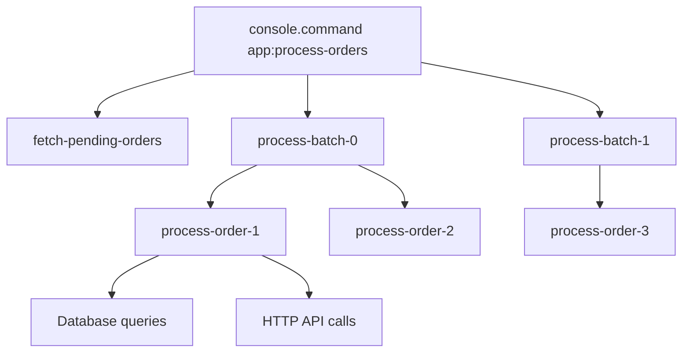

# How to Trace Symfony Console Commands with OpenTelemetry

Author: [nawazdhandala](https://www.github.com/nawazdhandala)

Tags: OpenTelemetry, PHP, Symfony, Console, Commands, CLI, Tracing

Description: Learn how to instrument Symfony console commands with OpenTelemetry to gain visibility into CLI operations, batch jobs, and scheduled tasks with distributed tracing.

Console commands represent a significant portion of many Symfony applications, handling everything from data imports and exports to scheduled maintenance tasks and one-off administrative operations. Unlike HTTP requests that complete quickly, console commands can run for hours, process millions of records, and interact with multiple external services. Proper instrumentation gives you visibility into these long-running processes.

## Why Console Command Tracing Matters

Console commands have unique characteristics that make observability challenging. They run outside the normal request-response cycle, often execute in cron jobs or job queues where output is hidden, and may perform complex operations spanning multiple systems.

Traditional logging falls short because it generates massive volumes of text without structure. You need to correlate logs across different phases of execution, calculate timing manually, and lack visibility into the command's interactions with databases, APIs, and other services.

OpenTelemetry provides structured observability with hierarchical spans that show exactly where time is spent, automatic correlation with database and HTTP operations, and the ability to track command execution across distributed systems.

## Understanding Console Command Lifecycle

Symfony console commands go through several phases that we should instrument:

The initialization phase where arguments and options are parsed. The configuration phase where the command validates input and prepares resources. The execution phase where the actual work happens, often in batches or loops. The cleanup phase where resources are released and results are reported.

Each phase can spawn child operations like database queries, API calls, or file operations that should appear as child spans in your trace.

## Creating a Console Event Subscriber

Symfony's console component emits events throughout command execution that we can hook into for instrumentation.

```php
// src/EventSubscriber/ConsoleInstrumentationSubscriber.php

namespace App\EventSubscriber;

use OpenTelemetry\API\Trace\TracerProviderInterface;
use OpenTelemetry\API\Trace\SpanKind;
use OpenTelemetry\API\Trace\StatusCode;
use OpenTelemetry\Context\Context;
use Symfony\Component\Console\ConsoleEvents;
use Symfony\Component\Console\Event\ConsoleCommandEvent;
use Symfony\Component\Console\Event\ConsoleTerminateEvent;
use Symfony\Component\Console\Event\ConsoleErrorEvent;
use Symfony\Component\EventDispatcher\EventSubscriberInterface;

class ConsoleInstrumentationSubscriber implements EventSubscriberInterface
{
    private $tracer;
    private array $spans = [];
    private array $scopes = [];

    public function __construct(
        TracerProviderInterface $tracerProvider,
        private bool $captureArguments = true,
        private bool $captureOutput = false
    ) {
        $this->tracer = $tracerProvider->getTracer('console.command');
    }

    public static function getSubscribedEvents(): array
    {
        return [
            ConsoleEvents::COMMAND => ['onCommand', 255],
            ConsoleEvents::TERMINATE => ['onTerminate', -255],
            ConsoleEvents::ERROR => ['onError', -255],
        ];
    }

    public function onCommand(ConsoleCommandEvent $event): void
    {
        $command = $event->getCommand();
        if (!$command) {
            return;
        }

        $commandName = $command->getName() ?? 'unknown';
        $input = $event->getInput();

        $span = $this->tracer->spanBuilder("console.command {$commandName}")
            ->setSpanKind(SpanKind::KIND_INTERNAL)
            ->setAttribute('console.command', $commandName)
            ->setAttribute('console.command.class', get_class($command))
            ->startSpan();

        if ($this->captureArguments) {
            // Capture command arguments
            $arguments = [];
            foreach ($input->getArguments() as $name => $value) {
                $arguments[$name] = $this->sanitizeValue($value);
            }
            $span->setAttribute('console.command.arguments', json_encode($arguments));

            // Capture command options
            $options = [];
            foreach ($input->getOptions() as $name => $value) {
                if ($value !== null && $value !== false) {
                    $options[$name] = $this->sanitizeValue($value);
                }
            }
            $span->setAttribute('console.command.options', json_encode($options));
        }

        // Store span for later access
        $this->spans[spl_object_id($command)] = $span;
        $this->scopes[spl_object_id($command)] = $span->activate();
    }

    public function onTerminate(ConsoleTerminateEvent $event): void
    {
        $command = $event->getCommand();
        if (!$command) {
            return;
        }

        $objectId = spl_object_id($command);

        if (!isset($this->spans[$objectId])) {
            return;
        }

        $span = $this->spans[$objectId];
        $exitCode = $event->getExitCode();

        $span->setAttribute('console.exit_code', $exitCode);

        if ($exitCode === 0) {
            $span->setStatus(StatusCode::STATUS_OK);
        } else {
            $span->setStatus(StatusCode::STATUS_ERROR, "Command failed with exit code {$exitCode}");
        }

        if ($this->captureOutput) {
            $output = $event->getOutput();
            if (method_exists($output, 'fetch')) {
                $span->setAttribute('console.output', $output->fetch());
            }
        }

        $span->end();

        if (isset($this->scopes[$objectId])) {
            $this->scopes[$objectId]->detach();
            unset($this->scopes[$objectId]);
        }

        unset($this->spans[$objectId]);
    }

    public function onError(ConsoleErrorEvent $event): void
    {
        $command = $event->getCommand();
        if (!$command) {
            return;
        }

        $objectId = spl_object_id($command);

        if (!isset($this->spans[$objectId])) {
            return;
        }

        $span = $this->spans[$objectId];
        $error = $event->getError();

        $span->recordException($error);
        $span->setStatus(StatusCode::STATUS_ERROR, $error->getMessage());
    }

    private function sanitizeValue($value): mixed
    {
        if (is_array($value)) {
            return array_map([$this, 'sanitizeValue'], $value);
        }

        if (is_string($value)) {
            // Redact sensitive-looking values
            if (preg_match('/(password|token|secret|key)/i', $value)) {
                return '[REDACTED]';
            }

            // Limit string length
            if (strlen($value) > 500) {
                return substr($value, 0, 500) . '... [truncated]';
            }
        }

        return $value;
    }
}
```

Register the subscriber in your services configuration:

```yaml
# config/services.yaml

services:
  App\EventSubscriber\ConsoleInstrumentationSubscriber:
    arguments:
      $tracerProvider: '@opentelemetry.trace.tracer_provider'
      $captureArguments: '%env(bool:OTEL_CONSOLE_CAPTURE_ARGUMENTS)%'
      $captureOutput: '%env(bool:OTEL_CONSOLE_CAPTURE_OUTPUT)%'
    tags:
      - { name: kernel.event_subscriber }
```

## Instrumenting Long-Running Commands

Long-running commands that process data in batches need internal instrumentation to show progress and identify bottlenecks.

```php
// src/Command/ProcessOrdersCommand.php

namespace App\Command;

use App\Repository\OrderRepository;
use App\Service\OrderProcessor;
use OpenTelemetry\API\Trace\TracerProviderInterface;
use OpenTelemetry\API\Trace\SpanKind;
use Symfony\Component\Console\Command\Command;
use Symfony\Component\Console\Input\InputInterface;
use Symfony\Component\Console\Output\OutputInterface;
use Symfony\Component\Console\Input\InputOption;
use Symfony\Component\Console\Style\SymfonyStyle;

class ProcessOrdersCommand extends Command
{
    protected static $defaultName = 'app:process-orders';
    private $tracer;

    public function __construct(
        private OrderRepository $orderRepository,
        private OrderProcessor $orderProcessor,
        TracerProviderInterface $tracerProvider
    ) {
        parent::__construct();
        $this->tracer = $tracerProvider->getTracer('app.commands');
    }

    protected function configure(): void
    {
        $this
            ->setDescription('Process pending orders')
            ->addOption('batch-size', 'b', InputOption::VALUE_REQUIRED, 'Number of orders to process per batch', 100)
            ->addOption('limit', 'l', InputOption::VALUE_REQUIRED, 'Maximum number of orders to process', 0);
    }

    protected function execute(InputInterface $input, OutputInterface $output): int
    {
        $io = new SymfonyStyle($input, $output);
        $batchSize = (int) $input->getOption('batch-size');
        $limit = (int) $input->getOption('limit');

        // Create a span for fetching pending orders
        $fetchSpan = $this->tracer->spanBuilder('fetch-pending-orders')
            ->setSpanKind(SpanKind::KIND_INTERNAL)
            ->setAttribute('batch_size', $batchSize)
            ->setAttribute('limit', $limit)
            ->startSpan();

        $scope = $fetchSpan->activate();

        try {
            $orders = $this->orderRepository->findPendingOrders($limit);
            $fetchSpan->setAttribute('orders.found', count($orders));
            $fetchSpan->end();

        } catch (\Throwable $e) {
            $fetchSpan->recordException($e);
            $fetchSpan->end();
            $scope->detach();
            throw $e;
        }

        $scope->detach();

        if (empty($orders)) {
            $io->success('No pending orders to process');
            return Command::SUCCESS;
        }

        $io->progressStart(count($orders));

        // Process orders in batches
        $batches = array_chunk($orders, $batchSize);
        $processedCount = 0;
        $failedCount = 0;

        foreach ($batches as $batchIndex => $batch) {
            $batchSpan = $this->tracer->spanBuilder("process-batch-{$batchIndex}")
                ->setSpanKind(SpanKind::KIND_INTERNAL)
                ->setAttribute('batch.index', $batchIndex)
                ->setAttribute('batch.size', count($batch))
                ->startSpan();

            $batchScope = $batchSpan->activate();

            try {
                foreach ($batch as $order) {
                    $orderSpan = $this->tracer->spanBuilder("process-order-{$order->getId()}")
                        ->setSpanKind(SpanKind::KIND_INTERNAL)
                        ->setAttribute('order.id', $order->getId())
                        ->setAttribute('order.total', $order->getTotal())
                        ->setAttribute('order.customer_id', $order->getCustomerId())
                        ->startSpan();

                    $orderScope = $orderSpan->activate();

                    try {
                        $this->orderProcessor->process($order);
                        $processedCount++;
                        $orderSpan->setAttribute('order.status', 'processed');
                        $io->progressAdvance();

                    } catch (\Throwable $e) {
                        $failedCount++;
                        $orderSpan->recordException($e);
                        $orderSpan->setAttribute('order.status', 'failed');
                        $io->error("Failed to process order {$order->getId()}: {$e->getMessage()}");

                    } finally {
                        $orderSpan->end();
                        $orderScope->detach();
                    }
                }

                $batchSpan->setAttribute('batch.processed', count($batch));
                $batchSpan->setAttribute('batch.failed', 0);

            } finally {
                $batchSpan->end();
                $batchScope->detach();
            }

            // Small delay between batches to avoid overwhelming the system
            usleep(100000); // 100ms
        }

        $io->progressFinish();

        $io->success([
            "Processed {$processedCount} orders successfully",
            "Failed to process {$failedCount} orders"
        ]);

        return $failedCount > 0 ? Command::FAILURE : Command::SUCCESS;
    }
}
```

This command creates a hierarchical span structure:



## Handling Background Jobs and Scheduled Commands

Commands triggered by cron or job queues need special consideration for context propagation.

```php
// src/Command/ScheduledReportCommand.php

namespace App\Command;

use App\Service\ReportGenerator;
use OpenTelemetry\API\Trace\TracerProviderInterface;
use OpenTelemetry\API\Trace\SpanKind;
use Symfony\Component\Console\Command\Command;
use Symfony\Component\Console\Input\InputInterface;
use Symfony\Component\Console\Output\OutputInterface;

class ScheduledReportCommand extends Command
{
    protected static $defaultName = 'app:scheduled-report';
    private $tracer;

    public function __construct(
        private ReportGenerator $reportGenerator,
        TracerProviderInterface $tracerProvider
    ) {
        parent::__construct();
        $this->tracer = $tracerProvider->getTracer('app.scheduled');
    }

    protected function configure(): void
    {
        $this->setDescription('Generate and send scheduled reports');
    }

    protected function execute(InputInterface $input, OutputInterface $output): int
    {
        // For scheduled commands, create spans that clearly identify the scheduling context
        $span = $this->tracer->spanBuilder('scheduled.report.daily')
            ->setSpanKind(SpanKind::KIND_INTERNAL)
            ->setAttribute('schedule.type', 'cron')
            ->setAttribute('schedule.interval', 'daily')
            ->setAttribute('schedule.triggered_at', date('c'))
            ->startSpan();

        $scope = $span->activate();

        try {
            $reportSpan = $this->tracer->spanBuilder('generate-report')
                ->startSpan();

            $reportScope = $reportSpan->activate();

            try {
                $report = $this->reportGenerator->generateDailyReport();
                $reportSpan->setAttribute('report.size', strlen($report));
                $reportSpan->setAttribute('report.recipients', $this->reportGenerator->getRecipientCount());

            } finally {
                $reportSpan->end();
                $reportScope->detach();
            }

            $sendSpan = $this->tracer->spanBuilder('send-report')
                ->startSpan();

            $sendScope = $sendSpan->activate();

            try {
                $this->reportGenerator->sendReport($report);
                $sendSpan->setAttribute('report.sent', true);

            } finally {
                $sendSpan->end();
                $sendScope->detach();
            }

            $span->setAttribute('report.success', true);
            $output->writeln('Report generated and sent successfully');

            return Command::SUCCESS;

        } catch (\Throwable $e) {
            $span->recordException($e);
            $span->setAttribute('report.success', false);
            $output->writeln('Failed to generate report: ' . $e->getMessage());

            return Command::FAILURE;

        } finally {
            $span->end();
            $scope->detach();
        }
    }
}
```

## Creating Custom Command Metrics

Beyond traces, you can emit metrics for command execution to track trends over time.

```php
// src/Command/MetricsAwareCommand.php

namespace App\Command;

use OpenTelemetry\API\Metrics\MeterProviderInterface;
use OpenTelemetry\API\Metrics\ObserverInterface;
use Symfony\Component\Console\Command\Command;
use Symfony\Component\Console\Input\InputInterface;
use Symfony\Component\Console\Output\OutputInterface;

abstract class MetricsAwareCommand extends Command
{
    protected $meter;
    private $executionCounter;
    private $durationHistogram;
    private $startTime;

    public function __construct(MeterProviderInterface $meterProvider)
    {
        parent::__construct();

        $this->meter = $meterProvider->getMeter('console.commands');

        $this->executionCounter = $this->meter->createCounter(
            'console.command.executions',
            'count',
            'Number of command executions'
        );

        $this->durationHistogram = $this->meter->createHistogram(
            'console.command.duration',
            'seconds',
            'Command execution duration'
        );
    }

    protected function execute(InputInterface $input, OutputInterface $output): int
    {
        $this->startTime = microtime(true);

        try {
            $exitCode = $this->doExecute($input, $output);

            $this->recordMetrics($exitCode);

            return $exitCode;

        } catch (\Throwable $e) {
            $this->recordMetrics(Command::FAILURE, $e);
            throw $e;
        }
    }

    abstract protected function doExecute(InputInterface $input, OutputInterface $output): int;

    private function recordMetrics(int $exitCode, ?\Throwable $error = null): void
    {
        $duration = microtime(true) - $this->startTime;

        $attributes = [
            'command.name' => $this->getName(),
            'exit_code' => $exitCode,
            'success' => $exitCode === Command::SUCCESS ? 'true' : 'false',
        ];

        if ($error) {
            $attributes['error.type'] = get_class($error);
        }

        $this->executionCounter->add(1, $attributes);
        $this->durationHistogram->record($duration, $attributes);
    }
}
```

Use this base class for commands that need automatic metrics:

```php
// src/Command/ImportDataCommand.php

namespace App\Command;

use Symfony\Component\Console\Input\InputInterface;
use Symfony\Component\Console\Output\OutputInterface;

class ImportDataCommand extends MetricsAwareCommand
{
    protected static $defaultName = 'app:import-data';

    protected function doExecute(InputInterface $input, OutputInterface $output): int
    {
        // Your command logic here
        return Command::SUCCESS;
    }
}
```

## Environment Configuration

Configure console instrumentation through environment variables:

```bash
# .env

# Enable/disable console command tracing
OTEL_CONSOLE_ENABLED=true

# Capture command arguments and options
OTEL_CONSOLE_CAPTURE_ARGUMENTS=true

# Capture command output (may be verbose)
OTEL_CONSOLE_CAPTURE_OUTPUT=false
```

For production scheduled commands:

```bash
# .env.production

OTEL_CONSOLE_ENABLED=true
OTEL_CONSOLE_CAPTURE_ARGUMENTS=true
OTEL_CONSOLE_CAPTURE_OUTPUT=false
```

## Debugging Command Performance

With full instrumentation in place, you can answer critical questions about your console commands:

Which commands take the longest to execute? Check the duration histogram metrics.

Where is time being spent within a command? Examine the span hierarchy in your traces.

How many orders are processed per second? Look at the batch processing spans and their durations.

Are external API calls slowing down batch processing? Check child spans for HTTP requests.

Which commands fail most frequently? Query your metrics for high failure rates.

This comprehensive observability transforms console commands from black boxes into transparent, debuggable components of your application. You gain the same visibility into CLI operations that you have for HTTP requests, making it easier to optimize performance and troubleshoot issues.
