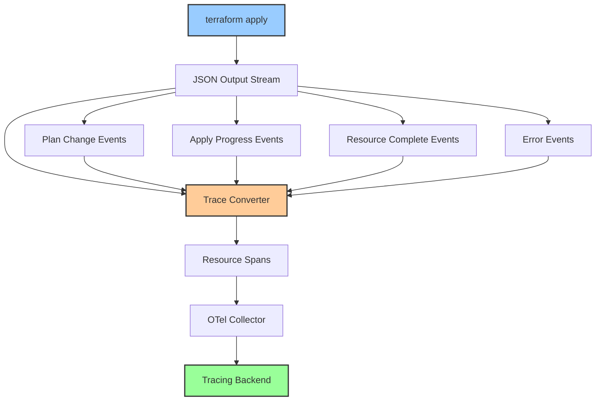

# How to Trace Terraform Infrastructure Provisioning with OpenTelemetry

Author: [nawazdhandala](https://www.github.com/nawazdhandala)

Tags: OpenTelemetry, Terraform, Infrastructure as Code, Tracing, Observability, DevOps

Description: Learn how to trace Terraform infrastructure provisioning with OpenTelemetry to gain visibility into resource creation times, API call patterns, and provisioning failures.

---

Terraform runs can take anywhere from seconds to hours depending on what you are provisioning. When a `terraform apply` takes 45 minutes and you are staring at a slowly scrolling terminal, it is hard to know which resources are causing the delay, which API calls are being throttled, or why a particular resource keeps timing out. OpenTelemetry tracing gives you structured visibility into the entire provisioning process.

This guide covers how to instrument Terraform runs with OpenTelemetry to trace resource creation, track provider API calls, and build observability around your infrastructure provisioning workflows.

## Why Trace Terraform

Terraform's built-in logging (`TF_LOG=DEBUG`) produces massive amounts of unstructured text. Finding a specific API throttling error in thousands of log lines is not fun. Tracing gives you a structured alternative where each resource operation becomes a span with timing, status, and attributes that you can search, filter, and visualize.

Common questions that tracing answers:

- Which resource takes the longest to provision?
- How many API calls does Terraform make to each cloud provider?
- Why did this apply take 3x longer than usual?
- Which resources failed and how many retries happened?
- What is the dependency graph at runtime, and where are the bottlenecks?

## Architecture Overview

Since Terraform does not have native OpenTelemetry support, the approach is to wrap Terraform operations with a tracing layer. This can be done with a wrapper script that creates spans around Terraform commands, or with a more granular approach using Terraform's JSON output mode to create spans for individual resource operations.



Terraform's `-json` flag outputs structured JSON events that include resource addresses, operation types, timing data, and error messages. We parse these events and convert them into OpenTelemetry spans.

## Basic Wrapper Script

Start with a simple wrapper that traces the overall Terraform operations: init, plan, and apply. This gives you top-level timing without requiring any changes to your Terraform code.

```bash
#!/bin/bash
# scripts/traced-terraform.sh
# Wraps Terraform commands in OpenTelemetry spans.
# Each Terraform operation (init, plan, apply) becomes a span.
# Usage: ./traced-terraform.sh apply -auto-approve

set -e

# OpenTelemetry configuration
OTEL_ENDPOINT="${OTEL_EXPORTER_OTLP_ENDPOINT:-http://localhost:4318}"
OTEL_SERVICE_NAME="${OTEL_SERVICE_NAME:-terraform}"

# Generate trace context
TRACE_ID=$(openssl rand -hex 16)
ROOT_SPAN_ID=$(openssl rand -hex 8)

# Function to send a span to the OTLP HTTP endpoint
send_span() {
  local SPAN_NAME="$1"
  local SPAN_ID="$2"
  local PARENT_ID="$3"
  local START_NANOS="$4"
  local END_NANOS="$5"
  local STATUS_CODE="$6"
  local EXTRA_ATTRS="$7"

  curl -s -X POST "${OTEL_ENDPOINT}/v1/traces" \
    -H "Content-Type: application/json" \
    -d "{
      \"resourceSpans\": [{
        \"resource\": {
          \"attributes\": [
            {\"key\": \"service.name\", \"value\": {\"stringValue\": \"${OTEL_SERVICE_NAME}\"}},
            {\"key\": \"terraform.workspace\", \"value\": {\"stringValue\": \"$(terraform workspace show 2>/dev/null || echo default)\"}},
            {\"key\": \"terraform.version\", \"value\": {\"stringValue\": \"$(terraform version -json | jq -r '.terraform_version')\"}}
          ]
        },
        \"scopeSpans\": [{
          \"scope\": {\"name\": \"terraform-tracer\", \"version\": \"1.0.0\"},
          \"spans\": [{
            \"traceId\": \"${TRACE_ID}\",
            \"spanId\": \"${SPAN_ID}\",
            \"parentSpanId\": \"${PARENT_ID}\",
            \"name\": \"${SPAN_NAME}\",
            \"kind\": 1,
            \"startTimeUnixNano\": \"${START_NANOS}\",
            \"endTimeUnixNano\": \"${END_NANOS}\",
            \"status\": {\"code\": ${STATUS_CODE}},
            \"attributes\": [${EXTRA_ATTRS}]
          }]
        }]
      }]
    }" > /dev/null 2>&1
}

# Get the Terraform command (init, plan, apply, destroy)
TF_COMMAND="$1"
shift

# Record the start time
START=$(date +%s%N)

echo "Starting traced terraform ${TF_COMMAND}..."

# Run the Terraform command and capture the exit code
terraform "${TF_COMMAND}" "$@"
EXIT_CODE=$?

# Record the end time
END=$(date +%s%N)

# Determine the status
if [ $EXIT_CODE -eq 0 ]; then
  STATUS=1
else
  STATUS=2
fi

# Send the span
ATTRS="
  {\"key\": \"terraform.command\", \"value\": {\"stringValue\": \"${TF_COMMAND}\"}},
  {\"key\": \"terraform.exit_code\", \"value\": {\"intValue\": ${EXIT_CODE}}}
"

send_span "terraform-${TF_COMMAND}" "${ROOT_SPAN_ID}" "" "${START}" "${END}" "${STATUS}" "${ATTRS}"

echo "Trace sent: terraform ${TF_COMMAND} (trace_id: ${TRACE_ID})"

exit $EXIT_CODE
```

This script wraps any Terraform command and creates a span for it. You use it as a drop-in replacement for the `terraform` command.

```bash
# Instead of running terraform directly, use the wrapper
./scripts/traced-terraform.sh init
./scripts/traced-terraform.sh plan -out=tfplan
./scripts/traced-terraform.sh apply tfplan
```

## Granular Resource-Level Tracing

The basic wrapper gives you command-level visibility, but the real power comes from tracing individual resource operations. Terraform's `-json` flag makes this possible by streaming structured events during apply.

```python
#!/usr/bin/env python3
# scripts/terraform_tracer.py
# Runs terraform apply with JSON output and converts each resource
# operation into an OpenTelemetry span. This gives you per-resource
# timing and status data.

import json
import subprocess
import sys
import time
import uuid
import requests
from datetime import datetime

OTEL_ENDPOINT = "http://localhost:4318/v1/traces"
SERVICE_NAME = "terraform"

def generate_id(length=16):
    """Generate a random hex ID for trace or span IDs."""
    return uuid.uuid4().hex[:length * 2]

def time_nanos():
    """Get the current time in nanoseconds since epoch."""
    return str(int(time.time() * 1_000_000_000))

def send_span(trace_id, span_id, parent_id, name, start_nanos, end_nanos, status_code, attributes):
    """Send a single span to the OTLP HTTP endpoint."""
    attr_list = []
    for key, value in attributes.items():
        if isinstance(value, int):
            attr_list.append({"key": key, "value": {"intValue": value}})
        else:
            attr_list.append({"key": key, "value": {"stringValue": str(value)}})

    payload = {
        "resourceSpans": [{
            "resource": {
                "attributes": [
                    {"key": "service.name", "value": {"stringValue": SERVICE_NAME}}
                ]
            },
            "scopeSpans": [{
                "scope": {"name": "terraform-resource-tracer", "version": "1.0.0"},
                "spans": [{
                    "traceId": trace_id,
                    "spanId": span_id,
                    "parentSpanId": parent_id,
                    "name": name,
                    "kind": 1,
                    "startTimeUnixNano": start_nanos,
                    "endTimeUnixNano": end_nanos,
                    "status": {"code": status_code},
                    "attributes": attr_list
                }]
            }]
        }]
    }

    try:
        requests.post(OTEL_ENDPOINT, json=payload, timeout=5)
    except Exception as e:
        print(f"Warning: Failed to send span: {e}", file=sys.stderr)

def run_traced_apply(args):
    """Run terraform apply with JSON output and trace each resource."""
    trace_id = generate_id(16)
    root_span_id = generate_id(8)
    root_start = time_nanos()

    # Track active resource operations
    active_resources = {}

    # Run terraform apply with JSON output
    cmd = ["terraform", "apply", "-json"] + args
    process = subprocess.Popen(
        cmd,
        stdout=subprocess.PIPE,
        stderr=subprocess.PIPE,
        text=True
    )

    for line in process.stdout:
        try:
            event = json.loads(line.strip())
        except json.JSONDecodeError:
            continue

        event_type = event.get("type", "")

        # Resource operation started
        if event_type == "apply_start":
            resource_addr = event.get("hook", {}).get("resource", {}).get("addr", "unknown")
            action = event.get("hook", {}).get("action", "unknown")
            span_id = generate_id(8)
            active_resources[resource_addr] = {
                "span_id": span_id,
                "start_nanos": time_nanos(),
                "action": action
            }
            print(f"  Starting: {action} {resource_addr}")

        # Resource operation completed
        elif event_type == "apply_complete":
            resource_addr = event.get("hook", {}).get("resource", {}).get("addr", "unknown")
            if resource_addr in active_resources:
                resource_info = active_resources.pop(resource_addr)
                end_nanos = time_nanos()
                send_span(
                    trace_id=trace_id,
                    span_id=resource_info["span_id"],
                    parent_id=root_span_id,
                    name=f"{resource_info['action']} {resource_addr}",
                    start_nanos=resource_info["start_nanos"],
                    end_nanos=end_nanos,
                    status_code=1,
                    attributes={
                        "terraform.resource.address": resource_addr,
                        "terraform.resource.action": resource_info["action"],
                        "terraform.resource.provider": event.get("hook", {}).get("resource", {}).get("provider", ""),
                    }
                )
                print(f"  Completed: {resource_info['action']} {resource_addr}")

        # Resource operation errored
        elif event_type == "apply_errored":
            resource_addr = event.get("hook", {}).get("resource", {}).get("addr", "unknown")
            if resource_addr in active_resources:
                resource_info = active_resources.pop(resource_addr)
                end_nanos = time_nanos()
                send_span(
                    trace_id=trace_id,
                    span_id=resource_info["span_id"],
                    parent_id=root_span_id,
                    name=f"{resource_info['action']} {resource_addr}",
                    start_nanos=resource_info["start_nanos"],
                    end_nanos=end_nanos,
                    status_code=2,
                    attributes={
                        "terraform.resource.address": resource_addr,
                        "terraform.resource.action": resource_info["action"],
                        "error.message": event.get("diagnostic", {}).get("summary", "unknown error"),
                    }
                )
                print(f"  Failed: {resource_info['action']} {resource_addr}")

        # Diagnostic messages (warnings, errors)
        elif event_type == "diagnostic":
            severity = event.get("diagnostic", {}).get("severity", "")
            summary = event.get("diagnostic", {}).get("summary", "")
            if severity == "error":
                print(f"  Error: {summary}")

    process.wait()

    # Send the root span for the entire apply operation
    root_end = time_nanos()
    root_status = 1 if process.returncode == 0 else 2

    send_span(
        trace_id=trace_id,
        span_id=root_span_id,
        parent_id="",
        name="terraform-apply",
        start_nanos=root_start,
        end_nanos=root_end,
        status_code=root_status,
        attributes={
            "terraform.command": "apply",
            "terraform.exit_code": process.returncode,
        }
    )

    print(f"\nTrace ID: {trace_id}")
    return process.returncode

if __name__ == "__main__":
    exit_code = run_traced_apply(sys.argv[1:])
    sys.exit(exit_code)
```

Run it in place of `terraform apply`.

```bash
# Run a traced apply operation
# Each resource creation/modification/deletion becomes a span
python3 scripts/terraform_tracer.py -auto-approve
```

The output includes the trace ID, which you can use to find the trace in your backend. The trace shows every resource operation as a child span under the root apply span, with accurate timing for each.

## Visualizing a Terraform Apply Trace

A typical trace for a Terraform apply that creates a Kubernetes cluster might look like this.

```mermaid
gantt
    title Terraform Apply Trace
    dateFormat  HH:mm:ss
    axisFormat  %H:%M:%S

    section Network
    aws_vpc.main              :done, 10:00:00, 15s
    aws_subnet.private_a      :done, 10:00:15, 10s
    aws_subnet.private_b      :done, 10:00:15, 10s
    aws_security_group.cluster :done, 10:00:25, 8s

    section Compute
    aws_eks_cluster.main      :done, 10:00:33, 600s
    aws_eks_node_group.workers :done, 10:10:33, 180s

    section DNS
    aws_route53_record.api    :done, 10:13:33, 30s
```



From this trace, it is immediately obvious that the EKS cluster creation (10 minutes) dominates the total apply time. Without tracing, you would only know the total time was about 14 minutes.

## Collector Configuration for Terraform Traces

Set up the OpenTelemetry Collector to receive and process Terraform trace data.

```yaml
# otel-collector-config.yaml
# Collector configuration for Terraform trace data.
# Adds infrastructure-specific resource attributes.
receivers:
  otlp:
    protocols:
      http:
        endpoint: 0.0.0.0:4318

processors:
  batch:
    timeout: 10s

  # Enrich with infrastructure context
  resource:
    attributes:
      - key: service.namespace
        value: infrastructure
        action: upsert
      - key: deployment.environment
        from_attribute: TF_WORKSPACE
        action: upsert

  # Add useful attributes from resource addresses
  attributes:
    actions:
      # Extract the provider from the resource address
      - key: cloud.provider
        pattern: "^(?P<provider>[^_]+)_"
        from_attribute: terraform.resource.address
        action: upsert

exporters:
  otlphttp:
    endpoint: https://your-backend.example.com
    headers:
      Authorization: "Bearer ${OTEL_AUTH_TOKEN}"

service:
  pipelines:
    traces:
      receivers: [otlp]
      processors: [resource, attributes, batch]
      exporters: [otlphttp]
```

## Integrating with CI/CD Pipelines

In a real workflow, Terraform runs inside a CI/CD pipeline. You can connect the Terraform traces to your pipeline traces for end-to-end visibility from code commit to infrastructure provisioning.

```yaml
# .github/workflows/infrastructure.yml
# GitHub Actions workflow that runs traced Terraform operations.
# The trace IDs link Terraform spans to the CI pipeline trace.
name: Infrastructure Deploy

on:
  push:
    branches: [main]
    paths:
      - 'terraform/**'

jobs:
  deploy:
    runs-on: ubuntu-latest
    env:
      OTEL_EXPORTER_OTLP_ENDPOINT: ${{ secrets.OTEL_ENDPOINT }}
      OTEL_SERVICE_NAME: terraform-ci

    steps:
      - uses: actions/checkout@v4

      - name: Setup Terraform
        uses: hashicorp/setup-terraform@v3
        with:
          terraform_version: 1.7.0
          # Disable the wrapper to get raw JSON output
          terraform_wrapper: false

      - name: Setup Python
        uses: actions/setup-python@v5
        with:
          python-version: '3.12'

      - name: Install Dependencies
        run: pip install requests

      - name: Terraform Init
        working-directory: terraform
        run: |
          bash ../scripts/traced-terraform.sh init

      - name: Terraform Plan
        working-directory: terraform
        run: |
          bash ../scripts/traced-terraform.sh plan -out=tfplan

      - name: Terraform Apply
        working-directory: terraform
        run: |
          python3 ../scripts/terraform_tracer.py tfplan
```

## Tracking State Drift

You can use the same tracing approach with `terraform plan` to detect and track state drift over time. Run scheduled plan operations and trace them to see how your infrastructure drifts from the desired state.

```bash
#!/bin/bash
# scripts/drift-check.sh
# Runs a terraform plan to detect drift and sends the results
# as a span with attributes showing how many resources changed.

TRACE_ID=$(openssl rand -hex 16)
SPAN_ID=$(openssl rand -hex 8)
START=$(date +%s%N)

# Run plan in JSON mode and capture the output
terraform plan -json -detailed-exitcode 2>/dev/null | tee plan-output.json

# Count the changes from the plan output
ADDS=$(jq -r 'select(.type == "planned_change") | select(.change.action == "create")' plan-output.json | wc -l)
CHANGES=$(jq -r 'select(.type == "planned_change") | select(.change.action == "update")' plan-output.json | wc -l)
DELETES=$(jq -r 'select(.type == "planned_change") | select(.change.action == "delete")' plan-output.json | wc -l)

END=$(date +%s%N)

# Determine if there is drift
TOTAL=$((ADDS + CHANGES + DELETES))
if [ $TOTAL -gt 0 ]; then
  STATUS=2  # Error status indicates drift detected
  DRIFT="true"
else
  STATUS=1
  DRIFT="false"
fi

# Send the drift check span with change counts
# These attributes let you build dashboards showing drift over time
ATTRS="
  {\"key\": \"terraform.command\", \"value\": {\"stringValue\": \"plan\"}},
  {\"key\": \"terraform.drift.detected\", \"value\": {\"stringValue\": \"${DRIFT}\"}},
  {\"key\": \"terraform.drift.additions\", \"value\": {\"intValue\": ${ADDS}}},
  {\"key\": \"terraform.drift.changes\", \"value\": {\"intValue\": ${CHANGES}}},
  {\"key\": \"terraform.drift.deletions\", \"value\": {\"intValue\": ${DELETES}}}
"

# Reuse the send_span function from traced-terraform.sh
source scripts/traced-terraform.sh
send_span "terraform-drift-check" "${SPAN_ID}" "" "${START}" "${END}" "${STATUS}" "${ATTRS}"

echo "Drift check complete. Trace ID: ${TRACE_ID}"
echo "Additions: ${ADDS}, Changes: ${CHANGES}, Deletions: ${DELETES}"
```

Running this on a schedule and tracking the results gives you a drift history for your infrastructure. If drift suddenly increases, something is making manual changes to resources that Terraform manages.

## Analyzing Provider API Performance

When Terraform runs slowly, the culprit is usually cloud provider API latency or throttling. By examining the trace data, you can identify which provider operations are slow.

Common patterns you might discover:

- **EKS cluster creation**: 10 to 15 minutes, mostly waiting for the control plane
- **RDS instance creation**: 5 to 10 minutes, waiting for the database to initialize
- **IAM policy attachment**: Usually fast, but can be throttled during large applies
- **S3 bucket creation**: Fast, but bucket policy application can take 30+ seconds

With per-resource traces, you can build dashboards showing average provisioning time by resource type. This data helps you set realistic expectations for deployment times and identify when provider performance degrades.

## Tracing Terraform Modules

For complex infrastructure, you often use Terraform modules. The resource address in traces includes the module path, so you can see how time is distributed across modules.

```
Trace: terraform-apply
  |
  |-- Span: create module.networking.aws_vpc.main (15s)
  |-- Span: create module.networking.aws_subnet.private[0] (10s)
  |-- Span: create module.networking.aws_subnet.private[1] (10s)
  |-- Span: create module.database.aws_rds_cluster.main (480s)
  |-- Span: create module.compute.aws_eks_cluster.main (600s)
  |-- Span: create module.compute.aws_eks_node_group.workers (180s)
```

The module prefix in the resource address lets you group and filter by module, answering questions like "which module takes the longest?" or "how much time does the networking module add to the total apply?"

## Handling Sensitive Data

Terraform traces might contain sensitive information like resource names that reveal internal architecture or attribute values that include secrets. Configure the collector to strip sensitive attributes before export.

```yaml
# Processor configuration to remove sensitive Terraform attributes
processors:
  attributes:
    actions:
      # Remove any attribute that might contain connection strings
      - key: terraform.resource.connection_string
        action: delete
      # Remove attributes with passwords or secrets
      - key: terraform.resource.password
        action: delete
      # Hash resource names if they contain sensitive info
      - key: terraform.resource.address
        action: hash
```

## Conclusion

Tracing Terraform provisioning with OpenTelemetry transforms infrastructure deployments from opaque operations into fully observable workflows. Per-resource traces reveal exactly where time is spent, which operations fail, and how provider API performance changes over time. The wrapper script approach works with any Terraform setup without requiring provider changes, and the JSON output parser gives you granular resource-level spans. Combined with CI/CD pipeline traces and drift detection, you get a complete observability story for your infrastructure as code workflow.
