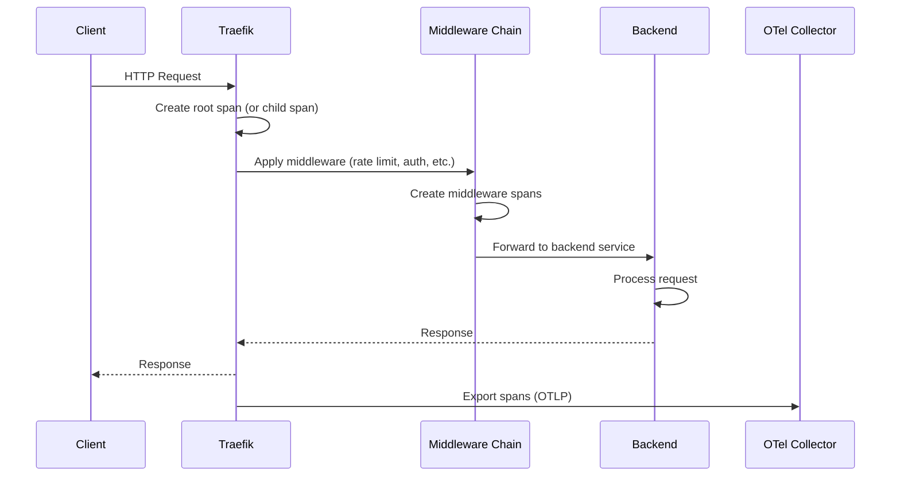

# How to Trace Traefik Reverse Proxy Requests with OpenTelemetry

Author: [nawazdhandala](https://www.github.com/nawazdhandala)

Tags: OpenTelemetry, Traefik, Reverse Proxy, Distributed Tracing, Kubernetes, Docker, Observability

Description: Learn how to configure Traefik reverse proxy with OpenTelemetry tracing for complete request visibility across your services.

---

Traefik is a popular reverse proxy and ingress controller, especially in Docker and Kubernetes environments. It automatically discovers services and routes traffic to them, which is great until something goes wrong and you need to figure out where a request got stuck or why latency spiked. That's where distributed tracing comes in.

The good news is that Traefik has built-in OpenTelemetry support starting from version 3.0. In this guide, we'll set up end-to-end tracing through Traefik using OpenTelemetry, covering both Docker Compose and Kubernetes deployments.

## How Traefik Tracing Works

When tracing is enabled, Traefik creates spans for every request it handles. Each span includes details about the routing decision, middleware processing, and backend response time. If the incoming request already carries trace context headers (like `traceparent`), Traefik will create child spans under that context. If there's no existing context, Traefik starts a new trace.



This gives you visibility into how much time is spent in Traefik's routing logic, how long middleware processing takes, and how long the backend takes to respond. For debugging latency issues, this breakdown is invaluable.

## Configuring Traefik with OpenTelemetry (Static Config)

Let's start with the Traefik static configuration to enable OpenTelemetry tracing. This works for both file-based configuration and CLI arguments.

Here's the static configuration file that enables OTLP trace export.

```yaml
# traefik.yaml
# Traefik static configuration with OpenTelemetry tracing enabled

# Enable the API dashboard for debugging
api:
  dashboard: true

# Configure entrypoints
entryPoints:
  web:
    address: ":80"
  websecure:
    address: ":443"

# Enable OpenTelemetry tracing
tracing:
  # Set the service name that appears in your traces
  serviceName: traefik-ingress
  # Sample 100% of requests in development, reduce in production
  sampleRate: 1.0
  otlp:
    grpc:
      # Point to the OpenTelemetry Collector endpoint
      endpoint: otel-collector:4317
      insecure: true
    # Alternatively, use HTTP protocol
    # http:
    #   endpoint: http://otel-collector:4318/v1/traces

# Enable access logging with trace correlation
accessLog:
  filePath: "/var/log/traefik/access.log"
  format: json
  fields:
    headers:
      names:
        # Include trace headers in access logs for correlation
        traceparent: keep
        X-Request-ID: keep

# Provider configuration (Docker example)
providers:
  docker:
    exposedByDefault: false
  file:
    directory: /etc/traefik/dynamic
```

## Docker Compose Setup

Here's a complete Docker Compose file that runs Traefik with OpenTelemetry tracing and a collector to receive the spans.

This setup includes Traefik, the OpenTelemetry Collector, and a sample backend service all wired together.

```yaml
# docker-compose.yaml
# Full Traefik + OpenTelemetry tracing stack
version: "3.8"

services:
  traefik:
    image: traefik:v3.1
    ports:
      - "80:80"
      - "443:443"
      - "8080:8080"  # Dashboard
    volumes:
      - /var/run/docker.sock:/var/run/docker.sock:ro
      - ./traefik.yaml:/etc/traefik/traefik.yaml:ro
      - ./dynamic:/etc/traefik/dynamic:ro
    # Alternatively, use CLI arguments instead of a config file
    command:
      - "--api.dashboard=true"
      - "--entrypoints.web.address=:80"
      # Enable OpenTelemetry tracing via CLI flags
      - "--tracing.serviceName=traefik-ingress"
      - "--tracing.sampleRate=1.0"
      - "--tracing.otlp.grpc.endpoint=otel-collector:4317"
      - "--tracing.otlp.grpc.insecure=true"
      # Docker provider
      - "--providers.docker=true"
      - "--providers.docker.exposedbydefault=false"
    depends_on:
      - otel-collector
    networks:
      - web

  # OpenTelemetry Collector receives and exports traces
  otel-collector:
    image: otel/opentelemetry-collector-contrib:0.96.0
    volumes:
      - ./otel-collector-config.yaml:/etc/otelcol/config.yaml
    ports:
      - "4317:4317"   # gRPC OTLP
      - "4318:4318"   # HTTP OTLP
    networks:
      - web

  # Example backend service
  api-service:
    image: your-api-service:latest
    labels:
      # Traefik labels for automatic service discovery
      - "traefik.enable=true"
      - "traefik.http.routers.api.rule=Host(`api.example.com`)"
      - "traefik.http.routers.api.entrypoints=web"
      - "traefik.http.services.api.loadbalancer.server.port=8080"
    environment:
      # Configure the backend service to send traces to the same collector
      - OTEL_EXPORTER_OTLP_ENDPOINT=http://otel-collector:4317
      - OTEL_SERVICE_NAME=api-service
    networks:
      - web

networks:
  web:
    driver: bridge
```

## OpenTelemetry Collector Configuration

The collector receives spans from both Traefik and your backend services, processes them, and exports to your observability backend.

```yaml
# otel-collector-config.yaml
# Collector config for Traefik tracing pipeline
receivers:
  otlp:
    protocols:
      grpc:
        endpoint: 0.0.0.0:4317
      http:
        endpoint: 0.0.0.0:4318

processors:
  # Batch spans before export
  batch:
    timeout: 5s
    send_batch_size: 512

  # Add environment metadata to all spans
  resource:
    attributes:
      - key: deployment.environment
        value: production
        action: upsert

  # Use tail-based sampling to capture error traces and sample normal ones
  tail_sampling:
    decision_wait: 10s
    policies:
      # Always capture traces with errors
      - name: errors
        type: status_code
        status_code:
          status_codes:
            - ERROR
      # Always capture slow requests (over 2 seconds)
      - name: slow-requests
        type: latency
        latency:
          threshold_ms: 2000
      # Sample 10% of normal requests
      - name: normal-traffic
        type: probabilistic
        probabilistic:
          sampling_percentage: 10

exporters:
  otlp:
    endpoint: "your-backend:4317"
    tls:
      insecure: false

  # Debug exporter for development
  debug:
    verbosity: detailed

service:
  pipelines:
    traces:
      receivers: [otlp]
      processors: [resource, tail_sampling, batch]
      exporters: [otlp]
```

## Adding Middleware Tracing

Traefik middleware is where a lot of interesting things happen - rate limiting, authentication, header manipulation, compression. When you enable tracing, Traefik creates separate spans for each middleware in the chain. This is incredibly useful for understanding where time is being spent.

Here's a dynamic configuration with several middleware components, each of which will generate its own span.

```yaml
# dynamic/middleware.yaml
# Traefik dynamic configuration with middleware that generates trace spans
http:
  routers:
    api-router:
      rule: "Host(`api.example.com`)"
      entryPoints:
        - web
      # Apply middleware chain - each step creates a separate trace span
      middlewares:
        - rate-limit
        - security-headers
        - compress
        - retry
      service: api-service

  middlewares:
    # Rate limiting middleware - generates a span showing queue/wait time
    rate-limit:
      rateLimit:
        average: 100
        burst: 200
        period: 1s

    # Security headers - minimal latency but visible in traces
    security-headers:
      headers:
        customResponseHeaders:
          X-Frame-Options: "DENY"
          X-Content-Type-Options: "nosniff"
          X-XSS-Protection: "1; mode=block"
        stsSeconds: 31536000
        stsIncludeSubdomains: true

    # Compression middleware - trace shows compression overhead
    compress:
      compress:
        excludedContentTypes:
          - text/event-stream

    # Retry middleware - each retry attempt creates a new child span
    retry:
      retry:
        attempts: 3
        initialInterval: 100ms

  services:
    api-service:
      loadBalancer:
        servers:
          - url: "http://api-service:8080"
        healthCheck:
          path: /health
          interval: 10s
```

When you look at traces in your backend, you'll see spans like `Middleware rate-limit@file`, `Middleware compress@file`, and so on. If a retry happens, you'll see multiple backend call spans, making it immediately obvious why a request took longer than expected.

## Kubernetes Ingress Setup

If you're using Traefik as a Kubernetes ingress controller, the tracing configuration goes into the Helm values or the Traefik CRD.

Here's a Helm values file for deploying Traefik with OpenTelemetry in Kubernetes.

```yaml
# values.yaml
# Helm chart values for Traefik with OpenTelemetry tracing
image:
  tag: v3.1

# Enable tracing in the additional arguments
additionalArguments:
  - "--tracing.serviceName=traefik-k8s"
  - "--tracing.sampleRate=0.1"
  - "--tracing.otlp.grpc.endpoint=otel-collector.observability.svc.cluster.local:4317"
  - "--tracing.otlp.grpc.insecure=true"

# Resource limits for production
resources:
  requests:
    cpu: "200m"
    memory: "128Mi"
  limits:
    cpu: "1000m"
    memory: "512Mi"

# Enable Prometheus metrics alongside tracing
metrics:
  prometheus:
    entryPoint: metrics
    addEntryPointsLabels: true
    addRoutersLabels: true
    addServicesLabels: true

# Configure access logging for trace correlation
logs:
  access:
    enabled: true
    format: json
    fields:
      headers:
        names:
          traceparent: keep
```

You can also use IngressRoute CRDs with middleware references, and tracing will work the same way. Each middleware in the chain creates its own span.

```yaml
# ingressroute.yaml
# Traefik IngressRoute with middleware that creates trace spans
apiVersion: traefik.io/v1alpha1
kind: IngressRoute
metadata:
  name: api-route
  namespace: production
spec:
  entryPoints:
    - web
    - websecure
  routes:
    - match: Host(`api.example.com`) && PathPrefix(`/v1`)
      kind: Rule
      # Each middleware creates a span in the trace
      middlewares:
        - name: api-rate-limit
          namespace: production
        - name: api-auth
          namespace: production
      services:
        - name: api-service
          port: 8080
          # Enable sticky sessions with a cookie
          sticky:
            cookie:
              name: server_id
              secure: true
```

## Correlating Traefik Traces with Backend Traces

The real power of tracing through Traefik comes from connecting Traefik's spans with your backend service spans. Traefik automatically propagates trace context (the `traceparent` header) to backend services. As long as your backend is instrumented with OpenTelemetry, the spans will be linked automatically.

Here's a quick Python Flask example showing how the backend picks up the trace context from Traefik.

```python
# app.py
# Flask backend that automatically continues traces from Traefik
from flask import Flask
from opentelemetry import trace
from opentelemetry.instrumentation.flask import FlaskInstrumentor
from opentelemetry.sdk.trace import TracerProvider
from opentelemetry.sdk.trace.export import BatchSpanProcessor
from opentelemetry.exporter.otlp.proto.grpc.trace_exporter import OTLPSpanExporter
from opentelemetry.sdk.resources import Resource

# Set up the trace provider with service identity
resource = Resource.create({
    "service.name": "api-service",
    "service.version": "2.1.0",
})
provider = TracerProvider(resource=resource)

# Export spans to the same collector that Traefik uses
exporter = OTLPSpanExporter(endpoint="otel-collector:4317", insecure=True)
provider.add_span_processor(BatchSpanProcessor(exporter))
trace.set_tracer_provider(provider)

app = Flask(__name__)
# Flask instrumentation automatically reads traceparent from incoming headers
# This connects our spans to the Traefik trace
FlaskInstrumentor().instrument_app(app)

tracer = trace.get_tracer("api-service")

@app.route("/v1/users/<user_id>")
def get_user(user_id):
    # This span becomes a child of the Traefik span automatically
    # because Flask instrumentation reads the propagated trace context
    with tracer.start_as_current_span("fetch_user_from_db") as span:
        span.set_attribute("user.id", user_id)
        user = fetch_from_database(user_id)
        return user
```

In your trace viewer, you'll see a waterfall like this: `Traefik EntryPoint` > `Traefik Router` > `Traefik Middleware (rate-limit)` > `Traefik Service` > `api-service: GET /v1/users/{id}` > `fetch_user_from_db`. That complete picture makes debugging straightforward.

## Performance Considerations

Tracing does add a small amount of overhead. In production, you probably don't want to trace every single request. Here are some guidelines:

- **Sample rate**: Start with 1-5% for high-traffic services. Use 100% only in development or staging.
- **Tail sampling**: If you use the collector's tail sampling processor, you can capture 100% at Traefik and let the collector decide what to keep. This gives you better coverage of error cases.
- **Batch size**: Make sure the collector's batch processor is tuned to handle the throughput. A batch timeout of 5 seconds with a batch size of 512-1024 works well for most setups.
- **Network overhead**: OTLP gRPC is more efficient than HTTP for high-volume trace export. Always prefer the gRPC endpoint when possible.

## Wrapping Up

Traefik's native OpenTelemetry support makes it one of the easier reverse proxies to instrument for distributed tracing. With just a few configuration lines, you get per-request traces that show the complete journey through entrypoints, routers, middleware, and backend services.

The combination of Traefik traces, middleware spans, and backend service traces gives you the full picture when debugging production issues. Whether a request is slow because of rate limiting, a retry loop, or a slow database query, the trace will tell you exactly where the time went. Set up the collector with tail-based sampling to keep costs manageable while still capturing the traces that matter most.
