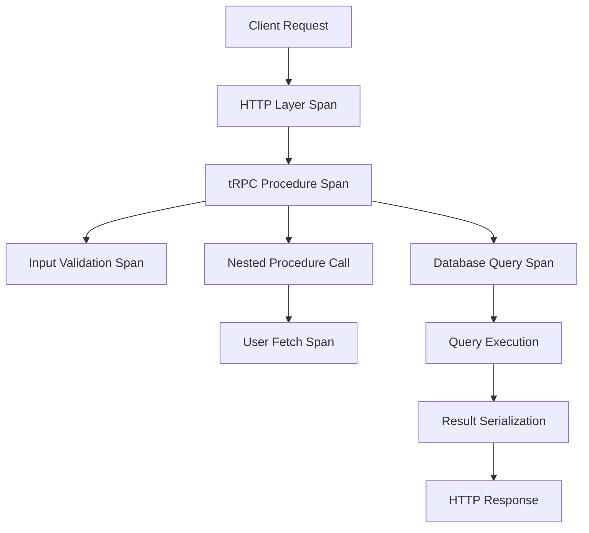

# How to Trace tRPC Procedures with OpenTelemetry

Author: [nawazdhandala](https://www.github.com/nawazdhandala)

Tags: OpenTelemetry, tRPC, TypeScript, Node.js, RPC, Tracing

Description: Learn how to instrument tRPC procedures with OpenTelemetry to gain full visibility into your end-to-end type-safe API calls, from client requests to server responses.

tRPC has revolutionized how TypeScript developers build type-safe APIs by eliminating the need for code generation while letting you add runtime validation where needed. However, the abstraction that makes tRPC powerful can also obscure what happens under the hood. OpenTelemetry instrumentation bridges this gap, providing complete visibility into your RPC calls while preserving the type safety you rely on.

## Why tRPC Needs Observability

Traditional REST APIs expose explicit endpoints that monitoring tools can easily track. tRPC abstracts these endpoints behind procedure calls, making it harder to understand performance characteristics without proper instrumentation. You need to know which procedures are slow, how data flows through nested procedure calls, and where errors originate in complex query chains.

OpenTelemetry provides the observability layer that tRPC applications need. You can trace individual procedure calls, measure latency, track input validation times, and correlate frontend requests with backend processing.

## Setting Up OpenTelemetry in a tRPC Application

Start with a basic tRPC setup and add OpenTelemetry instrumentation. Install the required dependencies:

```bash
npm install @trpc/server @trpc/client @trpc/react-query
npm install zod
npm install @opentelemetry/api @opentelemetry/sdk-node @opentelemetry/instrumentation @opentelemetry/resources @opentelemetry/semantic-conventions
npm install @opentelemetry/exporter-trace-otlp-http
```

Initialize OpenTelemetry before your application code runs:

```typescript
// tracing.ts - Initialize before importing any application code
import { NodeSDK } from '@opentelemetry/sdk-node';
import { OTLPTraceExporter } from '@opentelemetry/exporter-trace-otlp-http';
import { resourceFromAttributes } from '@opentelemetry/resources';
import {
  ATTR_SERVICE_NAME,
  ATTR_SERVICE_VERSION,
} from '@opentelemetry/semantic-conventions';

const sdk = new NodeSDK({
  resource: resourceFromAttributes({
    [ATTR_SERVICE_NAME]: 'trpc-api-service',
    [ATTR_SERVICE_VERSION]: '1.0.0',
  }),
  traceExporter: new OTLPTraceExporter({
    url: 'http://localhost:4318/v1/traces',
  }),
});

sdk.start();

process.on('SIGTERM', () => {
  sdk.shutdown().finally(() => process.exit(0));
});
```

## Creating an Instrumented tRPC Context

The tRPC context is the perfect place to inject OpenTelemetry tracing capabilities:

```typescript
// context.ts - Create context with tracing support
import type { CreateNextContextOptions } from '@trpc/server/adapters/next';
import { trace, context, propagation } from '@opentelemetry/api';

const tracer = trace.getTracer('trpc-procedures', '1.0.0');

export async function createContext({ req, res }: CreateNextContextOptions) {
  // Extract trace context from incoming request headers
  const traceContext = propagation.extract(context.active(), req.headers);

  return {
    req,
    res,
    tracer,
    traceContext,
    userId: req.headers['x-user-id'] as string | undefined,
  };
}

export type Context = Awaited<ReturnType<typeof createContext>>;
```

## Building an Instrumented Middleware

Create middleware that automatically traces all procedure calls:

```typescript
// middleware.ts - Tracing middleware for tRPC
import { initTRPC } from '@trpc/server';
import { context, trace, SpanStatusCode, SpanKind } from '@opentelemetry/api';
import type { Context } from './context';

const t = initTRPC.context<Context>().create();

export const tracingMiddleware = t.middleware(async ({ path, type, next, ctx, getRawInput }) => {
  const span = ctx.tracer.startSpan(
    `trpc.${type}.${path}`,
    {
      kind: SpanKind.SERVER,
      attributes: {
        'rpc.system': 'trpc',
        'rpc.service': 'api',
        'rpc.method': path,
        'rpc.procedure.type': type,
        'user.id': ctx.userId || 'anonymous',
      },
    },
    ctx.traceContext
  );

  // Attach input parameters as attributes (be careful with sensitive data)
  const rawInput = await getRawInput();
  if (rawInput && typeof rawInput === 'object') {
    span.setAttribute('rpc.input.keys', Object.keys(rawInput).join(','));
  }

  const startTime = Date.now();

  try {
    // Execute the procedure within the span context
    const spanContext = trace.setSpan(ctx.traceContext, span);
    const result = await context.with(
      spanContext,
      async () => {
        return await next({
          ctx: {
            traceContext: spanContext,
          },
        });
      }
    );

    const duration = Date.now() - startTime;

    if (result.ok) {
      span.setAttributes({
        'rpc.duration.ms': duration,
        'rpc.status': 'success',
      });
      span.setStatus({ code: SpanStatusCode.OK });
    } else {
      span.setAttributes({
        'rpc.duration.ms': duration,
        'rpc.status': 'error',
      });
      span.recordException(result.error);
      span.setStatus({
        code: SpanStatusCode.ERROR,
        message: result.error.message,
      });
    }

    span.end();

    return result;
  } catch (error) {
    const duration = Date.now() - startTime;

    span.setAttributes({
      'rpc.duration.ms': duration,
      'rpc.status': 'error',
    });

    span.recordException(error as Error);
    span.setStatus({
      code: SpanStatusCode.ERROR,
      message: (error as Error).message,
    });
    span.end();

    throw error;
  }
});
```

## Setting Up the Instrumented Router

Apply the tracing middleware to your tRPC router:

```typescript
// trpc.ts - Configure tRPC with tracing
import { initTRPC } from '@trpc/server';
import type { Context } from './context';
import { tracingMiddleware } from './middleware';

const t = initTRPC.context<Context>().create();

export const router = t.router;
export const publicProcedure = t.procedure.use(tracingMiddleware);
export const middleware = t.middleware;
```

## Instrumenting Individual Procedures

Create procedures with detailed tracing for complex operations:

```typescript
// routes/user.ts - Example user procedures with tracing
import { z } from 'zod';
import { router, publicProcedure } from '../trpc';
import { trace, SpanStatusCode } from '@opentelemetry/api';

export const userRouter = router({
  getUser: publicProcedure
    .input(z.object({ userId: z.string() }))
    .query(async ({ input, ctx }) => {
      // The middleware already created a span, access it from context
      const currentSpan = trace.getSpan(ctx.traceContext);

      currentSpan?.addEvent('fetching.user.from.database', {
        'db.user.id': input.userId,
      });

      // Simulate database call
      const dbSpan = ctx.tracer.startSpan(
        'db.query.users.findById',
        {
          attributes: {
            'db.system': 'postgresql',
            'db.operation': 'SELECT',
            'db.table': 'users',
            'db.user.id': input.userId,
          },
        },
        ctx.traceContext
      );

      try {
        // Actual database query would go here
        const user = await fetchUserFromDatabase(input.userId);

        dbSpan.setAttributes({
          'db.rows.returned': 1,
          'db.query.success': true,
        });
        dbSpan.setStatus({ code: SpanStatusCode.OK });
        dbSpan.end();

        return user;
      } catch (error) {
        dbSpan.recordException(error as Error);
        dbSpan.setStatus({
          code: SpanStatusCode.ERROR,
          message: (error as Error).message,
        });
        dbSpan.end();
        throw error;
      }
    }),

  updateUser: publicProcedure
    .input(z.object({
      userId: z.string(),
      name: z.string().optional(),
      email: z.string().email().optional(),
    }))
    .mutation(async ({ input, ctx }) => {
      const span = ctx.tracer.startSpan(
        'user.update.validation',
        {},
        ctx.traceContext
      );

      // Track which fields are being updated
      const updatingFields = Object.keys(input).filter(k => k !== 'userId');
      span.setAttribute('user.update.fields', updatingFields.join(','));
      span.end();

      // Create span for the update operation
      const updateSpan = ctx.tracer.startSpan(
        'db.query.users.update',
        {
          attributes: {
            'db.system': 'postgresql',
            'db.operation': 'UPDATE',
            'db.table': 'users',
            'db.user.id': input.userId,
          },
        },
        ctx.traceContext
      );

      try {
        const result = await updateUserInDatabase(input);
        updateSpan.setStatus({ code: SpanStatusCode.OK });
        updateSpan.end();
        return result;
      } catch (error) {
        updateSpan.recordException(error as Error);
        updateSpan.setStatus({
          code: SpanStatusCode.ERROR,
          message: (error as Error).message,
        });
        updateSpan.end();
        throw error;
      }
    }),
});
```

## Tracing Nested Procedure Calls

When procedures call other procedures, maintain the trace context:

```typescript
// routes/posts.ts - Nested procedure calls with tracing
import { z } from 'zod';
import { SpanStatusCode } from '@opentelemetry/api';
import { router, publicProcedure } from '../trpc';

export const postsRouter = router({
  getPostWithAuthor: publicProcedure
    .input(z.object({ postId: z.string() }))
    .query(async ({ input, ctx }) => {
      // Fetch post data
      const postSpan = ctx.tracer.startSpan(
        'db.query.posts.findById',
        {},
        ctx.traceContext
      );

      const post = await fetchPostFromDatabase(input.postId).catch((error) => {
        postSpan.recordException(error as Error);
        postSpan.setStatus({
          code: SpanStatusCode.ERROR,
          message: (error as Error).message,
        });
        postSpan.end();
        throw error;
      });

      postSpan.setAttribute('post.title.length', post.title.length);
      postSpan.setStatus({ code: SpanStatusCode.OK });
      postSpan.end();

      // Fetch author data using the user procedure
      // Create a child span for this nested call
      const authorSpan = ctx.tracer.startSpan(
        'procedure.call.getUser',
        {
          attributes: {
            'procedure.name': 'user.getUser',
            'procedure.type': 'nested',
          },
        },
        ctx.traceContext
      );

      try {
        const author = await fetchUserFromDatabase(post.authorId);
        authorSpan.setStatus({ code: SpanStatusCode.OK });
        authorSpan.end();

        return {
          ...post,
          author,
        };
      } catch (error) {
        authorSpan.recordException(error as Error);
        authorSpan.setStatus({
          code: SpanStatusCode.ERROR,
          message: (error as Error).message,
        });
        authorSpan.end();
        throw error;
      }
    }),
});
```

## Client-Side Tracing Integration

Extend tracing to the frontend to see end-to-end request flow:

```typescript
// client/trpc.ts - Client with tracing support
import { createTRPCReact } from '@trpc/react-query';
import { httpBatchLink } from '@trpc/client';
import { context as otelContext, propagation } from '@opentelemetry/api';
import type { AppRouter } from '../server/router';

export const trpc = createTRPCReact<AppRouter>();

export function getTRPCClient() {
  return trpc.createClient({
    links: [
      httpBatchLink({
        url: 'http://localhost:3000/api/trpc',

        // Inject trace context into request headers
        headers: async () => {
          const activeContext = otelContext.active();
          const headers: Record<string, string> = {};
          propagation.inject(activeContext, headers);

          return headers;
        },
      }),
    ],
  });
}
```

## Creating Custom Hooks with Tracing

Wrap tRPC React Query hooks to add automatic tracing:

```typescript
// client/hooks/useTracedQuery.ts - Custom hook with tracing
import { useEffect } from 'react';
import { trace } from '@opentelemetry/api';

const tracer = trace.getTracer('trpc-react', '1.0.0');

export function useTracedQuery<T>(
  procedureName: string,
  queryFn: () => T,
  deps: any[] = []
) {
  useEffect(() => {
    const span = tracer.startSpan(`client.query.${procedureName}`, {
      attributes: {
        'component': 'react',
        'query.type': 'trpc',
        'query.procedure': procedureName,
      },
    });

    return () => {
      span.end();
    };
  }, deps);

  return queryFn();
}

// Usage in components
function UserProfile({ userId }: { userId: string }) {
  const result = useTracedQuery(
    'user.getUser',
    () => trpc.user.getUser.useQuery({ userId }),
    [userId]
  );

  // Component logic...
}
```

## Tracing Subscription Procedures

WebSocket subscriptions require different instrumentation:

```typescript
// routes/notifications.ts - Subscription with tracing
import { z } from 'zod';
import { SpanStatusCode } from '@opentelemetry/api';
import { router, publicProcedure } from '../trpc';

export const notificationsRouter = router({
  onNewNotification: publicProcedure
    .input(z.object({ userId: z.string() }))
    .subscription(async function* ({ input, ctx }) {
      const subscriptionSpan = ctx.tracer.startSpan(
        'subscription.notifications.onNew',
        {
          attributes: {
            'subscription.user.id': input.userId,
            'subscription.type': 'notifications',
          },
        },
        ctx.traceContext
      );

      subscriptionSpan.addEvent('subscription.started');

      let hadError = false;

      try {
        // Simulate listening to events
        const eventEmitter = getNotificationEmitter();

        for await (const notification of eventEmitter) {
          // Create a span for each notification sent
          const notificationSpan = ctx.tracer.startSpan(
            'subscription.notification.emit',
            {
              attributes: {
                'notification.id': notification.id,
                'notification.type': notification.type,
              },
            },
            ctx.traceContext
          );

          yield notification;

          notificationSpan.setStatus({ code: SpanStatusCode.OK });
          notificationSpan.end();
        }
      } catch (error) {
        hadError = true;
        subscriptionSpan.recordException(error as Error);
        subscriptionSpan.setStatus({
          code: SpanStatusCode.ERROR,
          message: (error as Error).message,
        });
        throw error;
      } finally {
        if (!hadError) {
          subscriptionSpan.setStatus({ code: SpanStatusCode.OK });
        }
        subscriptionSpan.addEvent('subscription.ended');
        subscriptionSpan.end();
      }
    }),
});
```

## Monitoring Performance Metrics

Aggregate trace data to understand procedure performance patterns:

```typescript
// middleware/metrics.ts - Performance metrics collection
import { trace } from '@opentelemetry/api';
import { middleware } from '../trpc';

const procedureMetrics = new Map<string, {
  count: number;
  totalDuration: number;
  errors: number;
}>();

export const metricsMiddleware = middleware(async ({ path, next, ctx }) => {
  const startTime = Date.now();

  const result = await next();
  const duration = Date.now() - startTime;

  // Update metrics
  const metrics = procedureMetrics.get(path) || {
    count: 0,
    totalDuration: 0,
    errors: 0,
  };

  metrics.count++;
  metrics.totalDuration += duration;

  if (!result.ok) {
    metrics.errors++;
  }

  procedureMetrics.set(path, metrics);

  // Add metrics to span
  const span = trace.getSpan(ctx.traceContext);
  span?.setAttributes({
    'procedure.metrics.total_calls': metrics.count,
    'procedure.metrics.avg_duration': metrics.totalDuration / metrics.count,
    'procedure.metrics.errors': metrics.errors,
  });

  return result;
});
```

## Visualizing tRPC Traces

The instrumentation creates hierarchical traces showing the complete request flow:


```mermaid
graph TD
    A[Client Request] --> B[HTTP Layer Span]
    B --> C[tRPC Procedure Span]
    C --> D[Input Validation Span]
    C --> E[Database Query Span]
    C --> F[Nested Procedure Call]
    F --> G[User Fetch Span]
    E --> H[Query Execution]
    H --> I[Result Serialization]
    I --> J[HTTP Response]
```

## Error Tracking and Debugging

Capture detailed error information for failed procedures:

```typescript
// middleware/errorTracking.ts - Enhanced error tracking
import { TRPCError } from '@trpc/server';
import { trace } from '@opentelemetry/api';
import { middleware } from '../trpc';

export const errorTrackingMiddleware = middleware(async ({ path, type, next, ctx, getRawInput }) => {
  const result = await next();

  if (!result.ok) {
    const error = result.error;
    const span = trace.getSpan(ctx.traceContext);
    const rawInput = await getRawInput();

    if (error instanceof TRPCError) {
      span?.setAttributes({
        'error.type': 'TRPCError',
        'error.code': error.code,
        'error.message': error.message,
        'error.cause': error.cause?.toString() || 'none',
      });
    } else {
      span?.setAttributes({
        'error.type': 'UnhandledError',
        'error.name': (error as Error).name,
        'error.stack': (error as Error).stack || 'no stack trace',
      });
    }

    // Add context about what was being processed
    span?.addEvent('procedure.error', {
      'procedure.path': path,
      'procedure.type': type,
      'procedure.input': JSON.stringify(rawInput),
    });
  }

  return result;
});
```

## Best Practices for tRPC Observability

Keep tracing lightweight by avoiding excessive span creation in high-frequency procedures. Use sampling strategies to reduce overhead in production while maintaining adequate visibility. Always sanitize sensitive data before adding it to span attributes.

Structure your spans hierarchically so that traces clearly show the relationship between client requests, procedure execution, and backend operations. Use semantic naming conventions for spans that include the procedure path and operation type.

Implement consistent error handling that captures both expected errors (validation failures, business logic errors) and unexpected errors (database failures, network issues). Set appropriate span statuses and include error details that help with debugging.

Monitor key metrics like procedure latency percentiles, error rates by procedure, and request volumes. Set up alerts for procedures that exceed latency thresholds or show elevated error rates.

OpenTelemetry transforms tRPC from a black box into a fully observable system. You gain the ability to trace requests from frontend to backend, understand performance characteristics, and debug issues with complete context. This visibility is essential for maintaining reliable, high-performance type-safe APIs at scale.
