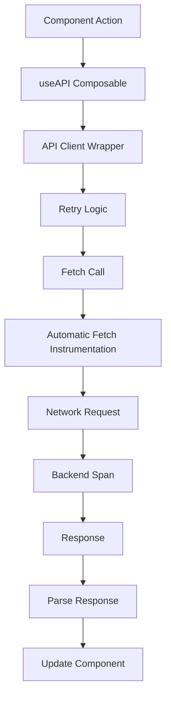

# How to Trace Vue.js API Calls with OpenTelemetry Fetch Instrumentation

Author: [nawazdhandala](https://www.github.com/nawazdhandala)

Tags: OpenTelemetry, Vue.js, Fetch, API Calls, Browser Instrumentation

Description: Master automatic and custom tracing of API calls in Vue.js applications using OpenTelemetry fetch instrumentation to track request performance, errors, and distributed traces.

API calls are the lifeblood of modern Vue.js applications. Every user interaction typically triggers at least one HTTP request, and these requests are often the slowest part of your application. Without proper tracing, you're blind to API performance issues, failed requests, and slow backends. OpenTelemetry fetch instrumentation automatically traces every HTTP request, giving you complete visibility into your application's network layer.

## Why Trace API Calls

Backend logs show when requests arrive at your server, but they don't tell you about the network latency, browser processing time, or client-side errors that happen before the request even reaches your backend. Frontend tracing fills this gap.

When you trace API calls from the browser, you see:

- Total request duration including network latency
- Time spent waiting for DNS resolution and connection establishment
- Request and response sizes
- Which API endpoints are slowest
- Failed requests and their error details
- Correlation between frontend actions and backend traces

This end-to-end visibility is critical for diagnosing performance issues and understanding the real user experience.

## Automatic Fetch Instrumentation

OpenTelemetry provides automatic instrumentation for the Fetch API. This is the easiest way to start tracing API calls.

```javascript
// src/utils/tracing.js
import { WebTracerProvider } from '@opentelemetry/sdk-trace-web';
import { BatchSpanProcessor } from '@opentelemetry/sdk-trace-base';
import { OTLPTraceExporter } from '@opentelemetry/exporter-trace-otlp-http';
import { ZoneContextManager } from '@opentelemetry/context-zone';
import { registerInstrumentations } from '@opentelemetry/instrumentation';
import { FetchInstrumentation } from '@opentelemetry/instrumentation-fetch';
import { XMLHttpRequestInstrumentation } from '@opentelemetry/instrumentation-xml-http-request';
import { Resource } from '@opentelemetry/resources';
import { SemanticResourceAttributes } from '@opentelemetry/semantic-conventions';
import { W3CTraceContextPropagator } from '@opentelemetry/core';

let provider;
let tracer;

export function initTracing(config = {}) {
  const {
    serviceName = 'vue-app',
    serviceVersion = '1.0.0',
    collectorUrl = 'http://localhost:4318/v1/traces',
    environment = 'development',
  } = config;

  // Create resource with service information
  const resource = new Resource({
    [SemanticResourceAttributes.SERVICE_NAME]: serviceName,
    [SemanticResourceAttributes.SERVICE_VERSION]: serviceVersion,
    [SemanticResourceAttributes.DEPLOYMENT_ENVIRONMENT]: environment,
  });

  // Initialize tracer provider
  provider = new WebTracerProvider({
    resource,
  });

  // Configure exporter
  const exporter = new OTLPTraceExporter({
    url: collectorUrl,
  });

  // Add span processor
  provider.addSpanProcessor(new BatchSpanProcessor(exporter));

  // Register provider with context propagation
  provider.register({
    contextManager: new ZoneContextManager(),
    propagator: new W3CTraceContextPropagator(),
  });

  // Register automatic instrumentations
  registerInstrumentations({
    instrumentations: [
      // Fetch instrumentation with custom configuration
      new FetchInstrumentation({
        // Propagate trace context to all URLs
        propagateTraceHeaderCorsUrls: [/.+/],

        // Clear timing resources after processing
        clearTimingResources: true,

        // Add custom attributes to fetch spans
        applyCustomAttributesOnSpan: (span, request, result) => {
          // Extract URL components
          const url = new URL(request.url);
          span.setAttribute('http.url.full', request.url);
          span.setAttribute('http.url.scheme', url.protocol.replace(':', ''));
          span.setAttribute('http.url.host', url.host);
          span.setAttribute('http.url.path', url.pathname);
          span.setAttribute('http.url.query', url.search);

          // Add request details
          span.setAttribute('http.request.method', request.method);

          // Add response details if available
          if (result instanceof Response) {
            span.setAttribute('http.response.status_code', result.status);
            span.setAttribute('http.response.status_text', result.statusText);

            // Add response headers
            const contentType = result.headers.get('content-type');
            if (contentType) {
              span.setAttribute('http.response.content_type', contentType);
            }

            const contentLength = result.headers.get('content-length');
            if (contentLength) {
              span.setAttribute('http.response.content_length', parseInt(contentLength));
            }
          }

          // Add timing information from Performance API
          if (typeof PerformanceObserver !== 'undefined') {
            const entries = performance.getEntriesByType('resource');
            const entry = entries.find(e => e.name === request.url);

            if (entry) {
              span.setAttribute('http.timing.dns', entry.domainLookupEnd - entry.domainLookupStart);
              span.setAttribute('http.timing.tcp', entry.connectEnd - entry.connectStart);
              span.setAttribute('http.timing.request', entry.responseStart - entry.requestStart);
              span.setAttribute('http.timing.response', entry.responseEnd - entry.responseStart);
              span.setAttribute('http.timing.total', entry.duration);
            }
          }
        },

        // Hook for request errors
        ignoreNetworkEvents: false,
      }),

      // XMLHttpRequest instrumentation for libraries that don't use fetch
      new XMLHttpRequestInstrumentation({
        propagateTraceHeaderCorsUrls: [/.+/],
      }),
    ],
  });

  tracer = provider.getTracer('vue-app-tracer');
  return tracer;
}

export function getTracer() {
  if (!tracer) {
    throw new Error('Tracing not initialized. Call initTracing() first.');
  }
  return tracer;
}

export async function shutdownTracing() {
  if (provider) {
    await provider.shutdown();
  }
}
```

Initialize tracing in your application entry point:

```javascript
// src/main.js
import { createApp } from 'vue';
import App from './App.vue';
import { initTracing } from './utils/tracing';

// Initialize tracing before anything else
initTracing({
  serviceName: 'vue-app',
  serviceVersion: '1.0.0',
  collectorUrl: import.meta.env.VITE_OTEL_COLLECTOR_URL || 'http://localhost:4318/v1/traces',
  environment: import.meta.env.MODE,
});

const app = createApp(App);
app.mount('#app');
```

## Creating an Instrumented API Client

While automatic instrumentation is great, you often want more control. Create a custom API client wrapper that adds business-specific context to spans.

```javascript
// src/api/client.js
import { trace, context, SpanStatusCode, SpanKind } from '@opentelemetry/api';
import { getTracer } from '../utils/tracing';

class APIClient {
  constructor(baseURL, options = {}) {
    this.baseURL = baseURL;
    this.defaultOptions = options;
    this.tracer = getTracer();
  }

  // Make an HTTP request with tracing
  async request(method, path, options = {}) {
    const url = new URL(path, this.baseURL).toString();

    // Create a parent span for this API call
    const span = this.tracer.startSpan(`HTTP ${method}`, {
      kind: SpanKind.CLIENT,
      attributes: {
        'http.method': method,
        'http.url': url,
        'http.target': path,
        'api.endpoint': path,
      },
    });

    return context.with(trace.setSpan(context.active(), span), async () => {
      try {
        // Merge options
        const fetchOptions = {
          ...this.defaultOptions,
          ...options,
          method,
          headers: {
            ...this.defaultOptions.headers,
            ...options.headers,
          },
        };

        // Add request body size if present
        if (options.body) {
          const bodySize = new Blob([options.body]).size;
          span.setAttribute('http.request.body.size', bodySize);
        }

        // Make the fetch call
        // Automatic fetch instrumentation will create a child span
        const response = await fetch(url, fetchOptions);

        // Add response details to parent span
        span.setAttribute('http.response.status_code', response.status);
        span.setAttribute('http.response.ok', response.ok);

        // Check for errors
        if (!response.ok) {
          span.setStatus({
            code: SpanStatusCode.ERROR,
            message: `HTTP ${response.status}: ${response.statusText}`,
          });

          span.addEvent('http.error', {
            'http.status_code': response.status,
            'http.status_text': response.statusText,
          });
        } else {
          span.setStatus({ code: SpanStatusCode.OK });
        }

        return response;
      } catch (error) {
        // Record exception in span
        span.recordException(error);
        span.setStatus({
          code: SpanStatusCode.ERROR,
          message: error.message,
        });

        throw error;
      } finally {
        span.end();
      }
    });
  }

  // Convenience methods
  async get(path, options = {}) {
    const response = await this.request('GET', path, options);
    return this.parseResponse(response);
  }

  async post(path, data, options = {}) {
    const response = await this.request('POST', path, {
      ...options,
      body: JSON.stringify(data),
      headers: {
        'Content-Type': 'application/json',
        ...options.headers,
      },
    });
    return this.parseResponse(response);
  }

  async put(path, data, options = {}) {
    const response = await this.request('PUT', path, {
      ...options,
      body: JSON.stringify(data),
      headers: {
        'Content-Type': 'application/json',
        ...options.headers,
      },
    });
    return this.parseResponse(response);
  }

  async delete(path, options = {}) {
    const response = await this.request('DELETE', path, options);
    return this.parseResponse(response);
  }

  // Parse response with tracing
  async parseResponse(response) {
    const span = this.tracer.startSpan('parse_response', {
      attributes: {
        'http.status_code': response.status,
      },
    });

    try {
      const contentType = response.headers.get('content-type');
      let data;

      if (contentType && contentType.includes('application/json')) {
        data = await response.json();
        span.setAttribute('response.type', 'json');
      } else {
        data = await response.text();
        span.setAttribute('response.type', 'text');
      }

      // Add response size
      const responseSize = new Blob([JSON.stringify(data)]).size;
      span.setAttribute('response.size', responseSize);

      span.setStatus({ code: SpanStatusCode.OK });
      return data;
    } catch (error) {
      span.recordException(error);
      span.setStatus({ code: SpanStatusCode.ERROR });
      throw error;
    } finally {
      span.end();
    }
  }
}

// Create and export a singleton instance
const apiClient = new APIClient(
  import.meta.env.VITE_API_BASE_URL || 'http://localhost:3000/api'
);

export default apiClient;
```

## Using the API Client in Components

Use the instrumented API client in your Vue components:

```vue
<!-- src/components/UserList.vue -->
<template>
  <div class="user-list">
    <h2>Users</h2>
    <div v-if="loading">Loading...</div>
    <div v-else-if="error" class="error">{{ error }}</div>
    <ul v-else>
      <li v-for="user in users" :key="user.id">
        {{ user.name }} ({{ user.email }})
      </li>
    </ul>
    <button @click="refresh">Refresh</button>
  </div>
</template>

<script>
import { ref, onMounted } from 'vue';
import apiClient from '../api/client';
import { trace, SpanStatusCode } from '@opentelemetry/api';
import { getTracer } from '../utils/tracing';

export default {
  name: 'UserList',
  setup() {
    const users = ref([]);
    const loading = ref(false);
    const error = ref(null);
    const tracer = getTracer();

    const fetchUsers = async () => {
      // Create a span for the component operation
      const span = tracer.startSpan('UserList.fetchUsers');

      loading.value = true;
      error.value = null;

      try {
        // API call will automatically create child spans
        const data = await apiClient.get('/users');
        users.value = data;

        span.setAttribute('users.count', data.length);
        span.setStatus({ code: SpanStatusCode.OK });
      } catch (err) {
        error.value = err.message;
        span.recordException(err);
        span.setStatus({ code: SpanStatusCode.ERROR });
      } finally {
        loading.value = false;
        span.end();
      }
    };

    const refresh = () => {
      fetchUsers();
    };

    onMounted(() => {
      fetchUsers();
    });

    return {
      users,
      loading,
      error,
      refresh,
    };
  },
};
</script>

<style scoped>
.error {
  color: red;
  padding: 10px;
  background: #ffeeee;
  border-radius: 4px;
}
</style>
```

## Composable for API Calls

Create a reusable composable that encapsulates API call tracing logic:

```javascript
// src/composables/useAPI.js
import { ref, getCurrentInstance } from 'vue';
import { trace, context, SpanStatusCode } from '@opentelemetry/api';
import { getTracer } from '../utils/tracing';
import apiClient from '../api/client';

export function useAPI() {
  const instance = getCurrentInstance();
  const tracer = getTracer();
  const componentName = instance?.type?.name || 'UnknownComponent';

  const loading = ref(false);
  const error = ref(null);
  const data = ref(null);

  // Execute an API call with automatic tracing
  const execute = async (apiFn, spanName) => {
    const span = tracer.startSpan(spanName || `${componentName}.api_call`, {
      attributes: {
        'component.name': componentName,
      },
    });

    loading.value = true;
    error.value = null;

    return context.with(trace.setSpan(context.active(), span), async () => {
      try {
        const result = await apiFn();
        data.value = result;
        span.setStatus({ code: SpanStatusCode.OK });
        return result;
      } catch (err) {
        error.value = err.message;
        span.recordException(err);
        span.setStatus({ code: SpanStatusCode.ERROR });
        throw err;
      } finally {
        loading.value = false;
        span.end();
      }
    });
  };

  // Convenience methods for common HTTP methods
  const get = (path, spanName) => {
    return execute(() => apiClient.get(path), spanName || `GET ${path}`);
  };

  const post = (path, body, spanName) => {
    return execute(() => apiClient.post(path, body), spanName || `POST ${path}`);
  };

  const put = (path, body, spanName) => {
    return execute(() => apiClient.put(path, body), spanName || `PUT ${path}`);
  };

  const del = (path, spanName) => {
    return execute(() => apiClient.delete(path), spanName || `DELETE ${path}`);
  };

  return {
    loading,
    error,
    data,
    execute,
    get,
    post,
    put,
    delete: del,
  };
}
```

Use the composable in components for cleaner code:

```vue
<!-- src/components/ProductDetail.vue -->
<template>
  <div class="product-detail">
    <div v-if="loading">Loading product...</div>
    <div v-else-if="error" class="error">{{ error }}</div>
    <div v-else-if="data">
      <h2>{{ data.name }}</h2>
      <p>{{ data.description }}</p>
      <p class="price">${{ data.price }}</p>
      <button @click="addToCart" :disabled="addingToCart">
        {{ addingToCart ? 'Adding...' : 'Add to Cart' }}
      </button>
    </div>
  </div>
</template>

<script>
import { ref, onMounted } from 'vue';
import { useAPI } from '../composables/useAPI';

export default {
  name: 'ProductDetail',
  props: {
    productId: {
      type: String,
      required: true,
    },
  },
  setup(props) {
    const { loading, error, data, get, post } = useAPI();
    const addingToCart = ref(false);

    onMounted(() => {
      get(`/products/${props.productId}`);
    });

    const addToCart = async () => {
      addingToCart.value = true;
      try {
        await post('/cart', {
          productId: props.productId,
          quantity: 1,
        }, 'ProductDetail.addToCart');
      } finally {
        addingToCart.value = false;
      }
    };

    return {
      loading,
      error,
      data,
      addToCart,
      addingToCart,
    };
  },
};
</script>
```

## Request Retry with Tracing

Implement retry logic with proper tracing to track retry attempts:

```javascript
// src/utils/retry.js
import { trace, context, SpanStatusCode } from '@opentelemetry/api';
import { getTracer } from './tracing';

export async function withRetry(fn, options = {}) {
  const {
    maxAttempts = 3,
    delayMs = 1000,
    backoff = true,
    shouldRetry = (error) => true,
    spanName = 'retry_operation',
  } = options;

  const tracer = getTracer();
  const span = tracer.startSpan(spanName, {
    attributes: {
      'retry.max_attempts': maxAttempts,
    },
  });

  let lastError;
  let attempt = 0;

  return context.with(trace.setSpan(context.active(), span), async () => {
    while (attempt < maxAttempts) {
      attempt++;
      span.addEvent('retry.attempt', { 'attempt': attempt });

      try {
        const result = await fn(attempt);
        span.setAttribute('retry.success', true);
        span.setAttribute('retry.attempts', attempt);
        span.setStatus({ code: SpanStatusCode.OK });
        return result;
      } catch (error) {
        lastError = error;
        span.addEvent('retry.error', {
          'attempt': attempt,
          'error': error.message,
        });

        // Check if we should retry
        if (attempt >= maxAttempts || !shouldRetry(error)) {
          break;
        }

        // Calculate delay with exponential backoff
        const delay = backoff ? delayMs * Math.pow(2, attempt - 1) : delayMs;
        span.addEvent('retry.delay', { 'delay_ms': delay });

        await new Promise(resolve => setTimeout(resolve, delay));
      }
    }

    // All attempts failed
    span.setAttribute('retry.success', false);
    span.setAttribute('retry.attempts', attempt);
    span.recordException(lastError);
    span.setStatus({ code: SpanStatusCode.ERROR });
    span.end();

    throw lastError;
  });
}
```

Use retry logic in your API client:

```javascript
// src/api/client-with-retry.js
import { APIClient } from './client';
import { withRetry } from '../utils/retry';

class RetryableAPIClient extends APIClient {
  async request(method, path, options = {}) {
    const shouldRetry = (error) => {
      // Retry on network errors or 5xx status codes
      return !error.response ||
        (error.response.status >= 500 && error.response.status < 600);
    };

    return withRetry(
      () => super.request(method, path, options),
      {
        maxAttempts: 3,
        delayMs: 1000,
        backoff: true,
        shouldRetry,
        spanName: `retry_${method}_${path}`,
      }
    );
  }
}

export default new RetryableAPIClient(
  import.meta.env.VITE_API_BASE_URL || 'http://localhost:3000/api'
);
```

## Request Deduplication

Deduplicate identical concurrent requests with tracing:

```javascript
// src/utils/request-cache.js
import { trace, SpanStatusCode } from '@opentelemetry/api';
import { getTracer } from './tracing';

class RequestCache {
  constructor() {
    this.pending = new Map();
    this.tracer = getTracer();
  }

  async dedupe(key, fn) {
    const span = this.tracer.startSpan('request.dedupe', {
      attributes: {
        'cache.key': key,
      },
    });

    // Check if request is already pending
    if (this.pending.has(key)) {
      span.setAttribute('cache.hit', true);
      span.addEvent('request.deduped');
      span.end();

      // Wait for existing request
      return this.pending.get(key);
    }

    span.setAttribute('cache.hit', false);

    // Create new request
    const promise = fn()
      .then(result => {
        this.pending.delete(key);
        span.setStatus({ code: SpanStatusCode.OK });
        return result;
      })
      .catch(error => {
        this.pending.delete(key);
        span.recordException(error);
        span.setStatus({ code: SpanStatusCode.ERROR });
        throw error;
      })
      .finally(() => {
        span.end();
      });

    this.pending.set(key, promise);
    return promise;
  }

  clear() {
    this.pending.clear();
  }
}

export const requestCache = new RequestCache();
```

## Trace Flow Visualization

Here's how API call traces flow through your application:



## Filtering Sensitive Data

Always filter sensitive data from spans:

```javascript
// src/utils/data-sanitizer.js
const SENSITIVE_PATTERNS = [
  /password/i,
  /token/i,
  /api[_-]?key/i,
  /secret/i,
  /authorization/i,
  /credit[_-]?card/i,
  /ssn/i,
];

export function sanitizeHeaders(headers) {
  const sanitized = {};

  for (const [key, value] of Object.entries(headers)) {
    if (SENSITIVE_PATTERNS.some(pattern => pattern.test(key))) {
      sanitized[key] = '[REDACTED]';
    } else {
      sanitized[key] = value;
    }
  }

  return sanitized;
}

export function sanitizeURL(url) {
  try {
    const parsed = new URL(url);
    // Remove sensitive query parameters
    for (const [key] of parsed.searchParams) {
      if (SENSITIVE_PATTERNS.some(pattern => pattern.test(key))) {
        parsed.searchParams.set(key, '[REDACTED]');
      }
    }
    return parsed.toString();
  } catch {
    return url;
  }
}
```

## Performance Monitoring

Track API performance metrics:

```javascript
// src/utils/api-metrics.js
import { getTracer } from './tracing';

class APIMetrics {
  constructor() {
    this.metrics = {
      totalRequests: 0,
      failedRequests: 0,
      averageLatency: 0,
      endpointStats: new Map(),
    };
    this.tracer = getTracer();
  }

  recordRequest(endpoint, duration, success) {
    this.metrics.totalRequests++;
    if (!success) {
      this.metrics.failedRequests++;
    }

    // Update average latency
    const prevAvg = this.metrics.averageLatency;
    const n = this.metrics.totalRequests;
    this.metrics.averageLatency = ((prevAvg * (n - 1)) + duration) / n;

    // Track per-endpoint stats
    if (!this.metrics.endpointStats.has(endpoint)) {
      this.metrics.endpointStats.set(endpoint, {
        count: 0,
        failures: 0,
        totalLatency: 0,
      });
    }

    const stats = this.metrics.endpointStats.get(endpoint);
    stats.count++;
    stats.totalLatency += duration;
    if (!success) stats.failures++;

    // Report metrics as span
    const span = this.tracer.startSpan('api.metrics', {
      attributes: {
        'metrics.total_requests': this.metrics.totalRequests,
        'metrics.failed_requests': this.metrics.failedRequests,
        'metrics.average_latency': this.metrics.averageLatency,
        'metrics.error_rate': this.metrics.failedRequests / this.metrics.totalRequests,
      },
    });
    span.end();
  }

  getMetrics() {
    return this.metrics;
  }
}

export const apiMetrics = new APIMetrics();
```

OpenTelemetry fetch instrumentation gives you complete visibility into API calls from your Vue.js application. Combined with custom spans and business context, you get detailed traces that connect user actions to backend services. This end-to-end tracing is essential for debugging performance issues and delivering great user experiences.
